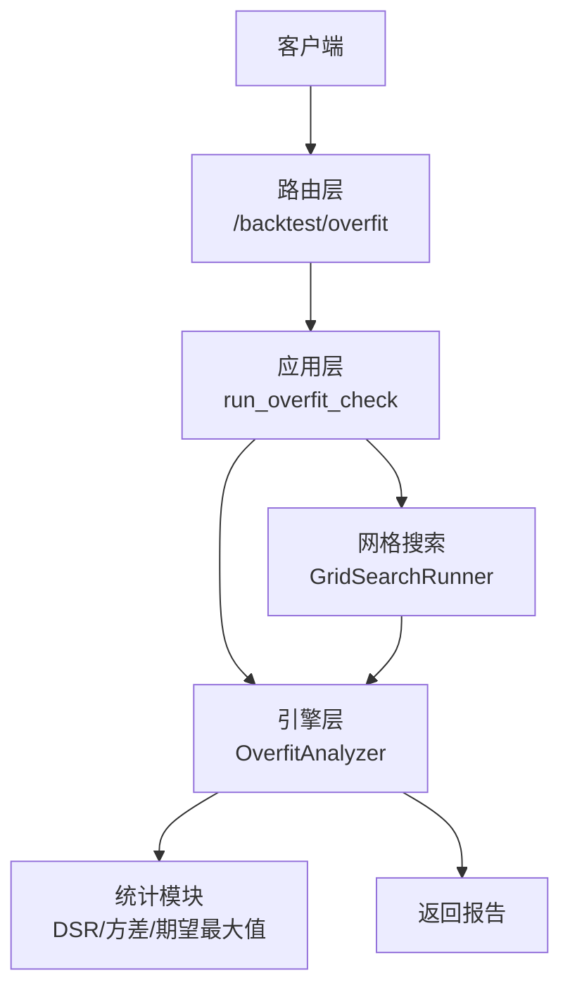
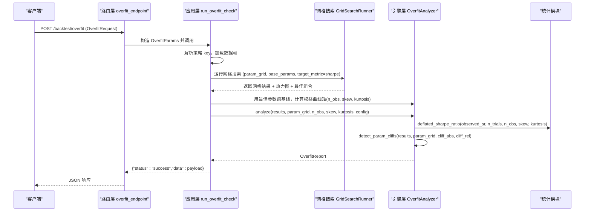
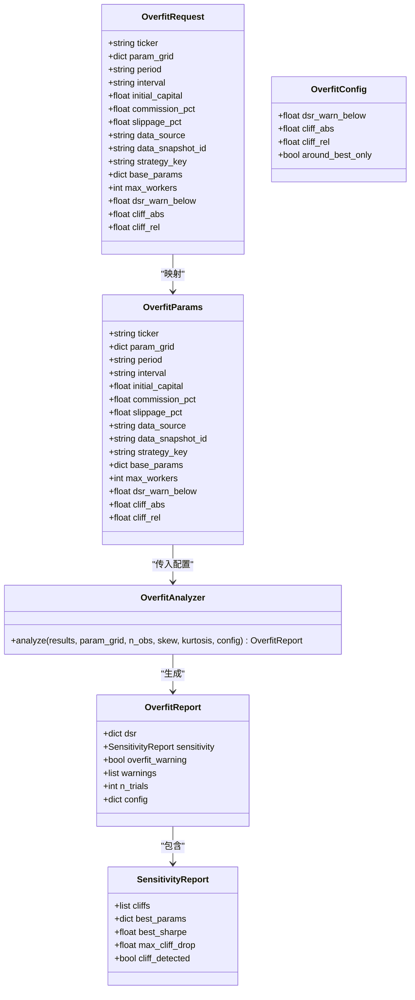

# 过拟合检测API

<cite>
**本文引用的文件**
- [backend/routers/backtest.py](file://backend/routers/backtest.py)
- [backend/app/overfit_app.py](file://backend/app/overfit_app.py)
- [backend/engine/overfit.py](file://backend/engine/overfit.py)
- [backend/app/walk_forward_app.py](file://backend/app/walk_forward_app.py)
- [backend/tests/test_overfit_bt06.py](file://backend/tests/test_overfit_bt06.py)
</cite>

## 目录
1. [简介](#简介)
2. [项目结构](#项目结构)
3. [核心组件](#核心组件)
4. [架构总览](#架构总览)
5. [详细组件分析](#详细组件分析)
6. [依赖关系分析](#依赖关系分析)
7. [性能与稳定性](#性能与稳定性)
8. [故障排查指南](#故障排查指南)
9. [结论](#结论)
10. [附录：接口规范与示例](#附录接口规范与示例)

## 简介
本文件面向量化研究员，系统化说明 Quant Agent 的“过拟合检测”能力，聚焦 POST /backtest/overfit 端点。该端点基于网格回测结果，计算 Deflated Sharpe Ratio（DSR），并检测相邻参数格的性能悬崖，从而评估策略是否存在过拟合风险。文档涵盖：
- 检测参数配置：dsr_warn_below、cliff_abs、cliff_rel
- 阈值设置与警告级别
- 不同策略类型（趋势跟踪、均值回归）的检测示例与风险评估思路
- 统计检验方法、敏感性分析与稳健性评估
- 响应数据结构：过拟合概率、参数敏感性与改进建议
- 为策略质量评估与避免数据挖掘偏见提供专业工具

## 项目结构
过拟合检测由三层协作完成：
- 路由层：定义 HTTP 接口与请求模型，映射到应用层函数
- 应用层：组装数据、执行网格搜索、调用引擎分析器
- 引擎层：实现 DSR 计算、参数悬崖检测与分析汇总

图表来源
- [backend/routers/backtest.py:298-321](file://backend/routers/backtest.py#L298-L321)
- [backend/app/overfit_app.py:52-131](file://backend/app/overfit_app.py#L52-L131)
- [backend/engine/overfit.py:305-367](file://backend/engine/overfit.py#L305-L367)

章节来源
- [backend/routers/backtest.py:125-143](file://backend/routers/backtest.py#L125-L143)
- [backend/app/overfit_app.py:27-44](file://backend/app/overfit_app.py#L27-L44)
- [backend/engine/overfit.py:277-303](file://backend/engine/overfit.py#L277-L303)

## 核心组件
- OverfitRequest：定义 /backtest/overfit 的请求体字段与默认值，包括 ticker、param_grid、period、interval、initial_capital、commission_pct、slippage_pct、data_source、data_snapshot_id、strategy_key、base_params、max_workers、dsr_warn_below、cliff_abs、cliff_rel
- run_overfit_check：应用层编排流程，拉取数据、运行网格搜索、计算权益曲线矩、调用 OverfitAnalyzer 生成报告
- OverfitAnalyzer：聚合 DSR 与参数敏感性，输出统一报告
- 统计模块：sharpe_variance、expected_max_sharpe、deflated_sharpe_ratio、returns_moments_from_equity
- 参数悬崖检测：detect_param_cliffs，识别最优参数邻域内的夏普下降

章节来源
- [backend/routers/backtest.py:125-143](file://backend/routers/backtest.py#L125-L143)
- [backend/app/overfit_app.py:52-131](file://backend/app/overfit_app.py#L52-L131)
- [backend/engine/overfit.py:88-143](file://backend/engine/overfit.py#L88-L143)
- [backend/engine/overfit.py:205-274](file://backend/engine/overfit.py#L205-L274)
- [backend/engine/overfit.py:305-367](file://backend/engine/overfit.py#L305-L367)

## 架构总览
POST /backtest/overfit 的处理序列如下：

图表来源
- [backend/routers/backtest.py:298-321](file://backend/routers/backtest.py#L298-L321)
- [backend/app/overfit_app.py:52-131](file://backend/app/overfit_app.py#L52-L131)
- [backend/engine/overfit.py:305-367](file://backend/engine/overfit.py#L305-L367)

## 详细组件分析

### 端点与请求模型
- 路径与方法：POST /backtest/overfit
- 请求体字段（OverfitRequest）：
  - ticker：标的代码
  - param_grid：多重试炼参数网格（字典，键为参数名，值为候选列表）
  - period、interval：回测周期与频率
  - initial_capital、commission_pct、slippage_pct：资金与交易成本
  - data_source、data_snapshot_id：数据来源与快照
  - strategy_key：策略键（如 sma_cross）
  - base_params：基础参数
  - max_workers：并行度
  - dsr_warn_below：DSR 警告阈值（0~1，默认 0.95）
  - cliff_abs：绝对夏普悬崖阈值（默认 0.5）
  - cliff_rel：相对夏普悬崖阈值（0~1，默认 0.35）

章节来源
- [backend/routers/backtest.py:125-143](file://backend/routers/backtest.py#L125-L143)

### 应用层处理流程
- 解析策略键并校验
- 加载历史数据帧（列名统一小写）
- 构建 VectorConfig 与 GridSearchRunner，运行网格搜索（目标指标 sharpe）
- 使用最佳参数执行一次基线回测，从权益曲线估计 n_obs、skew、kurtosis
- 调用 OverfitAnalyzer.analyze 生成报告，附加网格信息（best、n_combos、heatmap、top_results）

章节来源
- [backend/app/overfit_app.py:52-131](file://backend/app/overfit_app.py#L52-L131)

### 统计方法与算法
- Sharpe 方差修正（非正态）：考虑偏度与峰度对 SR 估计的影响
- 零假设下 N 次试验最大夏普期望上界：用于校正多重试炼选择偏差
- Deflated Sharpe Ratio：将观测 SR 与期望最大值比较，得到显著性概率（接近 1 表示稳健；偏低提示可能过拟合）
- 权益曲线矩估计：从权益序列计算日收益的偏度、峰度与样本量

章节来源
- [backend/engine/overfit.py:88-143](file://backend/engine/overfit.py#L88-L143)
- [backend/engine/overfit.py:146-160](file://backend/engine/overfit.py#L146-L160)

### 参数悬崖检测与敏感性分析
- 检测逻辑：围绕最优参数格，检查相邻参数格的夏普是否出现显著下降（绝对或相对阈值）
- 输出：悬崖列表（含参数、夏普、邻居参数、邻居夏普、下降幅度、轴）、最佳参数与夏普、最大下降、是否检测到悬崖
- 用途：识别“尖峰”参数，提示过拟合风险

章节来源
- [backend/engine/overfit.py:205-274](file://backend/engine/overfit.py#L205-L274)

### 分析器与报告结构
- OverfitAnalyzer.analyze：整合 DSR 与敏感性，生成 OverfitReport
- 报告字段：
  - dsr：包含 dsr、observed_sr、sr_star、sr_variance、z_score、n_trials、n_obs、skew、kurtosis
  - sensitivity：包含 cliffs、best_params、best_sharpe、max_cliff_drop、cliff_detected
  - overfit_warning：布尔标志
  - warnings：文本告警（DSR 低于阈值、存在悬崖等）
  - n_trials：有效试验数
  - config：本次使用的阈值配置

章节来源
- [backend/engine/overfit.py:277-303](file://backend/engine/overfit.py#L277-L303)
- [backend/engine/overfit.py:305-367](file://backend/engine/overfit.py#L305-L367)

### 类与关系图

图表来源
- [backend/routers/backtest.py:125-143](file://backend/routers/backtest.py#L125-L143)
- [backend/app/overfit_app.py:27-44](file://backend/app/overfit_app.py#L27-L44)
- [backend/engine/overfit.py:277-303](file://backend/engine/overfit.py#L277-L303)
- [backend/engine/overfit.py:305-367](file://backend/engine/overfit.py#L305-L367)

## 依赖关系分析
- 路由层依赖应用层函数 run_overfit_check
- 应用层依赖：
  - 数据加载：load_backtest_frame
  - 网格搜索：GridSearchRunner
  - 引擎分析：OverfitAnalyzer
- 引擎层依赖统计模块进行 DSR 与悬崖检测
- 策略注册表：walk_forward_app 中维护 STRATEGY_REGISTRY，当前内置策略键为 sma_cross

章节来源
- [backend/routers/backtest.py:298-321](file://backend/routers/backtest.py#L298-L321)
- [backend/app/overfit_app.py:12-24](file://backend/app/overfit_app.py#L12-L24)
- [backend/app/walk_forward_app.py:22-24](file://backend/app/walk_forward_app.py#L22-L24)

## 性能与稳定性
- 并发控制：max_workers 控制网格搜索并行度，默认 1，可提升至 16
- 数值稳定性：Sharpe 方差与期望最大值计算中对极端值做了保护（如最小方差截断）
- 鲁棒性：无有效网格结果时，仍返回安全报告并给出告警
- 测试覆盖：单元测试验证 DSR 单调性、悬崖检测、异常映射等关键行为

章节来源
- [backend/routers/backtest.py:125-143](file://backend/routers/backtest.py#L125-L143)
- [backend/engine/overfit.py:103-113](file://backend/engine/overfit.py#L103-L113)
- [backend/engine/overfit.py:319-335](file://backend/engine/overfit.py#L319-L335)
- [backend/tests/test_overfit_bt06.py:28-55](file://backend/tests/test_overfit_bt06.py#L28-L55)
- [backend/tests/test_overfit_bt06.py:57-115](file://backend/tests/test_overfit_bt06.py#L57-L115)
- [backend/tests/test_overfit_bt06.py:117-136](file://backend/tests/test_overfit_bt06.py#L117-L136)

## 故障排查指南
- 常见错误：
  - 空网格：param_grid 为空会抛出错误，需确保至少一个参数的多值网格
  - 未知策略键：strategy_key 不在注册表中会报错，请检查可用策略键
  - 数据加载失败：BacktestDataError 会被转换为 400 错误
- 诊断要点：
  - 检查 param_grid 维度与策略参数匹配
  - 确认数据源与 period/interval 设置合理
  - 查看 warnings 字段中的具体告警信息（DSR 低、悬崖等）

章节来源
- [backend/app/overfit_app.py:58-74](file://backend/app/overfit_app.py#L58-L74)
- [backend/app/walk_forward_app.py:53-57](file://backend/app/walk_forward_app.py#L53-L57)
- [backend/routers/backtest.py:318-321](file://backend/routers/backtest.py#L318-L321)
- [backend/tests/test_overfit_bt06.py:117-136](file://backend/tests/test_overfit_bt06.py#L117-L136)

## 结论
POST /backtest/overfit 提供了系统化的过拟合检测能力，通过 DSR 校正多重试炼偏差，并结合参数悬崖检测识别“尖峰”参数。该接口适合在策略研发阶段进行质量评估与稳健性审查，帮助量化研究员避免数据挖掘偏见，提升策略的实战可靠性。

## 附录：接口规范与示例

### 接口定义
- 路径：POST /backtest/overfit
- 请求体（OverfitRequest）关键字段：
  - ticker：标的代码
  - param_grid：参数网格（例如 {"period":[10,20,30],"fast":[5,10]}）
  - period、interval：回测区间与频率
  - initial_capital、commission_pct、slippage_pct：资金与成本
  - data_source、data_snapshot_id：数据来源
  - strategy_key：策略键（如 sma_cross）
  - base_params：基础参数
  - max_workers：并行度
  - dsr_warn_below：DSR 警告阈值（默认 0.95）
  - cliff_abs：绝对夏普悬崖阈值（默认 0.5）
  - cliff_rel：相对夏普悬崖阈值（默认 0.35）

章节来源
- [backend/routers/backtest.py:125-143](file://backend/routers/backtest.py#L125-L143)

### 响应数据结构
- status：字符串，成功时为 "success"
- data：对象，包含：
  - dsr：包含 dsr、observed_sr、sr_star、sr_variance、z_score、n_trials、n_obs、skew、kurtosis
  - sensitivity：包含 cliffs、best_params、best_sharpe、max_cliff_drop、cliff_detected
  - overfit_warning：布尔标志
  - warnings：文本告警列表
  - n_trials：有效试验数
  - config：本次使用的阈值配置
  - grid：包含 best、n_combos、n_ok、heatmap、top_results
  - data_source_msg：数据源消息
  - strategy_key：策略键
  - ticker：标的代码
  - strategies_available：可用策略键列表

章节来源
- [backend/app/overfit_app.py:119-131](file://backend/app/overfit_app.py#L119-L131)
- [backend/engine/overfit.py:294-303](file://backend/engine/overfit.py#L294-L303)

### 阈值与警告级别
- dsr_warn_below：当 DSR < 阈值时触发告警，默认 0.95
- cliff_abs：绝对夏普下降超过此值触发悬崖告警，默认 0.5
- cliff_rel：相对夏普下降比例超过此值触发悬崖告警，默认 0.35
- 警告内容：
  - “Deflated Sharpe=... < ...”（DSR 过低）
  - “最优参数邻域存在性能悬崖 max_drop=...（N 处）”

章节来源
- [backend/engine/overfit.py:277-303](file://backend/engine/overfit.py#L277-L303)
- [backend/engine/overfit.py:347-354](file://backend/engine/overfit.py#L347-L354)

### 不同策略类型的检测示例与风险评估思路
- 趋势跟踪策略（如 SMA 交叉）：
  - 典型参数：短期均线、长期均线窗口
  - 风险关注：参数尖峰导致高夏普但邻域性能骤降
  - 建议：扩大参数范围、降低网格密度、结合 Walk-Forward 验证
- 均值回归策略：
  - 典型参数：偏离阈值、反转窗口、波动率过滤
  - 风险关注：过度拟合噪声导致不稳定信号
  - 建议：引入稳健性检验（蒙特卡洛重排、Bootstrap），提高样本外表现

（本节为概念性指导，不直接引用具体代码文件）

### 统计检验方法、敏感性分析与稳健性评估
- 统计检验：
  - Sharpe 方差修正：考虑偏度与峰度
  - 期望最大值：校正多重试炼选择偏差
  - DSR：综合观测 SR 与期望最大值，得到显著性概率
- 敏感性分析：
  - 参数悬崖检测：识别邻域性能下降
  - 热力图：可视化参数空间性能分布
- 稳健性评估：
  - 结合 Walk-Forward 滚动验证
  - 蒙特卡洛重排/自助抽样评估尾部风险

章节来源
- [backend/engine/overfit.py:88-143](file://backend/engine/overfit.py#L88-L143)
- [backend/engine/overfit.py:205-274](file://backend/engine/overfit.py#L205-L274)
- [backend/app/overfit_app.py:100-117](file://backend/app/overfit_app.py#L100-L117)
