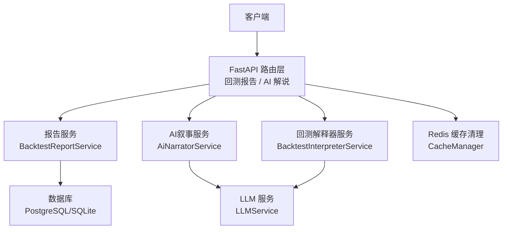
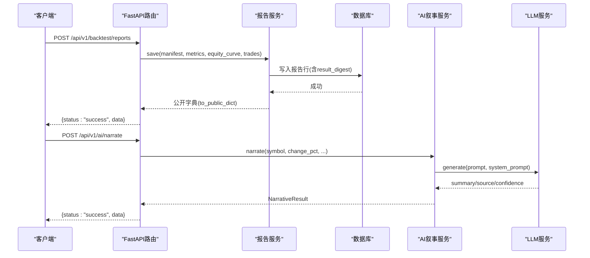
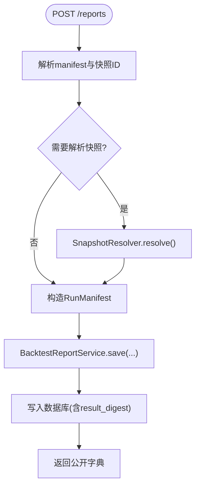
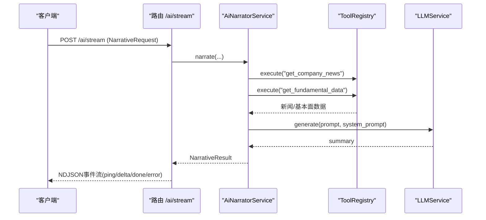
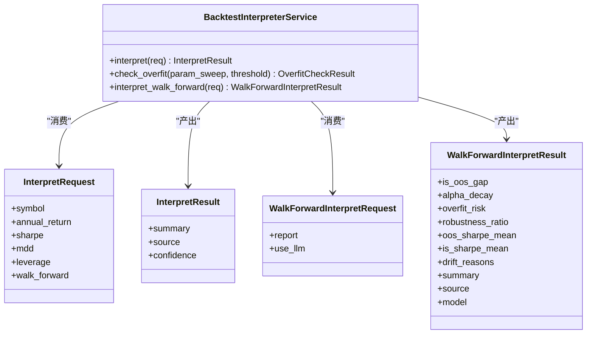
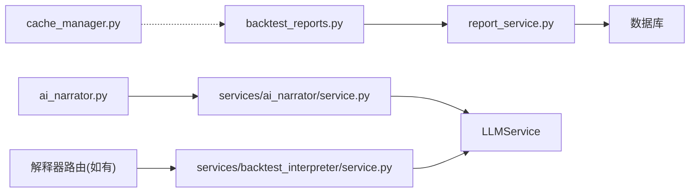

# 报告分析API

<cite>
**本文引用的文件**
- [backtest_reports.py](file://backend/routers/backtest_reports.py)
- [report_service.py](file://backend/app/backtest/report_service.py)
- [ai_narrator.py](file://backend/routers/ai_narrator.py)
- [service.py](file://backend/services/ai_narrator/service.py)
- [models.py](file://backend/services/backtest_interpreter/models.py)
- [service.py](file://backend/services/backtest_interpreter/service.py)
- [cache_manager.py](file://backend/core/cache_manager.py)
</cite>

## 目录
1. [简介](#简介)
2. [项目结构](#项目结构)
3. [核心组件](#核心组件)
4. [架构总览](#架构总览)
5. [详细组件分析](#详细组件分析)
6. [依赖关系分析](#依赖关系分析)
7. [性能与缓存策略](#性能与缓存策略)
8. [故障排查指南](#故障排查指南)
9. [结论](#结论)
10. [附录：接口清单与示例](#附录接口清单与示例)

## 简介
本文件面向量化团队，系统化文档化“回测报告分析”相关的RESTful API，覆盖回测结果持久化与查询、AI智能解读（异动解说、回测报告一句话解读、Walk-Forward联合研判）、健康度评估与过拟合检测、指标计算与可视化数据导出等能力。文档包含URL路径、请求参数、响应格式、JSON示例、LLM集成机制、缓存策略、性能优化与批量处理能力说明，帮助快速集成并高效使用。

## 项目结构
围绕“报告分析”的API主要分布在以下模块：
- 回测报告持久化与查询：后端路由与报告服务
- AI异动解说：路由与AI叙事服务（含流式输出）
- 回测报告解读与过拟合检测：解释器服务与模型契约
- 缓存清理：统一Redis缓存清理工具

图表来源
- [backtest_reports.py:82-149](file://backend/routers/backtest_reports.py#L82-L149)
- [report_service.py:58-166](file://backend/app/backtest/report_service.py#L58-L166)
- [ai_narrator.py:25-80](file://backend/routers/ai_narrator.py#L25-L80)
- [service.py:36-144](file://backend/services/ai_narrator/service.py#L36-L144)
- [service.py:234-310](file://backend/services/backtest_interpreter/service.py#L234-L310)
- [cache_manager.py:47-75](file://backend/core/cache_manager.py#L47-L75)

章节来源
- [backtest_reports.py:1-192](file://backend/routers/backtest_reports.py#L1-L192)
- [report_service.py:1-166](file://backend/app/backtest/report_service.py#L1-L166)
- [ai_narrator.py:1-81](file://backend/routers/ai_narrator.py#L1-L81)
- [service.py:36-144](file://backend/services/ai_narrator/service.py#L36-L144)
- [models.py:12-86](file://backend/services/backtest_interpreter/models.py#L12-L86)
- [service.py:234-310](file://backend/services/backtest_interpreter/service.py#L234-L310)
- [cache_manager.py:1-75](file://backend/core/cache_manager.py#L1-L75)

## 核心组件
- 回测报告服务：负责将回测结果（指标、权益曲线、交易明细）与可复现指纹（代码哈希、数据快照、随机种子、引擎版本）持久化，并提供按run_id或可复现键查询的能力。
- AI异动解说服务：采集真实新闻与基本面数据，调用LLM生成一句话解说，支持同步与NDJSON流式返回。
- 回测解释器服务：基于真实回测指标进行一句话解读，提供过拟合检测（纯计算），以及Walk-Forward滚动验证报告的联合解读。
- 缓存清理工具：集中清理业务缓存（行情/K线/新闻/宏观/内幕等），保护交易态数据不被误删。

章节来源
- [report_service.py:58-166](file://backend/app/backtest/report_service.py#L58-L166)
- [service.py:36-144](file://backend/services/ai_narrator/service.py#L36-L144)
- [service.py:234-310](file://backend/services/backtest_interpreter/service.py#L234-L310)
- [cache_manager.py:47-75](file://backend/core/cache_manager.py#L47-L75)

## 架构总览
整体采用“路由层 + 服务层 + LLM/存储”的分层架构。路由层暴露HTTP端点；服务层封装业务逻辑与外部依赖；LLM用于文本归纳与解读；数据库用于报告持久化；Redis用于缓存与清理。

图表来源
- [backtest_reports.py:82-121](file://backend/routers/backtest_reports.py#L82-L121)
- [report_service.py:64-129](file://backend/app/backtest/report_service.py#L64-L129)
- [ai_narrator.py:25-37](file://backend/routers/ai_narrator.py#L25-L37)
- [service.py:43-73](file://backend/services/ai_narrator/service.py#L43-L73)

## 详细组件分析

### 回测报告持久化与查询
- 功能要点
  - 持久化回测报告，绑定可复现性指纹（code_hash、manifest_hash、params、random_seed）。
  - 支持通过run_id获取报告，或通过reproducibility_key/code_hash列表查询。
  - 自动解析数据快照（snapshot_id -> manifest_hash/data_mode）。
  - 计算result_digest用于同输入同输出的断言。
- 关键流程
  - 接收持久化请求，校验并解析快照引用，构造RunManifest，保存至数据库，返回公开字段。
  - 列表查询支持分页限制（limit<=100）。
- 错误处理
  - 快照解析失败返回400。
  - run_id不存在返回404。

图表来源
- [backtest_reports.py:82-121](file://backend/routers/backtest_reports.py#L82-L121)
- [report_service.py:64-129](file://backend/app/backtest/report_service.py#L64-L129)

章节来源
- [backtest_reports.py:82-149](file://backend/routers/backtest_reports.py#L82-L149)
- [report_service.py:20-44](file://backend/app/backtest/report_service.py#L20-L44)
- [report_service.py:58-166](file://backend/app/backtest/report_service.py#L58-L166)

### AI异动解说（同步与流式）
- 功能要点
  - 同步接口：根据标的涨跌幅与阈值，采集公司新闻与基本面数据，调用LLM生成一句话解说，附带来源与置信度。
  - 流式接口：以NDJSON事件流形式逐段推送摘要文本，首包ping占位，done携带结构化结果，error事件不中断流。
- 数据处理
  - 并发采集新闻与基本面，失败不影响其他数据源。
  - 格式化数据精简后喂给LLM，控制token消耗。
- 降级策略
  - LLM异常时返回原始数据片段作为兜底解说。

图表来源
- [ai_narrator.py:40-80](file://backend/routers/ai_narrator.py#L40-L80)
- [service.py:43-73](file://backend/services/ai_narrator/service.py#L43-L73)
- [service.py:76-144](file://backend/services/ai_narrator/service.py#L76-L144)

章节来源
- [ai_narrator.py:25-80](file://backend/routers/ai_narrator.py#L25-L80)
- [service.py:36-144](file://backend/services/ai_narrator/service.py#L36-L144)

### 回测报告解读与过拟合检测
- 功能要点
  - interpret：输入年化收益、夏普、最大回撤、杠杆倍数，可选Walk-Forward结论，生成≤80字的一句话解读，明确判别“收益是否来自杠杆而非Alpha”。
  - check_overfit：纯计算，基于参数敏感性（max-min)/max判断过拟合风险。
  - interpret_walk_forward：对Walk-Forward滚动验证报告进行自动判定（IS/OOS缺口、Alpha衰减、过拟合风险），并可经LLM生成一句话解读。
- 降级策略
  - LLM失败时回退到确定性裸研判，严格零幻觉。

图表来源
- [service.py:234-310](file://backend/services/backtest_interpreter/service.py#L234-L310)
- [models.py:12-86](file://backend/services/backtest_interpreter/models.py#L12-L86)

章节来源
- [service.py:29-119](file://backend/services/backtest_interpreter/service.py#L29-L119)
- [service.py:186-232](file://backend/services/backtest_interpreter/service.py#L186-L232)
- [service.py:234-310](file://backend/services/backtest_interpreter/service.py#L234-L310)
- [models.py:12-86](file://backend/services/backtest_interpreter/models.py#L12-L86)

### 健康度评估与绩效归因
- 健康度评估
  - 通过过拟合检测（参数敏感性阈值）与Walk-Forward报告中的漂移原因综合评估策略健康度。
  - 结合Alpha衰减信号与稳健性比例给出“稳健/衰减/过拟合”的健康标签。
- 绩效归因
  - 从回测指标中识别收益来源（杠杆放大 vs Alpha驱动），并在解读中显式标注。
  - Walk-Forward联合信号用于归因外推稳健性。

章节来源
- [service.py:102-119](file://backend/services/backtest_interpreter/service.py#L102-L119)
- [service.py:186-232](file://backend/services/backtest_interpreter/service.py#L186-L232)
- [service.py:234-310](file://backend/services/backtest_interpreter/service.py#L234-L310)

## 依赖关系分析
- 路由层依赖服务层：
  - backtest_reports.py 依赖 report_service.py
  - ai_narrator.py 依赖 services/ai_narrator/service.py
  - 解释器路由（若有）依赖 services/backtest_interpreter/service.py
- 服务层依赖：
  - 报告服务依赖数据库模型与数据快照解析
  - AI叙事服务依赖工具注册表与LLM服务
  - 解释器服务依赖LLM服务与纯计算函数
- 缓存清理独立于业务流，供运维或管理接口调用

图表来源
- [backtest_reports.py:82-149](file://backend/routers/backtest_reports.py#L82-L149)
- [report_service.py:58-166](file://backend/app/backtest/report_service.py#L58-L166)
- [ai_narrator.py:25-80](file://backend/routers/ai_narrator.py#L25-L80)
- [service.py:36-144](file://backend/services/ai_narrator/service.py#L36-L144)
- [service.py:234-310](file://backend/services/backtest_interpreter/service.py#L234-L310)
- [cache_manager.py:47-75](file://backend/core/cache_manager.py#L47-L75)

章节来源
- [backtest_reports.py:82-149](file://backend/routers/backtest_reports.py#L82-L149)
- [report_service.py:58-166](file://backend/app/backtest/report_service.py#L58-L166)
- [ai_narrator.py:25-80](file://backend/routers/ai_narrator.py#L25-L80)
- [service.py:36-144](file://backend/services/ai_narrator/service.py#L36-L144)
- [service.py:234-310](file://backend/services/backtest_interpreter/service.py#L234-L310)
- [cache_manager.py:47-75](file://backend/core/cache_manager.py#L47-L75)

## 性能与缓存策略
- 缓存清理
  - 提供统一清理接口，按前缀扫描并删除业务缓存（K线、新闻、宏观、内幕等），保护交易态数据（OMS状态、持仓、挂单）不被误删。
  - 支持批量模式，scan+delete循环，统计清理数量。
- 性能优化建议
  - 列表查询限制limit上限（默认20，最大100），避免大结果集。
  - 流式输出减少首包延迟，提升交互体验。
  - LLM调用失败有降级策略，保障可用性。
  - 结果digest用于幂等与一致性校验，便于缓存命中与对比。

章节来源
- [cache_manager.py:47-75](file://backend/core/cache_manager.py#L47-L75)
- [backtest_reports.py:133-149](file://backend/routers/backtest_reports.py#L133-L149)
- [ai_narrator.py:40-80](file://backend/routers/ai_narrator.py#L40-L80)
- [report_service.py:36-44](file://backend/app/backtest/report_service.py#L36-L44)

## 故障排查指南
- 常见错误
  - 快照解析失败：检查data_snapshot_id是否存在且有效，确认manifest_hash是否正确。
  - 报告不存在：确认run_id是否正确，或是否已持久化。
  - LLM异常：查看日志，确认下游服务可用性与提示词长度；系统会自动降级为原始数据片段或确定性研判。
- 定位方法
  - 查看路由与服务层日志，关注异常堆栈与降级分支。
  - 使用缓存清理工具恢复缓存一致性（谨慎操作，避免误删交易态数据）。

章节来源
- [backtest_reports.py:90-98](file://backend/routers/backtest_reports.py#L90-L98)
- [backtest_reports.py:124-130](file://backend/routers/backtest_reports.py#L124-L130)
- [service.py:123-144](file://backend/services/ai_narrator/service.py#L123-L144)
- [service.py:257-263](file://backend/services/backtest_interpreter/service.py#L257-L263)
- [cache_manager.py:47-75](file://backend/core/cache_manager.py#L47-L75)

## 结论
本报告分析API提供了完整的回测结果持久化、AI智能解读、健康度评估与过拟合检测能力，并通过流式输出与降级策略保障高可用与良好体验。结合缓存清理与性能优化建议，可为量化团队提供智能化、可复现、可扩展的回测结果分析工具。

## 附录：接口清单与示例

### 回测报告
- 持久化报告
  - URL: POST /api/v1/backtest/reports
  - 请求体关键字段: manifest(run_id, mode, code_hash, params, data_snapshot_id, manifest_hash, random_seed, engine_version, data_mode, reproducible), metrics, equity_curve, trades, symbol, notes, resolve_snapshot
  - 响应: {status, message, data: 公开字典, timestamp}
  - 公开字典字段: run_id, data_snapshot_id, manifest_hash, code_hash, params, random_seed, engine_version, data_mode, reproducible, reproducibility_key, metrics, equity_curve, trades, result_digest, symbol, created_at, badge(code_hash, manifest_hash, reproducible)
- 获取报告
  - URL: GET /api/v1/backtest/reports/{run_id}
  - 响应: {status, message, data: 公开字典, timestamp}
- 列表查询
  - URL: GET /api/v1/backtest/reports?reproducibility_key=&code_hash=&limit=20
  - 响应: {status, message, data: [公开字典...], timestamp}
- 注册快照（测试/联调）
  - URL: POST /api/v1/backtest/snapshots/register
  - 请求体: snapshot_id, as_of_date, files, ticker_count
  - 响应: {status, message, data: {snapshot_id, manifest_hash, status}, timestamp}

章节来源
- [backtest_reports.py:28-51](file://backend/routers/backtest_reports.py#L28-L51)
- [backtest_reports.py:82-121](file://backend/routers/backtest_reports.py#L82-L121)
- [backtest_reports.py:124-149](file://backend/routers/backtest_reports.py#L124-L149)
- [backtest_reports.py:152-191](file://backend/routers/backtest_reports.py#L152-L191)
- [report_service.py:142-166](file://backend/app/backtest/report_service.py#L142-L166)

### AI异动解说
- 同步解说
  - URL: POST /api/v1/ai/narrate
  - 请求体: symbol, change_pct, direction, threshold, include_pattern_winrate, pattern_winrate, pattern_name
  - 响应: {status, data: NarrativeResult{symbol, direction, change_pct, threshold, summary, source, confidence, triggered_by, pattern_winrate}}
- 流式解说
  - URL: POST /api/v1/ai/stream
  - 协议: NDJSON事件流
    - ping: {"event":"ping"}
    - delta: {"event":"delta","data":{"symbol":..,"text":..}}
    - done: {"event":"done","data":NarrativeResult}
    - error: {"event":"error","data":".."}

章节来源
- [ai_narrator.py:25-37](file://backend/routers/ai_narrator.py#L25-L37)
- [ai_narrator.py:40-80](file://backend/routers/ai_narrator.py#L40-L80)
- [service.py:43-73](file://backend/services/ai_narrator/service.py#L43-L73)

### 回测报告解读与过拟合检测
- 一句话解读
  - URL: POST /api/v1/backtest/interpret（若存在路由）
  - 请求体: InterpretRequest{symbol, annual_return, sharpe, mdd, leverage, walk_forward}
  - 响应: InterpretResult{summary, source, confidence}
- 过拟合检测
  - URL: POST /api/v1/backtest/overfit（若存在路由）
  - 请求体: OverfitCheckRequest{param_sweep[ParamSweep], threshold}
  - 响应: OverfitCheckResult{overfit, max_sensitivity, threshold}
- Walk-Forward联合解读
  - URL: POST /api/v1/backtest/wf-interpret（若存在路由）
  - 请求体: WalkForwardInterpretRequest{report, use_llm}
  - 响应: WalkForwardInterpretResult{is_oos_gap, alpha_decay, overfit_risk, robustness_ratio, oos_sharpe_mean, is_sharpe_mean, drift_reasons, summary, source, model}

章节来源
- [models.py:12-86](file://backend/services/backtest_interpreter/models.py#L12-L86)
- [service.py:234-310](file://backend/services/backtest_interpreter/service.py#L234-L310)

### 缓存清理
- 清理缓存
  - URL: 由管理接口调用（例如内部或运维接口）
  - 行为: 按前缀扫描并删除业务缓存，跳过受保护前缀（OMS相关）
  - 返回: 清理key数量

章节来源
- [cache_manager.py:47-75](file://backend/core/cache_manager.py#L47-L75)
