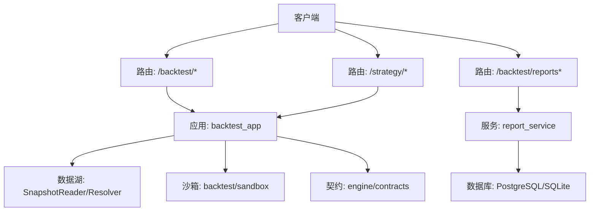
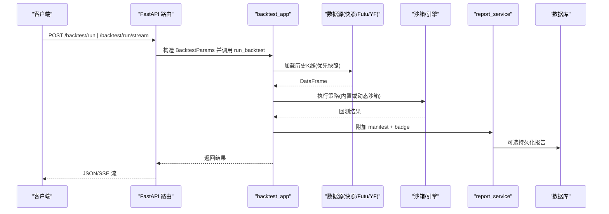
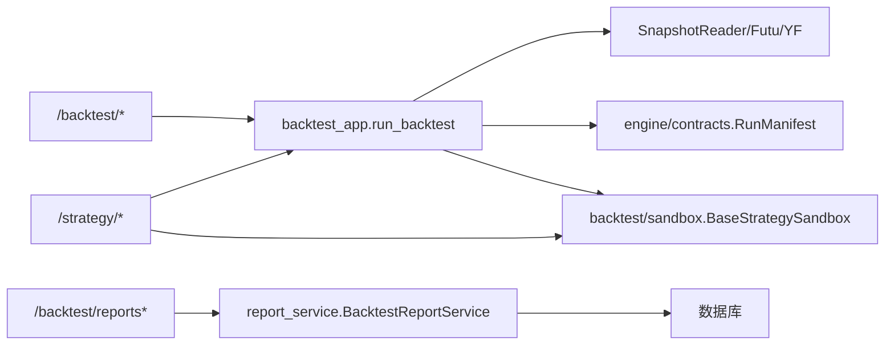

# 策略回测API

<cite>
**本文引用的文件**
- [backend/routers/backtest.py](file://backend/routers/backtest.py)
- [backend/routers/backtest_reports.py](file://backend/routers/backtest_reports.py)
- [backend/routers/strategy_sandbox.py](file://backend/routers/strategy_sandbox.py)
- [backend/app/backtest_app.py](file://backend/app/backtest_app.py)
- [backend/backtest/sandbox.py](file://backend/backtest/sandbox.py)
- [backend/app/backtest/report_service.py](file://backend/app/backtest/report_service.py)
- [backend/engine/contracts.py](file://backend/engine/contracts.py)
- [backend/core/security.py](file://backend/core/security.py)
</cite>

## 目录
1. [简介](#简介)
2. [项目结构](#项目结构)
3. [核心组件](#核心组件)
4. [架构总览](#架构总览)
5. [详细接口说明](#详细接口说明)
6. [依赖关系分析](#依赖关系分析)
7. [性能与并发](#性能与并发)
8. [故障排查指南](#故障排查指南)
9. [结论](#结论)
10. [附录：请求/响应示例](#附录请求响应示例)

## 简介
本文件为 Quant Agent 的策略回测 RESTful API 文档，覆盖策略提交、回测执行、结果查询、报告生成等端点；包含异步任务处理机制（SSE 流式进度）、沙箱环境隔离与安全策略、资源限制与错误码说明，并提供完整的 JSON 请求/响应示例与最佳实践建议。

## 项目结构
后端采用 FastAPI 路由分层组织：
- 路由层：按功能划分 routers（backtest、backtest_reports、strategy_sandbox）
- 应用层：业务编排 app（backtest_app 等）
- 引擎与沙箱：engine/contracts、backtest/sandbox
- 服务层：report_service、datalake 快照解析等

图表来源
- [backend/routers/backtest.py:43-385](file://backend/routers/backtest.py#L43-L385)
- [backend/routers/backtest_reports.py:25-192](file://backend/routers/backtest_reports.py#L25-L192)
- [backend/routers/strategy_sandbox.py:37-852](file://backend/routers/strategy_sandbox.py#L37-L852)
- [backend/app/backtest_app.py:72-357](file://backend/app/backtest_app.py#L72-L357)
- [backend/app/backtest/report_service.py:58-166](file://backend/app/backtest/report_service.py#L58-L166)
- [backend/engine/contracts.py:124-162](file://backend/engine/contracts.py#L124-L162)
- [backend/backtest/sandbox.py:26-145](file://backend/backtest/sandbox.py#L26-L145)

章节来源
- [backend/routers/backtest.py:43-385](file://backend/routers/backtest.py#L43-L385)
- [backend/routers/backtest_reports.py:25-192](file://backend/routers/backtest_reports.py#L25-L192)
- [backend/routers/strategy_sandbox.py:37-852](file://backend/routers/strategy_sandbox.py#L37-L852)
- [backend/app/backtest_app.py:72-357](file://backend/app/backtest_app.py#L72-L357)
- [backend/app/backtest/report_service.py:58-166](file://backend/app/backtest/report_service.py#L58-L166)
- [backend/engine/contracts.py:124-162](file://backend/engine/contracts.py#L124-L162)
- [backend/backtest/sandbox.py:26-145](file://backend/backtest/sandbox.py#L26-L145)

## 核心组件
- 路由层
  - /backtest/*：标准回测、滚动验证、蒙特卡洛、网格搜索、过拟合检测、AI 解读与健康度汇总
  - /backtest/reports*：报告持久化、查询、快照注册
  - /strategy/*：策略沙箱运行、优化、批量推演、蒙特卡洛压力测试、部署到 OMS
- 应用层
  - backtest_app：数据加载（Snapshot → Futu → YFinance）、执行内置/动态策略、附加可复现性摘要
- 服务层
  - report_service：报告持久化、可复现性指纹计算、结果摘要
- 引擎契约
  - contracts：RunManifest、Bar、OrderIntent 等统一数据结构
- 沙箱安全
  - sandbox：AST 白名单、高危模块拦截、目录穿越防护、超时/内存熔断、BaseStrategySandbox

章节来源
- [backend/routers/backtest.py:46-385](file://backend/routers/backtest.py#L46-L385)
- [backend/routers/backtest_reports.py:28-192](file://backend/routers/backtest_reports.py#L28-L192)
- [backend/routers/strategy_sandbox.py:100-852](file://backend/routers/strategy_sandbox.py#L100-L852)
- [backend/app/backtest_app.py:54-357](file://backend/app/backtest_app.py#L54-L357)
- [backend/app/backtest/report_service.py:20-166](file://backend/app/backtest/report_service.py#L20-L166)
- [backend/engine/contracts.py:29-162](file://backend/engine/contracts.py#L29-L162)
- [backend/backtest/sandbox.py:26-432](file://backend/backtest/sandbox.py#L26-L432)

## 架构总览

图表来源
- [backend/routers/backtest.py:145-218](file://backend/routers/backtest.py#L145-L218)
- [backend/app/backtest_app.py:72-357](file://backend/app/backtest_app.py#L72-L357)
- [backend/app/backtest/report_service.py:58-166](file://backend/app/backtest/report_service.py#L58-L166)

## 详细接口说明

### 1) 策略提交与回测执行
- 基础回测
  - URL: POST /backtest/run
  - 用途: 拉取历史数据并运行回测（支持内置策略或动态策略代码）
  - 请求体字段: ticker, period, interval, initial_capital, atr_multiplier, commission_pct, slippage_pct, data_source, debug_mode, data_snapshot_id, random_seed, source_code, class_name, params
  - 响应: {status, data}，data 含 metrics、equity_curve、trades、manifest、badge
- 流式回测（SSE）
  - URL: POST /backtest/run/stream
  - 用途: 实时推送撮合阶段进度，结束时返回完整 Tear Sheet
  - 响应: application/x-ndjson 流，事件类型包括 progress/result/error
- 滚动验证（Walk-Forward）
  - URL: POST /backtest/walk-forward
  - 用途: 滚动窗口训练/验证 + 性能漂移检测
  - 请求体字段: ticker, period, interval, initial_capital, commission_pct, slippage_pct, data_source, data_snapshot_id, strategy_key, params, param_grid, train_bars, test_bars, step_bars, anchored, target_metric
- 蒙特卡洛压测
  - URL: POST /backtest/monte-carlo
  - 用途: 交易序列重排/自助抽样，输出分位曲线与最坏回撤
  - 请求体字段: ticker, period, interval, initial_capital, commission_pct, slippage_pct, data_source, data_snapshot_id, strategy_key, params, iterations, method, seed
- 参数网格搜索
  - URL: POST /backtest/grid-search
  - 用途: 并发回测 + 夏普热力图矩阵
  - 请求体字段: ticker, param_grid, period, interval, initial_capital, commission_pct, slippage_pct, data_source, data_snapshot_id, strategy_key, base_params, target_metric, max_workers, heatmap_x, heatmap_y
- 过拟合检测
  - URL: POST /backtest/overfit
  - 用途: Deflated Sharpe Ratio + 相邻参数格性能悬崖检测
  - 请求体字段: ticker, param_grid, period, interval, initial_capital, commission_pct, slippage_pct, data_source, data_snapshot_id, strategy_key, base_params, max_workers, dsr_warn_below, cliff_abs, cliff_rel
- AI 解读与健康度
  - URL: POST /backtest/interpret
  - 用途: 对回测 Tear Sheet 进行一句话解读（含杠杆/Alpha 判别）
  - URL: POST /backtest/overfit-check
  - 用途: 过拟合检测（参数敏感性差异阈值预警）
  - URL: POST /backtest/overfit-check/grid
  - 用途: 基于网格搜索结果派生参数敏感性并检测过拟合
  - URL: POST /backtest/interpret/walk-forward
  - 用途: 吃 Walk-Forward 报告，自动判过拟合 + Alpha 衰减，可经 LLM 一句话解读
  - URL: GET /backtest/health
  - 用途: 返回所有标的最近回测健康度

章节来源
- [backend/routers/backtest.py:46-385](file://backend/routers/backtest.py#L46-L385)

### 2) 报告持久化与查询
- 持久化报告
  - URL: POST /backtest/reports
  - 用途: 持久化回测报告，绑定 code_hash + manifest_hash + params + seed
  - 请求体字段: manifest(run_id, mode, code_hash, params, data_snapshot_id, manifest_hash, random_seed, engine_version, data_mode, reproducible), metrics, equity_curve, trades, symbol, notes, resolve_snapshot
  - 响应: {status, message, data}
- 按 run_id 获取报告
  - URL: GET /backtest/reports/{run_id}
  - 响应: {status, message, data}
- 列表查询
  - URL: GET /backtest/reports?reproducibility_key=&code_hash=&limit=
  - 响应: {status, message, data: [...]}
- 注册快照（测试/运维）
  - URL: POST /backtest/snapshots/register
  - 用途: 注册 published 快照元数据（生产由 DQ-03b 写入）

章节来源
- [backend/routers/backtest_reports.py:28-192](file://backend/routers/backtest_reports.py#L28-L192)
- [backend/app/backtest/report_service.py:58-166](file://backend/app/backtest/report_service.py#L58-L166)
- [backend/engine/contracts.py:124-162](file://backend/engine/contracts.py#L124-L162)

### 3) 策略沙箱接口
- 流式沙箱回测
  - URL: POST /strategy/run-sandbox/stream
  - 用途: SSE 流式回测，实时推送撮合进度，结束返回完整报告
  - 请求体字段: source_code, class_name, params, ticker, period, interval, initial_capital, data_source, debug_mode, data_snapshot_id, random_seed, persist_report, env
  - 鉴权: 用户认证 + 限流（按用户维度）
- 非流式沙箱回测
  - URL: POST /strategy/run-sandbox
  - 用途: 接收动态策略代码与参数，放入本地沙箱极速回测
  - 鉴权: 用户认证 + 限流
- 沙箱参数优化
  - URL: POST /strategy/optimize-sandbox
  - 用途: 并发网格寻优，返回 Top 组合
  - 鉴权: 用户认证
- 批量回测
  - URL: POST /strategy/run-batch-sandbox
  - 用途: 针对选股池结果横截面批量并发回测
  - 鉴权: 用户认证
- 蒙特卡洛压力测试
  - URL: POST /strategy/monte-carlo-sandbox
  - 用途: 注入随机噪音进行多次模拟，验证策略鲁棒性
  - 鉴权: 用户认证
- 部署到 OMS
  - URL: POST /strategy/deploy-to-oms
  - 用途: 将沙箱中跑通的最优策略物理持久化，并通过 BotRuntimeManager 启动真实 Bot 算力节点（受 REAL_TRADE_EXECUTE 控制）
  - 鉴权: 用户认证

章节来源
- [backend/routers/strategy_sandbox.py:100-852](file://backend/routers/strategy_sandbox.py#L100-L852)

### 4) 异步任务与进度跟踪
- 流式接口使用 SSE（application/x-ndjson），事件类型：
  - progress: 包含 progress、stage、detail
  - result: 最终回测结果（含 manifest、badge）
  - error: 错误信息（message、error_code）
- 进度推进关键点：
  - 数据加载阶段（Snapshot/Futu/YFinance）
  - 策略执行阶段（内置策略或动态沙箱）
  - 可复现性摘要附加阶段（manifest/badge）
- 限流与认证：
  - 策略沙箱接口通过 RateLimiter（Redis 实现）与 get_current_user 保护
  - 默认限制：每用户 60 秒内最多 10 次请求

章节来源
- [backend/routers/backtest.py:170-218](file://backend/routers/backtest.py#L170-L218)
- [backend/routers/strategy_sandbox.py:63-94](file://backend/routers/strategy_sandbox.py#L63-L94)
- [backend/routers/strategy_sandbox.py:495-516](file://backend/routers/strategy_sandbox.py#L495-L516)
- [backend/app/backtest_app.py:299-357](file://backend/app/backtest_app.py#L299-L357)

### 5) 沙箱环境隔离、资源限制与安全策略
- 源码净化与白名单
  - 剥离危险 import（如 talib、BaseStrategy）
  - AST 级扫描：禁止 eval/exec/open/compile/globals/locals 等反射与动态执行
  - 仅允许安全模块导入（numpy/pandas/math/scipy/sklearn/lightgbm/xgboost/numba 等）
- 装饰器白名单
  - 仅放行 Numba JIT 相关装饰器（njit/jit/vectorize/guvectorize/cfunc/stencil）
- 文件系统隔离
  - 强制 open() 路径在 sandbox_workspace 目录下，防目录穿越
- 运行时保护
  - 超时熔断：基于 sys.settrace 的执行时间监控
  - 内存熔断：psutil 采样检查 RSS，超过阈值中断
  - 递归/while 循环拦截：防止栈溢出与死循环
  - range(len(...)) 与大常数范围拦截：防止 OOM
- 环境变量开关
  - ENGINE_ALLOW_LIVE_DATA：是否允许 live 数据模式
  - REAL_TRADE_EXECUTE：是否允许真实交易部署（否则仅纸面部署）

章节来源
- [backend/backtest/sandbox.py:26-145](file://backend/backtest/sandbox.py#L26-L145)
- [backend/backtest/sandbox.py:147-325](file://backend/backtest/sandbox.py#L147-L325)
- [backend/backtest/sandbox.py:352-415](file://backend/backtest/sandbox.py#L352-L415)
- [backend/routers/strategy_sandbox.py:363-373](file://backend/routers/strategy_sandbox.py#L363-L373)
- [backend/routers/strategy_sandbox.py:743-790](file://backend/routers/strategy_sandbox.py#L743-L790)

### 6) 错误处理与状态码
- 400 Bad Request
  - 数据不可用（BacktestDataError）
  - 快照解析失败（SnapshotResolveError）
  - 参数不合法（Pydantic 校验）
- 401 Unauthorized
  - 内部签名缺失或无效（HMAC-SHA256）
- 404 Not Found
  - 报告不存在
- 429 Too Many Requests
  - 触发限流
- 自定义错误码
  - SANDBOX_RUNTIME_ERROR：沙箱运行崩溃
  - BACKTEST_REPORT_ERROR：报告持久化错误

章节来源
- [backend/routers/backtest.py:145-168](file://backend/routers/backtest.py#L145-L168)
- [backend/routers/backtest_reports.py:72-79](file://backend/routers/backtest_reports.py#L72-L79)
- [backend/routers/strategy_sandbox.py:564-612](file://backend/routers/strategy_sandbox.py#L564-L612)
- [backend/core/security.py:121-142](file://backend/core/security.py#L121-L142)

## 依赖关系分析

图表来源
- [backend/routers/backtest.py:145-385](file://backend/routers/backtest.py#L145-L385)
- [backend/app/backtest_app.py:72-357](file://backend/app/backtest_app.py#L72-L357)
- [backend/routers/backtest_reports.py:82-149](file://backend/routers/backtest_reports.py#L82-L149)
- [backend/routers/strategy_sandbox.py:495-852](file://backend/routers/strategy_sandbox.py#L495-L852)

章节来源
- [backend/routers/backtest.py:145-385](file://backend/routers/backtest.py#L145-L385)
- [backend/app/backtest_app.py:72-357](file://backend/app/backtest_app.py#L72-L357)
- [backend/routers/backtest_reports.py:82-149](file://backend/routers/backtest_reports.py#L82-L149)
- [backend/routers/strategy_sandbox.py:495-852](file://backend/routers/strategy_sandbox.py#L495-L852)

## 性能与并发
- CPU 密集任务卸载至进程池（run_cpu_bound），对象不可 pickle 时自动回退线程
- 网格搜索与批量回测支持并发（max_workers 控制）
- SSE 流式响应禁用代理缓冲，保证进度实时下推
- 数据源优先级：Snapshot → Futu → YFinance，命中缓存减少重复 IO
- 限流：Redis 计数窗口，避免滥用

章节来源
- [backend/app/backtest_app.py:166-222](file://backend/app/backtest_app.py#L166-L222)
- [backend/routers/strategy_sandbox.py:615-655](file://backend/routers/strategy_sandbox.py#L615-L655)
- [backend/routers/strategy_sandbox.py:658-694](file://backend/routers/strategy_sandbox.py#L658-L694)
- [backend/routers/backtest.py:170-218](file://backend/routers/backtest.py#L170-L218)

## 故障排查指南
- 数据加载失败
  - 检查 data_source 与 data_snapshot_id，确认 SnapshotReader 可用
  - 若使用 live 数据，需设置 ENGINE_ALLOW_LIVE_DATA=true
- 沙箱运行崩溃
  - 查看 error_code 与 traceback，定位语法/缩进/非法 import
  - 关注 while/递归/大 range 被拦截提示
- 报告未持久化
  - 检查 manifest 字段（code_hash、manifest_hash、random_seed）
  - 确认 resolve_snapshot 与数据快照存在
- 限流触发
  - 降低请求频率或调整 RateLimiter 配置
- 内部签名失败
  - 确保 X-Internal-Sig 头格式正确且未过期

章节来源
- [backend/routers/backtest.py:145-168](file://backend/routers/backtest.py#L145-L168)
- [backend/routers/strategy_sandbox.py:564-612](file://backend/routers/strategy_sandbox.py#L564-L612)
- [backend/routers/backtest_reports.py:82-121](file://backend/routers/backtest_reports.py#L82-L121)
- [backend/core/security.py:121-142](file://backend/core/security.py#L121-L142)

## 结论
本 API 提供从策略提交、回测执行、结果查询到报告生成的完整链路，结合 SSE 流式进度、严格沙箱安全与资源限制，满足量化策略开发与回测集成的需求。建议在生产环境中启用快照数据模式与固定随机种子，以获得可复现的回测结果。

## 附录：请求/响应示例

### 1) 基础回测请求
- 方法: POST
- 路径: /backtest/run
- 请求体示例:
{
  "ticker": "US.AAPL",
  "period": "2y",
  "interval": "1d",
  "initial_capital": 100000.0,
  "atr_multiplier": 2.0,
  "commission_pct": 0.0005,
  "slippage_pct": 0.001,
  "data_source": "auto",
  "debug_mode": false,
  "data_snapshot_id": null,
  "random_seed": 42,
  "source_code": null,
  "class_name": null,
  "params": {}
}
- 响应示例:
{
  "status": "success",
  "data": {
    "metrics": {},
    "equity_curve": [],
    "trades": [],
    "manifest": {
      "run_id": "uuid",
      "code_hash": "sha256...",
      "data_snapshot_id": "latest_published",
      "manifest_hash": "sha256...",
      "random_seed": 42,
      "data_mode": "snapshot",
      "reproducible": true,
      "engine_version": "1.0.0"
    },
    "badge": {
      "code_hash": "abc123def456",
      "manifest_hash": "xyz789uvw012",
      "reproducible": true,
      "data_snapshot_id": "latest_published",
      "data_mode": "snapshot"
    }
  }
}

章节来源
- [backend/routers/backtest.py:46-168](file://backend/routers/backtest.py#L46-L168)
- [backend/app/backtest_app.py:287-296](file://backend/app/backtest_app.py#L287-L296)
- [backend/engine/contracts.py:124-162](file://backend/engine/contracts.py#L124-L162)

### 2) 流式回测（SSE）
- 方法: POST
- 路径: /backtest/run/stream
- 请求体: 同基础回测
- 响应: application/x-ndjson 流
- 事件示例:
{"type":"progress","progress":15,"stage":"data","detail":"已加载 504 根 K 线"}
{"type":"result","data":{"metrics":{},"equity_curve":[],"trades":[],"manifest":{},"badge":{}}}
{"type":"error","message":"数据加载失败: ..."}

章节来源
- [backend/routers/backtest.py:170-218](file://backend/routers/backtest.py#L170-L218)
- [backend/app/backtest_app.py:299-357](file://backend/app/backtest_app.py#L299-L357)

### 3) 报告持久化
- 方法: POST
- 路径: /backtest/reports
- 请求体示例:
{
  "manifest": {
    "run_id": "uuid",
    "mode": "backtest",
    "code_hash": "sha256...",
    "params": {},
    "data_snapshot_id": "snap_20240101",
    "manifest_hash": "sha256...",
    "random_seed": 42,
    "engine_version": "1.0.0",
    "data_mode": "snapshot",
    "reproducible": true
  },
  "metrics": {"sharpe": 1.2, "total_return": 0.15},
  "equity_curve": [{"time":"...","equity":100000}],
  "trades": [],
  "symbol": "US.AAPL",
  "notes": "首次回测",
  "resolve_snapshot": true
}
- 响应示例:
{
  "status": "success",
  "message": "回测报告已持久化",
  "data": {
    "run_id": "uuid",
    "metrics": {"sharpe": 1.2, "total_return": 0.15},
    "equity_curve": [{"time":"...","equity":100000}],
    "trades": [],
    "symbol": "US.AAPL",
    "created_at": "2024-01-01T00:00:00Z",
    "badge": {
      "code_hash": "abc123def456",
      "manifest_hash": "xyz789uvw012",
      "reproducible": true
    }
  }
}

章节来源
- [backend/routers/backtest_reports.py:28-121](file://backend/routers/backtest_reports.py#L28-L121)
- [backend/app/backtest/report_service.py:58-166](file://backend/app/backtest/report_service.py#L58-L166)

### 4) 策略沙箱运行
- 方法: POST
- 路径: /strategy/run-sandbox
- 请求体示例:
{
  "source_code": "from backend.backtest import BaseStrategySandbox as BaseStrategy\nimport numpy as np\nclass MyStrategy(BaseStrategy):\n    def __init__(self):\n        self._position_size = 0\n    def has_position(self):\n        return self._position_size != 0\n    def get_position(self):\n        return self._position_data",
  "class_name": "MyStrategy",
  "params": {"initial_capital": 100000.0},
  "ticker": "US.AAPL",
  "period": "1y",
  "interval": "1d",
  "initial_capital": 100000.0,
  "data_source": "auto",
  "debug_mode": false,
  "data_snapshot_id": null,
  "random_seed": 42,
  "persist_report": false,
  "env": "sandbox"
}
- 响应示例:
{
  "status": "success",
  "message": "真实历史推演完成",
  "data": {
    "metrics": {},
    "equity_curve": [],
    "trades": [],
    "manifest": {},
    "badge": {}
  }
}

章节来源
- [backend/routers/strategy_sandbox.py:100-114](file://backend/routers/strategy_sandbox.py#L100-L114)
- [backend/routers/strategy_sandbox.py:521-562](file://backend/routers/strategy_sandbox.py#L521-L562)
- [backend/backtest/sandbox.py:417-432](file://backend/backtest/sandbox.py#L417-L432)

### 5) 部署到 OMS
- 方法: POST
- 路径: /strategy/deploy-to-oms
- 行为:
  - 若 REAL_TRADE_EXECUTE=false：仅记录文件，标记 draft（纸面部署）
  - 若 REAL_TRADE_EXECUTE=true：写 live 目录并启动 Bot 节点
- 响应示例（纸面）:
{
  "status": "success",
  "message": "SANDBOX 纸面部署已记录 (REAL_TRADE_EXECUTE 未开启, 未向 OMS 发送真实订单)。",
  "data": {"env": "sandbox", "file": "/path/to/live/my_strategy.py"}
}
- 响应示例（真实）:
{
  "status": "success",
  "message": "策略已物理挂载至 /path/to/live/my_strategy.py，Bot 算力节点 bot_my_strategy_xxx 已启动！",
  "data": {"env": "live", "bot_id": "bot_my_strategy_xxx", "file": "/path/to/live/my_strategy.py"}
}

章节来源
- [backend/routers/strategy_sandbox.py:743-790](file://backend/routers/strategy_sandbox.py#L743-L790)