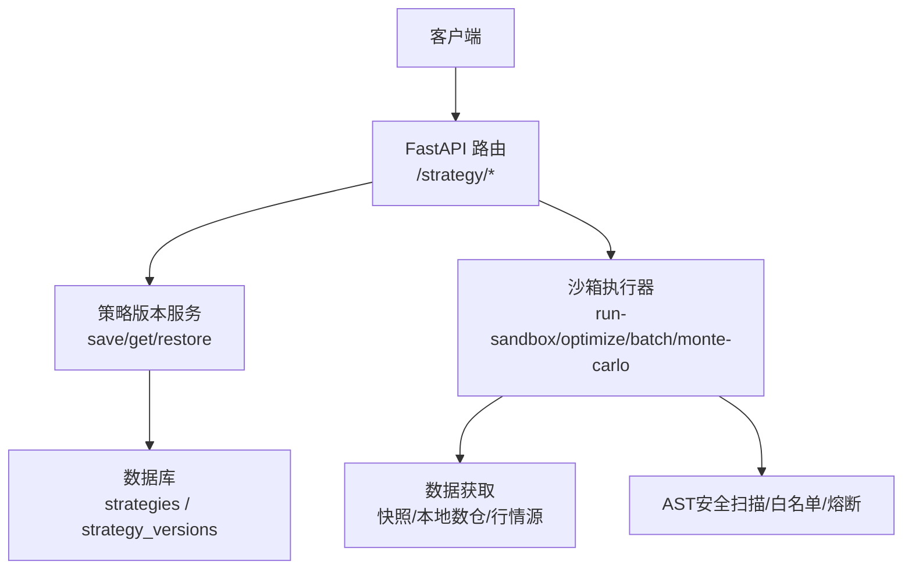
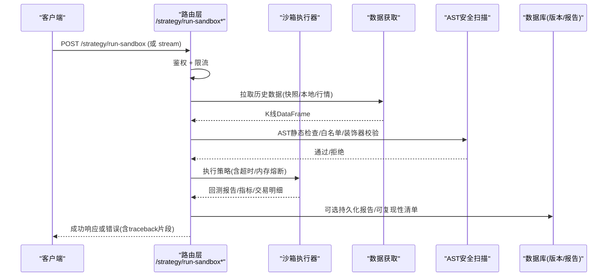
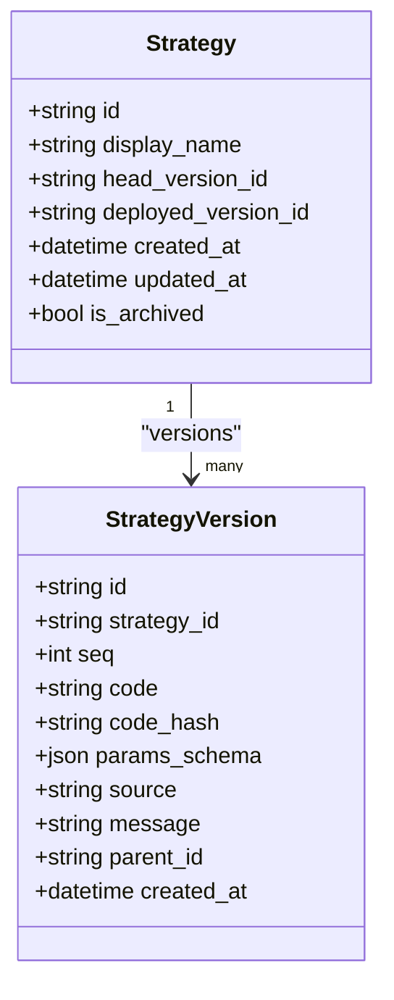

# 策略管理API

<cite>
**本文引用的文件**
- [backend/routers/strategy.py](file://backend/routers/strategy.py)
- [backend/routers/strategy_sandbox.py](file://backend/routers/strategy_sandbox.py)
- [backend/services/strategy_version_service.py](file://backend/services/strategy_version_service.py)
- [backend/backtest/sandbox.py](file://backend/backtest/sandbox.py)
- [backend/core/models.py](file://backend/core/models.py)
</cite>

## 目录
1. [简介](#简介)
2. [项目结构](#项目结构)
3. [核心组件](#核心组件)
4. [架构总览](#架构总览)
5. [详细接口说明](#详细接口说明)
6. [依赖关系分析](#依赖关系分析)
7. [性能与资源限制](#性能与资源限制)
8. [故障排查指南](#故障排查指南)
9. [结论](#结论)
10. [附录：生命周期与最佳实践](#附录生命周期与最佳实践)

## 简介
本文件为 Quant Agent 的策略管理 RESTful API 文档，覆盖策略代码上传、版本管理、沙箱环境执行（回测、寻优、批量推演、蒙特卡洛压力测试）、以及部署到OMS的完整流程。文档包含每个端点的URL路径、请求参数、响应格式、错误码与安全机制，并给出开发/测试/部署各阶段的调用建议与最佳实践。

## 项目结构
策略管理相关能力由以下模块协作完成：
- 路由层：提供HTTP端点，负责鉴权、限流、参数校验与结果封装
- 服务层：策略版本CRUD、幂等保存、恢复等
- 沙箱执行层：AST安全扫描、危险模块拦截、超时/内存熔断、数据源适配
- 数据模型：策略主表与版本表，用于版本溯源与可复现性

图表来源
- [backend/routers/strategy.py:26-585](file://backend/routers/strategy.py#L26-L585)
- [backend/routers/strategy_sandbox.py:37-852](file://backend/routers/strategy_sandbox.py#L37-L852)
- [backend/services/strategy_version_service.py:1-243](file://backend/services/strategy_version_service.py#L1-L243)
- [backend/backtest/sandbox.py:1-432](file://backend/backtest/sandbox.py#L1-L432)
- [backend/core/models.py:351-393](file://backend/core/models.py#L351-L393)

章节来源
- [backend/routers/strategy.py:26-585](file://backend/routers/strategy.py#L26-L585)
- [backend/routers/strategy_sandbox.py:37-852](file://backend/routers/strategy_sandbox.py#L37-L852)
- [backend/services/strategy_version_service.py:1-243](file://backend/services/strategy_version_service.py#L1-L243)
- [backend/backtest/sandbox.py:1-432](file://backend/backtest/sandbox.py#L1-L432)
- [backend/core/models.py:351-393](file://backend/core/models.py#L351-L393)

## 核心组件
- 策略草稿与列表：保存/读取/删除策略源码，维护草稿状态（draft/backtested/deployed）
- 策略版本管理：幂等保存、查询时间线、按ID获取详情、恢复历史版本
- 沙箱执行：单标的回测、网格寻优、批量横截面回测、蒙特卡洛压力测试、SSE流式进度
- 部署到OMS：将沙箱验证通过的策略持久化至live目录，并根据环境变量决定是否启动真实Bot节点
- 安全与风控：AST级静态检查、危险模块拦截、目录穿越防护、超时/内存熔断、限流与黑名单

章节来源
- [backend/routers/strategy.py:75-585](file://backend/routers/strategy.py#L75-L585)
- [backend/routers/strategy_sandbox.py:97-852](file://backend/routers/strategy_sandbox.py#L97-L852)
- [backend/services/strategy_version_service.py:18-203](file://backend/services/strategy_version_service.py#L18-L203)
- [backend/backtest/sandbox.py:26-432](file://backend/backtest/sandbox.py#L26-L432)

## 架构总览
下图展示了从客户端发起策略回测到返回结果的端到端流程，包括鉴权、限流、数据获取、AST校验、沙箱执行与报告附加可复现性信息。

图表来源
- [backend/routers/strategy_sandbox.py:495-613](file://backend/routers/strategy_sandbox.py#L495-L613)
- [backend/backtest/sandbox.py:326-415](file://backend/backtest/sandbox.py#L326-L415)
- [backend/routers/strategy_sandbox.py:376-434](file://backend/routers/strategy_sandbox.py#L376-L434)

## 详细接口说明

### 通用约定
- 基础路径：/strategy
- 鉴权：多数接口需要登录用户上下文
- 限流：部分接口使用基于Redis的细粒度限流，支持按IP或用户维度；全局防刷保护
- 统一响应：status字段表示成功/失败，data/message携带业务数据或错误信息

### 策略草稿与版本管理

#### 解析策略配置
- 方法：POST
- 路径：/strategy/parse-config
- 用途：接收在线编辑器的源码，解析动态表单配置（参数类型、默认值、枚举等）
- 请求体：
  - source_code: string
- 响应：
  - status: success|error
  - data: 解析后的参数Schema（键名、类型、默认值、描述等）
- 备注：用于前端渲染参数面板

章节来源
- [backend/routers/strategy.py:317-321](file://backend/routers/strategy.py#L317-L321)

#### 生成策略代码（AI辅助）
- 方法：POST
- 路径：/strategy/generate
- 用途：调用大模型生成符合规范的策略源码（VectorBT风格、矢量化信号、禁止外部库等）
- 请求体：
  - prompt: string
- 响应：SSE流式NDJSON
  - 事件示例：
    - {"status":"reasoning","data":"..."}
    - {"status":"success","data":"..."}
    - {"status":"error","message":"..."}
- 注意：立即下发首个回车保持连接；长思考期间每0.5秒保活

章节来源
- [backend/routers/strategy.py:324-414](file://backend/routers/strategy.py#L324-L414)

#### 格式化代码
- 方法：POST
- 路径：/strategy/format
- 用途：对源码进行Black格式化
- 请求体：
  - source_code: string
- 响应：
  - status: success|error
  - data: 格式化后的源码（成功时）

章节来源
- [backend/routers/strategy.py:417-428](file://backend/routers/strategy.py#L417-L428)

#### 保存策略（草稿+版本）
- 方法：POST
- 路径：/strategy/save
- 用途：保存源码到草稿目录，并创建版本记录（幂等：同hash不重复）
- 请求体：
  - source_code: string
  - class_name: string
  - message: string（可选）
- 响应：
  - status: success|error
  - data:
    - formatted_code: string
    - version_id: string
    - seq: int
    - code_hash: string（前8位）
- 副作用：更新草稿状态（若后续回测/部署会更新为 backtested/deployed）

章节来源
- [backend/routers/strategy.py:431-475](file://backend/routers/strategy.py#L431-L475)
- [backend/services/strategy_version_service.py:23-120](file://backend/services/strategy_version_service.py#L23-L120)

#### 列出草稿策略
- 方法：GET
- 路径：/strategy/list
- 用途：返回草稿目录中的策略文件列表及状态（draft/backtested/deployed）
- 响应：
  - status: success|error
  - data: 数组，每项包含 name/lang/version/status/modified 等

章节来源
- [backend/routers/strategy.py:478-518](file://backend/routers/strategy.py#L478-L518)

#### 获取策略版本时间线
- 方法：GET
- 路径：/strategy/{name}/versions
- 查询参数：
  - limit: int（默认50）
- 响应：
  - status: success|error
  - data: 版本列表（seq倒序），包含 id/seq/source/message/code_hash/created_at 等

章节来源
- [backend/routers/strategy.py:526-530](file://backend/routers/strategy.py#L526-L530)
- [backend/services/strategy_version_service.py:123-156](file://backend/services/strategy_version_service.py#L123-L156)

#### 获取单个版本详情（含源码）
- 方法：GET
- 路径：/strategy/versions/{version_id}
- 响应：
  - status: success|error
  - data: 版本详情（id/strategy_id/seq/code/code_hash/source/message/parent_id/params_schema/created_at）

章节来源
- [backend/routers/strategy.py:533-539](file://backend/routers/strategy.py#L533-L539)
- [backend/services/strategy_version_service.py:159-176](file://backend/services/strategy_version_service.py#L159-L176)

#### 恢复指定版本
- 方法：POST
- 路径：/strategy/{name}/restore
- 请求体：
  - version_id: string
- 响应：
  - status: success|error
  - data: 新版本的元信息（source=restore，parent_id指向被恢复版本）

章节来源
- [backend/routers/strategy.py:542-557](file://backend/routers/strategy.py#L542-L557)
- [backend/services/strategy_version_service.py:179-202](file://backend/services/strategy_version_service.py#L179-L202)

#### 获取草稿源码
- 方法：GET
- 路径：/strategy/draft/{name}
- 响应：
  - status: success|error
  - data: { source_code: string }

章节来源
- [backend/routers/strategy.py:560-570](file://backend/routers/strategy.py#L560-L570)

#### 删除草稿
- 方法：DELETE
- 路径：/strategy/draft/{name}
- 响应：
  - status: success|error
  - message: 操作结果

章节来源
- [backend/routers/strategy.py:573-585](file://backend/routers/strategy.py#L573-L585)

### 沙箱执行（回测/寻优/批量/蒙特卡洛）

#### 非流式回测
- 方法：POST
- 路径：/strategy/run-sandbox
- 请求体：
  - source_code: string
  - class_name: string
  - params: dict
  - ticker: string（默认 US.AAPL）
  - period: string（如 1y/2y/5y/max 等）
  - interval: string（1d/1m/5m/15m/1h）
  - initial_capital: float（默认 100000.0）
  - data_source: string（auto/local/snapshot/futu/yfinance）
  - debug_mode: bool
  - data_snapshot_id: string（可选）
  - random_seed: int（可选）
  - persist_report: bool（是否持久化报告）
  - env: string（sandbox/live，默认 sandbox）
- 响应：
  - status: success|error
  - data: 回测报告（指标、权益曲线、交易明细、manifest等）
- 行为：
  - 数据优先使用快照（latest_published），否则降级到本地数仓或行情源
  - 成功后标记草稿状态为 backtested

章节来源
- [backend/routers/strategy_sandbox.py:97-114](file://backend/routers/strategy_sandbox.py#L97-L114)
- [backend/routers/strategy_sandbox.py:156-357](file://backend/routers/strategy_sandbox.py#L156-L357)
- [backend/routers/strategy_sandbox.py:521-613](file://backend/routers/strategy_sandbox.py#L521-L613)

#### 流式回测（SSE）
- 方法：POST
- 路径：/strategy/run-sandbox/stream
- 请求体：同上
- 响应：SSE流式NDJSON
  - 事件：
    - {"type":"progress","data":...}
    - {"type":"result","data":...}
    - {"type":"error","message":"...","error_code":"SANDBOX_RUNTIME_ERROR"}
- 优势：实时推送撮合进度，适合长时间运行

章节来源
- [backend/routers/strategy_sandbox.py:449-515](file://backend/routers/strategy_sandbox.py#L449-L515)

#### 网格寻优
- 方法：POST
- 路径：/strategy/optimize-sandbox
- 请求体：
  - source_code/class_name/param_grid/ticker/period/interval/target_metric/initial_capital/data_source
- 响应：
  - status: success|error
  - data: Top参数组合及对应指标

章节来源
- [backend/routers/strategy_sandbox.py:615-655](file://backend/routers/strategy_sandbox.py#L615-L655)

#### 批量横截面回测
- 方法：POST
- 路径：/strategy/run-batch-sandbox
- 请求体：
  - source_code/class_name/params/tickers[]/period/interval/initial_capital/data_source
- 响应：
  - status: success|error
  - data: 批量回测汇总结果

章节来源
- [backend/routers/strategy_sandbox.py:658-694](file://backend/routers/strategy_sandbox.py#L658-L694)

#### 蒙特卡洛压力测试
- 方法：POST
- 路径：/strategy/monte-carlo-sandbox
- 请求体：
  - source_code/class_name/params/ticker/period/interval/initial_capital/iterations/noise_level/data_source/noise_distribution
- 响应：
  - status: success|error
  - data: 鲁棒性统计摘要

章节来源
- [backend/routers/strategy_sandbox.py:697-740](file://backend/routers/strategy_sandbox.py#L697-L740)

#### 部署到OMS
- 方法：POST
- 路径：/strategy/deploy-to-oms
- 请求体：与 run-sandbox 相同（含 class_name/source_code/params/ticker/env 等）
- 行为：
  - 将策略源码写入 live 目录
  - 若 REAL_TRADE_EXECUTE=false：仅记录纸面部署（不启动真实Bot），状态标记为 draft
  - 若 REAL_TRADE_EXECUTE=true：启动真实Bot节点，状态标记为 deployed
- 响应：
  - status: success|error
  - data: { env, file, bot_id? }

章节来源
- [backend/routers/strategy_sandbox.py:743-790](file://backend/routers/strategy_sandbox.py#L743-L790)

### 数据获取与可复现性
- 数据源优先级：快照（latest_published）→ 本地数仓 → Futu/AKShare/Finnhub → yfinance
- 可复现性：为每次回测附加 manifest（code_hash、snapshot_id、random_seed、data_mode），支持持久化报告

章节来源
- [backend/routers/strategy_sandbox.py:156-357](file://backend/routers/strategy_sandbox.py#L156-L357)
- [backend/routers/strategy_sandbox.py:376-434](file://backend/routers/strategy_sandbox.py#L376-L434)

## 依赖关系分析
- 路由层依赖：
  - 鉴权中间件（get_current_user）
  - 限流器（RateLimiter，基于Redis）
  - 策略版本服务（save/get/restore）
  - 沙箱执行器（run_dynamic_sandbox_backtest、run_grid_search_backtest、run_batch_sandbox_backtest、run_monte_carlo_stress_test）
- 沙箱执行依赖：
  - 数据获取（kline_warehouse、market_data、SnapshotReader）
  - 安全扫描（AST白名单、危险模块拦截、装饰器校验）
  - 超时/内存熔断（SandboxTimeoutTracer）
- 数据模型：
  - Strategy/StrategyVersion：策略主表与版本表，唯一约束保证幂等

图表来源
- [backend/core/models.py:351-393](file://backend/core/models.py#L351-L393)

章节来源
- [backend/routers/strategy.py:26-585](file://backend/routers/strategy.py#L26-L585)
- [backend/routers/strategy_sandbox.py:37-852](file://backend/routers/strategy_sandbox.py#L37-L852)
- [backend/services/strategy_version_service.py:1-243](file://backend/services/strategy_version_service.py#L1-L243)
- [backend/backtest/sandbox.py:1-432](file://backend/backtest/sandbox.py#L1-L432)
- [backend/core/models.py:351-393](file://backend/core/models.py#L351-L393)

## 性能与资源限制
- 限流与防刷：
  - 单IP/用户维度限流，支持全局并发上限
  - 违规计数达到阈值触发24小时封禁
- 沙箱安全：
  - AST静态检查：禁止危险模块导入、递归、while循环、range(len(...))等低效/危险模式
  - 装饰器白名单：仅允许Numba JIT等性能优化装饰器
  - 文件读写隔离：强制在 sandbox_workspace 目录下，防止目录穿越
- 超时与内存熔断：
  - 基于sys.settrace的执行追踪，超过设定时间强制中断
  - 周期性采样内存增量，超过阈值触发OOM熔断
- 数据获取：
  - 优先使用快照，避免网络抖动；本地数据不足时拦截并提示同步

章节来源
- [backend/routers/strategy.py:97-176](file://backend/routers/strategy.py#L97-L176)
- [backend/routers/strategy_sandbox.py:63-94](file://backend/routers/strategy_sandbox.py#L63-L94)
- [backend/backtest/sandbox.py:26-432](file://backend/backtest/sandbox.py#L26-L432)

## 故障排查指南
- 常见错误码与原因：
  - SANDBOX_RUNTIME_ERROR：策略运行时异常（ValueError/其他异常），响应中包含exc_type/exc_message/traceback片段
  - DATA_SNAPSHOT_MISSING：快照不可用且不允许live数据
  - LOCAL_DATA_MISSING：本地数仓数据不足，需手动同步
  - 429 Too Many Requests：触发限流或全局防刷
  - 403 Forbidden：账号/IP被封禁
- 排查步骤：
  - 检查策略源码是否符合规范（无危险导入、无while/递归、使用矢量化）
  - 确认数据源可用（快照/本地/行情）
  - 查看SSE流式事件定位卡顿阶段
  - 根据traceback定位具体行号与错误类型

章节来源
- [backend/routers/strategy_sandbox.py:564-613](file://backend/routers/strategy_sandbox.py#L564-L613)
- [backend/routers/strategy_sandbox.py:649-655](file://backend/routers/strategy_sandbox.py#L649-L655)
- [backend/routers/strategy_sandbox.py:688-694](file://backend/routers/strategy_sandbox.py#L688-L694)
- [backend/routers/strategy_sandbox.py:734-740](file://backend/routers/strategy_sandbox.py#L734-L740)
- [backend/routers/strategy.py:112-160](file://backend/routers/strategy.py#L112-L160)

## 结论
本API提供了完整的策略开发与运维闭环：从AI辅助生成、在线编辑与格式化，到沙箱回测、寻优、批量与压力测试，再到版本管理与部署。通过严格的AST安全扫描、限流与熔断机制，确保多租户环境下的稳定与安全。开发者可依据本文档快速集成与调试，遵循最佳实践提升策略质量与交付效率。

## 附录：生命周期与最佳实践

### 开发阶段
- 使用 /strategy/generate 生成初始策略代码，遵循VectorBT矢量化规范
- 使用 /strategy/format 进行代码格式化
- 使用 /strategy/parse-config 解析参数Schema，便于前端渲染

### 测试阶段
- 使用 /strategy/run-sandbox 或 /strategy/run-sandbox/stream 进行单标的回测
- 使用 /strategy/optimize-sandbox 进行网格寻优
- 使用 /strategy/run-batch-sandbox 进行选股池批量回测
- 使用 /strategy/monte-carlo-sandbox 进行鲁棒性压力测试

### 部署阶段
- 使用 /strategy/deploy-to-oms 将策略持久化到live目录
- 根据REAL_TRADE_EXECUTE环境变量控制是否启动真实Bot节点
- 通过 /strategy/{name}/versions 与 /strategy/versions/{version_id} 管理版本与溯源

### 最佳实践
- 代码规范：
  - 继承BaseStrategySandbox，实现矢量化信号生成
  - 禁止导入危险模块，避免while/递归/低效遍历
- 参数设计：
  - 使用Literal枚举参数，便于前端下拉选择
  - 为每个参数添加中文描述，便于解析渲染
- 数据与可复现性：
  - 优先使用快照数据，必要时设置random_seed
  - 开启persist_report以持久化报告与manifest
- 安全与性能：
  - 合理设置initial_capital与period/interval，避免过大计算量
  - 关注限流与熔断，避免频繁请求导致封禁

章节来源
- [backend/routers/strategy.py:324-475](file://backend/routers/strategy.py#L324-L475)
- [backend/routers/strategy_sandbox.py:495-790](file://backend/routers/strategy_sandbox.py#L495-L790)
- [backend/backtest/sandbox.py:147-339](file://backend/backtest/sandbox.py#L147-L339)