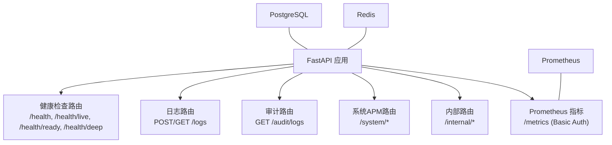
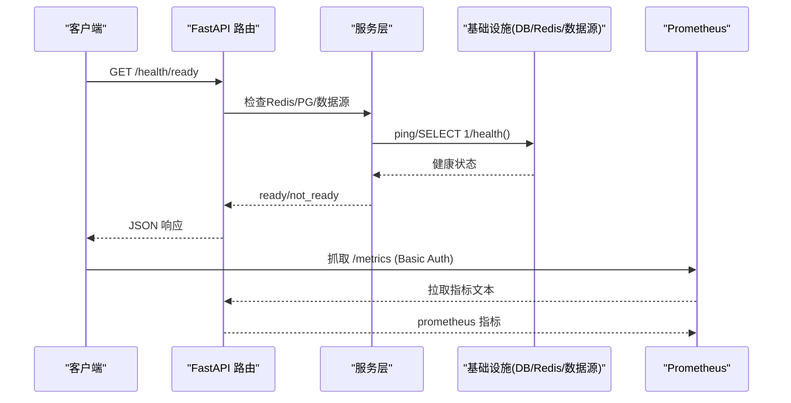
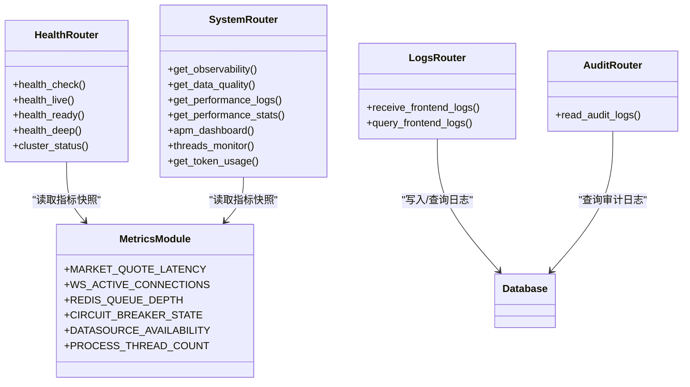

# 系统监控与管理API

<cite>
**本文引用的文件**
- [backend/routers/system_health.py](file://backend/routers/system_health.py)
- [backend/routers/logs.py](file://backend/routers/logs.py)
- [backend/routers/audit.py](file://backend/routers/audit.py)
- [backend/routers/internal.py](file://backend/routers/internal.py)
- [backend/routers/system.py](file://backend/routers/system.py)
- [backend/core/metrics.py](file://backend/core/metrics.py)
- [backend/services/audit_service.py](file://backend/services/audit_service.py)
- [backend/core/database.py](file://backend/core/database.py)
- [config/prometheus_rules.yml](file://config/prometheus_rules.yml)
- [prometheus.yml](file://prometheus.yml)
</cite>

## 目录
1. [简介](#简介)
2. [项目结构](#项目结构)
3. [核心组件](#核心组件)
4. [架构总览](#架构总览)
5. [详细接口说明](#详细接口说明)
6. [依赖关系分析](#依赖关系分析)
7. [性能与容量规划](#性能与容量规划)
8. [故障排查指南](#故障排查指南)
9. [结论](#结论)
10. [附录：监控指标、告警规则与日志轮转](#附录监控指标告警规则与日志轮转)

## 简介
本文件面向运维与平台工程团队，系统化文档化 Quant Agent 的“系统监控与管理”RESTful API，覆盖：
- 服务健康检查（liveness/readiness/deep）
- 性能监控与APM聚合
- 前端日志采集与查询
- 审计日志查询
- Prometheus 指标暴露与抓取配置
- 告警规则与数据源拨测
- 高可用设计、故障恢复与容量规划建议

所有端点均以 HTTP JSON 形式提供，便于集成到统一监控平台（Prometheus/Grafana）、CI/CD 探针与内部运维工具。

## 项目结构
后端通过 FastAPI 路由组织监控与管理能力：
- 健康检查与集群状态：system_health 路由
- 日志采集与查询：logs 路由
- 审计日志：audit 路由
- 系统APM与聚合面板：system 路由
- 内部安全接口：internal 路由
- 指标定义与采集：core/metrics.py
- 数据库连接与模型：core/database.py
- 告警规则与抓取配置：config/prometheus_rules.yml、prometheus.yml

图表来源
- [backend/routers/system_health.py:173-355](file://backend/routers/system_health.py#L173-L355)
- [backend/routers/logs.py:70-182](file://backend/routers/logs.py#L70-L182)
- [backend/routers/audit.py:22-55](file://backend/routers/audit.py#L22-L55)
- [backend/routers/system.py:88-387](file://backend/routers/system.py#L88-L387)
- [backend/routers/internal.py:14-48](file://backend/routers/internal.py#L14-L48)
- [backend/core/metrics.py:1-641](file://backend/core/metrics.py#L1-L641)
- [backend/core/database.py:1-67](file://backend/core/database.py#L1-L67)

章节来源
- [backend/routers/system_health.py:173-355](file://backend/routers/system_health.py#L173-L355)
- [backend/routers/logs.py:70-182](file://backend/routers/logs.py#L70-L182)
- [backend/routers/audit.py:22-55](file://backend/routers/audit.py#L22-L55)
- [backend/routers/system.py:88-387](file://backend/routers/system.py#L88-L387)
- [backend/routers/internal.py:14-48](file://backend/routers/internal.py#L14-L48)
- [backend/core/metrics.py:1-641](file://backend/core/metrics.py#L1-L641)
- [backend/core/database.py:1-67](file://backend/core/database.py#L1-L67)

## 核心组件
- 健康检查组件：进程存活、就绪、全链路诊断；包含 Redis、Postgres、数据源、事件循环延迟、线程池、熔断器状态等。
- 日志组件：前端批量日志写入与分页查询，支持级别筛选与时间范围过滤。
- 审计组件：操作审计记录与查询，支持按动作与用户过滤。
- 系统APM组件：可观测性总览、数据质量、性能日志与统计、APM仪表盘、线程水位、LLM Token使用统计。
- 指标组件：Prometheus 自定义指标（行情延迟、WS连接、队列深度、熔断器、数据源可用性、数据质量、分布式节点心跳等）。
- 配置组件：Prometheus 抓取与 Recording Rules，用于告警与可视化。

章节来源
- [backend/routers/system_health.py:173-355](file://backend/routers/system_health.py#L173-L355)
- [backend/routers/logs.py:70-182](file://backend/routers/logs.py#L70-L182)
- [backend/routers/audit.py:22-55](file://backend/routers/audit.py#L22-L55)
- [backend/routers/system.py:88-387](file://backend/routers/system.py#L88-L387)
- [backend/core/metrics.py:1-641](file://backend/core/metrics.py#L1-L641)
- [config/prometheus_rules.yml:1-95](file://config/prometheus_rules.yml#L1-L95)
- [prometheus.yml:1-43](file://prometheus.yml#L1-L43)

## 架构总览
监控与管理API采用分层设计：
- 路由层：FastAPI 路由负责HTTP请求解析、鉴权、参数校验与响应封装。
- 服务层：业务逻辑（如审计服务、订阅服务、数据源注册表）封装复杂调用。
- 基础设施层：数据库（PostgreSQL/SQLite）、Redis、Prometheus 指标、外部数据源。
- 可观测性层：Prometheus 抓取、Grafana 展示、Recording Rules 预计算。

图表来源
- [backend/routers/system_health.py:197-246](file://backend/routers/system_health.py#L197-L246)
- [backend/core/metrics.py:1-641](file://backend/core/metrics.py#L1-L641)
- [prometheus.yml:16-43](file://prometheus.yml#L16-L43)

## 详细接口说明

### 健康检查与集群状态
- GET /health
  - 描述：进程级健康检查（liveness），始终返回200，供K8s livenessProbe使用。
  - 响应字段：status、uptime_seconds、timestamp。
- GET /health/live
  - 描述：轻量存活探针，不依赖任何外部依赖。
  - 响应字段：status、uptime_seconds、timestamp。
- GET /health/ready
  - 描述：就绪探针，需Redis、Postgres、至少一个数据源连通才返回200，否则503。
  - 响应字段：status、checks（redis/postgres/data_sources/alert_queue/tick_cache_stats）、timestamp。
- GET /health/deep
  - 描述：全链路诊断，包含组件健康、PG连通、数据源就绪、采集器心跳、WS连接数、线程池使用率、事件循环lag、熔断器状态等。
  - 响应字段：status、uptime_seconds、timestamp、components、data_source_detail、collectors、tick_cache_stats、websocket、thread_pools、redis_queue_depth、circuit_breaker_states、event_loop_lag_seconds。
- GET /cluster
  - 描述：节点状态概览，返回运行模式与已启用采集器列表。
  - 响应字段：mode、collectors。

章节来源
- [backend/routers/system_health.py:173-355](file://backend/routers/system_health.py#L173-L355)
- [backend/routers/system_health.py:358-366](file://backend/routers/system_health.py#L358-L366)

### 前端日志接口
- POST /logs
  - 描述：接收前端批量日志，写入PostgreSQL。
  - 请求体：logs数组，每项包含timestamp、level、message、context、error。
  - 响应：status、data.received。
- GET /logs
  - 描述：查询前端日志，支持level筛选、since/until时间范围、limit/offset分页。
  - 响应：status、data.total、data.items（id、timestamp、level、message、context、page_url、user_agent）。

章节来源
- [backend/routers/logs.py:70-182](file://backend/routers/logs.py#L70-L182)

### 审计日志接口
- GET /audit/logs
  - 描述：查询审计日志，支持action与user_id过滤，skip/limit分页。
  - 响应：数组项包含id、action、detail、ip、trace_id、user_id、created_at。

章节来源
- [backend/routers/audit.py:22-55](file://backend/routers/audit.py#L22-L55)
- [backend/services/audit_service.py:83-112](file://backend/services/audit_service.py#L83-L112)

### 系统APM与聚合接口
- GET /system/observability
  - 描述：可观测性总览（实时价覆盖率 + FMP credit消耗），支持format=json或grafana导出Dashboard JSON。
  - 响应：status、message、data（tick_cache、fmp_credit、runtime）、timestamp。
- GET /system/data-quality
  - 描述：数据质量看板汇总（脏数据率、完整率、价格异常、过期计数）。
  - 响应：status、message、data、timestamp、grafana（dashboard名称、folder、metrics）。
- GET /system/performance-logs
  - 描述：获取性能监控日志（慢请求与事件循环卡顿），支持log_type筛选、since时间过滤、limit分页。
  - 响应：status、data（id、timestamp、log_type、duration_ms、endpoint、details）。
- GET /system/performance-stats
  - 描述：指定时间窗口内的性能聚合统计（slow_request_count、event_loop_block_count、avg/max/p95 duration、total_count）。
  - 响应：status、data。
- GET /system/apm-dashboard
  - 描述：一次请求返回APM面板所需全部数据（health/cluster/metrics/performance_stats）。
  - 响应：status、data。
- GET /system/threads
  - 描述：主服务+子服务进程线程水位监控，含阈值与degraded标记。
  - 响应：status（ok/degraded）、data（main_service/sub_service线程信息）。
- GET /system/token-usage
  - 描述：LLM token消耗统计（日/小时/月维度），支持day/month/days参数。
  - 响应：today、hourly、monthly、daily_range、meta。

章节来源
- [backend/routers/system.py:88-387](file://backend/routers/system.py#L88-L387)

### 内部安全接口
- GET /internal/health
  - 描述：内部健康检查，需要HMAC签名验证。
  - 响应：status、message。
- POST /internal/cache/clear
  - 描述：内部缓存清理，支持prefixes参数限定清理范围。
  - 响应：status、cleared。

章节来源
- [backend/routers/internal.py:14-48](file://backend/routers/internal.py#L14-L48)

### Prometheus 指标
- GET /metrics
  - 描述：暴露Prometheus格式指标，受Basic Auth保护（METRICS_USER/METRICS_PASS环境变量）。
  - 内容：行情延迟、WS连接、队列深度、熔断器状态、数据源可用性、数据质量、分布式节点心跳、FMP collector指标、进程线程水位等。

章节来源
- [backend/routers/system_health.py:31-56](file://backend/routers/system_health.py#L31-L56)
- [backend/core/metrics.py:1-641](file://backend/core/metrics.py#L1-L641)

## 依赖关系分析
- 健康检查依赖：
  - Redis：ping检测
  - Postgres：SELECT 1连通性测试
  - 数据源：market_data.status或DataSourceRegistry.health()
  - 事件循环：asyncio.sleep(0)测量延迟
  - 线程池：asyncio默认执行器与anyio线程限制器
  - 熔断器：CIRCUIT_BREAKER_STATE指标
- 日志与审计依赖：
  - PostgreSQL：存储前端日志与审计日志
  - 认证：可选当前用户提取
- 系统APM依赖：
  - 订阅服务：实时价命中率统计
  - FMP collector：credit消耗与运行时状态
  - 数据质量服务：质量概览
  - 性能日志：PerformanceLog模型
- 指标依赖：
  - Prometheus客户端：Counter/Gauge/Histogram/Summary
  - 数据源：多源融合与偏差告警
  - 分布式节点：心跳与状态

图表来源
- [backend/routers/system_health.py:173-355](file://backend/routers/system_health.py#L173-L355)
- [backend/routers/logs.py:70-182](file://backend/routers/logs.py#L70-L182)
- [backend/routers/audit.py:22-55](file://backend/routers/audit.py#L22-L55)
- [backend/routers/system.py:88-387](file://backend/routers/system.py#L88-L387)
- [backend/core/metrics.py:1-641](file://backend/core/metrics.py#L1-L641)

章节来源
- [backend/routers/system_health.py:173-355](file://backend/routers/system_health.py#L173-L355)
- [backend/routers/logs.py:70-182](file://backend/routers/logs.py#L70-L182)
- [backend/routers/audit.py:22-55](file://backend/routers/audit.py#L22-L55)
- [backend/routers/system.py:88-387](file://backend/routers/system.py#L88-L387)
- [backend/core/metrics.py:1-641](file://backend/core/metrics.py#L1-L641)

## 性能与容量规划
- 健康检查：
  - liveness/readiness/deep分级设计，避免阻塞业务流量。
  - 事件循环延迟测量用于评估拥塞度。
- 日志与审计：
  - 批量写入减少DB压力，异步执行避免阻塞。
  - 分页查询防止大结果集导致内存溢出。
- 指标采集：
  - Prometheus每5秒抓取主服务指标，15秒抓取子服务指标。
  - Recording Rules预计算复杂表达式，降低查询负载。
- 容量规划建议：
  - 根据WS连接数、消息发送量、队列深度调整线程池大小与Redis实例规格。
  - 监控进程线程数，超过阈值触发降级或扩容。
  - 数据源限流与熔断策略需结合RPM与错误率动态调整。

章节来源
- [backend/routers/system_health.py:126-131](file://backend/routers/system_health.py#L126-L131)
- [backend/routers/logs.py:103-115](file://backend/routers/logs.py#L103-L115)
- [prometheus.yml:1-43](file://prometheus.yml#L1-L43)
- [config/prometheus_rules.yml:53-95](file://config/prometheus_rules.yml#L53-L95)

## 故障排查指南
- 健康检查失败：
  - /health/ready返回503：检查Redis、Postgres、数据源连通性。
  - /health/deep中components为unhealthy：查看具体组件错误信息。
- 日志写入失败：
  - POST /logs返回500：检查数据库连接与写入权限。
- 审计日志查询失败：
  - GET /audit/logs返回空或错误：确认认证与数据库连接。
- 指标不可用：
  - /metrics返回401：检查Basic Auth凭据。
  - Prometheus抓取失败：确认网络可达与端口配置。

章节来源
- [backend/routers/system_health.py:197-246](file://backend/routers/system_health.py#L197-L246)
- [backend/routers/logs.py:109-115](file://backend/routers/logs.py#L109-L115)
- [backend/routers/audit.py:22-55](file://backend/routers/audit.py#L22-L55)
- [backend/routers/system_health.py:31-56](file://backend/routers/system_health.py#L31-L56)

## 结论
Quant Agent的监控与管理API提供了完整的健康检查、性能监控、日志查询与审计追踪能力。通过分级健康检查、Prometheus指标暴露、Recording Rules预计算，系统具备高可用性与可扩展性。运维人员可基于这些接口集成到统一监控平台，实现自动化运维与故障恢复。

## 附录：监控指标、告警规则与日志轮转

### 监控指标分类
- 行情数据：延迟分位数、陈旧度、总量、K线获取延迟
- WebSocket：活跃连接、消息发送、丢弃、订阅数
- Redis：队列深度、操作延迟、错误计数
- 熔断器：状态、转换次数
- 客户端APM：心跳、Web Vitals（LCP/CLS/INP/TTFB）
- 数据源：延迟分布、错误率、限流次数、可用性、主动拨测
- 数据湖：快照创建/读取、保留任务、最新快照年龄
- 数据质量：脏数据率、完整率、异常计数、缺失字段、价格异常、时间戳过期、平均延迟、质量等级、校验次数
- 分布式节点：心跳时间戳、节点状态、存活数量、YF/AKShare降级计数
- Finnhub WS：实时价命中/降级、命中率
- FMP collector：批次运行、标的缓存、失败原因、批次耗时、最后批次时间戳、子服务不可达、watchlist为空/大小、文件大小删除、watchlist大小突变
- 进程线程：线程数、告警阈值
- Web抓取：抓取总数、失败数（反爬/过短/HTTP错误）

章节来源
- [backend/core/metrics.py:24-641](file://backend/core/metrics.py#L24-L641)

### 告警规则配置
- Recording Rules：
  - fmp:watchlist_size_delta5m：5分钟watchlist大小变化
  - fmp:watchlist_size_prev5m：上一窗口基线值
  - fmp:watchlist_size_shift_flag：突变标志（±50%变化）
  - fmp:watchlist_shift_total_1h：近1小时突变总事件数
  - fmp:watchlist_file_deleted_ratio_1h：删文件占突变比例
- Prometheus抓取配置：
  - fastapi-app：每5秒抓取主服务/metrics
  - data-subservice：每15秒抓取子服务/metrics/circuit
  - data-subservice-metrics：每15秒抓取子服务/metrics

章节来源
- [config/prometheus_rules.yml:53-95](file://config/prometheus_rules.yml#L53-L95)
- [prometheus.yml:16-43](file://prometheus.yml#L16-L43)

### 日志轮转策略
- 前端日志：
  - 批量写入PostgreSQL，支持分页查询与时间范围过滤。
  - 建议定期归档历史日志，避免单表过大影响查询性能。
- 审计日志：
  - 按操作类型与用户ID过滤，支持分页。
  - 建议设置保留策略，定期清理过期审计记录。
- 性能日志：
  - 慢请求与事件循环卡顿记录，支持类型筛选与时间过滤。
  - 建议结合Prometheus指标进行趋势分析。

章节来源
- [backend/routers/logs.py:70-182](file://backend/routers/logs.py#L70-L182)
- [backend/routers/audit.py:22-55](file://backend/routers/audit.py#L22-L55)
- [backend/routers/system.py:167-272](file://backend/routers/system.py#L167-L272)
