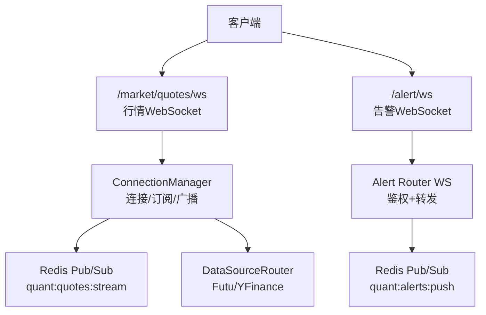
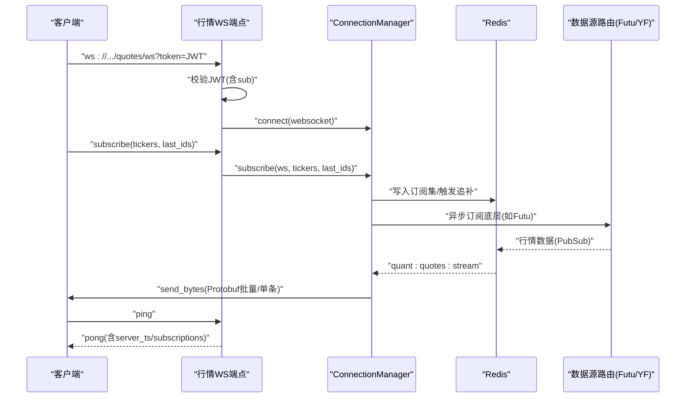
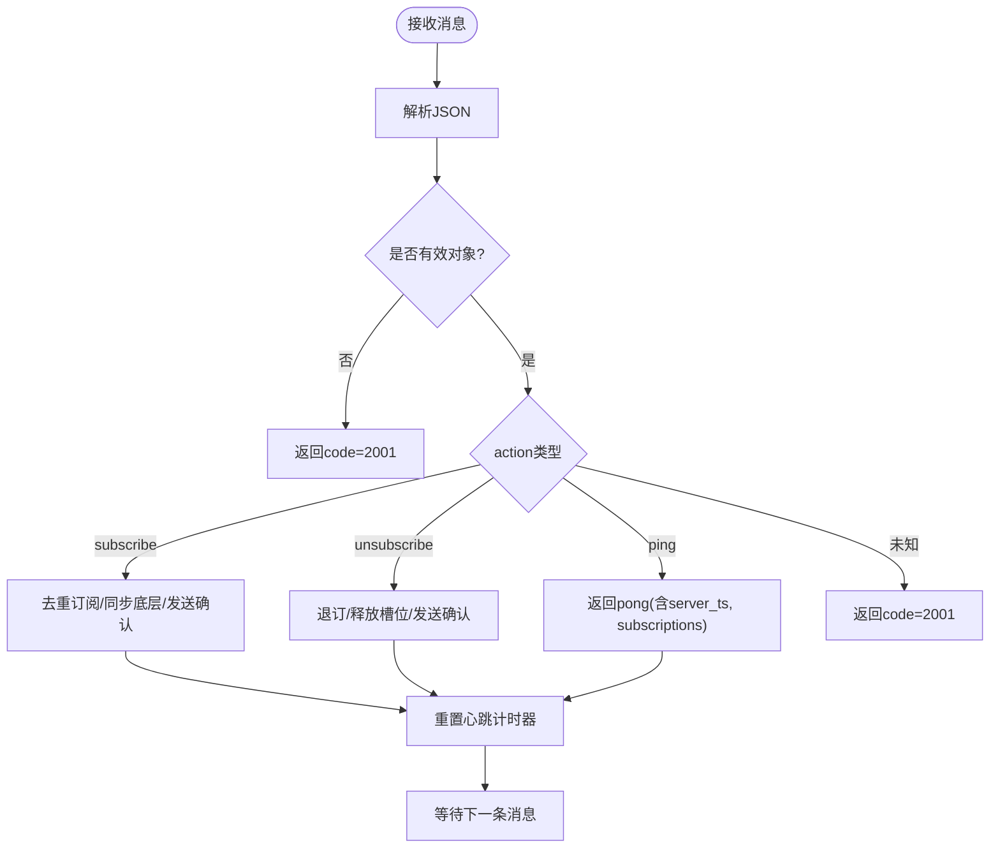
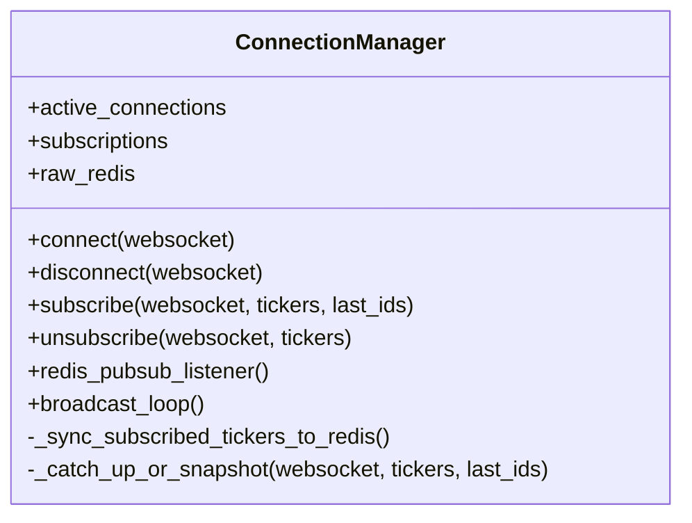
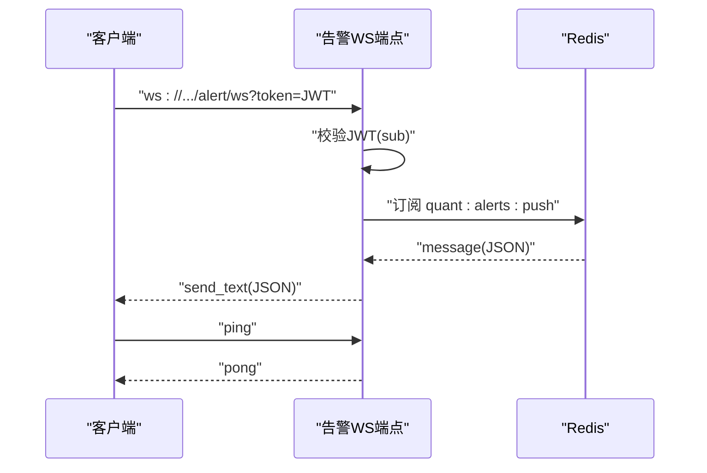
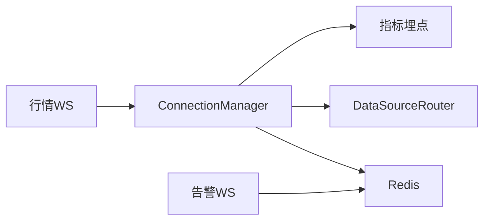

# WebSocket实时接口

<cite>
**本文引用的文件**
- [backend/routers/market.py](file://backend/routers/market.py)
- [backend/services/market_engine.py](file://backend/services/market_engine.py)
- [backend/routers/alert.py](file://backend/routers/alert.py)
- [backend/core/proto/market_pb2.py](file://backend/core/proto/market_pb2.py)
- [backend/tests/test_market_websocket_auth.py](file://backend/tests/test_market_websocket_auth.py)
</cite>

## 目录
1. [简介](#简介)
2. [项目结构](#项目结构)
3. [核心组件](#核心组件)
4. [架构总览](#架构总览)
5. [详细组件分析](#详细组件分析)
6. [依赖关系分析](#依赖关系分析)
7. [性能考量](#性能考量)
8. [故障排查指南](#故障排查指南)
9. [结论](#结论)
10. [附录](#附录)

## 简介
本文件面向实时数据消费者，提供 Quant Agent 的 WebSocket 实时通信接口文档。内容涵盖：
- 连接建立与认证机制（基于 JWT）
- 连接管理与心跳、重连策略
- 消息协议格式（JSON 控制帧 + Protobuf 二进制行情帧）
- 实时数据推送机制（行情快照/增量、订单状态、告警通知等）
- 客户端接入示例（连接、订阅、处理消息流）
- 错误码与异常处理
- 性能优化建议与调试工具使用指南

## 项目结构
后端通过 FastAPI 暴露 WebSocket 端点，市场行情的 WS 位于 /market/quotes/ws，告警推送 WS 位于 /alert/ws。连接管理、Redis 总线监听、Protobuf 序列化、指标埋点等能力集中在服务层 market_engine。

图表来源
- [backend/routers/market.py:73-226](file://backend/routers/market.py#L73-L226)
- [backend/services/market_engine.py:115-330](file://backend/services/market_engine.py#L115-L330)
- [backend/routers/alert.py:148-211](file://backend/routers/alert.py#L148-L211)

章节来源
- [backend/routers/market.py:73-226](file://backend/routers/market.py#L73-L226)
- [backend/services/market_engine.py:115-330](file://backend/services/market_engine.py#L115-L330)
- [backend/routers/alert.py:148-211](file://backend/routers/alert.py#L148-L211)

## 核心组件
- 行情 WebSocket 端点：负责鉴权、心跳、订阅/退订、消息分发与背压保护。
- 连接管理器 ConnectionManager：维护活跃连接、订阅集合、Redis 监听、背景轮询与缓存、断线追补与快照回发。
- 告警 WebSocket 端点：基于 Query token 鉴权，订阅 Redis 频道并转发 JSON 告警消息。
- Protobuf 消息：行情数据以 market.proto 定义的 QuoteData/Order 进行序列化传输，降低带宽与解析开销。
- 指标与可观测性：记录 WS 连接数、消息发送量、行情延迟与陈旧度等指标。

章节来源
- [backend/routers/market.py:73-226](file://backend/routers/market.py#L73-L226)
- [backend/services/market_engine.py:115-330](file://backend/services/market_engine.py#L115-L330)
- [backend/routers/alert.py:148-211](file://backend/routers/alert.py#L148-L211)
- [backend/core/proto/market_pb2.py](file://backend/core/proto/market_pb2.py)

## 架构总览
下图展示从客户端到后端的完整链路：客户端通过带 token 的 URL 建立 WS 连接；服务端完成鉴权后将连接注册至 ConnectionManager；订阅变更同步至 Redis；后台任务拉取行情并通过 Redis Pub/Sub 广播；服务端按订阅过滤后以二进制帧推送给客户端；同时支持断线追补与快照回发。

图表来源
- [backend/routers/market.py:73-226](file://backend/routers/market.py#L73-L226)
- [backend/services/market_engine.py:160-330](file://backend/services/market_engine.py#L160-L330)

## 详细组件分析

### 行情 WebSocket（/market/quotes/ws）
- 连接鉴权：从 query 参数读取 token，解码 JWT，要求包含 sub 字段；失败返回特定关闭码。
- 心跳保活：客户端周期性发送 ping；服务端在收到任何消息时重置心跳计时器；超时自动断开。
- 订阅/退订：支持 ticker 列表（字符串或逗号分隔），自动格式化为标准前缀；重复订阅去重；退订时释放底层订阅槽位。
- 消息协议：
  - 控制帧（JSON）：action 包括 subscribe、unsubscribe、ping；响应统一包含 code/msg/data/ts。
  - 数据帧（二进制）：Protobuf 序列化的 QuoteData，可能为批量压缩帧（zlib）。
- 断线追补：根据 last_ids 通过 Redis Stream XRANGE 追补错过的逐笔/增量数据；无 last_ids 则发送最新快照。
- 背压保护：慢客户端缓冲区满时丢弃最旧消息（由框架保障），并在批量追补时合并压缩以减少网络压力。

图表来源
- [backend/routers/market.py:104-226](file://backend/routers/market.py#L104-L226)

章节来源
- [backend/routers/market.py:73-226](file://backend/routers/market.py#L73-L226)
- [backend/tests/test_market_websocket_auth.py:54-234](file://backend/tests/test_market_websocket_auth.py#L54-L234)

### 连接管理器（ConnectionManager）
- 连接生命周期：connect 登记连接与订阅集合；disconnect 清理并同步订阅集到 Redis。
- 订阅管理：subscribe/unsubscribe 更新本地映射，并异步同步到 Redis 供生产者动态跟随前端自选列表。
- Redis 监听：订阅 quant:quotes:stream，解析 Protobuf 获取 ticker，仅向关注该标的的连接推送。
- 背景任务：
  - 定时拉取技术指标与资金流，写入缓存与 Redis。
  - 兜底轮询 YFinance/Futu，将结果写入 Redis 数据总线。
  - 账户信息快照与宏观风控预警。
- 断线追补：对每个订阅 ticker，若携带 last_id，则通过 XRANGE 获取区间内所有包，超过阈值时打包为 zlib 压缩的二进制帧一次性发送。

图表来源
- [backend/services/market_engine.py:115-330](file://backend/services/market_engine.py#L115-L330)

章节来源
- [backend/services/market_engine.py:115-330](file://backend/services/market_engine.py#L115-L330)

### 告警 WebSocket（/alert/ws）
- 鉴权：查询参数 token 为 JWT，解码后需包含 sub；缺失/过期/无效分别返回不同关闭码。
- 推送：订阅 Redis 频道 quant:alerts:push，将 JSON 文本转发给客户端。
- 心跳：支持 ping/pong 简单交互。
- 降级：若 Redis 订阅失败，保持连接但无推送，前端可通过 HTTP GET /events?since= 补拉历史事件。

图表来源
- [backend/routers/alert.py:148-211](file://backend/routers/alert.py#L148-L211)

章节来源
- [backend/routers/alert.py:148-211](file://backend/routers/alert.py#L148-L211)

### 二进制帧与 Protobuf 消息
- 数据帧：QuoteData/Order 等通过 Protobuf 序列化，减少体积与解析成本。
- 批量压缩：当追补消息数量较大时，采用“模式字节 + zlib 压缩”的批量帧格式，提升吞吐。
- 订阅过滤：服务端解析 Protobuf 中的 ticker，仅推送给订阅了该标的的连接。

章节来源
- [backend/services/market_engine.py:39-113](file://backend/services/market_engine.py#L39-L113)
- [backend/services/market_engine.py:201-244](file://backend/services/market_engine.py#L201-L244)
- [backend/core/proto/market_pb2.py](file://backend/core/proto/market_pb2.py)

## 依赖关系分析
- 行情 WS 依赖 ConnectionManager 进行连接与订阅管理。
- ConnectionManager 依赖 Redis 进行数据总线与 Stream 存储，以及 DataSourceRouter 调用 Futu/YFinance。
- 告警 WS 依赖 Redis Pub/Sub 通道进行跨进程/节点的消息转发。
- 指标埋点依赖 core.metrics 记录 WS 连接数、消息发送量、行情延迟与陈旧度。

图表来源
- [backend/routers/market.py:73-226](file://backend/routers/market.py#L73-L226)
- [backend/services/market_engine.py:115-330](file://backend/services/market_engine.py#L115-L330)
- [backend/routers/alert.py:148-211](file://backend/routers/alert.py#L148-L211)

章节来源
- [backend/routers/market.py:73-226](file://backend/routers/market.py#L73-L226)
- [backend/services/market_engine.py:115-330](file://backend/services/market_engine.py#L115-L330)
- [backend/routers/alert.py:148-211](file://backend/routers/alert.py#L148-L211)

## 性能考量
- 心跳与超时：默认 60 秒无心跳主动断开，避免僵尸连接占用资源。
- 订阅去重：同一连接重复订阅相同 ticker 不会重复注册，降低下游压力。
- 批量压缩：追补消息超过阈值时采用 zlib 压缩批量帧，显著降低带宽与 I/O。
- 背压保护：慢客户端缓冲满时丢弃最旧消息，保证整体稳定性。
- 背景任务节流：技术指标与资金流刷新设置合理间隔，避免请求风暴；对不支持标的动态标记，跳过无效请求。
- 指标监控：通过 metrics 记录 WS 连接数、消息发送量、行情延迟与陈旧度，便于容量规划与问题定位。

章节来源
- [backend/routers/market.py:31-37](file://backend/routers/market.py#L31-L37)
- [backend/services/market_engine.py:332-601](file://backend/services/market_engine.py#L332-L601)

## 故障排查指南
- 鉴权失败：
  - 缺少 token：关闭码 4001
  - token 过期或无效：关闭码 4002
  - payload 缺少 sub：关闭码 4003
- 消息格式错误：
  - 非 JSON 或非法 JSON：返回 code=2001，提示 Invalid JSON
  - 未知 action：返回 code=2001，提示 Unknown action
- 连接异常：
  - 心跳超时：服务端主动断开
  - WebSocket 断开：清理连接与订阅，并同步订阅集到 Redis
- 数据不可用：
  - 数据源不可用：后台任务会降级至 YFinance 或返回 degraded 标志
  - 告警通道降级：Redis 订阅失败时保持连接，前端通过 since 参数补拉

章节来源
- [backend/routers/market.py:82-97](file://backend/routers/market.py#L82-L97)
- [backend/routers/market.py:107-214](file://backend/routers/market.py#L107-L214)
- [backend/routers/alert.py:154-166](file://backend/routers/alert.py#L154-L166)
- [backend/services/market_engine.py:174-190](file://backend/services/market_engine.py#L174-L190)

## 结论
Quant Agent 的 WebSocket 实时接口通过 JWT 鉴权、连接管理器与 Redis 总线实现了高吞吐、低延迟的行情与告警推送。二进制 Protobuf 帧与批量压缩进一步提升了性能。结合心跳、背压、断线追补与降级策略，系统具备良好的稳定性与可扩展性。建议客户端实现健壮的重连与心跳机制，并合理利用 since 参数进行断线补拉。

## 附录

### 客户端接入示例（步骤说明）
- 建立连接：
  - 使用 ws:// 或 wss:// 连接 /market/quotes/ws，URL 中附带 ?token=JWT（包含 sub 字段）。
- 订阅频道：
  - 发送 JSON：{ "action": "subscribe", "tickers": ["US.AAPL"], "last_ids": {} }
  - 接收确认：{ "code": 0, "data": { "subscribed": [...], "already_subscribed": [...] }, "ts": ... }
- 处理消息流：
  - 控制帧：JSON（ping/pong、subscribe/unsubscribe 确认）
  - 数据帧：二进制（Protobuf QuoteData），可能为批量压缩帧
- 心跳保活：
  - 定期发送 { "action": "ping", "ts": <client_timestamp> }
  - 接收 { "type": "pong", "data": { "client_ts": ..., "server_ts": ..., "subscriptions": ... }, "ts": ... }
- 断线重连与补拉：
  - 捕获断开事件后，重新建立连接并携带 last_ids 进行追补
  - 若无法追补，可改用 HTTP GET /events?since=<timestamp> 补拉历史事件（告警场景）

章节来源
- [backend/routers/market.py:73-226](file://backend/routers/market.py#L73-L226)
- [backend/routers/alert.py:148-211](file://backend/routers/alert.py#L148-L211)

### 消息协议定义（摘要）
- 控制帧（JSON）
  - action: subscribe | unsubscribe | ping
  - tickers: 字符串或逗号分隔字符串
  - last_ids: 用于断线追补的游标
  - 响应字段: code, msg, data, ts
- 数据帧（二进制）
  - Protobuf 序列化的 QuoteData/Order
  - 批量压缩帧：模式字节 + zlib 压缩（含包数量与单包长度）

章节来源
- [backend/routers/market.py:104-226](file://backend/routers/market.py#L104-L226)
- [backend/services/market_engine.py:201-244](file://backend/services/market_engine.py#L201-L244)
- [backend/core/proto/market_pb2.py](file://backend/core/proto/market_pb2.py)

### 错误码参考
- 连接鉴权
  - 4001: Missing authentication token
  - 4002: Token expired or invalid
  - 4003: Invalid token payload
- 消息处理
  - 2001: Payload must be a JSON object / Invalid JSON / Unknown action

章节来源
- [backend/routers/market.py:82-97](file://backend/routers/market.py#L82-L97)
- [backend/routers/market.py:107-214](file://backend/routers/market.py#L107-L214)
- [backend/routers/alert.py:154-166](file://backend/routers/alert.py#L154-L166)

### 调试与可观测性
- 指标：
  - WS_ACTIVE_CONNECTIONS: 当前活跃连接数
  - WS_MESSAGES_SENT: 已发送消息总数（按类型分片）
  - MARKET_QUOTE_LATENCY/STALENESS: 行情延迟与陈旧度
- 日志：
  - 连接建立/断开、心跳超时、Redis 订阅失败、数据源异常等关键路径均有日志输出
- 健康检查：
  - /health/services 可获取各数据源与健康状态
  - /futu/status 可感知底层 OpenD 连接状态

章节来源
- [backend/services/market_engine.py:15-22](file://backend/services/market_engine.py#L15-L22)
- [backend/routers/market.py:228-327](file://backend/routers/market.py#L228-L327)