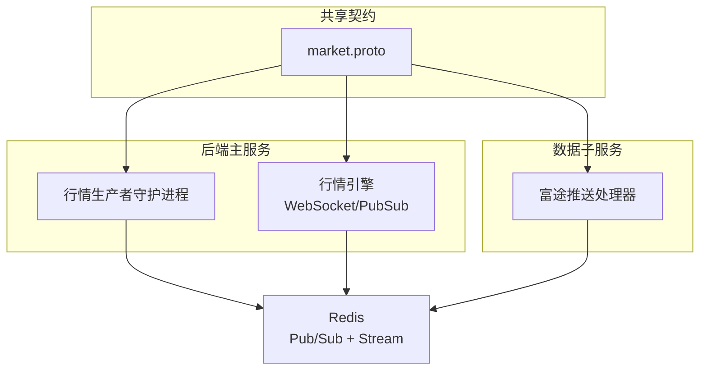
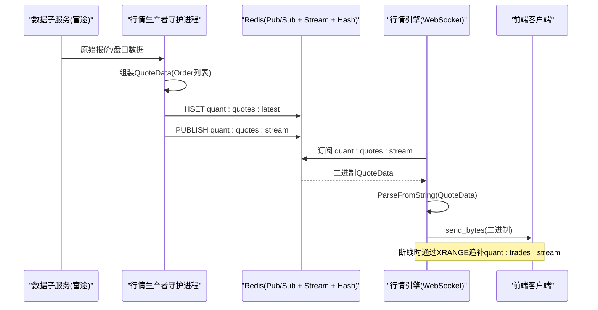
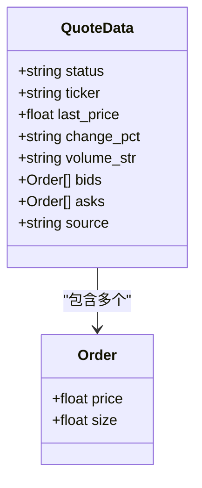
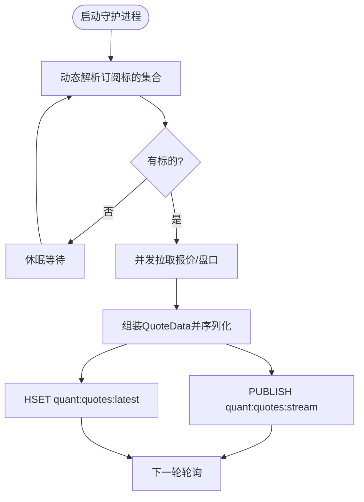
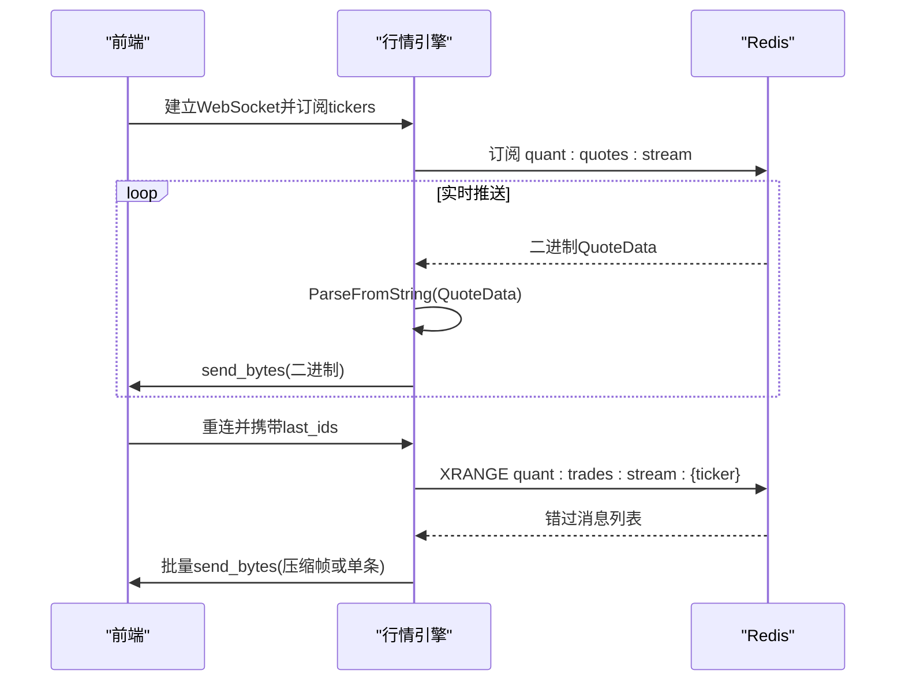
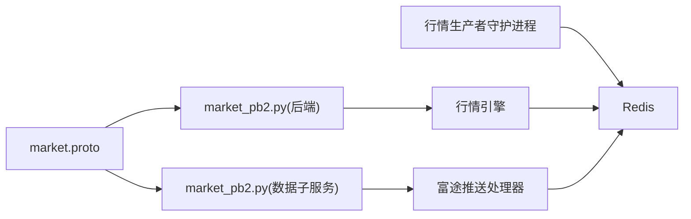
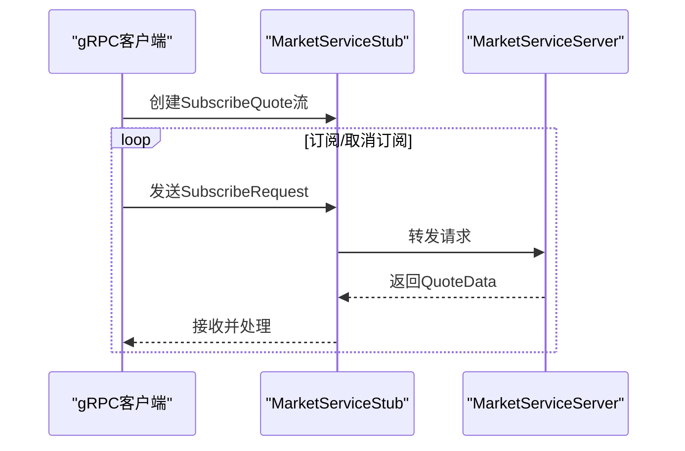

# gRPC内部接口

<cite>
**本文引用的文件**
- [market.proto](file://shared/proto/market.proto)
- [market_pb2.py（后端）](file://backend/core/proto/market_pb2.py)
- [market_pb2.py（数据子服务）](file://data_subservice/futu_src/proto/market_pb2.py)
- [行情引擎与WebSocket推送](file://backend/services/market_engine.py)
- [行情生产者守护进程](file://backend/workers/quote_publisher.py)
- [富途推送处理器](file://data_subservice/futu_src/push_handler.py)
</cite>

## 目录
1. [简介](#简介)
2. [项目结构](#项目结构)
3. [核心组件](#核心组件)
4. [架构总览](#架构总览)
5. [详细组件分析](#详细组件分析)
6. [依赖关系分析](#依赖关系分析)
7. [性能考虑](#性能考虑)
8. [故障排查指南](#故障排查指南)
9. [结论](#结论)
10. [附录](#附录)

## 简介
本文件面向Quant Agent的“内部通信接口”文档，聚焦于跨模块/跨进程的数据契约与实时数据总线。当前仓库中已存在用于行情数据的Protocol Buffers定义与二进制消息流转实现，但尚未发现gRPC服务端/客户端代码。因此，本文以现有Protobuf消息和Redis流式总线为基础，给出：
- Protobuf消息类型与服务接口的规范说明
- 基于现有实现的流式通信模式（服务端流、客户端流、双向流）在gRPC中的使用建议
- 微服务间通信的标准化接口规范与集成指导
- 服务发现、负载均衡与故障转移策略建议
- 性能调优与网络配置要求

注意：若后续引入gRPC服务，可复用本文件中定义的Protobuf消息与服务契约，确保前后端与子服务之间的一致性。

## 项目结构
本项目采用多模块/多进程架构：
- shared/proto：共享的Protobuf定义
- backend：主服务，包含行情引擎、WebSocket推送、指标埋点、告警等
- data_subservice：数据子服务，负责对接外部数据源（如富途），并产出统一格式的二进制行情消息
- workers：后台任务（如行情生产者守护进程）

图表来源
- [market.proto:1-22](file://shared/proto/market.proto#L1-L22)
- [行情引擎与WebSocket推送:1-120](file://backend/services/market_engine.py#L1-L120)
- [行情生产者守护进程:1-120](file://backend/workers/quote_publisher.py#L1-L120)
- [富途推送处理器:1-120](file://data_subservice/futu_src/push_handler.py#L1-L120)

章节来源
- [market.proto:1-22](file://shared/proto/market.proto#L1-L22)
- [行情引擎与WebSocket推送:1-120](file://backend/services/market_engine.py#L1-L120)
- [行情生产者守护进程:1-120](file://backend/workers/quote_publisher.py#L1-L120)
- [富途推送处理器:1-120](file://data_subservice/futu_src/push_handler.py#L1-L120)

## 核心组件
- Protobuf消息定义
  - Order：盘口单档（价格、数量）
  - QuoteData：极速行情快照（状态、标的、最新价、涨跌幅、成交量字符串、买卖盘、数据来源）
- 二进制消息总线
  - Redis Pub/Sub通道“quant:quotes:stream”用于实时广播
  - Redis Hash“quant:quotes:latest”用于最新快照缓存
  - Redis Stream“quant:trades:stream:{ticker}”用于事件型数据（逐笔成交等）断线追补
- 行情生产者守护进程
  - 定时轮询外部数据源（如富途），组装为Protobuf并双写Redis
- 行情引擎与WebSocket推送
  - 监听Redis Pub/Sub，解析Protobuf后按订阅关系推送给前端连接
  - 支持断线追补与批量压缩帧优化

章节来源
- [market.proto:1-22](file://shared/proto/market.proto#L1-L22)
- [行情引擎与WebSocket推送:39-113](file://backend/services/market_engine.py#L39-L113)
- [行情生产者守护进程:90-165](file://backend/workers/quote_publisher.py#L90-L165)
- [富途推送处理器:60-120](file://data_subservice/futu_src/push_handler.py#L60-L120)

## 架构总览
下图展示了从数据源到前端的完整数据流，包括Protobuf序列化、Redis双写、WebSocket推送与断线追补。

图表来源
- [行情生产者守护进程:133-158](file://backend/workers/quote_publisher.py#L133-L158)
- [行情引擎与WebSocket推送:296-331](file://backend/services/market_engine.py#L296-L331)
- [行情引擎与WebSocket推送:201-243](file://backend/services/market_engine.py#L201-L243)

## 详细组件分析

### Protobuf消息模型
- Order
  - 字段：price（浮点）、size（浮点）
  - 用途：描述买卖盘一档的价格与数量
- QuoteData
  - 字段：status（状态）、ticker（标的）、last_price（最新价）、change_pct（涨跌幅字符串）、volume_str（成交量字符串）、bids（买单列表）、asks（卖单列表）、source（数据来源）
  - 用途：统一封装行情快照，供各模块消费

图表来源
- [market.proto:5-21](file://shared/proto/market.proto#L5-L21)

章节来源
- [market.proto:1-22](file://shared/proto/market.proto#L1-L22)
- [market_pb2.py（后端）:1-34](file://backend/core/proto/market_pb2.py#L1-L34)
- [market_pb2.py（数据子服务）:1-34](file://data_subservice/futu_src/proto/market_pb2.py#L1-L34)

### 行情生产者守护进程（Producer）
职责：
- 拉取外部数据源（如富途）的报价与盘口
- 将数据组装为QuoteData并序列化为二进制
- 双写Redis：最新快照Hash与实时流Pub/Sub
- 可选数据质量校验与日志记录

关键流程：
- 并发拉取报价与盘口，容错处理
- 构建QuoteData，追加bids/asks
- 写入quant:quotes:latest与发布quant:quotes:stream

图表来源
- [行情生产者守护进程:166-222](file://backend/workers/quote_publisher.py#L166-L222)
- [行情生产者守护进程:90-158](file://backend/workers/quote_publisher.py#L90-L158)

章节来源
- [行情生产者守护进程:90-165](file://backend/workers/quote_publisher.py#L90-L165)
- [行情生产者守护进程:166-222](file://backend/workers/quote_publisher.py#L166-L222)

### 行情引擎与WebSocket推送（Consumer）
职责：
- 维护前端WebSocket连接与订阅关系
- 监听Redis Pub/Sub，解析二进制QuoteData并按订阅过滤推送
- 支持断线追补：通过Redis Stream XRANGE获取错过的消息，必要时进行批量压缩帧发送

关键流程：
- 连接建立与订阅管理
- 背景任务启动：Redis Pub/Sub监听与指标更新
- 断线追补：根据last_id从Stream区间读取，批量打包发送

图表来源
- [行情引擎与WebSocket推送:174-200](file://backend/services/market_engine.py#L174-L200)
- [行情引擎与WebSocket推送:201-243](file://backend/services/market_engine.py#L201-L243)
- [行情引擎与WebSocket推送:296-331](file://backend/services/market_engine.py#L296-L331)

章节来源
- [行情引擎与WebSocket推送:174-243](file://backend/services/market_engine.py#L174-L243)
- [行情引擎与WebSocket推送:296-331](file://backend/services/market_engine.py#L296-L331)

### 富途推送处理器（数据子服务）
职责：
- 接收富途推送数据，转换为统一格式
- 生成QuoteData并序列化，推送到Redis总线
- 与主服务解耦，便于横向扩展

关键点：
- 延迟导入Protobuf模块，避免启动硬依赖
- 对订单簿字段兼容不同返回结构
- 错误处理与降级策略

章节来源
- [富途推送处理器:60-120](file://data_subservice/futu_src/push_handler.py#L60-L120)

## 依赖关系分析
- 共享契约：market.proto被后端与数据子服务共同引用，保证消息一致性
- 运行时依赖：google.protobuf（Python）用于序列化/反序列化
- 中间件：Redis作为消息总线，承担Pub/Sub、Stream与Hash存储
- 业务耦合：行情引擎依赖数据子服务产出的统一格式；生产者守护进程依赖数据源路由

图表来源
- [market.proto:1-22](file://shared/proto/market.proto#L1-L22)
- [market_pb2.py（后端）:1-34](file://backend/core/proto/market_pb2.py#L1-L34)
- [market_pb2.py（数据子服务）:1-34](file://data_subservice/futu_src/proto/market_pb2.py#L1-L34)
- [行情生产者守护进程:133-158](file://backend/workers/quote_publisher.py#L133-L158)
- [行情引擎与WebSocket推送:296-331](file://backend/services/market_engine.py#L296-L331)

章节来源
- [行情引擎与WebSocket推送:296-331](file://backend/services/market_engine.py#L296-L331)
- [行情生产者守护进程:133-158](file://backend/workers/quote_publisher.py#L133-L158)

## 性能考虑
- 二进制传输：使用Protobuf序列化减少带宽占用与CPU开销
- 批量压缩帧：当追补消息超过阈值时，组合为单一zlib压缩帧发送，降低网络往返
- 限流与退避：生产者侧使用信号量控制并发，失败标的退避重试，避免请求风暴
- 指标埋点：记录行情延迟、陈旧度、消息计数与活跃连接数，便于监控与调优
- Redis键设计：最新快照Hash用于秒开，Stream用于断线追补，Pub/Sub用于实时广播

[本节为通用性能建议，不直接分析具体文件]

## 故障排查指南
常见问题与定位方法：
- 行情不更新：检查Redis Pub/Sub是否收到消息，确认订阅频道与键名一致
- 断线后无追补：确认Stream键名与last_id是否正确传递，检查XRANGE范围
- 高延迟：观察指标埋点（延迟、陈旧度），评估Redis与网络瓶颈
- 数据源异常：查看生产者日志与降级逻辑，确认是否触发YFinance兜底或熔断

章节来源
- [行情引擎与WebSocket推送:201-243](file://backend/services/market_engine.py#L201-L243)
- [行情引擎与WebSocket推送:296-331](file://backend/services/market_engine.py#L296-L331)
- [行情生产者守护进程:90-165](file://backend/workers/quote_publisher.py#L90-L165)

## 结论
当前仓库已具备稳定的二进制行情消息契约与实时数据总线实现，虽未包含gRPC服务端/客户端代码，但为未来引入gRPC提供了清晰的契约基础。建议在新增gRPC服务时：
- 复用现有Protobuf消息，保持向后兼容
- 在服务层增加超时、重试、熔断与指标埋点
- 结合服务发现与负载均衡，提升可扩展性与可用性

[本节为总结性内容，不直接分析具体文件]

## 附录

### gRPC服务接口规范建议（基于现有消息）
- 服务名称：MarketService
- 方法定义（建议）：
  - SubscribeQuote：客户端流，客户端持续发送订阅/取消订阅请求，服务端流返回QuoteData
  - GetSnapshot：单向RPC，请求标的列表，响应最新快照（来自Redis Hash）
  - ReplayTrades：双向流，客户端发送last_id，服务端流返回错过的交易事件（来自Redis Stream）
- 请求/响应消息：
  - SubscribeRequest：包含ticker与操作类型（subscribe/unsubscribe）
  - QuoteData：沿用现有定义
  - TradeEvent：沿用现有二进制payload结构（可在proto中扩展）
- 流式通信场景：
  - 服务端流：适用于实时行情推送（SubscribeQuote）
  - 客户端流：适用于批量订阅/取消订阅（SubscribeQuote）
  - 双向流：适用于交互式回放与增量同步（ReplayTrades）

[本节为概念性规范建议，不映射到具体源码文件]

### 服务发现、负载均衡与故障转移策略
- 服务发现：建议使用Consul或Kubernetes Service，结合DNS或服务网格（如Istio）进行服务注册与发现
- 负载均衡：启用客户端侧负载均衡（如gRPC内置轮询），配合健康检查与权重分配
- 故障转移：
  - 超时与重试：设置合理超时与指数退避重试
  - 熔断器：在调用方集成熔断逻辑，避免雪崩
  - 降级：当主数据源不可用时，自动切换至备用源（如YFinance）

[本节为通用架构建议，不直接分析具体文件]

### 客户端实现示例（Python gRPC）
以下为调用MarketService.SubscribeQuote的示例步骤（伪代码示意）：
- 加载channel与stub
- 创建订阅请求流，循环发送订阅/取消订阅
- 接收服务端流返回的QuoteData并处理
- 处理异常与重连逻辑

[本节为概念性示例，不映射到具体源码文件]

### 性能调优建议与网络配置要求
- 网络：
  - 低延迟内网部署，启用TCP_NODELAY
  - 合理设置gRPC keepalive与超时参数
- 序列化：
  - 使用Protobuf二进制，避免JSON编解码开销
- 并发：
  - 客户端侧限制并发连接数，避免打满服务器资源
- 监控：
  - 暴露Prometheus指标，监控延迟、吞吐、错误率

[本节为通用调优建议，不直接分析具体文件]
