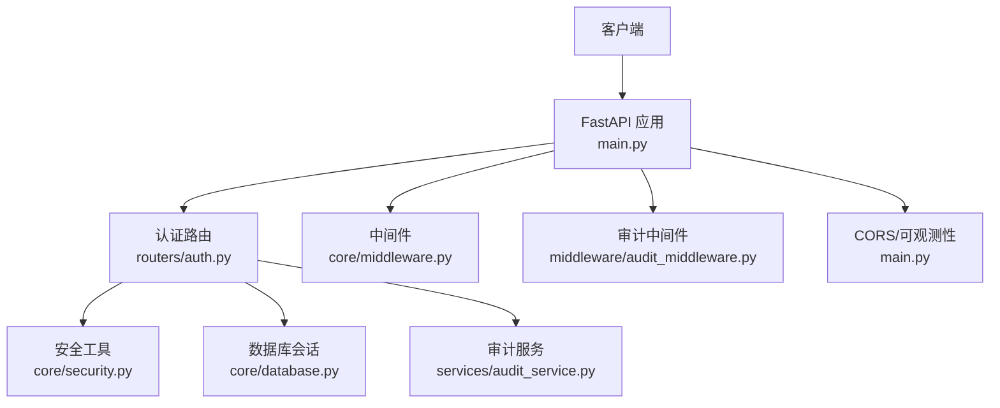
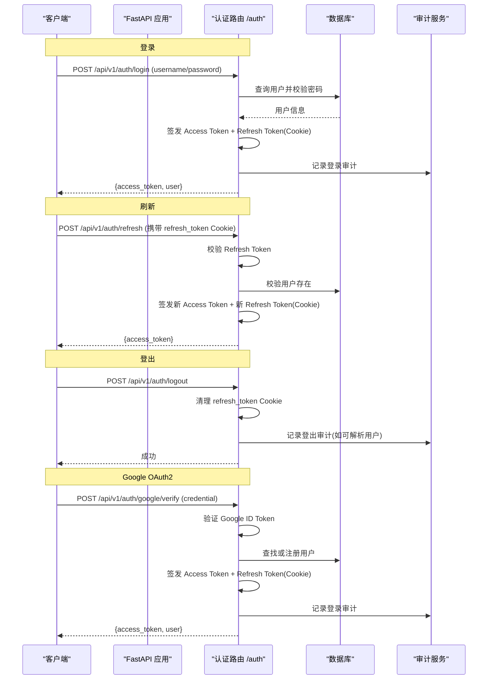
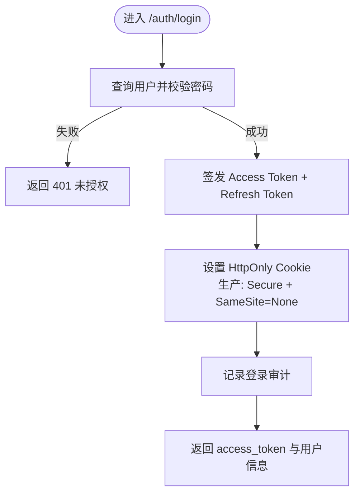
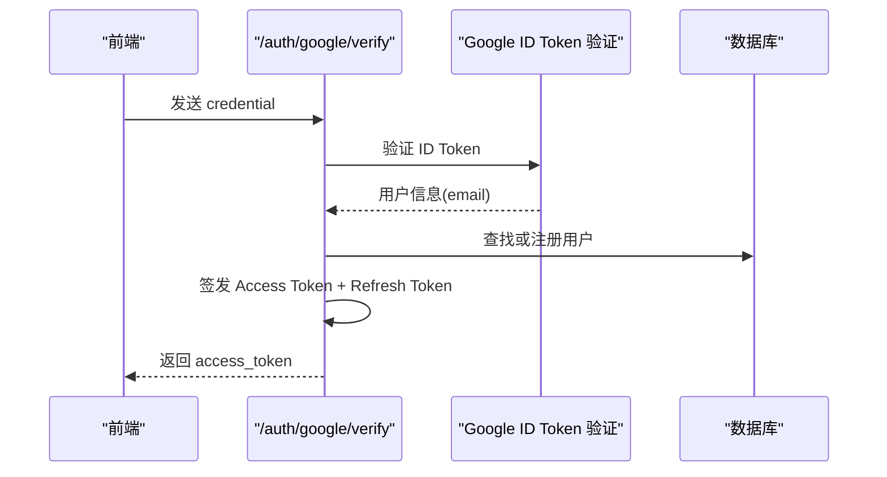
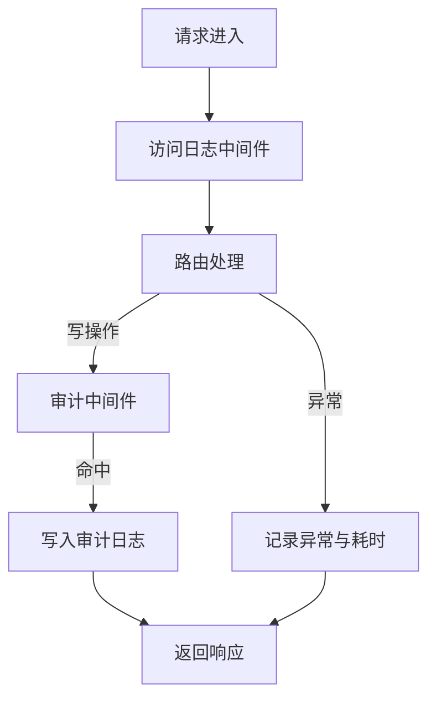
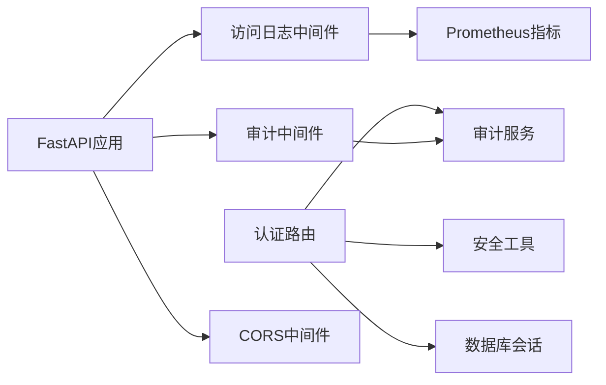

# 认证与安全

<cite>
**本文引用的文件**
- [backend/routers/auth.py](file://backend/routers/auth.py)
- [backend/core/security.py](file://backend/core/security.py)
- [backend/core/middleware.py](file://backend/core/middleware.py)
- [backend/middleware/audit_middleware.py](file://backend/middleware/audit_middleware.py)
- [backend/services/audit_service.py](file://backend/services/audit_service.py)
- [backend/core/models.py](file://backend/core/models.py)
- [backend/main.py](file://backend/main.py)
- [backend/tests/test_auth.py](file://backend/tests/test_auth.py)
</cite>

## 目录
1. [简介](#简介)
2. [项目结构](#项目结构)
3. [核心组件](#核心组件)
4. [架构总览](#架构总览)
5. [详细组件分析](#详细组件分析)
6. [依赖关系分析](#依赖关系分析)
7. [性能与可用性考量](#性能与可用性考量)
8. [故障排查指南](#故障排查指南)
9. [结论](#结论)
10. [附录：API安全最佳实践与配置清单](#附录api安全最佳实践与配置清单)

## 简介
本文件面向Quant Agent的认证与安全机制，覆盖JWT令牌认证流程（登录、刷新、登出）、OAuth2集成（Google第三方登录）、角色权限控制现状与建议、API安全最佳实践（输入校验、防注入/XSS建议）、安全配置（HTTPS、CORS、安全头）以及审计日志与异常检测。文档同时为API使用者提供安全的集成方案与排障指引。

## 项目结构
后端采用FastAPI框架，认证相关能力集中在路由层与核心安全模块中，并通过中间件实现访问日志与审计记录。关键路径如下：
- 认证路由：/api/v1/auth/*
- 安全工具：密码哈希、内部服务HMAC签名
- 中间件：请求访问日志、外部API监控、审计中间件
- 模型：用户表及失败登录计数、锁定时间等安全字段
- 应用装配：CORS、路由挂载、生命周期

图表来源
- [backend/main.py:125-200](file://backend/main.py#L125-L200)
- [backend/routers/auth.py:100-386](file://backend/routers/auth.py#L100-L386)
- [backend/core/middleware.py:90-133](file://backend/core/middleware.py#L90-L133)
- [backend/middleware/audit_middleware.py:30-77](file://backend/middleware/audit_middleware.py#L30-L77)
- [backend/services/audit_service.py:43-80](file://backend/services/audit_service.py#L43-L80)

章节来源
- [backend/main.py:125-200](file://backend/main.py#L125-L200)
- [backend/routers/auth.py:100-386](file://backend/routers/auth.py#L100-L386)

## 核心组件
- JWT认证与令牌管理：Access Token短效、Refresh Token长效并支持滑动续期；Cookie安全属性按环境设置；可选认证依赖用于匿名接口。
- OAuth2集成：Google ID Token验证后自动注册或复用本地用户，签发系统内部JWT。
- 密码安全：bcrypt哈希与验证；可配置强度。
- 内部通信安全：HMAC-SHA256签名生成与验证，防止内网横向调用伪造。
- 审计与可观测性：统一审计日志写入；全局访问日志与外部API耗时统计。
- 用户安全字段：登录失败次数与锁定截止时间，可用于扩展限流与账户保护。

章节来源
- [backend/routers/auth.py:22-98](file://backend/routers/auth.py#L22-L98)
- [backend/routers/auth.py:117-162](file://backend/routers/auth.py#L117-L162)
- [backend/routers/auth.py:204-299](file://backend/routers/auth.py#L204-L299)
- [backend/routers/auth.py:305-385](file://backend/routers/auth.py#L305-L385)
- [backend/core/security.py:20-31](file://backend/core/security.py#L20-L31)
- [backend/core/security.py:37-119](file://backend/core/security.py#L37-L119)
- [backend/core/models.py:37-51](file://backend/core/models.py#L37-L51)
- [backend/services/audit_service.py:43-80](file://backend/services/audit_service.py#L43-L80)

## 架构总览
下图展示了从客户端到认证路由、再到数据库与审计服务的完整调用链，包括登录、刷新、登出与Google OAuth2验证流程。

图表来源
- [backend/routers/auth.py:117-162](file://backend/routers/auth.py#L117-L162)
- [backend/routers/auth.py:204-299](file://backend/routers/auth.py#L204-L299)
- [backend/routers/auth.py:305-385](file://backend/routers/auth.py#L305-L385)
- [backend/services/audit_service.py:43-80](file://backend/services/audit_service.py#L43-L80)

## 详细组件分析

### JWT令牌认证流程
- 登录
  - 接收用户名/密码，校验用户与密码哈希匹配。
  - 签发短效Access Token与长效Refresh Token。
  - 将Refresh Token以HttpOnly Cookie下发，生产环境启用Secure与SameSite=None以支持跨域刷新。
  - 记录登录审计。
- 刷新
  - 从Cookie读取Refresh Token并校验类型与过期。
  - 校验用户存在，签发新的Access Token。
  - 滑动续期：签发新的Refresh Token并更新Cookie。
- 登出
  - 尝试解析当前用户（可选），记录登出审计。
  - 删除refresh_token Cookie（参数与设置时一致）。
- 可选认证
  - 提供可选认证依赖，有token则解析返回用户名，无token返回None，便于部分接口允许匿名访问。

图表来源
- [backend/routers/auth.py:117-162](file://backend/routers/auth.py#L117-L162)
- [backend/routers/auth.py:28-41](file://backend/routers/auth.py#L28-L41)
- [backend/services/audit_service.py:43-80](file://backend/services/audit_service.py#L43-L80)

章节来源
- [backend/routers/auth.py:22-98](file://backend/routers/auth.py#L22-L98)
- [backend/routers/auth.py:117-162](file://backend/routers/auth.py#L117-L162)
- [backend/routers/auth.py:305-385](file://backend/routers/auth.py#L305-L385)

### OAuth2集成（Google）
- 前端通过Google登录获取ID Token，调用后端验证接口。
- 后端使用Google库验证ID Token，提取邮箱。
- 根据邮箱在本地数据库查找或自动注册用户（兼容有无email列）。
- 签发系统内部JWT，下发Refresh Token Cookie，记录审计。

图表来源
- [backend/routers/auth.py:204-299](file://backend/routers/auth.py#L204-L299)

章节来源
- [backend/routers/auth.py:204-299](file://backend/routers/auth.py#L204-L299)

### 角色权限控制系统
- 当前数据模型包含用户基础信息与登录失败计数、锁定截止时间，但未定义显式的角色/权限表与RBAC策略。
- 建议扩展方向：
  - 引入角色与资源权限表，结合用户-角色-资源-操作进行鉴权。
  - 在路由层增加基于角色的装饰器或依赖项，对敏感接口进行细粒度授权。
  - 结合审计日志记录越权尝试与操作结果，便于追踪与告警。

章节来源
- [backend/core/models.py:37-51](file://backend/core/models.py#L37-L51)

### API安全最佳实践
- 输入验证
  - 使用Pydantic模型对请求体进行强类型校验，避免非法输入进入业务逻辑。
  - 对路径参数、查询参数进行白名单与格式校验。
- SQL注入防护
  - 使用ORM查询（本项目已使用SQLAlchemy ORM），避免拼接原生SQL。
  - 如需原生SQL，使用参数化查询。
- XSS防护
  - 前端渲染对用户输入进行转义；后端输出JSON时确保内容不被直接执行。
  - 对富文本输入进行清洗与限制。
- 传输安全
  - 生产环境强制HTTPS；Cookie设置Secure标志。
  - 配置CORS仅允许可信来源，开启credentials支持。
- 速率限制与账户保护
  - 利用用户模型的failed_login_attempts与locked_until实现登录失败计数与临时锁定。
  - 结合中间件或网关层实施IP/账号级限流。

章节来源
- [backend/core/models.py:37-51](file://backend/core/models.py#L37-L51)
- [backend/main.py:149-160](file://backend/main.py#L149-L160)

### 安全配置指南
- HTTPS
  - 在生产部署中使用反向代理（Nginx/Traefik）终止TLS，并将X-Forwarded-Proto等头传递给后端。
  - Cookie设置Secure标志，确保仅在HTTPS下传输。
- CORS
  - 通过环境变量ALLOWED_ORIGINS精确配置允许的源。
  - 保持allow_credentials=True时，不要使用通配符*作为origin。
- 安全头
  - 建议在反向代理层设置Strict-Transport-Security、Content-Security-Policy、X-Frame-Options等。
  - 后端可通过自定义中间件添加安全响应头（如X-Content-Type-Options: nosniff）。
- 密钥管理
  - SECRET_KEY与INTERNAL_API_SECRET应从环境变量或密钥管理服务注入，禁止硬编码。
  - 定期轮换密钥，并在多实例环境下保证一致性。

章节来源
- [backend/main.py:149-160](file://backend/main.py#L149-L160)
- [backend/routers/auth.py:28-41](file://backend/routers/auth.py#L28-L41)
- [backend/core/security.py:37-119](file://backend/core/security.py#L37-L119)

### 审计日志与异常检测
- 审计日志
  - 登录、登出、改密等操作均记录审计日志，包含动作、详情、IP、追踪ID与用户ID。
  - 审计中间件对POST/PUT/DELETE的关键路径进行拦截并记录。
- 异常检测
  - 全局访问日志中间件记录请求耗时与状态码，异常时记录堆栈。
  - 外部API调用耗时监控，慢请求告警。

图表来源
- [backend/core/middleware.py:90-133](file://backend/core/middleware.py#L90-L133)
- [backend/middleware/audit_middleware.py:30-77](file://backend/middleware/audit_middleware.py#L30-L77)
- [backend/services/audit_service.py:43-80](file://backend/services/audit_service.py#L43-L80)

章节来源
- [backend/core/middleware.py:90-133](file://backend/core/middleware.py#L90-L133)
- [backend/middleware/audit_middleware.py:30-77](file://backend/middleware/audit_middleware.py#L30-L77)
- [backend/services/audit_service.py:43-80](file://backend/services/audit_service.py#L43-L80)

## 依赖关系分析
- 认证路由依赖：
  - 数据库会话（get_db）
  - 安全工具（密码哈希、HMAC签名）
  - 审计服务（log_audit）
- 中间件依赖：
  - 访问日志中间件依赖Prometheus指标与结构化日志
  - 审计中间件依赖审计服务与数据库会话
- 应用装配：
  - CORS中间件与访问日志中间件的顺序影响OPTIONS预检行为

图表来源
- [backend/routers/auth.py:100-386](file://backend/routers/auth.py#L100-L386)
- [backend/core/middleware.py:90-133](file://backend/core/middleware.py#L90-L133)
- [backend/middleware/audit_middleware.py:30-77](file://backend/middleware/audit_middleware.py#L30-L77)
- [backend/main.py:149-160](file://backend/main.py#L149-L160)

章节来源
- [backend/routers/auth.py:100-386](file://backend/routers/auth.py#L100-L386)
- [backend/core/middleware.py:90-133](file://backend/core/middleware.py#L90-L133)
- [backend/middleware/audit_middleware.py:30-77](file://backend/middleware/audit_middleware.py#L30-L77)
- [backend/main.py:149-160](file://backend/main.py#L149-L160)

## 性能与可用性考量
- 令牌有效期
  - Access Token短效（15分钟）降低泄露风险；Refresh Token长效（30天）配合滑动续期提升用户体验。
- 中间件开销
  - 访问日志与指标采集为轻量内存操作，注意高基数维度（如UNMATCHED_ROUTE）避免内存泄漏。
- 外部API监控
  - 对第三方API调用进行耗时与状态码统计，慢请求告警有助于定位瓶颈。
- 数据库连接
  - 审计日志写入失败不应阻塞主流程，确保健壮性。

章节来源
- [backend/routers/auth.py:22-25](file://backend/routers/auth.py#L22-L25)
- [backend/core/middleware.py:90-133](file://backend/core/middleware.py#L90-L133)

## 故障排查指南
- 登录失败
  - 检查用户名/密码是否正确；查看审计日志确认是否触发失败计数与锁定。
  - 若频繁失败，检查是否存在暴力破解攻击并启用IP限流。
- 刷新Token失败
  - 确认Cookie中refresh_token存在且类型为refresh；检查生产环境Secure与SameSite设置。
  - 若跨域刷新失败，确保CORS允许来源与credentials开启。
- Google OAuth2验证失败
  - 检查GOOGLE_CLIENT_ID配置；确认前端传递的credential有效。
  - 查看后端终端堆栈与审计日志定位错误。
- 登出不生效
  - 确认客户端正确调用登出接口并删除本地存储的token。
  - 检查服务端是否成功删除refresh_token Cookie。
- 审计日志缺失
  - 检查审计中间件是否命中目标路径；确认数据库写入正常。
  - 查看异常日志与数据库连接状态。

章节来源
- [backend/routers/auth.py:117-162](file://backend/routers/auth.py#L117-L162)
- [backend/routers/auth.py:204-299](file://backend/routers/auth.py#L204-L299)
- [backend/routers/auth.py:305-385](file://backend/routers/auth.py#L305-L385)
- [backend/services/audit_service.py:43-80](file://backend/services/audit_service.py#L43-L80)
- [backend/tests/test_auth.py:85-118](file://backend/tests/test_auth.py#L85-L118)

## 结论
Quant Agent的认证与安全机制以JWT为核心，结合OAuth2第三方登录、审计日志与可观测性中间件，提供了完整的登录、刷新、登出流程。当前模型尚未实现RBAC，建议后续引入角色与权限体系以支撑细粒度访问控制。生产环境应严格配置HTTPS、CORS与安全头，并结合限流与账户锁定策略增强安全性。

## 附录：API安全最佳实践与配置清单
- 输入校验
  - 使用Pydantic模型校验所有请求体与参数。
  - 对枚举、范围、长度进行约束。
- 防注入
  - 优先使用ORM；必要时使用参数化查询。
  - 避免直接拼接用户输入到SQL或命令中。
- 防XSS
  - 前端对用户输入进行转义；后端输出JSON。
  - 对富文本输入进行清洗。
- 传输安全
  - 强制HTTPS；Cookie设置Secure与HttpOnly。
  - 配置CORS仅允许可信来源，谨慎使用credentials。
- 密钥管理
  - 使用环境变量或密钥管理服务注入SECRET_KEY与INTERNAL_API_SECRET。
  - 定期轮换并最小化权限。
- 限流与账户保护
  - 基于failed_login_attempts与locked_until实现登录失败计数与锁定。
  - 在网关层实施IP/账号级限流。
- 审计与监控
  - 记录关键操作的审计日志。
  - 使用Prometheus监控请求量、耗时与外部API调用。

章节来源
- [backend/core/models.py:37-51](file://backend/core/models.py#L37-L51)
- [backend/main.py:149-160](file://backend/main.py#L149-L160)
- [backend/core/middleware.py:90-133](file://backend/core/middleware.py#L90-L133)
- [backend/services/audit_service.py:43-80](file://backend/services/audit_service.py#L43-L80)