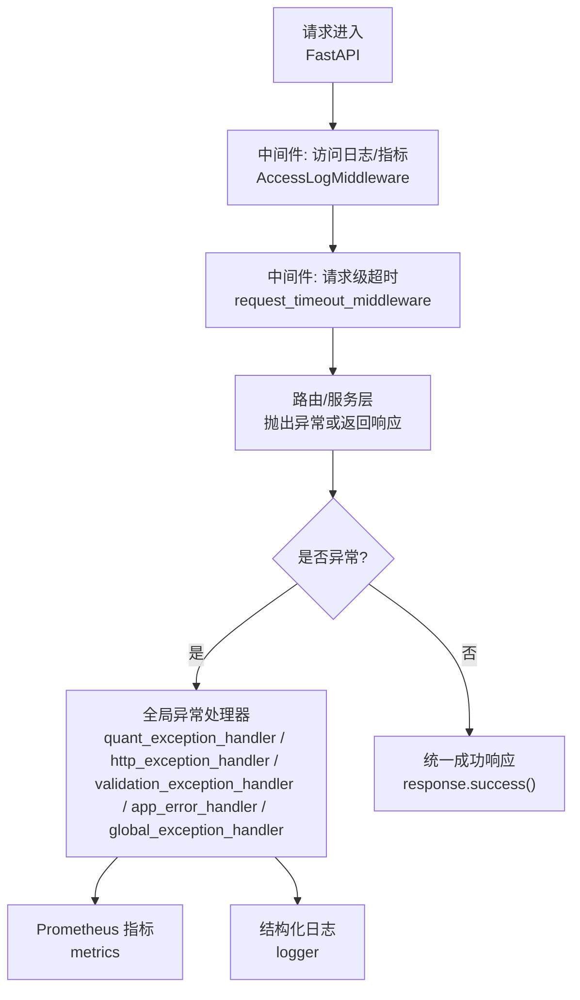
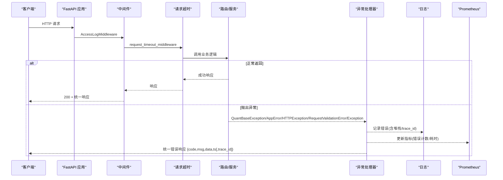
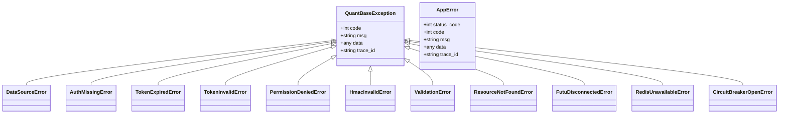
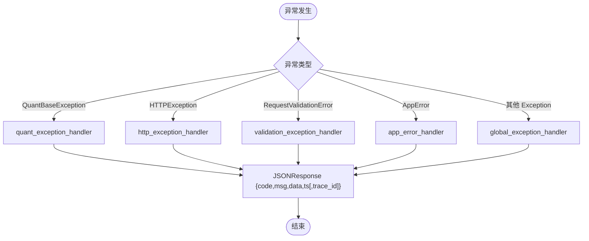
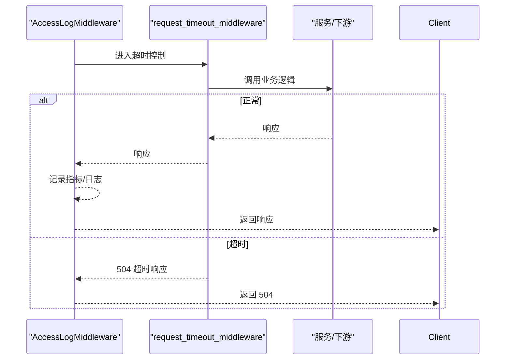
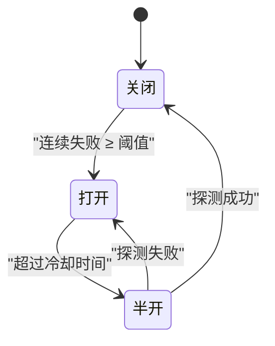
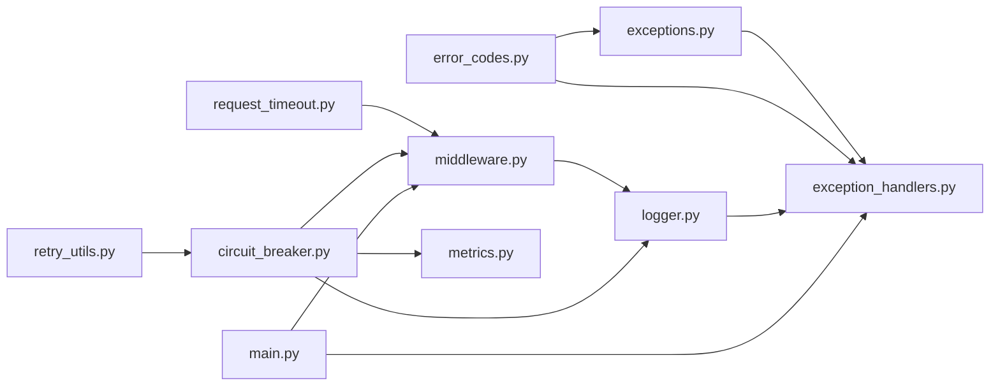

# 错误处理与调试

<cite>
**本文引用的文件**
- [backend/core/exceptions.py](file://backend/core/exceptions.py)
- [backend/core/error_codes.py](file://backend/core/error_codes.py)
- [backend/core/exception_handlers.py](file://backend/core/exception_handlers.py)
- [backend/core/response.py](file://backend/core/response.py)
- [backend/core/logger.py](file://backend/core/logger.py)
- [backend/core/middleware.py](file://backend/core/middleware.py)
- [backend/core/retry_utils.py](file://backend/core/retry_utils.py)
- [backend/core/circuit_breaker.py](file://backend/core/circuit_breaker.py)
- [backend/core/request_timeout.py](file://backend/core/request_timeout.py)
- [backend/main.py](file://backend/main.py)
- [backend/tests/test_main_exception_handlers.py](file://backend/tests/test_main_exception_handlers.py)
</cite>

## 目录
1. [简介](#简介)
2. [项目结构](#项目结构)
3. [核心组件](#核心组件)
4. [架构总览](#架构总览)
5. [详细组件分析](#详细组件分析)
6. [依赖关系分析](#依赖关系分析)
7. [性能考量](#性能考量)
8. [故障排查指南](#故障排查指南)
9. [结论](#结论)
10. [附录](#附录)

## 简介
本文件面向 Quant Agent 后端，系统化说明统一的异常处理机制、标准错误响应格式、分层错误处理策略、常见错误诊断与解决方案、日志规范与调试工具，以及错误监控与告警配置。目标是让开发者快速定位问题、统一对外错误语义、提升系统可观测性与稳定性。

## 项目结构
Quant Agent 的错误处理由“异常定义 + 错误码 + 全局处理器 + 中间件 + 重试/熔断/超时 + 日志/指标”共同构成，入口在应用工厂中注册处理器与中间件，业务层通过抛出自定义异常或返回统一响应体来对外暴露错误。

图示来源
- [backend/main.py:125-142](file://backend/main.py#L125-L142)
- [backend/core/middleware.py:90-133](file://backend/core/middleware.py#L90-L133)
- [backend/core/request_timeout.py:27-68](file://backend/core/request_timeout.py#L27-L68)
- [backend/core/exception_handlers.py:18-102](file://backend/core/exception_handlers.py#L18-L102)

章节来源
- [backend/main.py:125-142](file://backend/main.py#L125-L142)
- [backend/core/middleware.py:90-133](file://backend/core/middleware.py#L90-L133)
- [backend/core/request_timeout.py:27-68](file://backend/core/request_timeout.py#L27-L68)
- [backend/core/exception_handlers.py:18-102](file://backend/core/exception_handlers.py#L18-L102)

## 核心组件
- 自定义异常类：提供领域化异常族，便于上层捕获与分类处理。
- 错误码枚举：统一业务错误码及 HTTP 状态映射。
- 全局异常处理器：将各类异常转换为统一 JSON 响应。
- 统一响应封装：成功与失败的标准返回结构。
- 中间件：访问日志、外部 API 监控、请求级超时。
- 重试与熔断：网络/外部依赖的自动重试与熔断保护。
- 日志与指标：结构化日志、Prometheus 指标、Webhook 告警。

章节来源
- [backend/core/exceptions.py:14-144](file://backend/core/exceptions.py#L14-L144)
- [backend/core/error_codes.py:15-55](file://backend/core/error_codes.py#L15-L55)
- [backend/core/exception_handlers.py:18-102](file://backend/core/exception_handlers.py#L18-L102)
- [backend/core/response.py:21-70](file://backend/core/response.py#L21-L70)
- [backend/core/middleware.py:10-133](file://backend/core/middleware.py#L10-L133)
- [backend/core/retry_utils.py:10-58](file://backend/core/retry_utils.py#L10-L58)
- [backend/core/circuit_breaker.py:45-379](file://backend/core/circuit_breaker.py#L45-L379)
- [backend/core/logger.py:129-212](file://backend/core/logger.py#L129-L212)
- [backend/core/metrics.py:96-110](file://backend/core/metrics.py#L96-L110)

## 架构总览
下图展示从请求到响应的完整错误处理链路，包括中间件拦截、异常分类、统一响应、指标上报与日志落盘。

图示来源
- [backend/main.py:125-142](file://backend/main.py#L125-L142)
- [backend/core/middleware.py:90-133](file://backend/core/middleware.py#L90-L133)
- [backend/core/request_timeout.py:27-68](file://backend/core/request_timeout.py#L27-L68)
- [backend/core/exception_handlers.py:18-102](file://backend/core/exception_handlers.py#L18-L102)

## 详细组件分析

### 自定义异常类与错误码
- 基类与子类：
  - QuantBaseException：所有业务异常的基类，携带 code/msg/data/trace_id。
  - DataSourceError：数据源层错误，兼容 message/source 字段合并。
  - 认证/鉴权异常：AuthMissingError、TokenExpiredError、TokenInvalidError、PermissionDeniedError、HmacInvalidError。
  - 请求/资源异常：ValidationError、ResourceNotFoundError。
  - 基础设施异常：FutuDisconnectedError、RedisUnavailableError、CircuitBreakerOpenError。
  - AppError：编排层抛出的业务错误，继承 HTTPException，便于最小化测试与应用统一处理。
- 错误码与 HTTP 状态映射：ErrorCode 枚举集中管理，ERROR_CODE_TO_HTTP_STATUS 提供统一映射。

图示来源
- [backend/core/exceptions.py:14-144](file://backend/core/exceptions.py#L14-L144)
- [backend/core/error_codes.py:15-55](file://backend/core/error_codes.py#L15-L55)

章节来源
- [backend/core/exceptions.py:14-144](file://backend/core/exceptions.py#L14-L144)
- [backend/core/error_codes.py:15-55](file://backend/core/error_codes.py#L15-L55)

### 全局异常处理器与统一响应
- 处理器职责：
  - quant_exception_handler：捕获 QuantBaseException，按错误码映射 HTTP 状态，输出 {code,msg,data,ts[,trace_id]}。
  - http_exception_handler：捕获 FastAPI HTTPException，统一为相同格式。
  - validation_exception_handler：捕获 Pydantic 校验失败，返回 code=2001，data 包含字段级错误详情。
  - app_error_handler：捕获编排层 AppError，透传 status_code。
  - global_exception_handler：兜底捕获未预料异常，生成 trace_id 并返回 500。
- 统一响应：
  - success(data,msg)：返回 {code:0,msg,data,ts}。
  - error(code,msg,data,http_status,trace_id)：返回 JSONResponse，自动映射 HTTP 状态。

图示来源
- [backend/core/exception_handlers.py:18-102](file://backend/core/exception_handlers.py#L18-L102)
- [backend/core/response.py:21-70](file://backend/core/response.py#L21-L70)

章节来源
- [backend/core/exception_handlers.py:18-102](file://backend/core/exception_handlers.py#L18-L102)
- [backend/core/response.py:21-70](file://backend/core/response.py#L21-L70)

### 中间件：访问日志、外部 API 监控与请求级超时
- AccessLogMiddleware：
  - 记录方法、端点、状态码、耗时；对未匹配路由避免高基数内存泄漏。
  - 收集 Prometheus 指标 fastapi_requests_total、fastapi_request_duration_seconds。
  - 异常路径同样记录耗时与 5xx 计数。
- 外部 API 监控：
  - 通过 httpx 钩子记录 egress 请求的 service_name、method、status、耗时。
  - 慢请求（>3s）记录警告日志。
- 请求级超时：
  - 根据路由前缀设置不同超时（如 screener/market/默认）。
  - 非流式：asyncio.timeout 包裹，超时返回 504。
  - 流式：heartbeat_wrap 保活 + 断开取消 + 超时熔断。

图示来源
- [backend/core/middleware.py:90-133](file://backend/core/middleware.py#L90-L133)
- [backend/core/request_timeout.py:27-68](file://backend/core/request_timeout.py#L27-L68)

章节来源
- [backend/core/middleware.py:90-133](file://backend/core/middleware.py#L90-L133)
- [backend/core/request_timeout.py:27-68](file://backend/core/request_timeout.py#L27-L68)

### 重试与熔断：网络与外部依赖容错
- 重试（tenacity）：
  - is_retryable_http_error：识别限流/封禁/网络错误/服务端错误等触发重试。
  - with_global_retry：指数退避 + 随机抖动，最多 3 次，reraise 保留异常。
- 熔断器（Circuit Breaker）：
  - 状态机：CLOSED → OPEN（连续失败≥阈值）→ HALF_OPEN（冷却后探测）→ CLOSED（探测成功）。
  - 支持异步/同步调用、装饰器、手动记录成功/失败、状态快照。
  - 限流错误不计入失败计数（可覆盖判定）。
  - 熔断时抛出 CircuitBreakerOpenError，统一错误码 3003。

图示来源
- [backend/core/retry_utils.py:10-58](file://backend/core/retry_utils.py#L10-L58)
- [backend/core/circuit_breaker.py:45-379](file://backend/core/circuit_breaker.py#L45-L379)

章节来源
- [backend/core/retry_utils.py:10-58](file://backend/core/retry_utils.py#L10-L58)
- [backend/core/circuit_breaker.py:45-379](file://backend/core/circuit_breaker.py#L45-L379)

### 日志规范与调试工具
- 日志系统：
  - Rich 控制台高亮输出，分级文件持久化（debug/info/warning/error），按天切割并保留 30 天。
  - QueueHandler + QueueListener 无阻塞异步落盘。
  - WebhookAlertHandler：严重错误（ERROR+）发送钉钉/企微/Telegram 报警（需配置 ALERT_WEBHOOK_URL）。
  - 接管 uvicorn/fastapi 日志，统一格式；降低 SQLAlchemy INFO 噪音。
- 调试建议：
  - 使用 trace_id 关联请求链路（异常或响应中携带）。
  - 结合 Prometheus 指标与 Grafana 面板观察错误率与延迟。
  - 利用结构化日志定位模块与方法名。

章节来源
- [backend/core/logger.py:129-212](file://backend/core/logger.py#L129-L212)

### 监控与告警配置
- Prometheus 指标：
  - 请求总量与耗时：fastapi_requests_total、fastapi_request_duration_seconds。
  - 外部 API 监控：external_api_requests_total、external_api_request_duration_seconds。
  - 熔断器状态与转换：quant_circuit_breaker_state、quant_circuit_breaker_transitions_total。
  - 数据源可用性、限流、拨测等丰富指标（见 metrics 文件）。
- 告警建议：
  - 5xx 错误率突增、P99/P95 延迟升高、熔断器频繁 OPEN/HALF_OPEN。
  - 外部 API 慢请求（>3s）与限流次数上升。
  - 进程线程数接近阈值（可通过 PROCESS_THREAD_WARN_THRESHOLD 配置）。

章节来源
- [backend/core/middleware.py:10-88](file://backend/core/middleware.py#L10-L88)
- [backend/core/metrics.py:96-110](file://backend/core/metrics.py#L96-L110)
- [backend/core/metrics.py:152-217](file://backend/core/metrics.py#L152-L217)
- [backend/core/metrics.py:594-619](file://backend/core/metrics.py#L594-L619)

## 依赖关系分析
- 异常与错误码：
  - exceptions.py 依赖 error_codes.py 的 ErrorCode 进行映射。
- 异常处理器：
  - exception_handlers.py 依赖 error_codes.py、exceptions.py、logger.py。
- 中间件：
  - middleware.py 依赖 logger.py、prometheus_client。
  - request_timeout.py 依赖 stream_utils（心跳）、fastapi/starlette。
- 重试与熔断：
  - retry_utils.py 依赖 tenacity、httpx。
  - circuit_breaker.py 依赖 exceptions.py、logger.py、metrics.py。
- 应用装配：
  - main.py 注册异常处理器与中间件，挂载路由。

图示来源
- [backend/core/error_codes.py:15-55](file://backend/core/error_codes.py#L15-L55)
- [backend/core/exceptions.py:14-144](file://backend/core/exceptions.py#L14-L144)
- [backend/core/exception_handlers.py:18-102](file://backend/core/exception_handlers.py#L18-L102)
- [backend/core/middleware.py:10-133](file://backend/core/middleware.py#L10-L133)
- [backend/core/request_timeout.py:27-68](file://backend/core/request_timeout.py#L27-L68)
- [backend/core/retry_utils.py:10-58](file://backend/core/retry_utils.py#L10-L58)
- [backend/core/circuit_breaker.py:45-379](file://backend/core/circuit_breaker.py#L45-L379)
- [backend/core/metrics.py:96-110](file://backend/core/metrics.py#L96-L110)
- [backend/main.py:125-142](file://backend/main.py#L125-L142)

章节来源
- [backend/core/error_codes.py:15-55](file://backend/core/error_codes.py#L15-L55)
- [backend/core/exceptions.py:14-144](file://backend/core/exceptions.py#L14-L144)
- [backend/core/exception_handlers.py:18-102](file://backend/core/exception_handlers.py#L18-L102)
- [backend/core/middleware.py:10-133](file://backend/core/middleware.py#L10-L133)
- [backend/core/request_timeout.py:27-68](file://backend/core/request_timeout.py#L27-L68)
- [backend/core/retry_utils.py:10-58](file://backend/core/retry_utils.py#L10-L58)
- [backend/core/circuit_breaker.py:45-379](file://backend/core/circuit_breaker.py#L45-L379)
- [backend/core/metrics.py:96-110](file://backend/core/metrics.py#L96-L110)
- [backend/main.py:125-142](file://backend/main.py#L125-L142)

## 性能考量
- 中间件开销：
  - 访问日志与指标采集为纯内存操作，耗时纳秒级；避免对未匹配路由使用高基数标签。
- 超时与流控：
  - 请求级超时防止长尾请求拖垮服务；流式响应通过心跳保活避免代理静默断开。
- 重试与熔断：
  - 指数退避 + 随机抖动降低雪崩风险；熔断器快速失败保护下游。
- 日志与指标：
  - 异步队列落盘与 Prometheus 指标不阻塞主流程；合理设置轮转与保留策略。

[本节为通用指导，无需特定文件引用]

## 故障排查指南
- 网络错误（连接超时、断网、429/403/5xx）：
  - 检查重试策略是否生效（is_retryable_http_error 条件）。
  - 查看外部 API 监控指标与慢请求日志。
  - 若频繁触发，考虑调整熔断参数或限流策略。
- 数据库错误（连接失败、查询超时）：
  - 关注 SQL 日志级别与慢查询；确认连接池与超时配置。
  - 结合 Prometheus 指标观察错误率与延迟。
- 业务逻辑错误（参数校验、权限不足、资源不存在）：
  - 使用 ValidationError/PermissionDeniedError/ResourceNotFoundError 等明确语义。
  - 校验错误会在 data 中包含字段级详情，便于前端提示。
- 熔断与限流：
  - 通过熔断器状态指标与日志判断是否处于 OPEN/HALF_OPEN。
  - 限流错误不计入失败计数，避免误熔断。
- 超时问题：
  - 根据路由前缀确认超时阈值；流式响应需确保心跳正常。
  - 504 响应表明上游处理超时，需优化下游或提高阈值。
- 日志与追踪：
  - 使用 trace_id 关联请求；在 Webhook 告警中获取关键上下文。
  - 结合 Grafana 面板定位热点接口与错误峰值。

章节来源
- [backend/core/retry_utils.py:10-58](file://backend/core/retry_utils.py#L10-L58)
- [backend/core/circuit_breaker.py:45-379](file://backend/core/circuit_breaker.py#L45-L379)
- [backend/core/request_timeout.py:27-68](file://backend/core/request_timeout.py#L27-L68)
- [backend/core/logger.py:129-212](file://backend/core/logger.py#L129-L212)
- [backend/core/metrics.py:96-110](file://backend/core/metrics.py#L96-L110)

## 结论
Quant Agent 通过统一的异常体系、错误码、全局处理器与中间件，实现了端到端的错误标准化与可观测性。配合重试、熔断、超时与日志/指标，能够有效应对网络、数据库与业务逻辑错误，并提供完善的调试与告警能力。建议在实际开发中遵循本规范，持续完善错误语义与监控覆盖。

[本节为总结性内容，无需特定文件引用]

## 附录
- 统一响应格式：
  - 成功：{code:0, msg:"ok", data:{...}, ts:毫秒时间戳}
  - 错误：{code:业务错误码, msg:"描述", data:{附加信息}, ts:毫秒时间戳[, trace_id:"链路ID"]}
- 错误码分域：
  - 0：成功
  - 1xxx：认证/鉴权
  - 2xxx：请求参数/资源
  - 3xxx：外部依赖/基础设施
  - 5xxx：内部未知错误
- 测试参考：
  - 验证 QuantBaseException、RequestValidationError、未知异常的处理器行为与响应格式。

章节来源
- [backend/core/response.py:21-70](file://backend/core/response.py#L21-L70)
- [backend/core/error_codes.py:15-55](file://backend/core/error_codes.py#L15-L55)
- [backend/tests/test_main_exception_handlers.py:41-157](file://backend/tests/test_main_exception_handlers.py#L41-L157)