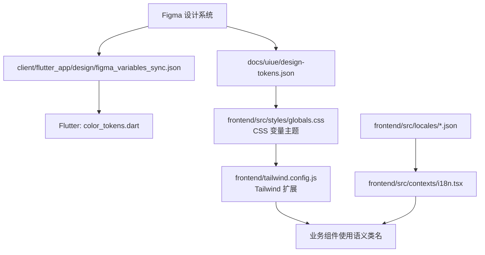
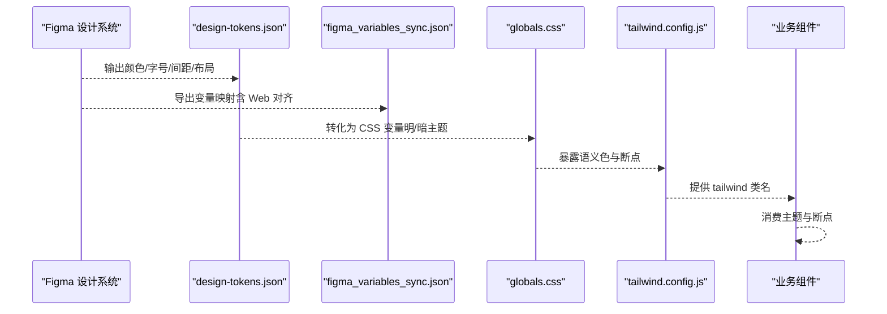
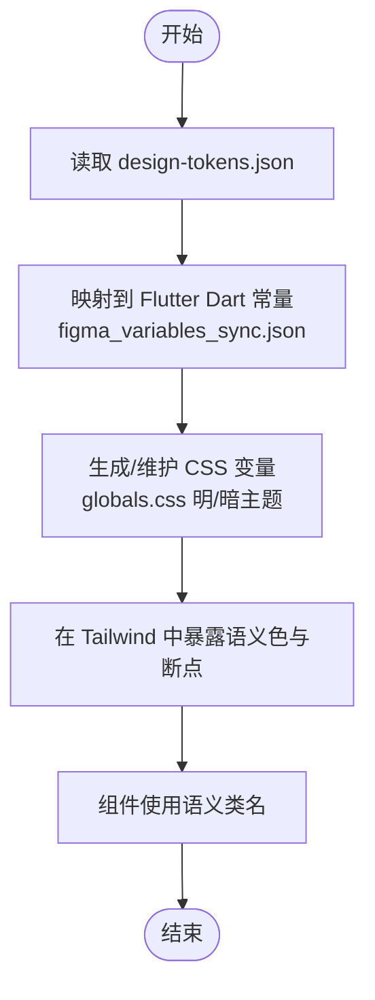
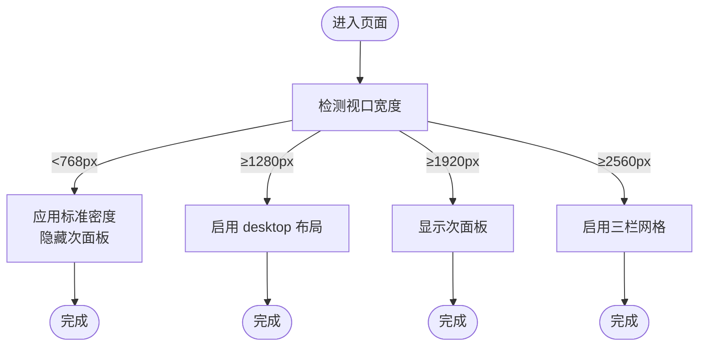
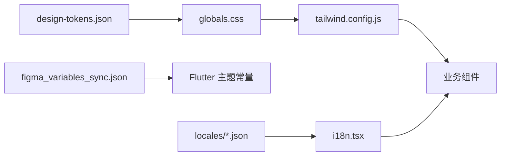

# UI设计规范

<cite>
**本文引用的文件**
- [frontend/tailwind.config.js](file://frontend/tailwind.config.js)
- [frontend/src/styles/globals.css](file://frontend/src/styles/globals.css)
- [docs/uiue/design-tokens.json](file://docs/uiue/design-tokens.json)
- [client/flutter_app/design/figma_variables_sync.json](file://client/flutter_app/design/figma_variables_sync.json)
- [client/flutter_app/design/FIGMA_TOKEN_SYNC.md](file://client/flutter_app/design/FIGMA_TOKEN_SYNC.md)
- [frontend/src/locales/en.json](file://frontend/src/locales/en.json)
- [frontend/src/locales/zh.json](file://frontend/src/locales/zh.json)
- [frontend/src/contexts/i18n.tsx](file://frontend/src/contexts/i18n.tsx)
</cite>

## 目录
1. [简介](#简介)
2. [项目结构](#项目结构)
3. [核心组件](#核心组件)
4. [架构总览](#架构总览)
5. [详细组件分析](#详细组件分析)
6. [依赖分析](#依赖分析)
7. [性能考虑](#性能考虑)
8. [故障排查指南](#故障排查指南)
9. [结论](#结论)
10. [附录](#附录)

## 简介
本规范面向 Quant Agent 前端（Web）与 Flutter 客户端，统一基于 Figma 设计系统落地实现。文档覆盖设计令牌管理、颜色系统、字体与字号、间距标准、响应式策略、主题系统（明暗主题、品牌色定制、场景模式）、多语言界面、无障碍访问与浏览器兼容性，以及用户体验优化建议。目标是让设计与代码保持单一事实来源（SSOT），确保跨端一致性与可维护性。

## 项目结构
前端采用 Tailwind CSS + CSS 变量驱动的主题体系；Flutter 侧通过 Figma Variables 同步到 Dart Token 常量，形成跨端一致的视觉基线。关键位置：
- Web 主题与断点：Tailwind 配置与全局样式
- 设计令牌：UIUE 设计令牌 JSON 与 Flutter 同步表
- 多语言：i18n 上下文与本地化资源



**图表来源**
- [docs/uiue/design-tokens.json:1-49](file://docs/uiue/design-tokens.json#L1-L49)
- [client/flutter_app/design/figma_variables_sync.json:1-89](file://client/flutter_app/design/figma_variables_sync.json#L1-L89)
- [frontend/src/styles/globals.css:1-256](file://frontend/src/styles/globals.css#L1-L256)
- [frontend/tailwind.config.js:1-78](file://frontend/tailwind.config.js#L1-L78)

**章节来源**
- [frontend/tailwind.config.js:1-78](file://frontend/tailwind.config.js#L1-L78)
- [frontend/src/styles/globals.css:1-256](file://frontend/src/styles/globals.css#L1-L256)
- [docs/uiue/design-tokens.json:1-49](file://docs/uiue/design-tokens.json#L1-L49)
- [client/flutter_app/design/figma_variables_sync.json:1-89](file://client/flutter_app/design/figma_variables_sync.json#L1-L89)

## 核心组件
- 设计令牌（Design Tokens）
  - 颜色、圆角、间距、字号、布局栅格等以 JSON 形式定义，作为跨端对齐的权威来源。
  - Flutter 侧通过同步表将 Figma Variables 映射到 Dart 常量，并附带 Web 对齐参考。
- 主题系统
  - Web 使用 CSS 变量定义明/暗主题，结合 Tailwind 扩展语义色与断点。
  - 支持“场景模式”强调色与密度缩放，移动端强制标准密度。
- 响应式设计
  - 自定义断点：sm/md/lg/desktop/wide/ultrawide/xl/2xl。
  - 超宽屏三栏网格与自动次面板显示。
- 多语言
  - i18n 上下文与 en/zh 资源文件，供组件消费。

**章节来源**
- [docs/uiue/design-tokens.json:1-49](file://docs/uiue/design-tokens.json#L1-L49)
- [client/flutter_app/design/figma_variables_sync.json:1-89](file://client/flutter_app/design/figma_variables_sync.json#L1-L89)
- [frontend/src/styles/globals.css:1-256](file://frontend/src/styles/globals.css#L1-L256)
- [frontend/tailwind.config.js:1-78](file://frontend/tailwind.config.js#L1-L78)
- [frontend/src/locales/en.json](file://frontend/src/locales/en.json)
- [frontend/src/locales/zh.json](file://frontend/src/locales/zh.json)
- [frontend/src/contexts/i18n.tsx](file://frontend/src/contexts/i18n.tsx)

## 架构总览
下图展示从设计源到前端实现的令牌流转与主题渲染路径。



**图表来源**
- [docs/uiue/design-tokens.json:1-49](file://docs/uiue/design-tokens.json#L1-L49)
- [client/flutter_app/design/figma_variables_sync.json:1-89](file://client/flutter_app/design/figma_variables_sync.json#L1-L89)
- [frontend/src/styles/globals.css:1-256](file://frontend/src/styles/globals.css#L1-L256)
- [frontend/tailwind.config.js:1-78](file://frontend/tailwind.config.js#L1-L78)

## 详细组件分析

### 设计令牌与颜色系统
- 设计令牌来源
  - docs/uiue/design-tokens.json 定义了背景、面板、边框、文本层级、语义色、圆角、间距、字号与布局栅格。
- Flutter 侧对齐
  - figma_variables_sync.json 将 Figma 变量映射到 Dart 常量，并提供 Web 对齐参考（如 emerald/red/amber/violet/zinc/slate 等）。
  - FIGMA_TOKEN_SYNC.md 规定了同步流程与禁止硬编码颜色的规则。
- Web 主题实现
  - globals.css 定义 :root 与 .dark 两套 CSS 变量，包含基础色板与金融语义色（涨/跌/警示/AI）。
  - tailwind.config.js 通过 hsl(var(--xxx)) 接入 CSS 变量，并扩展屏幕断点与业务语义色（bull/bear/warn/info/scene）。



**图表来源**
- [docs/uiue/design-tokens.json:1-49](file://docs/uiue/design-tokens.json#L1-L49)
- [client/flutter_app/design/figma_variables_sync.json:1-89](file://client/flutter_app/design/figma_variables_sync.json#L1-L89)
- [frontend/src/styles/globals.css:1-256](file://frontend/src/styles/globals.css#L1-L256)
- [frontend/tailwind.config.js:1-78](file://frontend/tailwind.config.js#L1-L78)

**章节来源**
- [docs/uiue/design-tokens.json:1-49](file://docs/uiue/design-tokens.json#L1-L49)
- [client/flutter_app/design/figma_variables_sync.json:1-89](file://client/flutter_app/design/figma_variables_sync.json#L1-L89)
- [client/flutter_app/design/FIGMA_TOKEN_SYNC.md:1-47](file://client/flutter_app/design/FIGMA_TOKEN_SYNC.md#L1-L47)
- [frontend/src/styles/globals.css:1-256](file://frontend/src/styles/globals.css#L1-L256)
- [frontend/tailwind.config.js:1-78](file://frontend/tailwind.config.js#L1-L78)

### 字体与字号规范
- 字体族
  - 全局字体栈优先使用等宽字体用于数值展示，其次为 Inter 与系统无衬线字体。
- 字号与层级
  - 设计令牌定义了 hero-number/card-number/section-title/body/label/caption 等字号层级，用于卡片数字、标题、正文与说明文字。
- 实践建议
  - 在组件中按层级选择字号，避免随意设置 px。
  - 数值列启用 tabular-nums 保证对齐。

**章节来源**
- [frontend/src/styles/globals.css:85-90](file://frontend/src/styles/globals.css#L85-L90)
- [docs/uiue/design-tokens.json:35-42](file://docs/uiue/design-tokens.json#L35-L42)

### 间距与圆角
- 间距
  - 设计令牌定义 gap/page-padding/card-padding，配合 Tailwind 间距工具类使用。
- 圆角
  - 设计令牌定义 card/frame/pill；Web 侧通过 CSS 变量与 Tailwind 扩展映射。
- 实践建议
  - 统一使用 token 对应的间距与圆角，避免散落的硬编码值。

**章节来源**
- [docs/uiue/design-tokens.json:25-34](file://docs/uiue/design-tokens.json#L25-L34)
- [frontend/tailwind.config.js:62-68](file://frontend/tailwind.config.js#L62-L68)
- [frontend/src/styles/globals.css:45-49](file://frontend/src/styles/globals.css#L45-L49)

### 响应式设计策略
- 断点
  - 自定义断点：sm(640)/md(768)/lg(1024)/desktop(1280)/wide(1440)/xl(1280)/2xl(1536)/ultrawide(1920)。
- 布局增强
  - wide 及以上自动显示次要面板；ultrawide 启用三栏网格（行情+策略+AI），研究场景提供 IDE 比例三栏。
  - 移动端强制标准密度，禁用极密布局。
- 动效适配
  - 提供 resp-* 入场动画类，尊重 prefers-reduced-motion。



**图表来源**
- [frontend/tailwind.config.js:10-20](file://frontend/tailwind.config.js#L10-L20)
- [frontend/src/styles/globals.css:158-214](file://frontend/src/styles/globals.css#L158-L214)
- [frontend/src/styles/globals.css:238-246](file://frontend/src/styles/globals.css#L238-L246)

**章节来源**
- [frontend/tailwind.config.js:10-20](file://frontend/tailwind.config.js#L10-L20)
- [frontend/src/styles/globals.css:158-214](file://frontend/src/styles/globals.css#L158-L214)
- [frontend/src/styles/globals.css:238-246](file://frontend/src/styles/globals.css#L238-L246)

### 主题系统（明暗主题、品牌色、场景模式）
- 明暗主题
  - 通过 :root 与 .dark 切换 CSS 变量，Tailwind 使用 darkMode: class。
- 品牌色与语义色
  - 基础色通过 --primary/--secondary 等变量；金融语义色 bull/bear/warn/info/ai 用于涨跌、警示与 AI 内容。
- 场景模式
  - data-scene-mode 属性切换密度与强调色（watch/research/monitor/ai-analysis）。
  - 移动端强制密度为 1，避免小屏拥挤。
- 组件主题化
  - 使用 glass-card、segment-tabs、sparkline 等通用样式类，结合语义色与圆角令牌。

```mermaid
classDiagram
class ThemeVars {
"+background"
"+foreground"
"+card / card-foreground"
"+primary / primary-foreground"
"+secondary / secondary-foreground"
"+muted / muted-foreground"
"+accent / accent-foreground"
"+destructive / destructive-foreground"
"+border / input / ring"
"+color-bull / bear / warn / info / ai"
"+radius / radius-card / radius-pill"
}
class SceneMode {
"+density-scale"
"+scene-accent"
"+ring"
}
ThemeVars <.. SceneMode : "覆盖强调色与密度"
```

**图表来源**
- [frontend/src/styles/globals.css:5-79](file://frontend/src/styles/globals.css#L5-L79)
- [frontend/src/styles/globals.css:158-170](file://frontend/src/styles/globals.css#L158-L170)
- [frontend/tailwind.config.js:21-61](file://frontend/tailwind.config.js#L21-L61)

**章节来源**
- [frontend/src/styles/globals.css:5-79](file://frontend/src/styles/globals.css#L5-L79)
- [frontend/src/styles/globals.css:158-170](file://frontend/src/styles/globals.css#L158-L170)
- [frontend/tailwind.config.js:21-61](file://frontend/tailwind.config.js#L21-L61)

### 多语言界面（i18n）
- 资源文件
  - en.json 与 zh.json 存放文案键值对。
- 上下文
  - i18n.tsx 提供国际化上下文，供组件按需获取当前语言与翻译函数。
- 实践建议
  - 所有用户可见文案必须走 i18n，禁止硬编码字符串。
  - 新增文案需同时补充 en/zh 键值。

**章节来源**
- [frontend/src/locales/en.json](file://frontend/src/locales/en.json)
- [frontend/src/locales/zh.json](file://frontend/src/locales/zh.json)
- [frontend/src/contexts/i18n.tsx](file://frontend/src/contexts/i18n.tsx)

### 具体实现示例（指引）
- 使用设计令牌
  - 颜色：通过 Tailwind 语义类（如 text-primary、bg-card、text-bull）引用 CSS 变量，不直接写色值。
  - 圆角与间距：使用 rounded-card、gap-*、p-* 等类，或对应 token 映射。
- 创建响应式组件
  - 使用断点类 sm/md/lg/desktop/wide/ultrawide 控制布局变化。
  - 在 ≥1920px 时显示次面板，≥2560px 启用三栏网格。
- 处理多语言界面
  - 通过 i18n 上下文获取翻译函数，渲染 en/zh 文案。
- 主题切换
  - 切换根节点 class 或使用 data-scene-mode 切换场景模式与强调色。

[本节为实践指引，不直接分析具体文件]

### 无障碍访问支持
- 减少动态效果
  - 提供 reduce-motion 类与 prefers-reduced-motion 媒体查询，关闭入场动画与滚动行为。
- 对比度与焦点
  - 语义色与前景/背景变量确保足够对比度；ring 变量用于焦点指示。
- 键盘与屏幕阅读器
  - 交互元素需提供可访问名称与状态（aria-*），表单控件具备 label。

**章节来源**
- [frontend/src/styles/globals.css:92-100](file://frontend/src/styles/globals.css#L92-L100)
- [frontend/src/styles/globals.css:238-246](file://frontend/src/styles/globals.css#L238-L246)

### 浏览器兼容性处理
- 现代浏览器特性
  - CSS 变量、Tailwind、Grid/Flexbox 广泛支持。
- 降级策略
  - 通过 reduce-motion 兜底动画；必要时提供 polyfill 或降级样式。
- 测试建议
  - 在主流桌面与移动浏览器进行回归验证，关注旧版 Safari/Edge。

[本节为通用指导，不直接分析具体文件]

## 依赖分析
- 主题依赖链
  - design-tokens.json → globals.css（CSS 变量）→ tailwind.config.js（语义色/断点）→ 组件类名。
- Flutter 依赖链
  - Figma Variables → figma_variables_sync.json → Dart 常量 → 组件主题。
- 多语言依赖
  - locales/*.json → i18n.tsx → 组件文案。



**图表来源**
- [docs/uiue/design-tokens.json:1-49](file://docs/uiue/design-tokens.json#L1-L49)
- [frontend/src/styles/globals.css:1-256](file://frontend/src/styles/globals.css#L1-L256)
- [frontend/tailwind.config.js:1-78](file://frontend/tailwind.config.js#L1-L78)
- [client/flutter_app/design/figma_variables_sync.json:1-89](file://client/flutter_app/design/figma_variables_sync.json#L1-L89)
- [frontend/src/locales/en.json](file://frontend/src/locales/en.json)
- [frontend/src/locales/zh.json](file://frontend/src/locales/zh.json)
- [frontend/src/contexts/i18n.tsx](file://frontend/src/contexts/i18n.tsx)

**章节来源**
- [docs/uiue/design-tokens.json:1-49](file://docs/uiue/design-tokens.json#L1-L49)
- [frontend/src/styles/globals.css:1-256](file://frontend/src/styles/globals.css#L1-L256)
- [frontend/tailwind.config.js:1-78](file://frontend/tailwind.config.js#L1-L78)
- [client/flutter_app/design/figma_variables_sync.json:1-89](file://client/flutter_app/design/figma_variables_sync.json#L1-L89)
- [frontend/src/locales/en.json](file://frontend/src/locales/en.json)
- [frontend/src/locales/zh.json](file://frontend/src/locales/zh.json)
- [frontend/src/contexts/i18n.tsx](file://frontend/src/contexts/i18n.tsx)

## 性能考虑
- 减少重绘与闪烁
  - 价格跳动使用轻量动画，注意在低性能设备上限制频率。
- 减少动画开销
  - 遵循 prefers-reduced-motion，提供无动画降级。
- 布局优化
  - 合理使用 Grid/Flex，避免不必要的回流；在大屏三栏布局下注意内容加载顺序。
- 主题切换
  - 通过 CSS 变量切换主题，避免整页重绘；场景模式切换时仅更新少量变量。

[本节为通用指导，不直接分析具体文件]

## 故障排查指南
- 主题未生效
  - 检查根节点是否包含正确的 class（light/dark）或 data-scene-mode 属性。
  - 确认 Tailwind 已正确引入并编译。
- 颜色不一致
  - 核对 design-tokens.json 与 globals.css 变量是否对齐；Flutter 侧检查 figma_variables_sync.json 映射。
- 响应式异常
  - 检查断点类是否正确；大屏三栏布局需满足最小宽度条件。
- 多语言缺失
  - 确认 en/zh 资源文件中存在对应键；i18n 上下文是否正确注入。

**章节来源**
- [frontend/src/styles/globals.css:5-79](file://frontend/src/styles/globals.css#L5-L79)
- [frontend/src/styles/globals.css:158-170](file://frontend/src/styles/globals.css#L158-L170)
- [frontend/tailwind.config.js:10-20](file://frontend/tailwind.config.js#L10-L20)
- [docs/uiue/design-tokens.json:1-49](file://docs/uiue/design-tokens.json#L1-L49)
- [client/flutter_app/design/figma_variables_sync.json:1-89](file://client/flutter_app/design/figma_variables_sync.json#L1-L89)
- [frontend/src/locales/en.json](file://frontend/src/locales/en.json)
- [frontend/src/locales/zh.json](file://frontend/src/locales/zh.json)
- [frontend/src/contexts/i18n.tsx](file://frontend/src/contexts/i18n.tsx)

## 结论
本规范以 design-tokens.json 与 Figma Variables 为单一事实来源，通过 CSS 变量与 Tailwind 扩展实现 Web 主题与响应式布局；Flutter 侧通过同步表对齐 Dart 常量。配合 i18n、无障碍与性能优化策略，确保跨端一致、可维护且易扩展的设计系统。

[本节为总结，不直接分析具体文件]

## 附录
- 术语
  - 设计令牌：描述 UI 属性的结构化数据（颜色、字号、间距等）。
  - 场景模式：通过 data-scene-mode 切换密度与强调色，适配不同业务场景。
  - 语义色：表达业务含义的颜色（涨/跌/警示/AI）。
- 最佳实践
  - 禁止在组件内硬编码色值与尺寸，统一通过 token 与语义类使用。
  - 新增 token 需同步更新设计源、CSS 变量与 Flutter 映射。
  - 文案一律走 i18n，避免散落字符串。

[本节为补充信息，不直接分析具体文件]
