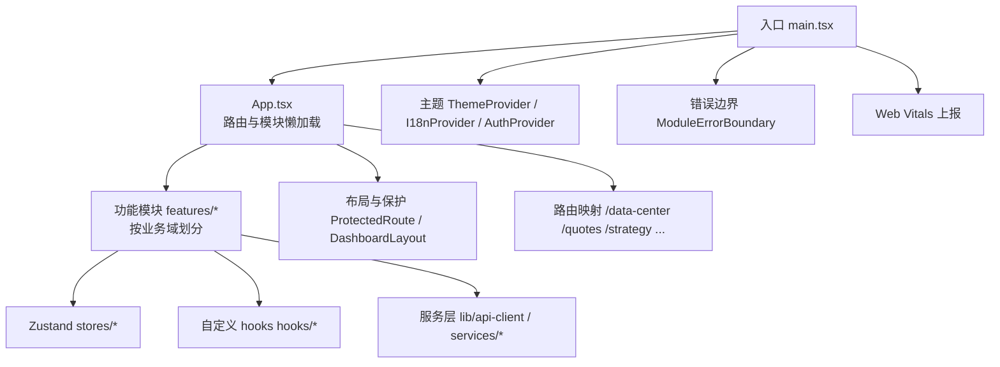
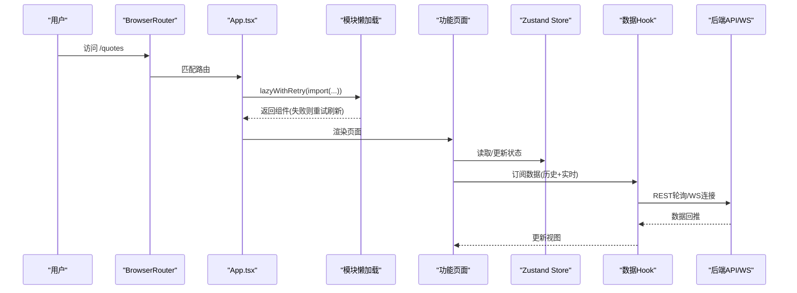
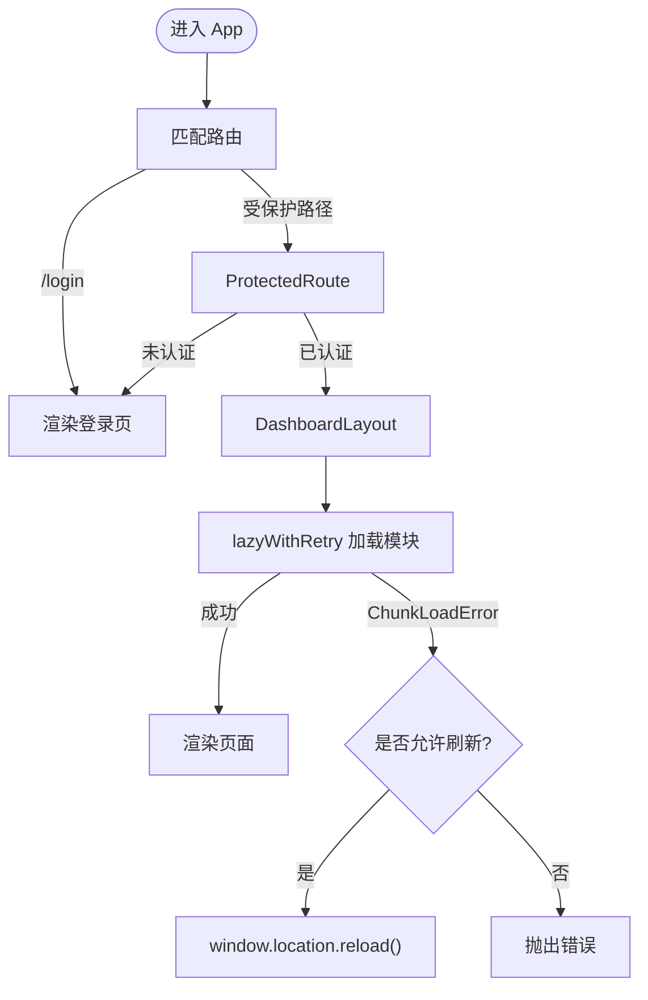
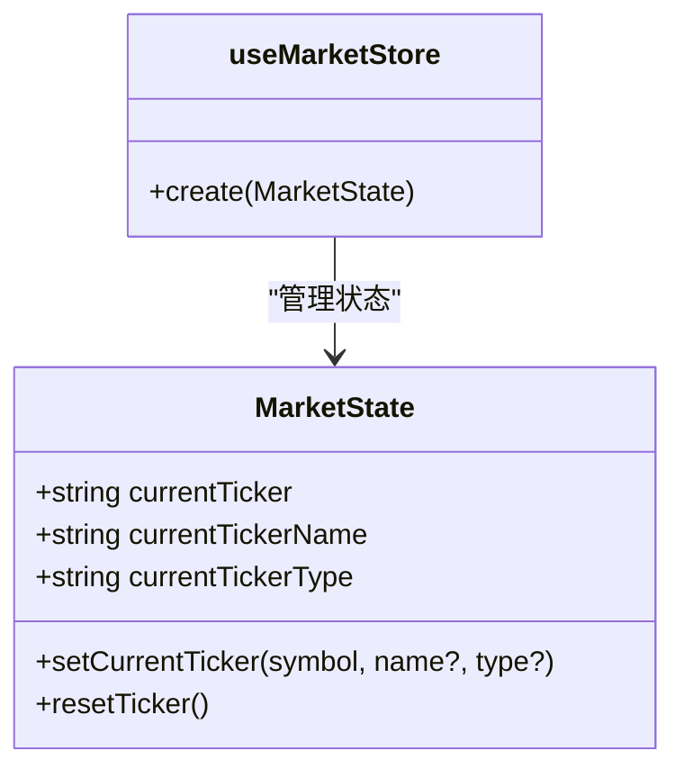
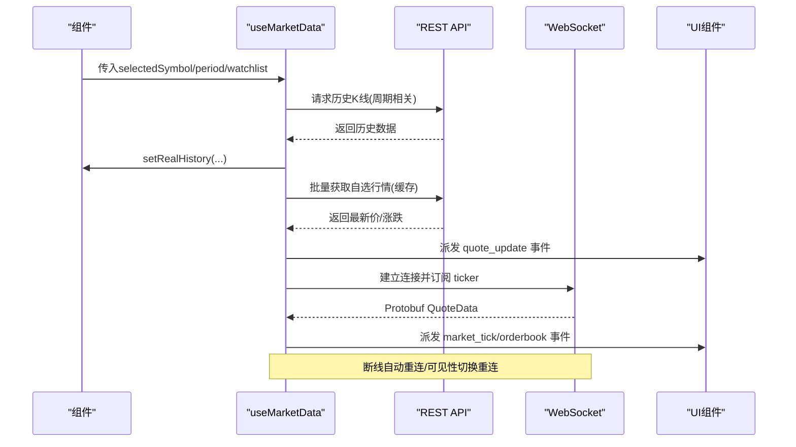
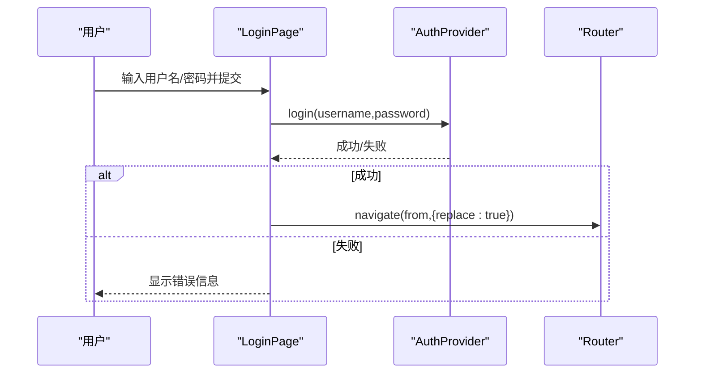
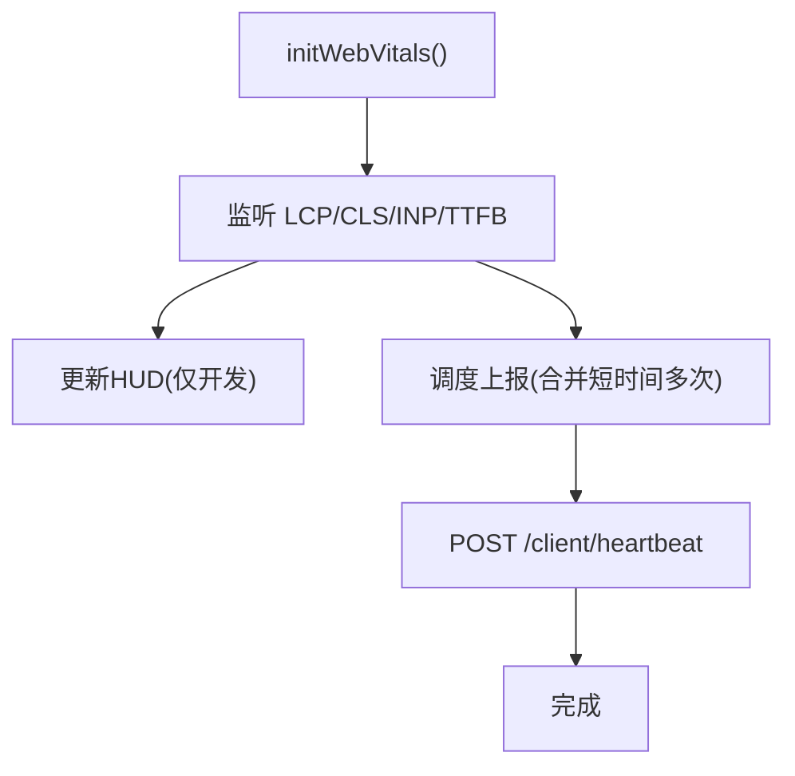
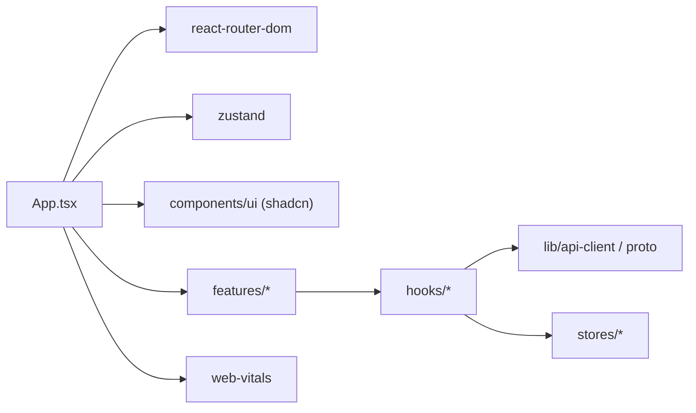

# 前端开发指南

<cite>
**本文引用的文件**
- [frontend/package.json](file://frontend/package.json)
- [frontend/src/main.tsx](file://frontend/src/main.tsx)
- [frontend/src/App.tsx](file://frontend/src/App.tsx)
- [frontend/vite.config.ts](file://frontend/vite.config.ts)
- [frontend/components.json](file://frontend/components.json)
- [frontend/tailwind.config.js](file://frontend/tailwind.config.js)
- [frontend/tsconfig.json](file://frontend/tsconfig.json)
- [frontend/src/stores/marketStore.ts](file://frontend/src/stores/marketStore.ts)
- [frontend/src/hooks/use-market-data.ts](file://frontend/src/hooks/use-market-data.ts)
- [frontend/src/features/auth/login.tsx](file://frontend/src/features/auth/login.tsx)
- [frontend/src/lib/web-vitals-reporter.ts](file://frontend/src/lib/web-vitals-reporter.ts)
</cite>

## 目录
1. [简介](#简介)
2. [项目结构](#项目结构)
3. [核心组件](#核心组件)
4. [架构总览](#架构总览)
5. [详细组件分析](#详细组件分析)
6. [依赖关系分析](#依赖关系分析)
7. [性能考虑](#性能考虑)
8. [故障排查指南](#故障排查指南)
9. [结论](#结论)
10. [附录](#附录)

## 简介
本指南面向Quant Agent前端开发者，系统说明基于React + TypeScript的前端架构与工程实践。内容涵盖：
- 组件化设计与模块化组织（features、hooks、stores、services）
- 状态管理（Zustand）与数据流
- 路由配置与懒加载策略
- UI组件库（shadcn/ui + Tailwind CSS）使用规范
- 样式管理与响应式设计
- 构建配置、性能优化与跨浏览器兼容
- 新页面/交互/异步数据的开发示例与最佳实践

## 项目结构
前端位于 frontend 目录，采用Vite + React + TypeScript构建，使用Tailwind CSS与shadcn/ui作为UI基础，Zustand进行全局状态管理，react-router-dom进行路由控制，并集成Web Vitals用于性能监控。

图表来源
- [frontend/src/main.tsx:1-41](file://frontend/src/main.tsx#L1-L41)
- [frontend/src/App.tsx:1-133](file://frontend/src/App.tsx#L1-L133)

章节来源
- [frontend/package.json:1-114](file://frontend/package.json#L1-L114)
- [frontend/vite.config.ts:1-47](file://frontend/vite.config.ts#L1-L47)
- [frontend/tsconfig.json:1-42](file://frontend/tsconfig.json#L1-L42)
- [frontend/components.json:1-22](file://frontend/components.json#L1-L22)
- [frontend/tailwind.config.js:1-78](file://frontend/tailwind.config.js#L1-L78)

## 核心组件
- 应用入口与上下文
  - main.tsx：初始化Web Vitals、减少动效基线、挂载BrowserRouter与主题/国际化/认证上下文，包裹错误边界。
  - App.tsx：集中定义路由表，使用lazyWithRetry实现模块级懒加载与ChunkLoadError自动刷新；提供登录页与受保护路由；统一Suspense与ModuleErrorBoundary。
- 功能模块
  - features/*：按业务域组织（如auth、trading、research、system等），每个模块可包含页面、子组件、store、hooks与服务调用。
- 状态管理
  - stores/*：基于Zustand创建持久化、可调试的store（例如市场标的选择）。
- 数据获取与实时通信
  - hooks/*：封装复杂副作用逻辑（如useMarketData负责历史K线轮询、自选批量行情、WebSocket实时报价与重连）。
- UI与样式
  - components/ui：shadcn/ui组件集合，配合Tailwind CSS原子类与CSS变量主题。
  - tailwind.config.js：扩展产品分辨率档位、颜色、圆角与过渡时长。

章节来源
- [frontend/src/main.tsx:1-41](file://frontend/src/main.tsx#L1-L41)
- [frontend/src/App.tsx:1-133](file://frontend/src/App.tsx#L1-L133)
- [frontend/src/stores/marketStore.ts:1-41](file://frontend/src/stores/marketStore.ts#L1-L41)
- [frontend/src/hooks/use-market-data.ts:1-318](file://frontend/src/hooks/use-market-data.ts#L1-L318)
- [frontend/tailwind.config.js:1-78](file://frontend/tailwind.config.js#L1-L78)
- [frontend/components.json:1-22](file://frontend/components.json#L1-L22)

## 架构总览
前端采用“上下文 + 路由 + 模块懒加载”的分层架构：
- 顶层上下文：主题、国际化、认证、错误边界、Web Vitals。
- 路由层：集中式路由表，按需懒加载功能模块，内置ChunkLoadError自愈。
- 功能层：features按业务域拆分，内部再分页面、组件、store、hooks、服务。
- 数据层：REST API通过apiClient调用，高频数据通过WebSocket（Protobuf）推送；本地状态由Zustand管理，支持持久化与调试。
- 表现层：shadcn/ui + Tailwind CSS，遵循设计令牌与暗色模式。

图表来源
- [frontend/src/App.tsx:1-133](file://frontend/src/App.tsx#L1-L133)
- [frontend/src/hooks/use-market-data.ts:1-318](file://frontend/src/hooks/use-market-data.ts#L1-L318)
- [frontend/src/stores/marketStore.ts:1-41](file://frontend/src/stores/marketStore.ts#L1-L41)

## 详细组件分析

### 路由与懒加载（App.tsx）
- 使用React Router定义路由，登录页独立于受保护布局。
- 所有功能模块通过lazyWithRetry懒加载，捕获ChunkLoadError并在60秒内仅触发一次硬刷新，避免白屏。
- 每个路由包裹Suspense与ModuleErrorBoundary，提升健壮性。
- 提供/market/:ticker到/quotes的重定向，并将目标符号写入sessionStorage。

图表来源
- [frontend/src/App.tsx:1-133](file://frontend/src/App.tsx#L1-L133)

章节来源
- [frontend/src/App.tsx:1-133](file://frontend/src/App.tsx#L1-L133)

### 状态管理（Zustand）
- marketStore：维护当前聚焦标的及其名称与类型，提供设置与重置动作，并通过persist持久化到LocalStorage，devtools便于调试。
- 使用场景：在行情、自选列表、交易面板中共享当前标的上下文。

图表来源
- [frontend/src/stores/marketStore.ts:1-41](file://frontend/src/stores/marketStore.ts#L1-L41)

章节来源
- [frontend/src/stores/marketStore.ts:1-41](file://frontend/src/stores/marketStore.ts#L1-L41)

### 数据获取与实时通信（useMarketData）
- 历史数据：定时轮询REST接口获取K线历史，根据周期动态决定条数；对加密货币ticker做规范化处理以适配后端格式。
- 自选批量行情：从缓存批量拉取非聚焦标的的最新价与涨跌幅，通过自定义事件通知UI更新。
- WebSocket实时报价：建立二进制协议（Protobuf）连接，订阅当前聚焦标的；断线自动重连；页面隐藏或后台时断开连接，恢复后重连；消息解码后派发quote_update、market_tick、orderbook等事件供多组件消费。
- 稳定性：防抖/节流、去重、stale标记、离线降级提示。

图表来源
- [frontend/src/hooks/use-market-data.ts:1-318](file://frontend/src/hooks/use-market-data.ts#L1-L318)

章节来源
- [frontend/src/hooks/use-market-data.ts:1-318](file://frontend/src/hooks/use-market-data.ts#L1-L318)

### 认证流程（登录页）
- 表单校验与加载态控制
- 调用认证上下文完成登录，成功后延迟跳转至原目标路径
- 错误信息展示与网络异常兼容

图表来源
- [frontend/src/features/auth/login.tsx:1-107](file://frontend/src/features/auth/login.tsx#L1-L107)

章节来源
- [frontend/src/features/auth/login.tsx:1-107](file://frontend/src/features/auth/login.tsx#L1-L107)

### Web Vitals 性能上报
- 采集LCP、CLS、INP、TTFB指标，开发环境输出HUD与日志，生产环境聚合上报至后端心跳接口。
- 设备ID与版本信息随上报携带，页面隐藏时尽量补发一次以减少样本丢失。

图表来源
- [frontend/src/lib/web-vitals-reporter.ts:1-138](file://frontend/src/lib/web-vitals-reporter.ts#L1-L138)

章节来源
- [frontend/src/lib/web-vitals-reporter.ts:1-138](file://frontend/src/lib/web-vitals-reporter.ts#L1-L138)

## 依赖关系分析
- 运行时依赖
  - React生态：react、react-dom、react-router-dom
  - UI与样式：tailwindcss、postcss、autoprefixer、shadcn/ui（Radix primitives）、lucide-react
  - 数据与可视化：ag-grid-community、echarts、lightweight-charts、protobufjs
  - 状态与工具：zustand、i18next/react-i18next、date-fns、sonner、web-vitals
- 开发依赖
  - vite、@vitejs/plugin-react、typescript、eslint、vitest、playwright、msw、jsdom

图表来源
- [frontend/package.json:1-114](file://frontend/package.json#L1-L114)
- [frontend/src/App.tsx:1-133](file://frontend/src/App.tsx#L1-L133)
- [frontend/src/hooks/use-market-data.ts:1-318](file://frontend/src/hooks/use-market-data.ts#L1-L318)
- [frontend/src/lib/web-vitals-reporter.ts:1-138](file://frontend/src/lib/web-vitals-reporter.ts#L1-L138)

章节来源
- [frontend/package.json:1-114](file://frontend/package.json#L1-L114)

## 性能考虑
- 首屏与模块体积
  - 模块级懒加载：将各功能模块拆分为独立chunk，按需加载，降低首屏体积。
  - ChunkLoadError自愈：自动检测并硬刷新，避免旧资源失效导致的白屏。
- 数据加载优化
  - 历史K线按周期自适应条数，避免过大负载。
  - 自选批量行情优先走缓存接口，减少重复请求。
  - WebSocket仅在页面可见且激活时连接，后台/隐藏时断开，节省带宽与CPU。
- 渲染与交互
  - 使用Suspense与骨架占位提升感知性能。
  - 事件驱动的多组件同步（quote_update、market_tick、orderbook），避免频繁状态树更新。
- 性能观测
  - Web Vitals采集LCP/CLS/INP/TTFB，生产环境上报至后端，便于持续优化。

[本节为通用指导，不直接分析具体文件]

## 故障排查指南
- 模块加载失败（ChunkLoadError）
  - 现象：路由切换后白屏或报错。
  - 处理：lazyWithRetry会尝试自动刷新；检查部署产物与缓存策略，确保CDN/浏览器缓存正确失效。
- WebSocket连接问题
  - 现象：无实时报价或频繁断线。
  - 处理：确认token有效、代理配置正确（ws/sse）、页面可见性与keep-alive状态；查看控制台重连日志。
- 历史数据为空或错乱
  - 现象：K线图空白或数据错位。
  - 处理：检查ticker规范化逻辑、后端返回结构兼容性、网络请求是否被拦截。
- 登录失败
  - 现象：无法进入应用。
  - 处理：核对后端鉴权接口、网络连通性、错误提示；必要时检查浏览器Cookie/Session。
- 性能劣化
  - 现象：卡顿、掉帧。
  - 处理：结合Web Vitals HUD与上报数据定位瓶颈；减少不必要的重渲染，合理使用memo与虚拟列表。

章节来源
- [frontend/src/App.tsx:1-133](file://frontend/src/App.tsx#L1-L133)
- [frontend/src/hooks/use-market-data.ts:1-318](file://frontend/src/hooks/use-market-data.ts#L1-L318)
- [frontend/src/features/auth/login.tsx:1-107](file://frontend/src/features/auth/login.tsx#L1-L107)
- [frontend/src/lib/web-vitals-reporter.ts:1-138](file://frontend/src/lib/web-vitals-reporter.ts#L1-L138)

## 结论
本项目以清晰的模块边界、稳健的路由懒加载、可靠的数据流（REST + WebSocket）与完善的性能观测体系，构建了可扩展、易维护的前端架构。遵循本指南的组件化、状态管理、样式与构建规范，可高效地新增页面与功能，同时保障用户体验与系统稳定性。

[本节为总结性内容，不直接分析具体文件]

## 附录

### 开发环境与工具链
- 包管理与脚本
  - dev/build/preview/lint/test/coverage 等命令，详见package.json scripts。
- 构建与代理
  - Vite开发服务器端口3000，代理/api、/ws、/sse到后端127.0.0.1:8000，支持WebSocket与SSE。
  - 构建输出dist目录，开启sourcemap便于调试。
- TypeScript
  - 严格模式、ES2020目标、模块解析bundler、路径别名@/*指向src。
- UI与样式
  - shadcn/ui基于Radix primitives，Tailwind CSS启用darkMode: class，扩展产品分辨率档位与主题色。
  - components.json配置了组件、utils、ui、lib、hooks的别名。

章节来源
- [frontend/package.json:1-114](file://frontend/package.json#L1-L114)
- [frontend/vite.config.ts:1-47](file://frontend/vite.config.ts#L1-L47)
- [frontend/tsconfig.json:1-42](file://frontend/tsconfig.json#L1-L42)
- [frontend/tailwind.config.js:1-78](file://frontend/tailwind.config.js#L1-L78)
- [frontend/components.json:1-22](file://frontend/components.json#L1-L22)

### 组件开发规范
- 文件组织
  - 页面放在features下对应业务域目录，公共组件放components/ui或components下，可复用逻辑封装为hooks。
- 命名约定
  - 组件使用大驼峰，hooks以use开头，store以useXxxStore命名。
- 样式方案
  - 优先使用Tailwind原子类与shadcn/ui组件；主题色通过CSS变量与Tailwind扩展统一管理。
- 状态与数据
  - 全局状态用Zustand store管理；复杂副作用封装为hooks；网络请求统一通过apiClient。
- 错误与可观测
  - 使用ModuleErrorBoundary隔离模块错误；关键交互使用Toast反馈；性能指标通过Web Vitals上报。

章节来源
- [frontend/src/App.tsx:1-133](file://frontend/src/App.tsx#L1-L133)
- [frontend/src/stores/marketStore.ts:1-41](file://frontend/src/stores/marketStore.ts#L1-L41)
- [frontend/src/hooks/use-market-data.ts:1-318](file://frontend/src/hooks/use-market-data.ts#L1-L318)
- [frontend/src/lib/web-vitals-reporter.ts:1-138](file://frontend/src/lib/web-vitals-reporter.ts#L1-L138)

### 响应式设计实现
- 使用Tailwind自定义屏幕断点（sm/md/lg/desktop/wide/ultrawide等）适配不同分辨率。
- 结合暗色模式与主题变量，保证在不同主题下的可读性与一致性。
- 针对大屏数据密集型界面，合理拆分面板与使用滚动区域，避免过度缩放。

章节来源
- [frontend/tailwind.config.js:1-78](file://frontend/tailwind.config.js#L1-L78)

### 构建配置与跨浏览器兼容
- 构建目标ES2020，开启strict与isolatedModules，利于现代浏览器运行。
- 通过Vite插件与PostCSS/Tailwind处理样式与JSX转换。
- 建议在生产环境开启代码分割与压缩，结合CDN缓存策略与HTTP头控制，提高加载速度。

章节来源
- [frontend/tsconfig.json:1-42](file://frontend/tsconfig.json#L1-L42)
- [frontend/vite.config.ts:1-47](file://frontend/vite.config.ts#L1-L47)

### 开发示例：创建新页面
- 在features下新建业务目录，例如features/new-feature。
- 创建页面组件new-feature-page.tsx，并在App.tsx中添加路由与懒加载。
- 如需全局状态，创建stores/new-feature-store.ts并使用Zustand管理。
- 如需数据获取，封装hooks/use-new-feature-data.ts，统一调用apiClient。
- 使用shadcn/ui组件与Tailwind类完成UI搭建，注意响应式断点。

章节来源
- [frontend/src/App.tsx:1-133](file://frontend/src/App.tsx#L1-L133)
- [frontend/src/stores/marketStore.ts:1-41](file://frontend/src/stores/marketStore.ts#L1-L41)
- [frontend/src/hooks/use-market-data.ts:1-318](file://frontend/src/hooks/use-market-data.ts#L1-L318)

### 开发示例：实现用户交互
- 表单与按钮：使用shadcn/ui的Button、Input、Form等组件，结合react-hook-form进行表单校验。
- 状态更新：通过Zustand store更新全局状态，或使用useState管理局部状态。
- 反馈与错误：使用Toast提示操作结果，使用错误边界捕获异常。

章节来源
- [frontend/src/features/auth/login.tsx:1-107](file://frontend/src/features/auth/login.tsx#L1-L107)

### 开发示例：处理异步数据
- REST数据：封装apiClient调用，统一处理错误与加载态。
- 实时数据：参考useMarketData，使用WebSocket订阅并处理断线重连、可见性切换与消息解码。
- 性能优化：分页/增量更新、去重、节流与防抖，避免频繁重渲染。

章节来源
- [frontend/src/hooks/use-market-data.ts:1-318](file://frontend/src/hooks/use-market-data.ts#L1-L318)