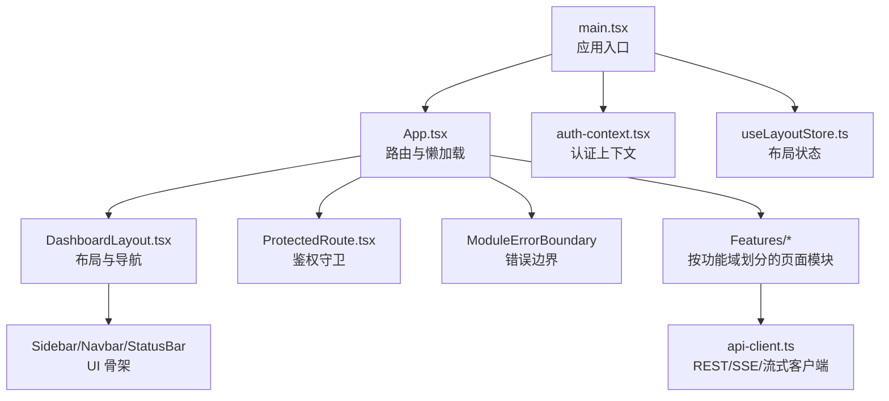
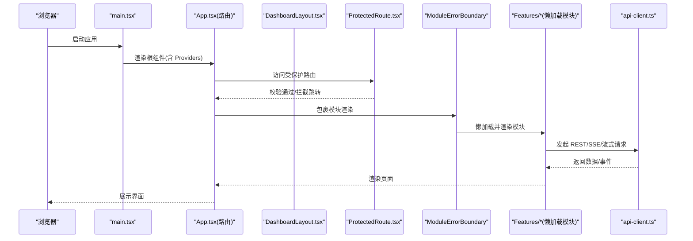
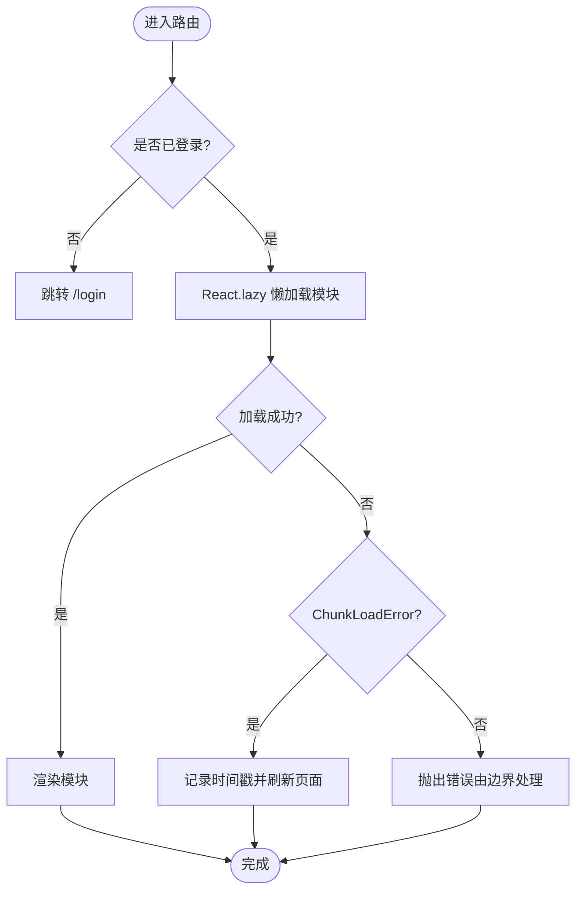
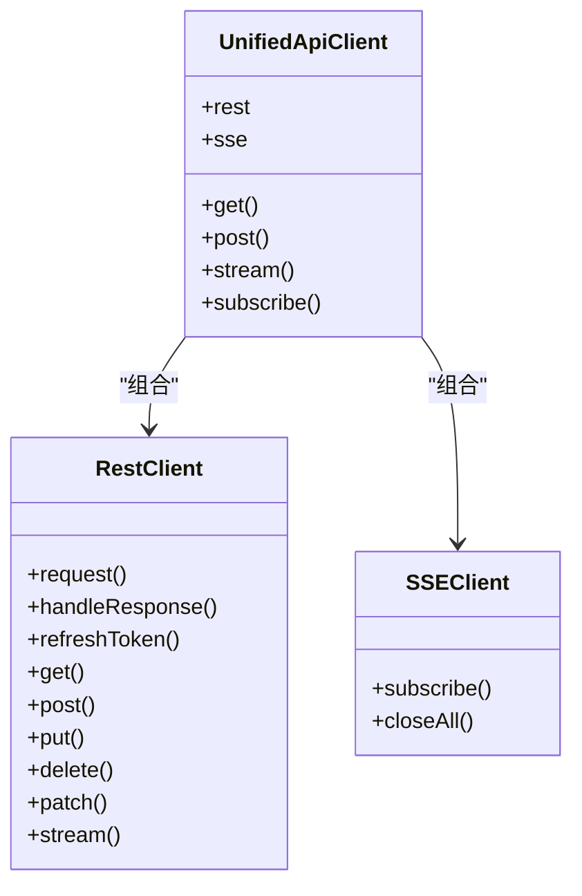
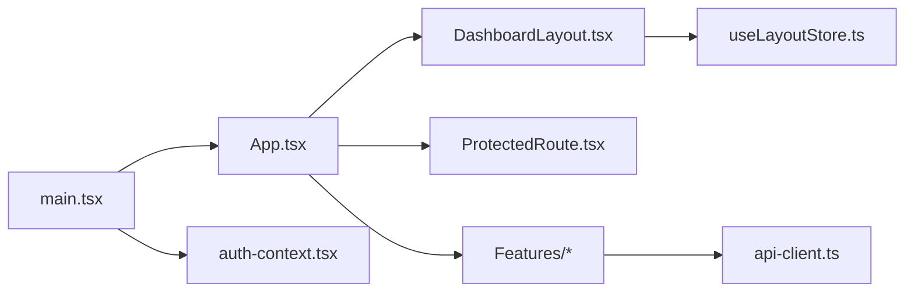

# 前端架构说明

<cite>
**本文引用的文件**
- [frontend/src/main.tsx](file://frontend/src/main.tsx)
- [frontend/src/App.tsx](file://frontend/src/App.tsx)
- [frontend/vite.config.ts](file://frontend/vite.config.ts)
- [frontend/package.json](file://frontend/package.json)
- [frontend/src/components/error-boundary.tsx](file://frontend/src/components/error-boundary.tsx)
- [frontend/src/components/layout/protected-route.tsx](file://frontend/src/components/layout/protected-route.tsx)
- [frontend/src/components/layout/dashboard-layout.tsx](file://frontend/src/components/layout/dashboard-layout.tsx)
- [frontend/src/lib/api-client.ts](file://frontend/src/lib/api-client.ts)
- [frontend/src/stores/useLayoutStore.ts](file://frontend/src/stores/useLayoutStore.ts)
- [frontend/src/contexts/auth-context.tsx](file://frontend/src/contexts/auth-context.tsx)
</cite>

## 目录
1. [简介](#简介)
2. [项目结构](#项目结构)
3. [核心组件](#核心组件)
4. [架构总览](#架构总览)
5. [详细组件分析](#详细组件分析)
6. [依赖关系分析](#依赖关系分析)
7. [性能与构建优化](#性能与构建优化)
8. [故障排查指南](#故障排查指南)
9. [结论](#结论)
10. [附录：扩展新模块指南](#附录扩展新模块指南)

## 简介
本文件面向 Quant Agent 前端（React 18 + TypeScript）的现代化工程化架构，覆盖应用入口、路由系统、懒加载与错误边界、模块化组织、服务抽象层、构建工具链与性能优化策略。文档提供可操作的扩展指导，帮助开发者快速理解并安全地扩展新功能模块。

## 项目结构
前端采用“功能域 + 共享能力”的分层组织方式：
- 应用入口与全局上下文：main.tsx 负责初始化 Web Vitals、主题、国际化、认证、路由等全局能力，并通过统一错误边界包裹根节点。
- 路由与页面：App.tsx 集中声明路由，使用 React.lazy + Suspense 实现页面级懒加载，并对每个模块挂载 ModuleErrorBoundary 进行错误隔离。
- 布局与导航：DashboardLayout 提供侧边栏、顶部栏、状态栏、移动端 Tab、全局抽屉（AI 副驾/设置）、场景模式切换等。
- 服务抽象：api-client.ts 封装 REST/SSE/流式请求、Token 自动续期、401 重试与登出、后端可达性状态更新。
- 状态管理：Zustand 存储（如 useLayoutStore）管理 UI 状态；Context 管理认证态。
- 构建配置：vite.config.ts 定义别名、开发代理、测试与构建输出；package.json 维护脚本与依赖。

图表来源
- [frontend/src/main.tsx:1-41](file://frontend/src/main.tsx#L1-L41)
- [frontend/src/App.tsx:1-133](file://frontend/src/App.tsx#L1-L133)
- [frontend/src/components/layout/dashboard-layout.tsx:1-277](file://frontend/src/components/layout/dashboard-layout.tsx#L1-L277)
- [frontend/src/components/layout/protected-route.tsx:1-62](file://frontend/src/components/layout/protected-route.tsx#L1-L62)
- [frontend/src/components/error-boundary.tsx:1-193](file://frontend/src/components/error-boundary.tsx#L1-L193)
- [frontend/src/lib/api-client.ts:1-668](file://frontend/src/lib/api-client.ts#L1-L668)
- [frontend/src/contexts/auth-context.tsx:1-105](file://frontend/src/contexts/auth-context.tsx#L1-L105)
- [frontend/src/stores/useLayoutStore.ts:1-47](file://frontend/src/stores/useLayoutStore.ts#L1-L47)

章节来源
- [frontend/src/main.tsx:1-41](file://frontend/src/main.tsx#L1-L41)
- [frontend/src/App.tsx:1-133](file://frontend/src/App.tsx#L1-L133)
- [frontend/vite.config.ts:1-47](file://frontend/vite.config.ts#L1-L47)
- [frontend/package.json:1-114](file://frontend/package.json#L1-L114)

## 核心组件
- 应用入口 main.tsx
  - 初始化 Web Vitals、减少动效基线、严格模式、全局 Provider（主题、国际化、认证），并以 ModuleErrorBoundary 包裹根节点，确保根级崩溃不影响整体可用性。
- 路由与懒加载 App.tsx
  - 使用 react-router-dom 的 Routes/Route 声明路由；对业务模块采用 lazyWithRetry 包装的 React.lazy，结合 Suspense 展示加载态；为每个模块挂载 ModuleErrorBoundary 实现模块级错误隔离。
  - 提供 /market/:ticker 重定向到 /quotes 并携带目标标的。
- 布局 DashboardLayout.tsx
  - 基于 SidebarProvider 的侧边栏导航，按领域分组（市场感知、投研发现、交易执行、风控副驾、系统管理），支持动态徽章、快捷键、场景模式（全屏 AI、盯盘模式）。
  - 集成全局 Copilot 抽屉、设置抽屉、告警网关、后端状态横幅、交易模式横幅、移动端 Tab 栏。
- 鉴权 ProtectedRoute.tsx
  - 在认证状态未就绪或未登录时显示全屏骨架屏，避免内容闪烁泄露；完成后跳转至登录页或放行。
- 错误边界 error-boundary.tsx
  - 三级错误边界（module/panel/chart），不同级别对应不同的降级 UI 与日志上报策略，并提供重置按钮恢复渲染。
- 服务抽象 api-client.ts
  - 统一 baseURL、超时、凭证；Access Token 内存存储，Refresh Token 通过 HttpOnly Cookie 自动携带；自动过期检测与静默续期；401 有限重试与登出；SSE 订阅与原始流式请求；后端可达性状态更新。
- 认证上下文 auth-context.tsx
  - 登录/登出流程、用户信息获取、启动/停止 Token 保活、注册“必须登录”回调以统一处理彻底失效。
- 布局状态 useLayoutStore.ts
  - 管理右侧抽屉互斥展开（AI 副驾/设置），提供打开/关闭/切换方法。

章节来源
- [frontend/src/main.tsx:1-41](file://frontend/src/main.tsx#L1-L41)
- [frontend/src/App.tsx:1-133](file://frontend/src/App.tsx#L1-L133)
- [frontend/src/components/layout/dashboard-layout.tsx:1-277](file://frontend/src/components/layout/dashboard-layout.tsx#L1-L277)
- [frontend/src/components/layout/protected-route.tsx:1-62](file://frontend/src/components/layout/protected-route.tsx#L1-L62)
- [frontend/src/components/error-boundary.tsx:1-193](file://frontend/src/components/error-boundary.tsx#L1-L193)
- [frontend/src/lib/api-client.ts:1-668](file://frontend/src/lib/api-client.ts#L1-L668)
- [frontend/src/contexts/auth-context.tsx:1-105](file://frontend/src/contexts/auth-context.tsx#L1-L105)
- [frontend/src/stores/useLayoutStore.ts:1-47](file://frontend/src/stores/useLayoutStore.ts#L1-L47)

## 架构总览
下图展示了从入口到路由、布局、模块、服务与状态的调用关系，以及懒加载与错误隔离的关键路径。

图表来源
- [frontend/src/main.tsx:1-41](file://frontend/src/main.tsx#L1-L41)
- [frontend/src/App.tsx:1-133](file://frontend/src/App.tsx#L1-L133)
- [frontend/src/components/layout/dashboard-layout.tsx:1-277](file://frontend/src/components/layout/dashboard-layout.tsx#L1-L277)
- [frontend/src/components/layout/protected-route.tsx:1-62](file://frontend/src/components/layout/protected-route.tsx#L1-L62)
- [frontend/src/components/error-boundary.tsx:1-193](file://frontend/src/components/error-boundary.tsx#L1-L193)
- [frontend/src/lib/api-client.ts:1-668](file://frontend/src/lib/api-client.ts#L1-L668)

## 详细组件分析

### 应用入口与全局上下文
- 职责
  - 初始化性能指标采集、无障碍动效基线、主题、国际化、认证上下文。
  - 以 ModuleErrorBoundary 包裹根节点，防止根级崩溃导致白屏。
- 关键点
  - 使用 BrowserRouter 作为路由容器。
  - 通过 StrictMode 强化开发期检查。
  - 根据 URL 参数或系统偏好注入 reduce-motion 类名，提升可访问性与基准测试稳定性。

章节来源
- [frontend/src/main.tsx:1-41](file://frontend/src/main.tsx#L1-L41)

### 路由系统与懒加载
- 职责
  - 集中声明所有路由，区分登录页与受保护的主布局。
  - 对每个业务模块使用 lazyWithRetry 包装的 React.lazy，配合 Suspense 提供加载态。
  - 为每个模块挂载 ModuleErrorBoundary，实现模块级错误隔离与降级 UI。
- 关键点
  - lazyWithRetry 捕获 ChunkLoadError 等动态导入失败，并在同一会话内最多触发一次硬刷新，避免白屏循环。
  - /market/:ticker 将 ticker 写入 sessionStorage 后重定向到 /quotes，便于行情页直接定位标的。
  - 所有模块路由均包裹 Suspense 与 ModuleErrorBoundary，保证加载与异常体验一致。

图表来源
- [frontend/src/App.tsx:1-133](file://frontend/src/App.tsx#L1-L133)

章节来源
- [frontend/src/App.tsx:1-133](file://frontend/src/App.tsx#L1-L133)

### 布局与导航
- 职责
  - 提供桌面端侧边栏与移动端 Tab 栏，按领域分组导航项，支持动态徽章、快捷键、场景模式（全屏 AI、盯盘模式隐藏侧栏）。
  - 集成全局 Copilot 抽屉、设置抽屉、告警网关、后端状态横幅、交易模式横幅。
- 关键点
  - 使用 Zustand 管理抽屉互斥展开（AI 副驾/设置）。
  - 根据场景模式动态控制侧栏可见性与 AI 行为（自动展开/全屏）。
  - 通过 KeepAliveOutlet 保持页面实例状态（结合 keep-alive 机制）。

章节来源
- [frontend/src/components/layout/dashboard-layout.tsx:1-277](file://frontend/src/components/layout/dashboard-layout.tsx#L1-L277)
- [frontend/src/stores/useLayoutStore.ts:1-47](file://frontend/src/stores/useLayoutStore.ts#L1-L47)

### 鉴权守卫
- 职责
  - 在认证状态未就绪或未登录时显示全屏骨架屏，防止内容闪烁泄露；完成后跳转到登录页或放行。
- 关键点
  - 使用 useLocation 保存 from 参数以便登录后回跳。
  - 在加载中显示占位骨架，提升感知性能。

章节来源
- [frontend/src/components/layout/protected-route.tsx:1-62](file://frontend/src/components/layout/protected-route.tsx#L1-L62)

### 错误边界体系
- 职责
  - 提供 module/panel/chart 三级错误边界，分别用于模块、面板、图表的错误隔离与降级 UI。
  - 记录错误日志并暴露重置按钮，允许局部恢复。
- 关键点
  - 不同级别的降级 UI 大小与信息密度不同，最小化对主界面的影响。
  - 模块级错误会记录完整堆栈，面板/图表级仅记录警告，避免过度噪音。

章节来源
- [frontend/src/components/error-boundary.tsx:1-193](file://frontend/src/components/error-boundary.tsx#L1-L193)

### 服务抽象层（API 客户端）
- 职责
  - 统一 REST/SSE/流式请求封装，自动处理 Access Token 过期检测与 Refresh Token 续期，401 有限重试与登出，后端可达性状态更新。
- 关键点
  - getValidAccessToken：唯一推荐入口，自动检测过期并静默续期。
  - fetchWithAuth：裸 fetch 的统一入口，具备 401 自愈与重试逻辑。
  - RestClient：标准 REST 请求，带超时、参数拼接、响应解包、错误分类。
  - SSEClient：EventSource 订阅与连接管理。
  - UnifiedApiClient：对外暴露统一接口，包含 rest/sse/stream。
  - Token 保活：startTokenKeepAlive/stopTokenKeepAlive，依据 exp 提前续期，页面可见时兜底续期。

图表来源
- [frontend/src/lib/api-client.ts:1-668](file://frontend/src/lib/api-client.ts#L1-L668)

章节来源
- [frontend/src/lib/api-client.ts:1-668](file://frontend/src/lib/api-client.ts#L1-L668)

### 认证上下文
- 职责
  - 管理登录/登出、用户信息获取、Token 保活生命周期、注册“必须登录”回调。
- 关键点
  - 登录成功后立即拉取用户信息并启动保活。
  - 登出时清理本地 Token、停止保活并硬跳转至登录页。
  - 通过 setAuthRequiredHandler 统一处理 Refresh Token 失效导致的强制登出。

章节来源
- [frontend/src/contexts/auth-context.tsx:1-105](file://frontend/src/contexts/auth-context.tsx#L1-L105)

## 依赖关系分析
- 入口依赖
  - main.tsx 依赖 App、Providers、错误边界、Web Vitals。
- 路由依赖
  - App.tsx 依赖 react-router-dom、懒加载模块、错误边界、布局与鉴权。
- 布局依赖
  - DashboardLayout 依赖侧边栏 UI、状态栏、全局抽屉、场景模式、Zustand 状态。
- 服务依赖
  - 各 Features 模块通过 api-client 与后端交互，统一处理认证、错误与状态。
- 状态依赖
  - useLayoutStore 管理 UI 状态；auth-context 管理认证态。

图表来源
- [frontend/src/main.tsx:1-41](file://frontend/src/main.tsx#L1-L41)
- [frontend/src/App.tsx:1-133](file://frontend/src/App.tsx#L1-L133)
- [frontend/src/components/layout/dashboard-layout.tsx:1-277](file://frontend/src/components/layout/dashboard-layout.tsx#L1-L277)
- [frontend/src/components/layout/protected-route.tsx:1-62](file://frontend/src/components/layout/protected-route.tsx#L1-L62)
- [frontend/src/lib/api-client.ts:1-668](file://frontend/src/lib/api-client.ts#L1-L668)
- [frontend/src/contexts/auth-context.tsx:1-105](file://frontend/src/contexts/auth-context.tsx#L1-L105)
- [frontend/src/stores/useLayoutStore.ts:1-47](file://frontend/src/stores/useLayoutStore.ts#L1-L47)

章节来源
- [frontend/src/main.tsx:1-41](file://frontend/src/main.tsx#L1-L41)
- [frontend/src/App.tsx:1-133](file://frontend/src/App.tsx#L1-L133)
- [frontend/src/components/layout/dashboard-layout.tsx:1-277](file://frontend/src/components/layout/dashboard-layout.tsx#L1-L277)
- [frontend/src/components/layout/protected-route.tsx:1-62](file://frontend/src/components/layout/protected-route.tsx#L1-L62)
- [frontend/src/lib/api-client.ts:1-668](file://frontend/src/lib/api-client.ts#L1-L668)
- [frontend/src/contexts/auth-context.tsx:1-105](file://frontend/src/contexts/auth-context.tsx#L1-L105)
- [frontend/src/stores/useLayoutStore.ts:1-47](file://frontend/src/stores/useLayoutStore.ts#L1-L47)

## 性能与构建优化
- 懒加载与代码分割
  - 使用 React.lazy + Suspense 对每个业务模块进行页面级懒加载，减少首屏体积。
  - 自定义 lazyWithRetry 捕获 ChunkLoadError 并自动刷新，避免部署后旧 chunk 失效导致的白屏。
- 构建工具链（Vite）
  - 配置 @ 别名指向 src，简化导入路径。
  - 开发服务器端口与代理：/api、/ws、/sse 代理到后端，支持 WebSocket。
  - 构建输出目录与 SourceMap 开启，便于调试。
- 性能监控
  - 入口启用 Web Vitals 采集，便于评估 LCP/CLS/INP 等指标。
- 建议
  - 新增大体积模块时优先懒加载，并在路由处包裹 Suspense 与 ModuleErrorBoundary。
  - 合理使用 Zustand 拆分状态，避免全局状态过大导致重渲染。
  - 利用 Vite 的按需引入与 Tree Shaking，减少打包体积。

章节来源
- [frontend/src/App.tsx:1-133](file://frontend/src/App.tsx#L1-L133)
- [frontend/vite.config.ts:1-47](file://frontend/vite.config.ts#L1-L47)
- [frontend/package.json:1-114](file://frontend/package.json#L1-L114)
- [frontend/src/main.tsx:1-41](file://frontend/src/main.tsx#L1-L41)

## 故障排查指南
- 模块加载失败（ChunkLoadError）
  - 现象：动态导入失败，页面可能短暂白屏。
  - 处理：lazyWithRetry 检测到 ChunkLoadError 后在同一会话内最多触发一次硬刷新，避免无限循环。
  - 建议：检查部署产物哈希是否正确、CDN 缓存策略是否合理。
- 认证失效（401）
  - 现象：请求返回 401，可能因 Access Token 过期或 Refresh Token 失效。
  - 处理：api-client 自动尝试刷新 Token 并重试；若 Refresh Token 被服务端明确拒绝，则清 Token 并跳转登录。
  - 建议：关注后端日志与跨域/代理配置，避免 CF 等非 JSON 响应干扰刷新流程。
- 模块内部错误
  - 现象：某个模块/面板/图表渲染异常。
  - 处理：对应级别的 ErrorBoundary 捕获错误并展示降级 UI，提供重置按钮恢复。
  - 建议：在模块内尽量细化错误边界，避免整页崩溃。
- 后端不可达
  - 现象：网络异常或后端无响应。
  - 处理：api-client 记录失败并更新后端状态，必要时提示离线横幅。
  - 建议：检查代理配置、网络连通性与后端健康检查。

章节来源
- [frontend/src/App.tsx:1-133](file://frontend/src/App.tsx#L1-L133)
- [frontend/src/lib/api-client.ts:1-668](file://frontend/src/lib/api-client.ts#L1-L668)
- [frontend/src/components/error-boundary.tsx:1-193](file://frontend/src/components/error-boundary.tsx#L1-L193)

## 结论
Quant Agent 前端采用清晰的模块化与分层架构：入口统一初始化、路由集中管理、懒加载降低首屏压力、错误边界保障稳定性、服务抽象统一通信与认证、状态管理解耦 UI 与业务。配合 Vite 构建与 Web Vitals 监控，形成高性能、可维护、可扩展的前端工程体系。遵循本文档的扩展指南，可安全高效地添加新功能模块。

## 附录：扩展新模块指南
- 创建功能模块
  - 在 features 目录下新建模块文件夹，导出默认模块组件（如 XxxModule）。
  - 在 App.tsx 中通过 lazyWithRetry 懒加载该模块，并在路由中注册路径。
  - 为该路由包裹 Suspense 与 ModuleErrorBoundary，提供加载态与错误降级。
- 接入服务
  - 使用 api-client 提供的 REST/SSE/流式接口，遵循统一的认证与错误处理。
  - 如需 Token 保活，确保在认证上下文中正确启动/停止。
- 状态管理
  - 使用 Zustand 创建模块相关 store，或通过 Context 管理复杂状态。
  - 避免全局状态膨胀，尽量将状态下沉到模块或页面级。
- 性能优化
  - 大体积资源（图表、编辑器）按需懒加载。
  - 合理使用虚拟列表与分页，避免长列表卡顿。
  - 利用 Web Vitals 持续监控关键指标。

章节来源
- [frontend/src/App.tsx:1-133](file://frontend/src/App.tsx#L1-L133)
- [frontend/src/lib/api-client.ts:1-668](file://frontend/src/lib/api-client.ts#L1-L668)
- [frontend/src/contexts/auth-context.tsx:1-105](file://frontend/src/contexts/auth-context.tsx#L1-L105)
