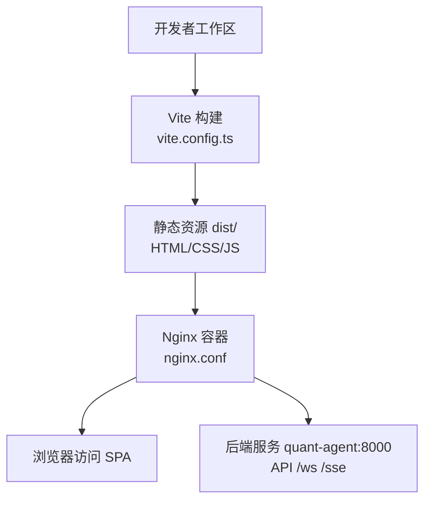
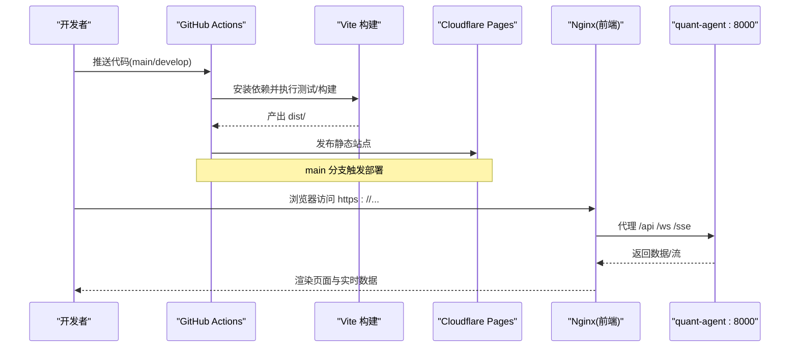
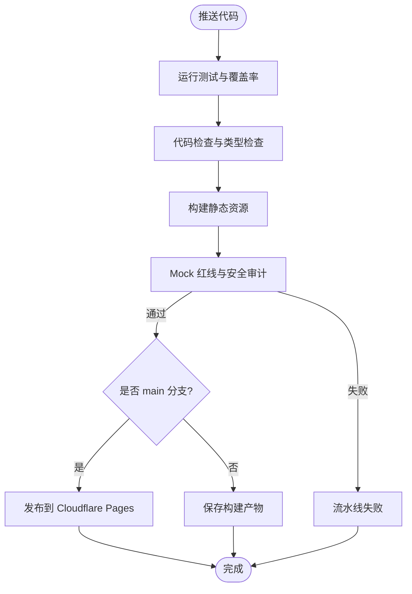
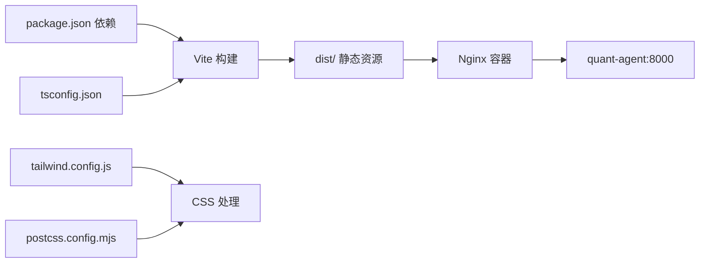

# 构建与部署

<cite>
**本文引用的文件**
- [frontend/vite.config.ts](file://frontend/vite.config.ts)
- [frontend/package.json](file://frontend/package.json)
- [frontend/Dockerfile](file://frontend/Dockerfile)
- [frontend/nginx.conf](file://frontend/nginx.conf)
- [frontend/tsconfig.json](file://frontend/tsconfig.json)
- [frontend/tailwind.config.js](file://frontend/tailwind.config.js)
- [frontend/postcss.config.mjs](file://frontend/postcss.config.mjs)
- [.github/workflows/frontend.yml](file://.github/workflows/frontend.yml)
- [docker-publish.yml](file://docker-publish.yml)
- [docker-compose.master.yml](file://docker-compose.master.yml)
</cite>

## 目录
1. [简介](#简介)
2. [项目结构](#项目结构)
3. [核心组件](#核心组件)
4. [架构总览](#架构总览)
5. [详细组件分析](#详细组件分析)
6. [依赖关系分析](#依赖关系分析)
7. [性能考虑](#性能考虑)
8. [故障排查指南](#故障排查指南)
9. [结论](#结论)
10. [附录](#附录)

## 简介
本文件面向 Quant Agent 前端（React + Vite）的构建与部署，覆盖以下主题：
- 基于 Vite 的构建配置：代码优化、资源压缩、缓存策略、环境变量管理
- Docker 容器化部署：多阶段构建、镜像优化、Nginx 反向代理与 SPA 路由
- CI/CD 流水线集成：自动化测试、代码质量检查、版本发布流程
- 生产环境部署示例：环境变量注入、构建性能优化、应用状态监控
- 运维最佳实践：故障排查、性能调优建议

## 项目结构
前端工程位于 frontend 目录，采用 Vite 作为构建工具，使用 pnpm 管理依赖，TypeScript 进行类型检查，TailwindCSS 做样式体系，Vitest 进行单元测试。Docker 多阶段构建将静态产物交由 Nginx 提供 HTTP/HTTPS 服务，并通过反向代理将 API 与 WebSocket 请求转发至后端。

图表来源
- [frontend/vite.config.ts:5-46](file://frontend/vite.config.ts#L5-L46)
- [frontend/nginx.conf:1-46](file://frontend/nginx.conf#L1-L46)

章节来源
- [frontend/vite.config.ts:5-46](file://frontend/vite.config.ts#L5-L46)
- [frontend/package.json:6-15](file://frontend/package.json#L6-L15)
- [frontend/Dockerfile:1-22](file://frontend/Dockerfile#L1-L22)
- [frontend/nginx.conf:1-46](file://frontend/nginx.conf#L1-L46)

## 核心组件
- 构建系统：Vite + React 插件，开发服务器端口 3000，本地代理 /api、/ws、/sse 到后端
- 类型与样式：TypeScript 严格模式，TailwindCSS + PostCSS 自动前缀
- 测试与质量：Vitest 单元测试与覆盖率，ESLint 与 tsc 类型检查
- 容器化：Node 构建阶段 + Nginx 运行阶段，开启 HTTPS 并支持 SPA 路由
- 流水线：GitHub Actions 在 develop/main 分支触发测试、构建、安全审计与发布

章节来源
- [frontend/vite.config.ts:24-46](file://frontend/vite.config.ts#L24-L46)
- [frontend/tsconfig.json:1-42](file://frontend/tsconfig.json#L1-L42)
- [frontend/tailwind.config.js:1-78](file://frontend/tailwind.config.js#L1-L78)
- [frontend/postcss.config.mjs:1-10](file://frontend/postcss.config.mjs#L1-L10)
- [frontend/package.json:6-15](file://frontend/package.json#L6-L15)
- [frontend/Dockerfile:1-22](file://frontend/Dockerfile#L1-L22)
- [frontend/nginx.conf:1-46](file://frontend/nginx.conf#L1-L46)
- [.github/workflows/frontend.yml:14-111](file://.github/workflows/frontend.yml#L14-L111)

## 架构总览
下图展示从源码到线上运行的完整链路：CI 触发测试与构建，产出静态资源；生产环境通过 Nginx 对外暴露 HTTPS，并将 API/WS/SSE 请求代理到后端服务。

图表来源
- [.github/workflows/frontend.yml:14-187](file://.github/workflows/frontend.yml#L14-L187)
- [frontend/Dockerfile:1-22](file://frontend/Dockerfile#L1-L22)
- [frontend/nginx.conf:1-46](file://frontend/nginx.conf#L1-L46)

## 详细组件分析

### Vite 构建配置与优化
- 插件与别名：启用 React 插件，配置 @ 路径别名指向 src
- 开发服务器：端口 3000，代理 /api、/ws、/sse 到本地后端
- 构建输出：输出目录 dist，生成 SourceMap 便于调试
- 测试集成：Vitest 全局开关、jsdom 环境、覆盖率收集

优化要点
- 生产构建时可通过环境变量注入后端地址，避免硬编码
- 按需引入与 Tree-shaking 由 Vite/Rollup 自动处理
- 可结合分包策略（如按路由或大库拆分）进一步减小首包体积

章节来源
- [frontend/vite.config.ts:5-46](file://frontend/vite.config.ts#L5-L46)
- [frontend/package.json:6-15](file://frontend/package.json#L6-L15)

### TypeScript 与样式管线
- TypeScript：严格模式、目标 ES2020、模块解析为 bundler，启用增量编译
- TailwindCSS：自定义断点与颜色变量，darkMode 基于 class
- PostCSS：自动添加浏览器前缀，配合 Tailwind 使用

章节来源
- [frontend/tsconfig.json:1-42](file://frontend/tsconfig.json#L1-L42)
- [frontend/tailwind.config.js:1-78](file://frontend/tailwind.config.js#L1-L78)
- [frontend/postcss.config.mjs:1-10](file://frontend/postcss.config.mjs#L1-L10)

### Docker 多阶段构建与镜像优化
- 构建阶段：基于 node:20-alpine，启用 corepack/pnpm，冻结依赖安装，设置 Node 堆内存上限防止 OOM
- 运行阶段：基于 nginx:alpine，仅拷贝 dist 与 nginx 配置，暴露 80 端口
- 镜像瘦身：Alpine 基础镜像、最小化运行时依赖、单职责容器

章节来源
- [frontend/Dockerfile:1-22](file://frontend/Dockerfile#L1-L22)

### Nginx 反向代理与 SPA 路由
- HTTPS 强制跳转：HTTP 301 重定向到 HTTPS
- SSL 增强：TLSv1.2/TLSv1.3，高强度密码套件
- SPA 路由：try_files 回退到 index.html
- 代理规则：/api 与 /ws 分别转发到后端，保留 Upgrade 头以支持 WebSocket
- 证书挂载：通过 volume 挂载 fullchain.pem 与 privkey.pem

章节来源
- [frontend/nginx.conf:1-46](file://frontend/nginx.conf#L1-L46)

### CI/CD 流水线集成
- 测试与覆盖率：在 develop 分支 push 时运行 Vitest 并上传 Codecov
- 构建与质量：安装依赖、lint、type-check、构建，扫描未门控的 mock 数据，安全审计
- 发布：main/master 分支构建后推送到 Cloudflare Pages，需配置 Secrets
- 通用镜像构建：根级 docker-publish.yml 用于整体镜像构建与推送（含缓存）

图表来源
- [.github/workflows/frontend.yml:14-187](file://.github/workflows/frontend.yml#L14-L187)
- [docker-publish.yml:1-53](file://docker-publish.yml#L1-L53)

章节来源
- [.github/workflows/frontend.yml:14-187](file://.github/workflows/frontend.yml#L14-L187)
- [docker-publish.yml:1-53](file://docker-publish.yml#L1-L53)

### 环境变量管理与生产配置
- 开发环境：Vite 开发服务器代理到本地后端，无需额外环境变量
- 构建期注入：CI 中通过环境变量注入后端地址（例如 VITE_API_BASE_URL），供构建期替换
- 运行期配置：Nginx 反向代理到后端服务名（quant-agent:8000），可在编排层调整域名与证书

注意
- 若前端需要读取运行时环境变量，请确保构建脚本正确注入并在运行时可访问（例如通过 HTML 注入或构建时替换）

章节来源
- [.github/workflows/frontend.yml:155-160](file://.github/workflows/frontend.yml#L155-L160)
- [frontend/nginx.conf:29-44](file://frontend/nginx.conf#L29-L44)

### 生产部署示例（Docker Compose）
- 前端服务：使用已构建的 Nginx 镜像，挂载 SSL 证书卷
- 后端服务：quant-agent 暴露 8000 端口，内部网络通信
- 网络隔离：前后端通过 Docker 内部网络通信，不直接暴露后端端口给公网

参考编排片段（节选）
- 后端服务定义与网络、健康检查、资源限制等见 master 编排文件

章节来源
- [docker-compose.master.yml:76-130](file://docker-compose.master.yml#L76-L130)
- [docker-compose.master.yml:197-251](file://docker-compose.master.yml#L197-L251)

## 依赖关系分析
- 构建依赖：Vite、React 插件、TypeScript、TailwindCSS、PostCSS、Vitest
- 运行依赖：Nginx（静态资源与反向代理）
- 外部服务：后端 API/WebSocket/SSE 服务（quant-agent:8000）
- CI 依赖：pnpm、Node.js、Codecov、Cloudflare Pages

图表来源
- [frontend/package.json:17-112](file://frontend/package.json#L17-L112)
- [frontend/vite.config.ts:5-46](file://frontend/vite.config.ts#L5-L46)
- [frontend/tsconfig.json:1-42](file://frontend/tsconfig.json#L1-L42)
- [frontend/tailwind.config.js:1-78](file://frontend/tailwind.config.js#L1-L78)
- [frontend/postcss.config.mjs:1-10](file://frontend/postcss.config.mjs#L1-L10)
- [frontend/Dockerfile:1-22](file://frontend/Dockerfile#L1-L22)
- [frontend/nginx.conf:1-46](file://frontend/nginx.conf#L1-L46)

章节来源
- [frontend/package.json:17-112](file://frontend/package.json#L17-L112)
- [frontend/vite.config.ts:5-46](file://frontend/vite.config.ts#L5-L46)
- [frontend/Dockerfile:1-22](file://frontend/Dockerfile#L1-L22)
- [frontend/nginx.conf:1-46](file://frontend/nginx.conf#L1-L46)

## 性能考虑
- 构建性能
  - 使用 pnpm 与冻结锁文件加速依赖安装
  - 增大 Node 堆内存避免构建 OOM
  - 利用 CI 缓存 pnpm 依赖与构建缓存
- 运行时性能
  - Nginx 提供静态资源与 gzip/br 压缩（可在镜像内启用）
  - 合理设置代理超时与连接复用，提升 WebSocket 稳定性
  - 对大体积第三方库进行懒加载与分包
- 可观测性
  - 前端可接入 Web Vitals 指标采集
  - 通过 Nginx 日志与后端健康检查接口监控可用性

[本节为通用指导，不直接分析具体文件]

## 故障排查指南
常见问题与定位方法
- 构建失败
  - 检查 Node 版本与 pnpm 版本是否匹配
  - 查看 lint/type-check 错误并修复
  - 确认依赖安装是否成功（冻结锁文件）
- 代理失败
  - 确认 Nginx 中 /api、/ws、/sse 的代理目标可达
  - 检查后端服务健康检查与端口映射
  - 验证 SSL 证书路径与权限
- 运行时错误
  - 打开浏览器控制台查看网络请求与错误
  - 检查环境变量是否正确注入（构建期与运行期）
  - 查看 Nginx 与后端日志定位问题

章节来源
- [frontend/nginx.conf:22-44](file://frontend/nginx.conf#L22-L44)
- [docker-compose.master.yml:76-130](file://docker-compose.master.yml#L76-L130)

## 结论
本项目采用 Vite + TypeScript + TailwindCSS 的现代前端技术栈，通过 Docker 多阶段构建与 Nginx 反向代理实现高效、安全的静态站点部署。CI/CD 流水线覆盖测试、质量检查与安全审计，并在 main 分支自动发布到 Cloudflare Pages。生产环境通过环境变量与编排配置灵活适配不同部署场景，具备可扩展性与可观测性。

[本节为总结性内容，不直接分析具体文件]

## 附录
- 快速启动
  - 开发：pnpm dev（本地代理后端）
  - 构建：pnpm build（输出 dist/）
  - 预览：pnpm preview
- 关键命令与脚本
  - 测试：pnpm test / pnpm test:coverage
  - 类型检查：pnpm type-check
  - 代码检查：pnpm lint
- 环境变量
  - 构建期注入后端地址（例如 VITE_API_BASE_URL）
  - Nginx 代理目标与证书路径通过编排与卷挂载管理

章节来源
- [frontend/package.json:6-15](file://frontend/package.json#L6-L15)
- [.github/workflows/frontend.yml:155-160](file://.github/workflows/frontend.yml#L155-L160)
- [frontend/nginx.conf:13-20](file://frontend/nginx.conf#L13-L20)