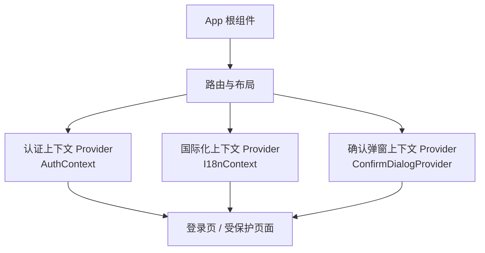
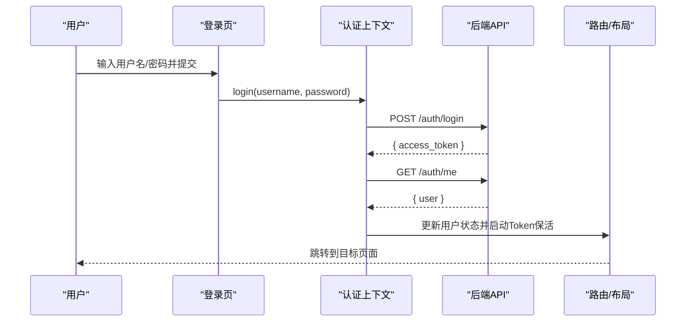
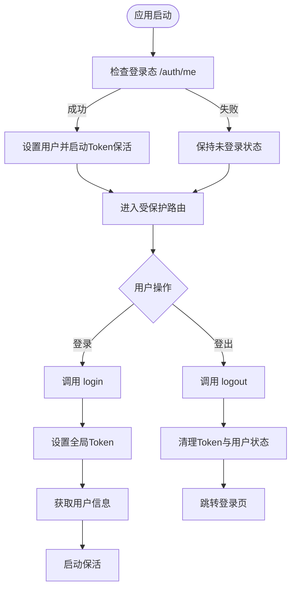
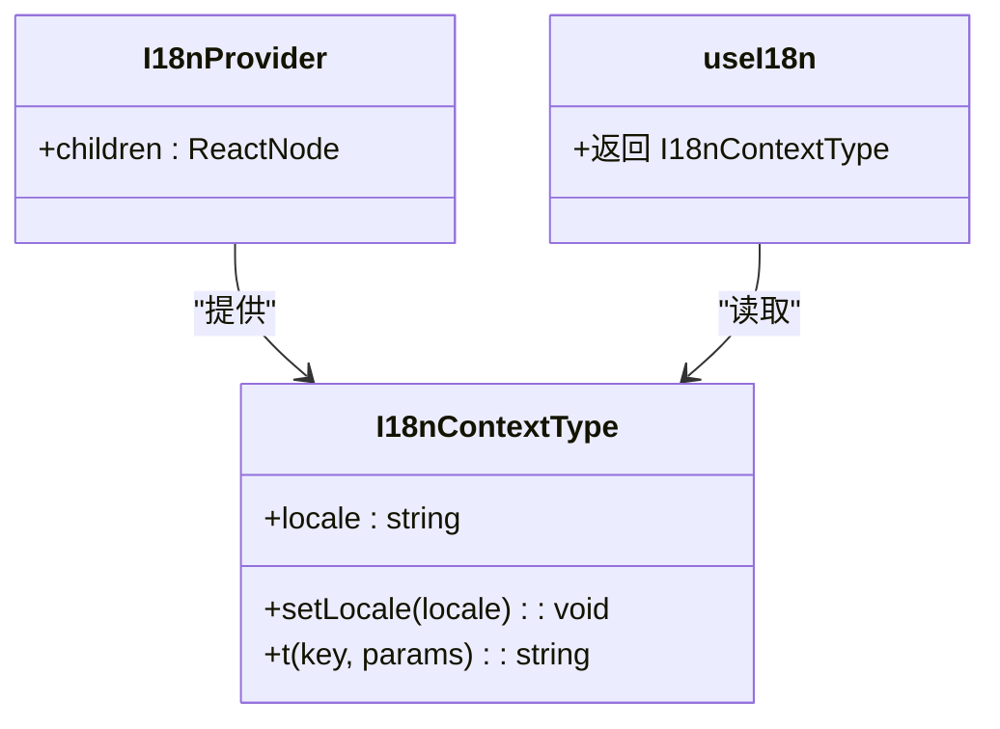
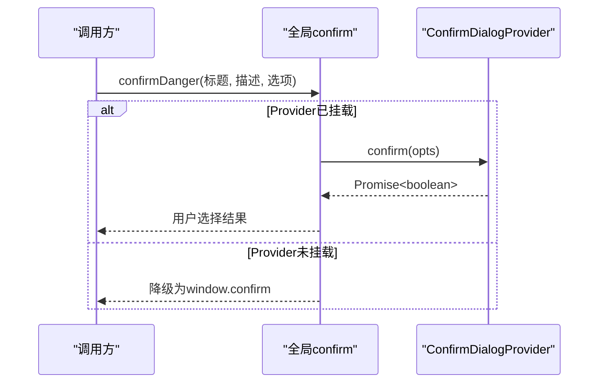
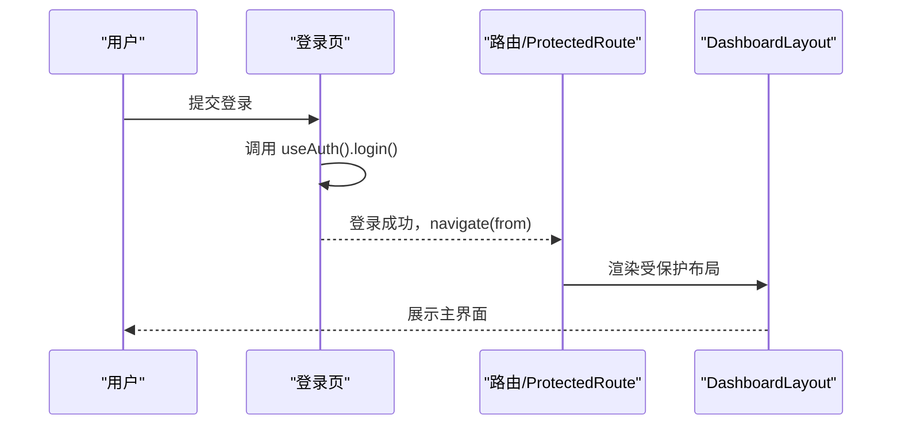
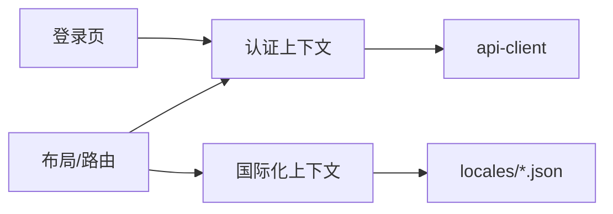

# Context上下文使用

<cite>
**本文引用的文件**
- [auth-context.tsx](file://frontend/src/contexts/auth-context.tsx)
- [i18n.tsx](file://frontend/src/contexts/i18n.tsx)
- [login.tsx](file://frontend/src/features/auth/login.tsx)
- [dashboard-layout.tsx](file://frontend/src/components/layout/dashboard-layout.tsx)
- [App.tsx](file://frontend/src/App.tsx)
- [confirm-dialog-context.ts](file://frontend/src/components/confirm-dialog-context.ts)
</cite>

## 目录
1. [简介](#简介)
2. [项目结构](#项目结构)
3. [核心组件](#核心组件)
4. [架构总览](#架构总览)
5. [详细组件分析](#详细组件分析)
6. [依赖关系分析](#依赖关系分析)
7. [性能考虑](#性能考虑)
8. [故障排查指南](#故障排查指南)
9. [结论](#结论)
10. [附录](#附录)

## 简介
本指南面向Quant Agent前端React应用，聚焦Context在应用中的使用场景与最佳实践。重点覆盖：
- 认证上下文（auth-context）：登录态管理、Token保活、跨组件共享用户信息、权限控制。
- 国际化上下文（i18n）：多语言切换、本地化文案获取、持久化语言偏好。
- Provider创建、useContext Hook访问、状态更新模式。
- 结合路由与布局的集成方式，以及性能优化策略（状态分割、懒加载、避免不必要重渲染）。

## 项目结构
前端采用“功能模块 + 全局上下文”的组织方式：
- 全局上下文位于 contexts 目录，提供认证与国际化能力。
- 页面与布局通过 React Router 组织，并在根组件或布局中挂载必要的 Provider。
- 业务组件通过自定义 Hook 消费上下文，实现无侵入的状态读取与更新。

图表来源
- [App.tsx:89-130](file://frontend/src/App.tsx#L89-L130)
- [auth-context.tsx:21-96](file://frontend/src/contexts/auth-context.tsx#L21-L96)
- [i18n.tsx:48-88](file://frontend/src/contexts/i18n.tsx#L48-L88)
- [confirm-dialog-context.ts:23-32](file://frontend/src/components/confirm-dialog-context.ts#L23-L32)

章节来源
- [App.tsx:89-130](file://frontend/src/App.tsx#L89-L130)

## 核心组件
- 认证上下文（AuthContext）
  - 职责：维护用户信息、登录/登出流程、Token保活、会话失效处理。
  - 暴露：user、isLoading、login、logout。
  - 关键行为：应用启动时检查登录态；登录成功后拉取用户信息并启动保活；登出时清理状态并跳转登录页。
- 国际化上下文（I18nContext）
  - 职责：维护当前语言、提供翻译函数 t、支持参数替换、持久化语言偏好。
  - 暴露：locale、setLocale、t。
  - 关键行为：初始化时从 localStorage 恢复语言或检测浏览器语言；切换语言后写入存储。
- 确认弹窗上下文（ConfirmDialogProvider）
  - 职责：提供全局确认弹窗能力，支持函数式调用与降级到原生 confirm。
  - 暴露：useConfirmDialog Hook、registerGlobalConfirm、confirmDanger。

章节来源
- [auth-context.tsx:1-105](file://frontend/src/contexts/auth-context.tsx#L1-L105)
- [i18n.tsx:1-95](file://frontend/src/contexts/i18n.tsx#L1-L95)
- [confirm-dialog-context.ts:1-68](file://frontend/src/components/confirm-dialog-context.ts#L1-L68)

## 架构总览
认证与国际化作为全局能力，通过 Context 在应用树中共享。登录流程由登录页触发，调用认证上下文的 login，完成 Token 注入与用户信息获取；后续受保护路由与页面可基于 useAuth 进行权限判断。国际化通过 I18nProvider 提供 t 函数，供任意组件获取本地化文案。

图表来源
- [auth-context.tsx:58-78](file://frontend/src/contexts/auth-context.tsx#L58-L78)
- [login.tsx:22-45](file://frontend/src/features/auth/login.tsx#L22-L45)

章节来源
- [auth-context.tsx:21-96](file://frontend/src/contexts/auth-context.tsx#L21-L96)
- [login.tsx:1-107](file://frontend/src/features/auth/login.tsx#L1-L107)

## 详细组件分析

### 认证上下文（AuthContext）
- 设计要点
  - 统一注册“登录态彻底失效”回调，当 Refresh Token 被拒绝时清空本地态并跳转登录页。
  - 应用初始化时调用 /auth/me 校验登录态，成功则启动 Token 保活。
  - 登录成功后设置全局 Token，拉取用户信息并启动保活。
  - 登出时调用后端注销接口（可选）、清理 Token、重置用户状态、停止保活并硬跳转登录页。
- 使用方式
  - 在需要鉴权的组件中通过 useAuth() 获取 user、isLoading、login、logout。
  - 在路由层结合 ProtectedRoute 进行访问控制（由布局与路由组合实现）。
- 典型流程
  - 登录：提交表单 -> 调用 login -> 设置 Token -> 获取用户 -> 启动保活 -> 跳转。
  - 登出：调用 logout -> 清理状态 -> 跳转登录页。
  - 会话失效：api-client 触发认证失效回调 -> 清空状态 -> 跳转登录页。

图表来源
- [auth-context.tsx:21-96](file://frontend/src/contexts/auth-context.tsx#L21-L96)

章节来源
- [auth-context.tsx:1-105](file://frontend/src/contexts/auth-context.tsx#L1-L105)

### 国际化上下文（I18nContext）
- 设计要点
  - 语言包映射：zh-CN、en-US，支持嵌套键取值。
  - 初始化：优先从 localStorage 恢复语言，否则根据浏览器语言推断。
  - 切换语言：setLocale 更新状态并持久化到 localStorage。
  - 翻译函数：t(key, params) 支持占位符替换。
- 使用方式
  - 在任意组件内通过 useI18n() 获取 locale、setLocale、t。
  - 在 UI 中使用 t('key', { param }) 渲染本地化文案。
- 示例路径
  - 语言切换按钮：调用 setLocale('en-US') 或 setLocale('zh-CN')。
  - 文案显示：使用 t('common.title') 等。

图表来源
- [i18n.tsx:40-95](file://frontend/src/contexts/i18n.tsx#L40-L95)

章节来源
- [i18n.tsx:1-95](file://frontend/src/contexts/i18n.tsx#L1-L95)

### 确认弹窗上下文（ConfirmDialogProvider）
- 设计要点
  - 将确认弹窗逻辑与组件分离，避免 HMR 警告。
  - 提供 registerGlobalConfirm 注册全局 confirm 函数。
  - 在非组件环境中可通过 confirmDanger 调用，若 Provider 未挂载则降级为 window.confirm。
- 使用方式
  - 在 App 根组件中放置 ConfirmDialogProvider。
  - 在任意位置调用 confirmDanger('标题', '描述', opts) 获取用户确认结果。

图表来源
- [confirm-dialog-context.ts:23-68](file://frontend/src/components/confirm-dialog-context.ts#L23-L68)

章节来源
- [confirm-dialog-context.ts:1-68](file://frontend/src/components/confirm-dialog-context.ts#L1-L68)

### 登录页与受保护路由集成
- 登录页
  - 通过 useAuth().login 提交表单，成功后延迟跳转至 from 参数指定的目标路径。
  - 错误处理兼容 ApiError 与 fetch 风格错误。
- 布局与路由
  - App 根组件使用 Routes 与 Route 组织页面，并通过 ProtectedRoute 包裹受保护区域。
  - DashboardLayout 提供侧栏、导航、全局抽屉等布局能力。

图表来源
- [login.tsx:22-45](file://frontend/src/features/auth/login.tsx#L22-L45)
- [App.tsx:89-130](file://frontend/src/App.tsx#L89-L130)
- [dashboard-layout.tsx:131-277](file://frontend/src/components/layout/dashboard-layout.tsx#L131-L277)

章节来源
- [login.tsx:1-107](file://frontend/src/features/auth/login.tsx#L1-L107)
- [App.tsx:89-130](file://frontend/src/App.tsx#L89-L130)
- [dashboard-layout.tsx:1-277](file://frontend/src/components/layout/dashboard-layout.tsx#L1-L277)

## 依赖关系分析
- 认证上下文依赖 api-client 提供的 Token 管理与请求拦截能力。
- 国际化上下文依赖 locales 下的 JSON 资源文件。
- 登录页依赖认证上下文与路由能力。
- 布局与路由负责挂载 Provider 与受保护路由。

图表来源
- [auth-context.tsx:1-105](file://frontend/src/contexts/auth-context.tsx#L1-L105)
- [i18n.tsx:1-95](file://frontend/src/contexts/i18n.tsx#L1-L95)
- [login.tsx:1-107](file://frontend/src/features/auth/login.tsx#L1-L107)
- [App.tsx:89-130](file://frontend/src/App.tsx#L89-L130)

章节来源
- [auth-context.tsx:1-105](file://frontend/src/contexts/auth-context.tsx#L1-L105)
- [i18n.tsx:1-95](file://frontend/src/contexts/i18n.tsx#L1-L95)
- [login.tsx:1-107](file://frontend/src/features/auth/login.tsx#L1-L107)
- [App.tsx:89-130](file://frontend/src/App.tsx#L89-L130)

## 性能考虑
- 状态分割
  - 将认证与国际化拆分为独立 Context，避免单一大状态导致的全局重渲染。
  - 确认弹窗上下文与业务解耦，仅在需要时触发 UI 更新。
- 懒加载
  - 使用 lazyWithRetry 对功能模块进行按需加载，减少首屏体积与初始渲染压力。
  - 路由级 Suspense 配合 LoadingFallback，提升用户体验。
- 避免不必要的重渲染
  - 在 Provider 中尽量拆分状态（如 user、isLoading），并使用稳定引用（如 useCallback 封装方法）以减少子组件重渲染。
  - 国际化 t 函数可按需 memo 化，避免每次渲染重建。
- 网络与保活
  - 登录成功后启动 Token 保活，减少频繁刷新导致的额外请求。
  - 会话失效时统一处理，避免多次无效请求。

章节来源
- [App.tsx:19-66](file://frontend/src/App.tsx#L19-L66)
- [auth-context.tsx:21-96](file://frontend/src/contexts/auth-context.tsx#L21-L96)
- [i18n.tsx:48-88](file://frontend/src/contexts/i18n.tsx#L48-L88)

## 故障排查指南
- 登录失败
  - 检查网络连通性与后端接口可用性。
  - 查看错误消息是否来自 ApiError 或 fetch 异常。
  - 确认表单字段非空后再提交。
- 会话失效
  - 当 Refresh Token 被拒绝时，认证上下文会清空本地态并跳转登录页。
  - 检查 api-client 的认证失效回调是否正确注册。
- 国际化文案缺失
  - 确保 locales 文件中存在对应 key。
  - 使用 t('key') 时注意嵌套路径正确性。
- 确认弹窗未生效
  - 确认 App 根组件已挂载 ConfirmDialogProvider。
  - 若 Provider 未挂载，confirmDanger 会降级为 window.confirm。

章节来源
- [login.tsx:22-45](file://frontend/src/features/auth/login.tsx#L22-L45)
- [auth-context.tsx:25-37](file://frontend/src/contexts/auth-context.tsx#L25-L37)
- [i18n.tsx:73-85](file://frontend/src/contexts/i18n.tsx#L73-L85)
- [confirm-dialog-context.ts:50-68](file://frontend/src/components/confirm-dialog-context.ts#L50-L68)

## 结论
通过 Context 将认证与国际化能力抽象为全局服务，实现了跨组件状态共享与一致的用户体验。结合路由与布局的集成，提供了清晰的权限控制与多语言支持。借助懒加载与状态分割等优化手段，保证了应用的性能与可维护性。建议在实际开发中遵循本指南的最佳实践，持续优化上下文的使用方式与性能表现。

## 附录
- 常用 Hook
  - useAuth：获取用户信息、登录/登出能力。
  - useI18n：获取当前语言、切换语言、翻译文案。
  - useConfirmDialog：调用全局确认弹窗。
- 参考路径
  - 认证上下文：[auth-context.tsx](file://frontend/src/contexts/auth-context.tsx)
  - 国际化上下文：[i18n.tsx](file://frontend/src/contexts/i18n.tsx)
  - 登录页：[login.tsx](file://frontend/src/features/auth/login.tsx)
  - 布局与路由：[dashboard-layout.tsx](file://frontend/src/components/layout/dashboard-layout.tsx)、[App.tsx](file://frontend/src/App.tsx)
  - 确认弹窗上下文：[confirm-dialog-context.ts](file://frontend/src/components/confirm-dialog-context.ts)