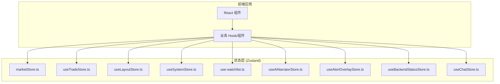
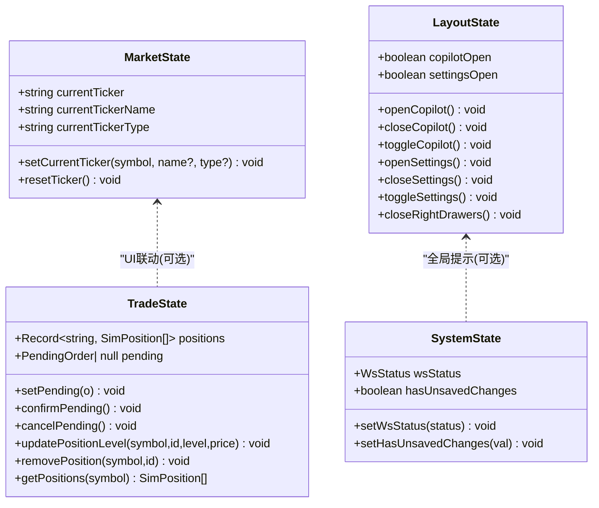
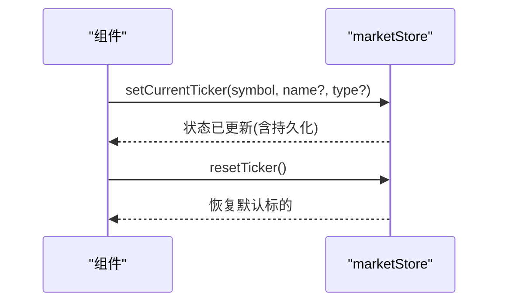
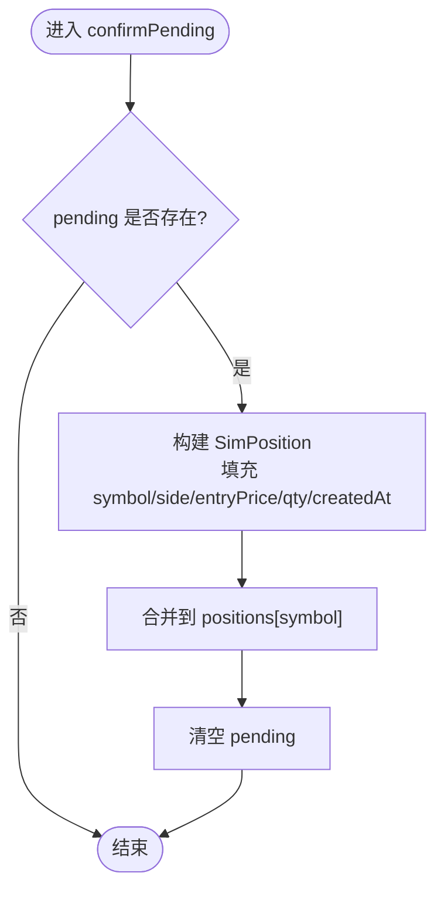
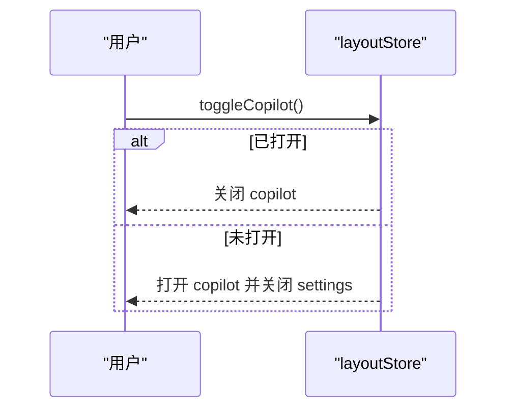
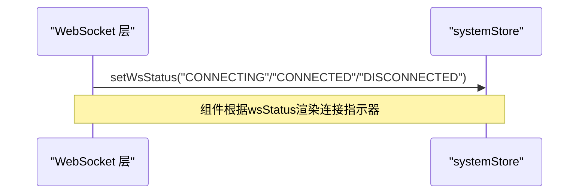
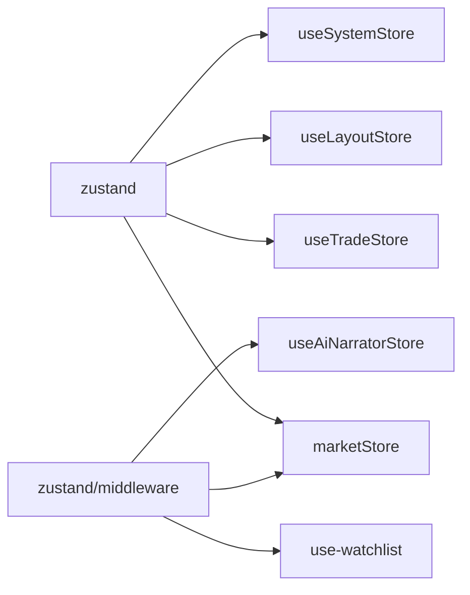

# Zustand状态管理

<cite>
**本文引用的文件**
- [frontend/src/stores/marketStore.ts](file://frontend/src/stores/marketStore.ts)
- [frontend/src/stores/useTradeStore.ts](file://frontend/src/stores/useTradeStore.ts)
- [frontend/src/stores/useLayoutStore.ts](file://frontend/src/stores/useLayoutStore.ts)
- [frontend/src/stores/useSystemStore.ts](file://frontend/src/stores/useSystemStore.ts)
- [frontend/src/stores/use-watchlist.ts](file://frontend/src/stores/use-watchlist.ts)
- [frontend/src/stores/useAiNarratorStore.ts](file://frontend/src/stores/useAiNarratorStore.ts)
- [frontend/src/stores/useAlertOverlayStore.ts](file://frontend/src/stores/useAlertOverlayStore.ts)
- [frontend/src/stores/useBackendStatusStore.ts](file://frontend/src/stores/useBackendStatusStore.ts)
- [frontend/src/stores/useChatStore.ts](file://frontend/src/stores/useChatStore.ts)
- [frontend/package.json](file://frontend/package.json)
</cite>

## 目录
1. [简介](#简介)
2. [项目结构](#项目结构)
3. [核心组件](#核心组件)
4. [架构总览](#架构总览)
5. [详细组件分析](#详细组件分析)
6. [依赖关系分析](#依赖关系分析)
7. [性能考量](#性能考量)
8. [故障排查指南](#故障排查指南)
9. [结论](#结论)
10. [附录](#附录)

## 简介
本文件面向Quant Agent前端的状态管理，聚焦于Zustand store的设计模式与最佳实践。围绕以下四个核心store展开：marketStore（市场数据状态）、tradeStore（交易相关状态）、layoutStore（界面布局状态）、systemStore（系统级状态）。文档涵盖store拆分原则、状态结构设计、异步操作处理、持久化方案、性能优化（如selector使用）、调试方法与错误处理策略，并结合仓库中实际store实现给出可操作的指导。

## 项目结构
前端采用基于功能域划分的store组织方式，位于 frontend/src/stores 目录下。每个store以useXxx命名导出，便于在React组件中以hook形式订阅与调用。关键依赖包括zustand及其中间件（persist、devtools），用于本地持久化与开发期调试。

图表来源
- [frontend/src/stores/marketStore.ts:1-41](file://frontend/src/stores/marketStore.ts#L1-L41)
- [frontend/src/stores/useTradeStore.ts:1-82](file://frontend/src/stores/useTradeStore.ts#L1-L82)
- [frontend/src/stores/useLayoutStore.ts:1-47](file://frontend/src/stores/useLayoutStore.ts#L1-L47)
- [frontend/src/stores/useSystemStore.ts:1-18](file://frontend/src/stores/useSystemStore.ts#L1-L18)
- [frontend/src/stores/use-watchlist.ts:1-69](file://frontend/src/stores/use-watchlist.ts#L1-L69)
- [frontend/src/stores/useAiNarratorStore.ts:1-37](file://frontend/src/stores/useAiNarratorStore.ts#L1-L37)
- [frontend/src/stores/useAlertOverlayStore.ts:1-74](file://frontend/src/stores/useAlertOverlayStore.ts#L1-L74)
- [frontend/src/stores/useBackendStatusStore.ts:1-54](file://frontend/src/stores/useBackendStatusStore.ts#L1-L54)
- [frontend/src/stores/useChatStore.ts:1-205](file://frontend/src/stores/useChatStore.ts#L1-L205)

章节来源
- [frontend/package.json:17-85](file://frontend/package.json#L17-L85)

## 核心组件
- marketStore：维护当前聚焦的全局标的（代码、名称、类型），提供设置与重置方法，并启用持久化与开发工具。
- tradeStore：承载图表内拖拽式下单的模拟持仓与待确认订单，支持确认、取消、更新止损止盈、删除持仓等。
- layoutStore：控制右侧抽屉（AI副驾与设置）互斥展开，提供打开、关闭、切换与统一关闭方法。
- systemStore：系统级状态，包含WebSocket连接状态与“是否有未保存更改”标记。

章节来源
- [frontend/src/stores/marketStore.ts:1-41](file://frontend/src/stores/marketStore.ts#L1-L41)
- [frontend/src/stores/useTradeStore.ts:1-82](file://frontend/src/stores/useTradeStore.ts#L1-L82)
- [frontend/src/stores/useLayoutStore.ts:1-47](file://frontend/src/stores/useLayoutStore.ts#L1-L47)
- [frontend/src/stores/useSystemStore.ts:1-18](file://frontend/src/stores/useSystemStore.ts#L1-L18)

## 架构总览
Zustand作为轻量状态库，通过create函数创建store，结合中间件实现持久化与调试。各store职责清晰、边界明确，遵循单一职责原则；复杂交互通过组合多个store完成。

图表来源
- [frontend/src/stores/marketStore.ts:4-15](file://frontend/src/stores/marketStore.ts#L4-L15)
- [frontend/src/stores/useTradeStore.ts:7-37](file://frontend/src/stores/useTradeStore.ts#L7-L37)
- [frontend/src/stores/useLayoutStore.ts:7-17](file://frontend/src/stores/useLayoutStore.ts#L7-L17)
- [frontend/src/stores/useSystemStore.ts:5-10](file://frontend/src/stores/useSystemStore.ts#L5-L10)

## 详细组件分析

### marketStore（市场数据状态）
- 设计要点
  - 使用create定义store，配合devtools与persist中间件，开启开发调试与LocalStorage持久化。
  - 状态字段简洁：当前标的代码、名称、类型；动作方法负责设置与重置。
- 典型用法
  - 组件通过useMarketStore获取currentTicker等状态，调用setCurrentTicker更新全局焦点标的。
  - 页面刷新后仍保持上次选择的标的（由persist保证）。
- 复杂度与扩展
  - 当前为O(1)读写；如需扩展为多标的快照或历史选择，可在现有结构上增加数组与索引。

图表来源
- [frontend/src/stores/marketStore.ts:17-40](file://frontend/src/stores/marketStore.ts#L17-L40)

章节来源
- [frontend/src/stores/marketStore.ts:1-41](file://frontend/src/stores/marketStore.ts#L1-L41)

### tradeStore（交易相关状态）
- 设计要点
  - 按标的聚合的模拟持仓positions与待确认订单pending，满足图表内拖拽下单的可视化与交互验证。
  - 提供确认、取消、更新止损止盈、删除持仓等方法；内部生成唯一ID。
- 典型流程（确认订单）
  - 将pending转换为SimPosition并入队到对应symbol的positions中，同时清空pending。
- 复杂度
  - 更新单个持仓为O(n)，n为该symbol下的持仓数；整体为浅拷贝更新，避免深层嵌套带来的开销。

图表来源
- [frontend/src/stores/useTradeStore.ts:45-64](file://frontend/src/stores/useTradeStore.ts#L45-L64)

章节来源
- [frontend/src/stores/useTradeStore.ts:1-82](file://frontend/src/stores/useTradeStore.ts#L1-L82)

### layoutStore（界面布局状态）
- 设计要点
  - 控制右侧抽屉（AI副驾与设置）互斥展开，确保同一时刻最多一个抽屉打开。
  - 提供打开、关闭、切换与统一关闭方法，逻辑简单且幂等。
- 典型场景
  - 用户点击侧边按钮时切换copilotOpen或settingsOpen，并在切换时关闭另一个抽屉。

图表来源
- [frontend/src/stores/useLayoutStore.ts:19-46](file://frontend/src/stores/useLayoutStore.ts#L19-L46)

章节来源
- [frontend/src/stores/useLayoutStore.ts:1-47](file://frontend/src/stores/useLayoutStore.ts#L1-L47)

### systemStore（系统级状态）
- 设计要点
  - 维护WebSocket连接状态与“是否有未保存更改”标记，供全局横幅、提示等消费。
- 典型用法
  - WebSocket连接事件触发setWsStatus；表单编辑时通过setHasUnsavedChanges标记变更。

图表来源
- [frontend/src/stores/useSystemStore.ts:1-18](file://frontend/src/stores/useSystemStore.ts#L1-L18)

章节来源
- [frontend/src/stores/useSystemStore.ts:1-18](file://frontend/src/stores/useSystemStore.ts#L1-L18)

### 其他重要store（补充）
- use-watchlist：关注列表的增删改查与排序，支持持久化与开发工具；在DEV下可启用Mock数据。
- useAiNarratorStore：异动解说开关与阈值配置，持久化存储。
- useAlertOverlayStore：告警推送队列、Toast栈与角标计数，支持P0/P1/P2优先级与去重。
- useBackendStatusStore：后端可达性判定，累计网络失败次数达到阈值后置为离线，任意HTTP响应复位在线。
- useChatStore：会话消息、生成状态、快速提示、导出与重试；通过注入_sendImpl编排SSE流式请求，避免store直接依赖React hooks。

章节来源
- [frontend/src/stores/use-watchlist.ts:1-69](file://frontend/src/stores/use-watchlist.ts#L1-L69)
- [frontend/src/stores/useAiNarratorStore.ts:1-37](file://frontend/src/stores/useAiNarratorStore.ts#L1-L37)
- [frontend/src/stores/useAlertOverlayStore.ts:1-74](file://frontend/src/stores/useAlertOverlayStore.ts#L1-L74)
- [frontend/src/stores/useBackendStatusStore.ts:1-54](file://frontend/src/stores/useBackendStatusStore.ts#L1-L54)
- [frontend/src/stores/useChatStore.ts:1-205](file://frontend/src/stores/useChatStore.ts#L1-L205)

## 依赖关系分析
- 外部依赖
  - zustand：核心状态库。
  - zustand/middleware：提供persist（持久化）与devtools（调试）能力。
- 模块耦合
  - 各store相互独立，通过组件层组合使用；chatStore通过注入_sendImpl解耦SSE编排逻辑，降低store对React的耦合度。
- 潜在循环依赖
  - 当前store之间无直接导入关系，不存在循环依赖风险。

图表来源
- [frontend/package.json:17-85](file://frontend/package.json#L17-L85)
- [frontend/src/stores/marketStore.ts:1-3](file://frontend/src/stores/marketStore.ts#L1-L3)
- [frontend/src/stores/use-watchlist.ts:1-3](file://frontend/src/stores/use-watchlist.ts#L1-L3)
- [frontend/src/stores/useAiNarratorStore.ts:3-4](file://frontend/src/stores/useAiNarratorStore.ts#L3-L4)

章节来源
- [frontend/package.json:17-85](file://frontend/package.json#L17-L85)

## 性能考量
- selector使用
  - 在组件中仅订阅所需字段，例如只订阅currentTicker而非整个marketStore，减少不必要的重渲染。
- 不可变更新
  - 所有action采用不可变更新（浅拷贝），避免深层对象导致的昂贵diff。
- 批量更新
  - 对于高频更新（如行情推送），建议在更上层做节流/防抖，或在store内合并多次更新后再set。
- 持久化体积
  - persist会序列化状态，注意watchlist等可能较大的列表不要过度持久化，必要时限制长度或分片。
- 调试工具
  - devtools有助于记录状态变更时间线，定位性能瓶颈与异常更新。

[本节为通用性能建议，不直接分析具体文件]

## 故障排查指南
- 后端不可用
  - 使用useBackendStatusStore的registerFailure与registerSuccess进行网络层失败累计与恢复；当连续失败达到阈值时显示全局离线横幅。
- WebSocket断连
  - 通过systemStore的wsStatus反映连接状态，组件据此展示连接指示或重试入口。
- 告警堆积
  - useAlertOverlayStore提供p0Queue与toastStack，支持去重与上限控制；若出现堆积，检查enqueuePush的去重逻辑与展示层的dismiss行为。
- 聊天会话加载失败
  - useChatStore在handleSelectSession中捕获异常并输出日志；可通过浏览器控制台查看错误信息。

章节来源
- [frontend/src/stores/useBackendStatusStore.ts:27-53](file://frontend/src/stores/useBackendStatusStore.ts#L27-L53)
- [frontend/src/stores/useSystemStore.ts:12-17](file://frontend/src/stores/useSystemStore.ts#L12-L17)
- [frontend/src/stores/useAlertOverlayStore.ts:27-69](file://frontend/src/stores/useAlertOverlayStore.ts#L27-L69)
- [frontend/src/stores/useChatStore.ts:104-163](file://frontend/src/stores/useChatStore.ts#L104-L163)

## 结论
本项目的前端状态管理基于Zustand，采用按领域拆分的store组织方式，职责清晰、易于维护。marketStore、tradeStore、layoutStore、systemStore分别覆盖市场、交易、布局与系统级状态，辅以watchlist、alert、backend status、chat等专用store，形成完整的前端状态体系。通过persist与devtools提升用户体验与可调试性；通过不可变更新与合理selector保障性能。建议在后续演进中继续坚持单一职责、最小状态暴露与可测试性原则。

[本节为总结性内容，不直接分析具体文件]

## 附录
- Store创建示例（概念说明）
  - 使用create定义store，传入(state, setState) => state对象，其中包含初始状态与方法。
  - 使用persist中间件将状态同步到LocalStorage，key可自定义。
  - 使用devtools中间件启用Redux DevTools风格的调试面板。
- 状态更新方法
  - 简单setter：set({ field: value })。
  - 复合更新：set((s) => ({ ...s, field: newValue }))，确保不可变更新。
- 复杂状态逻辑
  - 在action内部读取当前状态（get()）进行条件判断与计算，再一次性set结果。
- 异步操作处理
  - 在action中发起网络请求，成功则更新状态，失败则记录错误或使用全局状态（如backend status）提示。
- 错误处理策略
  - 网络层失败：使用backend status store累计失败并展示横幅。
  - 业务错误：在store中捕获异常并记录日志，必要时回滚状态。
- 状态调试方法
  - 启用devtools，观察状态变更时间线与快照差异。
  - 针对大对象（如watchlist）限制持久化大小或仅在开发环境启用。

[本节为通用指导，不直接分析具体文件]
