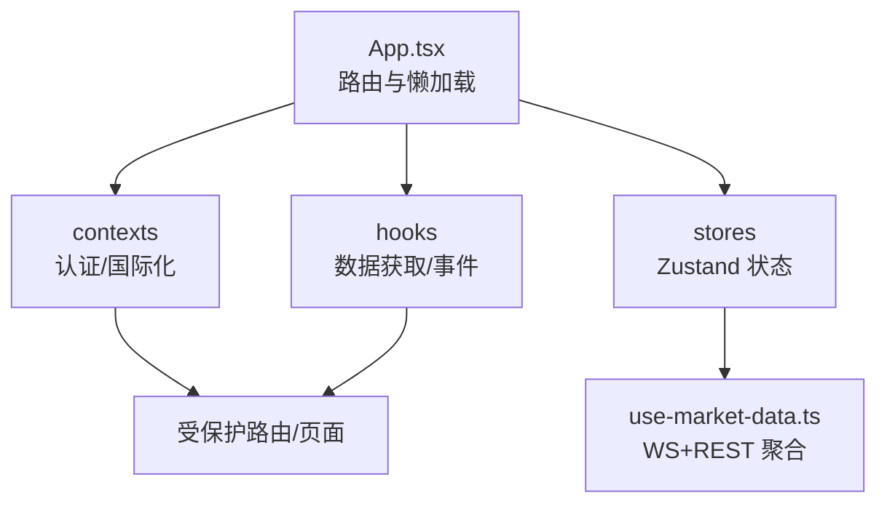
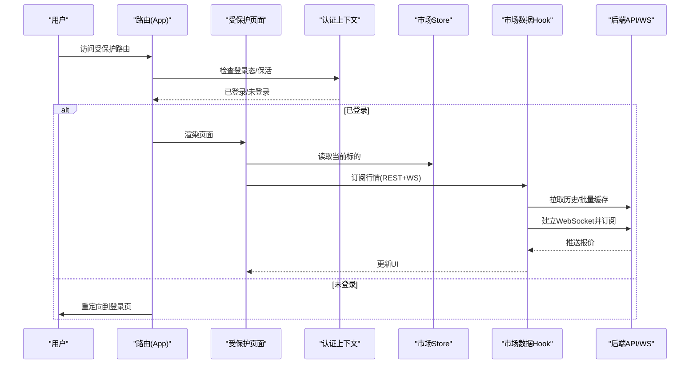
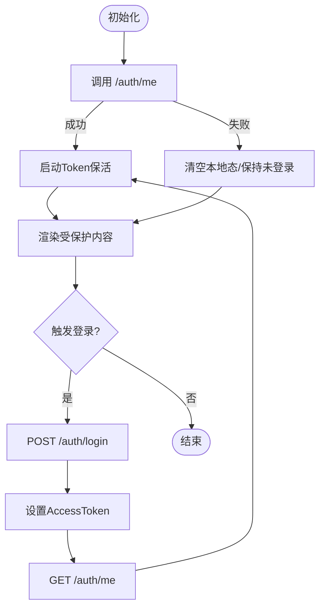
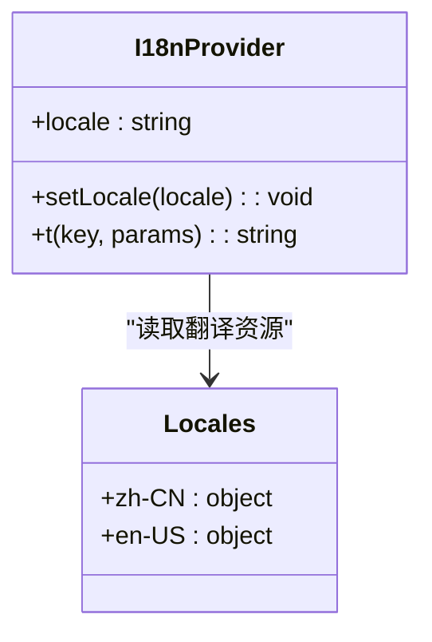
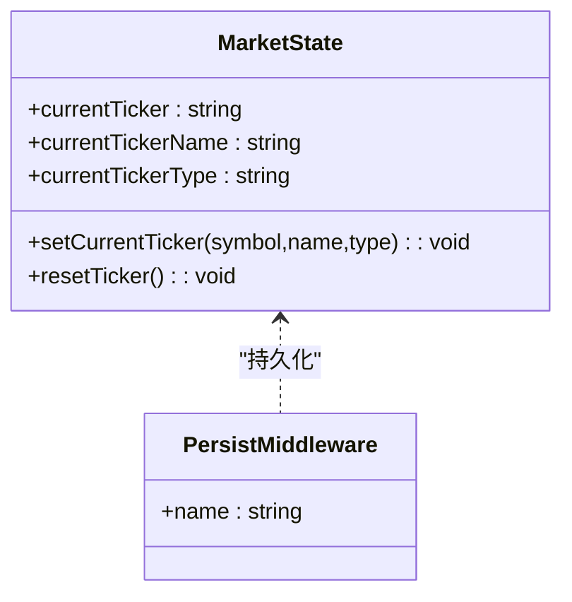
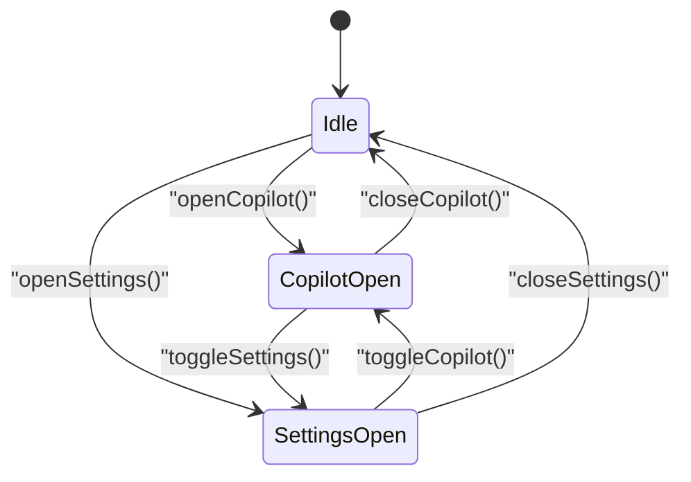
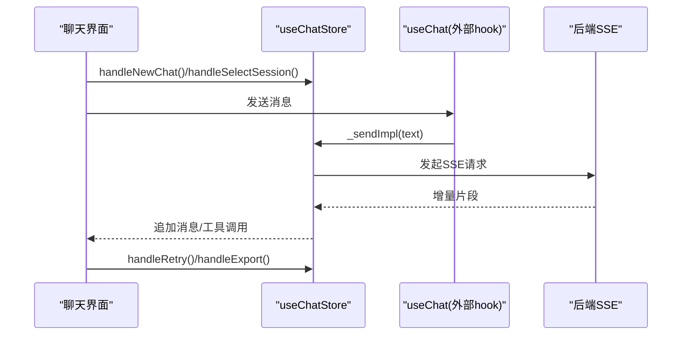
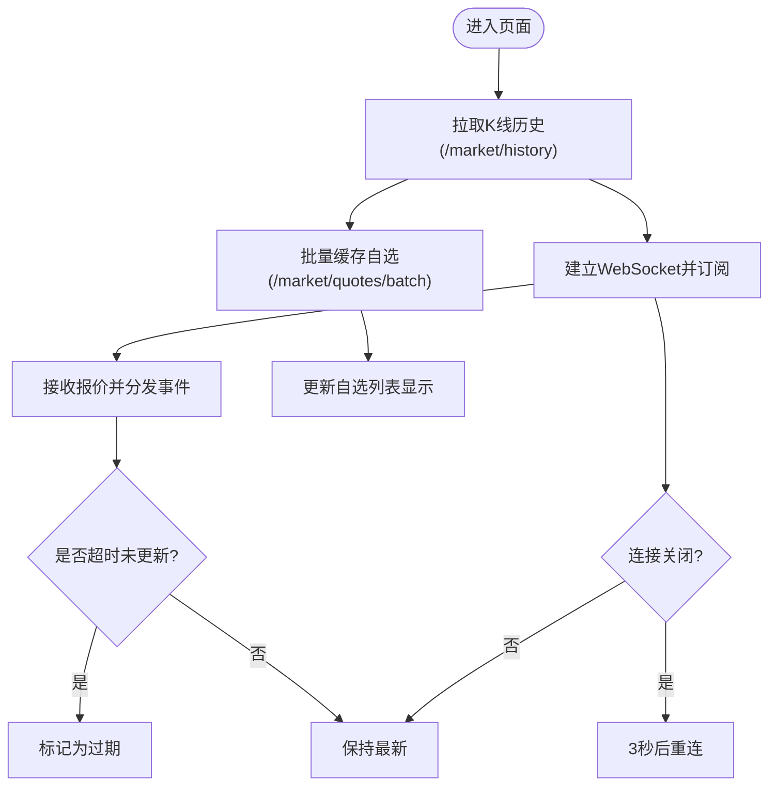
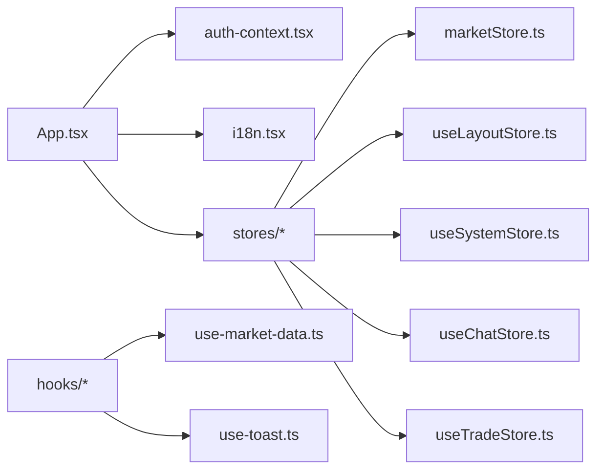

# 状态管理方案

<cite>
**本文引用的文件**
- [frontend/package.json](file://frontend/package.json)
- [frontend/src/App.tsx](file://frontend/src/App.tsx)
- [frontend/src/contexts/auth-context.tsx](file://frontend/src/contexts/auth-context.tsx)
- [frontend/src/contexts/i18n.tsx](file://frontend/src/contexts/i18n.tsx)
- [frontend/src/stores/marketStore.ts](file://frontend/src/stores/marketStore.ts)
- [frontend/src/stores/useLayoutStore.ts](file://frontend/src/stores/useLayoutStore.ts)
- [frontend/src/stores/useSystemStore.ts](file://frontend/src/stores/useSystemStore.ts)
- [frontend/src/stores/useChatStore.ts](file://frontend/src/stores/useChatStore.ts)
- [frontend/src/stores/useTradeStore.ts](file://frontend/src/stores/useTradeStore.ts)
- [frontend/src/hooks/use-market-data.ts](file://frontend/src/hooks/use-market-data.ts)
- [frontend/src/hooks/use-toast.ts](file://frontend/src/hooks/use-toast.ts)
</cite>

## 目录
1. [简介](#简介)
2. [项目结构](#项目结构)
3. [核心组件](#核心组件)
4. [架构总览](#架构总览)
5. [详细组件分析](#详细组件分析)
6. [依赖关系分析](#依赖关系分析)
7. [性能考虑](#性能考虑)
8. [故障排查指南](#故障排查指南)
9. [结论](#结论)
10. [附录](#附录)

## 简介
本方案面向 Quant Agent 前端，提供基于 Zustand 的状态管理模式与 React Context 的协同设计。重点覆盖：
- Store 设计原则：按领域拆分、动作内聚、类型安全、可测试性
- 状态持久化：使用 persist 中间件将关键状态落盘（如当前标的）
- 异步状态处理：通过自定义 hooks 封装数据获取、WebSocket 订阅、错误与重试
- React Context 的使用场景：认证上下文、国际化上下文、主题上下文（可扩展）
- 自定义 Hooks 模式：数据获取、事件处理、状态同步
- 实战示例：全局状态创建、跨组件共享、复杂逻辑编排
- 调试技巧、性能优化策略与状态迁移方案

## 项目结构
前端采用“功能域 + 层”的组织方式：
- contexts：应用级上下文（认证、国际化等）
- stores：Zustand store（按领域划分：行情、布局、系统、聊天、交易等）
- hooks：业务无关或跨模块复用的能力封装（市场数据、Toast 等）
- features：按功能模块组织页面与子模块（路由懒加载）
- App 入口：集中路由与模块懒加载，配合错误边界与加载态

图表来源
- [frontend/src/App.tsx:1-133](file://frontend/src/App.tsx#L1-L133)

章节来源
- [frontend/src/App.tsx:1-133](file://frontend/src/App.tsx#L1-L133)

## 核心组件
- 认证上下文（AuthContext）：统一登录/登出、Token 保活、鉴权失败跳转
- 国际化上下文（I18nContext）：语言切换、本地化存储、嵌套键取值
- 市场 Store（marketStore）：当前标的选择与持久化
- 布局 Store（useLayoutStore）：右侧抽屉互斥控制（Copilot/Settings）
- 系统 Store（useSystemStore）：WebSocket 连接状态、未保存变更标记
- 聊天 Store（useChatStore）：会话、消息、SSE 注入、导出与重试
- 交易 Store（useTradeStore）：模拟持仓与待确认订单（沙箱推演）
- 市场数据 Hook（useMarketData）：K线历史轮询、批量缓存、WebSocket 实时推送
- Toast Hook（use-toast）：轻量通知队列与生命周期管理

章节来源
- [frontend/src/contexts/auth-context.tsx:1-105](file://frontend/src/contexts/auth-context.tsx#L1-L105)
- [frontend/src/contexts/i18n.tsx:1-95](file://frontend/src/contexts/i18n.tsx#L1-L95)
- [frontend/src/stores/marketStore.ts:1-41](file://frontend/src/stores/marketStore.ts#L1-L41)
- [frontend/src/stores/useLayoutStore.ts:1-47](file://frontend/src/stores/useLayoutStore.ts#L1-L47)
- [frontend/src/stores/useSystemStore.ts:1-18](file://frontend/src/stores/useSystemStore.ts#L1-L18)
- [frontend/src/stores/useChatStore.ts:1-205](file://frontend/src/stores/useChatStore.ts#L1-L205)
- [frontend/src/stores/useTradeStore.ts:1-82](file://frontend/src/stores/useTradeStore.ts#L1-L82)
- [frontend/src/hooks/use-market-data.ts:1-318](file://frontend/src/hooks/use-market-data.ts#L1-L318)
- [frontend/src/hooks/use-toast.ts:1-183](file://frontend/src/hooks/use-toast.ts#L1-L183)

## 架构总览
整体采用“Context 负责应用级横切关注点 + Zustand 负责领域状态 + Hooks 封装副作用”的分层模式。路由层通过懒加载减少首屏体积，结合错误边界提升稳定性。

图表来源
- [frontend/src/App.tsx:90-124](file://frontend/src/App.tsx#L90-L124)
- [frontend/src/contexts/auth-context.tsx:21-89](file://frontend/src/contexts/auth-context.tsx#L21-L89)
- [frontend/src/stores/marketStore.ts:17-40](file://frontend/src/stores/marketStore.ts#L17-L40)
- [frontend/src/hooks/use-market-data.ts:29-314](file://frontend/src/hooks/use-market-data.ts#L29-L314)

## 详细组件分析

### 认证上下文（AuthContext）
职责
- 维护用户信息、加载态
- 登录/登出流程，设置/清除 Token
- 注册鉴权失效回调，统一跳转登录页
- 启动/停止 Token 保活

最佳实践
- 在应用根节点包裹 Provider
- 所有需要鉴权的页面/路由通过 ProtectedRoute 或上下文判断
- 避免在 UI 中直接操作 Token，统一由上下文管理

图表来源
- [frontend/src/contexts/auth-context.tsx:21-89](file://frontend/src/contexts/auth-context.tsx#L21-L89)

章节来源
- [frontend/src/contexts/auth-context.tsx:1-105](file://frontend/src/contexts/auth-context.tsx#L1-L105)

### 国际化上下文（I18nContext）
职责
- 维护当前语言、提供 t(key, params) 翻译函数
- 从 localStorage 恢复语言偏好，支持浏览器语言检测
- 支持嵌套键取值与参数替换

最佳实践
- 将 I18nProvider 置于应用顶层
- 使用 useI18n() 获取 t 方法，避免在深层组件传递 locale
- 新增文案时优先使用嵌套 key，便于维护

图表来源
- [frontend/src/contexts/i18n.tsx:48-88](file://frontend/src/contexts/i18n.tsx#L48-L88)

章节来源
- [frontend/src/contexts/i18n.tsx:1-95](file://frontend/src/contexts/i18n.tsx#L1-L95)

### 市场 Store（marketStore）
职责
- 管理当前聚焦标的（symbol/name/type）
- 提供重置与设置动作
- 使用 persist 中间件将状态持久化到 LocalStorage

设计要点
- 使用 devtools 开启调试
- 以 name 指定持久化 key，避免冲突
- 默认值明确，便于离线/冷启动体验

图表来源
- [frontend/src/stores/marketStore.ts:4-40](file://frontend/src/stores/marketStore.ts#L4-L40)

章节来源
- [frontend/src/stores/marketStore.ts:1-41](file://frontend/src/stores/marketStore.ts#L1-L41)

### 布局 Store（useLayoutStore）
职责
- 管理右侧抽屉（Copilot/Settings）互斥展开
- 提供 open/close/toggle 等方法，保证同一时间最多一个抽屉打开

适用场景
- 全局侧边栏/抽屉类交互
- 多面板互斥显示

图表来源
- [frontend/src/stores/useLayoutStore.ts:19-46](file://frontend/src/stores/useLayoutStore.ts#L19-L46)

章节来源
- [frontend/src/stores/useLayoutStore.ts:1-47](file://frontend/src/stores/useLayoutStore.ts#L1-L47)

### 系统 Store（useSystemStore）
职责
- 维护 WebSocket 连接状态（CONNECTED/DISCONNECTED/CONNECTING）
- 记录是否存在未保存更改，辅助提示离开页面

适用场景
- 全局连接状态展示
- 表单/编辑器未保存提示

章节来源
- [frontend/src/stores/useSystemStore.ts:1-18](file://frontend/src/stores/useSystemStore.ts#L1-L18)

### 聊天 Store（useChatStore）
职责
- 会话与消息管理、生成状态、复制/导出
- 支持 SSE 流式发送的实现注入（_sendImpl），解耦 React 与 store
- 会话选择、重试、快速提示刷新

设计要点
- 通过 injectSendImpl/getChatSend 注入外部实现，避免在 store 中使用 hooks
- 对工具调用结果进行截断，保持终端整洁
- 策略代码块提取用于历史记录恢复

图表来源
- [frontend/src/stores/useChatStore.ts:51-205](file://frontend/src/stores/useChatStore.ts#L51-L205)

章节来源
- [frontend/src/stores/useChatStore.ts:1-205](file://frontend/src/stores/useChatStore.ts#L1-L205)

### 交易 Store（useTradeStore）
职责
- 管理模拟持仓（按标的聚合）与待确认下单草稿
- 提供确认/取消、止损止盈级别更新、移除持仓等操作

适用场景
- 图表拖拽下单的可视化与验证
- 沙箱推演（非实盘）

章节来源
- [frontend/src/stores/useTradeStore.ts:1-82](file://frontend/src/stores/useTradeStore.ts#L1-L82)

### 市场数据 Hook（useMarketData）
职责
- 低频 K 线历史轮询（REST）
- 自选列表批量缓存（Redis）
- 高频 WebSocket 实时报价（Protobuf 解码）
- 断连/不可用时的降级与提示
- 根据可见性与 keep-alive 状态管理 WS 连接

处理流程

图表来源
- [frontend/src/hooks/use-market-data.ts:29-314](file://frontend/src/hooks/use-market-data.ts#L29-L314)

章节来源
- [frontend/src/hooks/use-market-data.ts:1-318](file://frontend/src/hooks/use-market-data.ts#L1-L318)

### Toast Hook（use-toast）
职责
- 管理通知队列、自动移除、更新与关闭
- 提供 toast/dismiss/update API

适用场景
- 全局错误提示、操作反馈
- 与网络异常、WS 断连等事件联动

章节来源
- [frontend/src/hooks/use-toast.ts:1-183](file://frontend/src/hooks/use-toast.ts#L1-L183)

## 依赖关系分析
- 运行时依赖：Zustand（状态）、i18next/react-i18next（国际化）、next-themes（主题）、web-vitals（性能指标）等
- 模块耦合：
  - App 通过路由懒加载各功能模块，降低首屏体积
  - 认证上下文与 api-client 协作完成鉴权与保活
  - 市场数据 Hook 依赖 marketStore 的当前标的与 watchlist
  - Chat Store 通过注入方式与外部 hook 协作，避免循环依赖

图表来源
- [frontend/package.json:17-84](file://frontend/package.json#L17-L84)
- [frontend/src/App.tsx:9-66](file://frontend/src/App.tsx#L9-L66)

章节来源
- [frontend/package.json:1-114](file://frontend/package.json#L1-L114)
- [frontend/src/App.tsx:1-133](file://frontend/src/App.tsx#L1-L133)

## 性能考虑
- 路由懒加载：将大模块按需加载，减少首屏体积
- WebSocket 节流：仅对当前聚焦 ticker 订阅，非聚焦通过批量缓存更新
- 可见性与后台策略：页面隐藏或后台时断开 WS，恢复时重连，降低无效开销
- 状态持久化：仅持久化必要字段（如当前标的），避免过大存储
- 错误降级：网络异常时切换到离线模式并提示，保障可用性
- 调试工具：devtools 开启 Zustand 调试，便于追踪状态变化

[本节为通用指导，不直接分析具体文件]

## 故障排查指南
- 认证问题
  - 现象：频繁跳转登录页或无法访问受保护路由
  - 排查：检查 /auth/me 返回、Token 保活是否启动、鉴权失效回调是否正确注册
  - 参考：[frontend/src/contexts/auth-context.tsx:21-89](file://frontend/src/contexts/auth-context.tsx#L21-L89)

- WebSocket 连接不稳定
  - 现象：行情不更新或频繁重连
  - 排查：查看 onclose 日志、重连间隔、keep-alive 与可见性状态；确认 token 有效
  - 参考：[frontend/src/hooks/use-market-data.ts:184-314](file://frontend/src/hooks/use-market-data.ts#L184-L314)

- 自选列表不同步
  - 现象：非聚焦标的价格不更新
  - 排查：确认批量接口返回、事件派发与监听是否正常
  - 参考：[frontend/src/hooks/use-market-data.ts:128-182](file://frontend/src/hooks/use-market-data.ts#L128-L182)

- 聊天消息丢失或重复
  - 现象：会话切换后消息异常
  - 排查：检查 handleSelectSession 的消息合并逻辑与工具调用结果回填
  - 参考：[frontend/src/stores/useChatStore.ts:104-163](file://frontend/src/stores/useChatStore.ts#L104-L163)

- 通知堆积或消失过快
  - 现象：toast 过多或自动消失
  - 排查：调整 TOAST_LIMIT 与移除延迟，确保 dismiss/update 正确调用
  - 参考：[frontend/src/hooks/use-toast.ts:8-10](file://frontend/src/hooks/use-toast.ts#L8-L10), [frontend/src/hooks/use-toast.ts:133-160](file://frontend/src/hooks/use-toast.ts#L133-L160)

章节来源
- [frontend/src/contexts/auth-context.tsx:21-89](file://frontend/src/contexts/auth-context.tsx#L21-L89)
- [frontend/src/hooks/use-market-data.ts:128-314](file://frontend/src/hooks/use-market-data.ts#L128-L314)
- [frontend/src/stores/useChatStore.ts:104-163](file://frontend/src/stores/useChatStore.ts#L104-L163)
- [frontend/src/hooks/use-toast.ts:8-10](file://frontend/src/hooks/use-toast.ts#L8-L10)
- [frontend/src/hooks/use-toast.ts:133-160](file://frontend/src/hooks/use-toast.ts#L133-L160)

## 结论
本方案通过 Context 与 Zustand 的清晰分工，实现了高内聚、低耦合的前端状态管理：
- Context 专注应用级横切关注点（认证、国际化、主题）
- Zustand 负责领域状态（行情、布局、系统、聊天、交易）
- Hooks 封装副作用（数据获取、事件处理、状态同步）
配合路由懒加载、WebSocket 节流与错误降级，兼顾性能与稳定性。后续可按需扩展主题上下文、更多持久化策略与更细粒度的状态切片。

[本节为总结，不直接分析具体文件]

## 附录
- 状态调试技巧
  - 启用 Zustand devtools，观察状态快照与动作回放
  - 在关键 action 前后打印日志，定位状态变更链路
  - 使用浏览器 Network 面板与 WS 调试工具，核对数据流

- 性能优化策略
  - 合理拆分 store，避免单一大 store 导致不必要重渲染
  - 使用 selector 精确订阅所需字段（Zustand 原生支持）
  - 对高频数据（如 WS tick）做节流与去抖，减少渲染压力

- 状态迁移方案
  - 版本化持久化 key，兼容旧数据结构
  - 在应用启动时执行迁移脚本，将旧格式转换为新格式
  - 逐步替换旧状态源，保留回滚能力

[本节为通用指导，不直接分析具体文件]
