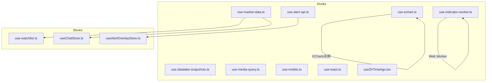
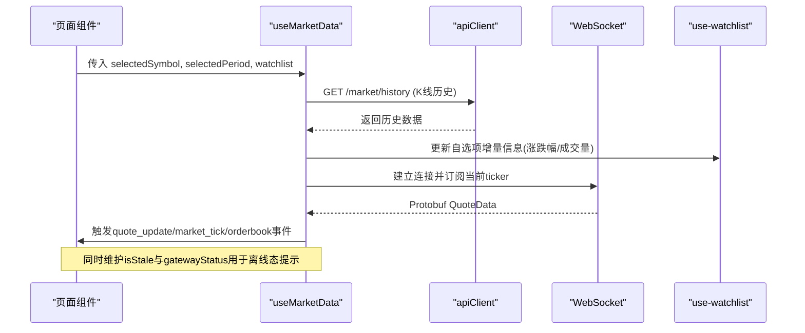
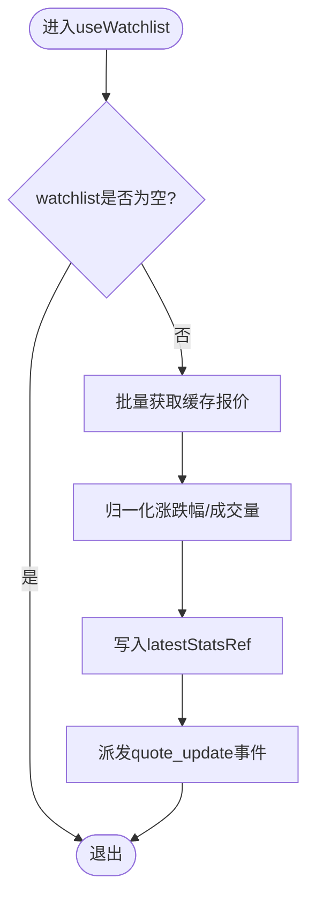
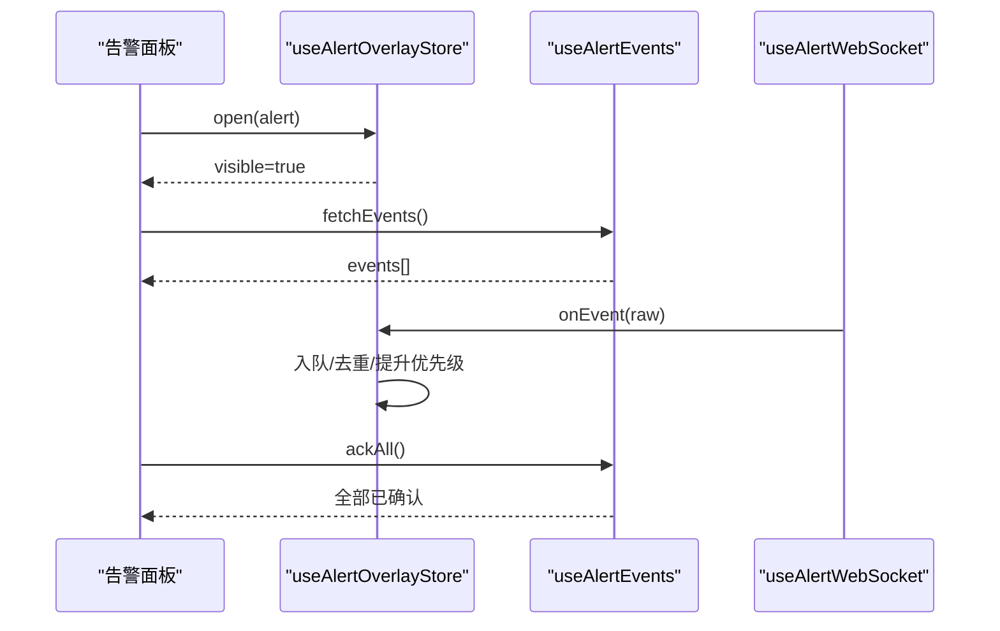
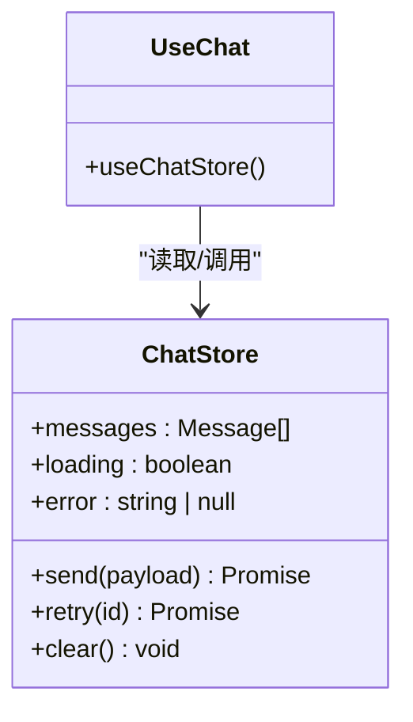
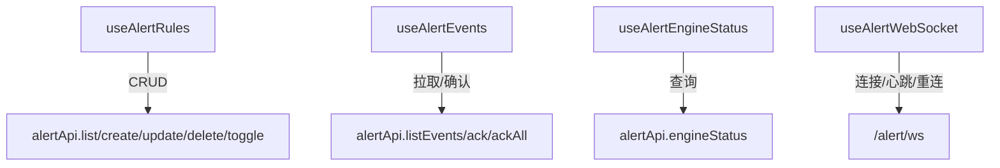
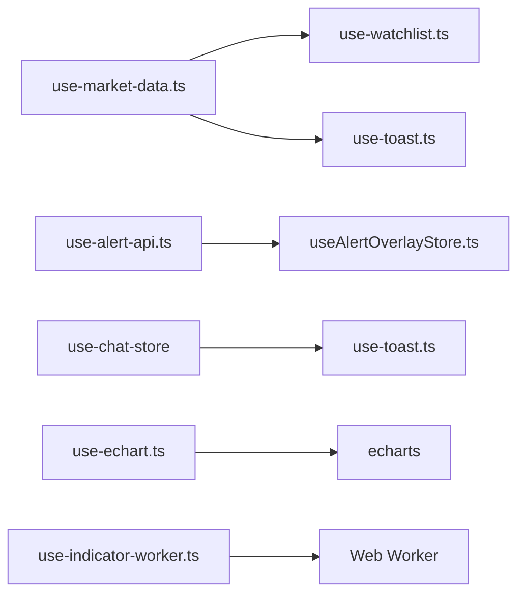

# 自定义Hooks开发

<cite>
**本文引用的文件**
- [use-market-data.ts](file://frontend/src/hooks/use-market-data.ts)
- [use-alert-api.ts](file://frontend/src/hooks/use-alert-api.ts)
- [use-datalake-snapshots.ts](file://frontend/src/hooks/use-datalake-snapshots.ts)
- [use-echart.ts](file://frontend/src/hooks/use-echart.ts)
- [use-indicator-worker.ts](file://frontend/src/hooks/use-indicator-worker.ts)
- [use-media-query.ts](file://frontend/src/hooks/use-media-query.ts)
- [use-mobile.ts](file://frontend/src/hooks/use-mobile.ts)
- [use-toast.ts](file://frontend/src/hooks/use-toast.ts)
- [useZhTimeAgo.tsx](file://frontend/src/hooks/useZhTimeAgo.tsx)
- [use-watchlist.ts](file://frontend/src/stores/use-watchlist.ts)
- [useAlertOverlayStore.ts](file://frontend/src/stores/useAlertOverlayStore.ts)
- [useChatStore.ts](file://frontend/src/stores/useChatStore.ts)
</cite>

## 目录
1. [简介](#简介)
2. [项目结构](#项目结构)
3. [核心组件](#核心组件)
4. [架构总览](#架构总览)
5. [详细组件分析](#详细组件分析)
6. [依赖分析](#依赖分析)
7. [性能考虑](#性能考虑)
8. [故障排查指南](#故障排查指南)
9. [结论](#结论)
10. [附录](#附录)

## 简介
本规范面向Quant Agent前端自定义Hook的开发，聚焦以下目标：
- 统一设计模式与命名约定，确保Hook具备高内聚、低耦合、可复用特性
- 重点解析业务Hook：useWatchlist（自选列表管理）、useAlertOverlay（告警弹窗控制）、useChatStore（聊天状态管理）等
- 明确参数传递模式、返回值结构规范、副作用处理策略
- 提供实战示例、测试策略、性能优化技巧与常见陷阱规避方法

## 项目结构
前端采用“hooks + stores”的协作模式：
- hooks：封装UI交互、数据获取、WebSocket通信、图表生命周期等能力
- stores：基于Zustand的状态容器，承载跨组件共享的业务状态（如自选列表、告警弹窗、聊天会话）



**图示来源**
- [use-market-data.ts:1-318](file://frontend/src/hooks/use-market-data.ts#L1-L318)
- [use-alert-api.ts:1-262](file://frontend/src/hooks/use-alert-api.ts#L1-L262)
- [use-datalake-snapshots.ts:1-63](file://frontend/src/hooks/use-datalake-snapshots.ts#L1-L63)
- [use-echart.ts:1-46](file://frontend/src/hooks/use-echart.ts#L1-L46)
- [use-indicator-worker.ts:1-26](file://frontend/src/hooks/use-indicator-worker.ts#L1-L26)
- [use-media-query.ts:1-23](file://frontend/src/hooks/use-media-query.ts#L1-L23)
- [use-mobile.ts:1-20](file://frontend/src/hooks/use-mobile.ts#L1-L20)
- [use-toast.ts:1-183](file://frontend/src/hooks/use-toast.ts#L1-L183)
- [useZhTimeAgo.tsx:1-41](file://frontend/src/hooks/useZhTimeAgo.tsx#L1-L41)
- [use-watchlist.ts](file://frontend/src/stores/use-watchlist.ts)
- [useAlertOverlayStore.ts](file://frontend/src/stores/useAlertOverlayStore.ts)
- [useChatStore.ts](file://frontend/src/stores/useChatStore.ts)

**章节来源**
- [use-market-data.ts:1-318](file://frontend/src/hooks/use-market-data.ts#L1-L318)
- [use-alert-api.ts:1-262](file://frontend/src/hooks/use-alert-api.ts#L1-L262)
- [use-datalake-snapshots.ts:1-63](file://frontend/src/hooks/use-datalake-snapshots.ts#L1-L63)
- [use-echart.ts:1-46](file://frontend/src/hooks/use-echart.ts#L1-L46)
- [use-indicator-worker.ts:1-26](file://frontend/src/hooks/use-indicator-worker.ts#L1-L26)
- [use-media-query.ts:1-23](file://frontend/src/hooks/use-media-query.ts#L1-L23)
- [use-mobile.ts:1-20](file://frontend/src/hooks/use-mobile.ts#L1-L20)
- [use-toast.ts:1-183](file://frontend/src/hooks/use-toast.ts#L1-L183)
- [useZhTimeAgo.tsx:1-41](file://frontend/src/hooks/useZhTimeAgo.tsx#L1-L41)

## 核心组件
- useMarketData：负责行情历史拉取、WebSocket实时订阅、离线降级与缓存刷新
- useAlertRules / useAlertEvents / useAlertEngineStatus / useAlertWebSocket：封装告警中心REST与WS能力
- useDatalakeSnapshots：数据湖快照列表与最新快照加载
- useEChart：ECharts实例生命周期管理（初始化/更新/销毁）
- useIndicatorWorker：动态创建Web Worker执行指标计算
- useMediaQuery / useIsMobile：响应式断点检测
- useToast：全局消息提示（增删改查、自动移除）
- useZhTimeAgo：中文相对时间展示

**章节来源**
- [use-market-data.ts:1-318](file://frontend/src/hooks/use-market-data.ts#L1-L318)
- [use-alert-api.ts:1-262](file://frontend/src/hooks/use-alert-api.ts#L1-L262)
- [use-datalake-snapshots.ts:1-63](file://frontend/src/hooks/use-datalake-snapshots.ts#L1-L63)
- [use-echart.ts:1-46](file://frontend/src/hooks/use-echart.ts#L1-L46)
- [use-indicator-worker.ts:1-26](file://frontend/src/hooks/use-indicator-worker.ts#L1-L26)
- [use-media-query.ts:1-23](file://frontend/src/hooks/use-media-query.ts#L1-L23)
- [use-mobile.ts:1-20](file://frontend/src/hooks/use-mobile.ts#L1-L20)
- [use-toast.ts:1-183](file://frontend/src/hooks/use-toast.ts#L1-L183)
- [useZhTimeAgo.tsx:1-41](file://frontend/src/hooks/useZhTimeAgo.tsx#L1-L41)

## 架构总览
下图展示了典型的数据流：页面通过Hook发起请求或建立连接，从后端获取数据后更新本地状态，并通过事件或回调驱动UI。



**图示来源**
- [use-market-data.ts:29-126](file://frontend/src/hooks/use-market-data.ts#L29-L126)
- [use-market-data.ts:184-314](file://frontend/src/hooks/use-market-data.ts#L184-L314)
- [use-watchlist.ts](file://frontend/src/stores/use-watchlist.ts)

## 详细组件分析

### useWatchlist（自选列表管理）
- 职责：集中管理自选标的集合、排序依据（涨跌幅/成交量）、批量更新与去重
- 参数模式：以对象形式接收selectedSymbol、watchlist、updateTicker等，便于扩展
- 返回值：包含列表、统计缓存、更新函数等，供列表渲染与排序使用
- 关键实现要点：
  - 对非聚焦ticker通过批量接口拉取缓存数据，减少重复请求
  - 将涨跌幅与成交量归一化到统一结构，支撑排序与展示
  - 通过自定义事件与UI解耦，避免直接操作DOM



**图示来源**
- [use-market-data.ts:128-182](file://frontend/src/hooks/use-market-data.ts#L128-L182)
- [use-watchlist.ts](file://frontend/src/stores/use-watchlist.ts)

**章节来源**
- [use-market-data.ts:128-182](file://frontend/src/hooks/use-market-data.ts#L128-L182)
- [use-watchlist.ts](file://frontend/src/stores/use-watchlist.ts)

### useAlertOverlay（告警弹窗控制）
- 职责：统一管理告警弹窗的显示/隐藏、优先级、队列与用户确认动作
- 参数模式：通过store暴露open/close/ack等方法，Hook仅消费store状态
- 返回值：弹窗可见性、待处理事件列表、确认/全部确认函数
- 关键实现要点：
  - 与useAlertEvents配合，完成事件拉取与确认
  - 结合useAlertWebSocket实时推送新告警，保持弹窗与事件一致
  - 支持后台/隐藏页时不重连，避免重连风暴



**图示来源**
- [use-alert-api.ts:122-181](file://frontend/src/hooks/use-alert-api.ts#L122-L181)
- [use-alert-api.ts:183-261](file://frontend/src/hooks/use-alert-api.ts#L183-L261)
- [useAlertOverlayStore.ts](file://frontend/src/stores/useAlertOverlayStore.ts)

**章节来源**
- [use-alert-api.ts:122-181](file://frontend/src/hooks/use-alert-api.ts#L122-L181)
- [use-alert-api.ts:183-261](file://frontend/src/hooks/use-alert-api.ts#L183-L261)
- [useAlertOverlayStore.ts](file://frontend/src/stores/useAlertOverlayStore.ts)

### useChatStore（聊天状态管理）
- 职责：管理聊天会话、消息列表、发送/接收状态、错误与重试
- 参数模式：通过store暴露send/retry/clear等方法，Hook仅消费状态
- 返回值：messages、loading、error、send函数等
- 关键实现要点：
  - 消息追加与滚动定位
  - 失败重试与退避策略
  - 与WebSocket或SSE集成时的幂等处理



**图示来源**
- [useChatStore.ts](file://frontend/src/stores/useChatStore.ts)

**章节来源**
- [useChatStore.ts](file://frontend/src/stores/useChatStore.ts)

### useMarketData（行情数据与WebSocket）
- 职责：拉取K线历史、建立WebSocket实时订阅、离线降级、缓存刷新
- 参数模式：{ selectedSymbol, selectedPeriod, watchlist, updateTicker }
- 返回值：realQuote、realHistory、gatewayStatus、isStale、latestStatsRef
- 关键实现要点：
  - 周期映射与历史条数控制，保证长周期展示充分
  - WebSocket二进制Protobuf解码，兼容多字段名
  - 页面不可见/后台时断开连接，恢复时重连
  - 自选列表批量缓存刷新，降低主链路压力

```mermaid
sequenceDiagram
participant C as "组件"
participant M as "useMarketData"
participant R as "REST"
participant W as "WebSocket"
C->>M : 传入symbol/period/watchlist
M->>R : GET /market/history
R-->>M : 历史K线
M->>W : 建立连接并subscribe(symbol)
W-->>M : QuoteData(protobuf)
M->>C : 派发quote_update/market_tick/orderbook
Note over M,W : 不可见/后台时关闭连接; 在线时重连
```

**图示来源**
- [use-market-data.ts:29-126](file://frontend/src/hooks/use-market-data.ts#L29-L126)
- [use-market-data.ts:184-314](file://frontend/src/hooks/use-market-data.ts#L184-L314)

**章节来源**
- [use-market-data.ts:29-126](file://frontend/src/hooks/use-market-data.ts#L29-L126)
- [use-market-data.ts:184-314](file://frontend/src/hooks/use-market-data.ts#L184-L314)

### useAlertRules / useAlertEvents / useAlertEngineStatus / useAlertWebSocket
- 职责：封装告警规则CRUD、事件列表与确认、引擎状态查询、WebSocket实时推送
- 参数模式：按功能拆分，单一职责；WS Hook接收onEvent与onStatus回调
- 返回值：各自领域的数据与操作方法
- 关键实现要点：
  - 统一错误日志与友好提示
  - WS心跳保活与自动重连
  - keep-alive与页面可见性控制，避免并发重连风暴



**图示来源**
- [use-alert-api.ts:21-48](file://frontend/src/hooks/use-alert-api.ts#L21-L48)
- [use-alert-api.ts:50-120](file://frontend/src/hooks/use-alert-api.ts#L50-L120)
- [use-alert-api.ts:122-181](file://frontend/src/hooks/use-alert-api.ts#L122-L181)
- [use-alert-api.ts:183-261](file://frontend/src/hooks/use-alert-api.ts#L183-L261)

**章节来源**
- [use-alert-api.ts:21-48](file://frontend/src/hooks/use-alert-api.ts#L21-L48)
- [use-alert-api.ts:50-120](file://frontend/src/hooks/use-alert-api.ts#L50-L120)
- [use-alert-api.ts:122-181](file://frontend/src/hooks/use-alert-api.ts#L122-L181)
- [use-alert-api.ts:183-261](file://frontend/src/hooks/use-alert-api.ts#L183-L261)

### useDatalakeSnapshots（数据湖快照）
- 职责：加载快照列表与最新快照，提供autoLoad开关
- 参数模式：autoLoad布尔值
- 返回值：snapshots、latest、loading、error、fetchSnapshots
- 关键实现要点：
  - 统一解包不同响应格式（数组或data包裹）
  - 错误隔离：latest失败不影响列表加载

**章节来源**
- [use-datalake-snapshots.ts:1-63](file://frontend/src/hooks/use-datalake-snapshots.ts#L1-L63)

### useEChart（图表生命周期）
- 职责：初始化ECharts实例、根据deps更新配置、监听resize、组件卸载销毁
- 参数模式：buildOption函数与依赖数组
- 返回值：容器ref
- 关键实现要点：
  - 避免重复init与内存泄漏
  - setOption合并更新，减少重绘

**章节来源**
- [use-echart.ts:1-46](file://frontend/src/hooks/use-echart.ts#L1-L46)

### useIndicatorWorker（指标计算Web Worker）
- 职责：动态创建Worker执行指标计算，避免阻塞主线程
- 参数模式：无
- 返回值：workerRef
- 关键实现要点：
  - 通过Blob URL注入代码，绕过打包器限制
  - 正确释放URL与终止Worker

**章节来源**
- [use-indicator-worker.ts:1-26](file://frontend/src/hooks/use-indicator-worker.ts#L1-L26)

### useMediaQuery / useIsMobile（响应式断点）
- 职责：通用媒体查询与移动端判断
- 参数模式：CSS查询字符串或固定断点
- 返回值：布尔值
- 关键实现要点：SSR安全、事件监听与清理

**章节来源**
- [use-media-query.ts:1-23](file://frontend/src/hooks/use-media-query.ts#L1-L23)
- [use-mobile.ts:1-20](file://frontend/src/hooks/use-mobile.ts#L1-L20)

### useToast（消息提示）
- 职责：全局消息队列、自动移除、更新与关闭
- 参数模式：toast({ title, description, action })
- 返回值：{ toast, dismiss, toasts }
- 关键实现要点：限流、超时移除、监听器注册与清理

**章节来源**
- [use-toast.ts:1-183](file://frontend/src/hooks/use-toast.ts#L1-L183)

### useZhTimeAgo（中文相对时间）
- 职责：将时间转换为“刚刚/分钟前/小时前/天前/日期”
- 参数模式：Date/number/string
- 返回值：string
- 关键实现要点：定时器刷新、清理

**章节来源**
- [useZhTimeAgo.tsx:1-41](file://frontend/src/hooks/useZhTimeAgo.tsx#L1-L41)

## 依赖分析
- 模块内聚：每个Hook专注单一职责，通过stores进行跨组件状态共享
- 外部依赖：apiClient、WebSocket、Protobuf、ECharts、Web Worker
- 潜在循环依赖：通过事件总线与store解耦，避免直接引用



**图示来源**
- [use-market-data.ts:1-318](file://frontend/src/hooks/use-market-data.ts#L1-L318)
- [use-alert-api.ts:1-262](file://frontend/src/hooks/use-alert-api.ts#L1-L262)
- [use-echart.ts:1-46](file://frontend/src/hooks/use-echart.ts#L1-L46)
- [use-indicator-worker.ts:1-26](file://frontend/src/hooks/use-indicator-worker.ts#L1-L26)
- [use-toast.ts:1-183](file://frontend/src/hooks/use-toast.ts#L1-L183)
- [use-watchlist.ts](file://frontend/src/stores/use-watchlist.ts)
- [useAlertOverlayStore.ts](file://frontend/src/stores/useAlertOverlayStore.ts)
- [useChatStore.ts](file://frontend/src/stores/useChatStore.ts)

**章节来源**
- [use-market-data.ts:1-318](file://frontend/src/hooks/use-market-data.ts#L1-L318)
- [use-alert-api.ts:1-262](file://frontend/src/hooks/use-alert-api.ts#L1-L262)
- [use-echart.ts:1-46](file://frontend/src/hooks/use-echart.ts#L1-L46)
- [use-indicator-worker.ts:1-26](file://frontend/src/hooks/use-indicator-worker.ts#L1-L26)
- [use-toast.ts:1-183](file://frontend/src/hooks/use-toast.ts#L1-L183)

## 性能考虑
- 网络层
  - 批量拉取与缓存：自选列表批量接口减少请求次数
  - 周期与条数控制：长周期获取更多历史，短周期限制条数
  - 离线降级：网关状态与stale标记，及时切换离线模式
- 渲染层
  - ECharts按需setOption合并更新，避免全量重建
  - Web Worker承担指标计算，避免主线程阻塞
  - 相对时间定时刷新，避免频繁重算
- 连接层
  - WebSocket心跳与自动重连，页面不可见/后台时断开，恢复重连
  - keep-alive与可见性双重保护，避免重连风暴

[本节为通用指导，无需特定文件来源]

## 故障排查指南
- 行情断连
  - 现象：无法获取K线与网关状态，进入离线模式
  - 排查：检查网络、token有效性、WS基址与路由
  - 参考路径：[use-market-data.ts:106-112](file://frontend/src/hooks/use-market-data.ts#L106-L112)
- WebSocket连接失败
  - 现象：连接错误，计入离线检测
  - 排查：查看告警WS连接失败日志与后端状态
  - 参考路径：[use-alert-api.ts:242-247](file://frontend/src/hooks/use-alert-api.ts#L242-L247)
- 快照加载失败
  - 现象：快照列表或最新快照加载异常
  - 排查：检查接口返回结构与错误日志
  - 参考路径：[use-datalake-snapshots.ts:48-52](file://frontend/src/hooks/use-datalake-snapshots.ts#L48-L52)
- 图表未更新
  - 现象：图表不随数据变化而更新
  - 排查：确认deps变更、setOption是否被调用、实例是否正确dispose
  - 参考路径：[use-echart.ts:12-31](file://frontend/src/hooks/use-echart.ts#L12-L31)
- 消息提示堆积
  - 现象：提示过多未及时消失
  - 排查：检查TOAST_LIMIT与移除延迟配置
  - 参考路径：[use-toast.ts:8-9](file://frontend/src/hooks/use-toast.ts#L8-L9)

**章节来源**
- [use-market-data.ts:106-112](file://frontend/src/hooks/use-market-data.ts#L106-L112)
- [use-alert-api.ts:242-247](file://frontend/src/hooks/use-alert-api.ts#L242-L247)
- [use-datalake-snapshots.ts:48-52](file://frontend/src/hooks/use-datalake-snapshots.ts#L48-L52)
- [use-echart.ts:12-31](file://frontend/src/hooks/use-echart.ts#L12-L31)
- [use-toast.ts:8-9](file://frontend/src/hooks/use-toast.ts#L8-L9)

## 结论
本规范总结了Quant Agent前端的自定义Hook设计与实践，围绕业务场景（自选列表、告警弹窗、聊天状态）给出统一的参数与返回值约定、副作用处理模式与性能优化建议。遵循本规范可有效提升代码复用性、可维护性与用户体验。

[本节为总结性内容，无需特定文件来源]

## 附录
- 命名约定
  - Hook名称：useXxx（动词+名词），如useMarketData、useAlertRules
  - Store名称：useXxxStore，如useWatchlistStore、useAlertOverlayStore
  - 事件命名：语义化，如quote_update、market_tick、orderbook
- 参数传递模式
  - 复杂参数使用对象解构，便于扩展与向后兼容
  - 可选参数提供默认值，避免undefined分支
- 返回值结构规范
  - 数据、loading、error三件套
  - 方法优先返回Promise，便于调用方处理异步结果
- 测试策略
  - 单元测试：Mock apiClient与WebSocket，验证数据流与状态更新
  - 集成测试：模拟网络异常与重连，验证降级与恢复逻辑
  - 可视化测试：ECharts实例初始化与更新，确保无内存泄漏
- 常见陷阱
  - 未清理定时器/事件监听导致内存泄漏
  - WebSocket在不可见/后台仍重连造成风暴
  - 图表实例未dispose导致内存增长
  - 批量接口返回结构不一致导致解析失败

[本节为通用指导，无需特定文件来源]
