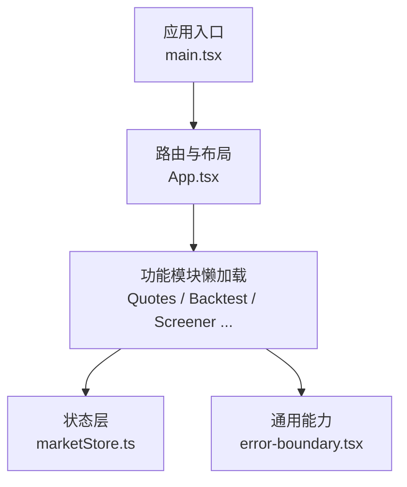
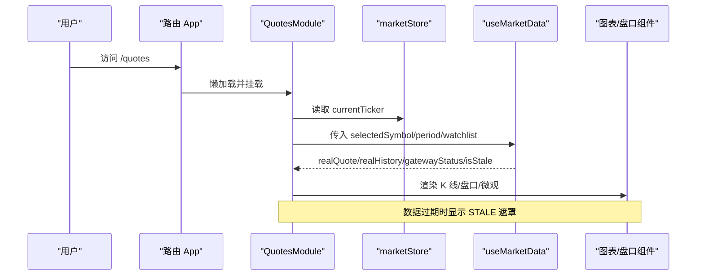
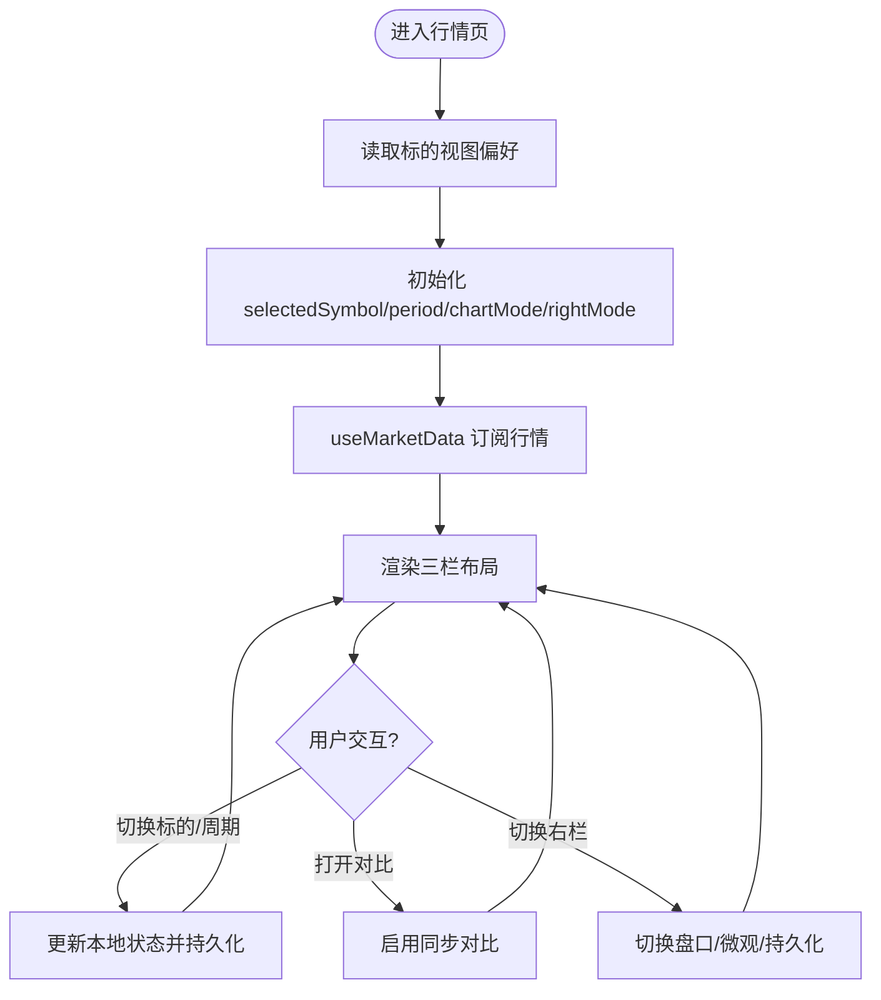
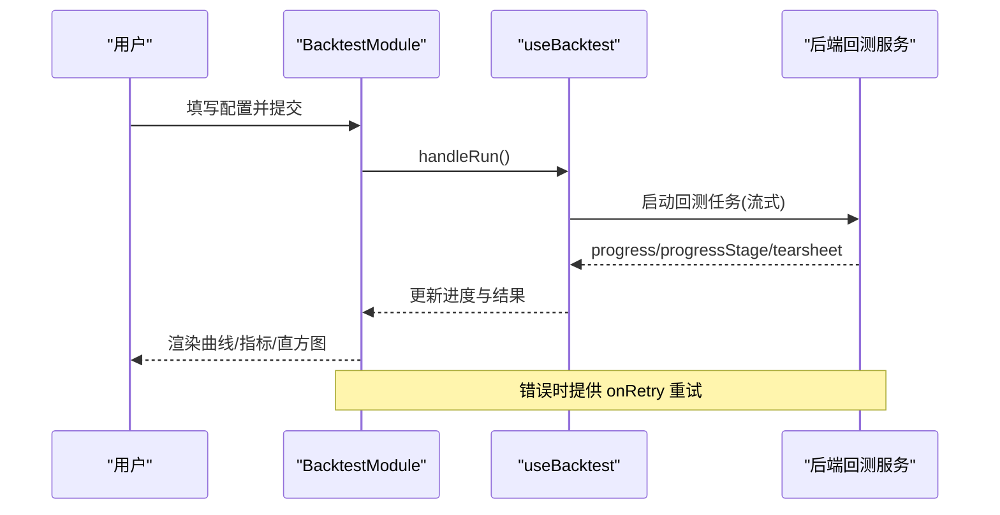
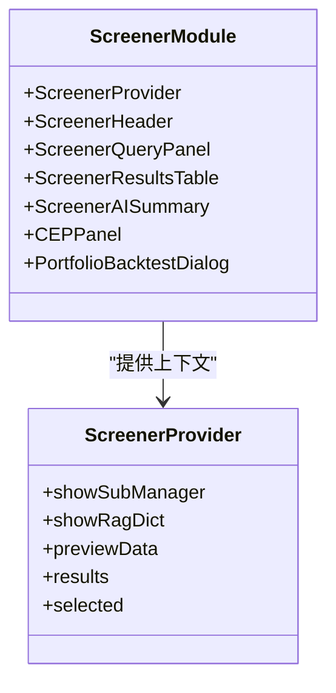
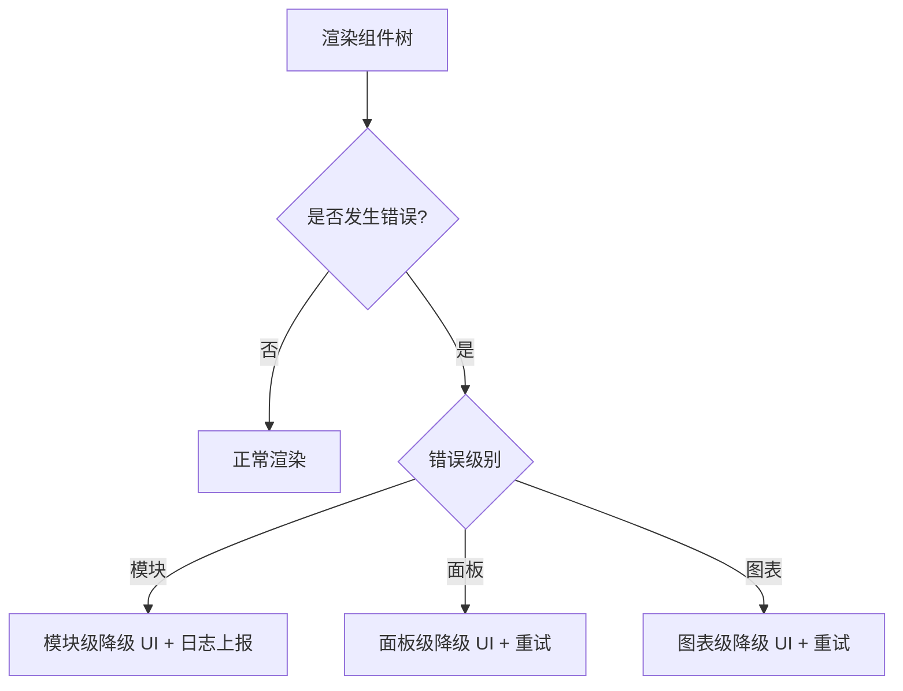
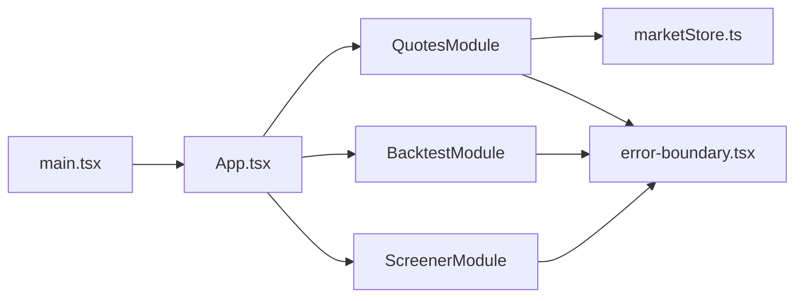

# 业务组件开发

<cite>
**本文引用的文件**
- [frontend/src/main.tsx](file://frontend/src/main.tsx)
- [frontend/src/App.tsx](file://frontend/src/App.tsx)
- [frontend/src/components/error-boundary.tsx](file://frontend/src/components/error-boundary.tsx)
- [frontend/src/stores/marketStore.ts](file://frontend/src/stores/marketStore.ts)
- [frontend/src/features/trading/quotes.tsx](file://frontend/src/features/trading/quotes.tsx)
- [frontend/src/features/trading/backtest.tsx](file://frontend/src/features/trading/backtest.tsx)
- [frontend/src/features/trading/screener.tsx](file://frontend/src/features/trading/screener.tsx)
</cite>

## 目录
1. [简介](#简介)
2. [项目结构](#项目结构)
3. [核心组件](#核心组件)
4. [架构总览](#架构总览)
5. [详细组件分析](#详细组件分析)
6. [依赖关系分析](#依赖关系分析)
7. [性能考量](#性能考量)
8. [故障排查指南](#故障排查指南)
9. [结论](#结论)
10. [附录](#附录)

## 简介
本规范面向 Quant Agent 前端业务组件的开发与治理，聚焦以下目标：
- 明确业务组件的职责边界、状态管理策略与数据流设计
- 定义复杂业务场景（行情面板、策略编辑器、回测结果展示）的组件架构模式
- 规范组件间通信机制（Context API、事件总线、状态同步方案）
- 制定测试策略（单元、集成、用户交互）与质量门禁
- 落地错误边界、加载态管理与性能优化实践案例

## 项目结构
前端采用“功能域 + 共享能力”的组织方式：
- 入口与路由：应用根容器、模块懒加载与错误隔离
- 功能模块：按 features 划分（如 trading、research、system），每个模块提供独立页面与子组件
- 状态层：Zustand stores 提供跨组件全局状态；局部 UI 状态由组件 state 管理
- 通用能力：错误边界、主题、国际化、UI 基础组件等

图表来源
- [frontend/src/main.tsx:1-41](file://frontend/src/main.tsx#L1-L41)
- [frontend/src/App.tsx:1-133](file://frontend/src/App.tsx#L1-L133)

章节来源
- [frontend/src/main.tsx:1-41](file://frontend/src/main.tsx#L1-L41)
- [frontend/src/App.tsx:1-133](file://frontend/src/App.tsx#L1-L133)

## 核心组件
- 应用根与路由
  - 职责：初始化全局上下文（主题、国际化、认证）、挂载路由、统一错误边界与懒加载保护
  - 关键点：模块级懒加载、Chunk 加载失败自动重试刷新、全局 Toast
- 错误边界
  - 职责：三级错误隔离（模块/面板/图表），统一降级 UI 与日志上报
  - 关键点：按级别差异化处理、可重置恢复
- 市场全局状态
  - 职责：维护当前标的、名称、类型，并提供设置/重置动作
  - 关键点：持久化到本地存储，供多模块共享
- 行情模块（QuotesModule）
  - 职责：三栏布局（自选列表、主图 K 线、盘口/微观），订阅实时数据，键盘快捷键，视图偏好持久化
  - 关键点：场景模式联动、对比模式、异常闪烁提示、空态与骨架屏
- 回测模块（BacktestModule）
  - 职责：配置表单、运行控制、结果可视化、进度与错误态
  - 关键点：与后端流式端点协作、可复现参数与徽章
- 筛选模块（ScreenerModule）
  - 职责：查询面板、结果表格、AI 摘要、CEP 异动、组合回测弹窗
  - 关键点：Provider 上下文聚合状态，模块化弹窗管理

章节来源
- [frontend/src/components/error-boundary.tsx:1-193](file://frontend/src/components/error-boundary.tsx#L1-L193)
- [frontend/src/stores/marketStore.ts:1-41](file://frontend/src/stores/marketStore.ts#L1-L41)
- [frontend/src/features/trading/quotes.tsx:1-483](file://frontend/src/features/trading/quotes.tsx#L1-L483)
- [frontend/src/features/trading/backtest.tsx:1-86](file://frontend/src/features/trading/backtest.tsx#L1-L86)
- [frontend/src/features/trading/screener.tsx:1-61](file://frontend/src/features/trading/screener.tsx#L1-L61)

## 架构总览
整体采用“路由懒加载 + 错误边界 + 状态分层”的架构：
- 路由层：App 通过懒加载将各功能模块拆分为独立 chunk，降低首屏体积
- 错误隔离：模块/面板/图表三级 Error Boundary 保证局部崩溃不影响全局
- 状态分层：
  - 全局状态：Zustand store（如 marketStore）用于跨模块共享
  - 局部状态：组件内 useState/useEffect 管理 UI 交互
  - 持久化：localStorage/sessionStorage 保存用户偏好与临时跳转参数
- 数据流：
  - 行情：useMarketData Hook 订阅 WebSocket，驱动图表与盘口
  - 回测：配置提交至后端流式接口，前端逐步渲染结果
  - 筛选：查询条件 -> 服务端计算 -> 表格/AI 摘要渲染

图表来源
- [frontend/src/App.tsx:47-66](file://frontend/src/App.tsx#L47-L66)
- [frontend/src/features/trading/quotes.tsx:110-154](file://frontend/src/features/trading/quotes.tsx#L110-L154)
- [frontend/src/stores/marketStore.ts:4-40](file://frontend/src/stores/marketStore.ts#L4-L40)

## 详细组件分析

### 行情面板（QuotesModule）
- 职责与布局
  - 左侧：自选列表（支持增删、排序、展开/收起）
  - 中间：K 线图或期权模式，支持同步对比
  - 右侧：盘口/微观/选择持久化三种模式
- 状态管理
  - 全局 ticker 来自 marketStore，本地维护 selectedSymbol、selectedPeriod、chartMode、rightMode
  - 视图偏好按 symbol 持久化到 localStorage，进入时自动恢复
  - 场景模式（watch/research/monitor）影响默认右栏模式
- 数据流
  - useMarketData 根据 watchlist 建立 WS 订阅，返回实时报价与历史数据
  - isStale 为真时显示数据延迟遮罩，保障用户体验
- 交互
  - 键盘快捷键：方向键切换标的、数字键切换周期、Alt+D/M/C/O 切换模式
  - 从 /market/:ticker 重定向并自动添加自选
- 错误与加载
  - 图表使用 ChartErrorBoundary 包裹，面板使用 PanelErrorBoundary 包裹
  - 初始化阶段显示骨架屏，避免白屏

图表来源
- [frontend/src/features/trading/quotes.tsx:33-102](file://frontend/src/features/trading/quotes.tsx#L33-L102)
- [frontend/src/features/trading/quotes.tsx:110-154](file://frontend/src/features/trading/quotes.tsx#L110-L154)
- [frontend/src/features/trading/quotes.tsx:156-225](file://frontend/src/features/trading/quotes.tsx#L156-L225)
- [frontend/src/features/trading/quotes.tsx:280-455](file://frontend/src/features/trading/quotes.tsx#L280-L455)

章节来源
- [frontend/src/features/trading/quotes.tsx:1-483](file://frontend/src/features/trading/quotes.tsx#L1-L483)

### 回测模块（BacktestModule）
- 职责
  - 配置表单：标的、周期、资金、数据源、调试模式、快照 ID、策略参数
  - 运行控制：开始/取消、进度与阶段展示
  - 结果展示：收益曲线、回撤、直方图、指标卡、可复现徽章
- 状态与数据流
  - 通过 useBacktest Hook 集中管理运行态、进度、结果与错误
  - 与后端流式端点交互，逐步推进进度并渲染阶段性结果
- 错误与加载
  - 初始化骨架屏，错误态提供重试按钮

图表来源
- [frontend/src/features/trading/backtest.tsx:12-83](file://frontend/src/features/trading/backtest.tsx#L12-L83)

章节来源
- [frontend/src/features/trading/backtest.tsx:1-86](file://frontend/src/features/trading/backtest.tsx#L1-L86)

### 筛选模块（ScreenerModule）
- 职责
  - 查询面板：构建筛选条件
  - 结果表格：展示筛选结果，支持多选
  - AI 摘要：对结果进行智能解读
  - CEP 异动：事件流监控面板
  - 组合回测：选中多只标的一键发起组合回测
- 状态与通信
  - 使用 ScreenerProvider 聚合状态（订阅管理、RAG 字典、预览数据、结果集、选中项）
  - 弹窗与模态框通过状态开关控制显隐
- 错误与加载
  - 表格与弹窗具备各自错误边界与空态处理

图表来源
- [frontend/src/features/trading/screener.tsx:14-60](file://frontend/src/features/trading/screener.tsx#L14-L60)

章节来源
- [frontend/src/features/trading/screener.tsx:1-61](file://frontend/src/features/trading/screener.tsx#L1-L61)

### 错误边界与加载态
- 三级错误边界
  - 模块级：包裹整个功能模块，崩溃后提供重新加载/刷新页面
  - 面板级：包裹具体面板，崩溃后提供重新加载
  - 图表级：包裹图表渲染器，崩溃后最小化显示并重试
- 加载态
  - 初始化阶段统一使用骨架屏，避免静默白屏
  - 数据延迟（STALE）遮罩提示，提升感知度

图表来源
- [frontend/src/components/error-boundary.tsx:25-80](file://frontend/src/components/error-boundary.tsx#L25-L80)
- [frontend/src/components/error-boundary.tsx:83-152](file://frontend/src/components/error-boundary.tsx#L83-L152)
- [frontend/src/components/error-boundary.tsx:154-193](file://frontend/src/components/error-boundary.tsx#L154-L193)

章节来源
- [frontend/src/components/error-boundary.tsx:1-193](file://frontend/src/components/error-boundary.tsx#L1-L193)

## 依赖关系分析
- 入口依赖
  - main.tsx 初始化 WebVitals、主题、国际化、认证，并挂载 App
  - App.tsx 定义路由与懒加载，统一错误边界与确认对话框上下文
- 模块依赖
  - QuotesModule 依赖 marketStore、useWatchlist、useMarketData、各类图表与盘口组件
  - BacktestModule 依赖 useBacktest Hook 与结果渲染组件
  - ScreenerModule 依赖 ScreenerProvider 与子面板/弹窗
- 状态依赖
  - marketStore 提供全局 ticker，被多个模块消费
  - 本地存储用于视图偏好与临时跳转参数

图表来源
- [frontend/src/main.tsx:1-41](file://frontend/src/main.tsx#L1-L41)
- [frontend/src/App.tsx:1-133](file://frontend/src/App.tsx#L1-L133)
- [frontend/src/stores/marketStore.ts:1-41](file://frontend/src/stores/marketStore.ts#L1-L41)
- [frontend/src/components/error-boundary.tsx:1-193](file://frontend/src/components/error-boundary.tsx#L1-L193)

章节来源
- [frontend/src/main.tsx:1-41](file://frontend/src/main.tsx#L1-L41)
- [frontend/src/App.tsx:1-133](file://frontend/src/App.tsx#L1-L133)
- [frontend/src/stores/marketStore.ts:1-41](file://frontend/src/stores/marketStore.ts#L1-L41)
- [frontend/src/components/error-boundary.tsx:1-193](file://frontend/src/components/error-boundary.tsx#L1-L193)

## 性能考量
- 懒加载与 Chunk 容错
  - 模块级懒加载减少首屏体积；ChunkLoadError 自动重试刷新，防止白屏
- 渲染优化
  - 图表与面板使用错误边界隔离，避免大面积重渲染
  - 行情页在数据延迟时显示遮罩，降低无效交互
- 状态持久化
  - 视图偏好与全局 ticker 持久化，减少重复初始化成本
- 建议
  - 对高频更新的数据（如 tick）进行节流/采样
  - 大图表按需渲染与虚拟滚动
  - 使用 memo/useMemo/useCallback 优化重渲染

[本节为通用指导，不直接分析具体文件]

## 故障排查指南
- 模块崩溃
  - 检查 ModuleErrorBoundary 捕获的错误日志与堆栈
  - 尝试“重新加载模块”或“刷新页面”
- 面板/图表异常
  - 使用 PanelErrorBoundary/ChartErrorBoundary 的重试按钮恢复
  - 关注网络状态与数据源健康（行情页 STALE 遮罩）
- 数据连接问题
  - 检查 WebSocket 订阅与网关状态
  - 核对标的是否在自选列表中，确保订阅建立
- 回测执行失败
  - 查看错误态提示，点击重试；检查配置与数据源可用性

章节来源
- [frontend/src/components/error-boundary.tsx:25-80](file://frontend/src/components/error-boundary.tsx#L25-L80)
- [frontend/src/features/trading/quotes.tsx:280-288](file://frontend/src/features/trading/quotes.tsx#L280-L288)
- [frontend/src/features/trading/backtest.tsx:66-83](file://frontend/src/features/trading/backtest.tsx#L66-L83)

## 结论
本规范以“职责清晰、状态分层、错误隔离、体验优先”为核心原则，结合行情面板、回测与筛选三大核心模块的实践，形成可复用的业务组件开发范式。通过统一的错误边界、加载态与性能优化策略，保障复杂金融场景下的稳定性与可维护性。后续可在更多业务模块中推广该模式，并结合自动化测试与可观测性完善质量闭环。

## 附录
- 组件职责清单
  - 行情面板：三栏布局、实时数据、键盘快捷键、视图偏好
  - 回测模块：配置/运行/结果/错误态
  - 筛选模块：查询/结果/AI/CEP/组合回测
- 状态管理要点
  - 全局：Zustand store（marketStore）
  - 局部：useState/useEffect
  - 持久化：localStorage/sessionStorage
- 通信机制
  - Context API：ScreenerProvider 等
  - 事件总线：WebSocket 消息驱动（行情/回测进度）
  - 状态同步：URL/SessionStorage 与 Store 联动

[本节为概念性总结，不直接分析具体文件]
