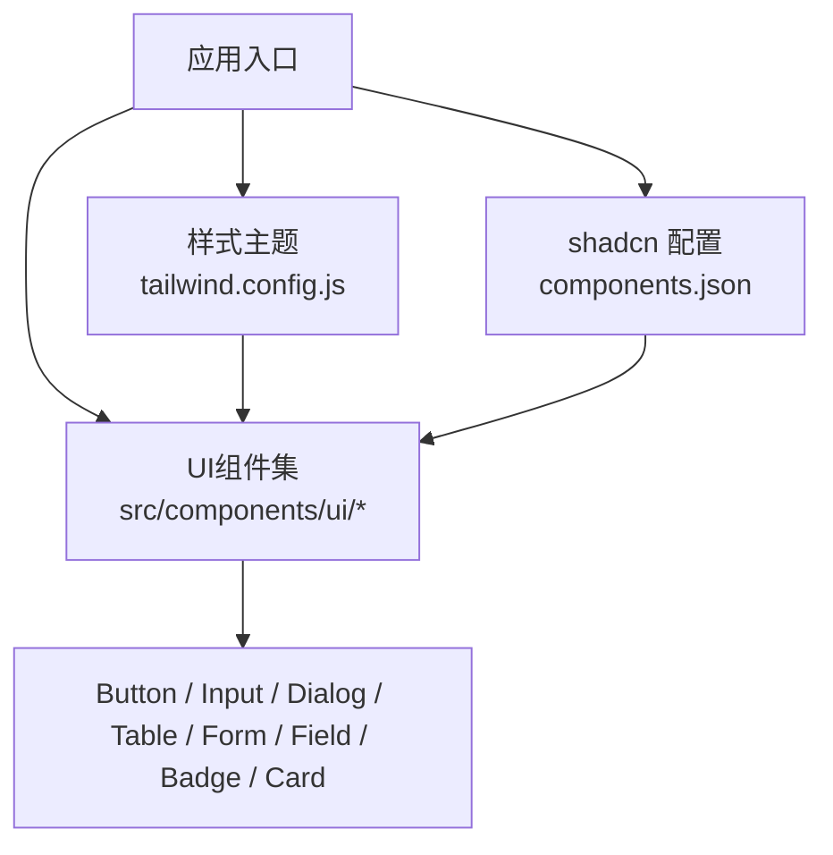
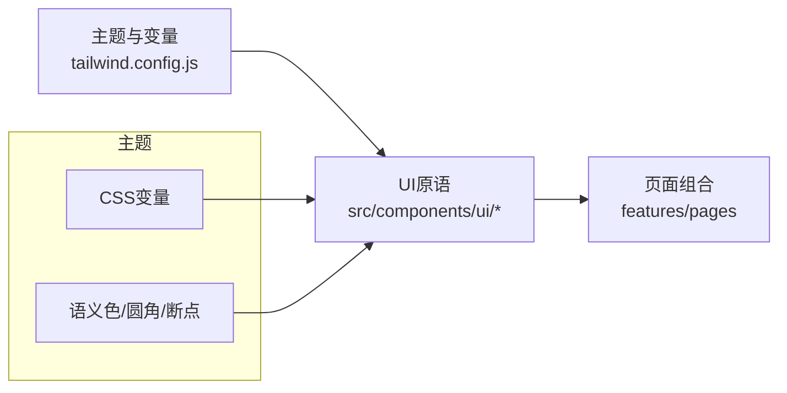
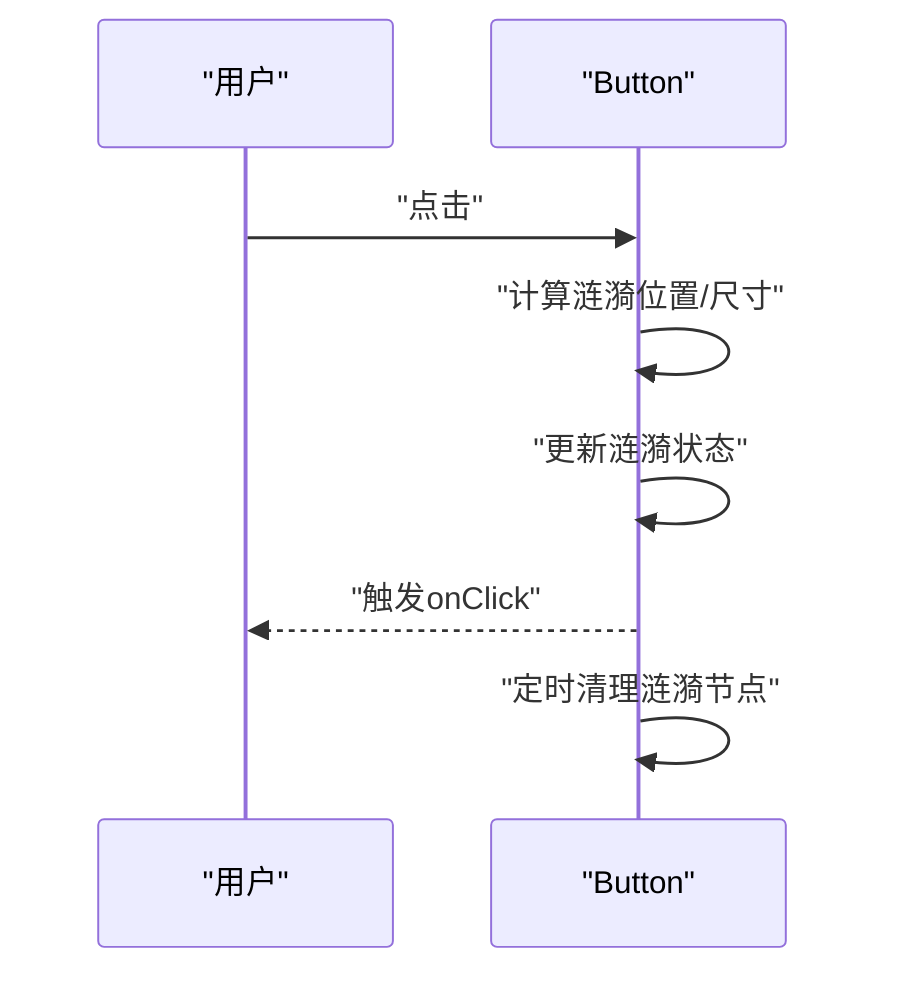
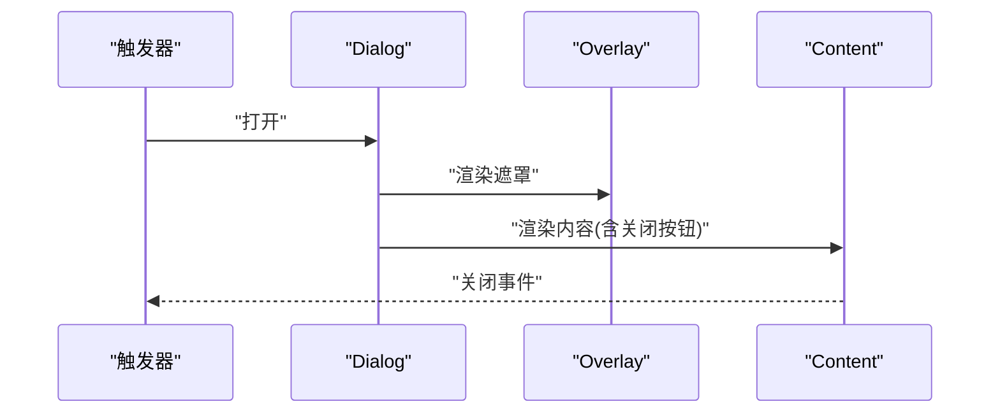
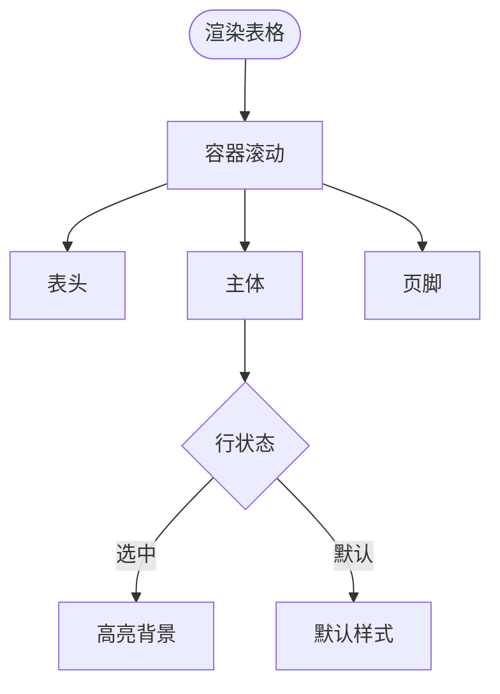
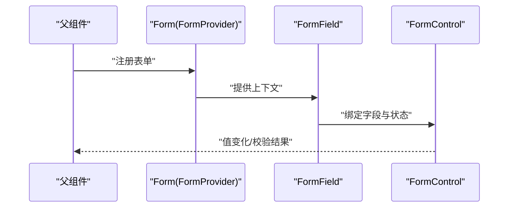
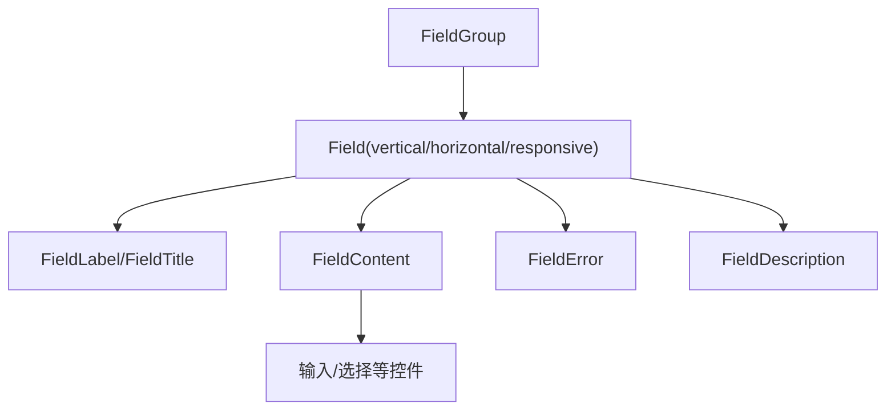
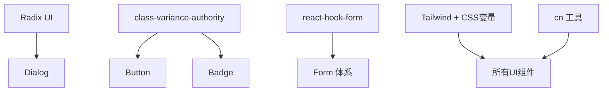

# 基础UI组件

<cite>
**本文引用的文件**
- [components.json](file://frontend/components.json)
- [tailwind.config.js](file://frontend/tailwind.config.js)
- [button.tsx](file://frontend/src/components/ui/button.tsx)
- [input.tsx](file://frontend/src/components/ui/input.tsx)
- [dialog.tsx](file://frontend/src/components/ui/dialog.tsx)
- [table.tsx](file://frontend/src/components/ui/table.tsx)
- [form.tsx](file://frontend/src/components/ui/form.tsx)
- [field.tsx](file://frontend/src/components/ui/field.tsx)
- [badge.tsx](file://frontend/src/components/ui/badge.tsx)
- [card.tsx](file://frontend/src/components/ui/card.tsx)
</cite>

## 目录
1. [简介](#简介)
2. [项目结构](#项目结构)
3. [核心组件](#核心组件)
4. [架构总览](#架构总览)
5. [详细组件分析](#详细组件分析)
6. [依赖关系分析](#依赖关系分析)
7. [性能考量](#性能考量)
8. [故障排查指南](#故障排查指南)
9. [结论](#结论)
10. [附录](#附录)

## 简介
本规范面向Quant Agent前端工程，统一基于shadcn/ui的组件库使用方式，覆盖按钮、输入框、对话框、表格等基础组件的正确用法；明确Props接口设计、事件处理机制与状态管理模式；说明如何自定义样式（Tailwind CSS类、CSS变量集成、主题适配）；提供组件复用最佳实践（组合模式、高阶组件、Hooks封装），并给出可访问性支持、响应式设计实现与性能优化技巧的具体示例与代码片段路径。

## 项目结构
- 组件位于 frontend/src/components/ui，遵循shadcn/ui的“原子化+组合”组织方式，每个UI原语独立成文件，便于按需引入与定制。
- 通过 components.json 配置shadcn/cli的别名、样式风格与图标库，确保全局一致性与可维护性。
- Tailwind配置集中管理主题色、圆角、断点与过渡时长，所有组件通过CSS变量接入主题系统，支持明暗主题与场景强调色。

图表来源
- [components.json:1-22](file://frontend/components.json#L1-L22)
- [tailwind.config.js:1-78](file://frontend/tailwind.config.js#L1-L78)

章节来源
- [components.json:1-22](file://frontend/components.json#L1-L22)
- [tailwind.config.js:1-78](file://frontend/tailwind.config.js#L1-L78)

## 核心组件
- 按钮 Button：基于class-variance-authority定义变体与尺寸，支持asChild透传、涟漪动效开关、无障碍焦点环与错误态边框。
- 输入框 Input：统一的边框、占位符、禁用态、焦点环与aria-invalid错误态样式。
- 对话框 Dialog：基于Radix Dialog，包含Overlay、Content、Header/Footer、Title/Description及关闭按钮，具备入场动画与可访问性标记。
- 表格 Table：容器滚动、表头/主体/页脚、行高亮选中态、列对齐与复选框兼容。
- 表单 Form：基于react-hook-form，提供FormProvider、FormField、FormItem、FormLabel、FormControl、FormDescription、FormMessage，自动关联ID与ARIA属性。
- 字段 Field：FieldSet/Group/Label/Description/Error等组合，支持垂直/水平/响应式布局与容器查询。
- 徽章 Badge：基于变体系统的轻量标签。
- 卡片 Card：Card/Header/Title/Description/Action/Content/Footer组合，用于信息分组展示。

章节来源
- [button.tsx:1-109](file://frontend/src/components/ui/button.tsx#L1-L109)
- [input.tsx:1-22](file://frontend/src/components/ui/input.tsx#L1-L22)
- [dialog.tsx:1-144](file://frontend/src/components/ui/dialog.tsx#L1-L144)
- [table.tsx:1-117](file://frontend/src/components/ui/table.tsx#L1-L117)
- [form.tsx:1-168](file://frontend/src/components/ui/form.tsx#L1-L168)
- [field.tsx:1-245](file://frontend/src/components/ui/field.tsx#L1-L245)
- [badge.tsx:1-27](file://frontend/src/components/ui/badge.tsx#L1-L27)
- [card.tsx:1-93](file://frontend/src/components/ui/card.tsx#L1-L93)

## 架构总览
- 主题层：CSS变量由Tailwind映射到语义化颜色与圆角，组件通过hsl(var(...))引用，天然支持明暗切换与场景强调色。
- 组件层：各UI原语以函数组件形式暴露，内部仅关注样式与最小交互，复杂逻辑下沉至业务或Hook。
- 组合层：页面通过组合多个原语构建业务界面，如表单由Form+Field+Input构成，数据面板由Table+Badge+Card构成。

图表来源
- [tailwind.config.js:1-78](file://frontend/tailwind.config.js#L1-L78)

## 详细组件分析

### 按钮 Button
- Props接口
  - variant：default/secondary/outline/ghost/link/destructive
  - size：default/sm/lg/icon/icon-sm/icon-lg
  - asChild：是否将渲染目标替换为子元素（如Link）
  - disableRipple：是否禁用点击涟漪效果
  - onClick：点击回调
  - className：附加样式
- 事件处理
  - 点击时计算涟漪坐标与尺寸，延迟清理DOM节点，避免内存泄漏
  - 透传原生事件与属性给底层元素
- 状态管理
  - 涟漪数组由本地state维护，生命周期短，不影响外部状态
- 可访问性
  - 聚焦可见环、aria-invalid错误态边框与提示
- 样式与主题
  - 通过cva生成变体，颜色来自CSS变量，支持dark模式
- 性能
  - 涟漪动画使用CSS keyframes，避免重排；及时移除节点

图表来源
- [button.tsx:55-72](file://frontend/src/components/ui/button.tsx#L55-L72)
- [button.tsx:74-104](file://frontend/src/components/ui/button.tsx#L74-L104)

章节来源
- [button.tsx:1-109](file://frontend/src/components/ui/button.tsx#L1-L109)

### 输入框 Input
- Props接口
  - type、className与原生input属性透传
- 事件处理
  - 无额外事件，保持轻量
- 状态管理
  - 无内部状态，适合受控与非受控两种用法
- 可访问性
  - aria-invalid错误态样式，focus-visible环
- 样式与主题
  - 统一边框、背景、占位符与禁用态，适配dark模式

章节来源
- [input.tsx:1-22](file://frontend/src/components/ui/input.tsx#L1-L22)

### 对话框 Dialog
- 组件拆分
  - Dialog/Trigger/Portal/Close/Overlay/Content/Header/Footer/Title/Description
- 事件处理
  - 由Radix管理打开/关闭、Esc关闭、焦点陷阱等
- 状态管理
  - 受控/非受控均可，建议由父组件控制open状态
- 可访问性
  - 屏幕阅读器隐藏关闭文案，正确设置role与焦点顺序
- 样式与主题
  - 遮罩透明度、居中定位、缩放与淡入淡出动画

图表来源
- [dialog.tsx:9-13](file://frontend/src/components/ui/dialog.tsx#L9-L13)
- [dialog.tsx:33-80](file://frontend/src/components/ui/dialog.tsx#L33-L80)

章节来源
- [dialog.tsx:1-144](file://frontend/src/components/ui/dialog.tsx#L1-L144)

### 表格 Table
- 组件拆分
  - Table/TableHeader/TableBody/TableFooter/TableRow/TableHead/TableCell/TableCaption
- 事件处理
  - 无内置事件，支持行选择态样式(data-[state=selected])
- 状态管理
  - 选中态由上层管理，通过data-state或className控制
- 可访问性
  - 语义化表格结构，标题与描述分离
- 样式与主题
  - 横向滚动容器、悬停高亮、底部边框与对齐

图表来源
- [table.tsx:7-19](file://frontend/src/components/ui/table.tsx#L7-L19)
- [table.tsx:55-66](file://frontend/src/components/ui/table.tsx#L55-L66)

章节来源
- [table.tsx:1-117](file://frontend/src/components/ui/table.tsx#L1-L117)

### 表单 Form
- 组件拆分
  - Form(FormProvider)/FormField/FormItem/FormLabel/FormControl/FormDescription/FormMessage
- 事件处理
  - 提交与校验由react-hook-form驱动，组件仅负责绑定与呈现
- 状态管理
  - 通过useFormContext获取字段状态，自动关联id与aria-describedby
- 可访问性
  - label与控件关联，错误消息与描述通过id连接
- 样式与主题
  - 错误态文字与边框颜色、间距与排版统一

图表来源
- [form.tsx:19-43](file://frontend/src/components/ui/form.tsx#L19-L43)
- [form.tsx:76-123](file://frontend/src/components/ui/form.tsx#L76-L123)

章节来源
- [form.tsx:1-168](file://frontend/src/components/ui/form.tsx#L1-L168)

### 字段 Field
- 组件拆分
  - FieldSet/FieldLegend/FieldGroup/Field/FieldContent/FieldLabel/FieldTitle/FieldDescription/FieldSeparator/FieldError
- 事件处理
  - 无内置事件，专注布局与可读性
- 状态管理
  - 通过data-orientation与容器查询实现响应式布局
- 可访问性
  - role="group"、错误区域role="alert"
- 样式与主题
  - 垂直/水平/响应式三种方向，支持容器查询@container

图表来源
- [field.tsx:44-95](file://frontend/src/components/ui/field.tsx#L44-L95)
- [field.tsx:186-231](file://frontend/src/components/ui/field.tsx#L186-L231)

章节来源
- [field.tsx:1-245](file://frontend/src/components/ui/field.tsx#L1-L245)

### 徽章 Badge 与 卡片 Card
- Badge
  - 基于变体系统，轻量标签，常用于状态、计数、分类
- Card
  - 信息块容器，Header/Title/Description/Action/Content/Footer组合，适合指标卡、摘要、操作区

章节来源
- [badge.tsx:1-27](file://frontend/src/components/ui/badge.tsx#L1-L27)
- [card.tsx:1-93](file://frontend/src/components/ui/card.tsx#L1-L93)

## 依赖关系分析
- shadcn/ui与Radix：Dialog等高级交互依赖Radix，保证可访问性与行为一致性
- class-variance-authority：Button/Badge等通过cva管理变体，减少重复样式
- react-hook-form：Form体系的核心，提供表单状态与校验
- Tailwind CSS：主题与样式引擎，通过CSS变量与语义化类名统一外观
- 工具函数：cn用于类名合并，提升组合灵活性

图表来源
- [dialog.tsx:1-10](file://frontend/src/components/ui/dialog.tsx#L1-L10)
- [button.tsx:1-8](file://frontend/src/components/ui/button.tsx#L1-L8)
- [form.tsx:1-18](file://frontend/src/components/ui/form.tsx#L1-L18)
- [tailwind.config.js:1-78](file://frontend/tailwind.config.js#L1-L78)

章节来源
- [dialog.tsx:1-10](file://frontend/src/components/ui/dialog.tsx#L1-L10)
- [button.tsx:1-8](file://frontend/src/components/ui/button.tsx#L1-L8)
- [form.tsx:1-18](file://frontend/src/components/ui/form.tsx#L1-L18)
- [tailwind.config.js:1-78](file://frontend/tailwind.config.js#L1-L78)

## 性能考量
- 避免不必要的重绘：Button涟漪在动画结束后立即移除节点，防止DOM膨胀
- 合理使用受控/非受控：Input等基础控件尽量非受控，复杂表单再使用受控
- 列表与表格：大数据量建议使用虚拟滚动（结合现有virtual-list能力）
- 样式计算：优先使用Tailwind原子类与cva变体，减少运行时样式计算
- 主题切换：通过CSS变量切换，避免整树重渲染

[本节为通用指导，不直接分析具体文件]

## 故障排查指南
- 表单校验不生效
  - 检查是否包裹在Form(FormProvider)内，FormField是否正确传入name
  - 确认FormControl已正确渲染并绑定id与aria属性
  - 参考：[form.tsx:19-43](file://frontend/src/components/ui/form.tsx#L19-L43)、[form.tsx:76-123](file://frontend/src/components/ui/form.tsx#L76-L123)
- 对话框无法关闭或焦点异常
  - 确认使用DialogPrimitive.Close，并确保焦点陷阱正常工作
  - 参考：[dialog.tsx:27-31](file://frontend/src/components/ui/dialog.tsx#L27-L31)、[dialog.tsx:69-77](file://frontend/src/components/ui/dialog.tsx#L69-L77)
- 按钮点击无反馈
  - 检查disableRipple与asChild组合是否导致事件冒泡被拦截
  - 参考：[button.tsx:44-72](file://frontend/src/components/ui/button.tsx#L44-L72)
- 表格选中态不显示
  - 确保行上存在data-[state=selected]或对应className
  - 参考：[table.tsx:55-66](file://frontend/src/components/ui/table.tsx#L55-L66)
- 主题未生效
  - 检查tailwind.config.js中colors与borderRadius是否使用CSS变量
  - 参考：[tailwind.config.js:21-68](file://frontend/tailwind.config.js#L21-L68)

章节来源
- [form.tsx:19-43](file://frontend/src/components/ui/form.tsx#L19-L43)
- [form.tsx:76-123](file://frontend/src/components/ui/form.tsx#L76-L123)
- [dialog.tsx:27-31](file://frontend/src/components/ui/dialog.tsx#L27-L31)
- [dialog.tsx:69-77](file://frontend/src/components/ui/dialog.tsx#L69-L77)
- [button.tsx:44-72](file://frontend/src/components/ui/button.tsx#L44-L72)
- [table.tsx:55-66](file://frontend/src/components/ui/table.tsx#L55-L66)
- [tailwind.config.js:21-68](file://frontend/tailwind.config.js#L21-L68)

## 结论
本项目基于shadcn/ui构建了统一、可访问、可主题化的基础UI组件库。通过Tailwind CSS变量与cva变体，实现了高度一致的视觉语言与灵活的扩展能力。建议在业务开发中坚持“组合优于继承”的原则，优先使用现有原语组合新组件，并通过Hook封装复杂状态与交互，保持组件职责单一、可测试与可维护。

[本节为总结，不直接分析具体文件]

## 附录

### 主题与样式规范
- 颜色与圆角：通过CSS变量映射语义化颜色与圆角，新增场景强调色用于关键UI
- 断点：产品分辨率档位从sm到ultrawide，配合容器查询实现细粒度响应式
- 过渡：fast/base/slow三档过渡时长，统一交互节奏

章节来源
- [tailwind.config.js:8-20](file://frontend/tailwind.config.js#L8-L20)
- [tailwind.config.js:21-68](file://frontend/tailwind.config.js#L21-L68)
- [tailwind.config.js:69-73](file://frontend/tailwind.config.js#L69-L73)

### 可访问性清单
- 按钮/输入：焦点可见环、aria-invalid错误态
- 对话框：关闭按钮sr-only文本、焦点陷阱
- 表单：label与控件关联、描述与错误消息通过id连接
- 字段：错误区域role="alert"

章节来源
- [button.tsx:8-8](file://frontend/src/components/ui/button.tsx#L8-L8)
- [input.tsx:11-13](file://frontend/src/components/ui/input.tsx#L11-L13)
- [dialog.tsx:69-77](file://frontend/src/components/ui/dialog.tsx#L69-L77)
- [form.tsx:90-123](file://frontend/src/components/ui/form.tsx#L90-L123)
- [field.tsx:186-231](file://frontend/src/components/ui/field.tsx#L186-L231)

### 组件复用最佳实践
- 组合模式：用Card+Badge+Table组合数据面板；用Form+Field+Input组合复杂表单
- 高阶组件：通过asChild将Button包装为路由链接或自定义交互
- Hooks封装：将表单校验、字段联动、远程搜索等逻辑抽离为自定义Hook，组件只负责渲染

[本节为通用指导，不直接分析具体文件]