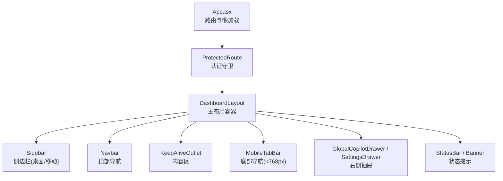
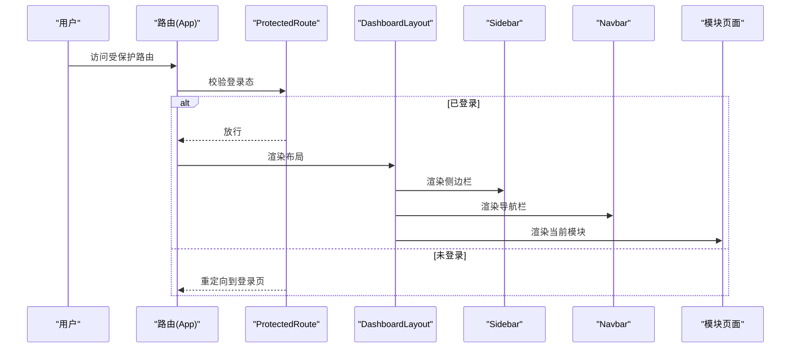
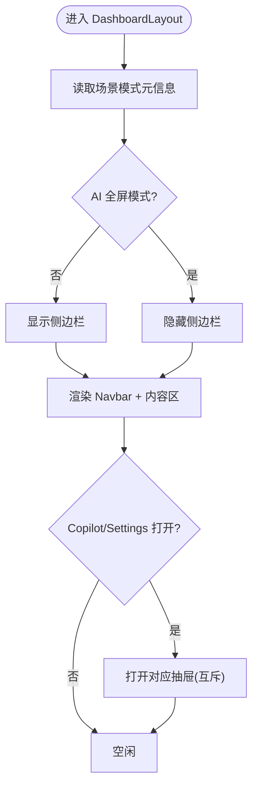
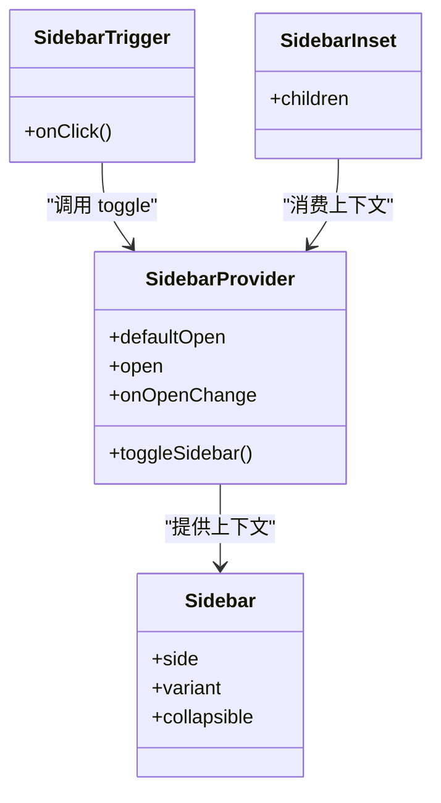
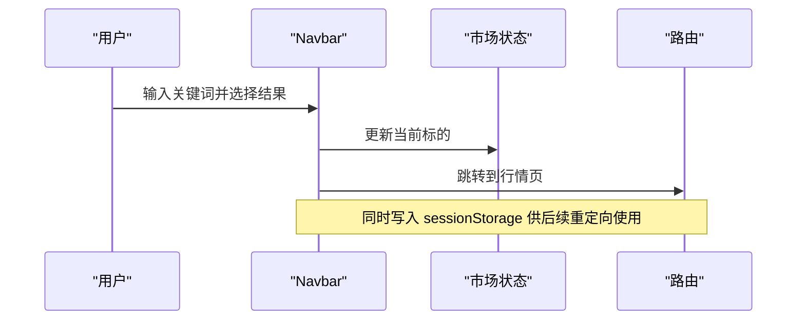
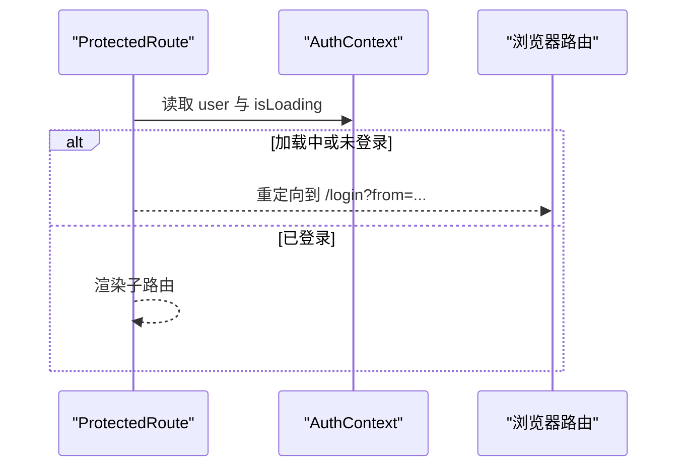
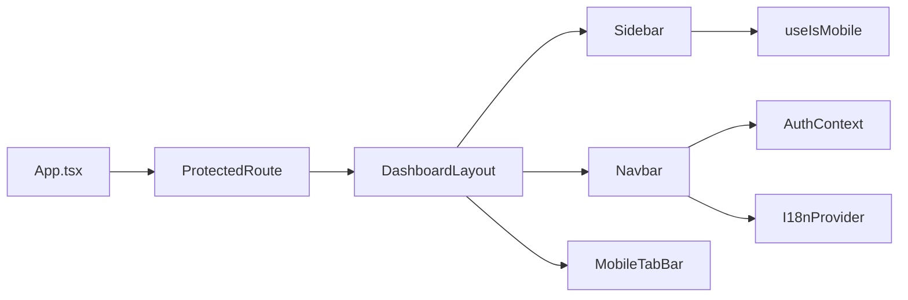

# 布局组件规范

<cite>
**本文引用的文件**
- [App.tsx](file://frontend/src/App.tsx)
- [dashboard-layout.tsx](file://frontend/src/components/layout/dashboard-layout.tsx)
- [navbar.tsx](file://frontend/src/components/layout/navbar.tsx)
- [sidebar.tsx](file://frontend/src/components/ui/sidebar.tsx)
- [mobile-tab-bar.tsx](file://frontend/src/components/layout/mobile-tab-bar.tsx)
- [protected-route.tsx](file://frontend/src/components/layout/protected-route.tsx)
- [useLayoutStore.ts](file://frontend/src/stores/useLayoutStore.ts)
- [auth-context.tsx](file://frontend/src/contexts/auth-context.tsx)
- [i18n.tsx](file://frontend/src/contexts/i18n.tsx)
- [use-mobile.ts](file://frontend/src/hooks/use-mobile.ts)
</cite>

## 目录
1. [简介](#简介)
2. [项目结构](#项目结构)
3. [核心组件](#核心组件)
4. [架构总览](#架构总览)
5. [详细组件分析](#详细组件分析)
6. [依赖关系分析](#依赖关系分析)
7. [性能与优化](#性能与优化)
8. [故障排查指南](#故障排查指南)
9. [结论](#结论)
10. [附录](#附录)

## 简介
本规范面向 Quant Agent 前端应用级布局组件的设计与实现，覆盖 DashboardLayout、导航栏、侧边栏、移动端底部导航等核心布局结构；阐述响应式布局方案（移动端适配、桌面端优化、断点策略）；说明布局状态管理（路由守卫、权限控制、会话保持）；提供最佳实践（性能优化、内存管理、渲染效率提升）；并给出主题切换、国际化支持、多语言布局适配的具体实现要点。

## 项目结构
- 应用入口与路由：通过 App 定义受保护路由与模块懒加载，统一挂载 DashboardLayout。
- 布局容器：DashboardLayout 组合 Sidebar、Navbar、内容区、全局抽屉与状态条。
- 侧边栏：基于可复用 UI 的 Sidebar 组件，提供折叠、移动端 Sheet 模式、快捷键切换等能力。
- 导航栏：集成搜索、跑马灯、系统指标、场景/交易模式切换、语言与主题切换、用户菜单与告警角标。
- 移动端：小于 768px 时以 MobileTabBar 替代左侧侧边栏，提供场景模式切换入口。
- 路由守卫：ProtectedRoute 负责认证检查与跳转，AuthContext 负责登录态与 Token 保活。
- 国际化：I18nProvider 提供语言切换与本地化文本解析。

图表来源
- [App.tsx:90-124](file://frontend/src/App.tsx#L90-L124)
- [dashboard-layout.tsx:131-276](file://frontend/src/components/layout/dashboard-layout.tsx#L131-L276)
- [sidebar.tsx:56-151](file://frontend/src/components/ui/sidebar.tsx#L56-L151)
- [navbar.tsx:134-332](file://frontend/src/components/layout/navbar.tsx#L134-L332)
- [mobile-tab-bar.tsx:22-146](file://frontend/src/components/layout/mobile-tab-bar.tsx#L22-L146)

章节来源
- [App.tsx:90-124](file://frontend/src/App.tsx#L90-L124)
- [dashboard-layout.tsx:131-276](file://frontend/src/components/layout/dashboard-layout.tsx#L131-L276)

## 核心组件
- DashboardLayout：应用级布局容器，组织侧边栏、导航栏、内容区、全局抽屉与状态条；根据场景模式控制侧边栏显隐与 AI 全屏模式；维护 Copilot/Settings 抽屉互斥状态。
- Navbar：顶部导航，集成全局搜索、资产跑马灯、系统资源监控、场景/交易模式切换、语言与主题切换、用户菜单与告警角标。
- Sidebar：可折叠侧边栏，桌面端固定宽度，移动端以 Sheet 弹出；支持键盘快捷键、Cookie 持久化折叠状态。
- MobileTabBar：移动端底部导航，提供常用页面快捷入口与场景模式切换。
- ProtectedRoute：路由守卫，未登录时重定向到登录页并显示骨架屏。
- AuthContext：登录/登出、Token 保活、鉴权回调处理。
- I18nProvider：语言包管理与本地化函数。

章节来源
- [dashboard-layout.tsx:131-276](file://frontend/src/components/layout/dashboard-layout.tsx#L131-L276)
- [navbar.tsx:134-332](file://frontend/src/components/layout/navbar.tsx#L134-L332)
- [sidebar.tsx:56-151](file://frontend/src/components/ui/sidebar.tsx#L56-L151)
- [mobile-tab-bar.tsx:22-146](file://frontend/src/components/layout/mobile-tab-bar.tsx#L22-L146)
- [protected-route.tsx:7-62](file://frontend/src/components/layout/protected-route.tsx#L7-L62)
- [auth-context.tsx:21-105](file://frontend/src/contexts/auth-context.tsx#L21-L105)
- [i18n.tsx:48-95](file://frontend/src/contexts/i18n.tsx#L48-L95)

## 架构总览
布局采用“容器 + 区域”的分层设计：
- 顶层 App 负责路由与模块懒加载，将业务模块包裹在受保护路由与布局容器中。
- DashboardLayout 作为布局容器，协调侧边栏、导航栏、内容区与全局抽屉。
- 侧边栏与导航栏为独立可复用组件，通过 Zustand store 与 Context 共享状态。
- 移动端通过断点切换为底部 Tab 导航，保证交互一致性。

图表来源
- [App.tsx:90-124](file://frontend/src/App.tsx#L90-L124)
- [protected-route.tsx:7-62](file://frontend/src/components/layout/protected-route.tsx#L7-L62)
- [dashboard-layout.tsx:131-276](file://frontend/src/components/layout/dashboard-layout.tsx#L131-L276)

## 详细组件分析

### DashboardLayout 布局容器
- 职责：组合 Sidebar、Navbar、内容区、全局抽屉与状态条；根据场景模式控制侧边栏显隐与 AI 全屏模式；维护 Copilot/Settings 抽屉互斥状态。
- 关键行为：
  - 监听场景模式，自动展开或关闭 AI 副驾抽屉，或在 AI 全屏模式下隐藏侧边栏。
  - 动态计算 OMS 徽章计数，避免硬编码。
  - 使用 KeepAliveOutlet 缓存页面实例，提升返回体验。
  - 移动端隐藏侧边栏并由 MobileTabBar 接管导航。

图表来源
- [dashboard-layout.tsx:114-149](file://frontend/src/components/layout/dashboard-layout.tsx#L114-L149)
- [dashboard-layout.tsx:151-276](file://frontend/src/components/layout/dashboard-layout.tsx#L151-L276)
- [useLayoutStore.ts:19-46](file://frontend/src/stores/useLayoutStore.ts#L19-L46)

章节来源
- [dashboard-layout.tsx:114-149](file://frontend/src/components/layout/dashboard-layout.tsx#L114-L149)
- [dashboard-layout.tsx:151-276](file://frontend/src/components/layout/dashboard-layout.tsx#L151-L276)
- [useLayoutStore.ts:19-46](file://frontend/src/stores/useLayoutStore.ts#L19-L46)

### 侧边栏 Sidebar
- 职责：提供分组导航、折叠/展开、移动端 Sheet 模式、快捷键切换、Cookie 持久化折叠状态。
- 关键点：
  - 桌面端固定宽度，支持 offcanvas/icon 折叠模式。
  - 移动端通过 Sheet 弹出，避免遮挡内容。
  - 提供 SidebarTrigger 按钮与键盘快捷键（Ctrl/Cmd+B）。
  - 使用 CSS 变量与 data-* 属性驱动样式与动画。

图表来源
- [sidebar.tsx:56-151](file://frontend/src/components/ui/sidebar.tsx#L56-L151)
- [sidebar.tsx:154-253](file://frontend/src/components/ui/sidebar.tsx#L154-L253)
- [sidebar.tsx:256-319](file://frontend/src/components/ui/sidebar.tsx#L256-L319)

章节来源
- [sidebar.tsx:56-151](file://frontend/src/components/ui/sidebar.tsx#L56-L151)
- [sidebar.tsx:154-253](file://frontend/src/components/ui/sidebar.tsx#L154-L253)
- [sidebar.tsx:256-319](file://frontend/src/components/ui/sidebar.tsx#L256-L319)

### 导航栏 Navbar
- 职责：聚合全局搜索、资产跑马灯、系统资源监控、场景/交易模式切换、语言与主题切换、用户菜单与告警角标。
- 关键点：
  - 搜索选中后同步市场状态并跳转到行情页。
  - 资产跑马灯定时拉取数据，首尾拼接实现无缝滚动。
  - 系统资源监控为模拟数据，便于替换真实 API。
  - 语言切换写入 localStorage，主题切换使用 next-themes。
  - 用户菜单下拉卡片包含个人中心、账单、通知、设置与退出登录。

图表来源
- [navbar.tsx:161-173](file://frontend/src/components/layout/navbar.tsx#L161-L173)
- [navbar.tsx:175-332](file://frontend/src/components/layout/navbar.tsx#L175-L332)

章节来源
- [navbar.tsx:161-173](file://frontend/src/components/layout/navbar.tsx#L161-L173)
- [navbar.tsx:175-332](file://frontend/src/components/layout/navbar.tsx#L175-L332)

### 移动端底部导航 MobileTabBar
- 职责：在 <768px 下提供底部 Tab 导航与场景模式切换入口。
- 关键点：
  - 高亮当前路径前缀匹配的 Tab。
  - 场景模式弹窗提供快速切换，结合 SCENE_META 展示图标与提示。
  - 安全区域适配（safe-area-inset-bottom）。

章节来源
- [mobile-tab-bar.tsx:22-146](file://frontend/src/components/layout/mobile-tab-bar.tsx#L22-L146)

### 路由守卫与权限控制
- ProtectedRoute：在认证状态加载完成后，若未登录且不在登录页则重定向到登录页，期间显示骨架屏防止内容泄露。
- AuthContext：初始化时获取当前用户，启动 Token 保活；登录成功后注入 Token 并拉取用户信息；登出时清理 Token 并停止保活。

图表来源
- [protected-route.tsx:7-62](file://frontend/src/components/layout/protected-route.tsx#L7-L62)
- [auth-context.tsx:21-105](file://frontend/src/contexts/auth-context.tsx#L21-L105)

章节来源
- [protected-route.tsx:7-62](file://frontend/src/components/layout/protected-route.tsx#L7-L62)
- [auth-context.tsx:21-105](file://frontend/src/contexts/auth-context.tsx#L21-L105)

### 布局状态管理
- useLayoutStore：管理 Copilot 与 Settings 抽屉的互斥打开状态，提供 open/close/toggle 方法。
- 场景模式：通过场景模式 Store 与元信息控制侧边栏显隐与 AI 全屏模式。
- 侧边栏状态：SidebarProvider 使用 Cookie 持久化折叠状态，并提供键盘快捷键切换。

章节来源
- [useLayoutStore.ts:19-46](file://frontend/src/stores/useLayoutStore.ts#L19-L46)
- [dashboard-layout.tsx:114-149](file://frontend/src/components/layout/dashboard-layout.tsx#L114-L149)
- [sidebar.tsx:56-151](file://frontend/src/components/ui/sidebar.tsx#L56-L151)

### 响应式布局与断点策略
- 断点：移动端断点为 768px（useIsMobile），小于该值启用移动端布局。
- 桌面端：Sidebar 固定宽度，内容区自适应；Navbar 居中跑马灯与右侧工具区。
- 移动端：隐藏 Sidebar，使用 MobileTabBar 提供底部导航；安全区域适配。
- 场景模式：盯盘/AI 分析模式可隐藏侧边栏，最大化内容区。

章节来源
- [use-mobile.ts:1-20](file://frontend/src/hooks/use-mobile.ts#L1-L20)
- [dashboard-layout.tsx:151-276](file://frontend/src/components/layout/dashboard-layout.tsx#L151-L276)
- [mobile-tab-bar.tsx:22-146](file://frontend/src/components/layout/mobile-tab-bar.tsx#L22-L146)

### 主题切换与国际化支持
- 主题切换：Navbar 中通过 next-themes 切换明暗主题，影响全局样式。
- 国际化：I18nProvider 提供语言切换与嵌套键解析，语言偏好持久化到 localStorage；Navbar 提供语言切换按钮。
- 多语言布局适配：文案通过 t(key) 获取，确保不同语言下的布局文本一致。

章节来源
- [navbar.tsx:221-242](file://frontend/src/components/layout/navbar.tsx#L221-L242)
- [i18n.tsx:48-95](file://frontend/src/contexts/i18n.tsx#L48-L95)

## 依赖关系分析
- App 依赖 ProtectedRoute 与 DashboardLayout，并通过懒加载引入各功能模块。
- DashboardLayout 依赖 Sidebar、Navbar、MobileTabBar、全局抽屉与状态条。
- Sidebar 依赖 useIsMobile 与 UI 基础组件。
- Navbar 依赖市场状态、I18n、主题、场景/交易模式切换与告警状态。
- ProtectedRoute 依赖 AuthContext。
- 状态管理：useLayoutStore、场景模式 Store、市场 Store 等被多个布局组件消费。

图表来源
- [App.tsx:90-124](file://frontend/src/App.tsx#L90-L124)
- [dashboard-layout.tsx:131-276](file://frontend/src/components/layout/dashboard-layout.tsx#L131-L276)
- [navbar.tsx:134-332](file://frontend/src/components/layout/navbar.tsx#L134-L332)
- [sidebar.tsx:56-151](file://frontend/src/components/ui/sidebar.tsx#L56-L151)
- [auth-context.tsx:21-105](file://frontend/src/contexts/auth-context.tsx#L21-L105)
- [i18n.tsx:48-95](file://frontend/src/contexts/i18n.tsx#L48-L95)
- [use-mobile.ts:1-20](file://frontend/src/hooks/use-mobile.ts#L1-L20)

章节来源
- [App.tsx:90-124](file://frontend/src/App.tsx#L90-L124)
- [dashboard-layout.tsx:131-276](file://frontend/src/components/layout/dashboard-layout.tsx#L131-L276)
- [navbar.tsx:134-332](file://frontend/src/components/layout/navbar.tsx#L134-L332)
- [sidebar.tsx:56-151](file://frontend/src/components/ui/sidebar.tsx#L56-L151)
- [auth-context.tsx:21-105](file://frontend/src/contexts/auth-context.tsx#L21-L105)
- [i18n.tsx:48-95](file://frontend/src/contexts/i18n.tsx#L48-L95)
- [use-mobile.ts:1-20](file://frontend/src/hooks/use-mobile.ts#L1-L20)

## 性能与优化
- 模块懒加载：App 中使用 lazyWithRetry 对功能模块进行按需加载，减少首屏体积；ChunkLoadError 自动刷新恢复。
- 页面缓存：使用 KeepAliveOutlet 缓存页面实例，提升返回体验与减少重复渲染。
- 列表与滚动：侧边栏内容区使用滚动容器，避免全量渲染导致的卡顿。
- 状态最小化：Zustand store 仅暴露必要字段与操作，减少不必要重渲染。
- 网络请求：跑马灯与 OMS 徽章采用轮询与失败忽略策略，避免阻塞主线程。
- 主题与国际化：主题切换与语言切换通过 Context 与本地存储，避免整页刷新。

[本节为通用指导，不直接分析具体文件]

## 故障排查指南
- 登录态失效：AuthContext 注册了鉴权失效回调，当 Refresh Token 被拒绝时清空本地态并跳转登录页。
- 路由守卫闪烁：ProtectedRoute 在认证检查期间显示骨架屏，避免敏感内容泄露。
- 模块加载失败：lazyWithRetry 捕获 ChunkLoadError 并在 60 秒内最多触发一次硬刷新，防止死循环。
- 侧边栏状态丢失：SidebarProvider 使用 Cookie 持久化折叠状态，检查 Cookie 是否被清除或跨域限制。
- 移动端布局异常：确认 useIsMobile 断点与 Tailwind 响应式类生效；检查安全区域适配。

章节来源
- [auth-context.tsx:21-105](file://frontend/src/contexts/auth-context.tsx#L21-L105)
- [protected-route.tsx:7-62](file://frontend/src/components/layout/protected-route.tsx#L7-L62)
- [App.tsx:19-45](file://frontend/src/App.tsx#L19-L45)
- [sidebar.tsx:56-151](file://frontend/src/components/ui/sidebar.tsx#L56-L151)
- [use-mobile.ts:1-20](file://frontend/src/hooks/use-mobile.ts#L1-L20)

## 结论
Quant Agent 的布局体系以 DashboardLayout 为核心，结合可复用的 Sidebar、Navbar、MobileTabBar 与全局抽屉，实现了桌面与移动端一致的布局体验。通过路由守卫与 AuthContext 保障安全性，借助 Zustand 与 Context 管理布局状态，配合懒加载与页面缓存提升性能。主题与国际化支持完善，满足多语言与多主题需求。建议在新功能开发中遵循本规范，保持布局结构清晰、状态集中、响应式友好。

[本节为总结性内容，不直接分析具体文件]

## 附录
- 断点参考：移动端断点 768px（useIsMobile）。
- 侧边栏宽度：桌面端 16rem，移动端 18rem，图标模式 3rem。
- 场景模式：通过 SCENE_META 控制侧边栏显隐与 AI 全屏模式。
- 语言包：zh-CN 与 en-US，支持嵌套键与参数替换。

[本节为补充信息，不直接分析具体文件]