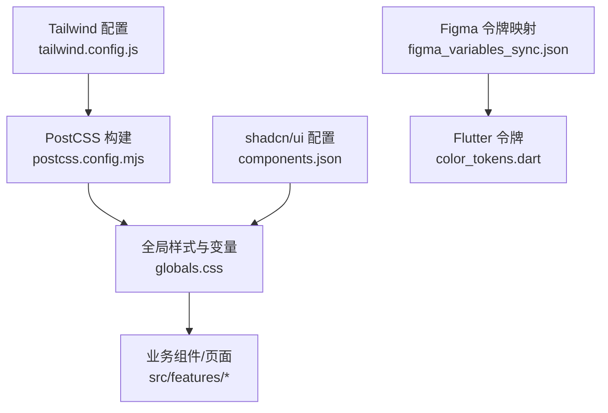
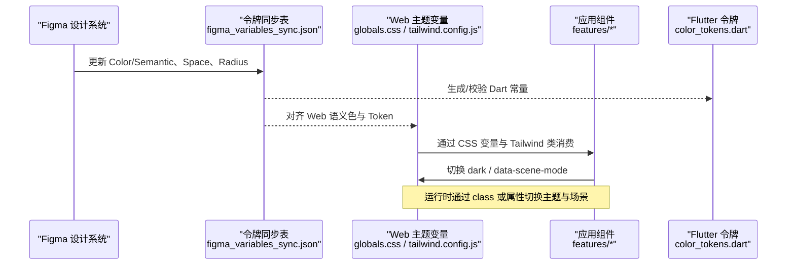
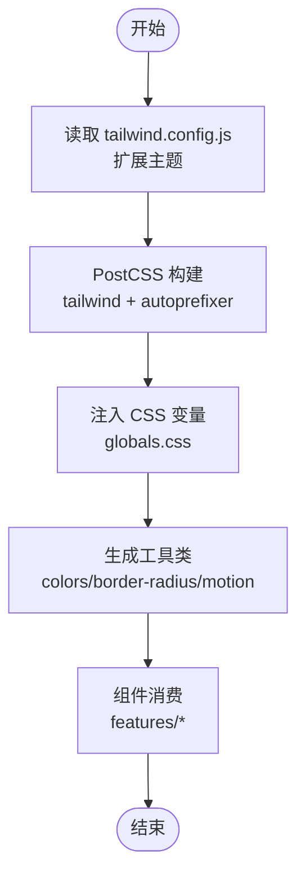
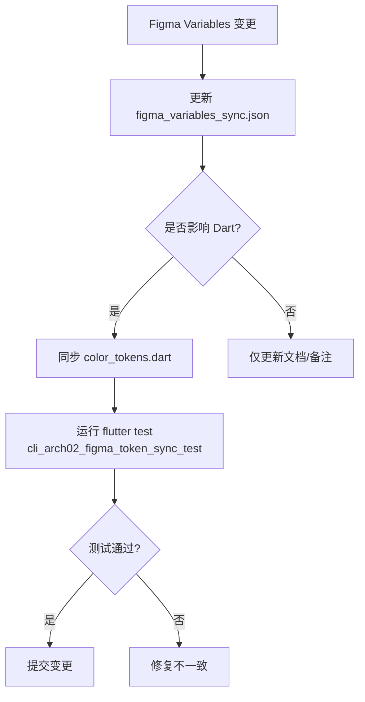
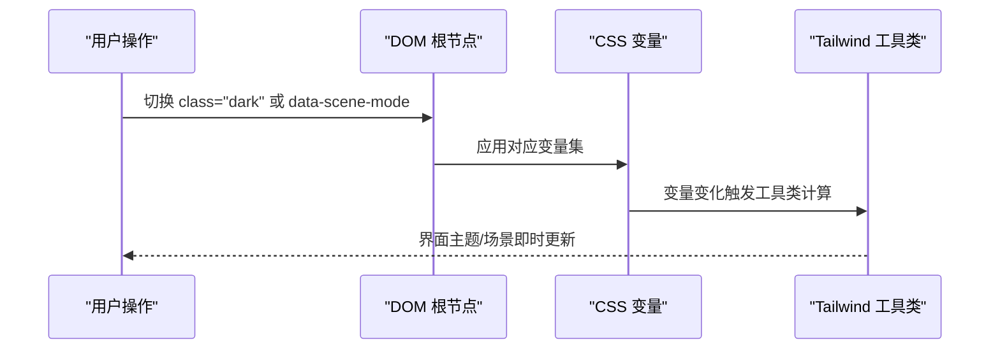
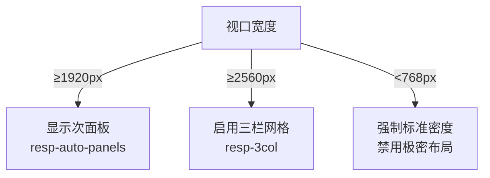
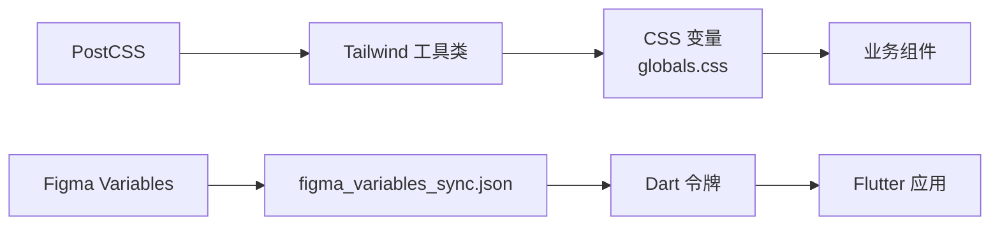

# 样式与主题管理

<cite>
**本文引用的文件**
- [frontend/tailwind.config.js](file://frontend/tailwind.config.js)
- [frontend/postcss.config.mjs](file://frontend/postcss.config.mjs)
- [frontend/src/styles/globals.css](file://frontend/src/styles/globals.css)
- [frontend/components.json](file://frontend/components.json)
- [client/flutter_app/design/FIGMA_TOKEN_SYNC.md](file://client/flutter_app/design/FIGMA_TOKEN_SYNC.md)
- [client/flutter_app/design/figma_variables_sync.json](file://client/flutter_app/design/figma_variables_sync.json)
</cite>

## 目录
1. [简介](#简介)
2. [项目结构](#项目结构)
3. [核心组件](#核心组件)
4. [架构总览](#架构总览)
5. [详细组件分析](#详细组件分析)
6. [依赖关系分析](#依赖关系分析)
7. [性能考虑](#性能考虑)
8. [故障排查指南](#故障排查指南)
9. [结论](#结论)
10. [附录](#附录)

## 简介
本规范面向 Quant Agent 前端（Web）与客户端（Flutter）的样式与主题体系，统一 Tailwind CSS 使用方式、设计令牌同步机制、主题切换方案、性能优化策略以及响应式与可访问性实践。目标是让设计与代码保持单一事实来源，确保跨端一致、可维护、可扩展且高性能。

## 项目结构
前端采用 Tailwind CSS + PostCSS + shadcn/ui 的组合：
- Tailwind 配置集中定义断点、颜色、圆角、动效时长等主题扩展项。
- PostCSS 负责引入 Tailwind 与 Autoprefixer。
- 全局样式通过 CSS 变量承载明暗主题、金融语义色、场景模式与动效参数。
- shadcn/ui 通过 components.json 声明样式风格、变量开关与别名。

图表来源
- [frontend/tailwind.config.js:1-78](file://frontend/tailwind.config.js#L1-L78)
- [frontend/postcss.config.mjs:1-10](file://frontend/postcss.config.mjs#L1-L10)
- [frontend/src/styles/globals.css:1-256](file://frontend/src/styles/globals.css#L1-L256)
- [frontend/components.json:1-22](file://frontend/components.json#L1-L22)
- [client/flutter_app/design/figma_variables_sync.json:1-89](file://client/flutter_app/design/figma_variables_sync.json#L1-L89)

章节来源
- [frontend/tailwind.config.js:1-78](file://frontend/tailwind.config.js#L1-L78)
- [frontend/postcss.config.mjs:1-10](file://frontend/postcss.config.mjs#L1-L10)
- [frontend/src/styles/globals.css:1-256](file://frontend/src/styles/globals.css#L1-L256)
- [frontend/components.json:1-22](file://frontend/components.json#L1-L22)

## 核心组件
- Tailwind 主题扩展：自定义断点（含 desktop/wide/ultrawide）、颜色体系（基于 CSS 变量）、圆角与过渡时长。
- 全局样式层：定义明暗主题变量、金融语义色、场景模式、响应式布局与动画工具类。
- shadcn/ui 集成：启用 CSS 变量、选择 New York 风格、设置别名与图标库。
- Flutter 设计令牌：以 JSON 为机器可读表，映射 Figma Variables 到 Dart 常量，并约束禁止硬编码颜色。

章节来源
- [frontend/tailwind.config.js:8-75](file://frontend/tailwind.config.js#L8-L75)
- [frontend/src/styles/globals.css:5-79](file://frontend/src/styles/globals.css#L5-L79)
- [frontend/components.json:1-22](file://frontend/components.json#L1-L22)
- [client/flutter_app/design/FIGMA_TOKEN_SYNC.md:1-47](file://client/flutter_app/design/FIGMA_TOKEN_SYNC.md#L1-L47)
- [client/flutter_app/design/figma_variables_sync.json:1-89](file://client/flutter_app/design/figma_variables_sync.json#L1-L89)

## 架构总览
下图展示从设计系统到前端与客户端的主题落地路径，以及运行时主题切换的数据流。

图表来源
- [client/flutter_app/design/figma_variables_sync.json:1-89](file://client/flutter_app/design/figma_variables_sync.json#L1-L89)
- [frontend/src/styles/globals.css:51-79](file://frontend/src/styles/globals.css#L51-L79)
- [frontend/src/styles/globals.css:158-163](file://frontend/src/styles/globals.css#L158-L163)
- [frontend/tailwind.config.js:8-75](file://frontend/tailwind.config.js#L8-L75)

## 详细组件分析

### Tailwind CSS 使用规范
- 主题扩展
  - 断点：新增 desktop/wide/ultrawide，用于多分辨率适配与三栏布局。
  - 颜色：全部基于 CSS 变量（HSL），便于明暗与品牌定制。
  - 圆角与动效：统一 radius 与 transitionDuration 命名，保证一致性。
- 构建链：PostCSS 仅启用 tailwindcss 与 autoprefixer，避免额外开销。
- 组件库：shadcn/ui 开启 CSS 变量模式，配合全局变量实现主题联动。

图表来源
- [frontend/tailwind.config.js:1-78](file://frontend/tailwind.config.js#L1-L78)
- [frontend/postcss.config.mjs:1-10](file://frontend/postcss.config.mjs#L1-L10)
- [frontend/src/styles/globals.css:1-49](file://frontend/src/styles/globals.css#L1-L49)

章节来源
- [frontend/tailwind.config.js:1-78](file://frontend/tailwind.config.js#L1-L78)
- [frontend/postcss.config.mjs:1-10](file://frontend/postcss.config.mjs#L1-L10)
- [frontend/components.json:1-22](file://frontend/components.json#L1-L22)

### 设计令牌同步机制（Figma → 代码）
- 单点事实：以 figma_variables_sync.json 作为机器可读表，记录 Figma Variable 到 Dart/Web 的映射、版本与更新时间。
- 流程：设计师在 Figma 修改变量 → 导出/维护 JSON → 对齐 Dart 常量 → 运行测试保障一致性。
- 范围：覆盖颜色（语义色）、间距（Space）、圆角（Radius）。
- 约束：禁止在 Feature Widget 中硬编码颜色，必须使用 AppColors.*。

图表来源
- [client/flutter_app/design/FIGMA_TOKEN_SYNC.md:39-47](file://client/flutter_app/design/FIGMA_TOKEN_SYNC.md#L39-L47)
- [client/flutter_app/design/figma_variables_sync.json:1-89](file://client/flutter_app/design/figma_variables_sync.json#L1-L89)

章节来源
- [client/flutter_app/design/FIGMA_TOKEN_SYNC.md:1-47](file://client/flutter_app/design/FIGMA_TOKEN_SYNC.md#L1-L47)
- [client/flutter_app/design/figma_variables_sync.json:1-89](file://client/flutter_app/design/figma_variables_sync.json#L1-L89)

### 主题切换实现方案
- 明暗主题：通过 HTML 根节点 class="dark" 切换深色变量集；Tailwind 使用 darkMode: 'class' 生效。
- 品牌色定制：所有颜色由 CSS 变量提供，修改 :root 或 .dark 中的 HSL 值即可全局生效。
- 场景模式：通过 data-scene-mode 属性切换场景强调色与密度缩放，关键 UI 使用 scene-accent-transition 平滑过渡。
- 动态更新：运行时切换 class 或 data-* 属性，浏览器即时重绘，无需刷新。

图表来源
- [frontend/tailwind.config.js:3](file://frontend/tailwind.config.js#L3)
- [frontend/src/styles/globals.css:51-79](file://frontend/src/styles/globals.css#L51-L79)
- [frontend/src/styles/globals.css:158-173](file://frontend/src/styles/globals.css#L158-L173)

章节来源
- [frontend/tailwind.config.js:3](file://frontend/tailwind.config.js#L3)
- [frontend/src/styles/globals.css:51-79](file://frontend/src/styles/globals.css#L51-L79)
- [frontend/src/styles/globals.css:158-173](file://frontend/src/styles/globals.css#L158-L173)

### 响应式设计最佳实践
- 断点：使用 tailwind.config.js 中定义的 sm/md/lg/desktop/wide/ultrawide/xl/2xl。
- 布局：在超宽屏下启用三栏网格（resp-3col），wide 屏幕默认显示次面板（resp-auto-panels）。
- 移动端：强制标准密度，禁用极密布局，保证可读性与触控体验。

图表来源
- [frontend/src/styles/globals.css:187-214](file://frontend/src/styles/globals.css#L187-L214)
- [frontend/src/styles/globals.css:164-170](file://frontend/src/styles/globals.css#L164-L170)
- [frontend/tailwind.config.js:10-20](file://frontend/tailwind.config.js#L10-L20)

章节来源
- [frontend/src/styles/globals.css:164-214](file://frontend/src/styles/globals.css#L164-L214)
- [frontend/tailwind.config.js:10-20](file://frontend/tailwind.config.js#L10-L20)

### 可访问性样式支持
- 减少动效：当系统偏好 prefers-reduced-motion 时，关闭 resp-* 入场动画；提供 reduce-motion 类强制抑制动画。
- 焦点可见性：ring 变量与 focus ring 保持一致，确保键盘导航可见。
- 对比度：语义色与前景/背景变量遵循终端级对比度要求。

章节来源
- [frontend/src/styles/globals.css:92-100](file://frontend/src/styles/globals.css#L92-L100)
- [frontend/src/styles/globals.css:238-246](file://frontend/src/styles/globals.css#L238-L246)
- [frontend/src/styles/globals.css:51-79](file://frontend/src/styles/globals.css#L51-L79)

### 跨浏览器兼容性处理
- 自动前缀：通过 PostCSS 的 autoprefixer 为 CSS 特性添加厂商前缀。
- 变量兼容：现代浏览器对 CSS 变量支持良好；如需更广泛兼容，可在构建阶段做降级策略（本项目当前未启用）。

章节来源
- [frontend/postcss.config.mjs:1-10](file://frontend/postcss.config.mjs#L1-L10)

## 依赖关系分析
- 构建依赖：PostCSS 加载 Tailwind 与 Autoprefixer，输出包含 CSS 变量的样式。
- 运行时依赖：组件通过 Tailwind 工具类与 CSS 变量消费主题；场景模式通过 data-scene-mode 驱动。
- 设计依赖：Flutter 侧通过 JSON 与 Dart 常量与 Figma 保持同步；Web 侧通过 CSS 变量与 Tailwind 对齐。

图表来源
- [frontend/postcss.config.mjs:1-10](file://frontend/postcss.config.mjs#L1-L10)
- [frontend/tailwind.config.js:1-78](file://frontend/tailwind.config.js#L1-L78)
- [frontend/src/styles/globals.css:1-256](file://frontend/src/styles/globals.css#L1-L256)
- [client/flutter_app/design/figma_variables_sync.json:1-89](file://client/flutter_app/design/figma_variables_sync.json#L1-L89)

章节来源
- [frontend/postcss.config.mjs:1-10](file://frontend/postcss.config.mjs#L1-L10)
- [frontend/tailwind.config.js:1-78](file://frontend/tailwind.config.js#L1-L78)
- [frontend/src/styles/globals.css:1-256](file://frontend/src/styles/globals.css#L1-L256)
- [client/flutter_app/design/figma_variables_sync.json:1-89](file://client/flutter_app/design/figma_variables_sync.json#L1-L89)

## 性能考虑
- CSS 打包优化
  - 仅启用必要插件：PostCSS 仅使用 tailwindcss 与 autoprefixer，减少构建负担。
  - 内容扫描：Tailwind content 精确匹配 src/**/*.{js,ts,jsx,tsx}，避免无用样式。
- 按需加载
  - 使用 Tailwind 原子类按需生成，避免手写冗余 CSS。
  - 将通用样式放入 @layer components，复用而不重复定义。
- 样式隔离
  - 通过 CSS 变量与 data-scene-mode 进行主题与场景隔离，避免全局污染。
  - 组件内尽量使用工具类与局部变量，减少长链路样式依赖。
- 动效与渲染
  - 使用统一的 motion 变量控制时长与缓动，避免过度动画。
  - 在减少动效模式下关闭入场动画，提升低端设备体验。

章节来源
- [frontend/postcss.config.mjs:1-10](file://frontend/postcss.config.mjs#L1-L10)
- [frontend/tailwind.config.js:4-7](file://frontend/tailwind.config.js#L4-L7)
- [frontend/src/styles/globals.css:34-49](file://frontend/src/styles/globals.css#L34-L49)
- [frontend/src/styles/globals.css:238-246](file://frontend/src/styles/globals.css#L238-L246)

## 故障排查指南
- 主题不生效
  - 检查根节点是否设置了 dark 类或正确的 data-scene-mode。
  - 确认 Tailwind 的 darkMode 设置为 class。
- 颜色异常
  - 核对 CSS 变量是否正确覆盖（:root 与 .dark）。
  - 确认组件使用的颜色来自变量而非硬编码。
- 响应式布局错乱
  - 检查是否使用了正确的断点类名（desktop/wide/ultrawide）。
  - 在超宽屏下确认是否启用了 resp-3col 或 resp-auto-panels。
- Flutter 令牌不同步
  - 运行 token 同步测试，确保 JSON 与 Dart 常量一致。
  - 禁止在组件中硬编码颜色，统一使用 AppColors.*。

章节来源
- [frontend/tailwind.config.js:3](file://frontend/tailwind.config.js#L3)
- [frontend/src/styles/globals.css:51-79](file://frontend/src/styles/globals.css#L51-L79)
- [frontend/src/styles/globals.css:158-173](file://frontend/src/styles/globals.css#L158-L173)
- [client/flutter_app/design/FIGMA_TOKEN_SYNC.md:39-47](file://client/flutter_app/design/FIGMA_TOKEN_SYNC.md#L39-L47)

## 结论
通过将 Tailwind 主题扩展、CSS 变量、场景模式与 Flutter 设计令牌打通，Quant Agent 实现了“设计即代码”的统一主题体系。该体系具备清晰的职责边界、良好的可维护性与可扩展性，同时兼顾性能与可访问性。建议持续维护 figma_variables_sync.json 与全局变量，确保设计与代码长期一致。

## 附录
- 术语
  - 场景模式：通过 data-scene-mode 切换强调色与密度，适配盯盘、研究、监控、AI 分析等场景。
  - 金融语义色：bull/bear/warn/info/ai 等语义化颜色，贯穿全栈。
  - 令牌：Figma Variables 到代码常量的映射集合。
