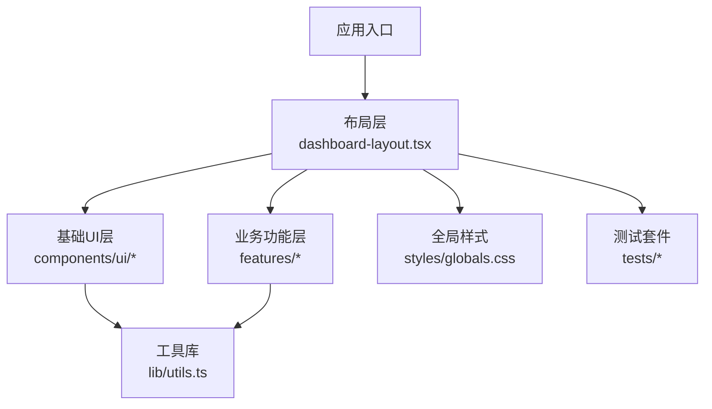
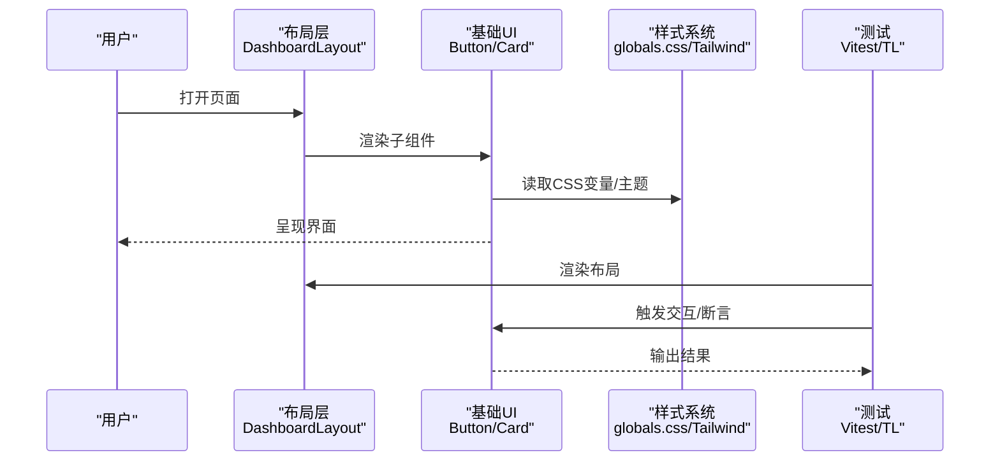
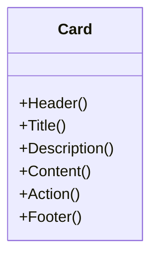
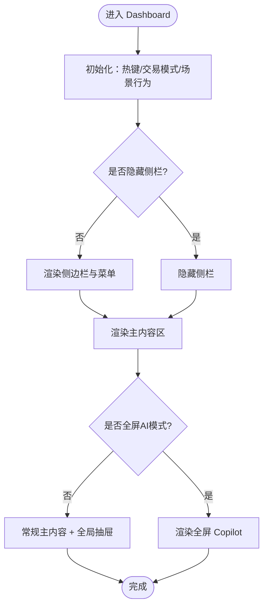
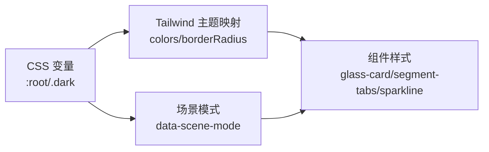
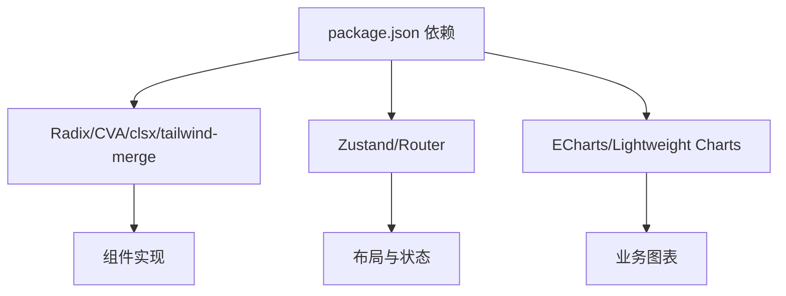

# 组件开发规范

<cite>
**本文引用的文件**
- [frontend/package.json](file://frontend/package.json)
- [frontend/components.json](file://frontend/components.json)
- [frontend/tailwind.config.js](file://frontend/tailwind.config.js)
- [frontend/src/styles/globals.css](file://frontend/src/styles/globals.css)
- [frontend/src/lib/utils.ts](file://frontend/src/lib/utils.ts)
- [frontend/src/components/ui/button.tsx](file://frontend/src/components/ui/button.tsx)
- [frontend/src/components/ui/card.tsx](file://frontend/src/components/ui/card.tsx)
- [frontend/src/components/layout/dashboard-layout.tsx](file://frontend/src/components/layout/dashboard-layout.tsx)
- [frontend/tests/features/key-components.test.ts](file://frontend/tests/features/key-components.test.ts)
- [frontend/src/features/calendars/__tests__/module.test.tsx](file://frontend/src/features/calendars/__tests__/module.test.tsx)
</cite>

## 目录
1. [引言](#引言)
2. [项目结构](#项目结构)
3. [核心组件](#核心组件)
4. [架构总览](#架构总览)
5. [详细组件分析](#详细组件分析)
6. [依赖关系分析](#依赖关系分析)
7. [性能考虑](#性能考虑)
8. [故障排查指南](#故障排查指南)
9. [结论](#结论)
10. [附录](#附录)

## 引言
本规范面向 Quant Agent 前端（React + Vite）的组件开发，统一基于 shadcn/ui 与 Tailwind CSS 的工程实践。文档覆盖：
- 组件分类：基础 UI 组件、业务组件、布局组件
- 命名与文件组织规范
- 设计原则：单一职责、可复用性、可访问性
- 样式管理：CSS 变量、主题定制、响应式方案
- 组件开发示例：新建组件、组件通信、状态处理
- 测试策略、性能优化与最佳实践

目标是在保证一致性的同时提升可维护性与交付效率。

## 项目结构
前端工程采用“按能力域”的组织方式：
- components/ui：基础 UI 组件（按钮、卡片等），由 shadcn/ui 生成并二次封装
- components/layout：全局布局与导航（侧边栏、顶部栏、状态栏、场景模式切换等）
- features：业务功能域（行情、投研、交易、风控、系统管理等）
- lib：工具函数（如 cn 合并类名）、通用服务
- styles：全局样式与主题变量（Tailwind 变量映射、深色模式、场景强调色、响应式动画）
- tests：单元测试与特性测试（Vitest + Testing Library）



图表来源
- [frontend/src/components/layout/dashboard-layout.tsx:1-277](file://frontend/src/components/layout/dashboard-layout.tsx#L1-L277)
- [frontend/src/styles/globals.css:1-256](file://frontend/src/styles/globals.css#L1-L256)
- [frontend/src/lib/utils.ts:1-7](file://frontend/src/lib/utils.ts#L1-L7)

章节来源
- [frontend/package.json:1-114](file://frontend/package.json#L1-L114)
- [frontend/components.json:1-22](file://frontend/components.json#L1-L22)
- [frontend/tailwind.config.js:1-78](file://frontend/tailwind.config.js#L1-L78)
- [frontend/src/styles/globals.css:1-256](file://frontend/src/styles/globals.css#L1-L256)

## 核心组件
本节聚焦基础 UI 组件与布局组件的实现要点与设计约定。

- 基础 UI 组件（以 Button、Card 为例）
  - 使用 class-variance-authority 管理变体（variant/size）
  - 通过 cn 工具合并类名，避免冲突
  - 提供无障碍属性（focus-visible、aria-*）与键盘交互支持
  - 通过 data-slot 标记语义槽位，便于样式定位与自动化测试

- 布局组件（DashboardLayout）
  - 组合 SidebarProvider/SidebarInset 构建主布局
  - 集成全局抽屉（Copilot、Settings）、告警中心、状态条
  - 根据场景模式（scene mode）控制侧边栏可见性与 AI 副驾行为
  - 移动端 TabBar 与桌面端侧栏自适应

章节来源
- [frontend/src/components/ui/button.tsx:1-109](file://frontend/src/components/ui/button.tsx#L1-L109)
- [frontend/src/components/ui/card.tsx:1-93](file://frontend/src/components/ui/card.tsx#L1-L93)
- [frontend/src/components/layout/dashboard-layout.tsx:1-277](file://frontend/src/components/layout/dashboard-layout.tsx#L1-L277)

## 架构总览
下图展示从页面到组件、样式与测试的协作关系。



图表来源
- [frontend/src/components/layout/dashboard-layout.tsx:1-277](file://frontend/src/components/layout/dashboard-layout.tsx#L1-L277)
- [frontend/src/components/ui/button.tsx:1-109](file://frontend/src/components/ui/button.tsx#L1-L109)
- [frontend/src/components/ui/card.tsx:1-93](file://frontend/src/components/ui/card.tsx#L1-L93)
- [frontend/src/styles/globals.css:1-256](file://frontend/src/styles/globals.css#L1-L256)

## 详细组件分析

### 基础 UI 组件：Button
- 设计要点
  - 使用 cva 定义 variant（default/destructive/outline/secondary/ghost/link）与 size（default/sm/lg/icon*）
  - 通过 Slot 支持 asChild 透传原生元素
  - 内置点击涟漪动效，可通过 disableRipple 关闭
  - 焦点环与错误态 ring/border 使用 CSS 变量，确保暗色模式一致性
- 可访问性
  - 使用 focus-visible 替代 outline
  - aria-invalid 用于表单校验反馈
- 扩展建议
  - 新增变体时保持语义化命名
  - 图标尺寸通过 has-[>svg] 选择器自动适配

```mermaid
classDiagram
class Button {
+variant : default|destructive|outline|secondary|ghost|link
+size : default|sm|lg|icon|icon-sm|icon-lg
+asChild : boolean
+disableRipple : boolean
+onClick(event)
+children
}
class Variants {
+cva("base", { variants, defaultVariants })
}
Button --> Variants : "使用"
```

图表来源
- [frontend/src/components/ui/button.tsx:1-109](file://frontend/src/components/ui/button.tsx#L1-L109)

章节来源
- [frontend/src/components/ui/button.tsx:1-109](file://frontend/src/components/ui/button.tsx#L1-L109)

### 基础 UI 组件：Card
- 设计要点
  - 拆分子槽：Header、Title、Description、Content、Action、Footer
  - 使用 grid 与 @container 实现灵活排版
  - 通过 data-slot 标识槽位，便于样式与测试定位
- 可访问性
  - 标题层级合理，描述文本使用 muted 色
- 扩展建议
  - 在 Card 内组合 Button、Badge、图表等，形成信息卡片



图表来源
- [frontend/src/components/ui/card.tsx:1-93](file://frontend/src/components/ui/card.tsx#L1-L93)

章节来源
- [frontend/src/components/ui/card.tsx:1-93](file://frontend/src/components/ui/card.tsx#L1-L93)

### 布局组件：DashboardLayout
- 职责边界
  - 管理全局侧边栏、顶部导航、状态条、移动端 TabBar
  - 注入全局抽屉（AI 副驾、设置）、告警中心
  - 根据场景模式（watch/research/monitor/ai-analysis）调整布局与 AI 行为
- 关键流程
  - 初始化：热键监听、交易模式水合、场景模式行为
  - 导航高亮：精确匹配 /research 路由前缀，避免吞掉子路由
  - 徽章动态计数：OMS 活跃订单与运行 bots 数
- 响应式与可访问性
  - 桌面侧栏隐藏逻辑；移动端 TabBar 接管
  - 使用 aria-hidden 装饰非语义元素



图表来源
- [frontend/src/components/layout/dashboard-layout.tsx:1-277](file://frontend/src/components/layout/dashboard-layout.tsx#L1-L277)

章节来源
- [frontend/src/components/layout/dashboard-layout.tsx:1-277](file://frontend/src/components/layout/dashboard-layout.tsx#L1-L277)

### 样式系统与主题定制
- 主题变量
  - 浅色/深色两套 HSL 变量，涵盖背景、前景、卡片、描边、输入、环、破坏、强调等
  - 金融语义色：涨/跌/警示/AI 强调色
  - 场景模式变量：密度缩放、场景强调色、环颜色
- 响应式
  - Tailwind 自定义断点：desktop/wide/ultrawide
  - 多分辨率面板显示规则与三栏网格
  - 减少动效偏好（prefers-reduced-motion）兜底
- 组件级样式
  - 面板卡 glass-card、分段标签 segment-tabs、微趋势 sparkline
  - 价格跳动 tick-up/tick-down 动画
- 工具类
  - scene-accent-transition 平滑过渡
  - scene-anomaly-flash 异常脉冲光环



图表来源
- [frontend/src/styles/globals.css:1-256](file://frontend/src/styles/globals.css#L1-L256)
- [frontend/tailwind.config.js:1-78](file://frontend/tailwind.config.js#L1-L78)

章节来源
- [frontend/src/styles/globals.css:1-256](file://frontend/src/styles/globals.css#L1-L256)
- [frontend/tailwind.config.js:1-78](file://frontend/tailwind.config.js#L1-L78)

### 组件间通信与状态
- 布局级状态
  - 通过 store（如 useLayoutStore、useSceneModeStore）管理全局开关（Copilot、Settings、场景模式）
  - 热键与场景模式联动（如研究模式自动展开 AI 副驾）
- 数据流
  - 布局层负责装配与调度，业务层专注领域逻辑
  - 通过 props/context/store 进行跨层级传递，避免深层 props drilling

章节来源
- [frontend/src/components/layout/dashboard-layout.tsx:1-277](file://frontend/src/components/layout/dashboard-layout.tsx#L1-L277)

## 依赖关系分析
- 包依赖
  - Radix UI 系列提供无头可访问组件
  - class-variance-authority 管理变体
  - tailwind-merge + clsx 合并类名
  - zustand 状态管理、react-router-dom 路由、echarts/lightweight-charts 图表
- 模块依赖
  - 布局依赖 ui 组件与 stores
  - 业务功能依赖 ui 组件与 lib 工具
  - 全局样式为所有组件提供主题与响应式基础



图表来源
- [frontend/package.json:1-114](file://frontend/package.json#L1-L114)

章节来源
- [frontend/package.json:1-114](file://frontend/package.json#L1-L114)

## 性能考虑
- 渲染优化
  - 使用 React.memo 包裹纯展示组件
  - 列表虚拟化（虚拟滚动）用于大数据表格/列表
  - 按需加载与代码分割（路由级/组件级）
- 样式与主题
  - 优先使用 Tailwind 原子类，减少自定义 CSS
  - 利用 CSS 变量切换主题，避免重绘抖动
- 交互体验
  - 减少不必要的重渲染（稳定 key、受控与非受控分离）
  - 合理使用动画，遵循 prefers-reduced-motion
- 资源与网络
  - 图片与图标懒加载，SVG 内联减少请求
  - 图表按需引入与销毁

[本节为通用指导，不直接分析具体文件]

## 故障排查指南
- 主题与样式问题
  - 检查 CSS 变量是否在根节点生效（:root/.dark）
  - 确认 Tailwind 配置中的 darkMode 与断点
  - 使用浏览器开发者工具检查 data-scene-mode 与 data-slot
- 组件交互问题
  - 验证事件冒泡与阻止默认行为
  - 检查 asChild 透传是否正确转发 ref/事件
- 测试失败定位
  - 使用 Vitest 与 Testing Library 断言 DOM 结构与交互
  - Mock 外部依赖（apiClient）隔离副作用

章节来源
- [frontend/tests/features/key-components.test.ts:1-243](file://frontend/tests/features/key-components.test.ts#L1-L243)
- [frontend/src/features/calendars/__tests__/module.test.tsx:1-186](file://frontend/src/features/calendars/__tests__/module.test.tsx#L1-L186)

## 结论
本规范围绕 shadcn/ui 与 Tailwind CSS 构建了统一的组件体系：以基础 UI 组件为核心，布局组件为骨架，业务组件为血肉，配合全局样式与测试保障质量。遵循单一职责、可复用性与可访问性原则，结合 CSS 变量与响应式策略，可在复杂金融终端场景中保持一致的视觉与交互体验。建议在新增组件时严格遵循命名、文件组织与测试要求，持续沉淀可复用能力。

[本节为总结性内容，不直接分析具体文件]

## 附录

### 组件分类与命名规范
- 基础 UI 组件
  - 位置：src/components/ui
  - 命名：小写下划线或驼峰（如 button.tsx、card.tsx）
  - 职责：无业务逻辑，仅关注展示与交互
- 业务组件
  - 位置：src/features/<domain>
  - 命名：按领域划分，组件文件名使用帕斯卡命名（如 ScreenerResultsTable.tsx）
  - 职责：承载领域逻辑与数据绑定
- 布局组件
  - 位置：src/components/layout
  - 命名：描述布局角色（如 dashboard-layout.tsx、navbar.tsx）
  - 职责：组装全局结构、导航与全局抽屉

### 文件组织结构
- 每个组件一个文件，导出默认组件与必要的工具函数
- 同组组件放入同一目录，必要时拆分 hooks、types、utils
- 测试文件与源码同级或置于 tests/features 下

### 样式管理方案
- 使用 CSS 变量集中管理主题与语义色
- 通过 Tailwind 配置扩展断点与颜色
- 组件内尽量使用原子类，复杂样式下沉至 globals.css 的 @layer components

### 组件开发示例（步骤指引）
- 新建基础 UI 组件
  - 在 src/components/ui 创建文件，使用 cva 定义变体
  - 通过 cn 合并类名，添加 data-slot 与无障碍属性
  - 编写单元测试，覆盖主要变体与交互
- 实现组件通信
  - 使用 props 传递简单数据
  - 复杂状态通过 store（Zustand）或 Context 共享
- 处理组件状态
  - 本地状态使用 useState/useReducer
  - 异步状态使用 useEffect 与错误边界保护

### 测试策略
- 单元与特性测试
  - 使用 Vitest + Testing Library
  - 对纯函数与组件交互分别编写用例
- Mock 与隔离
  - 对外部 API 使用 vi.mock 模拟
  - 对第三方库按需替换实现

### 最佳实践
- 可访问性优先：语义化标签、键盘可达、屏幕阅读器友好
- 性能敏感区域：虚拟化、懒加载、避免过度渲染
- 可维护性：清晰的职责边界、稳定的接口契约、完善的类型定义

[本节为通用指导，不直接分析具体文件]