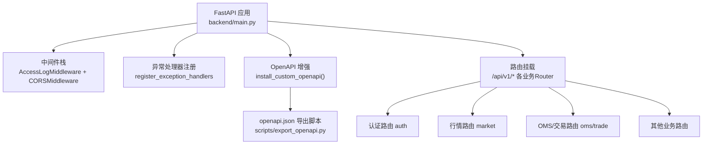
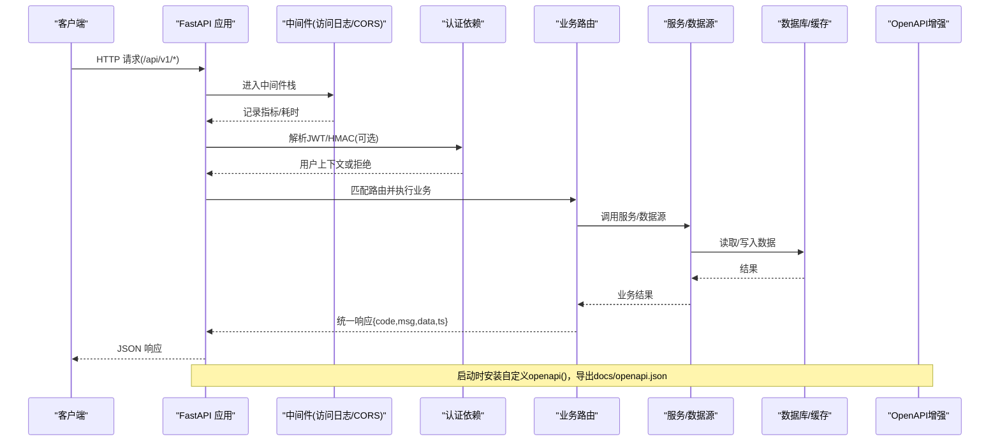
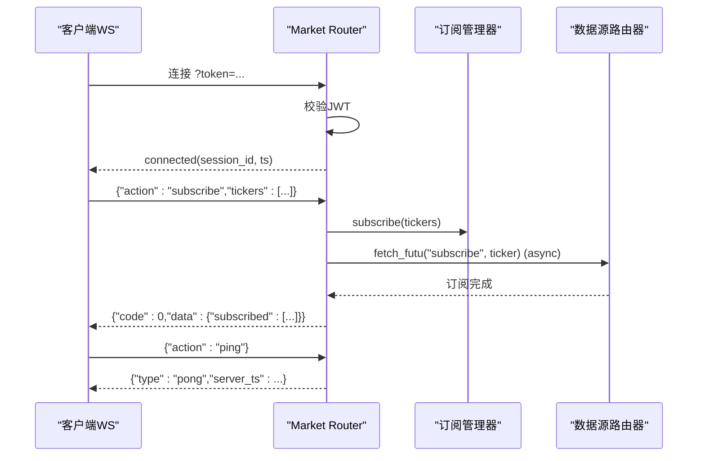
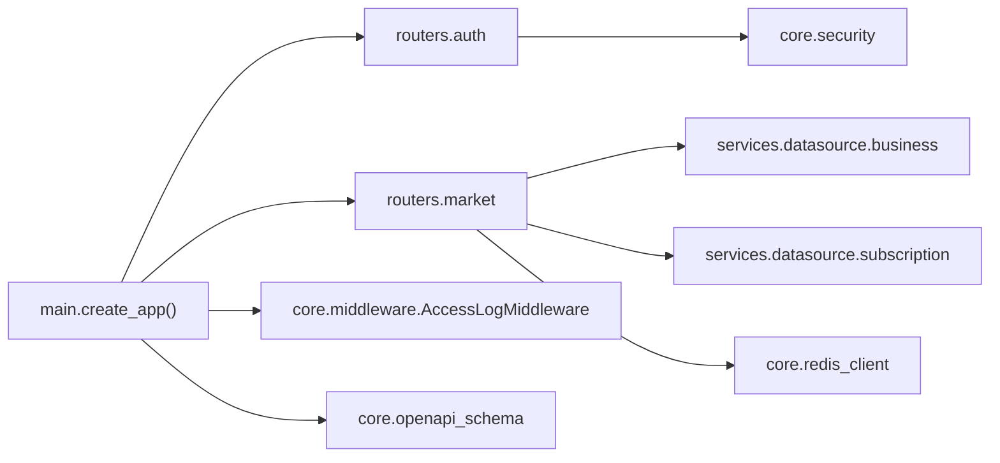

# API接口设计规范

<cite>
**本文引用的文件列表**
- [backend/main.py](file://backend/main.py)
- [backend/core/openapi_schema.py](file://backend/core/openapi_schema.py)
- [backend/core/security.py](file://backend/core/security.py)
- [backend/core/middleware.py](file://backend/core/middleware.py)
- [backend/core/response.py](file://backend/core/response.py)
- [backend/core/error_codes.py](file://backend/core/error_codes.py)
- [backend/routers/auth.py](file://backend/routers/auth.py)
- [backend/routers/market.py](file://backend/routers/market.py)
- [scripts/export_openapi.py](file://scripts/export_openapi.py)
- [docs/10. API接口规范.md](file://docs/10. API接口规范.md)
</cite>

## 目录
1. [引言](#引言)
2. [项目结构](#项目结构)
3. [核心组件](#核心组件)
4. [架构总览](#架构总览)
5. [详细组件分析](#详细组件分析)
6. [依赖关系分析](#依赖关系分析)
7. [性能与限流](#性能与限流)
8. [故障排查指南](#故障排查指南)
9. [结论](#结论)
10. [附录：端点清单与示例](#附录端点清单与示例)

## 引言
本规范面向Quant Agent后端API，统一RESTful设计原则、URL命名约定、HTTP状态码与错误码映射、请求响应信封格式、认证授权机制、OpenAPI/Swagger集成与文档自动化、WebSocket实时行情协议、以及新接口开发的最佳实践。目标是让前后端在统一的契约下高效协作，降低联调成本并提升系统可观测性与稳定性。

## 项目结构
后端采用FastAPI构建，应用工厂集中装配中间件、路由、CORS、OpenAPI增强与静态资源；业务按领域拆分为多个router（如auth、market、oms、trade等），并通过统一前缀 /api/v1 暴露。OpenAPI Schema在运行时被增强，支持自动补齐summary、注入统一响应示例、注册ApiResponse组件；并提供导出脚本将Schema落盘为docs/openapi.json，用于Swagger UI与契约互校。

图表来源
- [backend/main.py:125-218](file://backend/main.py#L125-L218)
- [backend/core/openapi_schema.py:191-276](file://backend/core/openapi_schema.py#L191-L276)
- [scripts/export_openapi.py:32-83](file://scripts/export_openapi.py#L32-L83)

章节来源
- [backend/main.py:125-218](file://backend/main.py#L125-L218)
- [backend/core/openapi_schema.py:191-276](file://backend/core/openapi_schema.py#L191-L276)
- [scripts/export_openapi.py:32-83](file://scripts/export_openapi.py#L32-L83)

## 核心组件
- 统一响应信封：所有REST接口返回 {code, msg, data, ts}，成功时code=0；错误时附带trace_id便于追踪。
- 错误码体系：ErrorCode枚举定义分域错误码，并与HTTP状态码映射。
- 认证授权：JWT Bearer Token（Access Token短效+Refresh Token长效Cookie）；内部服务调用使用HMAC-SHA256签名。
- OpenAPI增强：自动补齐summary、注入统一响应示例、注册ApiResponse组件；提供导出脚本生成docs/openapi.json。
- 监控与日志：AccessLogMiddleware记录请求计数、延迟直方图、外部API出站监控；Prometheus指标暴露。
- WebSocket行情：连接鉴权、心跳保活、订阅去重、背压保护、回传子服务订阅/退订。

章节来源
- [backend/core/response.py:26-69](file://backend/core/response.py#L26-L69)
- [backend/core/error_codes.py:15-54](file://backend/core/error_codes.py#L15-L54)
- [backend/core/security.py:20-159](file://backend/core/security.py#L20-L159)
- [backend/core/openapi_schema.py:65-110](file://backend/core/openapi_schema.py#L65-L110)
- [backend/core/middleware.py:10-38](file://backend/core/middleware.py#L10-L38)
- [backend/routers/market.py:73-200](file://backend/routers/market.py#L73-L200)

## 架构总览
下图展示从客户端到后端的请求处理链路，包括认证、中间件、路由、服务层与数据源，以及OpenAPI文档的生成流程。

图表来源
- [backend/main.py:125-218](file://backend/main.py#L125-L218)
- [backend/core/middleware.py:90-133](file://backend/core/middleware.py#L90-L133)
- [backend/routers/auth.py:117-162](file://backend/routers/auth.py#L117-L162)
- [backend/core/openapi_schema.py:254-276](file://backend/core/openapi_schema.py#L254-L276)

## 详细组件分析

### REST API 设计与响应规范
- Base URL与环境
  - 本地开发：http://localhost:8000
  - 生产域名：https://api.quant.yourdomain.com（经Cloudflare Tunnel）
- 统一响应信封
  - 字段：code（int）、msg（str）、data（any）、ts（UTC毫秒时间戳）
  - 成功：code=0，msg="ok"
  - 失败：非零code，msg可读描述，data可为null；错误时建议附带trace_id
- HTTP状态码与错误码映射
  - 401：Token缺失/过期/无效（1001/1002/1003）
  - 403：权限不足/HMAC校验失败（1004/1005）
  - 400：参数校验失败（2001）
  - 404：资源不存在（2002）
  - 503：外部依赖不可用（Futu断开/Redis不可用/熔断打开）（3001/3002/3003）
  - 500：内部未知错误（5000）
- 分页约定
  - cursor-based：next_cursor、has_more、items数组
- 版本控制策略
  - URL前缀：/api/{version}，默认v1，通过环境变量API_URL_VERSION配置
  - 向后兼容：新增字段保持可选，删除字段需废弃期过渡

章节来源
- [docs/10. API接口规范.md:25-93](file://docs/10. API接口规范.md#L25-L93)
- [backend/core/error_codes.py:15-54](file://backend/core/error_codes.py#L15-L54)
- [backend/core/response.py:26-69](file://backend/core/response.py#L26-L69)
- [backend/main.py:120-123](file://backend/main.py#L120-L123)

### 认证与授权
- JWT Bearer Token
  - Access Token：短效（默认15分钟），通过Authorization: Bearer <token>传递
  - Refresh Token：长效（默认30天），通过HttpOnly Cookie设置，跨域环境使用SameSite=None+Secure
  - 登录：POST /api/v1/auth/login，返回access_token与user信息
  - 刷新：POST /api/v1/auth/refresh，从Cookie读取Refresh Token并签发新的Access Token
  - 登出：POST /api/v1/auth/logout，清理服务端黑名单并删除Cookie
  - 当前用户：GET /api/v1/auth/me
- Google OAuth2验证
  - POST /api/v1/auth/google/verify，验证前端Google ID Token，签发系统内Token并设置Cookie
- 内部服务HMAC签名
  - Header：X-Internal-Sig、X-Internal-Ts（或基于实现的时间戳嵌入签名头）
  - 防重放：时间戳偏差超过阈值拒绝
  - 工具函数：generate_internal_signature、verify_internal_signature、verify_internal_request

章节来源
- [backend/routers/auth.py:22-46](file://backend/routers/auth.py#L22-L46)
- [backend/routers/auth.py:117-162](file://backend/routers/auth.py#L117-L162)
- [backend/routers/auth.py:305-346](file://backend/routers/auth.py#L305-L346)
- [backend/routers/auth.py:349-385](file://backend/routers/auth.py#L349-L385)
- [backend/core/security.py:37-118](file://backend/core/security.py#L37-L118)
- [backend/core/security.py:121-159](file://backend/core/security.py#L121-L159)

### OpenAPI/Swagger集成与文档自动化
- 在线文档
  - Swagger UI：/docs
  - ReDoc：/redoc
  - 原始Schema：GET /openapi.json
- 运行时增强
  - 自动补齐operation summary（优先覆盖表，其次docstring首行，最后路径人话化）
  - 注入统一响应示例（成功/400/401/422/500）
  - 注册ApiResponse组件（包含code/msg/data/ts/trace_id）
- 导出脚本
  - scripts/export_openapi.py：生成docs/openapi.json，支持--check模式在CI中校验是否过期

章节来源
- [backend/core/openapi_schema.py:19-63](file://backend/core/openapi_schema.py#L19-L63)
- [backend/core/openapi_schema.py:87-110](file://backend/core/openapi_schema.py#L87-L110)
- [backend/core/openapi_schema.py:136-189](file://backend/core/openapi_schema.py#L136-L189)
- [backend/core/openapi_schema.py:191-276](file://backend/core/openapi_schema.py#L191-L276)
- [scripts/export_openapi.py:32-83](file://scripts/export_openapi.py#L32-L83)
- [docs/10. API接口规范.md:9-20](file://docs/10. API接口规范.md#L9-L20)

### WebSocket行情协议
- 连接与鉴权
  - ws://host/api/v1/market/quotes/ws?token=<jwt>
  - 无token或token无效直接关闭连接
- 消息协议
  - 客户端→服务端：subscribe/unsubscribe/ping
  - 服务端→客户端：connected/tick/kline_update/pong/error
- 特性
  - 心跳保活：ping/pong，超时断开
  - 订阅去重：重复订阅同一ticker不重复注册
  - 背压保护：慢客户端缓冲区满时丢弃最旧消息
  - 回传子服务：对Futu支持的标的，异步回传订阅/退订至数据源路由器

图表来源
- [backend/routers/market.py:73-200](file://backend/routers/market.py#L73-L200)

章节来源
- [backend/routers/market.py:73-200](file://backend/routers/market.py#L73-L200)

### 中间件与监控
- 访问日志与指标
  - 记录请求总数、状态码、P95/P99延迟直方图
  - 外部API出站监控（Finnhub/Fred/Tavily/Yahoo等）
  - 动态染色日志：绿(<100ms)、黄(<500ms)、红(>500ms)
- CORS
  - 允许指定origin、方法、头部，支持credentials
- 异常处理
  - 全局异常处理器统一捕获并返回标准错误信封

章节来源
- [backend/core/middleware.py:10-38](file://backend/core/middleware.py#L10-L38)
- [backend/core/middleware.py:90-133](file://backend/core/middleware.py#L90-L133)
- [backend/main.py:144-160](file://backend/main.py#L144-L160)

## 依赖关系分析
- 应用装配依赖
  - main.create_app()负责组装中间件、路由、OpenAPI增强、静态资源
- 路由依赖
  - auth依赖JWT工具与数据库会话
  - market依赖数据源Facade、订阅管理、Redis缓存、Ticker格式化
- 安全依赖
  - security提供密码哈希、HMAC签名生成与验证
- 监控依赖
  - middleware集成Prometheus指标与结构化日志

图表来源
- [backend/main.py:125-218](file://backend/main.py#L125-L218)
- [backend/routers/auth.py:117-162](file://backend/routers/auth.py#L117-L162)
- [backend/routers/market.py:19-30](file://backend/routers/market.py#L19-L30)
- [backend/core/security.py:20-159](file://backend/core/security.py#L20-L159)
- [backend/core/middleware.py:90-133](file://backend/core/middleware.py#L90-L133)
- [backend/core/openapi_schema.py:191-276](file://backend/core/openapi_schema.py#L191-L276)

章节来源
- [backend/main.py:125-218](file://backend/main.py#L125-L218)
- [backend/routers/auth.py:117-162](file://backend/routers/auth.py#L117-L162)
- [backend/routers/market.py:19-30](file://backend/routers/market.py#L19-L30)
- [backend/core/security.py:20-159](file://backend/core/security.py#L20-L159)
- [backend/core/middleware.py:90-133](file://backend/core/middleware.py#L90-L133)
- [backend/core/openapi_schema.py:191-276](file://backend/core/openapi_schema.py#L191-L276)

## 性能与限流
- 性能监控
  - 请求延迟直方图（buckets精细设计，适配高频场景）
  - 外部API出站延迟与错误率监控
  - 慢请求告警（>3s）
- 限流策略
  - 当前代码未内置通用RateLimit中间件；建议在网关层或引入第三方限流组件（如slowapi）结合Redis进行分布式限流
  - 针对高并发WS推送，已实现背压保护与订阅去重，避免内存泄漏与过度订阅
- 缓存策略
  - K线仓库与Redis缓存用于历史K线与快照；Facade层支持降级与source标记
  - 建议对读多写少的查询增加缓存层，并设置合理的TTL与失效策略

章节来源
- [backend/core/middleware.py:10-38](file://backend/core/middleware.py#L10-L38)
- [backend/routers/market.py:73-200](file://backend/routers/market.py#L73-L200)

## 故障排查指南
- 常见问题定位
  - 401/403：检查JWT是否正确携带、Refresh Token是否有效、内部HMAC签名是否匹配
  - 400/422：检查请求体结构与必填字段，参考OpenAPI中的schema与example
  - 503：检查外部依赖（Futu OpenD、Redis、第三方API）状态与熔断器
  - 500：查看后端日志中的trace_id与堆栈信息
- 诊断工具
  - /api/v1/health：健康检查，返回各依赖状态
  - Prometheus指标：/metrics（由中间件暴露）
  - OpenAPI文档：/docs与/redoc，快速核对接口契约

章节来源
- [backend/core/error_codes.py:15-54](file://backend/core/error_codes.py#L15-L54)
- [backend/core/response.py:40-69](file://backend/core/response.py#L40-L69)
- [backend/core/middleware.py:90-133](file://backend/core/middleware.py#L90-L133)

## 结论
本规范统一了Quant Agent的API设计、认证授权、错误处理、文档自动化与实时监控，确保前后端在一致的契约下高效协作。通过OpenAPI增强与导出脚本，保证文档与代码同步；通过中间件与指标，提升可观测性；通过WebSocket协议与背压保护，保障实时数据的稳定传输。建议在新接口开发中严格遵循本规范，并在CI中启用OpenAPI一致性检查。

## 附录：端点清单与示例
- 认证
  - POST /api/v1/auth/login：登录获取Access Token
  - POST /api/v1/auth/refresh：刷新Access Token
  - POST /api/v1/auth/logout：登出
  - GET /api/v1/auth/me：当前用户信息
- 行情
  - GET /api/v1/market/quote：实时行情快照
  - GET /api/v1/market/history：历史K线
  - POST /api/v1/market/kline/sync：K线仓库同步
  - GET /api/v1/market/fund-flow：主力资金流向
  - GET /api/v1/market/option-chain：期权链
  - WebSocket /api/v1/market/quotes/ws：实时行情推送
- 系统
  - GET /api/v1/health：健康检查
  - POST /api/v1/client/heartbeat：客户端APM心跳
- 内部
  - HMAC签名：X-Internal-Sig、X-Internal-Ts（或基于实现的Header）
  - 内部接口以OpenAPI中Internal tag为准

章节来源
- [docs/10. API接口规范.md:96-557](file://docs/10. API接口规范.md#L96-L557)
- [backend/core/openapi_schema.py:87-110](file://backend/core/openapi_schema.py#L87-L110)
- [backend/routers/auth.py:117-162](file://backend/routers/auth.py#L117-L162)
- [backend/routers/market.py:73-200](file://backend/routers/market.py#L73-L200)