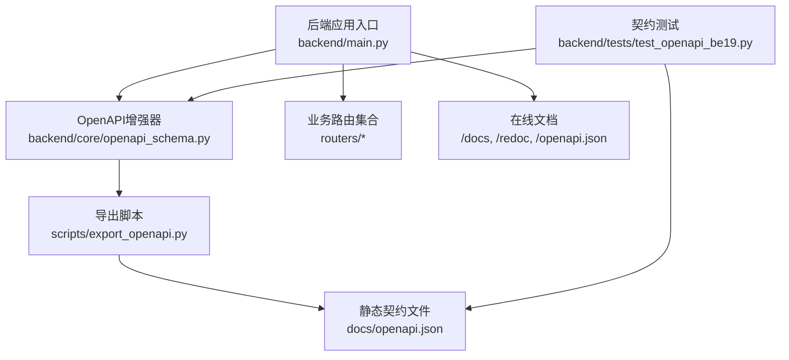
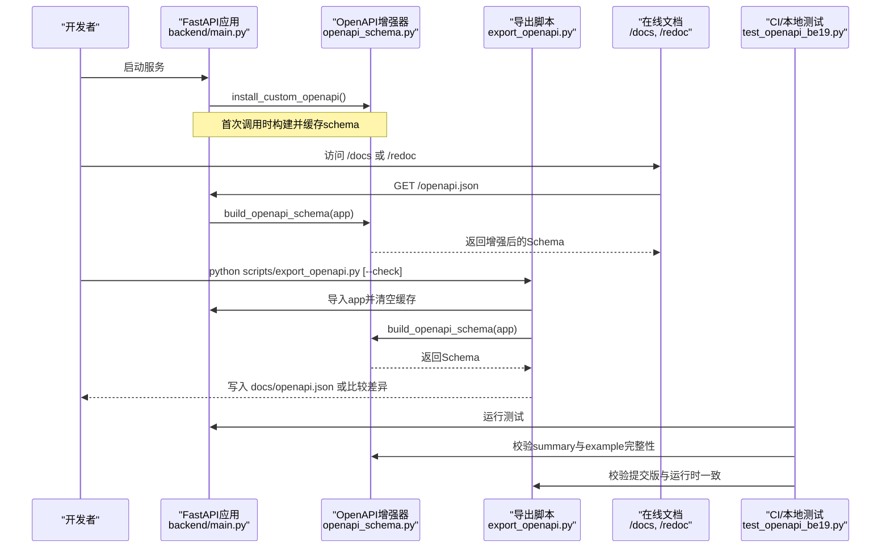
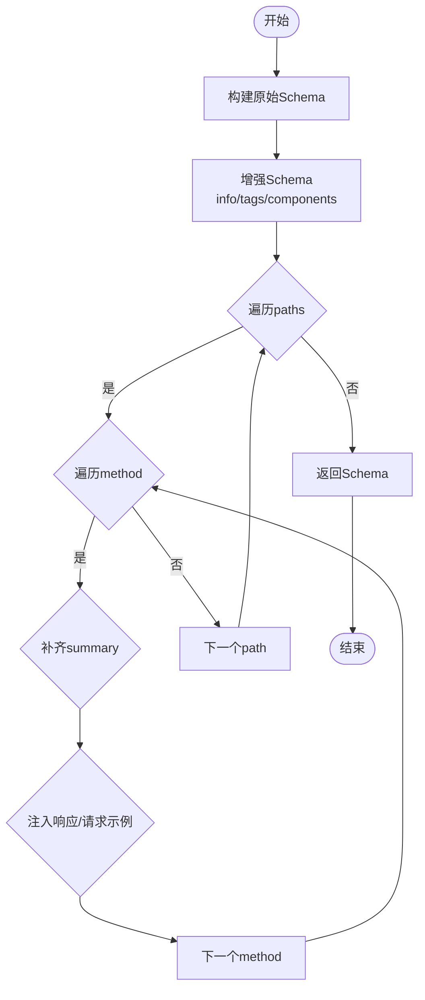
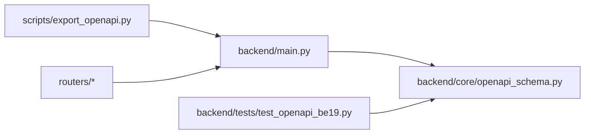

# API文档生成与管理

<cite>
**本文引用的文件**
- [backend/core/openapi_schema.py](file://backend/core/openapi_schema.py)
- [scripts/export_openapi.py](file://scripts/export_openapi.py)
- [backend/main.py](file://backend/main.py)
- [docs/10. API接口规范.md](file://docs/10. API接口规范.md)
- [docs/openapi.json](file://docs/openapi.json)
- [backend/tests/test_openapi_be19.py](file://backend/tests/test_openapi_be19.py)
- [backend/routers/auth.py](file://backend/routers/auth.py)
</cite>

## 目录
1. [简介](#简介)
2. [项目结构](#项目结构)
3. [核心组件](#核心组件)
4. [架构总览](#架构总览)
5. [详细组件分析](#详细组件分析)
6. [依赖关系分析](#依赖关系分析)
7. [性能与可维护性](#性能与可维护性)
8. [故障排查指南](#故障排查指南)
9. [结论](#结论)
10. [附录：最佳实践与团队协作规范](#附录最佳实践与团队协作规范)

## 简介
本文件面向Quant Agent项目的API文档生成与管理体系，聚焦OpenAPI/Swagger集成、自动文档生成、Schema定义规范、版本管理与变更追踪、向后兼容性保证、自定义注解与标签分组、示例数据注入机制、导出工具使用、在线文档部署、文档测试与契约验证、以及自动化测试集成与维护协作规范。目标是让前后端团队基于机器可读的单一事实来源（SSOT）高效协作，确保接口契约稳定、可演进、可追溯。

## 项目结构
本项目采用FastAPI作为Web框架，通过统一的OpenAPI增强模块在运行时构建并增强Schema，配合脚本将Schema导出为仓库中的静态文件，供Swagger UI、Redoc及CI校验使用。

图表来源
- [backend/main.py:125-218](file://backend/main.py#L125-L218)
- [backend/core/openapi_schema.py:191-276](file://backend/core/openapi_schema.py#L191-L276)
- [scripts/export_openapi.py:32-83](file://scripts/export_openapi.py#L32-L83)
- [backend/tests/test_openapi_be19.py:18-130](file://backend/tests/test_openapi_be19.py#L18-L130)

章节来源
- [backend/main.py:125-218](file://backend/main.py#L125-L218)
- [backend/core/openapi_schema.py:191-276](file://backend/core/openapi_schema.py#L191-L276)
- [scripts/export_openapi.py:32-83](file://scripts/export_openapi.py#L32-L83)
- [backend/tests/test_openapi_be19.py:18-130](file://backend/tests/test_openapi_be19.py#L18-L130)

## 核心组件
- OpenAPI增强器：统一Info/Tags、补齐缺失summary、注入响应与请求示例、注册ApiResponse组件。
- 应用装配：创建FastAPI实例、挂载路由、安装自定义openapi方法、配置CORS与中间件。
- 导出脚本：从运行时的app构建并导出openapi.json，支持--check模式用于CI。
- 契约测试：断言所有operation具备summary与JSON示例；校验提交版与运行时一致性。
- 人工文档：docs/10. API接口规范.md作为人类可读契约，以openapi.json为SSOT。

章节来源
- [backend/core/openapi_schema.py:191-276](file://backend/core/openapi_schema.py#L191-L276)
- [backend/main.py:125-218](file://backend/main.py#L125-L218)
- [scripts/export_openapi.py:32-83](file://scripts/export_openapi.py#L32-L83)
- [backend/tests/test_openapi_be19.py:18-130](file://backend/tests/test_openapi_be19.py#L18-L130)
- [docs/10. API接口规范.md:1-20](file://docs/10. API接口规范.md#L1-L20)

## 架构总览
下图展示了从路由到OpenAPI Schema再到在线文档与静态文件的完整流程。

图表来源
- [backend/main.py:125-218](file://backend/main.py#L125-L218)
- [backend/core/openapi_schema.py:254-276](file://backend/core/openapi_schema.py#L254-L276)
- [scripts/export_openapi.py:32-83](file://scripts/export_openapi.py#L32-L83)
- [backend/tests/test_openapi_be19.py:18-130](file://backend/tests/test_openapi_be19.py#L18-L130)

## 详细组件分析

### OpenAPI增强器（backend/core/openapi_schema.py）
- 功能要点
  - 统一Info/Tags：设置标题、版本、描述与全局标签列表。
  - 自动补齐summary：优先使用覆盖表，其次从docstring首行或路径推导。
  - 注入示例：为常见HTTP状态码注入统一信封示例；为requestBody注入占位示例。
  - 组件注册：定义ApiResponse组件，包含code/msg/data/ts等字段。
  - 提供迭代器：遍历paths/methods/operations以便测试与审计。
- 关键函数
  - enrich_openapi_schema(schema)：就地增强Schema。
  - build_openapi_schema(app)：基于routes生成原始Schema并增强。
  - install_custom_openapi(app)：替换FastAPI默认openapi方法，实现懒加载与缓存。
  - iter_operations(schema)：枚举所有操作，便于测试断言。

图表来源
- [backend/core/openapi_schema.py:191-276](file://backend/core/openapi_schema.py#L191-L276)

章节来源
- [backend/core/openapi_schema.py:191-276](file://backend/core/openapi_schema.py#L191-L276)

### 应用装配（backend/main.py）
- 关键点
  - 创建FastAPI实例时传入title/version/description/openapi_tags。
  - 调用install_custom_openapi(app)启用增强逻辑。
  - 挂载各业务路由（统一前缀/api/v1）。
  - 配置CORS与中间件，确保跨域与日志记录顺序正确。
- 在线文档
  - FastAPI默认暴露/docs与/redoc，读取/openapi.json。
  - 由于已安装自定义openapi方法，访问这些端点时会触发增强后的Schema生成。

章节来源
- [backend/main.py:125-218](file://backend/main.py#L125-L218)

### 导出工具（scripts/export_openapi.py）
- 功能
  - 导入后端app，清空openapi_schema缓存，调用build_openapi_schema生成最新Schema。
  - 输出到docs/openapi.json，支持--check模式比对差异并在不一致时退出非零码。
  - 统计paths数量，便于CI报告。
- 使用方式
  - 生成：python scripts/export_openapi.py
  - 校验：python scripts/export_openapi.py --check

章节来源
- [scripts/export_openapi.py:32-83](file://scripts/export_openapi.py#L32-L83)

### 契约测试（backend/tests/test_openapi_be19.py）
- 断言内容
  - 每个operation必须有summary。
  - 每个JSON响应必须包含example（跳过WebSocket等非JSON场景）。
  - info与ApiResponse组件存在且有效。
  - 健康检查与对话接口的summary被正确覆盖。
  - 提交版openapi.json与运行时app保持一致（单向包含策略：提交版路径必须是运行时子集）。
- 作用
  - 保障文档质量与契约稳定性，防止遗漏示例或摘要。
  - 在CI中拦截过期或不一致的文档产物。

章节来源
- [backend/tests/test_openapi_be19.py:18-130](file://backend/tests/test_openapi_be19.py#L18-L130)

### 路由与标签分组（示例：认证路由）
- 路由组织
  - 使用APIRouter(prefix="/auth", tags=["Auth"])进行分组。
  - 标签名称需与全局OPENAPI_TAGS保持一致，便于UI分组展示。
- 示例
  - 登录、刷新Token、登出、修改密码、获取当前用户等接口均遵循统一响应信封。
  - 鉴权依赖get_current_user通过OAuth2Bearer解析JWT。

章节来源
- [backend/routers/auth.py:100-162](file://backend/routers/auth.py#L100-L162)

### 人工文档与机器契约
- 人工文档（docs/10. API接口规范.md）
  - 明确Base URL、统一响应结构、鉴权方式、错误码表、分页约定等。
  - 强调以openapi.json为SSOT，冲突时以代码导出的为准。
- 机器契约（docs/openapi.json）
  - 由export_openapi.py从运行时app导出，保证与代码同步。
  - 供Swagger UI、Redoc、契约测试与第三方工具消费。

章节来源
- [docs/10. API接口规范.md:1-20](file://docs/10. API接口规范.md#L1-L20)
- [docs/openapi.json](file://docs/openapi.json)

## 依赖关系分析
- 组件耦合
  - main.py依赖openapi_schema.py提供的增强能力，并通过install_custom_openapi注入。
  - export_openapi.py依赖main.py中的app实例与openapi_schema.py的构建逻辑。
  - test_openapi_be19.py依赖openapi_schema.py的增强结果与iter_operations进行断言。
- 外部依赖
  - FastAPI内置的OpenAPI生成能力。
  - Pydantic模型（由各路由定义）驱动Schema属性与示例推断。
- 潜在风险
  - 若路由未声明responses或content类型，可能导致示例缺失；增强器会尽力补全但建议显式声明。
  - WebSocket与SSE等非JSON通道不适用JSON envelope示例，测试中已做豁免。

图表来源
- [backend/main.py:125-218](file://backend/main.py#L125-L218)
- [backend/core/openapi_schema.py:191-276](file://backend/core/openapi_schema.py#L191-L276)
- [scripts/export_openapi.py:32-83](file://scripts/export_openapi.py#L32-L83)
- [backend/tests/test_openapi_be19.py:18-130](file://backend/tests/test_openapi_be19.py#L18-L130)

章节来源
- [backend/main.py:125-218](file://backend/main.py#L125-L218)
- [backend/core/openapi_schema.py:191-276](file://backend/core/openapi_schema.py#L191-L276)
- [scripts/export_openapi.py:32-83](file://scripts/export_openapi.py#L32-L83)
- [backend/tests/test_openapi_be19.py:18-130](file://backend/tests/test_openapi_be19.py#L18-L130)

## 性能与可维护性
- 性能
  - openapi_schema在首次访问时构建并缓存，避免重复计算。
  - 导出脚本在CI中仅生成一次，--check模式快速比对。
- 可维护性
  - 统一标签与示例减少文档碎片化。
  - 通过测试强制要求summary与example，降低回归风险。
  - 人工文档与机器契约分离，职责清晰。

[本节为通用指导，不直接分析具体文件]

## 故障排查指南
- 常见问题
  - 缺少summary：检查路由装饰器的docstring或SUMMARY_OVERRIDES覆盖项。
  - 缺少响应示例：确保responses中声明application/json并包含example或examples。
  - 导出失败：确认环境变量与数据库连接可用；必要时使用测试DB。
  - CI校验失败：运行python scripts/export_openapi.py更新docs/openapi.json。
- 定位步骤
  - 访问/openapi.json查看当前Schema。
  - 运行test_openapi_be19.py定位缺失项。
  - 对比docs/openapi.json与运行时Schema差异。

章节来源
- [backend/tests/test_openapi_be19.py:60-130](file://backend/tests/test_openapi_be19.py#L60-L130)
- [scripts/export_openapi.py:41-83](file://scripts/export_openapi.py#L41-L83)

## 结论
本项目通过FastAPI原生能力与自定义增强器实现了高质量的OpenAPI文档自动生成与校验。结合导出脚本与契约测试，确保了机器契约与代码的一致性，降低了前后端协作成本。建议在新增路由时同步完善summary、responses与示例，并在CI中强制执行文档质量门禁。

[本节为总结性内容，不直接分析具体文件]

## 附录：最佳实践与团队协作规范
- 文档版本管理
  - 版本号来源于环境变量QUANT_API_VERSION，统一在openapi_schema中引用。
  - 每次发布前运行export_openapi.py更新docs/openapi.json并提交。
- 变更追踪
  - 通过CI的--check模式检测openapi.json是否过期。
  - 人工文档与机器契约冲突时，以机器契约为准并回写人工文档。
- 向后兼容性
  - 删除路由视为破坏性变更，测试会报错；新增路由允许增量。
  - 保持统一响应信封与错误码表不变，避免客户端适配成本。
- 自定义注解与标签分组
  - 使用APIRouter的tags参数与全局OPENAPI_TAGS保持一致。
  - 对重要路径可通过SUMMARY_OVERRIDES提供精炼summary。
- 示例数据注入
  - 为requestBody与responses注入示例，提升Swagger体验。
  - 复杂对象建议使用Pydantic模型，便于自动推断属性与示例。
- 在线文档部署
  - 运行服务后访问/docs与/redoc查看在线文档。
  - 生产环境可通过反向代理暴露/openapi.json供第三方消费。
- 文档测试与契约验证
  - 运行pytest backend/tests/test_openapi_be19.py执行契约测试。
  - 在CI中加入export_openapi.py --check，确保文档与代码同步。
- 自动化测试集成
  - 将契约测试纳入PR检查，阻止无摘要或缺少示例的合并。
  - 结合端到端测试验证关键接口的响应结构与错误码。
- 团队协作规范
  - 新增或修改路由时，同步更新路由docstring与responses。
  - 定期审查docs/10. API接口规范.md，确保与openapi.json一致。
  - 使用统一标签分组，便于前端按模块组织调用。

[本节为通用指导，不直接分析具体文件]