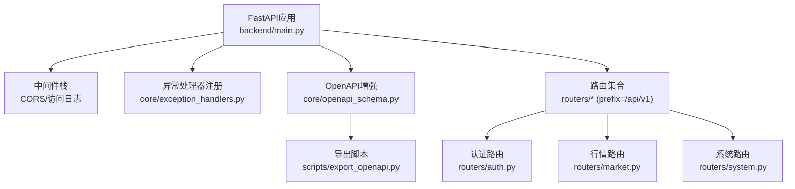
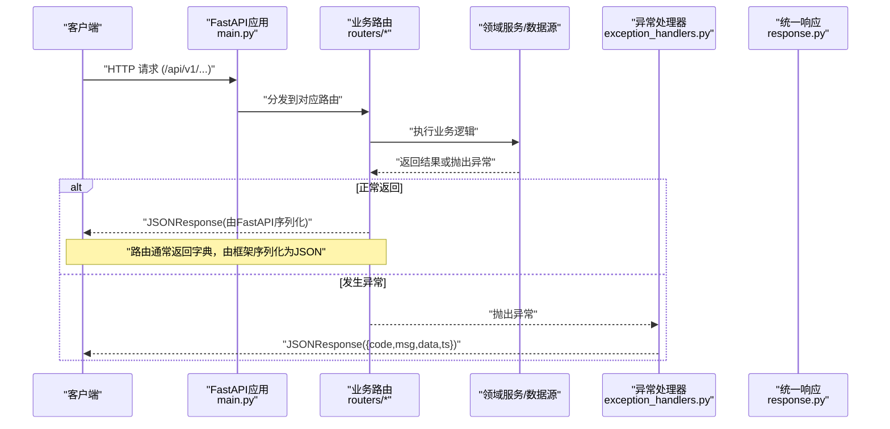
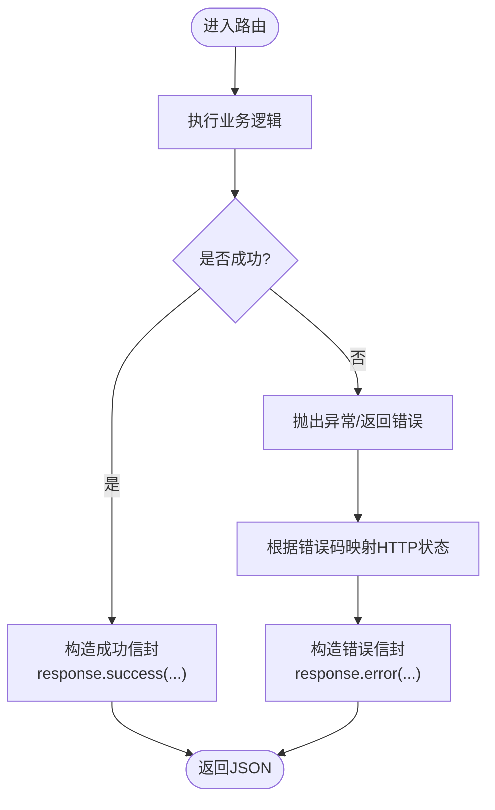
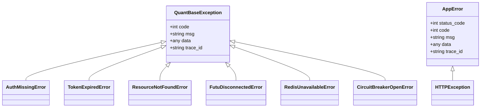
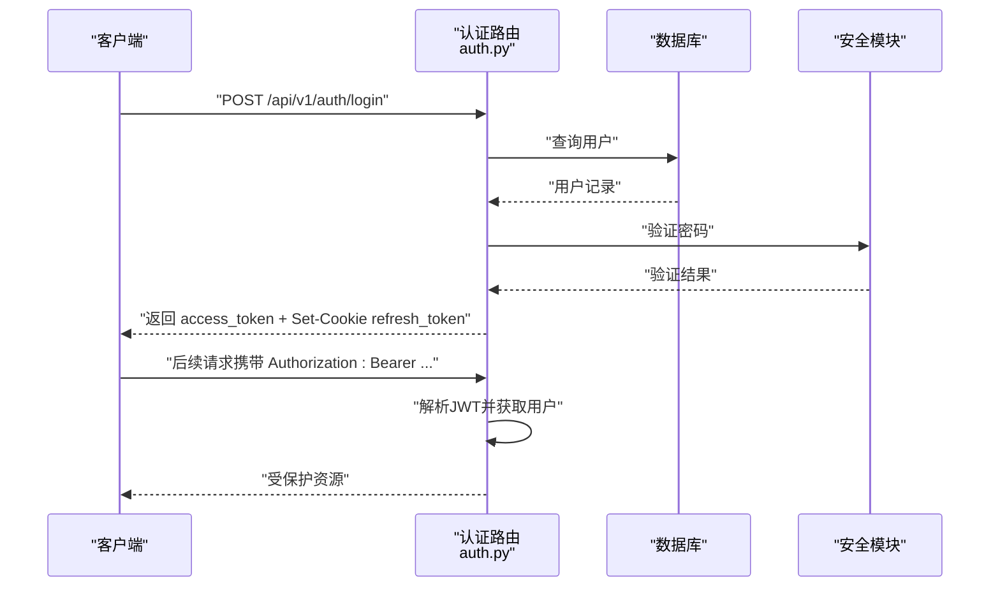
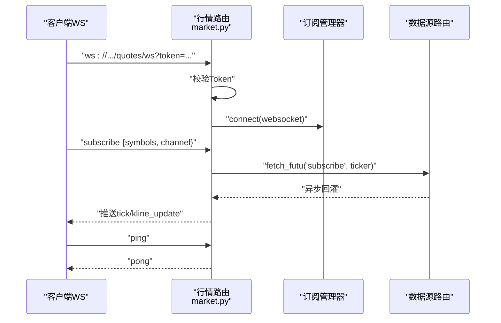
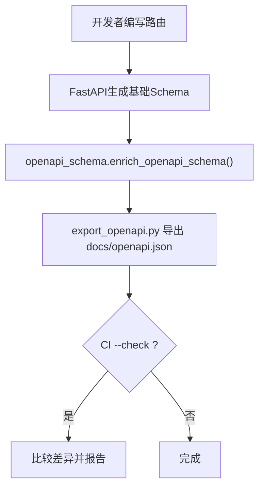
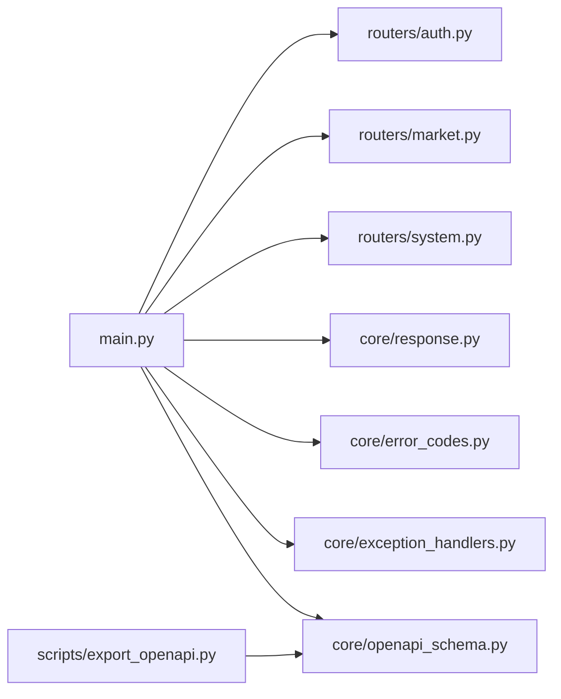

# RESTful API设计原则

<cite>
**本文引用的文件**
- [backend/main.py](file://backend/main.py)
- [backend/core/response.py](file://backend/core/response.py)
- [backend/core/openapi_schema.py](file://backend/core/openapi_schema.py)
- [backend/core/error_codes.py](file://backend/core/error_codes.py)
- [backend/core/exception_handlers.py](file://backend/core/exception_handlers.py)
- [backend/core/exceptions.py](file://backend/core/exceptions.py)
- [backend/routers/auth.py](file://backend/routers/auth.py)
- [backend/routers/market.py](file://backend/routers/market.py)
- [backend/routers/system.py](file://backend/routers/system.py)
- [scripts/export_openapi.py](file://scripts/export_openapi.py)
- [docs/10. API接口规范.md](file://docs/10. API接口规范.md)
</cite>

## 目录
1. [简介](#简介)
2. [项目结构](#项目结构)
3. [核心组件](#核心组件)
4. [架构总览](#架构总览)
5. [详细组件分析](#详细组件分析)
6. [依赖关系分析](#依赖关系分析)
7. [性能与可观测性](#性能与可观测性)
8. [故障排查指南](#故障排查指南)
9. [结论](#结论)
10. [附录：新API开发规范与示例](#附录新api开发规范与示例)

## 简介
本文件面向Quant Agent后端RESTful API的设计与实现，聚焦以下目标：
- HTTP方法使用规范（GET、POST、PUT、DELETE）与URL命名约定、资源标识符设计
- 状态码标准使用（200、201、400、401、404、500等）及错误码映射
- 请求头规范与统一响应信封设计
- 版本控制策略（/api/v1/前缀）、分页机制、过滤与排序参数
- 具体API端点示例，展示正确的RESTful实践
- OpenAPI/Swagger集成与自动生成文档的最佳实践
- 新API开发的完整规范与代码级参考路径

## 项目结构
后端采用FastAPI构建，应用工厂集中创建并挂载路由，所有业务路由统一以 /api/{version} 前缀注册。OpenAPI增强模块负责注入统一响应示例、标签与摘要；异常处理器将各类异常统一转换为标准信封格式；认证、行情、系统等路由分别按领域拆分。

**图表来源**
- [backend/main.py:125-218](file://backend/main.py#L125-L218)
- [backend/core/openapi_schema.py:191-276](file://backend/core/openapi_schema.py#L191-L276)
- [scripts/export_openapi.py:32-83](file://scripts/export_openapi.py#L32-L83)

**章节来源**
- [backend/main.py:120-218](file://backend/main.py#L120-L218)
- [backend/core/openapi_schema.py:191-276](file://backend/core/openapi_schema.py#L191-L276)
- [scripts/export_openapi.py:32-83](file://scripts/export_openapi.py#L32-L83)

## 核心组件
- 统一响应信封：成功返回 {code, msg, data, ts}；错误返回同结构并附带可选 trace_id。
- 错误码体系：ErrorCode枚举定义业务错误码，并与HTTP状态码映射。
- 全局异常处理：捕获自定义异常、HTTP异常、参数校验异常与未处理异常，统一输出信封。
- OpenAPI增强：自动补齐summary、description、响应示例与请求示例，提供ApiResponse组件。
- 版本化前缀：通过环境变量控制API版本，默认 /api/v1。

**章节来源**
- [backend/core/response.py:26-69](file://backend/core/response.py#L26-L69)
- [backend/core/error_codes.py:15-54](file://backend/core/error_codes.py#L15-L54)
- [backend/core/exception_handlers.py:18-101](file://backend/core/exception_handlers.py#L18-L101)
- [backend/core/openapi_schema.py:191-276](file://backend/core/openapi_schema.py#L191-L276)
- [backend/main.py:120-134](file://backend/main.py#L120-L134)

## 架构总览
下图展示了从客户端到路由再到服务层的典型调用链，以及异常如何被统一处理为信封响应。

**图表来源**
- [backend/main.py:125-218](file://backend/main.py#L125-L218)
- [backend/core/exception_handlers.py:18-101](file://backend/core/exception_handlers.py#L18-L101)
- [backend/core/response.py:26-69](file://backend/core/response.py#L26-L69)

## 详细组件分析

### 版本控制与路由挂载
- 版本前缀：通过环境变量 API_URL_VERSION 决定，默认 v1，所有业务路由统一挂载在 /api/v1。
- 路由组织：每个领域一个router文件，通过 include_router(prefix=API_PREFIX) 集中挂载。
- 健康检查与内部接口：系统健康检查位于 /api/v1/health 等；内部接口用于工具链通信。

**章节来源**
- [backend/main.py:120-218](file://backend/main.py#L120-L218)

### 统一响应信封与错误码
- 成功响应：{code: 0, msg: "ok", data: {...}, ts: 毫秒时间戳}
- 错误响应：{code: 业务错误码, msg: "可读描述", data: 附加信息, ts: 毫秒时间戳, trace_id: 可选}
- 错误码映射：ErrorCode枚举与HTTP状态码映射表确保一致的状态语义。

**图表来源**
- [backend/core/response.py:26-69](file://backend/core/response.py#L26-L69)
- [backend/core/error_codes.py:40-54](file://backend/core/error_codes.py#L40-L54)

**章节来源**
- [backend/core/response.py:26-69](file://backend/core/response.py#L26-L69)
- [backend/core/error_codes.py:15-54](file://backend/core/error_codes.py#L15-L54)

### 全局异常处理
- QuantBaseException及其子类：统一携带 code、msg、data、trace_id。
- HTTPException：直接转为信封，保持HTTP语义。
- RequestValidationError：参数校验失败统一为 code=2001，附带字段级错误列表。
- 兜底异常：记录trace_id并返回500。

**图表来源**
- [backend/core/exceptions.py:14-144](file://backend/core/exceptions.py#L14-L144)
- [backend/core/exception_handlers.py:18-101](file://backend/core/exception_handlers.py#L18-L101)

**章节来源**
- [backend/core/exception_handlers.py:18-101](file://backend/core/exception_handlers.py#L18-L101)
- [backend/core/exceptions.py:14-144](file://backend/core/exceptions.py#L14-L144)

### 认证与鉴权
- JWT Bearer Token：Authorization: Bearer <access_token>
- Cookie Refresh Token：HttpOnly、Secure（生产环境）、SameSite配置
- 登录、刷新、登出、当前用户信息接口位于 /api/v1/auth/*

**图表来源**
- [backend/routers/auth.py:117-162](file://backend/routers/auth.py#L117-L162)
- [backend/routers/auth.py:65-98](file://backend/routers/auth.py#L65-L98)

**章节来源**
- [backend/routers/auth.py:117-162](file://backend/routers/auth.py#L117-L162)
- [backend/routers/auth.py:65-98](file://backend/routers/auth.py#L65-L98)

### 行情与WebSocket
- REST：获取实时快照、历史K线、资金流向、期权链等
- WebSocket：连接鉴权（QueryString token）、心跳保活、订阅去重、背压保护

**图表来源**
- [backend/routers/market.py:73-200](file://backend/routers/market.py#L73-L200)

**章节来源**
- [backend/routers/market.py:73-200](file://backend/routers/market.py#L73-L200)

### 系统监控与APM
- 健康检查：/api/v1/health
- 可观测性总览：/api/v1/system/observability
- 数据质量看板：/api/v1/system/data-quality
- 性能日志：/api/v1/system/performance-logs（支持筛选与分页）

**章节来源**
- [backend/routers/system.py:88-200](file://backend/routers/system.py#L88-L200)

### OpenAPI/Swagger集成
- 在线文档：/docs（Swagger UI）、/redoc
- 原始Schema：/openapi.json
- 导出脚本：scripts/export_openapi.py（支持--check校验）
- 增强内容：统一ApiResponse组件、operation summary/description、响应与请求示例注入

**图表来源**
- [backend/core/openapi_schema.py:191-276](file://backend/core/openapi_schema.py#L191-L276)
- [scripts/export_openapi.py:32-83](file://scripts/export_openapi.py#L32-L83)

**章节来源**
- [backend/core/openapi_schema.py:191-276](file://backend/core/openapi_schema.py#L191-L276)
- [scripts/export_openapi.py:32-83](file://scripts/export_openapi.py#L32-L83)

## 依赖关系分析
- main.py 负责应用组装、中间件注册、路由挂载与静态资源挂载。
- routers/* 按领域划分，依赖 core 层的安全、数据库、服务与工具。
- core/response.py、error_codes.py、exception_handlers.py 提供统一的响应与错误处理。
- openapi_schema.py 对FastAPI的schema进行增强，export_openapi.py 用于导出契约。

**图表来源**
- [backend/main.py:125-218](file://backend/main.py#L125-L218)
- [backend/core/openapi_schema.py:191-276](file://backend/core/openapi_schema.py#L191-L276)
- [scripts/export_openapi.py:32-83](file://scripts/export_openapi.py#L32-L83)

**章节来源**
- [backend/main.py:125-218](file://backend/main.py#L125-L218)
- [backend/core/openapi_schema.py:191-276](file://backend/core/openapi_schema.py#L191-L276)
- [scripts/export_openapi.py:32-83](file://scripts/export_openapi.py#L32-L83)

## 性能与可观测性
- 中间件顺序：AccessLogMiddleware在CORSMiddleware内层执行，避免OPTIONS预检产生400。
- WebSocket心跳：超时60秒无心跳断开，防止僵尸连接。
- 指标暴露：Prometheus指标（如WS_MESSAGES_SENT）用于监控消息发送量。
- 可观测性接口：聚合tick缓存命中率、FMP credit消耗、运行时状态等。

**章节来源**
- [backend/main.py:145-160](file://backend/main.py#L145-L160)
- [backend/routers/market.py:31-36](file://backend/routers/market.py#L31-L36)
- [backend/routers/system.py:88-132](file://backend/routers/system.py#L88-L132)

## 故障排查指南
- 参数校验失败：查看data中的字段级错误列表，修正请求体。
- 认证失败：检查Authorization头或Cookie中的Token是否有效或过期。
- 外部依赖不可用：关注503状态码与错误码（如Futu断开、Redis不可用、熔断器打开）。
- 未处理异常：定位trace_id并在后端日志中搜索对应条目。

**章节来源**
- [backend/core/exception_handlers.py:45-90](file://backend/core/exception_handlers.py#L45-L90)
- [backend/core/error_codes.py:40-54](file://backend/core/error_codes.py#L40-L54)

## 结论
本项目通过统一响应信封、标准化错误码、全局异常处理与OpenAPI增强，构建了清晰、可维护且易于集成的RESTful API体系。版本化前缀、领域化路由与中间件栈确保了可扩展性与可观测性。遵循本文档的规范，可快速新增API并保持契约一致性。

## 附录：新API开发规范与示例

### HTTP方法与URL命名约定
- GET：读取资源（如 /api/v1/market/quote）
- POST：创建资源或触发操作（如 /api/v1/trade/order）
- PUT：更新资源（如 /api/v1/settings/*）
- DELETE：删除资源（如 /api/v1/alerts/{id}）
- URL使用小写、短横线分隔名词复数，资源层级清晰，避免动词出现在路径中

### 资源标识符设计
- 使用稳定ID作为资源标识（如 orders/{order_id}）
- 查询参数用于过滤、排序、分页（如 limit、cursor、sort_by）

### 状态码标准使用
- 200：成功
- 201：创建成功
- 400：请求参数校验失败
- 401：未认证或Token无效
- 404：资源不存在
- 500：内部服务器错误

### 请求头规范
- Authorization: Bearer <access_token>
- Content-Type: application/json
- Accept: application/json（或 text/event-stream 用于SSE）

### 统一响应信封
- 成功：{code: 0, msg: "ok", data: {...}, ts: 毫秒时间戳}
- 错误：{code: 业务错误码, msg: "可读描述", data: 附加信息, ts: 毫秒时间戳, trace_id: 可选}

### 版本控制策略
- Base URL：/api/v1/*
- 通过环境变量 API_URL_VERSION 控制版本前缀

### 分页机制
- 游标分页：cursor-based，返回 next_cursor 与 has_more
- 示例：GET /api/v1/orders?cursor=<last_id>&limit=50

### 过滤与排序参数
- 过滤：使用查询参数（如 symbol、ktype、num）
- 排序：sort_by、order（asc/desc）

### 具体API端点示例
- 认证：POST /api/v1/auth/login
- 行情：GET /api/v1/market/quote?symbols=AAPL,TSLA
- 历史K线：GET /api/v1/market/history?ticker=AAPL&ktype=K_DAY&num=200
- 系统健康：GET /api/v1/health

**章节来源**
- [docs/10. API接口规范.md:23-94](file://docs/10. API接口规范.md#L23-L94)
- [docs/10. API接口规范.md:96-142](file://docs/10. API接口规范.md#L96-L142)
- [docs/10. API接口规范.md:144-258](file://docs/10. API接口规范.md#L144-L258)
- [docs/10. API接口规范.md:400-462](file://docs/10. API接口规范.md#L400-L462)

### OpenAPI/Swagger最佳实践
- 每个operation必须包含summary
- 响应示例必须包含统一信封
- 使用export_openapi.py导出并纳入CI校验

**章节来源**
- [backend/core/openapi_schema.py:191-276](file://backend/core/openapi_schema.py#L191-L276)
- [scripts/export_openapi.py:32-83](file://scripts/export_openapi.py#L32-L83)

### 新API开发步骤
1. 在对应routers目录下新建或扩展路由文件
2. 定义Pydantic模型用于请求/响应校验
3. 实现路由函数，返回字典（由FastAPI序列化为JSON）
4. 使用success()/error()构造统一响应
5. 添加OpenAPI tags与summary
6. 运行export_openapi.py并校验契约
7. 编写单元测试覆盖正常与异常路径

**章节来源**
- [backend/core/response.py:26-69](file://backend/core/response.py#L26-L69)
- [backend/core/openapi_schema.py:191-276](file://backend/core/openapi_schema.py#L191-L276)
- [scripts/export_openapi.py:32-83](file://scripts/export_openapi.py#L32-L83)