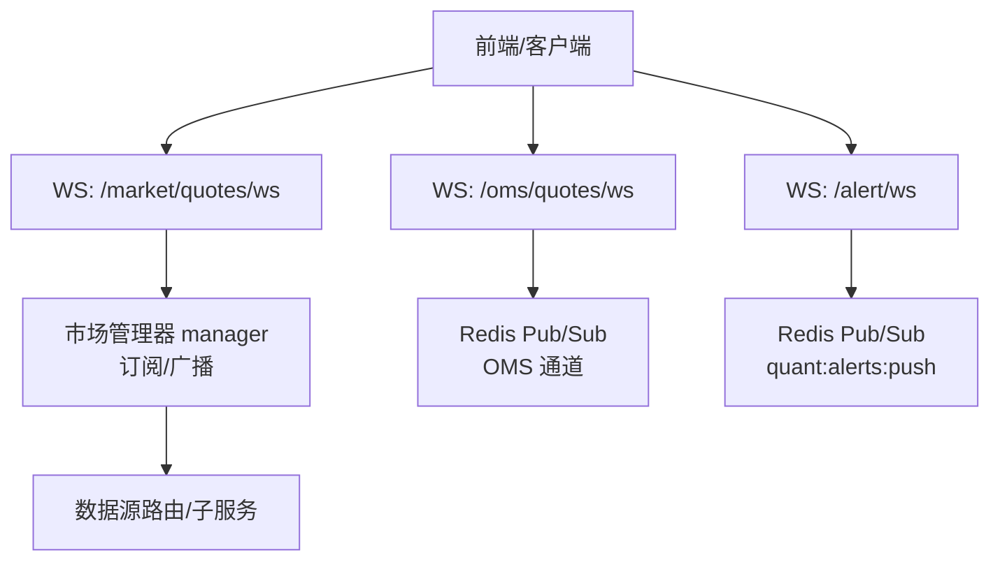
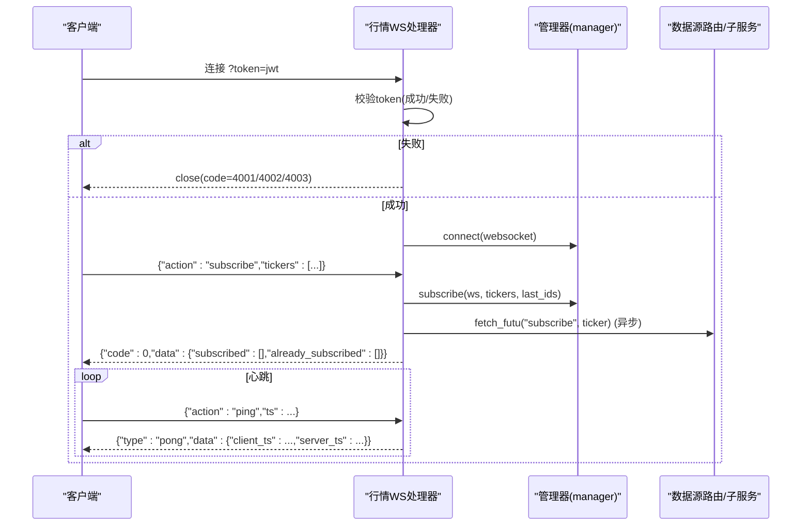
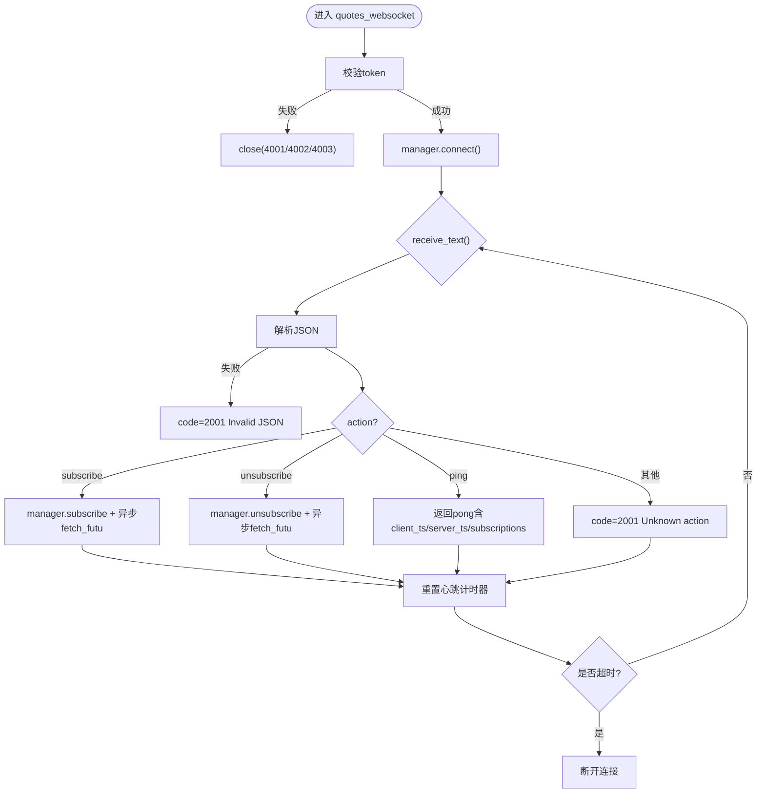
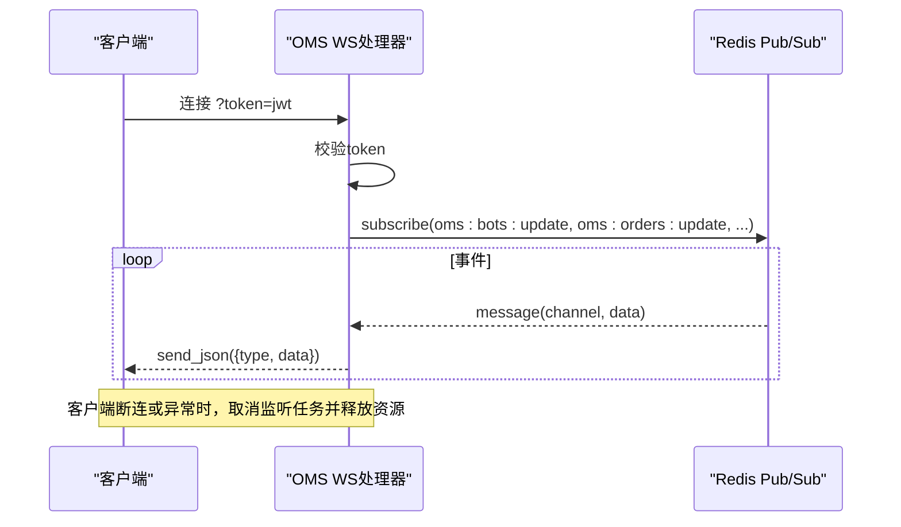
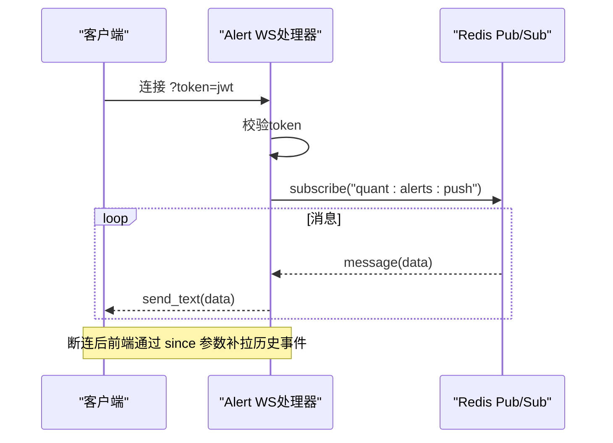
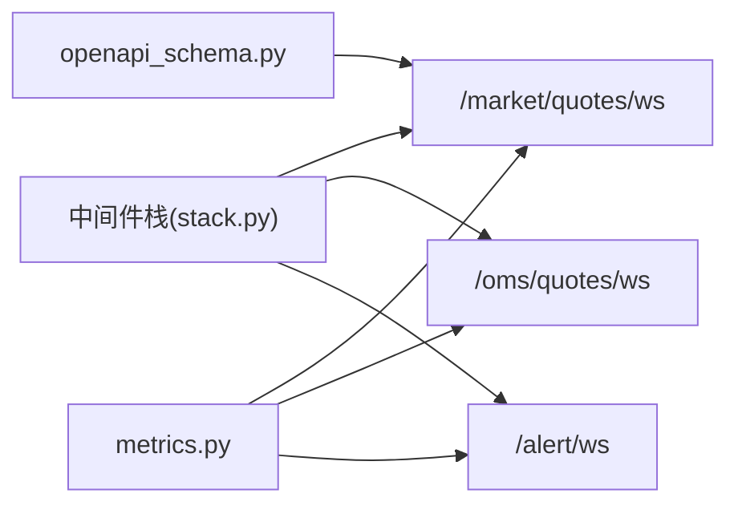

# WebSocket接口规范

<cite>
**本文引用的文件**
- [backend/routers/market.py](file://backend/routers/market.py)
- [backend/routers/oms.py](file://backend/routers/oms.py)
- [backend/routers/alert.py](file://backend/routers/alert.py)
- [backend/core/metrics.py](file://backend/core/metrics.py)
- [backend/tests/test_market_websocket_auth.py](file://backend/tests/test_market_websocket_auth.py)
- [backend/middleware/stack.py](file://backend/middleware/stack.py)
- [backend/core/openapi_schema.py](file://backend/core/openapi_schema.py)
- [scripts/locust_ws_stress.py](file://scripts/locust_ws_stress.py)
</cite>

## 目录
1. [简介](#简介)
2. [项目结构](#项目结构)
3. [核心组件](#核心组件)
4. [架构总览](#架构总览)
5. [详细组件分析](#详细组件分析)
6. [依赖关系分析](#依赖关系分析)
7. [性能与内存优化](#性能与内存优化)
8. [故障排查指南](#故障排查指南)
9. [结论](#结论)
10. [附录：客户端集成示例](#附录客户端集成示例)

## 简介
本规范定义 Quant Agent 的 WebSocket 实时通信协议，覆盖连接建立、鉴权、心跳保活、断线重连、消息协议格式、事件类型、推送模式，以及行情推送、订单状态更新、系统通知的实现细节。同时给出连接池管理、并发控制、内存优化策略，以及与 REST API 的协作和状态同步策略。

## 项目结构
后端提供三类 WebSocket 端点：
- 行情订阅：/market/quotes/ws（多标的实时报价）
- OMS 推送：/oms/quotes/ws（订单、成交、持仓、机器人状态等）
- 告警推送：/alert/ws（告警事件）

这些端点通过 Redis Pub/Sub 或进程内管理器进行广播，统一由中间件栈注册并暴露给前端。

**图表来源**
- [backend/routers/market.py:73-226](file://backend/routers/market.py#L73-L226)
- [backend/routers/oms.py:380-464](file://backend/routers/oms.py#L380-L464)
- [backend/routers/alert.py:148-211](file://backend/routers/alert.py#L148-L211)

**章节来源**
- [backend/routers/market.py:73-226](file://backend/routers/market.py#L73-L226)
- [backend/routers/oms.py:380-464](file://backend/routers/oms.py#L380-L464)
- [backend/routers/alert.py:148-211](file://backend/routers/alert.py#L148-L211)
- [backend/middleware/stack.py:68-70](file://backend/middleware/stack.py#L68-L70)
- [backend/core/openapi_schema.py:100](file://backend/core/openapi_schema.py#L100)

## 核心组件
- 行情 WebSocket 处理器：负责连接鉴权、心跳、订阅/退订、消息分发与背压保护。
- OMS WebSocket 处理器：基于 Redis Pub/Sub 将订单、成交、持仓、机器人日志等事件推送到前端。
- 告警 WebSocket 处理器：订阅 Redis 通道推送告警事件，支持 since 补拉。
- 指标体系：统计活跃连接数、发送消息数、丢弃消息数、订阅数等。

**章节来源**
- [backend/routers/market.py:73-226](file://backend/routers/market.py#L73-L226)
- [backend/routers/oms.py:380-464](file://backend/routers/oms.py#L380-L464)
- [backend/routers/alert.py:148-211](file://backend/routers/alert.py#L148-L211)
- [backend/core/metrics.py:53-72](file://backend/core/metrics.py#L53-L72)

## 架构总览
- 连接与鉴权：所有 WS 端点均要求 Query String token（JWT），校验失败返回特定关闭码。
- 心跳与超时：行情 WS 维护 last_heartbeat 计时器，超过阈值主动断开；OMS/告警 WS 通过接收循环保持活跃。
- 订阅与广播：行情 WS 使用进程内管理器进行订阅去重与广播；OMS/告警 WS 通过 Redis Pub/Sub 转发。
- 降级与容错：行情 WS 对未知 action、非法 JSON、重复订阅等均有明确错误响应；OMS/告警在 Redis 不可用时记录警告并保持连接。

**图表来源**
- [backend/routers/market.py:73-226](file://backend/routers/market.py#L73-L226)

**章节来源**
- [backend/routers/market.py:73-226](file://backend/routers/market.py#L73-L226)

## 详细组件分析

### 行情 WebSocket（/market/quotes/ws）
- 连接鉴权：从 query_params 取 token，解码 JWT，校验 sub 字段；缺失/过期/无效分别返回 4001/4002/4003。
- 心跳保活：每次收到消息重置 last_heartbeat；超过 _WS_HEARTBEAT_TIMEOUT（60s）主动断开。
- 消息协议：
  - 请求：{"action":"subscribe|unsubscribe|ping", "tickers":string或数组, "last_ids":{ticker:id}, "ts":毫秒时间戳}
  - 响应：{"code":0|2001, "msg":"ok|Unknown action|Invalid JSON|...", "data":{...}, "ts":毫秒时间戳}
  - ping 响应包含 client_ts、server_ts、subscriptions 数量。
- 订阅去重：manager.subscriptions 按 ws 维度维护集合，重复订阅返回 already_subscribed。
- 数据推送：通过 manager.subscribe/unsubscribe 与 broadcast_loop 实现；Futu 标的额外触发 data_source_router.fetch_futu("subscribe"/"unsubscribe")。
- 错误处理：非 JSON、未知 action、非法 tickers 等返回 code=2001。

**图表来源**
- [backend/routers/market.py:73-226](file://backend/routers/market.py#L73-L226)

**章节来源**
- [backend/routers/market.py:73-226](file://backend/routers/market.py#L73-L226)
- [backend/tests/test_market_websocket_auth.py:54-234](file://backend/tests/test_market_websocket_auth.py#L54-L234)

### OMS WebSocket（/oms/quotes/ws）
- 连接鉴权：与行情 WS 一致，使用相同密钥与算法。
- 推送模式：订阅多个 Redis 通道（bots/update、orders/update、trades/new、bot_log/stream、algo_executions/update、positions/update、mode_change），按 channel 包装为 type 字段的事件推送。
- 生命周期：两个协程并行监听 Redis 与客户端；任一结束则取消另一个，释放资源并关闭 Pub/Sub。

**图表来源**
- [backend/routers/oms.py:380-464](file://backend/routers/oms.py#L380-L464)

**章节来源**
- [backend/routers/oms.py:380-464](file://backend/routers/oms.py#L380-L464)

### 告警 WebSocket（/alert/ws）
- 连接鉴权：同前，使用 SECRET_KEY 校验 JWT。
- 推送模式：订阅 quant:alerts:push 通道，将消息原样转发到客户端。
- 降级：若 Redis 订阅失败，记录警告并保持连接，前端可通过 GET /alert/events?since= 补拉。

**图表来源**
- [backend/routers/alert.py:148-211](file://backend/routers/alert.py#L148-L211)

**章节来源**
- [backend/routers/alert.py:148-211](file://backend/routers/alert.py#L148-L211)

## 依赖关系分析
- 中间件栈注册 WS 路径，确保跨域、限流、认证等策略生效。
- OpenAPI 文档标注 WS 端点，便于前端生成 SDK。
- 指标模块提供 WS 连接数、消息发送/丢弃计数、订阅数等观测指标。

**图表来源**
- [backend/middleware/stack.py:68-70](file://backend/middleware/stack.py#L68-L70)
- [backend/core/openapi_schema.py:100](file://backend/core/openapi_schema.py#L100)
- [backend/core/metrics.py:53-72](file://backend/core/metrics.py#L53-L72)

**章节来源**
- [backend/middleware/stack.py:68-70](file://backend/middleware/stack.py#L68-L70)
- [backend/core/openapi_schema.py:100](file://backend/core/openapi_schema.py#L100)
- [backend/core/metrics.py:53-72](file://backend/core/metrics.py#L53-L72)

## 性能与内存优化
- 连接池与并发控制
  - 行情 WS 使用进程内管理器维护订阅集合，避免重复订阅；对 Futu 标的通过异步任务触发订阅/退订，不阻塞 WS ack。
  - OMS WS 使用 asyncio.wait 协调 Redis 监听与客户端监听，任一结束即取消另一侧，防止资源泄漏。
- 背压与丢弃
  - 指标中定义了 WS_MESSAGES_DROPPED 用于统计慢客户端导致的丢弃；建议在发送前检查缓冲区或使用带超时的发送。
- 心跳与超时
  - 行情 WS 心跳超时 60s，建议客户端以小于阈值的频率发送 ping，并在 pong 中计算 RTT。
- 内存优化
  - 订阅集合按 ws 维度存储，及时 unsubscribe 清理；Redis Pub/Sub 在连接关闭时显式 unsubscribe 并 close。
- 可观测性
  - 使用 WS_ACTIVE_CONNECTIONS、WS_MESSAGES_SENT、WS_SUBSCRIPTIONS 等指标监控健康度与容量。

**章节来源**
- [backend/routers/market.py:73-226](file://backend/routers/market.py#L73-L226)
- [backend/routers/oms.py:380-464](file://backend/routers/oms.py#L380-L464)
- [backend/core/metrics.py:53-72](file://backend/core/metrics.py#L53-L72)

## 故障排查指南
- 鉴权失败
  - 无 token：关闭码 4001；token 过期/无效：4002；payload 缺少 sub：4003。
  - 参考测试用例验证分支行为。
- 消息错误
  - 非法 JSON、未知 action：返回 code=2001，附带 msg 提示。
- 连接异常
  - 心跳超时：服务端主动断开；客户端需实现指数退避重连。
  - Redis 不可用：告警 WS 记录警告并保持连接，前端通过 since 补拉。
- 性能问题
  - 观察 WS_MESSAGES_DROPPED 增长；检查客户端消费速度与网络状况。
  - 关注 WS_ACTIVE_CONNECTIONS 与 WS_SUBSCRIPTIONS 峰值，评估扩容。

**章节来源**
- [backend/routers/market.py:73-226](file://backend/routers/market.py#L73-L226)
- [backend/routers/alert.py:148-211](file://backend/routers/alert.py#L148-L211)
- [backend/tests/test_market_websocket_auth.py:54-234](file://backend/tests/test_market_websocket_auth.py#L54-L234)

## 结论
Quant Agent 的 WebSocket 体系围绕“鉴权+心跳+订阅+广播”的核心流程构建，行情 WS 侧重进程内管理与背压保护，OMS/告警 WS 侧重 Redis Pub/Sub 的多通道广播。通过统一的鉴权与指标体系，系统具备良好的可观测性与可扩展性。建议客户端严格遵循协议、实现心跳与重连，并结合 REST API 完成断线后的状态补齐。

## 附录：客户端集成示例
- 连接与鉴权
  - 使用 Query String 携带 JWT token 连接对应 WS 端点。
  - 鉴权失败会返回特定关闭码，客户端应据此提示并重试或引导重新登录。
- 心跳与保活
  - 定期发送 {"action":"ping","ts":当前毫秒时间戳}，期望收到 {"type":"pong","data":{"client_ts":...,"server_ts":...}}。
  - 若长时间未收到 pong，视为连接异常，触发重连。
- 订阅与退订
  - 发送 {"action":"subscribe","tickers":["US.AAPL"], "last_ids":{}}，等待确认响应。
  - 退订使用 {"action":"unsubscribe","tickers":["US.AAPL"]}。
- 断线重连
  - 捕获连接关闭事件，采用指数退避（如 1s、2s、4s...）重试，限制最大重试次数。
  - 重连后重新订阅，并通过 REST API 获取自上次断线以来的增量数据（如 /alert/events?since=）。
- 错误处理
  - 对 code=2001 的错误消息进行友好提示；对鉴权错误码进行差异化处理。
- 性能调优
  - 合理设置心跳间隔（如 15-30s），避免过于频繁导致拥塞。
  - 批量订阅减少握手开销；对高频推送场景考虑节流与合并。
- 与 REST API 协作
  - 使用 /market/quote、/market/history 等接口获取快照与历史数据，作为 WS 推送的补充。
  - 使用 /alert/events?since= 在断线后补拉告警事件，保证一致性。

**章节来源**
- [backend/routers/market.py:73-226](file://backend/routers/market.py#L73-L226)
- [backend/routers/oms.py:380-464](file://backend/routers/oms.py#L380-L464)
- [backend/routers/alert.py:148-211](file://backend/routers/alert.py#L148-L211)
- [scripts/locust_ws_stress.py:5-192](file://scripts/locust_ws_stress.py#L5-L192)
