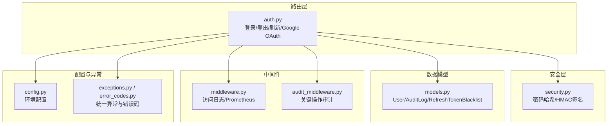
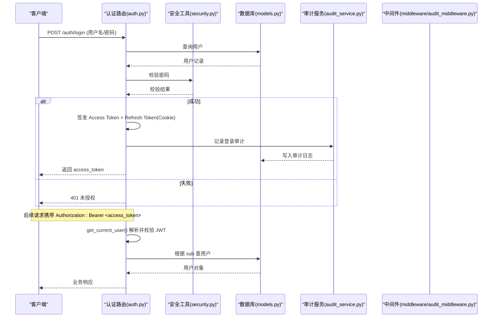
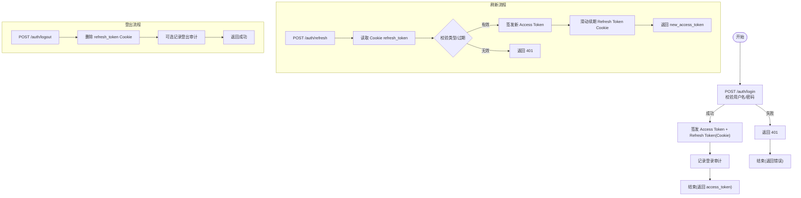
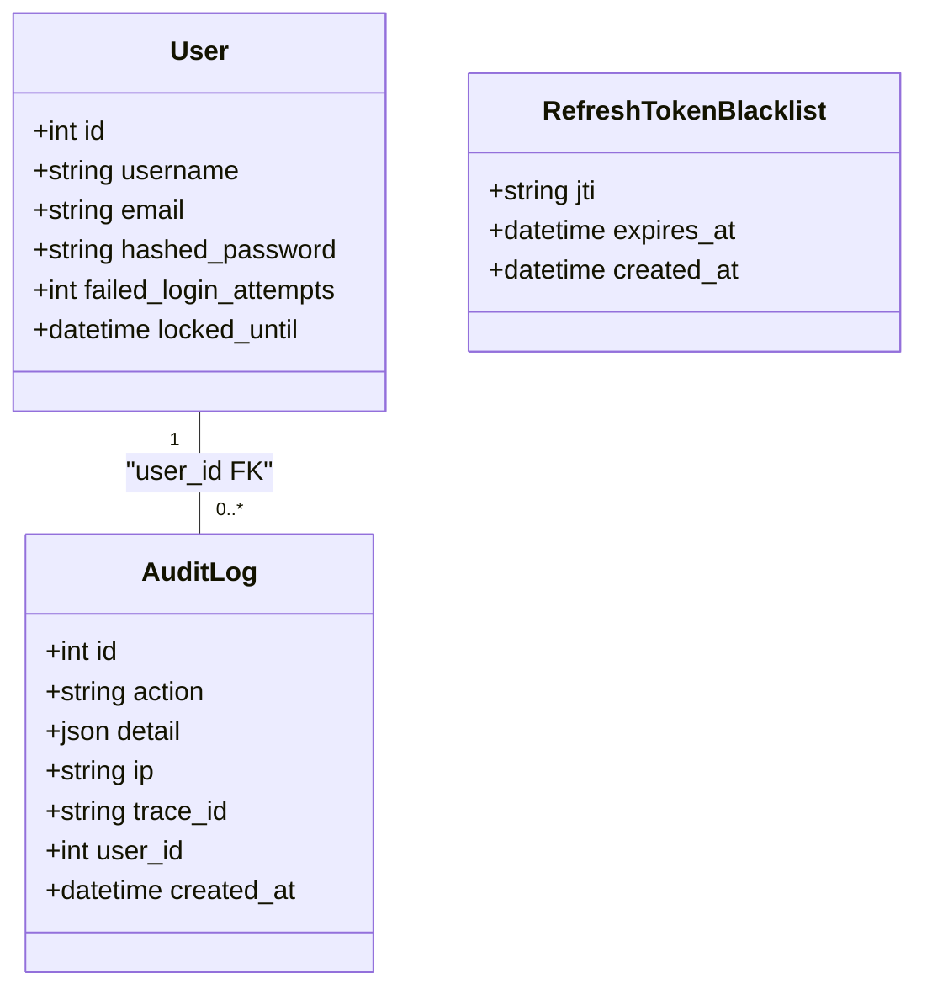
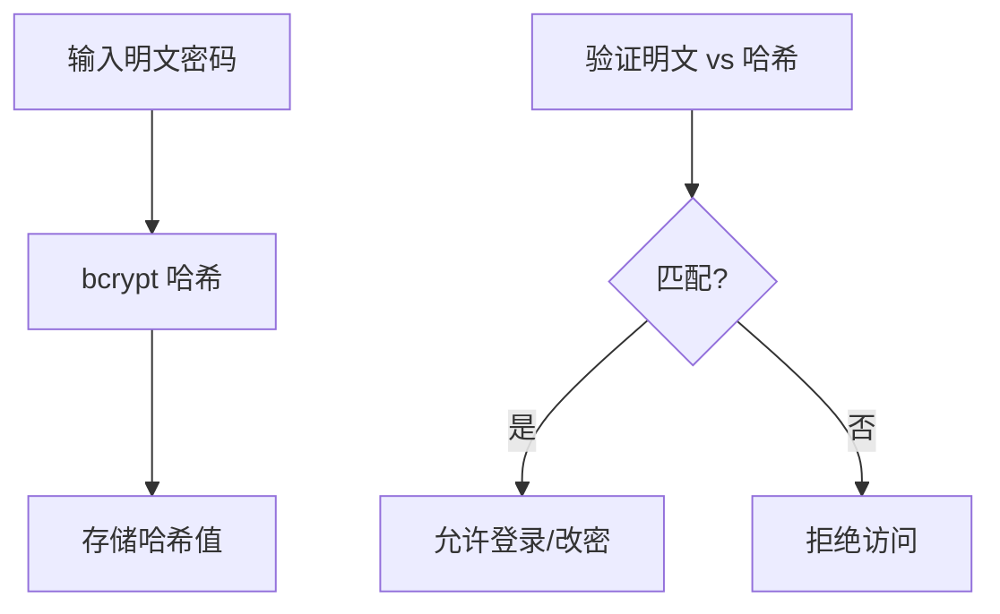
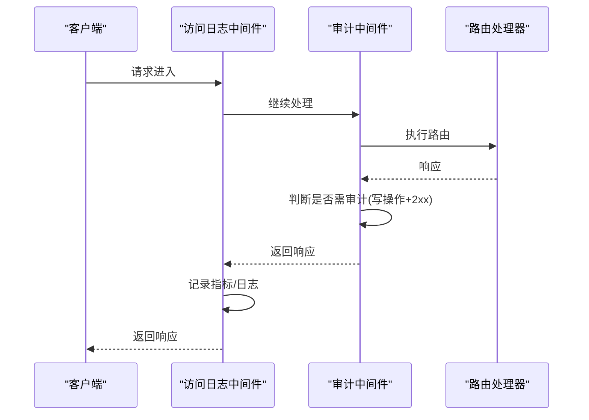
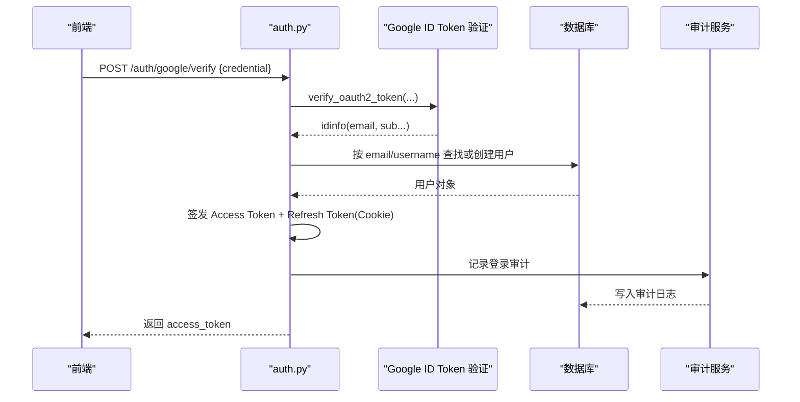
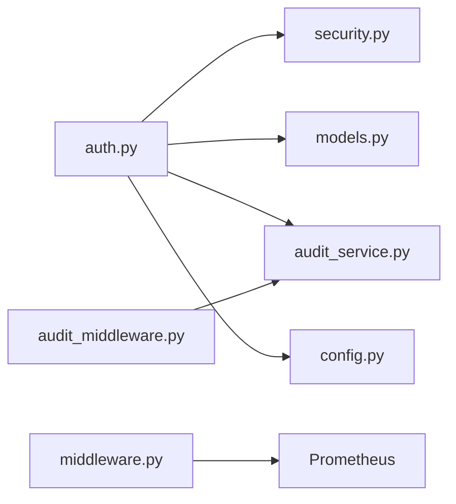

# 认证授权机制

<cite>
**本文引用的文件**
- [backend/routers/auth.py](file://backend/routers/auth.py)
- [backend/core/security.py](file://backend/core/security.py)
- [backend/core/middleware.py](file://backend/core/middleware.py)
- [backend/middleware/audit_middleware.py](file://backend/middleware/audit_middleware.py)
- [backend/services/audit_service.py](file://backend/services/audit_service.py)
- [backend/core/models.py](file://backend/core/models.py)
- [backend/core/config.py](file://backend/core/config.py)
- [backend/core/exceptions.py](file://backend/core/exceptions.py)
- [backend/core/error_codes.py](file://backend/core/error_codes.py)
- [backend/tests/test_auth.py](file://backend/tests/test_auth.py)
</cite>

## 目录
1. [简介](#简介)
2. [项目结构](#项目结构)
3. [核心组件](#核心组件)
4. [架构总览](#架构总览)
5. [详细组件分析](#详细组件分析)
6. [依赖关系分析](#依赖关系分析)
7. [性能与可扩展性](#性能与可扩展性)
8. [故障排查指南](#故障排查指南)
9. [结论](#结论)
10. [附录：集成与安全最佳实践](#附录：集成与安全最佳实践)

## 简介
本文件系统化说明 Quant Agent 的认证与授权机制，覆盖 JWT 令牌生成、验证与刷新流程；用户登录、登出、权限检查的实现细节；中间件层的认证拦截、角色权限控制、API 访问审计；OAuth2（Google）第三方登录集成与会话管理策略；并提供认证流程图、令牌结构说明、错误处理机制与安全最佳实践，帮助新功能快速集成认证能力。

## 项目结构
认证相关代码主要分布在以下模块：
- 路由层：认证入口与第三方登录
- 安全层：密码哈希、内部通信签名
- 数据模型：用户、审计日志、刷新令牌黑名单等
- 中间件：访问日志、审计中间件
- 配置：环境变量与运行时开关
- 异常与错误码：统一错误体系

图表来源
- [backend/routers/auth.py:1-386](file://backend/routers/auth.py#L1-L386)
- [backend/core/security.py:1-160](file://backend/core/security.py#L1-L160)
- [backend/core/models.py:37-304](file://backend/core/models.py#L37-L304)
- [backend/core/middleware.py:90-133](file://backend/core/middleware.py#L90-L133)
- [backend/middleware/audit_middleware.py:1-77](file://backend/middleware/audit_middleware.py#L1-L77)
- [backend/core/config.py:20-134](file://backend/core/config.py#L20-L134)
- [backend/core/exceptions.py:14-144](file://backend/core/exceptions.py#L14-L144)
- [backend/core/error_codes.py:15-55](file://backend/core/error_codes.py#L15-L55)

章节来源
- [backend/routers/auth.py:1-386](file://backend/routers/auth.py#L1-L386)
- [backend/core/security.py:1-160](file://backend/core/security.py#L1-L160)
- [backend/core/models.py:37-304](file://backend/core/models.py#L37-L304)
- [backend/core/middleware.py:90-133](file://backend/core/middleware.py#L90-L133)
- [backend/middleware/audit_middleware.py:1-77](file://backend/middleware/audit_middleware.py#L1-L77)
- [backend/core/config.py:20-134](file://backend/core/config.py#L20-L134)
- [backend/core/exceptions.py:14-144](file://backend/core/exceptions.py#L14-L144)
- [backend/core/error_codes.py:15-55](file://backend/core/error_codes.py#L15-L55)

## 核心组件
- 认证路由：提供账号密码登录、Google OAuth 登录、获取当前用户、修改密码、刷新 Access Token、登出。
- 安全工具：bcrypt 密码哈希与校验；内部服务间 HMAC 签名生成与校验。
- 数据模型：用户表、审计日志表、刷新令牌黑名单表等。
- 中间件：全局访问日志与 Prometheus 指标；关键操作审计中间件。
- 配置：运行环境与密钥配置；生产/开发模式切换。
- 异常与错误码：统一的认证/鉴权异常与 HTTP 状态映射。

章节来源
- [backend/routers/auth.py:1-386](file://backend/routers/auth.py#L1-L386)
- [backend/core/security.py:1-160](file://backend/core/security.py#L1-L160)
- [backend/core/models.py:37-304](file://backend/core/models.py#L37-L304)
- [backend/core/middleware.py:90-133](file://backend/core/middleware.py#L90-L133)
- [backend/middleware/audit_middleware.py:1-77](file://backend/middleware/audit_middleware.py#L1-L77)
- [backend/core/config.py:20-134](file://backend/core/config.py#L20-L134)
- [backend/core/exceptions.py:14-144](file://backend/core/exceptions.py#L14-L144)
- [backend/core/error_codes.py:15-55](file://backend/core/error_codes.py#L15-L55)

## 架构总览
下图展示从客户端到后端的路由、依赖注入、数据库与审计的整体交互。

图表来源
- [backend/routers/auth.py:117-162](file://backend/routers/auth.py#L117-L162)
- [backend/routers/auth.py:66-83](file://backend/routers/auth.py#L66-L83)
- [backend/core/security.py:20-30](file://backend/core/security.py#L20-L30)
- [backend/core/models.py:37-51](file://backend/core/models.py#L37-L51)
- [backend/services/audit_service.py:43-80](file://backend/services/audit_service.py#L43-L80)
- [backend/middleware/audit_middleware.py:30-77](file://backend/middleware/audit_middleware.py#L30-L77)

## 详细组件分析

### 认证路由与 JWT 生命周期
- 登录：校验用户名/密码，签发短效 Access Token（默认15分钟）与长效 Refresh Token（默认30天），并将 Refresh Token 以 HttpOnly Cookie 下发。
- 刷新：从 Cookie 读取 Refresh Token，校验类型与过期时间后签发新的 Access Token，并滑动续期 Refresh Token。
- 登出：清理 Refresh Token Cookie，记录审计日志（如可识别用户）。
- 当前用户：通过依赖注入解析 Authorization Header 中的 Bearer Token，解码后查询用户。
- Google OAuth：验证前端传来的 Google ID Token，自动注册或查找本地用户，签发系统内 Token 并设置 Cookie。

图表来源
- [backend/routers/auth.py:117-162](file://backend/routers/auth.py#L117-L162)
- [backend/routers/auth.py:305-346](file://backend/routers/auth.py#L305-L346)
- [backend/routers/auth.py:349-385](file://backend/routers/auth.py#L349-L385)
- [backend/services/audit_service.py:43-80](file://backend/services/audit_service.py#L43-L80)

章节来源
- [backend/routers/auth.py:1-386](file://backend/routers/auth.py#L1-L386)

### 用户模型与权限基础
- 用户模型包含用户名、邮箱、密码哈希、登录失败次数与锁定截止时间等字段，为后续扩展账户锁定与多因素认证预留空间。
- 当前实现基于用户名进行鉴权，尚未在路由中实现细粒度角色/权限控制；可通过扩展 User 模型与依赖注入装饰器实现 RBAC。

图表来源
- [backend/core/models.py:37-51](file://backend/core/models.py#L37-L51)
- [backend/core/models.py:259-267](file://backend/core/models.py#L259-L267)
- [backend/core/models.py:292-304](file://backend/core/models.py#L292-L304)

章节来源
- [backend/core/models.py:37-51](file://backend/core/models.py#L37-L51)
- [backend/core/models.py:259-267](file://backend/core/models.py#L259-L267)
- [backend/core/models.py:292-304](file://backend/core/models.py#L292-L304)

### 安全工具：密码哈希与内部签名
- 密码哈希：使用 bcrypt 对明文密码进行哈希存储，并提供校验方法。
- 内部签名：为内部服务间调用生成与校验 HMAC-SHA256 签名，防止横向渗透与重放攻击。

图表来源
- [backend/core/security.py:20-30](file://backend/core/security.py#L20-L30)

章节来源
- [backend/core/security.py:1-160](file://backend/core/security.py#L1-L160)

### 中间件：访问日志与审计
- 访问日志中间件：记录每个请求的方法、端点、状态码与耗时，并输出 Prometheus 指标，便于监控与告警。
- 审计中间件：针对关键写操作（登录、登出、订单、策略、设置等）进行审计记录，仅记录成功响应。

图表来源
- [backend/core/middleware.py:90-133](file://backend/core/middleware.py#L90-L133)
- [backend/middleware/audit_middleware.py:30-77](file://backend/middleware/audit_middleware.py#L30-L77)

章节来源
- [backend/core/middleware.py:90-133](file://backend/core/middleware.py#L90-L133)
- [backend/middleware/audit_middleware.py:1-77](file://backend/middleware/audit_middleware.py#L1-L77)

### OAuth2（Google）第三方登录
- 前端将 Google ID Token 发送至后端，后端使用 Google SDK 验证签名与受众。
- 验证通过后，查找或自动注册用户，签发系统内 Access Token 与 Refresh Token，并设置 Cookie。
- 审计记录登录行为，包含登录方式与邮箱信息。

图表来源
- [backend/routers/auth.py:204-299](file://backend/routers/auth.py#L204-L299)
- [backend/services/audit_service.py:43-80](file://backend/services/audit_service.py#L43-L80)

章节来源
- [backend/routers/auth.py:204-299](file://backend/routers/auth.py#L204-L299)

### 会话管理与 Cookie 策略
- Refresh Token 通过 HttpOnly Cookie 下发，生产环境启用 Secure 与 SameSite=None，开发环境为 Lax。
- 刷新接口会滑动续期 Refresh Token，保持活跃用户的长期登录态。
- 登出时删除 Cookie，确保会话失效。

章节来源
- [backend/routers/auth.py:28-41](file://backend/routers/auth.py#L28-L41)
- [backend/routers/auth.py:305-346](file://backend/routers/auth.py#L305-L346)
- [backend/routers/auth.py:349-385](file://backend/routers/auth.py#L349-L385)

### 错误处理与统一异常
- 认证相关异常：Token 缺失、过期、无效、权限不足、HMAC 签名无效等。
- 错误码与 HTTP 状态映射：统一将业务错误码映射为标准 HTTP 状态码，便于前端与网关处理。

章节来源
- [backend/core/exceptions.py:57-80](file://backend/core/exceptions.py#L57-L80)
- [backend/core/error_codes.py:15-55](file://backend/core/error_codes.py#L15-L55)

## 依赖关系分析
- 路由层依赖安全工具进行密码校验与 JWT 编解码，依赖数据库进行用户查询与审计日志写入。
- 中间件层独立于业务逻辑，负责横切关注点（指标、审计）。
- 配置层提供运行环境标识与密钥，影响 Cookie 安全属性与行为。

图表来源
- [backend/routers/auth.py:1-386](file://backend/routers/auth.py#L1-L386)
- [backend/core/security.py:1-160](file://backend/core/security.py#L1-L160)
- [backend/core/models.py:37-304](file://backend/core/models.py#L37-L304)
- [backend/services/audit_service.py:1-112](file://backend/services/audit_service.py#L1-L112)
- [backend/core/middleware.py:90-133](file://backend/core/middleware.py#L90-L133)
- [backend/middleware/audit_middleware.py:1-77](file://backend/middleware/audit_middleware.py#L1-L77)
- [backend/core/config.py:20-134](file://backend/core/config.py#L20-L134)

章节来源
- [backend/routers/auth.py:1-386](file://backend/routers/auth.py#L1-L386)
- [backend/core/security.py:1-160](file://backend/core/security.py#L1-L160)
- [backend/core/models.py:37-304](file://backend/core/models.py#L37-L304)
- [backend/services/audit_service.py:1-112](file://backend/services/audit_service.py#L1-L112)
- [backend/core/middleware.py:90-133](file://backend/core/middleware.py#L90-L133)
- [backend/middleware/audit_middleware.py:1-77](file://backend/middleware/audit_middleware.py#L1-L77)
- [backend/core/config.py:20-134](file://backend/core/config.py#L20-L134)

## 性能与可扩展性
- 指标采集：通过 Prometheus 计数器与直方图记录请求量、延迟与外部 API 调用，支持 P95/P99 分析。
- 慢请求告警：外部 API 调用超过阈值时记录警告日志，便于定位瓶颈。
- 可扩展点：
  - 在依赖注入中添加角色/权限检查装饰器，实现 RBAC。
  - 引入 Redis 作为 Refresh Token 黑名单或会话存储，增强分布式一致性。
  - 增加多因素认证（短信/邮件验证码）与账户锁定策略。

章节来源
- [backend/core/middleware.py:10-88](file://backend/core/middleware.py#L10-L88)

## 故障排查指南
- 登录失败：检查用户名/密码是否正确；确认数据库中用户存在且密码哈希有效。
- Token 无效/过期：确认 Authorization Header 格式正确；必要时调用刷新接口续期。
- 刷新失败：检查 Cookie 是否存在且类型为 refresh；确认未过期。
- 登出不生效：确认 Cookie 参数与 set_cookie 一致；浏览器跨域时需 SameSite=None 与 Secure。
- 审计日志缺失：确认请求为写操作且响应为 2xx；检查审计中间件是否启用。

章节来源
- [backend/routers/auth.py:66-83](file://backend/routers/auth.py#L66-L83)
- [backend/routers/auth.py:305-346](file://backend/routers/auth.py#L305-L346)
- [backend/routers/auth.py:349-385](file://backend/routers/auth.py#L349-L385)
- [backend/middleware/audit_middleware.py:30-77](file://backend/middleware/audit_middleware.py#L30-L77)

## 结论
Quant Agent 的认证授权机制以 JWT 为核心，结合 HttpOnly Cookie 的 Refresh Token 实现短期访问与长期会话管理；通过安全工具保障密码与内部通信安全；借助中间件与服务完成访问监控与审计；OAuth2（Google）集成提供了便捷的第三方登录体验。未来可在 RBAC、多因素认证、Redis 会话存储等方面进一步增强安全性与可扩展性。

## 附录：集成与安全最佳实践
- 密码加密：使用 bcrypt 哈希存储，避免明文；合理设置轮数以平衡安全与性能。
- 令牌过期处理：Access Token 短效（建议15分钟），Refresh Token 长效（建议30天）并滑动续期；服务端可引入黑名单实现强制失效。
- CSRF 防护：使用 HttpOnly Cookie 承载 Refresh Token，生产环境启用 Secure 与 SameSite=None；对敏感写操作实施 CSRF Token 或同源策略。
- 会话管理策略：集中管理 Refresh Token 生命周期；支持登出时立即失效；考虑分布式场景下的共享存储。
- 权限控制：扩展 User 模型添加角色/权限字段；在依赖注入中实现基于角色的访问控制（RBAC）。
- 审计与合规：对所有敏感操作（登录、登出、改密、订单、策略变更）记录审计日志，包含 IP、追踪 ID 与用户 ID。
- 测试与验证：参考单元测试用例验证登录、刷新、登出与 Token 编解码的正确性。

章节来源
- [backend/core/security.py:20-30](file://backend/core/security.py#L20-L30)
- [backend/routers/auth.py:28-41](file://backend/routers/auth.py#L28-L41)
- [backend/routers/auth.py:305-346](file://backend/routers/auth.py#L305-L346)
- [backend/services/audit_service.py:43-80](file://backend/services/audit_service.py#L43-L80)
- [backend/tests/test_auth.py:85-118](file://backend/tests/test_auth.py#L85-L118)
- [backend/tests/test_auth.py:121-169](file://backend/tests/test_auth.py#L121-L169)