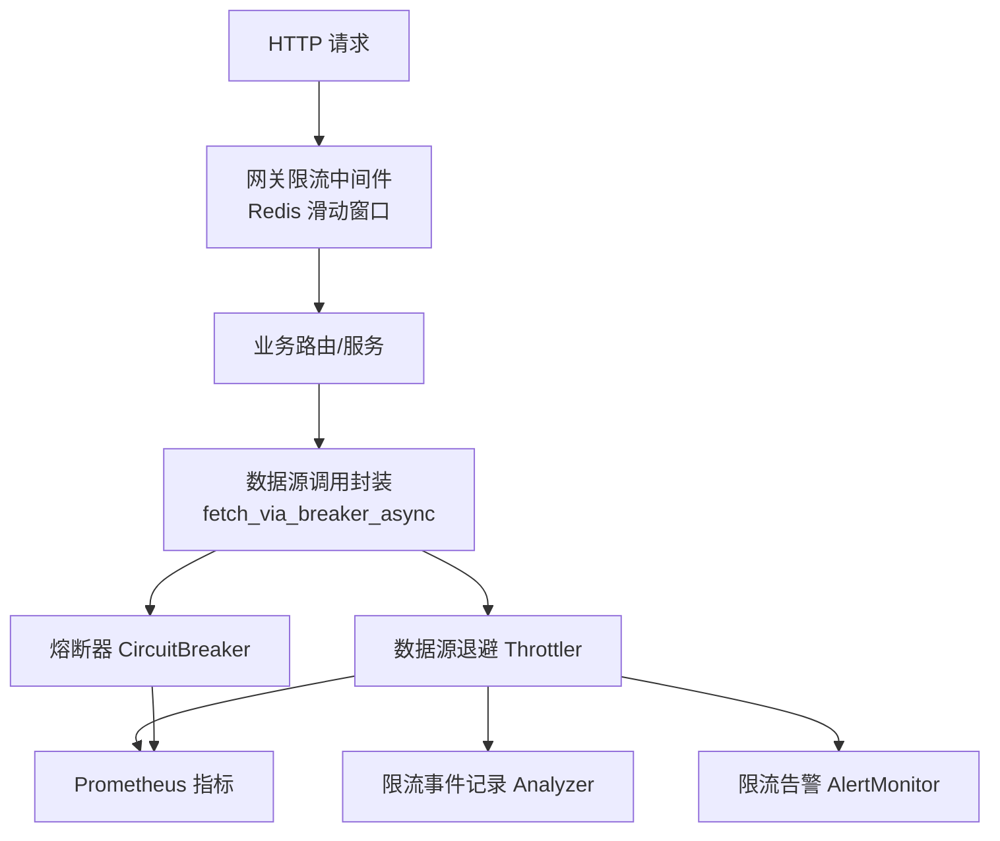
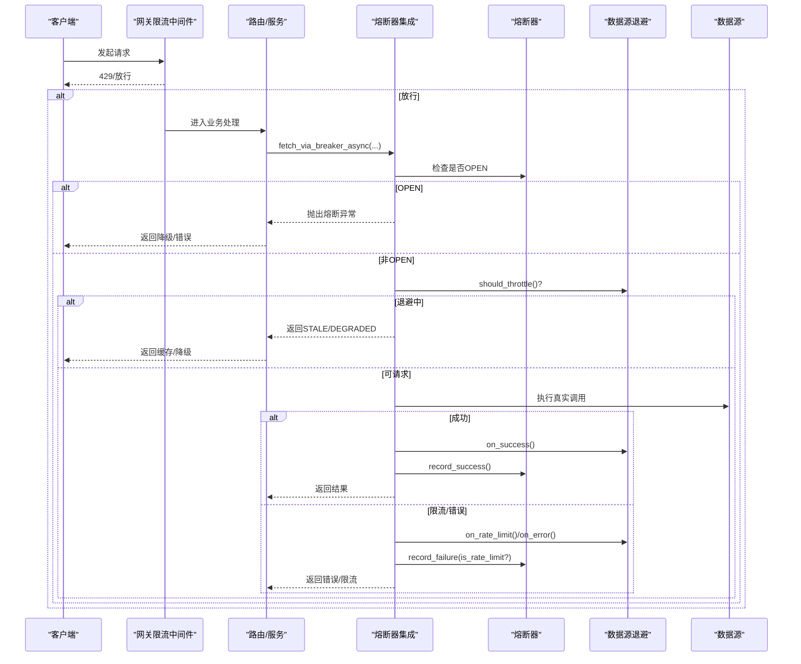
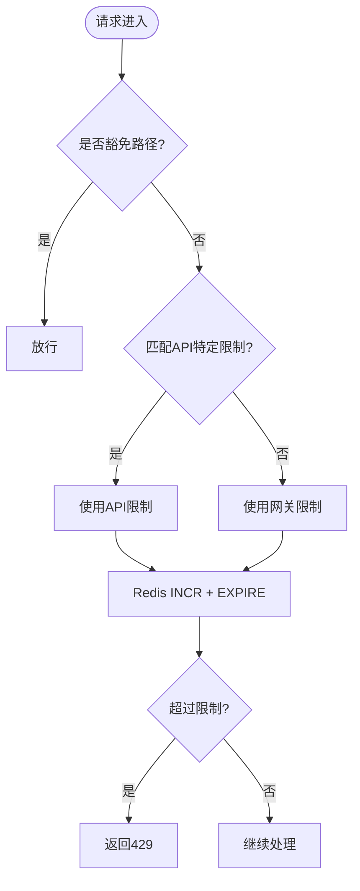
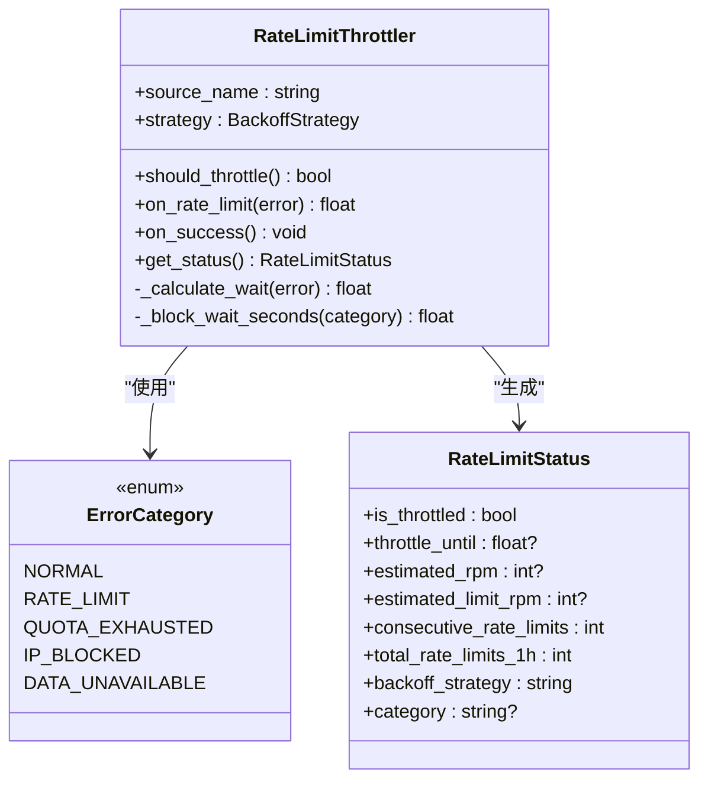
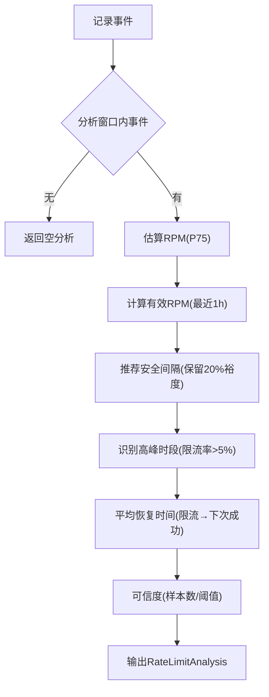
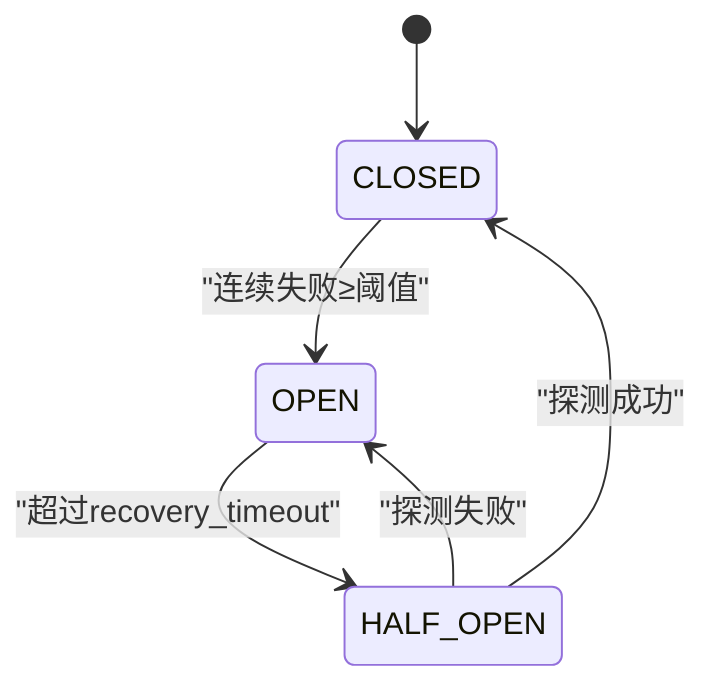
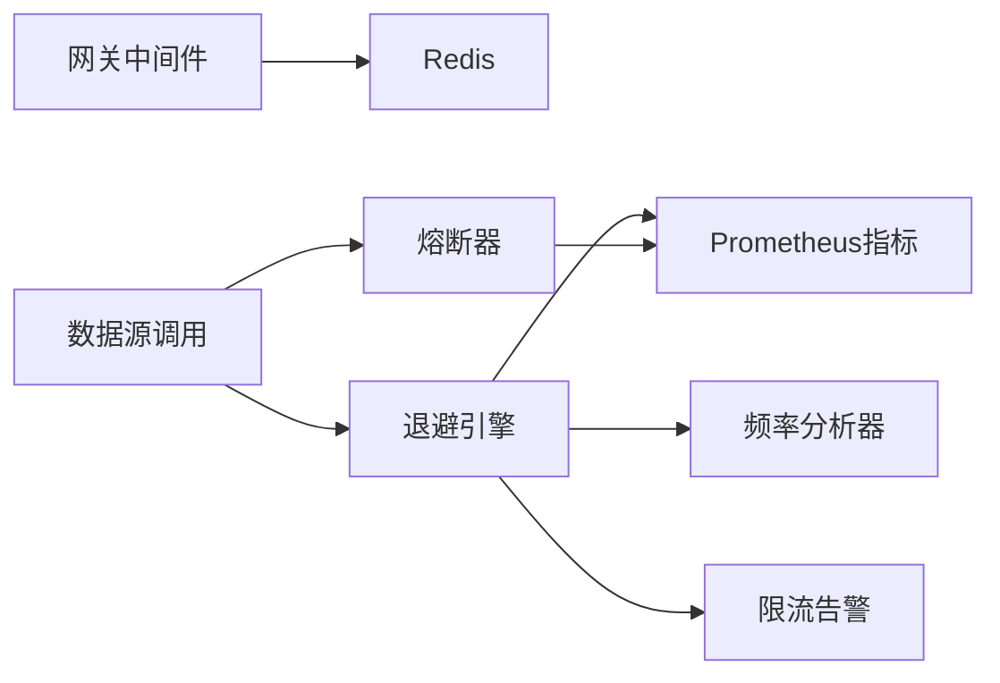

# 请求限流机制

<cite>
**本文引用的文件**
- [backend/middleware/stack.py](file://backend/middleware/stack.py)
- [backend/services/datasource/throttler.py](file://backend/services/datasource/throttler.py)
- [backend/services/datasource/analyzer.py](file://backend/services/datasource/analyzer.py)
- [backend/services/datasource/__init__.py](file://backend/services/datasource/__init__.py)
- [backend/core/circuit_breaker.py](file://backend/core/circuit_breaker.py)
- [backend/core/circuit_breaker_integration.py](file://backend/core/circuit_breaker_integration.py)
- [backend/routers/datasource.py](file://backend/routers/datasource.py)
- [backend/core/metrics.py](file://backend/core/metrics.py)
- [backend/services/datasource/alert_monitor.py](file://backend/services/datasource/alert_monitor.py)
</cite>

## 目录
1. [简介](#简介)
2. [项目结构](#项目结构)
3. [核心组件](#核心组件)
4. [架构总览](#架构总览)
5. [详细组件分析](#详细组件分析)
6. [依赖关系分析](#依赖关系分析)
7. [性能考量](#性能考量)
8. [故障排查指南](#故障排查指南)
9. [结论](#结论)
10. [附录](#附录)

## 简介
本文件系统化梳理 Quant Agent 的请求限流机制，覆盖算法选择、策略配置、多级限流实现、数据源限流与 API 调用限流的差异、熔断器模式与降级策略、故障隔离、监控指标与告警规则、容量规划与性能影响分析，以及测试方法与调优指南。

## 项目结构
Quant Agent 的限流体系由三层构成：
- HTTP 网关层：基于 Redis 的滑动窗口限流中间件，提供全局与接口级限流。
- 数据源层：按数据源维度的退避引擎（指数/线性/自适应）+ 频率分析器 + 统一错误分类。
- 熔断器层：服务级熔断保护，避免对异常或受限的外部服务继续施压。

**图表来源**
- [backend/middleware/stack.py:167-220](file://backend/middleware/stack.py#L167-L220)
- [backend/core/circuit_breaker_integration.py:40-72](file://backend/core/circuit_breaker_integration.py#L40-L72)
- [backend/services/datasource/throttler.py:124-297](file://backend/services/datasource/throttler.py#L124-L297)
- [backend/services/datasource/analyzer.py:136-315](file://backend/services/datasource/analyzer.py#L136-L315)
- [backend/core/metrics.py:326-354](file://backend/core/metrics.py#L326-L354)
- [backend/services/datasource/alert_monitor.py:42-153](file://backend/services/datasource/alert_monitor.py#L42-L153)

**章节来源**
- [backend/middleware/stack.py:40-73](file://backend/middleware/stack.py#L40-L73)
- [backend/services/datasource/throttler.py:124-189](file://backend/services/datasource/throttler.py#L124-L189)
- [backend/core/circuit_breaker.py:64-145](file://backend/core/circuit_breaker.py#L64-L145)

## 核心组件
- 网关级限流中间件：基于 Redis 的滑动窗口计数，支持豁免路径、API 特定限制、失败安全（Redis 不可用时的生产环境拒绝）。
- 数据源退避引擎：按数据源维度维护退避状态，支持 none/linear/exponential/adaptive 策略，区分真·限流与硬失败（配额耗尽/IP封禁）。
- 限流频率分析器：基于历史事件时间序列推测限流阈值 RPM、推荐安全间隔、高峰时段、平均恢复时间与可信度。
- 熔断器：服务级 OPEN/HALF_OPEN/CLOSED 状态机，限流类错误不计入失败计数，支持装饰器与手动记录。
- 监控与告警：Prometheus 指标埋点、限流告警去重冷却与异步推送。

**章节来源**
- [backend/middleware/stack.py:167-220](file://backend/middleware/stack.py#L167-L220)
- [backend/services/datasource/throttler.py:222-349](file://backend/services/datasource/throttler.py#L222-L349)
- [backend/services/datasource/analyzer.py:194-315](file://backend/services/datasource/analyzer.py#L194-L315)
- [backend/core/circuit_breaker.py:147-218](file://backend/core/circuit_breaker.py#L147-L218)
- [backend/core/metrics.py:326-354](file://backend/core/metrics.py#L326-L354)
- [backend/services/datasource/alert_monitor.py:77-153](file://backend/services/datasource/alert_monitor.py#L77-L153)

## 架构总览
下图展示一次外部数据源调用的完整限流与熔断链路：

**图表来源**
- [backend/middleware/stack.py:167-220](file://backend/middleware/stack.py#L167-L220)
- [backend/core/circuit_breaker_integration.py:40-72](file://backend/core/circuit_breaker_integration.py#L40-L72)
- [backend/services/datasource/throttler.py:205-297](file://backend/services/datasource/throttler.py#L205-L297)
- [backend/core/circuit_breaker.py:147-218](file://backend/core/circuit_breaker.py#L147-L218)

## 详细组件分析

### 网关级限流（HTTP 中间件）
- 算法：滑动窗口计数（Redis INCR + EXPIRE），键为“rate_limit:{path}:{client_ip}”。
- 策略：
  - 全局防御层：GATEWAY_RATE_LIMIT/GATEWAY_RATE_WINDOW。
  - API 特定限制：API_SPECIFIC_LIMITS，优先级高于全局。
  - 豁免路径：SKIP_PATHS（健康检查、静态资源、WS/SSE等）。
- 失败安全：Redis 不可用时，测试环境放行；生产/开发环境直接拒绝（防攻击）。
- 响应：429 并附带 retry_after。

**图表来源**
- [backend/middleware/stack.py:167-220](file://backend/middleware/stack.py#L167-L220)

**章节来源**
- [backend/middleware/stack.py:40-73](file://backend/middleware/stack.py#L40-L73)
- [backend/middleware/stack.py:167-220](file://backend/middleware/stack.py#L167-L220)

### 数据源限流（退避引擎）
- 策略：
  - none：不降速。
  - linear：wait = base_delay + step * consecutive_count。
  - exponential：wait = base_delay * 2^consecutive_count（上限 max_delay）。
  - adaptive：指数退避 + 动态调整（结合历史 request_interval 作为下限参考）。
- 类别区分：
  - rate_limit：真·瞬时限流（如 429），走指数/自适应退避，连续计数参与自愈。
  - quota_exhausted/ip_blocked：硬失败，固定抑制窗口（不污染连续限流计数）。
- 自愈机制：连续成功达到阈值后逐步降低退避间隔直至归零。
- 可观测性：Prometheus 指标 ds_rate_limit_*、ds_backoff_state；告警通过 RateLimitAlertMonitor。

**图表来源**
- [backend/services/datasource/throttler.py:124-466](file://backend/services/datasource/throttler.py#L124-L466)
- [backend/services/datasource/__init__.py:23-47](file://backend/services/datasource/__init__.py#L23-L47)
- [backend/services/datasource/__init__.py:314-340](file://backend/services/datasource/__init__.py#L314-L340)

**章节来源**
- [backend/services/datasource/throttler.py:154-189](file://backend/services/datasource/throttler.py#L154-L189)
- [backend/services/datasource/throttler.py:222-349](file://backend/services/datasource/throttler.py#L222-L349)
- [backend/services/datasource/__init__.py:23-47](file://backend/services/datasource/__init__.py#L23-L47)

### 限流频率分析器
- 目标：基于过去 N 小时的事件序列推测限流阈值 RPM、推荐安全间隔、高峰时段、平均恢复时间与可信度。
- 关键方法：
  - record_request / record_success / record_error / record_rate_limit。
  - analyze(window_seconds) → RateLimitAnalysis。
  - get_health_metrics() → 今日统计、成功率、延迟分布。

**图表来源**
- [backend/services/datasource/analyzer.py:194-315](file://backend/services/datasource/analyzer.py#L194-L315)
- [backend/services/datasource/analyzer.py:321-378](file://backend/services/datasource/analyzer.py#L321-L378)
- [backend/services/datasource/analyzer.py:380-462](file://backend/services/datasource/analyzer.py#L380-L462)
- [backend/services/datasource/analyzer.py:534-567](file://backend/services/datasource/analyzer.py#L534-L567)

**章节来源**
- [backend/services/datasource/analyzer.py:136-315](file://backend/services/datasource/analyzer.py#L136-L315)
- [backend/services/datasource/analyzer.py:487-532](file://backend/services/datasource/analyzer.py#L487-L532)

### 熔断器与集成
- 状态机：CLOSED → OPEN（连续失败≥阈值）→ HALF_OPEN（超时探测）→ CLOSED（探测成功）或 OPEN（探测失败）。
- 限流解耦：限流类错误不计入失败计数（is_rate_limit_error/error_classifier）。
- 集成点：fetch_via_breaker_async 包装数据源 fetch，根据 Result.is_success 与 error_category 决定 success/failure。

**图表来源**
- [backend/core/circuit_breaker.py:45-97](file://backend/core/circuit_breaker.py#L45-L97)
- [backend/core/circuit_breaker.py:147-218](file://backend/core/circuit_breaker.py#L147-L218)
- [backend/core/circuit_breaker_integration.py:40-72](file://backend/core/circuit_breaker_integration.py#L40-L72)

**章节来源**
- [backend/core/circuit_breaker.py:64-145](file://backend/core/circuit_breaker.py#L64-L145)
- [backend/core/circuit_breaker.py:147-218](file://backend/core/circuit_breaker.py#L147-L218)
- [backend/core/circuit_breaker_integration.py:25-72](file://backend/core/circuit_breaker_integration.py#L25-L72)

### 监控指标与告警
- Prometheus 指标：
  - 熔断器：quant_circuit_breaker_state、quant_circuit_breaker_transitions_total。
  - 数据源限流：ds_rate_limit_total、ds_rate_limit_throttled_seconds、ds_rate_limit_estimated_rpm、ds_rate_limit_effective_rpm、ds_backoff_state。
- 告警：RateLimitAlertMonitor 检测高频限流、长时间退避、配额耗尽、IP封禁，并通过 NotificationService 推送飞书 Webhook，内置去重冷却。

**章节来源**
- [backend/core/metrics.py:100-110](file://backend/core/metrics.py#L100-L110)
- [backend/core/metrics.py:326-354](file://backend/core/metrics.py#L326-L354)
- [backend/services/datasource/alert_monitor.py:42-153](file://backend/services/datasource/alert_monitor.py#L42-L153)

## 依赖关系分析
- 中间件依赖 Redis 进行滑动窗口计数；若不可用则按环境策略放行或拒绝。
- 数据源调用通过熔断器集成层统一包裹，依据 Result/ErrorInfo 的 category 决定是否计入熔断失败。
- 退避引擎与频率分析器共享 ErrorCategory，确保限流/配额/IP封禁三类错误在系统内一致处理。
- 监控与告警解耦：Throttler 触发告警事件，后台任务异步推送，避免阻塞限流热路径。

**图表来源**
- [backend/middleware/stack.py:167-220](file://backend/middleware/stack.py#L167-L220)
- [backend/core/circuit_breaker_integration.py:40-72](file://backend/core/circuit_breaker_integration.py#L40-L72)
- [backend/services/datasource/throttler.py:222-297](file://backend/services/datasource/throttler.py#L222-L297)
- [backend/services/datasource/analyzer.py:194-315](file://backend/services/datasource/analyzer.py#L194-L315)
- [backend/core/metrics.py:326-354](file://backend/core/metrics.py#L326-L354)
- [backend/services/datasource/alert_monitor.py:77-153](file://backend/services/datasource/alert_monitor.py#L77-L153)

**章节来源**
- [backend/middleware/stack.py:167-220](file://backend/middleware/stack.py#L167-L220)
- [backend/core/circuit_breaker_integration.py:40-72](file://backend/core/circuit_breaker_integration.py#L40-L72)
- [backend/services/datasource/throttler.py:222-297](file://backend/services/datasource/throttler.py#L222-L297)
- [backend/services/datasource/analyzer.py:194-315](file://backend/services/datasource/analyzer.py#L194-L315)
- [backend/core/metrics.py:326-354](file://backend/core/metrics.py#L326-L354)
- [backend/services/datasource/alert_monitor.py:77-153](file://backend/services/datasource/alert_monitor.py#L77-L153)

## 性能考量
- 网关限流：Redis INCR+EXPIRE 原子操作，低开销；高并发下需关注 Redis 连接池与网络延迟。
- 数据源退避：指数/自适应退避可有效降低上游压力；自适应策略结合历史间隔提升恢复效率。
- 熔断器：快速短路减少无效调用；限流类错误不计入失败计数，避免误杀。
- 监控与告警：指标增量更新轻量；告警异步队列避免阻塞限流回调。

[本节为通用性能讨论，无需具体文件引用]

## 故障排查指南
- 网关限流 429：检查 API_SPECIFIC_LIMITS 与 GATEWAY_RATE_LIMIT 配置；确认 client_ip 与 path 匹配；验证 Redis 连通性。
- 数据源频繁限流：查看 throttler.get_status() 与 analyzer.analyze()；关注 category（rate_limit/quota_exhausted/ip_blocked）；调整 backoff 参数或策略。
- 熔断器打开：检查连续失败次数与 recovery_timeout；确认限流类错误未计入失败计数；必要时手动 reset。
- 告警风暴：确认 RateLimitAlertMonitor 冷却期生效；检查 NotificationService 可用性。

**章节来源**
- [backend/middleware/stack.py:167-220](file://backend/middleware/stack.py#L167-L220)
- [backend/services/datasource/throttler.py:362-396](file://backend/services/datasource/throttler.py#L362-L396)
- [backend/services/datasource/analyzer.py:250-315](file://backend/services/datasource/analyzer.py#L250-L315)
- [backend/core/circuit_breaker.py:326-352](file://backend/core/circuit_breaker.py#L326-L352)
- [backend/services/datasource/alert_monitor.py:155-183](file://backend/services/datasource/alert_monitor.py#L155-L183)

## 结论
Quant Agent 的限流机制采用“网关滑动窗口 + 数据源退避 + 熔断器”的多层防护体系，既保护上游服务，又保障系统稳定性与用户体验。通过统一的错误分类、可观测指标与告警机制，实现了限流的可配置、可观测、可恢复。建议在生产环境中持续优化回退策略与容量规划，并结合监控与告警闭环迭代。

[本节为总结，无需具体文件引用]

## 附录

### 限流策略配置示例
- 网关层：
  - 全局限制：GATEWAY_RATE_LIMIT=200, GATEWAY_RATE_WINDOW=60。
  - API 特定限制：例如 "/api/v1/market/quote": (60, 60)。
  - 豁免路径：/health, /metrics, WS/SSE 等。
- 数据源层：
  - 环境变量 DATASOURCE_{NAME}_BACKOFF_STRATEGY 选择 none/linear/exponential/adaptive。
  - DATASOURCE_{NAME}_BACKOFF_BASE_DELAY、DATASOURCE_{NAME}_BACKOFF_MAX_DELAY、DATASOURCE_{NAME}_BACKOFF_JITTER。
- 熔断器：
  - 环境变量 CIRCUIT_BREAKER_MAX_FAILURES、CIRCUIT_BREAKER_COOLDOWN_S。

**章节来源**
- [backend/middleware/stack.py:40-73](file://backend/middleware/stack.py#L40-L73)
- [backend/services/datasource/throttler.py:154-189](file://backend/services/datasource/throttler.py#L154-L189)
- [backend/core/circuit_breaker.py:40-43](file://backend/core/circuit_breaker.py#L40-L43)

### 监控指标与告警规则
- 指标：
  - 熔断器：quant_circuit_breaker_state、quant_circuit_breaker_transitions_total。
  - 数据源限流：ds_rate_limit_total、ds_rate_limit_throttled_seconds、ds_rate_limit_estimated_rpm、ds_rate_limit_effective_rpm、ds_backoff_state。
- 告警：
  - 5分钟内同一数据源限流>10次。
  - 退避时间>2分钟。
  - 配额耗尽/IP封禁立即告警。
  - 去重冷却：同数据源同类型15分钟内不重复。

**章节来源**
- [backend/core/metrics.py:100-110](file://backend/core/metrics.py#L100-L110)
- [backend/core/metrics.py:326-354](file://backend/core/metrics.py#L326-L354)
- [backend/services/datasource/alert_monitor.py:50-56](file://backend/services/datasource/alert_monitor.py#L50-L56)
- [backend/services/datasource/alert_monitor.py:107-147](file://backend/services/datasource/alert_monitor.py#L107-L147)

### 测试方法与性能调优指南
- 单元测试：
  - 网关限流：模拟 Redis 不可用场景，验证放行/拒绝行为。
  - 数据源退避：注入不同 ErrorCategory，验证 wait 计算与自愈。
  - 熔断器：构造连续失败/成功序列，验证状态转换。
- 集成测试：
  - 端到端调用链：从网关到数据源，验证限流、降级、熔断联动。
- 性能调优：
  - 调整 backoff 策略与参数，平衡上游压力与恢复速度。
  - 优化 Redis 连接池与网络延迟，降低网关限流开销。
  - 结合 analyzer 推荐的 interval 与 estimated_limit_rpm 动态调参。

**章节来源**
- [backend/middleware/stack.py:167-220](file://backend/middleware/stack.py#L167-L220)
- [backend/services/datasource/throttler.py:402-451](file://backend/services/datasource/throttler.py#L402-L451)
- [backend/core/circuit_breaker.py:147-218](file://backend/core/circuit_breaker.py#L147-L218)
- [backend/services/datasource/analyzer.py:321-378](file://backend/services/datasource/analyzer.py#L321-L378)
