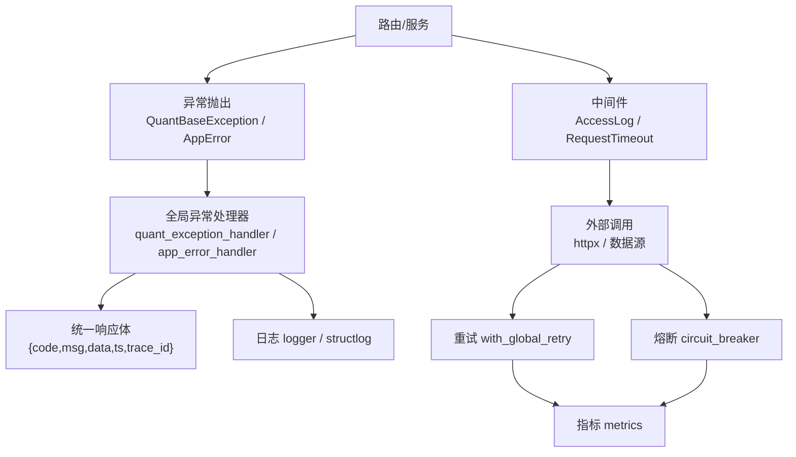
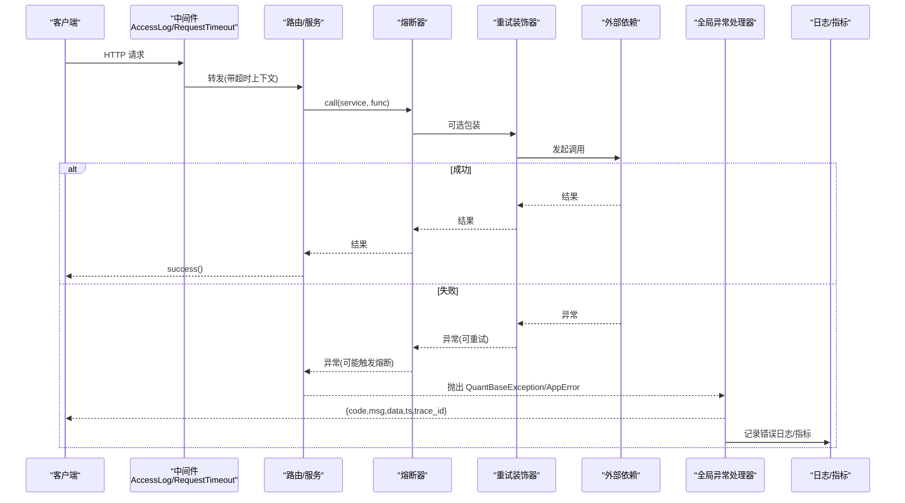
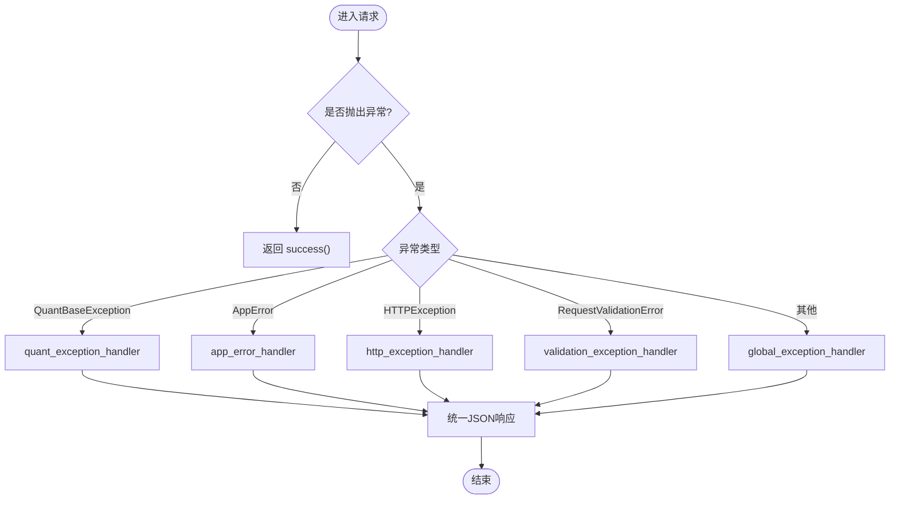
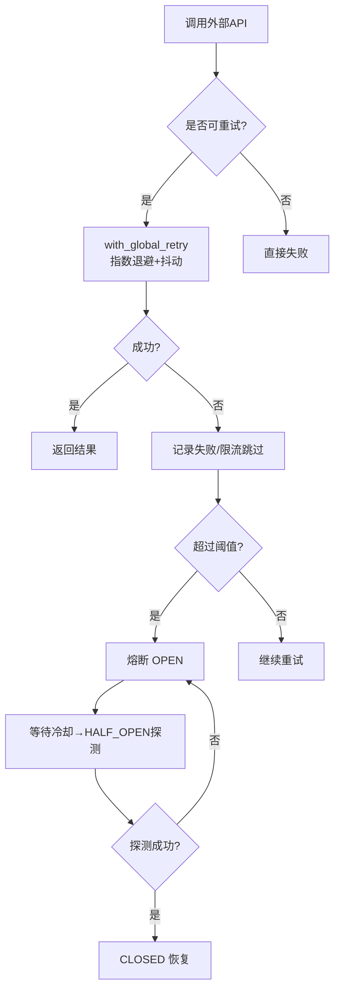
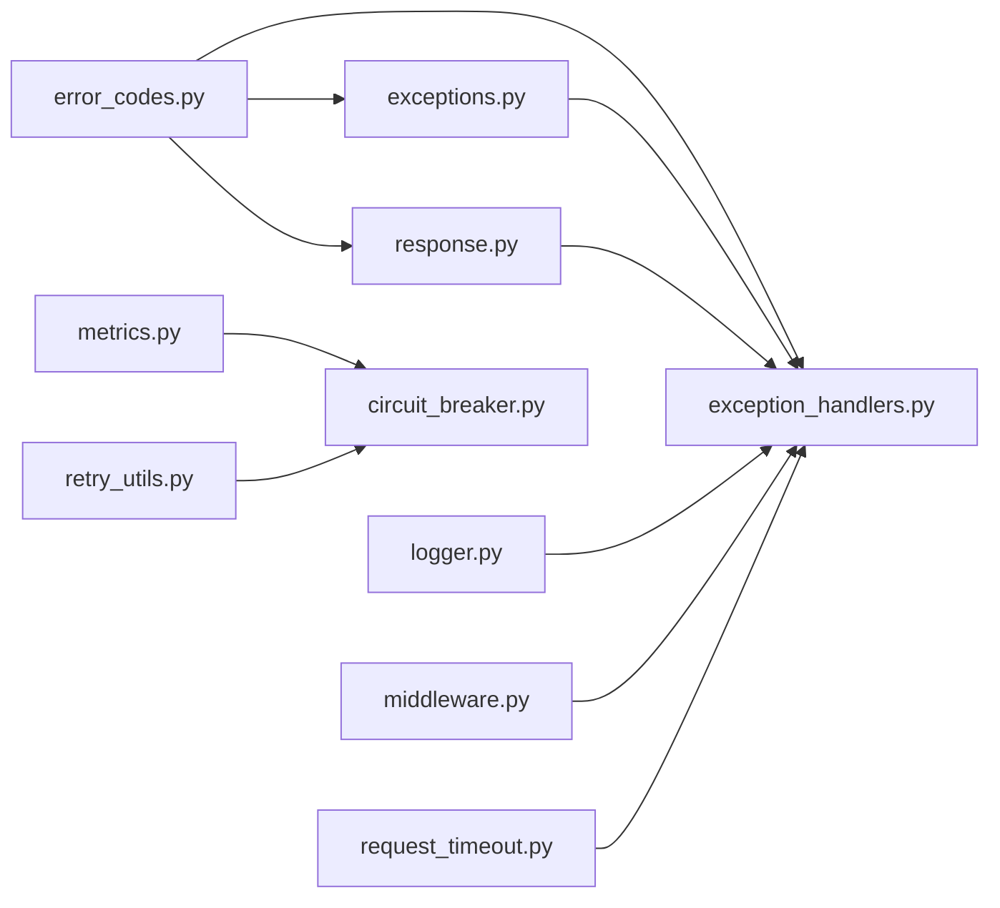

# 错误处理规范

<cite>
**本文引用的文件**
- [backend/core/error_codes.py](file://backend/core/error_codes.py)
- [backend/core/exceptions.py](file://backend/core/exceptions.py)
- [backend/core/exception_handlers.py](file://backend/core/exception_handlers.py)
- [backend/core/response.py](file://backend/core/response.py)
- [backend/core/logger.py](file://backend/core/logger.py)
- [backend/core/metrics.py](file://backend/core/metrics.py)
- [backend/core/retry_utils.py](file://backend/core/retry_utils.py)
- [backend/core/circuit_breaker.py](file://backend/core/circuit_breaker.py)
- [backend/core/middleware.py](file://backend/core/middleware.py)
- [backend/core/request_timeout.py](file://backend/core/request_timeout.py)
- [backend/core/structlog_config.py](file://backend/core/structlog_config.py)
- [data_subservice/_internal/error_codes.py](file://data_subservice/_internal/error_codes.py)
</cite>

## 目录
1. [引言](#引言)
2. [项目结构](#项目结构)
3. [核心组件](#核心组件)
4. [架构总览](#架构总览)
5. [详细组件分析](#详细组件分析)
6. [依赖关系分析](#依赖关系分析)
7. [性能与可观测性](#性能与可观测性)
8. [故障排查指南](#故障排查指南)
9. [结论](#结论)
10. [附录](#附录)

## 引言
本规范定义 Quant Agent 的错误处理体系，统一对外响应格式、错误码分类、异常捕获与恢复策略，覆盖业务异常、系统异常、网络异常的分类与处理；并文档化日志记录、监控告警、调试信息输出。同时给出客户端侧的最佳实践：重试策略、降级方案与错误诊断工具使用建议。

## 项目结构
错误处理相关能力集中在 backend/core 与 data_subservice/_internal（子服务独立副本）中，形成“统一错误码 + 统一异常类 + 统一处理器 + 统一响应封装”的分层设计：
- 错误码：ErrorCode 枚举与 HTTP 状态映射
- 异常：QuantBaseException 及其子类、AppError
- 处理器：全局异常处理器注册与统一 JSON 响应
- 响应：success/error 构造器
- 可观测性：结构化日志、Prometheus 指标、Webhook 告警
- 容错：重试、熔断、请求超时中间件

图表来源
- [backend/core/exception_handlers.py:18-101](file://backend/core/exception_handlers.py#L18-L101)
- [backend/core/response.py:26-69](file://backend/core/response.py#L26-L69)
- [backend/core/middleware.py:90-133](file://backend/core/middleware.py#L90-L133)
- [backend/core/request_timeout.py:27-68](file://backend/core/request_timeout.py#L27-L68)
- [backend/core/retry_utils.py:10-58](file://backend/core/retry_utils.py#L10-L58)
- [backend/core/circuit_breaker.py:64-218](file://backend/core/circuit_breaker.py#L64-L218)
- [backend/core/metrics.py:96-110](file://backend/core/metrics.py#L96-L110)

章节来源
- [backend/core/error_codes.py:1-55](file://backend/core/error_codes.py#L1-L55)
- [backend/core/exceptions.py:14-144](file://backend/core/exceptions.py#L14-L144)
- [backend/core/exception_handlers.py:18-101](file://backend/core/exception_handlers.py#L18-L101)
- [backend/core/response.py:26-69](file://backend/core/response.py#L26-L69)

## 核心组件
- 统一错误码与 HTTP 映射：ErrorCode 枚举及 ERROR_CODE_TO_HTTP_STATUS 映射表，确保 code 与 HTTP 状态一致。
- 统一异常体系：QuantBaseException 作为基类，派生认证/鉴权、请求/资源、基础设施等异常；AppError 用于编排层直接抛出的业务错误。
- 统一响应封装：success(data,msg) 与 error(code,msg,data,http_status,trace_id) 构造标准 JSON 响应。
- 全局异常处理器：捕获 QuantBaseException、HTTPException、RequestValidationError、AppError 以及兜底 Exception，统一返回 {code,msg,data,ts,trace_id}。
- 可观测性：结构化日志（含 trace_id/symbol/latency_ms）、Prometheus 指标、严重错误 Webhook 告警。
- 容错机制：tenacity 指数退避重试、Circuit Breaker 三态机、请求级超时与取消传播。

章节来源
- [backend/core/error_codes.py:15-55](file://backend/core/error_codes.py#L15-L55)
- [backend/core/exceptions.py:14-144](file://backend/core/exceptions.py#L14-L144)
- [backend/core/exception_handlers.py:18-101](file://backend/core/exception_handlers.py#L18-L101)
- [backend/core/response.py:26-69](file://backend/core/response.py#L26-L69)
- [backend/core/logger.py:89-127](file://backend/core/logger.py#L89-L127)
- [backend/core/metrics.py:96-110](file://backend/core/metrics.py#L96-L110)
- [backend/core/retry_utils.py:10-58](file://backend/core/retry_utils.py#L10-L58)
- [backend/core/circuit_breaker.py:64-218](file://backend/core/circuit_breaker.py#L64-L218)
- [backend/core/request_timeout.py:27-68](file://backend/core/request_timeout.py#L27-L68)

## 架构总览
下图展示一次 API 请求从进入、业务处理、异常到统一响应的完整链路，包含重试与熔断的容错路径。

图表来源
- [backend/core/middleware.py:90-133](file://backend/core/middleware.py#L90-L133)
- [backend/core/request_timeout.py:27-68](file://backend/core/request_timeout.py#L27-L68)
- [backend/core/circuit_breaker.py:147-218](file://backend/core/circuit_breaker.py#L147-L218)
- [backend/core/retry_utils.py:10-58](file://backend/core/retry_utils.py#L10-L58)
- [backend/core/exception_handlers.py:18-101](file://backend/core/exception_handlers.py#L18-L101)

## 详细组件分析

### 统一错误响应格式
- 成功响应：{code: 0, msg: "ok", data: ..., ts: 毫秒时间戳}
- 错误响应：{code: 业务错误码, msg: "可读描述", data: 附加信息, ts: 毫秒时间戳, trace_id: 可选}
- 统一由 response.success/error 或异常处理器生成，保证前后端契约一致。

章节来源
- [backend/core/response.py:26-69](file://backend/core/response.py#L26-L69)
- [backend/core/exception_handlers.py:18-42](file://backend/core/exception_handlers.py#L18-L42)

### 错误码分类体系
- 0：成功
- 1xxx：认证/鉴权（如 TOKEN_MISSING/TOKEN_EXPIRED/TOKEN_INVALID/PERMISSION_DENIED/HMAC_INVALID）
- 2xxx：请求参数/资源（如 VALIDATION_FAILED/RESOURCE_NOT_FOUND）
- 3xxx：外部依赖/基础设施（如 FUTU_DISCONNECTED/REDIS_UNAVAILABLE/CIRCUIT_BREAKER_OPEN）
- 5xxx：内部未知错误（INTERNAL_ERROR）
- 提供 ERROR_CODE_TO_HTTP_STATUS 映射，将业务码转换为 HTTP 状态码。

章节来源
- [backend/core/error_codes.py:15-55](file://backend/core/error_codes.py#L15-L55)
- [data_subservice/_internal/error_codes.py:9-42](file://data_subservice/_internal/error_codes.py#L9-L42)

### 异常处理机制
- 业务异常：继承 QuantBaseException，携带 code/msg/data/trace_id，便于统一转换。
- 应用编排异常：AppError 继承 HTTPException，透传 status_code，并由 app_error_handler 转为统一格式。
- 参数校验异常：RequestValidationError 被 validation_exception_handler 捕获，返回 code=2001 的统一结构。
- 兜底异常：global_exception_handler 捕获未预料异常，生成 INTERNAL_ERROR 并附带 trace_id。

图表来源
- [backend/core/exception_handlers.py:18-101](file://backend/core/exception_handlers.py#L18-L101)

章节来源
- [backend/core/exceptions.py:14-144](file://backend/core/exceptions.py#L14-L144)
- [backend/core/exception_handlers.py:18-101](file://backend/core/exception_handlers.py#L18-L101)

### 业务异常、系统异常、网络异常的分类与策略
- 业务异常：如 Token 缺失/过期/无效、权限不足、参数校验失败、资源不存在。策略：快速失败，返回明确错误码与提示。
- 系统异常：如 Redis 不可用、Futu 断开、熔断开启。策略：返回 503，配合熔断/重试/降级，避免雪崩。
- 网络异常：如 httpx.RequestError/HTTPStatusError、限流/封禁。策略：通过 with_global_retry 进行指数退避重试，必要时触发熔断。

章节来源
- [backend/core/exceptions.py:57-116](file://backend/core/exceptions.py#L57-L116)
- [backend/core/retry_utils.py:10-58](file://backend/core/retry_utils.py#L10-L58)
- [backend/core/circuit_breaker.py:64-218](file://backend/core/circuit_breaker.py#L64-L218)

### 错误日志记录、监控告警、调试信息
- 日志：结构化日志（trace_id/symbol/latency_ms），按级别分文件持久化，支持 Webhook 告警（ERROR+）。
- 指标：Prometheus 指标覆盖请求计数/延迟、外部 API 延迟/错误、熔断状态/转换、数据源可用性/错误率等。
- 调试：全局兜底异常处理器生成 trace_id，便于跨系统追踪；中间件记录慢请求与异常堆栈。

章节来源
- [backend/core/logger.py:89-127](file://backend/core/logger.py#L89-L127)
- [backend/core/logger.py:129-212](file://backend/core/logger.py#L129-L212)
- [backend/core/metrics.py:96-110](file://backend/core/metrics.py#L96-L110)
- [backend/core/middleware.py:90-133](file://backend/core/middleware.py#L90-L133)
- [backend/core/structlog_config.py:40-70](file://backend/core/structlog_config.py#L40-L70)

### 具体错误处理代码示例与模式
- 在路由/服务中直接返回统一响应：
  - 成功：return success(data=..., msg="...")
  - 错误：return error(code=ErrorCode.VALIDATION_FAILED, msg="...", data=[...])
- 抛出业务异常：
  - raise ValidationError(msg="...")
  - raise ResourceNotFoundError(msg="...")
  - raise FutuDisconnectedError(msg="...")
  - raise CircuitBreakerOpenError(service="...")
- 编排层抛出 AppError：
  - raise AppError(status_code=400, detail="...", code=ErrorCode.VALIDATION_FAILED)

章节来源
- [backend/core/response.py:26-69](file://backend/core/response.py#L26-L69)
- [backend/core/exceptions.py:57-144](file://backend/core/exceptions.py#L57-L144)

### 异常捕获模式与错误恢复机制
- 重试：with_global_retry 对可重试异常执行指数退避（随机抖动），最多尝试 3 次，适用于限流/网络抖动/服务端临时错误。
- 熔断：circuit_breaker.call/guard 保护外部依赖，连续失败达到阈值后进入 OPEN，冷却后 HALF_OPEN 探测，成功后 CLOSED。
- 超时：request_timeout_middleware 为不同前缀设置超时，非流式请求超时返回 504；流式响应通过 heartbeat_wrap 保活并在 deadline 到达时中断。

图表来源
- [backend/core/retry_utils.py:10-58](file://backend/core/retry_utils.py#L10-L58)
- [backend/core/circuit_breaker.py:64-218](file://backend/core/circuit_breaker.py#L64-L218)

章节来源
- [backend/core/retry_utils.py:10-58](file://backend/core/retry_utils.py#L10-L58)
- [backend/core/circuit_breaker.py:64-218](file://backend/core/circuit_breaker.py#L64-L218)
- [backend/core/request_timeout.py:27-68](file://backend/core/request_timeout.py#L27-L68)

### 客户端错误处理最佳实践
- 识别错误码：根据 code 区分认证失败（1xxx）、参数错误（2xxx）、基础设施错误（3xxx）、内部错误（5xxx）。
- 重试策略：对 3xxx 与网络异常采用指数退避重试，限制最大次数；对 1xxx/2xxx 不重试。
- 降级方案：当熔断开启或数据源不可用时，返回缓存/降级数据或友好提示；流式接口保持心跳直至超时。
- 用户体验：显示可读 msg，附带 trace_id 便于客服定位；对 503 提示稍后重试。

[本节为通用指导，不直接分析具体文件]

## 依赖关系分析
- 错误码与异常：exceptions.py 依赖 error_codes.py 的 ErrorCode；exception_handlers.py 依赖 error_codes.py 与 exceptions.py。
- 响应封装：response.py 依赖 error_codes.py 的映射表。
- 可观测性：logger.py 提供日志与 Webhook 告警；metrics.py 暴露 Prometheus 指标；structlog_config.py 注入结构化字段。
- 容错：retry_utils.py 提供重试装饰器；circuit_breaker.py 提供熔断器；middleware.py 与 request_timeout.py 提供请求级监控与超时。

图表来源
- [backend/core/error_codes.py:15-55](file://backend/core/error_codes.py#L15-L55)
- [backend/core/exceptions.py:14-144](file://backend/core/exceptions.py#L14-L144)
- [backend/core/exception_handlers.py:18-101](file://backend/core/exception_handlers.py#L18-L101)
- [backend/core/response.py:26-69](file://backend/core/response.py#L26-L69)
- [backend/core/logger.py:89-127](file://backend/core/logger.py#L89-L127)
- [backend/core/metrics.py:96-110](file://backend/core/metrics.py#L96-L110)
- [backend/core/retry_utils.py:10-58](file://backend/core/retry_utils.py#L10-L58)
- [backend/core/circuit_breaker.py:64-218](file://backend/core/circuit_breaker.py#L64-L218)
- [backend/core/middleware.py:90-133](file://backend/core/middleware.py#L90-L133)
- [backend/core/request_timeout.py:27-68](file://backend/core/request_timeout.py#L27-L68)

章节来源
- [backend/core/error_codes.py:15-55](file://backend/core/error_codes.py#L15-L55)
- [backend/core/exceptions.py:14-144](file://backend/core/exceptions.py#L14-L144)
- [backend/core/exception_handlers.py:18-101](file://backend/core/exception_handlers.py#L18-L101)
- [backend/core/response.py:26-69](file://backend/core/response.py#L26-L69)
- [backend/core/logger.py:89-127](file://backend/core/logger.py#L89-L127)
- [backend/core/metrics.py:96-110](file://backend/core/metrics.py#L96-L110)
- [backend/core/retry_utils.py:10-58](file://backend/core/retry_utils.py#L10-L58)
- [backend/core/circuit_breaker.py:64-218](file://backend/core/circuit_breaker.py#L64-L218)
- [backend/core/middleware.py:90-133](file://backend/core/middleware.py#L90-L133)
- [backend/core/request_timeout.py:27-68](file://backend/core/request_timeout.py#L27-L68)

## 性能与可观测性
- 中间件记录请求耗时与状态码，统计 P95/P99 延迟，标记慢请求。
- 外部 API 监控：记录第三方服务名称、方法、状态码与延迟，超 3s 告警。
- 熔断指标：状态切换与当前状态可观测，便于容量规划与故障定位。
- 数据源质量：错误率、限流次数、可用性、探针成功率等指标支撑自愈决策。

章节来源
- [backend/core/middleware.py:10-88](file://backend/core/middleware.py#L10-L88)
- [backend/core/metrics.py:96-110](file://backend/core/metrics.py#L96-L110)
- [backend/core/metrics.py:152-217](file://backend/core/metrics.py#L152-L217)

## 故障排查指南
- 定位问题：优先查看响应中的 trace_id，结合日志文件检索同一 trace_id 的全链路日志。
- 检查错误码：根据 code 判断是认证、参数、基础设施还是内部错误，再定位对应模块。
- 观察指标：通过 Prometheus 面板查看请求延迟、外部 API 延迟、熔断状态、数据源错误率。
- 重试与熔断：若频繁 503，检查熔断状态与冷却时间；若偶发 429/403，确认重试策略是否生效。
- 超时问题：确认路由前缀对应的超时配置，检查流式响应心跳是否正常。

章节来源
- [backend/core/exception_handlers.py:76-90](file://backend/core/exception_handlers.py#L76-L90)
- [backend/core/logger.py:129-212](file://backend/core/logger.py#L129-L212)
- [backend/core/metrics.py:96-110](file://backend/core/metrics.py#L96-L110)
- [backend/core/request_timeout.py:27-68](file://backend/core/request_timeout.py#L27-L68)

## 结论
本规范通过统一的错误码、异常、响应与处理器，构建了稳定、可观测、可恢复的错误处理体系。结合重试、熔断与超时控制，有效应对业务、系统与网络异常；借助结构化日志与指标，实现快速定位与持续优化。客户端遵循最佳实践，可获得更健壮的交互体验。

## 附录
- 统一响应字段说明：
  - code：业务错误码（见 ErrorCode）
  - msg：可读错误描述
  - data：附加数据（如字段级错误列表）
  - ts：毫秒时间戳
  - trace_id：可选，用于全链路追踪
- 错误码与 HTTP 状态映射参考：
  - 1xxx → 401/403
  - 2xxx → 400/404
  - 3xxx → 503
  - 5xxx → 500

章节来源
- [backend/core/error_codes.py:40-55](file://backend/core/error_codes.py#L40-L55)
- [backend/core/response.py:40-69](file://backend/core/response.py#L40-L69)