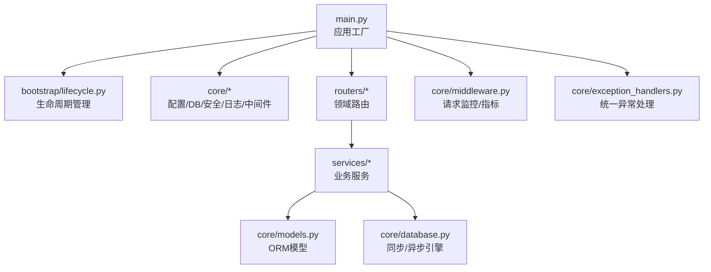
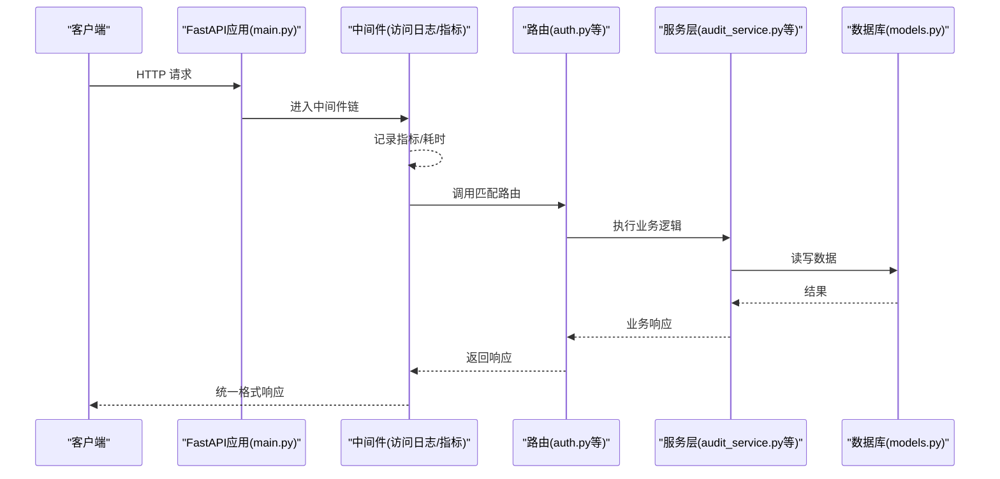
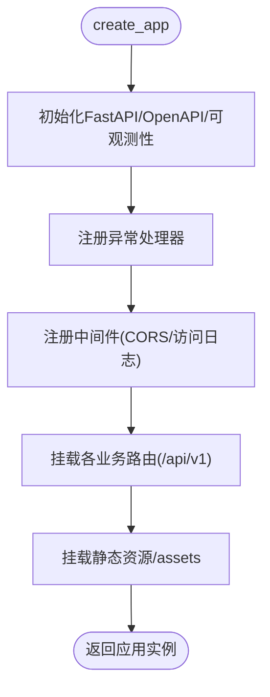
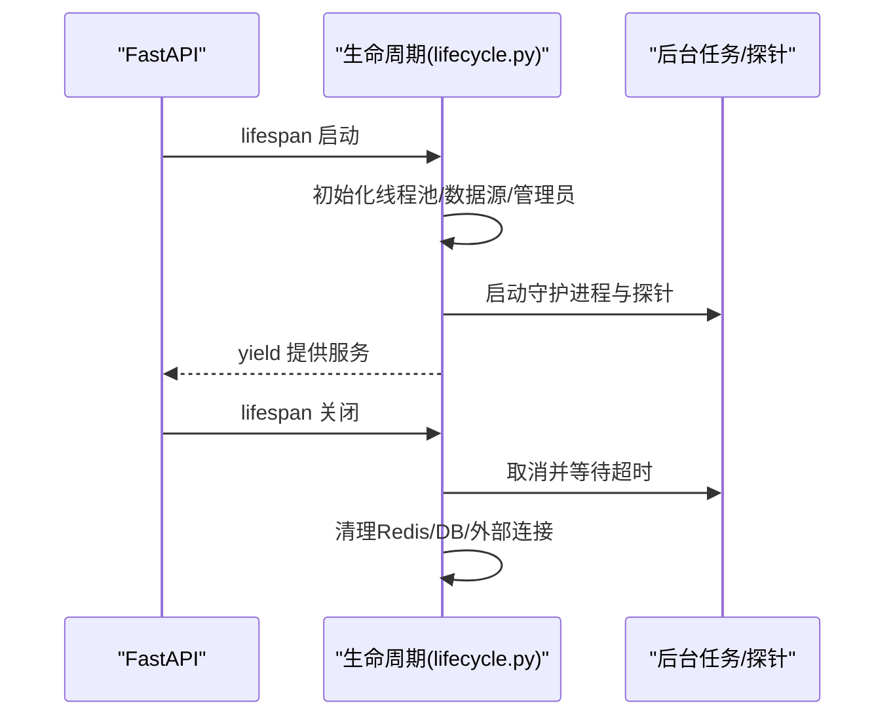
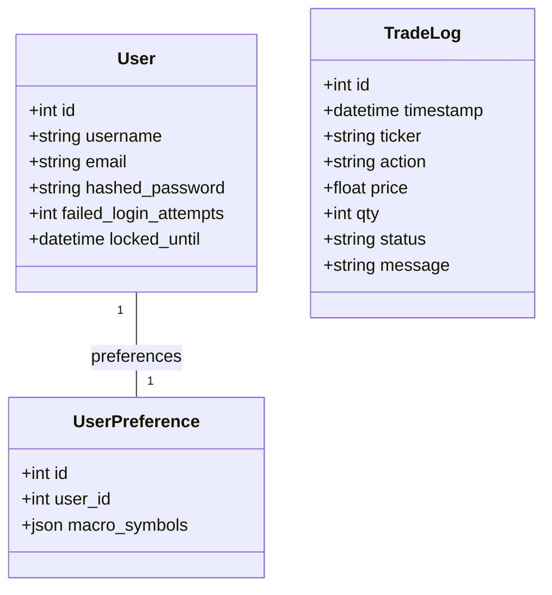
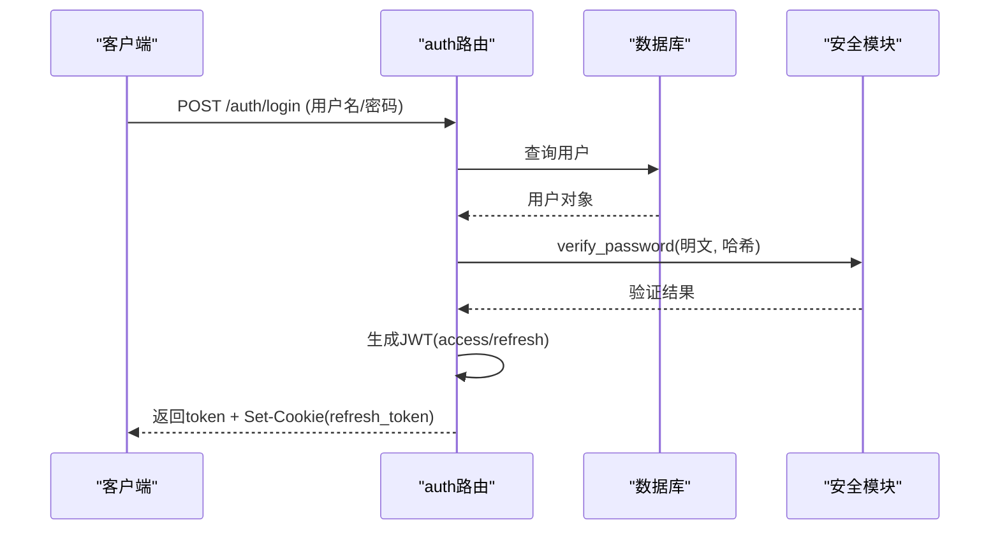
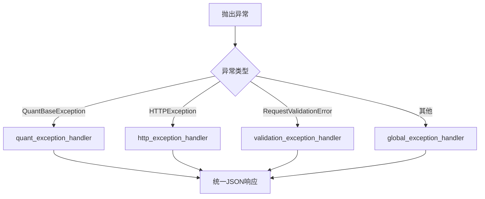
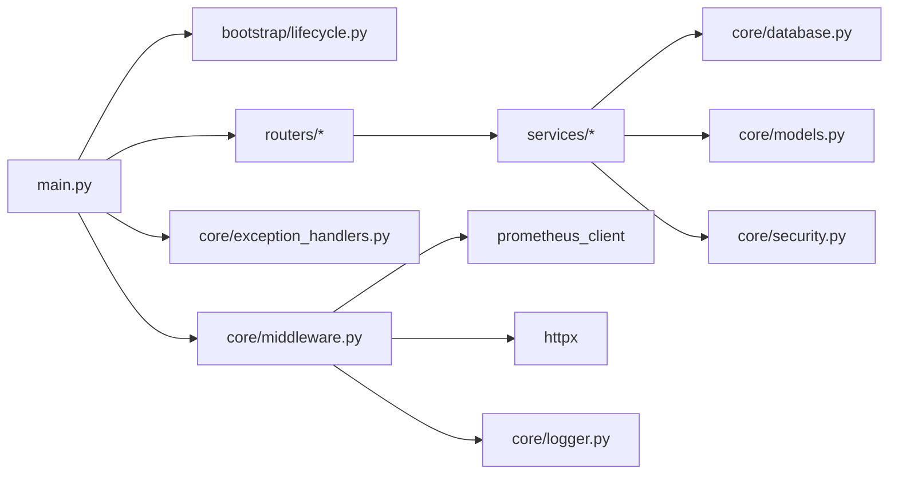

# 后端开发指南

<cite>
**本文引用的文件**
- [backend/main.py](file://backend/main.py)
- [backend/bootstrap/lifecycle.py](file://backend/bootstrap/lifecycle.py)
- [backend/core/config.py](file://backend/core/config.py)
- [backend/core/database.py](file://backend/core/database.py)
- [backend/core/security.py](file://backend/core/security.py)
- [backend/core/middleware.py](file://backend/core/middleware.py)
- [backend/core/exception_handlers.py](file://backend/core/exception_handlers.py)
- [backend/core/exceptions.py](file://backend/core/exceptions.py)
- [backend/core/error_codes.py](file://backend/core/error_codes.py)
- [backend/core/logger.py](file://backend/core/logger.py)
- [backend/routers/auth.py](file://backend/routers/auth.py)
- [backend/services/audit_service.py](file://backend/services/audit_service.py)
- [backend/core/models.py](file://backend/core/models.py)
</cite>

## 目录
1. [简介](#简介)
2. [项目结构](#项目结构)
3. [核心组件](#核心组件)
4. [架构总览](#架构总览)
5. [详细组件分析](#详细组件分析)
6. [依赖关系分析](#依赖关系分析)
7. [性能考量](#性能考量)
8. [故障排查指南](#故障排查指南)
9. [结论](#结论)
10. [附录](#附录)

## 简介
本指南面向Quant Agent后端开发者，系统化阐述FastAPI应用工厂、路由组织、服务层设计、数据访问层实现与基础设施（配置、数据库、安全、中间件、日志、可观测性）。文档提供API设计规范、错误处理策略、日志记录标准，并给出新增端点、实现业务逻辑、处理数据库操作的实践路径。同时覆盖测试策略、性能优化与调试方法，帮助新成员快速上手并遵循最佳实践。

## 项目结构
后端采用分层与模块化组织：
- 入口与应用装配：main.py 负责创建 FastAPI 实例、注册中间件、挂载路由、静态资源与OpenAPI定制。
- 生命周期管理：bootstrap/lifecycle.py 管理启动/关闭流程，初始化全局资源、后台任务与健康探针。
- 核心基础设施：core 下包含配置、数据库、安全、异常、日志、中间件、度量等通用能力。
- 路由层：routers 按领域划分，统一以 /api/v1 前缀挂载。
- 服务层：services 封装业务编排与外部集成，供路由调用。
- 数据模型：core/models.py 定义ORM模型；alembic 管理迁移。
- 监控与可观测性：middleware 集成Prometheus指标；logger 提供结构化日志与告警；lifecycle 启动各类守护进程。

图表来源
- [backend/main.py:125-218](file://backend/main.py#L125-L218)
- [backend/bootstrap/lifecycle.py:42-150](file://backend/bootstrap/lifecycle.py#L42-L150)
- [backend/core/middleware.py:90-133](file://backend/core/middleware.py#L90-L133)
- [backend/core/exception_handlers.py:93-102](file://backend/core/exception_handlers.py#L93-L102)

章节来源
- [backend/main.py:1-222](file://backend/main.py#L1-L222)
- [backend/bootstrap/lifecycle.py:1-492](file://backend/bootstrap/lifecycle.py#L1-L492)

## 核心组件
- 配置管理：使用 Pydantic Settings v2 集中读取环境变量，强制关键配置存在，并提供环境判断属性。
- 数据库连接：提供同步与异步引擎、会话工厂与获取依赖；SQLite/PostgreSQL双模式，连接池参数可配置。
- 安全认证：JWT登录/刷新、Cookie策略、Google OAuth校验；内部通信HMAC签名防护横向渗透。
- 中间件机制：AccessLogMiddleware 采集请求计数与耗时直方图，httpx拦截器统计外部API调用；CORS与访问日志顺序严格保证。
- 异常处理：统一捕获 QuantBaseException、HTTPException、RequestValidationError 与兜底异常，返回一致JSON格式。
- 日志记录：Rich控制台输出+分级文件落盘+队列异步分发+Webhook严重告警；接管Uvicorn/FastAPI默认日志。

章节来源
- [backend/core/config.py:20-134](file://backend/core/config.py#L20-L134)
- [backend/core/database.py:1-67](file://backend/core/database.py#L1-L67)
- [backend/core/security.py:20-160](file://backend/core/security.py#L20-L160)
- [backend/core/middleware.py:1-133](file://backend/core/middleware.py#L1-L133)
- [backend/core/exception_handlers.py:1-102](file://backend/core/exception_handlers.py#L1-L102)
- [backend/core/logger.py:129-212](file://backend/core/logger.py#L129-L212)

## 架构总览
后端以FastAPI为中心，通过应用工厂组装中间件、异常处理器、OpenAPI与路由；生命周期管理器在启动时完成数据源注册、默认管理员初始化、后台任务与探针启动，并在关闭时优雅释放资源。

图表来源
- [backend/main.py:125-218](file://backend/main.py#L125-L218)
- [backend/core/middleware.py:90-133](file://backend/core/middleware.py#L90-L133)
- [backend/routers/auth.py:117-162](file://backend/routers/auth.py#L117-L162)
- [backend/services/audit_service.py:43-80](file://backend/services/audit_service.py#L43-L80)
- [backend/core/models.py:37-74](file://backend/core/models.py#L37-L74)

## 详细组件分析

### 应用工厂与路由组织
- 应用工厂 create_app() 集中创建FastAPI实例、安装OpenAPI、初始化可观测性与异常处理、注册中间件与CORS、挂载所有路由与静态资源。
- 路由按领域拆分，统一以 /api/v1 前缀挂载；系统健康检查与MCP等根级路由单独挂载。
- CORS与访问日志顺序严格保证：先注册 AccessLogMiddleware，再注册 CORSMiddleware，确保OPTIONS预检不产生未匹配路由。

图表来源
- [backend/main.py:125-218](file://backend/main.py#L125-L218)

章节来源
- [backend/main.py:125-218](file://backend/main.py#L125-L218)

### 生命周期管理
- 启动阶段：限制线程池容量、注册数据源适配器、初始化默认管理员账号、外部服务连通性预检、启动Agent工具注册与LLM客户端、启动NAV快照与OMS持仓同步守护进程、订阅Finnhub WS tick回灌、启动限流告警与数据源健康监控、配额成本监控、可用性拨测与熔断自愈探针。
- 关闭阶段：取消后台任务、等待超时保护、关闭Redis批量队列与临时缓存、关闭外部长连接与数据库连接池。

图表来源
- [backend/bootstrap/lifecycle.py:42-150](file://backend/bootstrap/lifecycle.py#L42-L150)
- [backend/bootstrap/lifecycle.py:324-492](file://backend/bootstrap/lifecycle.py#L324-L492)

章节来源
- [backend/bootstrap/lifecycle.py:1-492](file://backend/bootstrap/lifecycle.py#L1-L492)

### 配置管理
- 使用 Pydantic Settings v2 集中读取 .env 环境变量，支持大小写不敏感与额外字段忽略。
- 关键配置校验：DATABASE_URL必填且仅允许sqlite/postgresql；EMBEDDING_API_KEY必填；开启实盘交易时必须配置Futu解锁密码。
- 提供 is_production/is_development 便捷属性用于环境分支逻辑。

章节来源
- [backend/core/config.py:20-134](file://backend/core/config.py#L20-L134)

### 数据库连接与数据访问
- 同步引擎：根据DATABASE_URL选择SQLite或PostgreSQL，配置连接池参数（pool_size、max_overflow、pool_timeout、pool_recycle、pool_pre_ping）。
- 异步引擎：将URL转换为aiosqlite/asyncpg驱动，复用相同池化配置；提供 AsyncSessionLocal 与 get_async_db 依赖。
- ORM模型：User、TradeLog、UserPreference、SentimentRecord、IVSnapshot、AgentSession、ExpertTeamSession、PerformanceLog、ScreenerSubscription、SavedScreen等。

图表来源
- [backend/core/models.py:37-74](file://backend/core/models.py#L37-L74)
- [backend/core/database.py:1-67](file://backend/core/database.py#L1-L67)

章节来源
- [backend/core/database.py:1-67](file://backend/core/database.py#L1-L67)
- [backend/core/models.py:1-200](file://backend/core/models.py#L1-L200)

### 安全认证与内部通信安全
- JWT鉴权：登录接口生成access_token与refresh_token，设置HttpOnly Cookie；提供可选认证依赖解析用户；支持Google OAuth前端令牌验证。
- 内部通信安全：HMAC-SHA256签名生成与验证，防止内网横向渗透；提供FastAPI依赖 verify_internal_request 与辅助函数 add_internal_signature_to_headers。

图表来源
- [backend/routers/auth.py:117-162](file://backend/routers/auth.py#L117-L162)
- [backend/core/security.py:20-31](file://backend/core/security.py#L20-L31)

章节来源
- [backend/routers/auth.py:1-200](file://backend/routers/auth.py#L1-L200)
- [backend/core/security.py:20-160](file://backend/core/security.py#L20-L160)

### 中间件与可观测性
- 访问日志中间件：记录请求方法、端点、状态码与耗时；高基数内存泄漏防护（未匹配路由标记为UNMATCHED_ROUTE）；动态颜色标识慢请求。
- Prometheus指标：fastapi_requests_total、fastapi_request_duration_seconds、external_api_requests_total、external_api_request_duration_seconds；httpx拦截器统计第三方API调用耗时与状态码。
- CORS：允许跨域来源与方法，生产环境建议配合HTTPS与SameSite=None Secure的Cookie策略。

章节来源
- [backend/core/middleware.py:1-133](file://backend/core/middleware.py#L1-L133)

### 异常处理与错误码
- 统一异常处理器：捕获 QuantBaseException、HTTPException、RequestValidationError 与全局 Exception，返回统一JSON格式 {code, msg, data, ts}，并附加trace_id。
- 错误码体系：ErrorCode枚举定义成功、认证/鉴权、请求/资源、基础设施、内部错误等分类；映射到HTTP状态码便于前端处理。
- 自定义异常：DataSourceError、AuthMissingError、TokenExpiredError、PermissionDeniedError、ResourceNotFoundError、CircuitBreakerOpenError等。

图表来源
- [backend/core/exception_handlers.py:18-90](file://backend/core/exception_handlers.py#L18-L90)
- [backend/core/error_codes.py:15-55](file://backend/core/error_codes.py#L15-L55)
- [backend/core/exceptions.py:14-144](file://backend/core/exceptions.py#L14-L144)

章节来源
- [backend/core/exception_handlers.py:1-102](file://backend/core/exception_handlers.py#L1-L102)
- [backend/core/error_codes.py:1-55](file://backend/core/error_codes.py#L1-L55)
- [backend/core/exceptions.py:1-144](file://backend/core/exceptions.py#L1-L144)

### 日志记录标准
- 控制台输出：RichHandler带主题高亮，便于本地调试。
- 文件落盘：按级别分文件（debug/info/warning/error），定时切割保留30天。
- 异步队列：QueueHandler + QueueListener 非阻塞分发，避免I/O阻塞主流程。
- 告警：可选WebhookAlertHandler发送ERROR及以上级别告警至钉钉/企微/Telegram等。
- 统一接入：接管uvicorn/fastapi默认日志，消除格式不一致；降低SQLAlchemy INFO噪音。

章节来源
- [backend/core/logger.py:129-212](file://backend/core/logger.py#L129-L212)

### API接口设计规范
- 版本前缀：/api/v1，便于多版本共存与灰度发布。
- 路由组织：按领域拆分router，统一prefix挂载；系统健康检查与MCP等根级路由独立挂载。
- 认证：OAuth2PasswordBearer，access_token短时效，refresh_token通过HttpOnly Cookie管理；可选认证依赖用于匿名接口。
- 响应格式：统一由异常处理器包装为 {code, msg, data, ts}，成功响应建议保持一致结构。
- 审计：关键操作调用 audit_service.log_audit 记录动作、详情、IP、用户ID与trace_id。

章节来源
- [backend/main.py:120-218](file://backend/main.py#L120-L218)
- [backend/routers/auth.py:100-162](file://backend/routers/auth.py#L100-L162)
- [backend/services/audit_service.py:43-80](file://backend/services/audit_service.py#L43-L80)

### 添加新的API端点（示例步骤）
- 新建路由文件：在 backend/routers 下创建 xxx_router.py，定义APIRouter(prefix="/xxx", tags=["XXX"])。
- 编写端点：使用Pydantic模型校验请求体，调用 services/* 中的业务服务，必要时通过 core/database.get_db 获取会话进行数据访问。
- 挂载路由：在 main.py 的 create_app() 中引入并 application.include_router(xxx_router, prefix=API_PREFIX)。
- 认证与审计：需要认证的端点使用 Depends(get_current_user)，关键操作调用 log_audit 记录审计日志。
- 异常与错误码：业务异常继承 QuantBaseException 或抛出 AppError，统一由异常处理器处理。

章节来源
- [backend/main.py:162-218](file://backend/main.py#L162-L218)
- [backend/routers/auth.py:100-162](file://backend/routers/auth.py#L100-L162)
- [backend/services/audit_service.py:43-80](file://backend/services/audit_service.py#L43-L80)

### 实现业务逻辑与服务层
- 服务层职责：封装领域逻辑、编排外部服务（数据源、LLM、通知）、事务边界与重试/熔断策略。
- 数据访问：优先使用异步会话 get_async_db 在高并发场景；同步场景使用 get_db。
- 审计与追踪：在关键路径记录审计日志与trace_id，便于问题定位。
- 错误处理：抛出领域异常（如 DataSourceError、CircuitBreakerOpenError），由全局处理器统一转换。

章节来源
- [backend/services/audit_service.py:43-80](file://backend/services/audit_service.py#L43-L80)
- [backend/core/database.py:32-67](file://backend/core/database.py#L32-L67)
- [backend/core/exceptions.py:32-116](file://backend/core/exceptions.py#L32-L116)

### 处理数据库操作
- 同步操作：使用 SessionLocal 与 get_db 依赖，适合简单CRUD与低并发场景。
- 异步操作：使用 AsyncSessionLocal 与 get_async_db 依赖，适合高并发与IO密集型场景。
- 模型设计：遵循命名规范与索引策略，复杂字段使用JSON存储，向量字段兼容SQLite与PostgreSQL pgvector。

章节来源
- [backend/core/database.py:1-67](file://backend/core/database.py#L1-L67)
- [backend/core/models.py:37-200](file://backend/core/models.py#L37-L200)

## 依赖关系分析
- 应用装配依赖：main.py 依赖 lifecycle、middleware、exception_handlers、openapi_schema、otel_config、structlog_config、以及所有路由模块。
- 服务层依赖：services 依赖 core 下的 models、database、security、config、redis_client 等。
- 中间件与指标：middleware 依赖 prometheus_client、httpx、logger。
- 生命周期依赖：lifecycle 依赖 database、redis_client、security、services、workers 等。

图表来源
- [backend/main.py:58-218](file://backend/main.py#L58-L218)
- [backend/core/middleware.py:1-133](file://backend/core/middleware.py#L1-L133)
- [backend/bootstrap/lifecycle.py:42-150](file://backend/bootstrap/lifecycle.py#L42-L150)

章节来源
- [backend/main.py:58-218](file://backend/main.py#L58-L218)
- [backend/core/middleware.py:1-133](file://backend/core/middleware.py#L1-L133)
- [backend/bootstrap/lifecycle.py:42-150](file://backend/bootstrap/lifecycle.py#L42-L150)

## 性能考量
- 连接池与超时：数据库引擎配置 pool_size、max_overflow、pool_timeout、pool_recycle、pool_pre_ping；全局socket默认超时15秒防止死锁。
- 线程池限制：启动时限制 asyncio 与 AnyIO 最大物理线程池容量，防止OOM。
- 指标与慢请求：Prometheus直方图精细桶设计（5ms~1s），外部API慢请求（>3s）告警；中间件记录P95/P99耗时。
- 异步优先：高并发场景使用异步数据库会话与异步任务；后台守护进程使用协程与超时保护。
- 日志异步：QueueHandler + QueueListener 非阻塞写入，避免I/O阻塞主流程。

章节来源
- [backend/core/database.py:14-25](file://backend/core/database.py#L14-L25)
- [backend/main.py:25-26](file://backend/main.py#L25-L26)
- [backend/bootstrap/lifecycle.py:51-63](file://backend/bootstrap/lifecycle.py#L51-L63)
- [backend/core/middleware.py:18-38](file://backend/core/middleware.py#L18-L38)
- [backend/core/logger.py:183-190](file://backend/core/logger.py#L183-L190)

## 故障排查指南
- 统一错误响应：所有异常经 exception_handlers 转为 {code, msg, data, ts}，前端可按code分支处理。
- 追踪ID：全局兜底处理器生成trace_id并附带于响应，便于日志关联。
- 日志定位：结构化日志含方法、端点、耗时与颜色标识；文件按级别分割，便于检索。
- 外部依赖：httpx拦截器记录第三方API耗时与状态码，慢请求告警；数据源健康监控与熔断自愈探针提供可用性视图。
- 常见错误：
  - 数据库连接失败：检查 DATABASE_URL 与连接池参数；查看启动日志是否自动创建扩展与索引。
  - Token无效/过期：检查SECRET_KEY与Cookie SameSite/Secure配置；确认refresh_token有效。
  - 外部API不可用：观察 external_api_* 指标与告警；检查熔断状态与重试策略。

章节来源
- [backend/core/exception_handlers.py:76-90](file://backend/core/exception_handlers.py#L76-L90)
- [backend/core/logger.py:174-181](file://backend/core/logger.py#L174-L181)
- [backend/core/middleware.py:44-88](file://backend/core/middleware.py#L44-L88)
- [backend/bootstrap/lifecycle.py:107-122](file://backend/bootstrap/lifecycle.py#L107-L122)

## 结论
Quant Agent后端以FastAPI为核心，通过清晰的分层与模块化设计，实现了可扩展的路由组织、健壮的服务层编排、可靠的数据访问与完善的基础设施。统一的异常处理、结构化日志与可观测性指标为开发与运维提供了强大支撑。遵循本指南的实践路径，新成员可快速掌握后端开发规范，高效交付高质量功能。

## 附录
- 测试策略：
  - 单元测试：针对服务层与核心工具函数，使用pytest与mock隔离外部依赖。
  - 集成测试：对路由与数据库交互进行端到端验证，使用测试数据库与fixture。
  - 契约测试：基于OpenAPI生成客户端契约，确保前后端接口一致性。
- 调试方法：
  - 本地启用DEBUG日志与Rich控制台输出，结合trace_id定位问题。
  - 使用Prometheus/Grafana观察指标与慢请求；利用FlameGraph分析热点。
  - 通过health检查与探针诊断外部依赖状态。
- 最佳实践：
  - 新增端点遵循“路由-服务-数据访问”分层，保持单一职责。
  - 使用Pydantic模型校验输入，抛出领域异常而非裸HTTPException。
  - 关键操作记录审计日志，敏感信息脱敏。
  - 异步优先，合理配置连接池与超时，避免阻塞主循环。