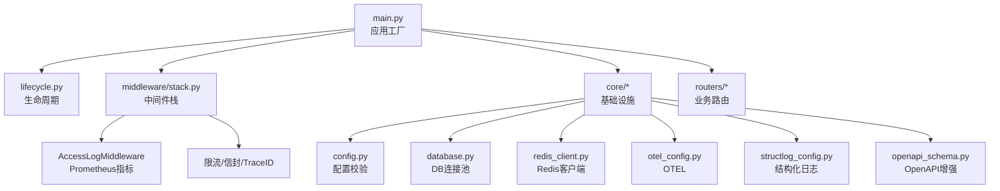
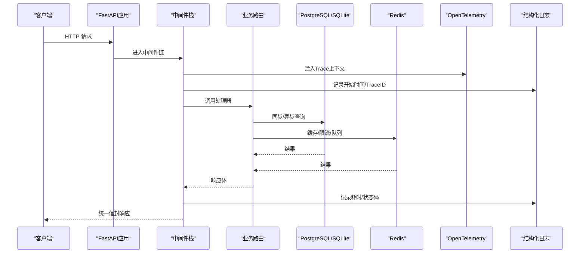
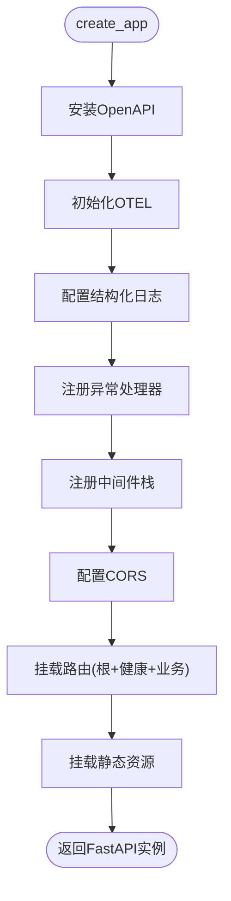
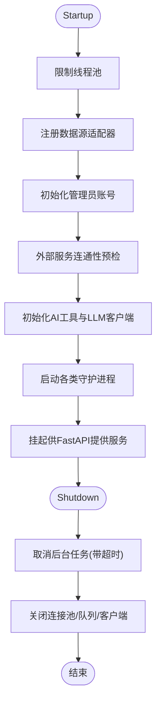
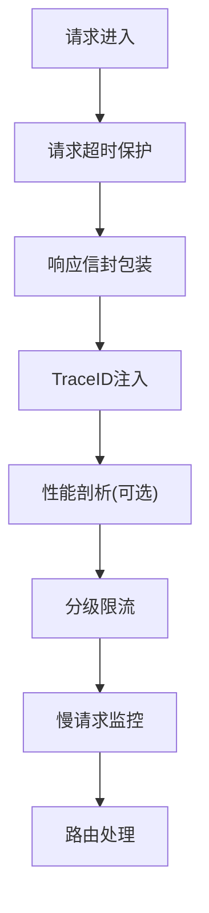
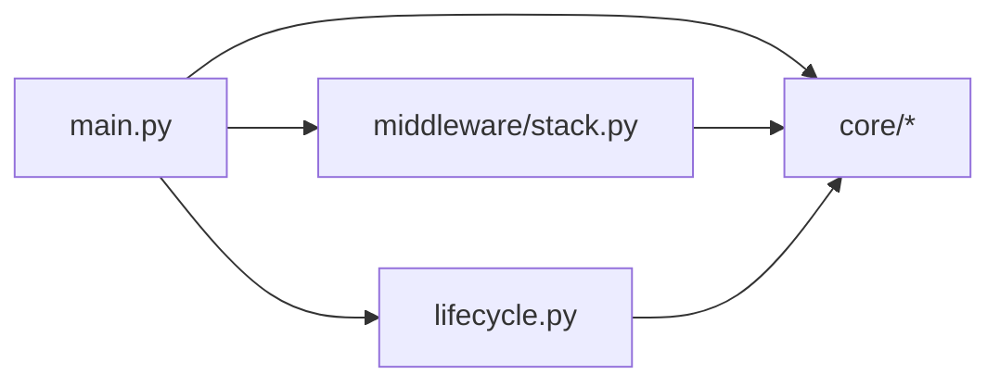

# 后端架构详解

<cite>
**本文引用的文件**
- [backend/main.py](file://backend/main.py)
- [backend/bootstrap/lifecycle.py](file://backend/bootstrap/lifecycle.py)
- [backend/core/config.py](file://backend/core/config.py)
- [backend/core/database.py](file://backend/core/database.py)
- [backend/core/redis_client.py](file://backend/core/redis_client.py)
- [backend/core/openapi_schema.py](file://backend/core/openapi_schema.py)
- [backend/core/otel_config.py](file://backend/core/otel_config.py)
- [backend/core/middleware.py](file://backend/core/middleware.py)
- [backend/core/exception_handlers.py](file://backend/core/exception_handlers.py)
- [backend/core/structlog_config.py](file://backend/core/structlog_config.py)
- [backend/middleware/stack.py](file://backend/middleware/stack.py)
- [backend/routers/system_health.py](file://backend/routers/system_health.py)
</cite>

## 目录
1. [简介](#简介)
2. [项目结构](#项目结构)
3. [核心组件](#核心组件)
4. [架构总览](#架构总览)
5. [详细组件分析](#详细组件分析)
6. [依赖关系分析](#依赖关系分析)
7. [性能考量](#性能考量)
8. [故障排查指南](#故障排查指南)
9. [结论](#结论)
10. [附录：扩展指南](#附录扩展指南)

## 简介
本技术文档面向Quant Agent后端，系统性阐述FastAPI应用工厂模式、生命周期管理、中间件栈设计；详细说明数据库连接池、Redis客户端、OpenTelemetry配置、日志系统配置的初始化顺序与依赖关系；解释路由注册机制、CORS配置、异常处理框架；并提供架构图与交互流程图，帮助新开发者快速理解并安全扩展。

## 项目结构
后端采用“入口装配 + 生命周期编排 + 中间件栈 + 业务路由”的分层组织方式：
- 入口装配：main.py 负责创建 FastAPI 实例、安装可观测性、注册异常处理器与中间件、挂载CORS、统一前缀挂载所有路由、提供静态资源。
- 生命周期：bootstrap/lifecycle.py 通过 lifespan 钩子完成启动期自检、后台任务拉起、关闭期优雅停机。
- 基础设施：core 下包含配置、数据库、Redis、OpenAPI、OTEL、日志、限流等通用能力。
- 中间件栈：middleware/stack.py 集中注册响应信封、trace_id注入、性能剖析、分级限流、慢请求监控等。
- 路由层：routers 按领域划分，统一以 /api/v1 前缀挂载。

图表来源
- [backend/main.py:125-218](file://backend/main.py#L125-L218)
- [backend/bootstrap/lifecycle.py:42-322](file://backend/bootstrap/lifecycle.py#L42-L322)
- [backend/middleware/stack.py:76-239](file://backend/middleware/stack.py#L76-L239)

章节来源
- [backend/main.py:1-222](file://backend/main.py#L1-L222)
- [backend/bootstrap/lifecycle.py:1-492](file://backend/bootstrap/lifecycle.py#L1-L492)

## 核心组件
- 应用工厂与路由注册：create_app() 组装 OpenAPI、OTEL、日志、异常处理器、中间件、CORS、路由与静态资源。
- 生命周期管理：app_lifespan 在启动阶段执行数据源适配器注册、默认管理员账号初始化、外部服务连通性预检、AI工具注册、LLM客户端初始化、多类守护进程（NAV快照、OMS持仓同步、MarketEngine广播、订阅回灌、配额/健康/拨测监控等），并在关闭阶段有序取消任务、释放连接。
- 配置中心：基于 Pydantic Settings v2 的环境变量强校验，强制 fail-fast。
- 数据库：同步/异步引擎与连接池参数化，自动建表与索引。
- Redis：连接池、批量写入队列、进程内L1缓存。
- 可观测性：OpenTelemetry 自动埋点与导出，结构化日志携带 trace_id/symbol/latency_ms。
- 中间件栈：响应信封、TraceID注入、性能剖析、分级限流、慢请求监控、访问日志与Prometheus指标。
- 异常处理：统一错误码与响应信封，覆盖业务异常、HTTP异常、参数校验异常与兜底异常。

章节来源
- [backend/main.py:125-218](file://backend/main.py#L125-L218)
- [backend/bootstrap/lifecycle.py:42-322](file://backend/bootstrap/lifecycle.py#L42-L322)
- [backend/core/config.py:20-134](file://backend/core/config.py#L20-L134)
- [backend/core/database.py:1-67](file://backend/core/database.py#L1-L67)
- [backend/core/redis_client.py:1-252](file://backend/core/redis_client.py#L1-L252)
- [backend/core/otel_config.py:220-302](file://backend/core/otel_config.py#L220-L302)
- [backend/core/structlog_config.py:111-180](file://backend/core/structlog_config.py#L111-L180)
- [backend/middleware/stack.py:76-239](file://backend/middleware/stack.py#L76-L239)
- [backend/core/exception_handlers.py:18-102](file://backend/core/exception_handlers.py#L18-L102)

## 架构总览
下图展示从请求进入网关到返回响应的完整链路，包括中间件栈、路由、服务与基础设施的交互。

图表来源
- [backend/middleware/stack.py:76-239](file://backend/middleware/stack.py#L76-L239)
- [backend/core/middleware.py:90-133](file://backend/core/middleware.py#L90-L133)
- [backend/core/otel_config.py:220-302](file://backend/core/otel_config.py#L220-L302)
- [backend/core/structlog_config.py:111-180](file://backend/core/structlog_config.py#L111-L180)

## 详细组件分析

### 应用工厂与路由注册
- create_app() 中依次完成：
  - 安装自定义 OpenAPI（统一标签、示例、描述）
  - 初始化 OTEL 与结构化日志
  - 注册全局异常处理器
  - 注册中间件栈（含超时保护、响应信封、TraceID、限流、慢请求）
  - 配置 CORS（注意 Starlette 逆序执行，先注册 AccessLogMiddleware，再注册 CORSMiddleware）
  - 挂载根级路由与健康检查路由，以及所有业务路由（统一 /api/v1 前缀）
  - 挂载前端静态资源

图表来源
- [backend/main.py:125-218](file://backend/main.py#L125-L218)
- [backend/core/openapi_schema.py:191-276](file://backend/core/openapi_schema.py#L191-L276)

章节来源
- [backend/main.py:125-218](file://backend/main.py#L125-L218)
- [backend/core/openapi_schema.py:191-276](file://backend/core/openapi_schema.py#L191-L276)

### 生命周期管理（启动/关闭）
- 启动阶段关键步骤：
  - 限制全局线程池容量，防止OOM
  - 注册数据源适配器（Facade 选源）
  - 初始化默认管理员账号（支持强制重置）
  - 外部服务连通性预检（通知/FRED），失败降级不阻塞启动
  - 初始化 AI 工具注册表与 LLM 客户端
  - 启动多类后台任务：事件循环监控、MarketEngine广播、NAV快照、OMS持仓同步、BotRuntime/AlgoEngine恢复、Finnhub WS tick回灌、FMP盘后采集、限流告警消费器、数据源健康监控、配额成本监控、数据源可用性拨测、熔断自愈探针
- 关闭阶段：
  - 有序取消后台任务，设置超时保护
  - 关闭线程池、LLM客户端、Redis队列、临时缓存、数据源探测、外部HTTP连接池、数据库连接池

图表来源
- [backend/bootstrap/lifecycle.py:42-322](file://backend/bootstrap/lifecycle.py#L42-L322)
- [backend/bootstrap/lifecycle.py:324-492](file://backend/bootstrap/lifecycle.py#L324-L492)

章节来源
- [backend/bootstrap/lifecycle.py:42-322](file://backend/bootstrap/lifecycle.py#L42-L322)
- [backend/bootstrap/lifecycle.py:324-492](file://backend/bootstrap/lifecycle.py#L324-L492)

### 配置与环境变量
- 使用 Pydantic Settings v2 集中管理环境变量，必填字段缺失时直接 fail-fast
- 关键配置项：数据库URL、Redis、LLM、Embedding、数据源密钥、Futu、告警通道、内部通信密钥、Meilisearch等
- 提供 is_production/is_development 便捷属性

章节来源
- [backend/core/config.py:20-134](file://backend/core/config.py#L20-L134)

### 数据库连接池
- 同步引擎：根据 DATABASE_URL 选择 SQLite 或 PostgreSQL/MySQL，连接池参数化（pool_size、max_overflow、pool_timeout、recycle、pre_ping）
- 异步引擎：将 URL 转换为 aiosqlite/asyncpg，复用相同池参数
- 启动时自动创建表与索引（如 pgvector、pg_trgm 扩展及 GIN 索引）

章节来源
- [backend/core/database.py:1-67](file://backend/core/database.py#L1-L67)
- [backend/main.py:32-57](file://backend/main.py#L32-L57)

### Redis客户端与批写队列
- 连接池：host/port/password 可配，最大连接数可配，协议降级为 RESP2 兼容
- 异步批写队列：高吞吐 set 场景通过队列聚合与 pipeline 批量写入，降低RTT与带宽占用；优雅停止确保数据落盘
- 进程内L1缓存：热点键本地短效缓存，定期清理过期条目，容量超限安全熔断清空

章节来源
- [backend/core/redis_client.py:1-252](file://backend/core/redis_client.py#L1-L252)

### OpenTelemetry配置
- 可选依赖：若未安装则降级为 NoOp，不影响运行
- 自动埋点：FastAPI、Logging、Redis、Requests、HTTPX、SQLAlchemy
- 采样率、服务名、环境、导出端点均可配置；支持 W3C Trace Context 透传
- 提供 traced_span、set_span_error 等工具函数

章节来源
- [backend/core/otel_config.py:220-302](file://backend/core/otel_config.py#L220-L302)

### 结构化日志
- 通过 structlog 绑定标准 logging，输出 JSON（生产）或彩色 key=value（开发）
- 每条日志自动携带 trace_id、symbol、latency_ms
- 支持 bind_context 动态绑定上下文字段

章节来源
- [backend/core/structlog_config.py:111-180](file://backend/core/structlog_config.py#L111-L180)
- [backend/core/structlog_config.py:204-225](file://backend/core/structlog_config.py#L204-L225)

### 中间件栈设计
- 注册顺序（后注册先执行）：
  - 请求超时保护（最外层）
  - 响应信封包装（非流式JSON统一封装）
  - TraceID注入（读取上游x-trace-id或生成，写入响应头X-Trace-Id）
  - 性能剖析（?profile=true 返回HTML调用树）
  - 分级限流（Gateway级 + API特定级，基于Redis原子操作）
  - 慢请求监控（>1.5s记录并异步上报）
- AccessLogMiddleware（core/middleware.py）：统计请求计数、延迟直方图、外部API出口监控

图表来源
- [backend/middleware/stack.py:76-239](file://backend/middleware/stack.py#L76-L239)
- [backend/core/middleware.py:90-133](file://backend/core/middleware.py#L90-L133)

章节来源
- [backend/middleware/stack.py:76-239](file://backend/middleware/stack.py#L76-L239)
- [backend/core/middleware.py:90-133](file://backend/core/middleware.py#L90-L133)

### 路由注册机制与CORS
- 路由统一以 /api/v1 前缀挂载，根级路由用于健康检查、监控、MCP探针等
- CORS 允许指定来源与方法，启用凭据；注意中间件顺序避免 OPTIONS 被误拦截

章节来源
- [backend/main.py:120-218](file://backend/main.py#L120-L218)
- [backend/routers/system_health.py:173-246](file://backend/routers/system_health.py#L173-L246)

### 异常处理框架
- 统一捕获 QuantBaseException、AppError、HTTPException、RequestValidationError 与全局 Exception
- 统一返回 {code, msg, data, ts} 信封格式，错误码映射HTTP状态码
- 全局兜底异常附带 trace_id 便于追踪

章节来源
- [backend/core/exception_handlers.py:18-102](file://backend/core/exception_handlers.py#L18-L102)

## 依赖关系分析
- main.py 依赖 lifecycle、middleware、core 各模块，并按顺序装配
- lifecycle 依赖 services、workers、core 基础设施，启动后台任务
- middleware/stack 依赖 core 中的 error_codes、otel_config、structlog_config、redis_client
- core 模块之间解耦清晰：config 独立；database/redis_client 独立；otel_config/structlog_config 独立；openapi_schema 独立

图表来源
- [backend/main.py:125-218](file://backend/main.py#L125-L218)
- [backend/bootstrap/lifecycle.py:42-322](file://backend/bootstrap/lifecycle.py#L42-L322)
- [backend/middleware/stack.py:76-239](file://backend/middleware/stack.py#L76-L239)

章节来源
- [backend/main.py:125-218](file://backend/main.py#L125-L218)
- [backend/bootstrap/lifecycle.py:42-322](file://backend/bootstrap/lifecycle.py#L42-L322)
- [backend/middleware/stack.py:76-239](file://backend/middleware/stack.py#L76-L239)

## 性能考量
- 线程池限制：全局 asyncio/AnyIO 线程池上限控制，避免OOM
- 数据库连接池：合理 pool_size/max_overflow/pool_timeout/recycle/pre_ping，减少连接抖动
- Redis批写：高频写入走队列聚合与pipeline，降低RTT与带宽
- L1缓存：热点键本地缓存，定期清理，容量超限安全熔断
- 中间件开销：Prometheus指标与日志为内存操作，低开销；限流基于Redis原子操作
- 慢请求监控：>1.5s记录并异步上报，避免阻塞主流程

[本节为通用指导，无需具体文件引用]

## 故障排查指南
- 健康检查：
  - /health：进程存活（liveness）
  - /health/ready：就绪检查（Redis + PG + 至少一个数据源连通）
  - /health/deep：全链路诊断（组件健康、数据源就绪、采集器心跳、WS连接、线程池、事件循环lag、熔断状态）
- Prometheus指标：/metrics（Basic Auth保护）
- 常见异常：
  - 限流不可用：生产环境会拒绝非豁免请求，需检查Redis连接
  - 外部服务预检失败：启动阶段降级跳过，不影响API启动
  - 数据库连接失败：启动时自动建表失败会记录警告，需确认服务可用

章节来源
- [backend/routers/system_health.py:173-246](file://backend/routers/system_health.py#L173-L246)
- [backend/routers/system_health.py:249-355](file://backend/routers/system_health.py#L249-L355)
- [backend/routers/system_health.py:51-56](file://backend/routers/system_health.py#L51-L56)

## 结论
Quant Agent 后端以 FastAPI 应用工厂为核心，结合生命周期管理与分层中间件栈，实现了高可用的网关能力。通过严格的配置校验、健壮的数据库与Redis连接管理、完善的可观测性与日志体系，以及统一的异常处理框架，保障了系统的稳定性与可维护性。新开发者可依据本文档逐步理解并扩展中间件、服务组件与环境配置。

[本节为总结，无需具体文件引用]

## 附录：扩展指南

### 如何扩展中间件
- 在 middleware/stack.py 的 register_middleware 中添加新的 @app.middleware("http") 协程
- 注意执行顺序：后注册的先执行；如需包裹整条链，放在最外层
- 示例路径参考：
  - [backend/middleware/stack.py:76-239](file://backend/middleware/stack.py#L76-L239)

章节来源
- [backend/middleware/stack.py:76-239](file://backend/middleware/stack.py#L76-L239)

### 如何添加新的服务组件
- 在 bootstrap/lifecycle.py 的 app_lifespan 启动阶段注册服务或启动守护进程
- 在关闭阶段确保优雅停止与资源释放
- 示例路径参考：
  - [backend/bootstrap/lifecycle.py:42-322](file://backend/bootstrap/lifecycle.py#L42-L322)
  - [backend/bootstrap/lifecycle.py:324-492](file://backend/bootstrap/lifecycle.py#L324-L492)

章节来源
- [backend/bootstrap/lifecycle.py:42-322](file://backend/bootstrap/lifecycle.py#L42-L322)
- [backend/bootstrap/lifecycle.py:324-492](file://backend/bootstrap/lifecycle.py#L324-L492)

### 如何配置环境变量
- 在 .env 或部署环境中设置对应环境变量，遵循 core/config.py 的字段命名
- 必填字段缺失将导致启动失败（fail-fast）
- 示例路径参考：
  - [backend/core/config.py:20-134](file://backend/core/config.py#L20-L134)

章节来源
- [backend/core/config.py:20-134](file://backend/core/config.py#L20-L134)