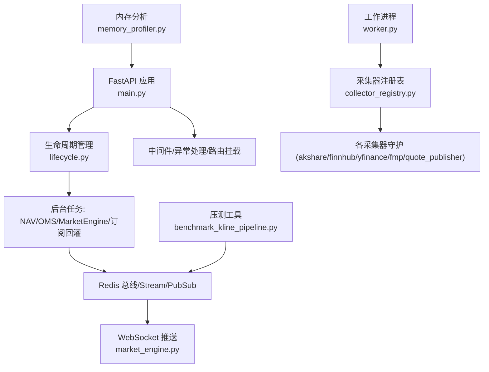
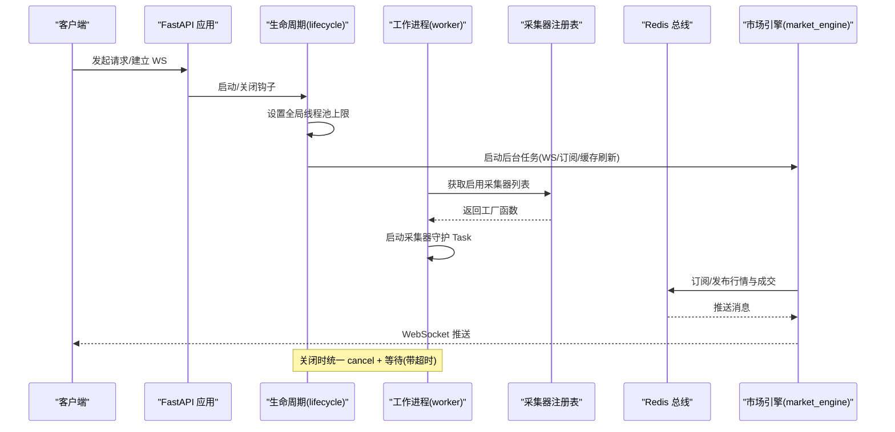
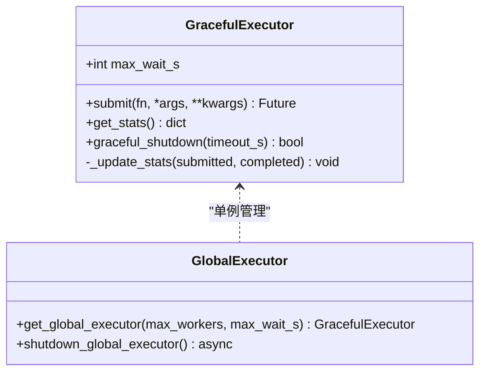
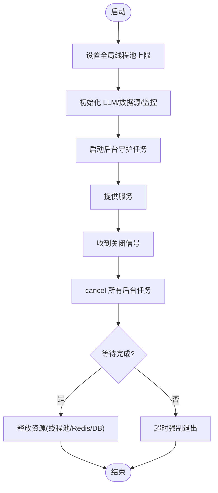
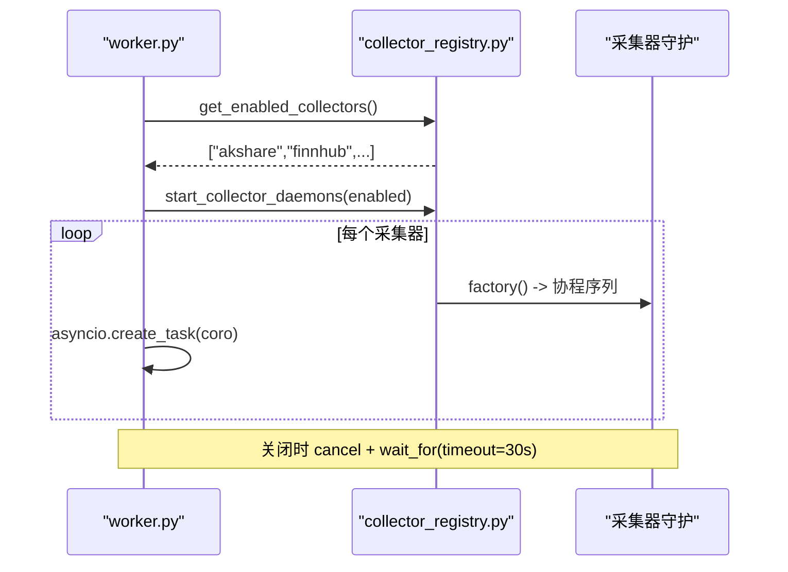
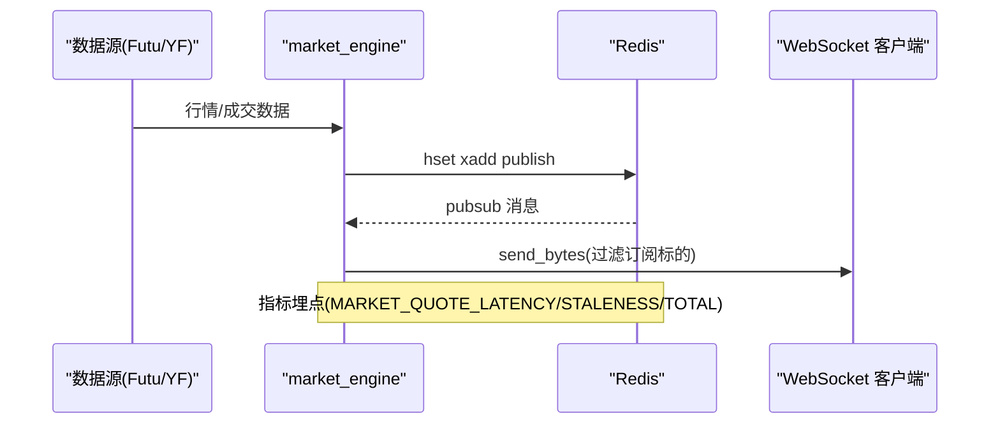
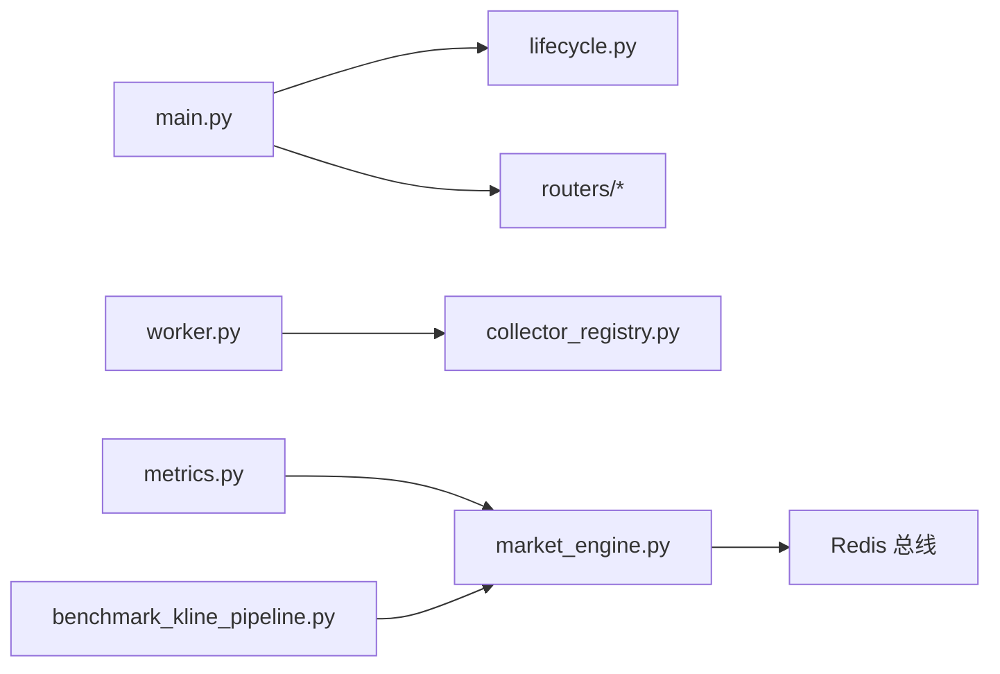

# 异步编程与并发优化

<cite>
**本文引用的文件**
- [backend/main.py](file://backend/main.py)
- [backend/bootstrap/lifecycle.py](file://backend/bootstrap/lifecycle.py)
- [backend/worker.py](file://backend/worker.py)
- [backend/core/graceful_executor.py](file://backend/core/graceful_executor.py)
- [data_subservice/_internal/graceful_executor.py](file://data_subservice/_internal/graceful_executor.py)
- [backend/workers/collector_registry.py](file://backend/workers/collector_registry.py)
- [backend/services/market_engine.py](file://backend/services/market_engine.py)
- [backend/scripts/benchmark_kline_pipeline.py](file://backend/scripts/benchmark_kline_pipeline.py)
- [scripts/memory_profiler.py](file://scripts/memory_profiler.py)
- [backend/core/metrics.py](file://backend/core/metrics.py)
</cite>

## 目录
1. [简介](#简介)
2. [项目结构](#项目结构)
3. [核心组件](#核心组件)
4. [架构总览](#架构总览)
5. [详细组件分析](#详细组件分析)
6. [依赖关系分析](#依赖关系分析)
7. [性能考量](#性能考量)
8. [故障排查指南](#故障排查指南)
9. [结论](#结论)
10. [附录](#附录)

## 简介
本指南聚焦 Quant Agent 的异步编程与并发优化实践，覆盖 FastAPI 生命周期管理、协程任务编排、工作进程模型、消息队列集成、分布式任务分发、优雅关闭与资源清理、线程池配置与限流、以及性能基准测试与内存泄漏检测。文档以代码级事实为依据，提供可操作的实践建议与调优方案。

## 项目结构
后端采用“主服务 + 子服务”的解耦架构：
- 主服务（FastAPI）负责 API 网关、生命周期管理、后台守护任务、WebSocket 推送与指标采集。
- 子服务（data_subservice）承载数据源连接与采集器，通过 HTTP/Redis 与主服务交互。
- 工作进程（worker）统一启动采集器守护与核心后台任务，并实现优雅关停。

**图示来源**
- [backend/main.py:125-218](file://backend/main.py#L125-L218)
- [backend/bootstrap/lifecycle.py:42-150](file://backend/bootstrap/lifecycle.py#L42-L150)
- [backend/worker.py:34-103](file://backend/worker.py#L34-L103)
- [backend/workers/collector_registry.py:48-124](file://backend/workers/collector_registry.py#L48-L124)
- [backend/services/market_engine.py:115-332](file://backend/services/market_engine.py#L115-L332)
- [backend/scripts/benchmark_kline_pipeline.py:47-96](file://backend/scripts/benchmark_kline_pipeline.py#L47-L96)
- [scripts/memory_profiler.py:17-36](file://scripts/memory_profiler.py#L17-L36)

**章节来源**
- [backend/main.py:125-218](file://backend/main.py#L125-L218)
- [backend/bootstrap/lifecycle.py:42-150](file://backend/bootstrap/lifecycle.py#L42-L150)
- [backend/worker.py:34-103](file://backend/worker.py#L34-L103)

## 核心组件
- GracefulExecutor：基于 ThreadPoolExecutor 的异步优雅执行器，支持超时等待、统计计数、全局单例与优雅关闭。
- 生命周期管理器：设置全局线程池上限、初始化 LLM 客户端、启动各类守护任务、并在关闭时有序取消与释放资源。
- 工作进程：启动 Redis 批量写入、按注册表启动采集器守护、拉起核心后台任务，统一优雅关停。
- 市场引擎：WebSocket 连接管理、Redis Pub/Sub 监听与广播、行情写入与指标埋点、防风暴退避与降级策略。
- 采集器注册表：声明式采集器元数据与工厂，集中启停采集器守护。
- 压测与内存分析：端到端延迟压测、模块导入内存占用分析、快照对比定位热点。

**章节来源**
- [backend/core/graceful_executor.py:26-187](file://backend/core/graceful_executor.py#L26-L187)
- [backend/bootstrap/lifecycle.py:42-150](file://backend/bootstrap/lifecycle.py#L42-L150)
- [backend/worker.py:34-103](file://backend/worker.py#L34-L103)
- [backend/services/market_engine.py:115-332](file://backend/services/market_engine.py#L115-L332)
- [backend/workers/collector_registry.py:48-124](file://backend/workers/collector_registry.py#L48-L124)
- [backend/scripts/benchmark_kline_pipeline.py:47-96](file://backend/scripts/benchmark_kline_pipeline.py#L47-L96)
- [scripts/memory_profiler.py:17-36](file://scripts/memory_profiler.py#L17-L36)

## 架构总览
Quant Agent 的并发与异步架构围绕“事件循环 + 后台任务 + 线程池 + Redis 总线”展开：
- FastAPI 使用 lifespan 管理启动/关闭，限制全局线程池容量，避免 OOM。
- 后台任务通过 asyncio.create_task 启动，统一在关闭阶段 cancel 并等待完成（带超时保护）。
- 同步阻塞任务通过 GracefulExecutor 提交到线程池，返回 asyncio.Future，便于统一管理。
- 行情与交易事件经 Redis Stream/PubSub 广播，WebSocket 消费者定向推送前端。
- 数据采集器通过注册表按需启动，支持分布式节点能力声明与熔断/健康监控。

**图示来源**
- [backend/bootstrap/lifecycle.py:42-150](file://backend/bootstrap/lifecycle.py#L42-L150)
- [backend/worker.py:34-103](file://backend/worker.py#L34-L103)
- [backend/workers/collector_registry.py:97-124](file://backend/workers/collector_registry.py#L97-L124)
- [backend/services/market_engine.py:160-332](file://backend/services/market_engine.py#L160-L332)

## 详细组件分析

### GracefulExecutor 优雅执行器
- 设计要点
  - 继承 ThreadPoolExecutor，重写 submit 返回 asyncio.Future，使同步任务可被事件循环 await。
  - 维护 submitted/completed/active_tasks 统计，线程安全更新。
  - graceful_shutdown 支持超时控制，兼容 Python 版本差异，确保在途任务尽可能完成。
  - 提供全局单例 get_global_executor 与 shutdown_global_executor 用于系统级线程池管理。
- 使用场景
  - CPU 密集或阻塞 IO 任务（如 pandas 计算、外部 SDK 调用）通过 executor.submit 提交。
  - 在 lifespan 关闭阶段调用 graceful_shutdown，避免强制中断导致的数据不一致。

**图示来源**
- [backend/core/graceful_executor.py:26-187](file://backend/core/graceful_executor.py#L26-L187)
- [data_subservice/_internal/graceful_executor.py:12-109](file://data_subservice/_internal/graceful_executor.py#L12-L109)

**章节来源**
- [backend/core/graceful_executor.py:26-187](file://backend/core/graceful_executor.py#L26-L187)
- [data_subservice/_internal/graceful_executor.py:12-109](file://data_subservice/_internal/graceful_executor.py#L12-L109)

### 生命周期与任务调度
- 启动阶段
  - 设置全局线程池最大容量（asyncio 默认 executor 与 anyio 线程限制），防止 OOM。
  - 初始化 LLM 客户端、注册数据源适配器、启动系统监控与各类守护任务（NAV、OMS、MarketEngine、订阅回灌等）。
- 关闭阶段
  - 收集所有后台任务，cancel 后 gather 等待完成，设置 30s 超时保护。
  - 优雅关闭线程池、Redis 批量队列、数据库连接池与外部长连接。

**图示来源**
- [backend/bootstrap/lifecycle.py:42-150](file://backend/bootstrap/lifecycle.py#L42-L150)
- [backend/bootstrap/lifecycle.py:324-492](file://backend/bootstrap/lifecycle.py#L324-L492)

**章节来源**
- [backend/bootstrap/lifecycle.py:42-150](file://backend/bootstrap/lifecycle.py#L42-L150)
- [backend/bootstrap/lifecycle.py:324-492](file://backend/bootstrap/lifecycle.py#L324-L492)

### 工作进程与采集器注册表
- worker.py
  - 启动 Redis 批量写入队列。
  - 通过 collector_registry 获取已启用采集器并启动守护 Task。
  - 非数据节点额外启动 ticker/sentiment/screener/paper_settlement/market_review/morning_briefing 等守护。
  - 统一优雅关停：cancel 所有任务，等待最多 30s，再释放 Redis/DB 资源。
- collector_registry.py
  - 定义采集器元数据与工厂，支持 akshare/finnhub/yfinance/fmp/cboe_pc_ratio/quote_publisher。
  - start_collector_daemons 遍历工厂，创建协程并封装为 Task。
  - stop_collector_daemons 统一 cancel 并 gather 等待。

**图示来源**
- [backend/worker.py:34-103](file://backend/worker.py#L34-L103)
- [backend/workers/collector_registry.py:48-124](file://backend/workers/collector_registry.py#L48-L124)

**章节来源**
- [backend/worker.py:34-103](file://backend/worker.py#L34-L103)
- [backend/workers/collector_registry.py:48-124](file://backend/workers/collector_registry.py#L48-L124)

### 市场引擎与消息队列集成
- WebSocket 连接管理
  - connect/disconnect/subscribe/unsubscribe 管理活跃连接与订阅集合。
  - 启动 background tasks：broadcast_loop 与 redis_pubsub_listener。
- Redis 总线
  - update_quote_to_redis：序列化 Protobuf，写入 hash 与 publish 到 stream。
  - update_trade_to_redis：xadd 到 Stream（maxlen 控制内存），publish 广播。
  - redis_pubsub_listener：订阅 quant:quotes:stream，解析 ticker 后定向推送。
- 防风暴与降级
  - 技术指标更新与资金流拉取采用退避与节流，避免打爆子服务线程池。
  - Futu 不可用自动降级至 YFinance，记录 last_futu_update 防止频繁重试。

**图示来源**
- [backend/services/market_engine.py:39-113](file://backend/services/market_engine.py#L39-L113)
- [backend/services/market_engine.py:160-332](file://backend/services/market_engine.py#L160-L332)
- [backend/core/metrics.py:24-47](file://backend/core/metrics.py#L24-L47)

**章节来源**
- [backend/services/market_engine.py:39-113](file://backend/services/market_engine.py#L39-L113)
- [backend/services/market_engine.py:160-332](file://backend/services/market_engine.py#L160-L332)
- [backend/core/metrics.py:24-47](file://backend/core/metrics.py#L24-L47)

### 分布式任务分发与分片
- 分片判断
  - is_my_shard 基于 WORKER_TOTAL 与 WORKER_ID，将任务标识稳定映射到工作节点，实现无锁分片。
- 采集器能力声明
  - COLLECTORS 中每个采集器描述其用途与是否需要 Postgres，worker 根据环境变量 DATA_NODE 决定是否跳过 DB 依赖服务。
- 节点角色
  - worker.py 区分主节点与子服务节点，子节点专注数据采集，主节点协调业务编排与后台任务。

**章节来源**
- [backend/core/utils.py:53-63](file://backend/core/utils.py#L53-L63)
- [backend/workers/collector_registry.py:48-85](file://backend/workers/collector_registry.py#L48-L85)
- [backend/worker.py:30-79](file://backend/worker.py#L30-L79)

### 并发安全与锁机制
- 线程安全统计
  - GracefulExecutor 通过 _update_stats 在提交与完成时原子更新计数器，避免竞态。
- 分布式锁
  - market_engine 使用 Redis set(nx=True, ex=...) 实现分布式防抖锁，避免多实例重复报警。
- 线程池限流
  - lifecycle 设置全局线程池上限与 anyio 线程限制，防止线程爆炸导致性能退化。

**章节来源**
- [backend/core/graceful_executor.py:92-108](file://backend/core/graceful_executor.py#L92-L108)
- [backend/services/market_engine.py:482-491](file://backend/services/market_engine.py#L482-L491)
- [backend/bootstrap/lifecycle.py:51-66](file://backend/bootstrap/lifecycle.py#L51-L66)

### 性能基准测试方法
- K线管道压测
  - 覆盖 Redis 层、Futu 行情获取、行情写入 Redis、端到端全链路四个阶段。
  - 输出 P50/P90/P95/P99 延迟统计，目标 P99 < 50ms。
- 使用方式
  - 命令行参数支持 symbols、iterations、stage，便于局部验证与回归测试。

**章节来源**
- [backend/scripts/benchmark_kline_pipeline.py:47-96](file://backend/scripts/benchmark_kline_pipeline.py#L47-L96)
- [backend/scripts/benchmark_kline_pipeline.py:98-220](file://backend/scripts/benchmark_kline_pipeline.py#L98-L220)
- [backend/scripts/benchmark_kline_pipeline.py:222-308](file://backend/scripts/benchmark_kline_pipeline.py#L222-L308)
- [backend/scripts/benchmark_kline_pipeline.py:314-368](file://backend/scripts/benchmark_kline_pipeline.py#L314-L368)

### 内存泄漏检测工具使用
- tracemalloc 快照
  - 启动追踪、拍摄初始快照、导入关键模块后再次快照，对比增长热点。
- 模块导入内存分析
  - 逐个导入 backend.core、services、hermes_agent 等模块，测量内存增量。
- 输出 Top 占用
  - 打印 top N 内存占用最高的文件与行号，辅助定位泄漏点。

**章节来源**
- [scripts/memory_profiler.py:17-36](file://scripts/memory_profiler.py#L17-L36)
- [scripts/memory_profiler.py:39-80](file://scripts/memory_profiler.py#L39-L80)
- [scripts/memory_profiler.py:82-118](file://scripts/memory_profiler.py#L82-L118)
- [scripts/memory_profiler.py:120-154](file://scripts/memory_profiler.py#L120-L154)

## 依赖关系分析
- 主服务依赖
  - FastAPI 路由、中间件、OpenAPI、异常处理、CORS。
  - 生命周期管理：数据库初始化、LLM 客户端、后台守护任务。
- 工作进程依赖
  - Redis 批量写入、采集器注册表、通知服务、ticker 服务。
- 市场引擎依赖
  - Redis（hset/xadd/publish/pubsub）、Protobuf 消息、指标埋点。
- 指标体系
  - Prometheus 指标覆盖行情延迟、WebSocket 连接数、Redis 队列深度、熔断状态、数据源可用性、节点心跳等。

**图示来源**
- [backend/main.py:125-218](file://backend/main.py#L125-L218)
- [backend/bootstrap/lifecycle.py:42-150](file://backend/bootstrap/lifecycle.py#L42-L150)
- [backend/worker.py:34-103](file://backend/worker.py#L34-L103)
- [backend/workers/collector_registry.py:48-124](file://backend/workers/collector_registry.py#L48-L124)
- [backend/services/market_engine.py:160-332](file://backend/services/market_engine.py#L160-L332)
- [backend/core/metrics.py:24-47](file://backend/core/metrics.py#L24-L47)
- [backend/scripts/benchmark_kline_pipeline.py:47-96](file://backend/scripts/benchmark_kline_pipeline.py#L47-L96)

**章节来源**
- [backend/main.py:125-218](file://backend/main.py#L125-L218)
- [backend/bootstrap/lifecycle.py:42-150](file://backend/bootstrap/lifecycle.py#L42-L150)
- [backend/worker.py:34-103](file://backend/worker.py#L34-L103)
- [backend/workers/collector_registry.py:48-124](file://backend/workers/collector_registry.py#L48-L124)
- [backend/services/market_engine.py:160-332](file://backend/services/market_engine.py#L160-L332)
- [backend/core/metrics.py:24-47](file://backend/core/metrics.py#L24-L47)
- [backend/scripts/benchmark_kline_pipeline.py:47-96](file://backend/scripts/benchmark_kline_pipeline.py#L47-L96)

## 性能考量
- 线程池容量
  - 全局线程池上限设置为 64，anyio 线程限制同步调整，避免 OOM 与线程竞争。
- 防风暴与退避
  - 技术指标更新与资金流拉取采用时间窗口与退避间隔，减少无效重试与请求风暴。
- 指标观测
  - 行情延迟 Summary、WebSocket 连接 Gauge、Redis 队列深度 Gauge、熔断状态 Gauge，便于实时诊断。
- 压测目标
  - P99 延迟 < 50ms，通过端到端压测验证 Redis/WS/Futu 链路性能。

[本节为通用指导，不直接分析具体文件]

## 故障排查指南
- 优雅关闭失败
  - 检查后台任务是否响应 cancel，确认 gather 等待超时（30s）是否合理。
  - 关注 Redis 批量队列关闭是否排空成功。
- 线程耗尽
  - 观察进程线程数指标，结合子服务 /health threads 进行双向监控。
- 数据源不可用
  - 查看熔断器状态与拨测指标，确认是否触发降级与告警。
- 内存泄漏
  - 使用 memory_profiler 对比快照，定位高占用模块与对象。

**章节来源**
- [backend/bootstrap/lifecycle.py:324-492](file://backend/bootstrap/lifecycle.py#L324-L492)
- [backend/core/metrics.py:100-110](file://backend/core/metrics.py#L100-L110)
- [backend/core/metrics.py:450-467](file://backend/core/metrics.py#L450-L467)
- [scripts/memory_profiler.py:17-36](file://scripts/memory_profiler.py#L17-L36)

## 结论
Quant Agent 通过 FastAPI 生命周期管理、GracefulExecutor 优雅执行器、工作进程与采集器注册表、Redis 总线与 WebSocket 推送，构建了高并发、低延迟、可观测的异步架构。配合压测工具与内存分析脚本，可实现从性能基线到问题定位的闭环。建议在新增后台任务时遵循统一的 task 管理、超时保护与指标埋点规范，确保系统稳定性与可维护性。

## 附录
- 最佳实践清单
  - 所有阻塞任务通过 GracefulExecutor 提交，返回 Future 并 await。
  - 后台任务统一在 lifespan 关闭阶段 cancel 并等待（带超时）。
  - 对外部 API 调用增加熔断、重试与指标埋点。
  - 使用 Redis 分布式锁避免多实例重复操作。
  - 定期运行压测与内存分析，纳入 CI 质量门禁。

[本节为通用指导，不直接分析具体文件]
