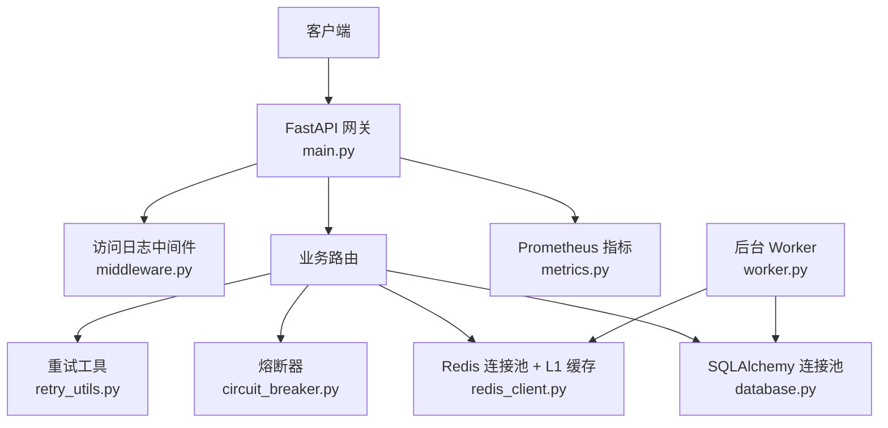
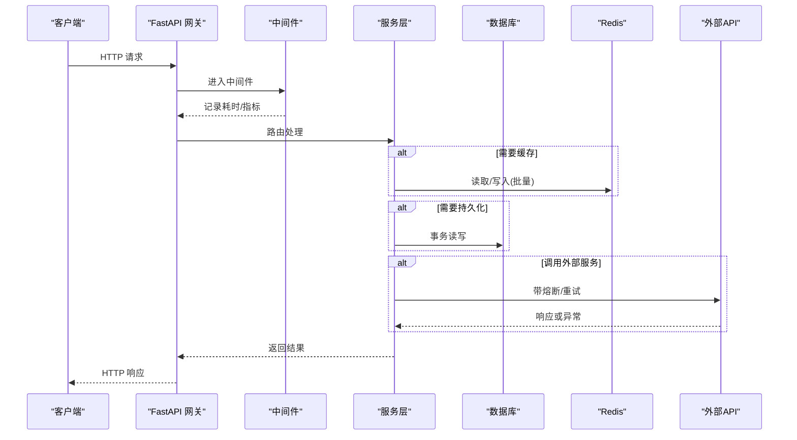
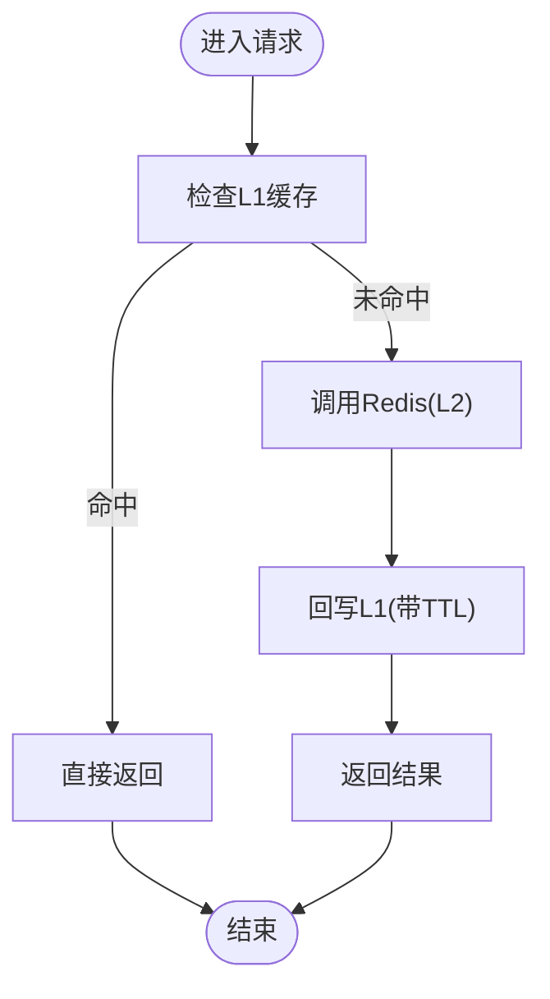
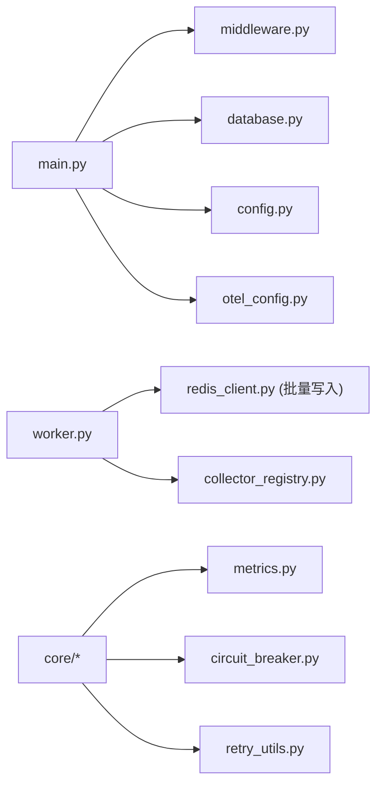

# 性能优化与调优

<cite>
**本文引用的文件**
- [backend/core/metrics.py](file://backend/core/metrics.py)
- [backend/core/cache_manager.py](file://backend/core/cache_manager.py)
- [backend/core/database.py](file://backend/core/database.py)
- [backend/core/redis_client.py](file://backend/core/redis_client.py)
- [backend/core/config.py](file://backend/core/config.py)
- [backend/core/circuit_breaker.py](file://backend/core/circuit_breaker.py)
- [backend/core/retry_utils.py](file://backend/core/retry_utils.py)
- [backend/core/middleware.py](file://backend/core/middleware.py)
- [backend/main.py](file://backend/main.py)
- [backend/worker.py](file://backend/worker.py)
</cite>

## 目录
1. [简介](#简介)
2. [项目结构](#项目结构)
3. [核心组件](#核心组件)
4. [架构总览](#架构总览)
5. [详细组件分析](#详细组件分析)
6. [依赖关系分析](#依赖关系分析)
7. [性能考量](#性能考量)
8. [故障排查指南](#故障排查指南)
9. [结论](#结论)
10. [附录](#附录)

## 简介
本指南面向Quant Agent后端性能工程师，围绕异步编程模式、并发策略、资源池化、数据库查询与索引优化、缓存策略、内存与GC、负载均衡与水平扩展、微服务优化、监控指标与APM集成、基准测试方法、常见瓶颈识别与JVM（Python进程）调优等主题，提供可落地的方法论与实践案例。所有实践均基于仓库现有实现进行提炼与总结。

## 项目结构
后端采用FastAPI网关+多Worker的异步事件驱动架构：
- 主进程负责HTTP请求处理、中间件、路由挂载、生命周期管理
- Worker进程负责后台任务、采集器守护、定时任务、批量写入队列
- Redis作为共享缓存与消息总线，配合L1本地缓存降低网络开销
- SQLAlchemy连接池管理数据库连接，支持同步/异步双引擎
- 熔断器与重试机制保障外部依赖稳定性
- Prometheus指标与OpenTelemetry贯穿全链路

**图表来源**
- [backend/main.py:125-218](file://backend/main.py#L125-L218)
- [backend/core/middleware.py:90-133](file://backend/core/middleware.py#L90-L133)
- [backend/core/database.py:1-67](file://backend/core/database.py#L1-L67)
- [backend/core/redis_client.py:1-252](file://backend/core/redis_client.py#L1-L252)
- [backend/core/circuit_breaker.py:64-379](file://backend/core/circuit_breaker.py#L64-L379)
- [backend/core/retry_utils.py:1-58](file://backend/core/retry_utils.py#L1-L58)
- [backend/core/metrics.py:1-641](file://backend/core/metrics.py#L1-L641)
- [backend/worker.py:34-103](file://backend/worker.py#L34-L103)

**章节来源**
- [backend/main.py:1-222](file://backend/main.py#L1-L222)
- [backend/worker.py:1-111](file://backend/worker.py#L1-L111)

## 核心组件
- 指标体系：统一在 metrics.py 定义并暴露 /metrics，覆盖行情延迟、WebSocket、Redis、熔断器、数据源可用性、数据质量、分布式节点、LLM/Agent、K线缓存命中等
- 缓存层：redis_client.py 提供全局连接池、异步批量写入队列、进程内L1短效缓存；cache_manager.py 提供受保护的缓存清理能力
- 数据库：database.py 提供同步/异步引擎与连接池参数配置化，支持PG/MySQL/SQLite
- 可靠性：circuit_breaker.py 实现CLOSED/OPEN/HALF_OPEN状态机，支持限流错误过滤；retry_utils.py 提供指数退避+抖动重试
- 可观测性：middleware.py 记录HTTP请求耗时与外部API调用；main.py 初始化OTEL与结构化日志
- 配置：config.py 使用Pydantic Settings集中校验关键配置，fail-fast启动

**章节来源**
- [backend/core/metrics.py:1-641](file://backend/core/metrics.py#L1-L641)
- [backend/core/redis_client.py:1-252](file://backend/core/redis_client.py#L1-L252)
- [backend/core/cache_manager.py:1-75](file://backend/core/cache_manager.py#L1-L75)
- [backend/core/database.py:1-67](file://backend/core/database.py#L1-L67)
- [backend/core/circuit_breaker.py:1-379](file://backend/core/circuit_breaker.py#L1-L379)
- [backend/core/retry_utils.py:1-58](file://backend/core/retry_utils.py#L1-L58)
- [backend/core/middleware.py:1-133](file://backend/core/middleware.py#L1-L133)
- [backend/core/config.py:1-134](file://backend/core/config.py#L1-L134)
- [backend/main.py:1-222](file://backend/main.py#L1-L222)

## 架构总览
系统以“网关+后台任务”的双进程模型运行：
- 主进程：接收HTTP请求，经中间件与路由分发到服务层，访问DB/Redis/外部API，上报指标
- Worker进程：启动Redis批量写入队列、采集器守护、定时任务，优雅关闭时排空队列并释放资源

**图表来源**
- [backend/main.py:125-218](file://backend/main.py#L125-L218)
- [backend/core/middleware.py:90-133](file://backend/core/middleware.py#L90-L133)
- [backend/core/redis_client.py:46-177](file://backend/core/redis_client.py#L46-L177)
- [backend/core/database.py:1-67](file://backend/core/database.py#L1-L67)
- [backend/core/circuit_breaker.py:147-218](file://backend/core/circuit_breaker.py#L147-L218)
- [backend/core/retry_utils.py:50-58](file://backend/core/retry_utils.py#L50-L58)

## 详细组件分析

### 异步与并发策略
- 主进程使用FastAPI+Uvicorn，默认单worker多线程/协程并发；可通过环境变量或部署配置调整workers数量以实现水平扩展
- Worker进程通过asyncio.gather并行启动多个守护任务，统一优雅取消与超时控制
- Redis批量写入队列将高频set操作合并为pipeline，显著降低RTT与带宽占用
- 进程内L1缓存对极热点键（如配置字典、开关）提供零阻塞读取，避免频繁网络往返

**图表来源**
- [backend/core/redis_client.py:184-252](file://backend/core/redis_client.py#L184-L252)

**章节来源**
- [backend/worker.py:34-103](file://backend/worker.py#L34-L103)
- [backend/core/redis_client.py:46-177](file://backend/core/redis_client.py#L46-L177)
- [backend/core/redis_client.py:184-252](file://backend/core/redis_client.py#L184-L252)

### 资源池化管理
- 数据库连接池：通过环境变量配置pool_size、max_overflow、pool_timeout、pool_recycle、pool_pre_ping，避免连接泄漏与长连接老化
- Redis连接池：统一设置max_connections，限制Pub/Sub、缓存、限流共用池上限，防止无界增长
- 批量写入队列：固定batch_size与flush_interval，平衡吞吐与延迟；优雅停机确保数据不丢失

**章节来源**
- [backend/core/database.py:14-25](file://backend/core/database.py#L14-L25)
- [backend/core/database.py:51-59](file://backend/core/database.py#L51-L59)
- [backend/core/redis_client.py:22-34](file://backend/core/redis_client.py#L22-L34)
- [backend/core/redis_client.py:46-177](file://backend/core/redis_client.py#L46-L177)

### 数据库查询优化与索引设计
- 自动创建pgvector与pg_trgm扩展，并为ticker表建立gin_trgm_ops索引，提升模糊匹配与相似度检索性能
- 建议结合业务查询模式添加复合索引、覆盖索引，减少回表；对高基数列谨慎建索引
- 慢查询分析：利用PostgreSQL pg_stat_statements或应用侧埋点（指标/日志）定位Top N慢查询，结合EXPLAIN分析执行计划

**章节来源**
- [backend/main.py:40-55](file://backend/main.py#L40-L55)

### 缓存策略设计
- 多级缓存：L1内存短效缓存（默认10秒TTL，容量保护）+ L2 Redis缓存；批量写入队列聚合写放大
- 安全清理：cache_manager.py 提供按前缀清理，但跳过交易态受保护前缀，防止误删
- K线缓存命中指标：区分redis/parquet/miss层级，便于评估命中率与降级路径

**章节来源**
- [backend/core/redis_client.py:184-252](file://backend/core/redis_client.py#L184-L252)
- [backend/core/cache_manager.py:19-75](file://backend/core/cache_manager.py#L19-L75)
- [backend/core/metrics.py:290-301](file://backend/core/metrics.py#L290-L301)

### 可靠性与弹性
- 熔断器：支持CLOSED/OPEN/HALF_OPEN状态机，可配置失败阈值与冷却时间；限流类错误不计入失败计数，避免误触发
- 重试机制：tenacity指数退避+随机抖动，针对429/403/超时/网络错误等场景自动重试
- 优雅关闭：Worker在退出时取消任务、等待超时、排空队列、关闭连接与引擎

**章节来源**
- [backend/core/circuit_breaker.py:45-379](file://backend/core/circuit_breaker.py#L45-L379)
- [backend/core/retry_utils.py:10-58](file://backend/core/retry_utils.py#L10-L58)
- [backend/worker.py:83-103](file://backend/worker.py#L83-L103)

### 监控指标与APM集成
- 指标定义：metrics.py 统一声明各类Counter/Gauge/Histogram/Summary，覆盖行情、WS、Redis、熔断、数据源、数据质量、分布式节点、LLM/Agent、K线缓存、进程线程水位等
- 中间件埋点：middleware.py 记录HTTP请求数、耗时直方图、外部API调用统计，并对慢出口API告警
- APM：main.py 初始化OpenTelemetry，结合Prometheus与Grafana构建可视化看板

**章节来源**
- [backend/core/metrics.py:1-641](file://backend/core/metrics.py#L1-L641)
- [backend/core/middleware.py:10-88](file://backend/core/middleware.py#L10-L88)
- [backend/main.py:136-142](file://backend/main.py#L136-L142)

### 负载均衡与水平扩展
- 网关层：通过Uvicorn workers数量实现进程级水平扩展；容器编排（如K8s Deployment）可横向扩容副本
- 数据层：Redis集群/哨兵、PostgreSQL主从/分片，配合连接池参数调优
- 任务层：Worker多任务并行，采集器守护按需启用；子服务节点隔离DB依赖，专注数据采集

**章节来源**
- [backend/main.py:125-218](file://backend/main.py#L125-L218)
- [backend/worker.py:34-79](file://backend/worker.py#L34-L79)

### 微服务架构优化
- 职责分离：主服务聚焦HTTP与编排，子服务专注数据源拉取与缓存健康，通过指标与探针解耦
- 容错边界：各子服务独立注册熔断与重试，主服务通过Facade聚合多源并监控偏差
- 可观测性：子服务与主服务分别暴露metrics，Grafana多job聚合展示

**章节来源**
- [backend/core/metrics.py:512-587](file://backend/core/metrics.py#L512-L587)

## 依赖关系分析
- main.py 依赖 middleware、routers、database、config、otel、structlog
- worker.py 依赖 redis_batch_writer、collector_registry、通知与定时服务
- core模块相互解耦：metrics被多处消费；redis_client提供连接池与缓存；database提供双引擎；circuit_breaker与retry_utils提供弹性

**图表来源**
- [backend/main.py:125-218](file://backend/main.py#L125-L218)
- [backend/worker.py:20-30](file://backend/worker.py#L20-L30)
- [backend/core/metrics.py:1-641](file://backend/core/metrics.py#L1-L641)
- [backend/core/circuit_breaker.py:1-379](file://backend/core/circuit_breaker.py#L1-L379)
- [backend/core/retry_utils.py:1-58](file://backend/core/retry_utils.py#L1-L58)

**章节来源**
- [backend/main.py:1-222](file://backend/main.py#L1-L222)
- [backend/worker.py:1-111](file://backend/worker.py#L1-L111)

## 性能考量
- 异步优先：所有IO密集型操作使用async/await，避免阻塞事件循环
- 批量化：Redis批量写入队列减少RTT；数据库批量插入/更新
- 缓存命中：L1/L2多级缓存，K线缓存分层命中；合理TTL与容量保护
- 连接池：DB与Redis连接池参数根据负载调优，避免连接耗尽或闲置浪费
- 熔断与重试：对外部依赖实施熔断与指数退避，降低雪崩风险
- 指标驱动：通过Prometheus指标与APM持续观测P95/P99延迟、错误率、队列深度、缓存命中率
- 优雅关闭：确保队列排空、连接释放，避免数据丢失与资源泄漏

[本节为通用指导，无需特定文件引用]

## 故障排查指南
- 慢接口定位：查看AccessLogMiddleware记录的endpoint与耗时直方图，结合Grafana面板定位Top慢端点
- 外部API问题：通过EXTERNAL_API_COUNT与EXTERNAL_API_LATENCY观察各第三方服务的状态码与延迟分布
- 缓存失效：检查K线缓存命中指标与L1/L2命中率，必要时调整TTL或清理策略
- 数据库瓶颈：结合pg_stat_statements与慢查询日志，优化索引与SQL；检查连接池是否耗尽
- 熔断触发：关注CIRCUIT_BREAKER_STATE与TRANSITIONS，分析连续失败原因与冷却时间是否合理
- 队列积压：监控REDIS_QUEUE_DEPTH与Redis操作延迟，调整batch_size与flush_interval

**章节来源**
- [backend/core/middleware.py:10-88](file://backend/core/middleware.py#L10-L88)
- [backend/core/metrics.py:24-94](file://backend/core/metrics.py#L24-L94)
- [backend/core/metrics.py:290-301](file://backend/core/metrics.py#L290-L301)
- [backend/core/circuit_breaker.py:99-218](file://backend/core/circuit_breaker.py#L99-L218)

## 结论
Quant Agent后端已具备完善的异步架构、资源池化、缓存与可靠性机制，并通过统一的指标体系与APM实现端到端可观测。建议在生产环境中持续基于指标进行容量规划与参数调优，结合慢查询分析与索引优化，逐步提升系统吞吐与稳定性。

[本节为总结性内容，无需特定文件引用]

## 附录
- 环境配置：通过config.py集中管理关键配置，缺失必填项时fail-fast启动
- 进程线程水位：metrics.py提供进程线程数指标与告警阈值，辅助识别线程耗尽风险
- 数据质量：提供脏数据率、完整率、异常计数等指标，支撑数据治理

**章节来源**
- [backend/core/config.py:20-134](file://backend/core/config.py#L20-L134)
- [backend/core/metrics.py:595-619](file://backend/core/metrics.py#L595-L619)
- [backend/core/metrics.py:386-444](file://backend/core/metrics.py#L386-L444)