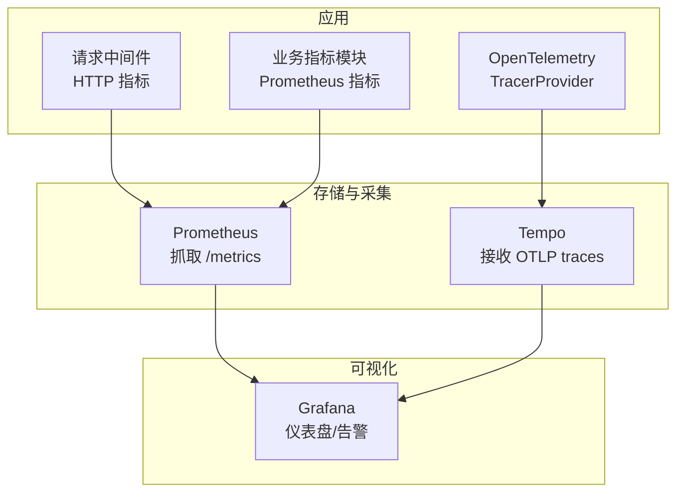
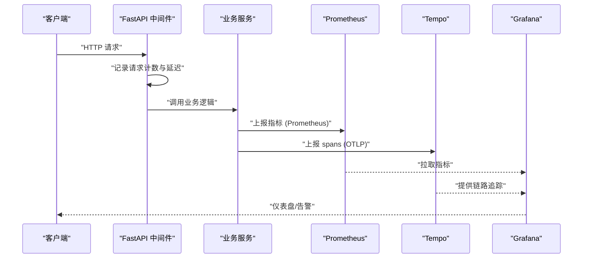
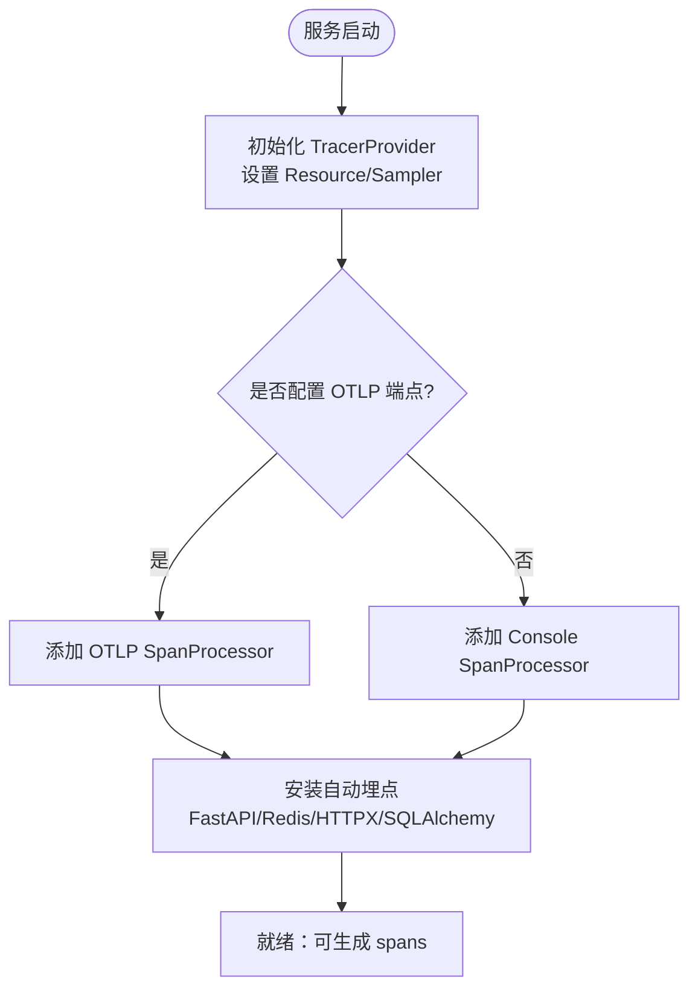
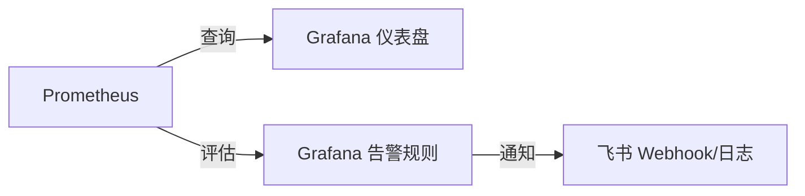
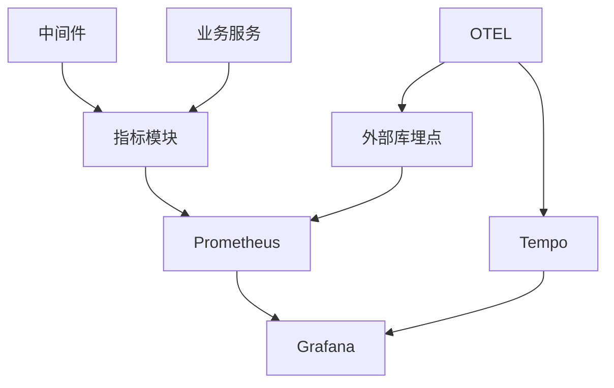

# 性能监控与指标体系

<cite>
**本文引用的文件**
- [backend/core/metrics.py](file://backend/core/metrics.py)
- [backend/core/otel_config.py](file://backend/core/otel_config.py)
- [backend/core/middleware.py](file://backend/core/middleware.py)
- [prometheus.yml](file://prometheus.yml)
- [config/prometheus_rules.yml](file://config/prometheus_rules.yml)
- [grafana/provisioning/datasources/prometheus.yml](file://grafana/provisioning/datasources/prometheus.yml)
- [grafana/provisioning/datasources/tempo.yml](file://grafana/provisioning/datasources/tempo.yml)
- [tempo/tempo.yaml](file://tempo/tempo.yaml)
- [grafana/provisioning/alerting/alerting.yml](file://grafana/provisioning/alerting/alerting.yml)
- [grafana/provisioning/dashboards/quant-agent-dashboard.json](file://grafana/provisioning/dashboards/quant-agent-dashboard.json)
- [grafana/provisioning/dashboards/phase3-datasource-monitoring.json](file://grafana/provisioning/dashboards/phase3-datasource-monitoring.json)
</cite>

## 目录
1. [简介](#简介)
2. [项目结构](#项目结构)
3. [核心组件](#核心组件)
4. [架构总览](#架构总览)
5. [详细组件分析](#详细组件分析)
6. [依赖关系分析](#依赖关系分析)
7. [性能考量](#性能考量)
8. [故障排查指南](#故障排查指南)
9. [结论](#结论)
10. [附录](#附录)

## 简介
本文件面向监控工程师与运维团队，系统化梳理 Quant Agent 的可观测性与性能监控体系，覆盖 Prometheus 指标采集、OpenTelemetry 链路追踪、Grafana 可视化配置；定义关键性能指标与业务指标；说明 APM 集成、分布式追踪、基线与回归检测、告警规则与阈值、异常检测机制；并提供压测方法、数据存储与趋势分析建议。

## 项目结构
Quant Agent 的可观测性由“应用埋点 + 中间件 + 配置中心”三部分构成：
- 指标埋点：在业务层与子系统暴露标准 Prometheus 指标（行情延迟、WebSocket、Redis、熔断器、数据源、质量、分布式节点等）。
- 链路追踪：通过 OpenTelemetry 自动注入 trace_id，支持 OTLP 导出到 Tempo/Grafana。
- 可视化与告警：Prometheus 抓取指标，Grafana 提供仪表盘与告警规则，Tempo 提供全链路追踪。

图表来源
- [backend/core/middleware.py:1-133](file://backend/core/middleware.py#L1-L133)
- [backend/core/metrics.py:1-641](file://backend/core/metrics.py#L1-L641)
- [backend/core/otel_config.py:1-314](file://backend/core/otel_config.py#L1-L314)
- [prometheus.yml:1-43](file://prometheus.yml#L1-L43)
- [tempo/tempo.yaml:1-25](file://tempo/tempo.yaml#L1-L25)
- [grafana/provisioning/datasources/prometheus.yml:1-10](file://grafana/provisioning/datasources/prometheus.yml#L1-L10)
- [grafana/provisioning/datasources/tempo.yml:1-21](file://grafana/provisioning/datasources/tempo.yml#L1-L21)

章节来源
- [backend/core/middleware.py:1-133](file://backend/core/middleware.py#L1-L133)
- [backend/core/metrics.py:1-641](file://backend/core/metrics.py#L1-L641)
- [backend/core/otel_config.py:1-314](file://backend/core/otel_config.py#L1-L314)
- [prometheus.yml:1-43](file://prometheus.yml#L1-L43)
- [tempo/tempo.yaml:1-25](file://tempo/tempo.yaml#L1-L25)
- [grafana/provisioning/datasources/prometheus.yml:1-10](file://grafana/provisioning/datasources/prometheus.yml#L1-L10)
- [grafana/provisioning/datasources/tempo.yml:1-21](file://grafana/provisioning/datasources/tempo.yml#L1-L21)

## 核心组件
- 指标收集
  - HTTP 请求计数与延迟直方图（FastAPI 中间件）
  - 业务指标：行情延迟/新鲜度、K线缓存命中、WebSocket 连接数、Redis 队列深度、熔断器状态、数据源延迟/错误/限流/可用性、数据质量、分布式节点心跳与存活、FMP collector 批次与健康、进程线程水位、WebScrape 抓取成功率等
- 链路追踪
  - OpenTelemetry 初始化、采样、自动埋点（FastAPI/Redis/Requests/HTTPX/SQLAlchemy），trace_id 透传与响应头输出
- 可视化与告警
  - Prometheus 抓取 FastAPI 与子服务指标
  - Grafana 仪表盘（系统、数据源、质量、分布式节点）
  - Grafana 告警规则（连接、延迟、内存、熔断、限流、数据质量、分布式节点等）

章节来源
- [backend/core/middleware.py:1-133](file://backend/core/middleware.py#L1-L133)
- [backend/core/metrics.py:1-641](file://backend/core/metrics.py#L1-L641)
- [backend/core/otel_config.py:1-314](file://backend/core/otel_config.py#L1-L314)
- [grafana/provisioning/alerting/alerting.yml:1-463](file://grafana/provisioning/alerting/alerting.yml#L1-L463)
- [grafana/provisioning/dashboards/quant-agent-dashboard.json:1-200](file://grafana/provisioning/dashboards/quant-agent-dashboard.json#L1-L200)
- [grafana/provisioning/dashboards/phase3-datasource-monitoring.json:1-200](file://grafana/provisioning/dashboards/phase3-datasource-monitoring.json#L1-L200)

## 架构总览
下图展示从请求进入、指标采集、链路追踪到可视化的端到端流程。

图表来源
- [backend/core/middleware.py:1-133](file://backend/core/middleware.py#L1-L133)
- [backend/core/metrics.py:1-641](file://backend/core/metrics.py#L1-L641)
- [backend/core/otel_config.py:1-314](file://backend/core/otel_config.py#L1-L314)
- [prometheus.yml:1-43](file://prometheus.yml#L1-L43)
- [tempo/tempo.yaml:1-25](file://tempo/tempo.yaml#L1-L25)

## 详细组件分析

### Prometheus 指标体系
- 指标分类与用途
  - 系统资源：进程线程数与阈值
  - API 性能：请求计数、延迟直方图（P95/P99）
  - 行情与缓存：行情延迟/新鲜度、K线缓存命中与查询延迟
  - 消息与连接：WebSocket 活跃连接、消息发送/丢弃、订阅数
  - Redis：队列深度、操作延迟、错误计数
  - 熔断器：状态与转换次数
  - 数据源：延迟分布、错误率、限流、可用性、主动拨测
  - 数据质量：脏数据率、完整率、异常计数、字段缺失、价格异常、时间戳过期、平均延迟、质量等级、校验次数
  - 分布式节点：心跳时间戳、状态、存活数量、Failover/429/STALE 降级
  - LLM/Agent：请求延迟、Token 消耗、工具调用
  - FMP Collector：批次执行、标的缓存、失败原因、耗时、最后批次时间、watchlist 大小与变更
  - WebScrape：抓取尝试与失败计数（按 source/domain/reason）
- 指标命名规范
  - 统一前缀 quant_ 或 fastapi_/external_api_ 等，便于分组与过滤
  - 标签维度清晰：source/symbol/action/status/tier/model 等
- 采集频率与精度
  - FastAPI 指标每 5s 抓取，子服务 15s
  - Histogram/Summary 桶设计针对量化场景优化（毫秒级到秒级）

章节来源
- [backend/core/metrics.py:1-641](file://backend/core/metrics.py#L1-L641)
- [backend/core/middleware.py:1-133](file://backend/core/middleware.py#L1-L133)
- [prometheus.yml:1-43](file://prometheus.yml#L1-L43)

### OpenTelemetry 链路追踪
- 功能要点
  - 自动注入 trace_id，支持 W3C Trace Context 传播
  - 可选导出到 OTLP（Grafana Tempo/云 APM）
  - 环境变量控制开关、服务名、采样率、导出端点
  - 自动埋点：FastAPI、Redis、Requests、HTTPX、SQLAlchemy
  - 业务 span 封装与错误标记
- 使用方式
  - 启动时初始化 TracerProvider，挂载 Instrumentors
  - 获取当前 trace_id/span_id 用于日志关联
  - 通过 traced_span 包裹业务逻辑，set_span_error 标记异常

图表来源
- [backend/core/otel_config.py:1-314](file://backend/core/otel_config.py#L1-L314)

章节来源
- [backend/core/otel_config.py:1-314](file://backend/core/otel_config.py#L1-L314)

### Grafana 可视化与告警
- 数据源
  - Prometheus 默认数据源
  - Tempo 数据源启用服务地图、节点图、日志联动
- 仪表盘
  - 系统面板：API QPS、P99 延迟、错误率等
  - 数据源面板：P95 延迟趋势、错误率、限流、可用性
  - 质量面板：脏数据率、完整率、异常计数等
  - 分布式节点面板：心跳、存活、Failover、STALE 降级
- 告警规则
  - 连接类：Futu 断开、节点心跳超时
  - 性能类：API P95/P99 延迟过高
  - 资源类：Redis 内存使用率过高
  - 熔断类：熔断器打开
  - 数据源类：限流飙升、长时间退避、配额耗尽、IP 封禁
  - 数据质量类：脏数据率超阈值
  - 分布式类：YF 存活节点不足/全部宕机、CN 节点断连、STALE 降级频率过高

图表来源
- [grafana/provisioning/datasources/prometheus.yml:1-10](file://grafana/provisioning/datasources/prometheus.yml#L1-L10)
- [grafana/provisioning/datasources/tempo.yml:1-21](file://grafana/provisioning/datasources/tempo.yml#L1-L21)
- [grafana/provisioning/alerting/alerting.yml:1-463](file://grafana/provisioning/alerting/alerting.yml#L1-L463)

章节来源
- [grafana/provisioning/dashboards/quant-agent-dashboard.json:1-200](file://grafana/provisioning/dashboards/quant-agent-dashboard.json#L1-L200)
- [grafana/provisioning/dashboards/phase3-datasource-monitoring.json:1-200](file://grafana/provisioning/dashboards/phase3-datasource-monitoring.json#L1-L200)
- [grafana/provisioning/alerting/alerting.yml:1-463](file://grafana/provisioning/alerting/alerting.yml#L1-L463)

### 关键性能指标定义与业务监控
- 关键指标
  - 接口延迟：fastapi_request_duration_seconds（P95/P99）
  - 接口吞吐：fastapi_requests_total（QPS）
  - 外部 API：external_api_request_duration_seconds、external_api_requests_total
  - 数据源延迟：quant_datasource_latency_milliseconds（P95）
  - 数据源错误/限流：quant_datasource_errors_total、ds_rate_limit_total
  - 数据质量：quant_data_quality_dirty_rate、completeness_rate、anomaly_count
  - 分布式节点：quant_dist_node_heartbeat_timestamp、alive_count、failover/429/stale
  - 熔断器：circuit_breaker_state、transitions
  - WebSocket：active_connections、messages_sent/dropped、subscriptions
  - Redis：queue_depth、operation_latency、errors
  - K线缓存：cache_hit、query_latency
  - LLM/Agent：llm_request_seconds、tokens_total、tool_calls
  - FMP Collector：batch_runs、symbols_cached/failed、duration、last_batch_timestamp、watchlist_size
  - 进程线程：process_thread_count、warn_threshold
  - WebScrape：webscrape_fetch_total/failed
- 业务监控
  - 多源融合与偏差告警：Facade merge、quote deviation
  - 主动拨测：probe_success/probe_latency/probe_total/probe_failures
  - 数据湖快照：snapshot_created/read、retention_runs、latest_age_days

章节来源
- [backend/core/metrics.py:1-641](file://backend/core/metrics.py#L1-L641)
- [backend/core/middleware.py:1-133](file://backend/core/middleware.py#L1-L133)

### APM 集成与分布式追踪
- 集成点
  - FastAPI 自动路由 span
  - Redis/HTTPX/Requests/SQLAlchemy 自动埋点
  - 业务 span 封装与错误记录
- 追踪上下文
  - trace_id 写入响应头 X-Trace-Id（配合日志）
  - 支持上游网关透传 W3C Trace Context
- 导出与存储
  - OTLP 导出至 Tempo（本地 WAL/Blocks 保留 48h）
  - Grafana 服务地图与节点图启用

章节来源
- [backend/core/otel_config.py:1-314](file://backend/core/otel_config.py#L1-L314)
- [tempo/tempo.yaml:1-25](file://tempo/tempo.yaml#L1-L25)
- [grafana/provisioning/datasources/tempo.yml:1-21](file://grafana/provisioning/datasources/tempo.yml#L1-L21)

### 性能基线与回归检测
- 基线建立
  - 以历史 P95/P99 延迟、错误率、数据源延迟、数据质量指标为基线
  - 使用 Grafana 仪表盘与 Recording Rules 计算稳定窗口内的分位数
- 回归检测
  - 基于告警规则：当 P95/P99 超过阈值、数据源错误率上升、数据质量下降时触发
  - 结合 Recording Rules（如 watchlist 突变 flag）进行辅助判断
- 持续验证
  - 定期压测并对比基线，观察回归趋势

章节来源
- [grafana/provisioning/alerting/alerting.yml:1-463](file://grafana/provisioning/alerting/alerting.yml#L1-L463)
- [config/prometheus_rules.yml:1-95](file://config/prometheus_rules.yml#L1-L95)

### 告警规则配置与阈值设置
- 阈值策略
  - 连接类：Futu 断开 >30s 为 critical
  - 延迟类：API P95 >2s 为 critical
  - 资源类：Redis 内存 >80% 为 warning
  - 熔断类：open 状态 >10s 为 critical
  - 数据源：限流飙升（5min >10次）、退避 >120s、配额耗尽、IP 封禁
  - 数据质量：脏数据率 >5% 为 warning
  - 分布式：心跳超时 >60s、YF 存活 <2、所有 YF 宕机、CN 节点断连、STALE 降级频率 >0.1/s
- 通知策略
  - Critical：快速聚合、高频重复间隔
  - Warning：降低频率，避免告警风暴
  - 联系人：飞书 Webhook（需替换真实 URL）

章节来源
- [grafana/provisioning/alerting/alerting.yml:1-463](file://grafana/provisioning/alerting/alerting.yml#L1-L463)

### 异常检测机制
- 指标驱动异常检测
  - 错误率突增：external_api_requests_total、quant_datasource_errors_total
  - 延迟突增：fastapi_request_duration_seconds、quant_datasource_latency_milliseconds
  - 数据质量异常：dirty_rate、anomaly_count、price_anomaly、stale_count
  - 分布式异常：node heartbeat 超时、alive_count 下降、failover/429/stale 激增
- 辅助手段
  - 熔断器状态与转换次数
  - 主动拨测 probe_success/probe_latency
  - 进程线程水位告警

章节来源
- [backend/core/metrics.py:1-641](file://backend/core/metrics.py#L1-L641)
- [grafana/provisioning/alerting/alerting.yml:1-463](file://grafana/provisioning/alerting/alerting.yml#L1-L463)

### 压测方法与工具
- 压测目标
  - API 吞吐与延迟（QPS、P95/P99）
  - 外部 API 稳定性（限流、超时、错误率）
  - 数据源能力（延迟、错误、限流）
  - 数据质量（脏数据率、完整率）
- 工具建议
  - Locust：并发脚本与报告
  - 自定义探针：验证数据源连通性与延迟
  - 基准测试：回测流水线、K线缓存命中率
- 结果分析
  - 对比基线，识别回归
  - 结合 Grafana 仪表盘定位瓶颈

章节来源
- [scripts/locust_ws_stress.py](file://scripts/locust_ws_stress.py)
- [scripts/benchmark_dsl_parser.py](file://scripts/benchmark_dsl_parser.py)
- [scripts/test_phase3_monitoring.py](file://scripts/test_phase3_monitoring.py)

### 监控数据存储与趋势分析
- 存储
  - Prometheus：指标时序数据（保留期依部署而定）
  - Tempo：traces 本地 WAL/Blocks（保留 48h）
- 历史分析
  - 使用 PromQL 计算窗口内分位数、增长率、异常比例
  - 结合 Grafana 仪表盘进行趋势观察
- 趋势预测
  - 基于历史数据构建简单预测模型（如移动平均、指数平滑）
  - 利用 Recording Rules 预计算派生指标，提升查询性能

章节来源
- [prometheus.yml:1-43](file://prometheus.yml#L1-L43)
- [tempo/tempo.yaml:1-25](file://tempo/tempo.yaml#L1-L25)
- [config/prometheus_rules.yml:1-95](file://config/prometheus_rules.yml#L1-L95)

## 依赖关系分析
- 组件耦合
  - 中间件与指标：中间件产生 HTTP 指标，供 Prometheus 抓取
  - 业务与指标：业务模块直接更新指标，反映系统健康
  - OTEL 与后端：自动埋点依赖各库的 Instrumentor
  - Prometheus 与 Grafana：Grafana 依赖 Prometheus 作为数据源
  - Tempo 与 Grafana：Grafana 通过 Tempo 数据源查看链路
- 外部依赖
  - FastAPI、Prometheus Client、OpenTelemetry SDK/Instrumentors
  - 数据源（Futu、Yahoo、FMP 等）
  - Redis、数据库（SQLAlchemy）

图表来源
- [backend/core/middleware.py:1-133](file://backend/core/middleware.py#L1-L133)
- [backend/core/metrics.py:1-641](file://backend/core/metrics.py#L1-L641)
- [backend/core/otel_config.py:1-314](file://backend/core/otel_config.py#L1-L314)
- [prometheus.yml:1-43](file://prometheus.yml#L1-L43)
- [tempo/tempo.yaml:1-25](file://tempo/tempo.yaml#L1-L25)

章节来源
- [backend/core/middleware.py:1-133](file://backend/core/middleware.py#L1-L133)
- [backend/core/metrics.py:1-641](file://backend/core/metrics.py#L1-L641)
- [backend/core/otel_config.py:1-314](file://backend/core/otel_config.py#L1-L314)
- [prometheus.yml:1-43](file://prometheus.yml#L1-L43)
- [tempo/tempo.yaml:1-25](file://tempo/tempo.yaml#L1-L25)

## 性能考量
- 指标粒度与基数
  - 控制高基数标签（如 endpoint、symbol）以避免内存膨胀
  - 使用合适的 buckets 与 window 平衡精度与开销
- 采集频率
  - FastAPI 指标 5s，子服务 15s，兼顾实时性与负载
- 链路追踪采样
  - 根据环境调整采样率，生产环境建议合理采样以降低开销
- 存储与保留
  - Prometheus 与 Tempo 保留期需结合容量规划
- 告警降噪
  - 合理设置 for 时间与重复间隔，避免告警风暴

[本节为通用指导，无需特定文件引用]

## 故障排查指南
- 常见问题
  - API 延迟升高：检查中间件指标与外部 API 延迟
  - 数据源错误/限流：查看数据源错误计数与限流计数，结合拨测指标
  - 数据质量下降：关注脏数据率、异常计数、字段缺失、价格异常
  - 分布式节点异常：检查心跳、存活数量、Failover/429/stale
  - 熔断器打开：查看状态与转换次数，定位下游问题
- 排查步骤
  - 通过 Grafana 仪表盘定位异常指标
  - 使用 PromQL 查询具体标签维度
  - 通过 Tempo 链路追踪定位慢调用与错误
  - 结合日志中的 trace_id 关联上下游

章节来源
- [grafana/provisioning/alerting/alerting.yml:1-463](file://grafana/provisioning/alerting/alerting.yml#L1-L463)
- [backend/core/metrics.py:1-641](file://backend/core/metrics.py#L1-L641)
- [backend/core/otel_config.py:1-314](file://backend/core/otel_config.py#L1-L314)

## 结论
Quant Agent 构建了完整的可观测性体系：以 Prometheus 为核心采集指标，OpenTelemetry 实现全链路追踪，Grafana 提供可视化与告警。通过明确的指标定义、合理的阈值与告警策略、以及压测与基线管理，能够有效保障系统性能与稳定性，并为运维团队提供高效的排障与优化依据。

[本节为总结，无需特定文件引用]

## 附录
- 关键配置文件路径
  - Prometheus 抓取配置：prometheus.yml
  - Recording Rules：config/prometheus_rules.yml
  - Grafana 数据源：grafana/provisioning/datasources/*.yml
  - Tempo 配置：tempo/tempo.yaml
  - 告警规则：grafana/provisioning/alerting/alerting.yml
  - 仪表盘：grafana/provisioning/dashboards/*.json

[本节为索引，无需特定文件引用]
