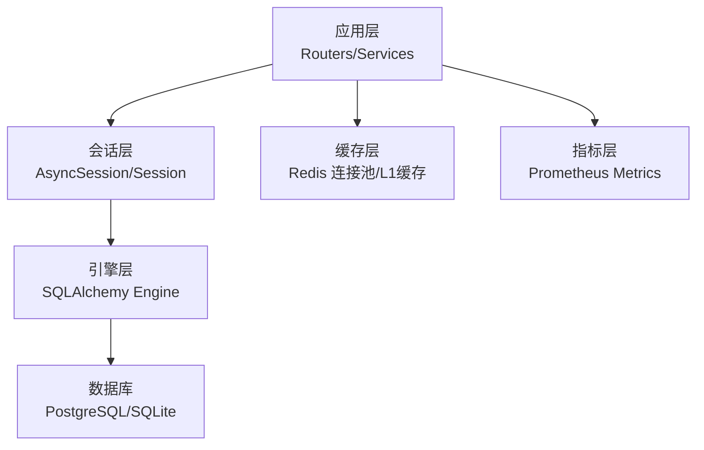
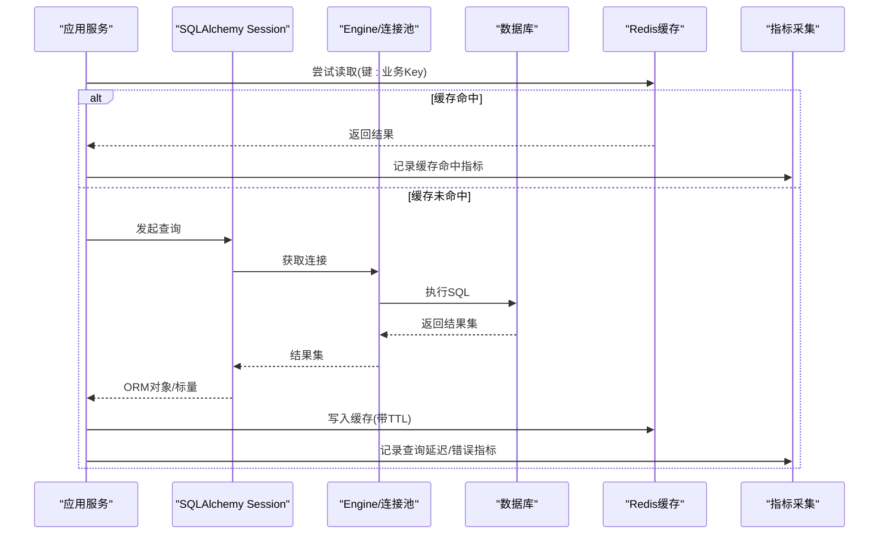
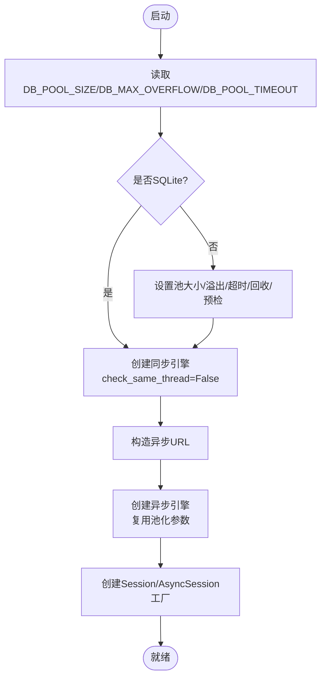
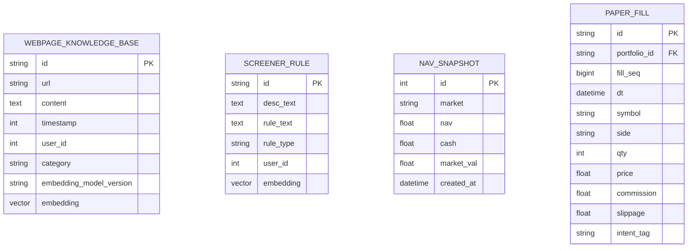
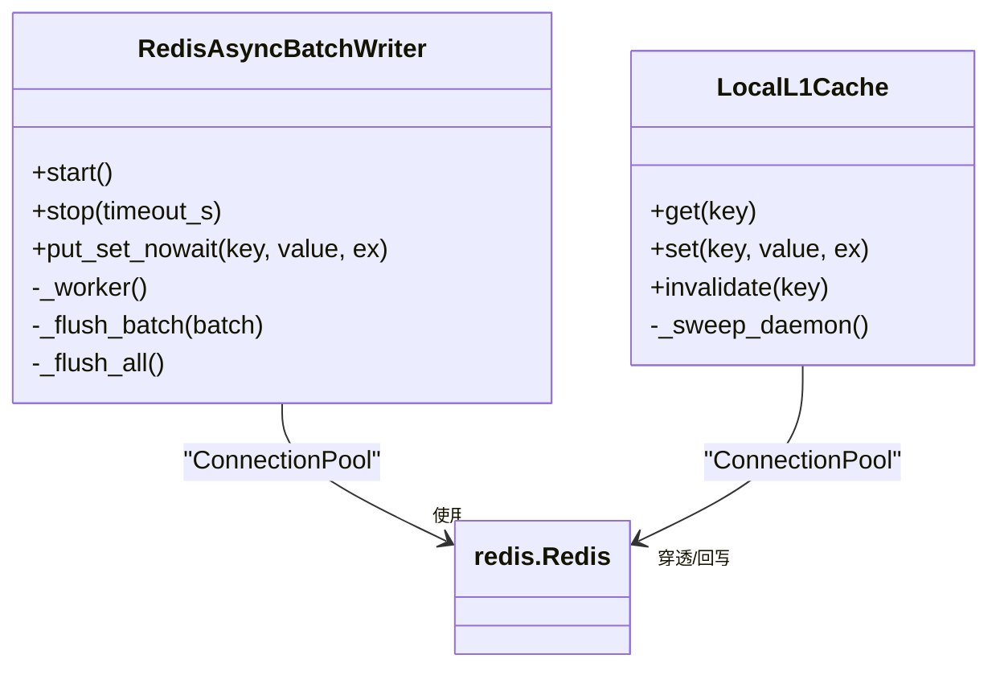
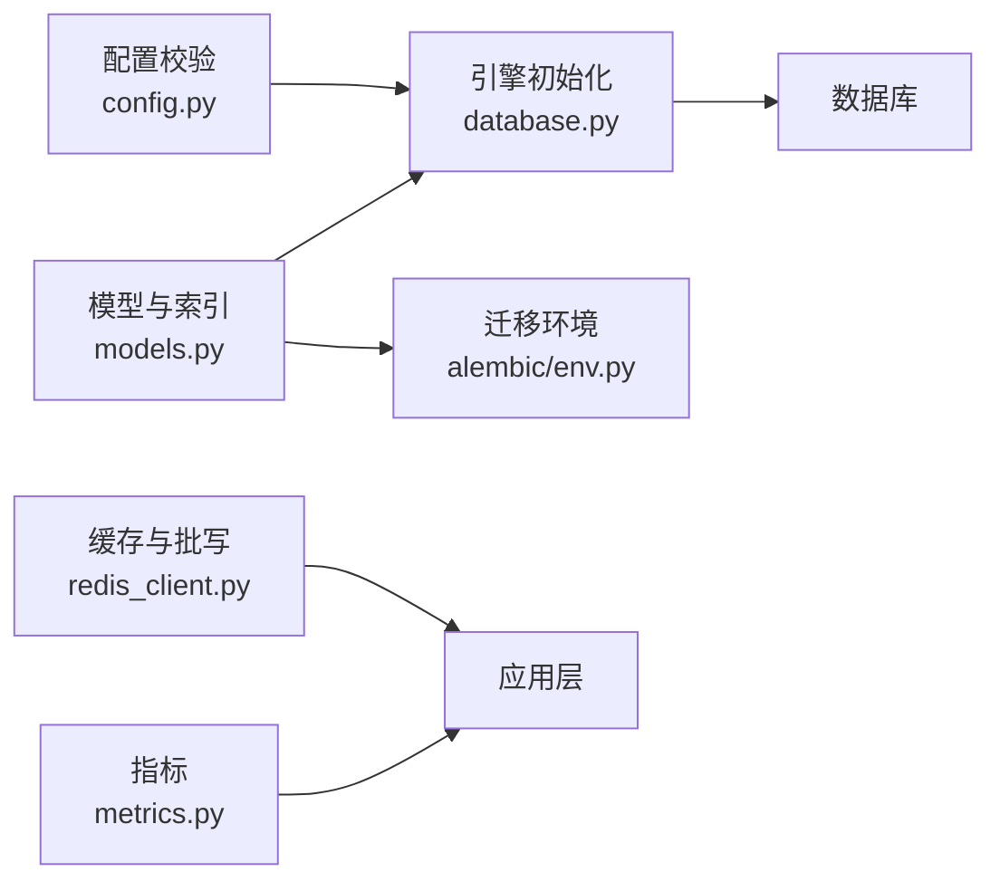

# 数据库查询优化

<cite>
**本文引用的文件**
- [backend/core/database.py](file://backend/core/database.py)
- [backend/core/models.py](file://backend/core/models.py)
- [backend/alembic/env.py](file://backend/alembic/env.py)
- [backend/alembic/versions/ai04rag_add_rag_governance.py](file://backend/alembic/versions/ai04rag_add_rag_governance.py)
- [backend/core/config.py](file://backend/core/config.py)
- [backend/core/redis_client.py](file://backend/core/redis_client.py)
- [backend/core/metrics.py](file://backend/core/metrics.py)
</cite>

## 目录
1. [简介](#简介)
2. [项目结构](#项目结构)
3. [核心组件](#核心组件)
4. [架构总览](#架构总览)
5. [详细组件分析](#详细组件分析)
6. [依赖关系分析](#依赖关系分析)
7. [性能考量](#性能考量)
8. [故障排查指南](#故障排查指南)
9. [结论](#结论)
10. [附录](#附录)

## 简介
本文件面向DBA与后端开发者，系统性梳理Quant Agent在SQLAlchemy ORM、连接池、事务、索引、向量检索、缓存与监控等方面的数据库查询优化实践。内容覆盖：
- SQLAlchemy ORM性能优化技巧与查询构建最佳实践
- N+1查询问题识别与解决方案
- 数据库索引设计策略（含复合索引）与全文/向量搜索索引配置
- 慢查询分析方法、执行计划解读与查询性能监控
- 连接池配置优化、事务管理策略、批量操作优化
- 数据分区方案、读写分离配置、缓存策略集成
- PostgreSQL特定优化参数、pgvector向量索引使用、数据库健康检查机制

## 项目结构
本项目将数据库相关能力集中在以下模块：
- 数据库引擎与会话：backend/core/database.py
- 数据模型与索引定义：backend/core/models.py
- Alembic迁移与环境：backend/alembic/env.py 及版本脚本
- 配置校验与注入：backend/core/config.py
- Redis缓存与批写：backend/core/redis_client.py
- 可观测性指标：backend/core/metrics.py

**图表来源**
- [backend/core/database.py:1-67](file://backend/core/database.py#L1-L67)
- [backend/core/redis_client.py:1-252](file://backend/core/redis_client.py#L1-L252)
- [backend/core/metrics.py:1-641](file://backend/core/metrics.py#L1-L641)

**章节来源**
- [backend/core/database.py:1-67](file://backend/core/database.py#L1-L67)
- [backend/core/models.py:1-495](file://backend/core/models.py#L1-L495)
- [backend/alembic/env.py:1-80](file://backend/alembic/env.py#L1-L80)

## 核心组件
- 同步/异步引擎与会话：提供连接池、预检、回收策略；支持SQLite与PostgreSQL驱动切换。
- 模型与索引：集中定义表结构与索引，包含HNSW向量索引与复合索引。
- 迁移环境：从环境变量加载DATABASE_URL并导入模型元数据，支持离线/在线迁移。
- 配置校验：强制要求DATABASE_URL等关键配置，fail-fast启动。
- Redis缓存：全局连接池、异步批写队列、进程内L1缓存，降低网络RTT与锁竞争。
- 指标体系：为延迟、错误、可用性、缓存命中等提供统一度量。

**章节来源**
- [backend/core/database.py:1-67](file://backend/core/database.py#L1-L67)
- [backend/core/models.py:1-495](file://backend/core/models.py#L1-L495)
- [backend/alembic/env.py:1-80](file://backend/alembic/env.py#L1-L80)
- [backend/core/config.py:1-134](file://backend/core/config.py#L1-L134)
- [backend/core/redis_client.py:1-252](file://backend/core/redis_client.py#L1-L252)
- [backend/core/metrics.py:1-641](file://backend/core/metrics.py#L1-L641)

## 架构总览
下图展示请求到数据库的完整链路，包括ORM会话、连接池、缓存与指标埋点。

**图表来源**
- [backend/core/database.py:1-67](file://backend/core/database.py#L1-L67)
- [backend/core/redis_client.py:1-252](file://backend/core/redis_client.py#L1-L252)
- [backend/core/metrics.py:1-641](file://backend/core/metrics.py#L1-L641)

## 详细组件分析

### 数据库引擎与会话（连接池、健康检查、异步）
- 连接池参数：通过环境变量配置POOL_SIZE、MAX_OVERFLOW、POOL_TIMEOUT，并启用pool_recycle与pool_pre_ping提升稳定性。
- SQLite专用：关闭线程检查以支持多线程访问。
- 异步引擎：自动将URL转换为asyncpg/aiosqlite，复用相同池化策略，expire_on_commit=False减少会话失效开销。
- 会话工厂：同步get_db与异步get_async_db作为依赖注入入口，确保资源释放。

**图表来源**
- [backend/core/database.py:1-67](file://backend/core/database.py#L1-L67)

**章节来源**
- [backend/core/database.py:1-67](file://backend/core/database.py#L1-L67)

### 数据模型与索引设计（含向量索引与复合索引）
- 标量索引：对高频过滤字段建立单列索引（如ticker、status、created_at等）。
- 复合索引：针对多列联合查询场景建立复合索引（如市场+时间、组合ID+序号等），避免全表扫描。
- 向量索引：使用pgvector HNSW索引，配置m与ef_construction，选择余弦距离运算类，平衡召回率与内存占用。
- 迁移安全：Alembic增量添加字段与索引，兼容SQLite测试环境。

**图表来源**
- [backend/core/models.py:199-256](file://backend/core/models.py#L199-L256)
- [backend/core/models.py:331-344](file://backend/core/models.py#L331-L344)
- [backend/core/models.py:425-445](file://backend/core/models.py#L425-L445)

**章节来源**
- [backend/core/models.py:1-495](file://backend/core/models.py#L1-L495)
- [backend/alembic/versions/ai04rag_add_rag_governance.py:1-55](file://backend/alembic/versions/ai04rag_add_rag_governance.py#L1-L55)

### 迁移与环境（Alembic）
- 动态注入DATABASE_URL，自动导入所有模型元数据，支持autogenerate。
- 离线模式仅生成SQL，在线模式直接DDL变更。
- 迁移脚本具备幂等性与兼容性检查，避免重复建索引或字段。

**章节来源**
- [backend/alembic/env.py:1-80](file://backend/alembic/env.py#L1-L80)
- [backend/alembic/versions/ai04rag_add_rag_governance.py:1-55](file://backend/alembic/versions/ai04rag_add_rag_governance.py#L1-L55)

### 配置校验（Fail-Fast）
- 强制要求DATABASE_URL非空且格式正确（sqlite/postgresql前缀）。
- 其他敏感配置（如EMBEDDING_API_KEY）同样进行非空校验。
- 实盘交易开关时强制要求Futu解锁密码，防止误配上线。

**章节来源**
- [backend/core/config.py:1-134](file://backend/core/config.py#L1-L134)

### 缓存与批写（Redis）
- 全局连接池：统一限制最大连接数，避免无上限打满。
- 异步批写队列：后台协程按批次与时间窗口聚合set操作，通过Pipeline批量发送，显著降低RTT与带宽占用。
- 进程内L1缓存：短TTL本地字典，穿透至Redis L2，容量超限安全熔断清空，定时清理过期项。
- 优雅停机：取消任务后强制flush_all，确保不丢数据。

**图表来源**
- [backend/core/redis_client.py:1-252](file://backend/core/redis_client.py#L1-L252)

**章节来源**
- [backend/core/redis_client.py:1-252](file://backend/core/redis_client.py#L1-L252)

### 指标与监控（Prometheus）
- 延迟分布：Summary/Histogram用于行情快照、K线获取、Redis操作、LLM请求等。
- 错误计数：Counter统计Redis错误、数据源错误、限流次数等。
- 可用性：Gauge标记数据源可用状态、节点存活数量等。
- 缓存命中：K线缓存命中/查询延迟、实时价缓存命中率等。

**章节来源**
- [backend/core/metrics.py:1-641](file://backend/core/metrics.py#L1-L641)

## 依赖关系分析
- database.py 被 models.py 通过Base引用，alembic env.py 导入Base与模型以生成迁移。
- config.py 负责校验DATABASE_URL等关键配置，影响engine初始化行为。
- redis_client.py 提供缓存与批写能力，与业务层解耦，独立于数据库层。
- metrics.py 为各层提供统一指标命名空间，便于Grafana/Prometheus可视化。

**图表来源**
- [backend/core/config.py:1-134](file://backend/core/config.py#L1-L134)
- [backend/core/database.py:1-67](file://backend/core/database.py#L1-L67)
- [backend/core/models.py:1-495](file://backend/core/models.py#L1-L495)
- [backend/alembic/env.py:1-80](file://backend/alembic/env.py#L1-L80)
- [backend/core/redis_client.py:1-252](file://backend/core/redis_client.py#L1-L252)
- [backend/core/metrics.py:1-641](file://backend/core/metrics.py#L1-L641)

**章节来源**
- [backend/core/config.py:1-134](file://backend/core/config.py#L1-L134)
- [backend/core/database.py:1-67](file://backend/core/database.py#L1-L67)
- [backend/core/models.py:1-495](file://backend/core/models.py#L1-L495)
- [backend/alembic/env.py:1-80](file://backend/alembic/env.py#L1-L80)
- [backend/core/redis_client.py:1-252](file://backend/core/redis_client.py#L1-L252)
- [backend/core/metrics.py:1-641](file://backend/core/metrics.py#L1-L641)

## 性能考量

### SQLAlchemy ORM性能优化技巧
- 使用只读视图或标量查询减少对象映射开销。
- 合理分页与limit，避免一次性拉取大结果集。
- 使用selectin/joinedload解决N+1问题，或在必要时改用原生SQL。
- 利用server_default与onupdate减少Python侧计算与额外更新。

### 查询构建最佳实践
- 优先使用索引列进行过滤与排序，避免函数包裹导致索引失效。
- 将高频条件放在WHERE最前端，减少中间结果集大小。
- 对JSON字段尽量使用标量列替代，或结合GIN索引（若适用）。

### N+1查询问题解决方案
- 使用joinedload/selectin预加载关联实体。
- 拆分复杂查询为多次简单查询，合并结果在内存组装。
- 对热点关联采用缓存（Redis L1/L2）减少重复查询。

### 数据库索引设计策略
- 单列索引：高频等值/范围查询字段（如ticker、status、created_at）。
- 复合索引：联合过滤与排序（如market+created_at、portfolio_id+fill_seq）。
- 向量索引：pgvector HNSW，m=16、ef_construction=64，余弦距离ops。
- 迁移安全：增量添加字段与索引，兼容SQLite测试环境。

### 全文搜索索引配置
- 文本字段可使用GIN索引（如to_tsvector），结合tsvector/tsquery进行高效检索。
- 对于长文本与分词需求，建议引入专用搜索引擎（如Meilisearch/Elasticsearch），数据库仅存主数据。

### 慢查询分析与执行计划解读
- 使用EXPLAIN/EXPLAIN ANALYZE查看执行计划，关注Seq Scan、Index Scan、Nested Loop、Hash Join等。
- 关注rows、loops、actual time，定位高耗时节点。
- 结合数据库日志与慢查询日志，持续跟踪回归。

### 查询性能监控
- 通过Prometheus指标记录查询延迟、错误率、缓存命中率。
- Grafana面板可视化关键指标，设置阈值告警。

### 连接池配置优化
- 根据并发与数据库CPU核数调整pool_size与max_overflow。
- 启用pool_pre_ping避免僵尸连接，设置pool_recycle定期回收。
- 异步场景下复用相同池化参数，减少差异带来的不确定性。

### 事务管理策略
- 明确事务边界，避免长事务持有锁。
- 读写分离场景下，区分主库写事务与从库读会话。
- 失败重试与补偿机制，保证最终一致性。

### 批量操作优化
- 使用bulk_insert/bulk_update减少往返次数。
- 结合Redis异步批写队列，聚合高频写入，降低RTT。
- 分批提交，控制单次事务大小，避免锁膨胀。

### 数据分区方案
- 按时间（created_at/trade_date）或业务维度（market/portfolio_id）分区，提升查询与归档效率。
- 配合索引与查询重写，使分区裁剪生效。

### 读写分离配置
- 主库处理写事务，从库承担读负载。
- 通过不同引擎/会话绑定实现路由，注意主从延迟与一致性。

### 缓存策略集成
- L1内存缓存短TTL热点键，L2 Redis持久化共享缓存。
- 缓存穿透保护（布隆过滤器/空值缓存）、击穿保护（互斥锁）、雪崩保护（随机TTL）。
- 缓存与数据库一致性：先更新DB再删缓存，或采用延迟双删。

### PostgreSQL特定优化参数
- 调整shared_buffers、work_mem、maintenance_work_mem、effective_cache_size等。
- 启用autovacuum与合理vacuum阈值，避免表膨胀。
- 使用pg_stat_statements追踪慢查询。

### pgvector向量索引使用
- 安装pgvector扩展，定义Vector类型与HNSW索引。
- 调优m与ef_construction，查询时使用ef_search控制精度与速度权衡。
- 选择合适的距离算子（cosine/l2/norm）。

### 数据库健康检查机制
- 启动时执行ping/health检查，失败快速失败。
- 周期性探针检测连接池空闲连接、慢查询比例、锁等待。
- 结合指标与告警，及时发现异常。

## 故障排查指南
- 连接池耗尽：检查pool_size/max_overflow与并发峰值，增加池大小或优化长事务。
- 慢查询：使用EXPLAIN ANALYZE定位瓶颈，补充或调整索引，改写SQL。
- 缓存不一致：检查缓存更新顺序与TTL，必要时引入版本号或事件通知。
- 向量检索不准：调整HNSW参数与查询ef_search，验证embedding质量。
- 迁移失败：确认迁移脚本幂等性，回滚到上一版本并修复后再试。

**章节来源**
- [backend/core/database.py:1-67](file://backend/core/database.py#L1-L67)
- [backend/core/models.py:1-495](file://backend/core/models.py#L1-L495)
- [backend/core/redis_client.py:1-252](file://backend/core/redis_client.py#L1-L252)
- [backend/core/metrics.py:1-641](file://backend/core/metrics.py#L1-L641)

## 结论
Quant Agent在数据库层面形成了“引擎与会话—模型与索引—缓存与批写—指标与监控”的闭环优化体系。通过合理的连接池配置、索引设计、缓存策略与可观测性建设，能够有效应对高并发、大数据量与复杂查询场景。建议在生产环境中持续跟踪慢查询与指标变化，迭代优化索引与查询，并结合PG参数调优与向量检索调参，达成稳定高效的数据库性能目标。

## 附录
- 环境变量参考：DATABASE_URL、DB_POOL_SIZE、DB_MAX_OVERFLOW、DB_POOL_TIMEOUT、REDIS_HOST、REDIS_PORT、REDIS_PASSWORD、REDIS_MAX_CONNECTIONS、EMBEDDING_DIM等。
- 关键路径参考：
  - 引擎与会话：[backend/core/database.py:1-67](file://backend/core/database.py#L1-L67)
  - 模型与索引：[backend/core/models.py:1-495](file://backend/core/models.py#L1-L495)
  - 迁移环境：[backend/alembic/env.py:1-80](file://backend/alembic/env.py#L1-L80)
  - 配置校验：[backend/core/config.py:1-134](file://backend/core/config.py#L1-L134)
  - 缓存与批写：[backend/core/redis_client.py:1-252](file://backend/core/redis_client.py#L1-L252)
  - 指标体系：[backend/core/metrics.py:1-641](file://backend/core/metrics.py#L1-L641)