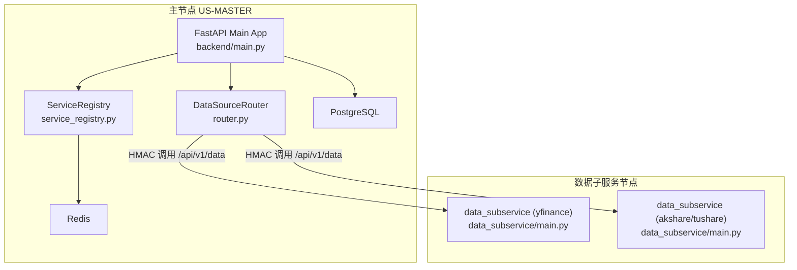
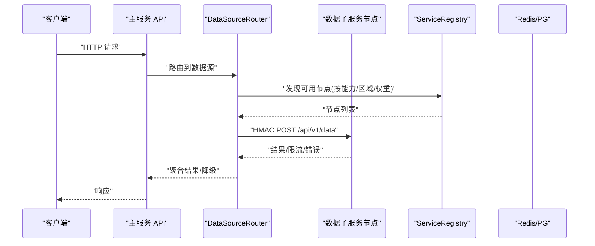
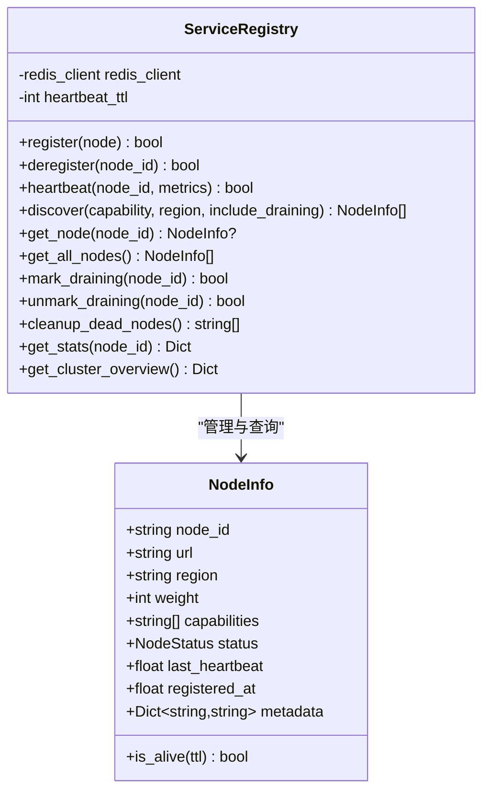
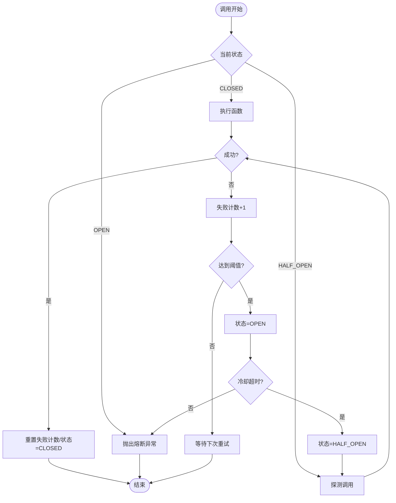
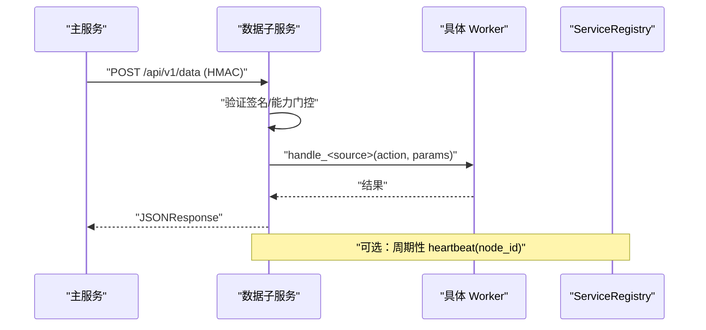
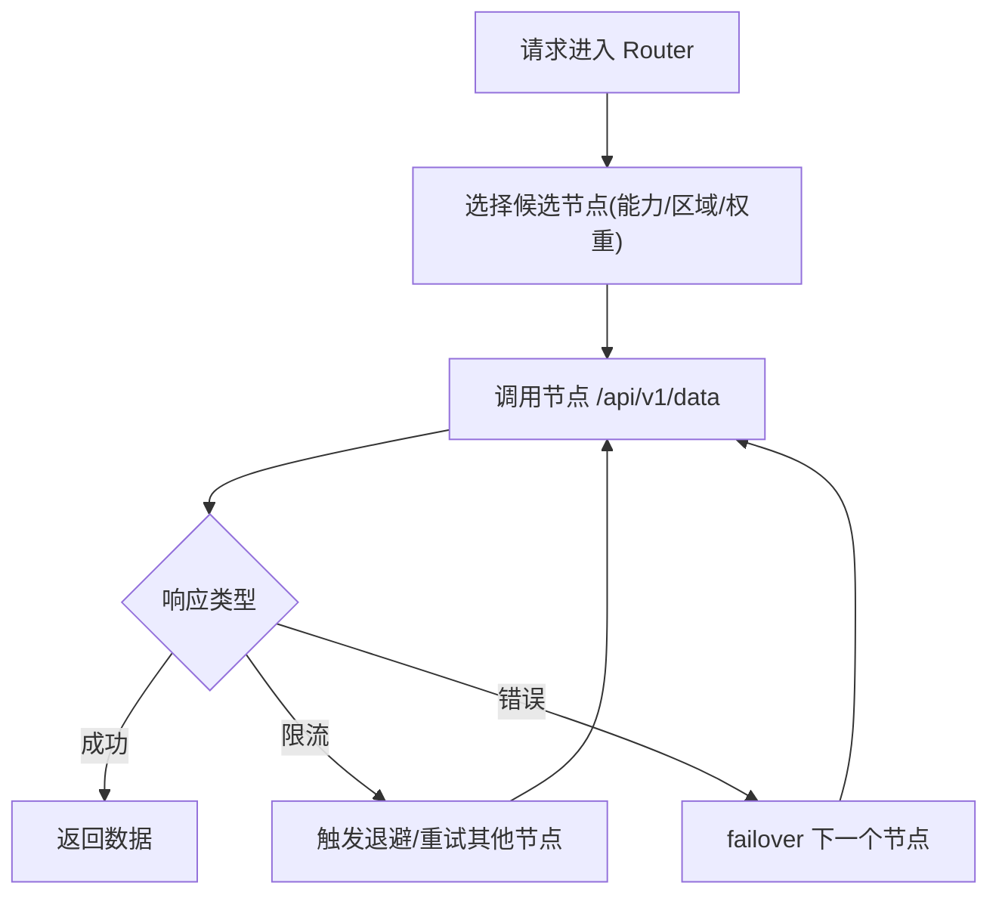
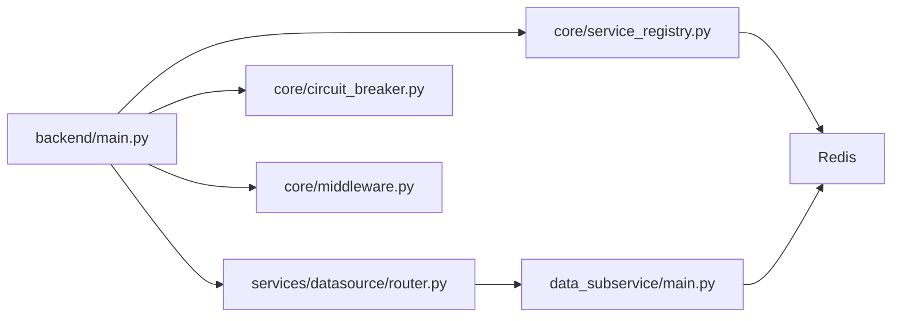

# 水平扩展与负载均衡

<cite>
**本文引用的文件**
- [backend/main.py](file://backend/main.py)
- [backend/core/service_registry.py](file://backend/core/service_registry.py)
- [backend/core/circuit_breaker.py](file://backend/core/circuit_breaker.py)
- [data_subservice/main.py](file://data_subservice/main.py)
- [docker-compose.master.yml](file://docker-compose.master.yml)
- [backend/core/middleware.py](file://backend/core/middleware.py)
- [backend/routers/datasource.py](file://backend/routers/datasource.py)
- [backend/services/datasource/router.py](file://backend/services/datasource/router.py)
- [docs/14. 分布式数据源服务架构.md](file://docs/14. 分布式数据源服务架构.md)
- [docs/06. 工程化配置与部署方案.md](file://docs/06. 工程化配置与部署方案.md)
</cite>

## 目录
1. [简介](#简介)
2. [项目结构](#项目结构)
3. [核心组件](#核心组件)
4. [架构总览](#架构总览)
5. [详细组件分析](#详细组件分析)
6. [依赖关系分析](#依赖关系分析)
7. [性能与扩缩容策略](#性能与扩缩容策略)
8. [故障转移与高可用](#故障转移与高可用)
9. [分布式一致性与数据同步](#分布式一致性与数据同步)
10. [API 网关、路由与限流熔断](#api-网关路由与限流熔断)
11. [容器化与编排建议](#容器化与编排建议)
12. [排错指南](#排错指南)
13. [结论](#结论)

## 简介
本指南面向架构师与运维工程师，围绕 Quant Agent 的水平扩展与负载均衡实践，系统阐述微服务架构设计、服务注册发现、负载均衡策略、容器化部署、Kubernetes 编排思路、弹性伸缩、无状态服务设计、会话管理、数据分片、API 网关配置、请求路由、限流熔断、性能优化、故障转移、分布式一致性、数据同步与冲突解决等主题。内容基于仓库现有实现与文档进行提炼与归纳，确保可落地、可观测、可演进。

## 项目结构
Quant Agent 采用“主服务 + 数据子服务”的解耦架构：
- 主服务（backend）提供统一 API、业务路由、中间件、监控与可观测性，并通过 DataSourceRouter 将数据请求转发到数据子服务节点。
- 数据子服务（data_subservice）作为独立 HTTP 服务运行在远程 VPS，按 DS_CAPABILITIES 声明能力，通过 HMAC 签名认证与主服务通信，并可选向 Redis 注册心跳。
- 多节点拓扑：US-MASTER（API/Worker/Redis/PG）、US-YF-A/B（yfinance 出口）、CN-DATA（Tushare/AKShare），节点间通过 Tailscale 虚拟网互联。

图表来源
- [backend/main.py:125-218](file://backend/main.py#L125-L218)
- [backend/services/datasource/router.py:1-30](file://backend/services/datasource/router.py#L1-L30)
- [data_subservice/main.py:189-234](file://data_subservice/main.py#L189-L234)
- [backend/core/service_registry.py:1-15](file://backend/core/service_registry.py#L1-L15)

章节来源
- [backend/main.py:125-218](file://backend/main.py#L125-L218)
- [docs/06. 工程化配置与部署方案.md:23-90](file://docs/06. 工程化配置与部署方案.md#L23-L90)

## 核心组件
- 应用入口与路由挂载：FastAPI 应用工厂集中挂载各业务路由，统一 API 版本前缀，集成中间件、CORS、OpenAPI、OTel、日志与异常处理。
- 服务注册与发现：基于 Redis Hash/ZSet/Set 的 ServiceRegistry，维护节点信息、心跳、优雅下线与统计指标，支持按能力/区域过滤与权重排序。
- 熔断器：CLOSED/OPEN/HALF_OPEN 状态机，支持异步/同步调用、装饰器、限流错误分类、手动记录成功/失败、状态快照。
- 数据子服务：独立 FastAPI 进程，暴露 /api/v1/data 统一端点，HMAC 校验，延迟导入重型 SDK，可选 Redis 心跳与健康探针。
- 监控与可观测性：AccessLogMiddleware 采集请求计数与耗时直方图；Prometheus/Grafana 可视化；外部 API 出站监控。

章节来源
- [backend/main.py:125-218](file://backend/main.py#L125-L218)
- [backend/core/service_registry.py:69-229](file://backend/core/service_registry.py#L69-L229)
- [backend/core/circuit_breaker.py:64-218](file://backend/core/circuit_breaker.py#L64-L218)
- [data_subservice/main.py:67-234](file://data_subservice/main.py#L67-L234)
- [backend/core/middleware.py:90-133](file://backend/core/middleware.py#L90-L133)

## 架构总览
Quant Agent 的水平扩展以“无状态 API 层 + 有状态数据源节点”为核心：
- API 层（主服务）无状态，可通过多副本横向扩展；请求经 DataSourceRouter 路由至数据子服务节点。
- 数据子服务节点按能力拆分（yfinance、akshare、tushare、finnhub、fmp、宏观源等），每个节点仅承载其 DS_CAPABILITIES 声明的能力，便于独立扩缩容与隔离故障。
- 服务注册与心跳通过 Redis 实现，支持跨 VPS 节点发现与优雅下线。
- 限流与熔断贯穿全链路：数据源级自适应退避 + 全局熔断器保护下游稳定性。

图表来源
- [backend/services/datasource/router.py:1-30](file://backend/services/datasource/router.py#L1-L30)
- [backend/core/service_registry.py:188-229](file://backend/core/service_registry.py#L188-L229)
- [data_subservice/main.py:189-234](file://data_subservice/main.py#L189-L234)

## 详细组件分析

### 服务注册与发现（ServiceRegistry）
- 键空间设计：Hash 存储节点 JSON，ZSet 存储心跳时间戳，Set 标记优雅下线中节点，Hash 前缀存储节点统计。
- 生命周期：register/heartbeat/deregister/mark_draining/unmark_draining/cleanup_dead_nodes。
- 发现策略：discover 支持 capability/region 过滤，排除 dead 与 draining 节点，按 weight 降序返回。
- 统计与总览：_update_stats/get_stats/get_cluster_overview 提供节点健康与集群视图。

图表来源
- [backend/core/service_registry.py:51-67](file://backend/core/service_registry.py#L51-L67)
- [backend/core/service_registry.py:69-417](file://backend/core/service_registry.py#L69-L417)

章节来源
- [backend/core/service_registry.py:1-417](file://backend/core/service_registry.py#L1-L417)

### 熔断器（CircuitBreaker）
- 状态机：CLOSED → OPEN（连续失败≥阈值）→ HALF_OPEN（冷却超时探测）→ CLOSED（探测成功）。
- 限流错误隔离：is_rate_limit_error/error_classifier 可将限流类错误排除在失败计数之外，避免误熔断。
- 使用方式：call/call_sync/guard(record_failure/record_success/reset/status_snapshot)。
- 指标：CIRCUIT_BREAKER_STATE/CIRCUIT_BREAKER_TRANSITIONS 用于监控。

图表来源
- [backend/core/circuit_breaker.py:45-218](file://backend/core/circuit_breaker.py#L45-L218)

章节来源
- [backend/core/circuit_breaker.py:1-379](file://backend/core/circuit_breaker.py#L1-L379)

### 数据子服务（Data Subservice）
- 统一端点：POST /api/v1/data，HMAC 签名校验，按 source/action/params 分发到对应 worker。
- 能力门控：DS_CAPABILITIES 控制可响应的数据源，未声明能力返回 503。
- 健康探针：/health 暴露线程水位与 Futu 连接状态；/metrics 暴露 Prometheus 指标。
- 心跳：可选 ENABLE_REDIS_HEARTBEAT=true 启动后台心跳任务，定期刷新 Redis 心跳。

图表来源
- [data_subservice/main.py:70-234](file://data_subservice/main.py#L70-L234)
- [data_subservice/main.py:259-315](file://data_subservice/main.py#L259-L315)

章节来源
- [data_subservice/main.py:1-354](file://data_subservice/main.py#L1-L354)

### 数据源路由与负载均衡
- 路由策略：DataSourceRouter 根据环境变量配置的多节点 URL（逗号分隔多活），对 yfinance 等限流敏感数据源实施加权轮询与自动 failover。
- 限流感知：结合 ErrorCategory 与文本兜底识别限流，触发独立退避机制，不计入熔断失败计数。
- 健康看板：/datasource/health-overview 与 /datasource/router/health 提供节点级健康与限流状态。

图表来源
- [backend/services/datasource/router.py:1-30](file://backend/services/datasource/router.py#L1-L30)
- [backend/routers/datasource.py:185-351](file://backend/routers/datasource.py#L185-L351)

章节来源
- [backend/services/datasource/router.py:1-200](file://backend/services/datasource/router.py#L1-L200)
- [backend/routers/datasource.py:1-707](file://backend/routers/datasource.py#L1-L707)

## 依赖关系分析
- 主服务依赖：FastAPI、Redis、PostgreSQL、OTel、Structlog、Prometheus。
- 数据子服务依赖：httpx、uvicorn、Prometheus、Redis（可选心跳）、各数据源 SDK（延迟导入）。
- 组件耦合：
  - ServiceRegistry 与 Redis 强耦合，负责节点状态与心跳。
  - CircuitBreaker 与业务逻辑弱耦合，通过 call/guard 装饰器接入。
  - DataSourceRouter 与 data_subservice 通过 HTTP + HMAC 松耦合，支持多节点多活。

图表来源
- [backend/main.py:125-218](file://backend/main.py#L125-L218)
- [backend/services/datasource/router.py:1-30](file://backend/services/datasource/router.py#L1-L30)
- [backend/core/service_registry.py:1-15](file://backend/core/service_registry.py#L1-L15)
- [data_subservice/main.py:189-234](file://data_subservice/main.py#L189-L234)

章节来源
- [backend/main.py:125-218](file://backend/main.py#L125-L218)
- [backend/core/service_registry.py:1-417](file://backend/core/service_registry.py#L1-L417)
- [backend/core/circuit_breaker.py:1-379](file://backend/core/circuit_breaker.py#L1-L379)
- [data_subservice/main.py:1-354](file://data_subservice/main.py#L1-L354)

## 性能与扩缩容策略
- 无状态 API 层：主服务为无状态 FastAPI 应用，可通过多副本横向扩展；限制并发与最大请求数防止内存膨胀。
- 数据子服务独立扩缩容：按 DS_CAPABILITIES 拆分能力，yfinance 多 IP 多节点抗限流，akshare/tushare 集中在 CN 节点。
- 资源分配：Compose 中为 Redis/PG/quant-agent/worker/registry/prometheus/grafana 设置 memory/cpu limits 与 reservations，避免资源争用。
- 监控与告警：Prometheus/Grafana 采集请求计数、延迟直方图、外部 API 出站指标；/health 暴露线程水位与连接状态。

章节来源
- [docker-compose.master.yml:76-165](file://docker-compose.master.yml#L76-L165)
- [backend/core/middleware.py:10-88](file://backend/core/middleware.py#L10-L88)
- [data_subservice/main.py:91-111](file://data_subservice/main.py#L91-L111)

## 故障转移与高可用
- 服务发现与优雅下线：ServiceRegistry.mark_draining 标记节点优雅下线，discover 默认排除 draining 节点；cleanup_dead_nodes 清理死节点。
- 熔断与退避：CircuitBreaker 保护下游不稳定；数据源级自适应退避（线性/指数/自适应）避免雪崩。
- 健康探针：/health 与 /datasource/health-overview 提供节点与数据源健康视图；WS 推送 STALE 报警。
- 多活与容灾：YFinance 多 IP 多节点；主从角色清晰，辅助节点不承载 PG/主 API。

章节来源
- [backend/core/service_registry.py:269-353](file://backend/core/service_registry.py#L269-L353)
- [backend/core/circuit_breaker.py:147-218](file://backend/core/circuit_breaker.py#L147-L218)
- [backend/routers/datasource.py:287-351](file://backend/routers/datasource.py#L287-L351)

## 分布式一致性与数据同步
- 共享状态：Redis 作为共享状态存储，保证 ServiceRegistry 操作的原子性（pipeline）。
- 数据同步：数据子服务写主 Redis（如 AKShare/Tushare 缓存），或通过 HMAC 远程调用；推送平面经 Redis pubsub 解耦高频 tick。
- 冲突解决：STALE 缓存 TTL 控制过期；动作级熔断隔离避免局部故障扩散；节点级兜底阈值防止小节点误杀。

章节来源
- [backend/core/service_registry.py:106-110](file://backend/core/service_registry.py#L106-L110)
- [docs/14. 分布式数据源服务架构.md:208-307](file://docs/14. 分布式数据源服务架构.md#L208-L307)
- [backend/services/datasource/router.py:142-159](file://backend/services/datasource/router.py#L142-L159)

## API 网关、路由与限流熔断
- API 网关：主服务作为统一入口，/api/v1/* 版本前缀；CORS、AccessLog、异常处理中间件保障安全与可观测性。
- 请求路由：DataSourceRouter 将请求转发到数据子服务节点，支持多节点多活与自动 failover。
- 限流熔断：数据源级自适应退避 + 全局熔断器；/datasource/* 提供限流分析与健康看板。

章节来源
- [backend/main.py:125-218](file://backend/main.py#L125-L218)
- [backend/services/datasource/router.py:1-30](file://backend/services/datasource/router.py#L1-L30)
- [backend/routers/datasource.py:65-153](file://backend/routers/datasource.py#L65-L153)

## 容器化与编排建议
- 容器化：主服务与数据子服务均通过 Docker 镜像部署；主节点包含 Redis/PG/monitoring；数据子服务独立镜像，仅承载声明能力。
- 编排建议：
  - 使用 Kubernetes Deployment/Service 管理无状态 API 副本；HPA 基于 CPU/内存/自定义指标（如请求延迟、限流次数）弹性伸缩。
  - StatefulSet 管理 Redis/PG（或托管数据库），PVC 持久化数据；注意备份与恢复策略。
  - Ingress/Nginx 作为外部网关，配置限流、熔断、灰度发布与蓝绿部署。
  - 服务网格（Istio/Linkerd）可实现细粒度流量治理、熔断、重试与遥测。
- 安全：Tailscale 虚拟网隔离节点间通信；端口仅绑定内网；HMAC 签名防重放与伪造。

章节来源
- [docker-compose.master.yml:16-276](file://docker-compose.master.yml#L16-L276)
- [docs/06. 工程化配置与部署方案.md:23-90](file://docs/06. 工程化配置与部署方案.md#L23-L90)

## 排错指南
- 节点失联：检查 ServiceRegistry 心跳与 ZSet 超时；确认 ENABLE_REDIS_HEARTBEAT 与网络连通。
- 限流频繁：查看 /datasource/{name}/rate-limit-status 与 rate-limit-analysis；调整退避策略与节点权重。
- 熔断触发：检查 CircuitBreaker 状态快照；定位连续失败原因（网络/上游限流/参数错误）。
- 健康探针异常：data_subservice /health 线程水位告警；Futu 连接状态与交易解锁状态排查。

章节来源
- [backend/core/service_registry.py:320-353](file://backend/core/service_registry.py#L320-L353)
- [backend/routers/datasource.py:94-153](file://backend/routers/datasource.py#L94-L153)
- [backend/core/circuit_breaker.py:341-352](file://backend/core/circuit_breaker.py#L341-L352)
- [data_subservice/main.py:91-172](file://data_subservice/main.py#L91-L172)

## 结论
Quant Agent 通过“无状态 API + 有状态数据子服务”的架构实现了良好的水平扩展能力与负载均衡策略。ServiceRegistry 提供跨节点服务发现与优雅下线，CircuitBreaker 与自适应退避保障系统稳定性，数据子服务按能力拆分便于独立扩缩容。配合容器化与编排建议，可在生产环境实现高可用、可观测、易运维的水平扩展方案。