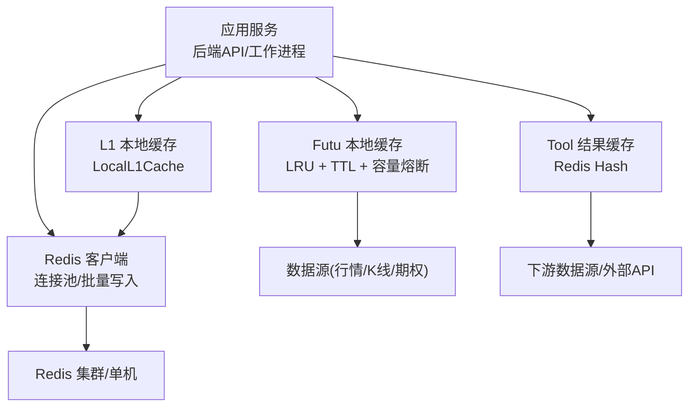
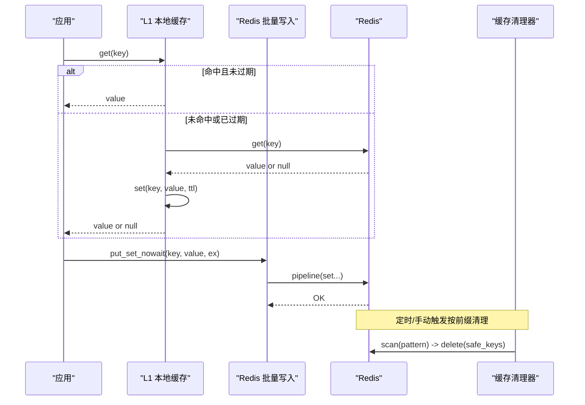
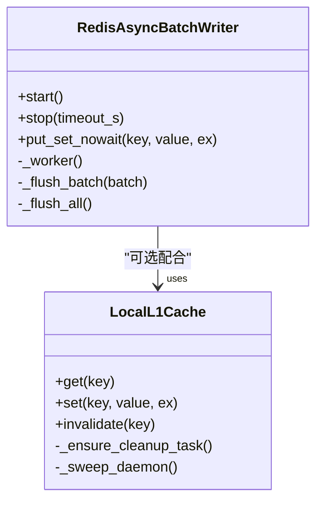
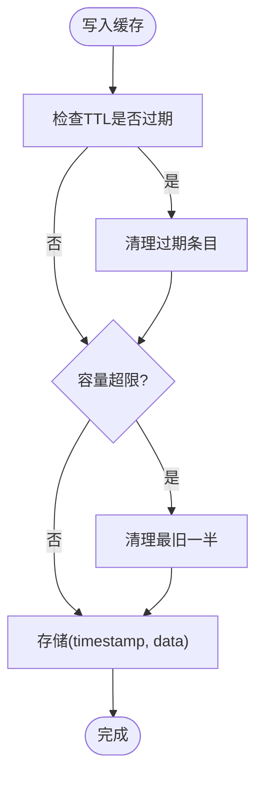
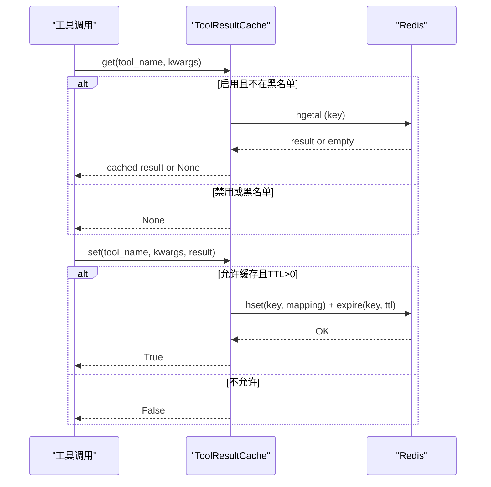
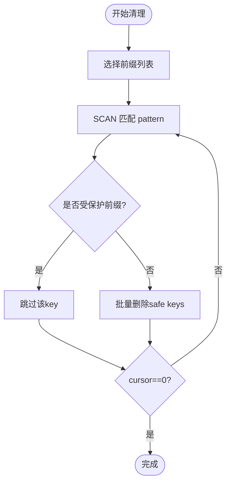
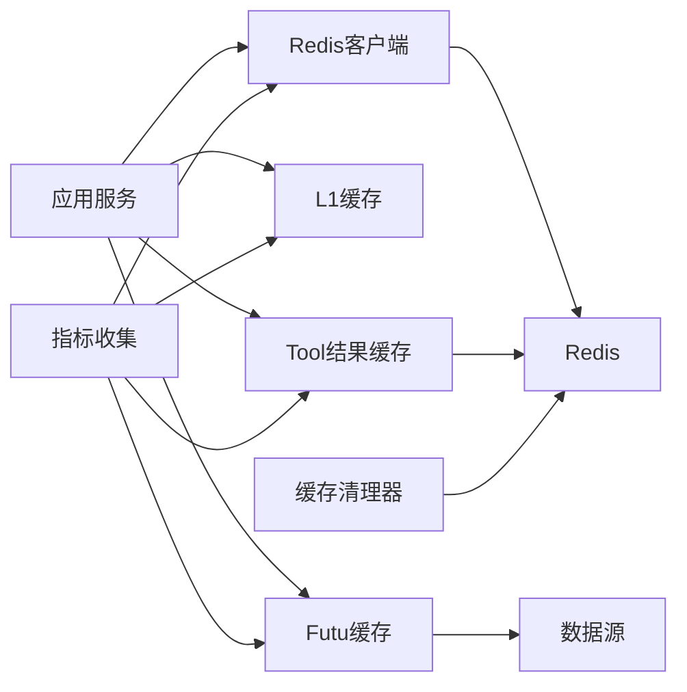

# 缓存策略与内存管理

<cite>
**本文引用的文件**
- [backend/core/redis_client.py](file://backend/core/redis_client.py)
- [backend/core/cache_manager.py](file://backend/core/cache_manager.py)
- [hermes_agent/tool_result_cache.py](file://hermes_agent/tool_result_cache.py)
- [data_subservice/futu_src/cache_manager.py](file://data_subservice/futu_src/cache_manager.py)
- [backend/core/metrics.py](file://backend/core/metrics.py)
- [scripts/memory_profiler.py](file://scripts/memory_profiler.py)
- [backend/app/macro_app.py](file://backend/app/macro_app.py)
</cite>

## 目录
1. [简介](#简介)
2. [项目结构](#项目结构)
3. [核心组件](#核心组件)
4. [架构总览](#架构总览)
5. [详细组件分析](#详细组件分析)
6. [依赖关系分析](#依赖关系分析)
7. [性能考量](#性能考量)
8. [故障排查指南](#故障排查指南)
9. [结论](#结论)
10. [附录](#附录)

## 简介
本指南面向系统架构师与运维工程师，系统化梳理 Quant Agent 的缓存策略与内存管理机制。内容覆盖多级缓存架构（进程内 L1、Redis L2/L3、持久化数据湖）、Redis 缓存策略与键设计、过期与一致性、缓存穿透防护、热点识别与预热、内存监控与泄漏检测、分布式一致性、失效与同步机制，以及可观测性指标与最佳实践。

## 项目结构
Quant Agent 在缓存与内存方面采用“分层+解耦”的设计：
- 进程内 L1 短效缓存：用于极高频读取（如配置、开关）降低 Redis 网络开销。
- Redis 统一缓存层：作为共享缓存与数据总线，承载业务缓存、工具结果缓存、K 线缓存等。
- 数据源侧本地缓存：针对特定数据源（如 Futu）的 L1 内存缓存与压缩存储，结合 TTL 与容量熔断。
- 工具结果缓存：基于 Redis Hash 的统一 Tool 调用结果缓存，支持按工具维度 TTL 与黑名单。
- 清理与保护：集中式缓存清理工具，避免误删交易态数据。
- 可观测性：Prometheus 指标覆盖缓存命中、延迟、队列深度、错误率等。

**图表来源**
- [backend/core/redis_client.py:184-251](file://backend/core/redis_client.py#L184-L251)
- [data_subservice/futu_src/cache_manager.py:30-149](file://data_subservice/futu_src/cache_manager.py#L30-L149)
- [hermes_agent/tool_result_cache.py:107-195](file://hermes_agent/tool_result_cache.py#L107-L195)

**章节来源**
- [backend/core/redis_client.py:11-34](file://backend/core/redis_client.py#L11-L34)
- [backend/core/cache_manager.py:19-75](file://backend/core/cache_manager.py#L19-L75)
- [data_subservice/futu_src/cache_manager.py:12-20](file://data_subservice/futu_src/cache_manager.py#L12-L20)
- [hermes_agent/tool_result_cache.py:20-40](file://hermes_agent/tool_result_cache.py#L20-L40)

## 核心组件
- 统一 Redis 客户端与连接池：集中管理连接上限、协议兼容、批量写入队列，减少 TCP RTT 与带宽压力。
- 进程内 L1 缓存：带后台清理任务、容量熔断与惰性过期，确保高吞吐下零阻塞。
- Futu 本地缓存管理器：多类数据缓存（报价、历史、期权链、资金流、盘口、基本面等），LRU 订阅池与容量熔断。
- Tool 结果缓存：Redis Hash 存储，按工具名与参数哈希生成稳定键，支持 TTL 覆盖与黑名单。
- 缓存清理器：按前缀扫描并删除业务缓存，受保护前缀（OMS/持仓/订单）绝对跳过。
- 可观测性指标：缓存命中、查询延迟、队列深度、错误计数、可用性状态等。

**章节来源**
- [backend/core/redis_client.py:46-177](file://backend/core/redis_client.py#L46-L177)
- [backend/core/redis_client.py:184-251](file://backend/core/redis_client.py#L184-L251)
- [data_subservice/futu_src/cache_manager.py:30-149](file://data_subservice/futu_src/cache_manager.py#L30-L149)
- [hermes_agent/tool_result_cache.py:79-195](file://hermes_agent/tool_result_cache.py#L79-L195)
- [backend/core/cache_manager.py:47-75](file://backend/core/cache_manager.py#L47-L75)
- [backend/core/metrics.py:24-104](file://backend/core/metrics.py#L24-L104)

## 架构总览
下图展示请求从应用到缓存层的完整路径，包括 L1 命中、L2 穿透、批量写入与清理流程。

**图表来源**
- [backend/core/redis_client.py:112-177](file://backend/core/redis_client.py#L112-L177)
- [backend/core/redis_client.py:213-244](file://backend/core/redis_client.py#L213-L244)
- [backend/core/cache_manager.py:47-75](file://backend/core/cache_manager.py#L47-L75)

## 详细组件分析

### 组件A：Redis 客户端与 L1 本地缓存
- 连接池与批量写入：通过 ConnectionPool 统一管理连接上限；异步队列聚合 set 操作，使用 Pipeline 批量发送，显著降低 RTT。
- L1 本地缓存：字典存储 (value, expire_time)，后台定时清理过期项；写时回写 Redis 并更新 L1；容量超限安全熔断清空。
- 适用场景：配置字典、系统开关、极高频读路径。

**图表来源**
- [backend/core/redis_client.py:46-177](file://backend/core/redis_client.py#L46-L177)
- [backend/core/redis_client.py:184-251](file://backend/core/redis_client.py#L184-L251)

**章节来源**
- [backend/core/redis_client.py:11-34](file://backend/core/redis_client.py#L11-L34)
- [backend/core/redis_client.py:46-177](file://backend/core/redis_client.py#L46-L177)
- [backend/core/redis_client.py:184-251](file://backend/core/redis_client.py#L184-L251)

### 组件B：Futu 本地缓存管理器
- 多类缓存：报价、历史、期权链、资金流、盘口、基本面、筹码分布等，各自独立 TTL。
- LRU 订阅池：维护订阅主题最近访问时间，支持容量保证与淘汰。
- 容量熔断：单类缓存超过阈值时清理最旧一半，防止无界增长。
- 数据压缩：对期权链与报价数据进行字段提取与截断，降低内存占用。

**图表来源**
- [data_subservice/futu_src/cache_manager.py:125-149](file://data_subservice/futu_src/cache_manager.py#L125-L149)

**章节来源**
- [data_subservice/futu_src/cache_manager.py:30-149](file://data_subservice/futu_src/cache_manager.py#L30-L149)
- [data_subservice/futu_src/cache_manager.py:224-373](file://data_subservice/futu_src/cache_manager.py#L224-L373)

### 组件C：Tool 结果缓存（Redis Hash）
- 键设计：tool:cache:{tool_name}:{args_hash}，args_hash 由工具名与参数 JSON（排序键）计算，保证稳定性。
- TTL 策略：全局默认 TTL 可通过环境变量覆盖；支持按工具名设置 TTL；黑名单工具不缓存。
- 写入过滤：错误、限流、空结果、显式 skip_cache 不落缓存；写入时去除瞬时标记字段。
- 统计：记录 hits/misses，便于评估命中率与调优 TTL。

**图表来源**
- [hermes_agent/tool_result_cache.py:79-195](file://hermes_agent/tool_result_cache.py#L79-L195)

**章节来源**
- [hermes_agent/tool_result_cache.py:20-40](file://hermes_agent/tool_result_cache.py#L20-L40)
- [hermes_agent/tool_result_cache.py:79-195](file://hermes_agent/tool_result_cache.py#L79-L195)

### 组件D：缓存清理与保护机制
- 清理范围：默认清理行情/K线/新闻/宏观/insider 等业务缓存前缀。
- 保护前缀：OMS 相关 key（活动订单、状态、持仓）绝对跳过，避免误删导致实盘状态丢失。
- 扫描删除：使用 SCAN 模式匹配，分批删除，异常日志记录。

**图表来源**
- [backend/core/cache_manager.py:47-75](file://backend/core/cache_manager.py#L47-L75)

**章节来源**
- [backend/core/cache_manager.py:19-75](file://backend/core/cache_manager.py#L19-L75)

### 组件E：缓存键设计与过期策略
- 键命名规范：
  - 业务缓存：quant:kline:*、quant:news:*、quant:macro:* 等。
  - Tool 结果：tool:cache:{tool_name}:{args_hash}。
  - 宏事件缓存：macro_calendar_*、ai_deduction 等。
- 过期策略：
  - L1 本地缓存：默认 TTL 10 秒，后台定时清理。
  - Tool 结果：按工具维度 TTL，支持环境变量覆盖。
  - 宏事件：自然日失效 + TTL 随机抖动防雪崩。
- 穿透防护：
  - 空结果与错误不落缓存。
  - 锁机制：对热点 key 加异步锁，避免并发穿透。

**章节来源**
- [backend/core/redis_client.py:184-251](file://backend/core/redis_client.py#L184-L251)
- [hermes_agent/tool_result_cache.py:79-195](file://hermes_agent/tool_result_cache.py#L79-L195)
- [backend/app/macro_app.py:61-73](file://backend/app/macro_app.py#L61-L73)
- [backend/app/macro_app.py:165-194](file://backend/app/macro_app.py#L165-L194)
- [backend/app/macro_app.py:205-216](file://backend/app/macro_app.py#L205-L216)

### 组件F：热点数据识别与预热
- 热点识别：
  - 通过 Prometheus 指标观察 K 线查询延迟与命中情况。
  - 关注 WS 订阅数、消息丢弃数，识别慢客户端导致的背压。
- 预加载策略：
  - 对热门标的/周期进行定时拉取并写入缓存。
  - 使用批量写入队列减少网络开销。
- 预热方案：
  - 启动时根据 watchlist 或热点表预热关键缓存。
  - 结合数据质量指标与可用性状态，动态调整预热范围。

**章节来源**
- [backend/core/metrics.py:42-104](file://backend/core/metrics.py#L42-L104)
- [backend/core/metrics.py:286-301](file://backend/core/metrics.py#L286-L301)
- [backend/core/redis_client.py:46-177](file://backend/core/redis_client.py#L46-L177)

### 组件G：内存管理与垃圾回收优化
- 内存监控：
  - 使用 tracemalloc 进行内存分配追踪，输出 Top 占用模块与差异对比。
  - 进程线程水位指标，防止线程耗尽。
- 对象池化：
  - L1 缓存字典在容量超限时安全熔断清空，避免无限增长。
  - Futu 缓存按类型隔离与 TTL 清理，减少冷数据堆积。
- GC 优化：
  - 后台定时清理过期键，惰性删除减少主路径开销。
  - 批量写入减少频繁对象创建与销毁。

**章节来源**
- [scripts/memory_profiler.py:17-154](file://scripts/memory_profiler.py#L17-L154)
- [backend/core/redis_client.py:184-251](file://backend/core/redis_client.py#L184-L251)
- [data_subservice/futu_src/cache_manager.py:125-149](file://data_subservice/futu_src/cache_manager.py#L125-L149)
- [backend/core/metrics.py:594-619](file://backend/core/metrics.py#L594-L619)

### 组件H：分布式缓存一致性与失效策略
- 一致性：
  - L1 写时同步回写 Redis，保证强一致。
  - Tool 结果缓存通过 TTL 与黑名单控制新鲜度。
- 同步机制：
  - 批量写入队列确保最终一致性。
  - 清理器按前缀删除，避免跨服务污染。
- 失效策略：
  - 自然日失效 + TTL 随机抖动。
  - 热点 key 加锁，避免缓存击穿。

**章节来源**
- [backend/core/redis_client.py:232-244](file://backend/core/redis_client.py#L232-L244)
- [hermes_agent/tool_result_cache.py:158-187](file://hermes_agent/tool_result_cache.py#L158-L187)
- [backend/app/macro_app.py:192-194](file://backend/app/macro_app.py#L192-L194)
- [backend/core/cache_manager.py:47-75](file://backend/core/cache_manager.py#L47-L75)

## 依赖关系分析
各组件之间的依赖关系如下：
- 应用服务依赖 Redis 客户端与 L1 缓存。
- Futu 本地缓存依赖数据源接口，提供压缩与 TTL 管理。
- Tool 结果缓存依赖 Redis Hash，支持 TTL 与黑名单。
- 缓存清理器依赖 Redis 扫描与删除能力。
- 可观测性指标贯穿所有组件，提供监控与告警。

**图表来源**
- [backend/core/redis_client.py:11-34](file://backend/core/redis_client.py#L11-L34)
- [data_subservice/futu_src/cache_manager.py:30-149](file://data_subservice/futu_src/cache_manager.py#L30-L149)
- [hermes_agent/tool_result_cache.py:107-195](file://hermes_agent/tool_result_cache.py#L107-L195)
- [backend/core/cache_manager.py:47-75](file://backend/core/cache_manager.py#L47-L75)
- [backend/core/metrics.py:24-104](file://backend/core/metrics.py#L24-L104)

**章节来源**
- [backend/core/redis_client.py:11-34](file://backend/core/redis_client.py#L11-L34)
- [data_subservice/futu_src/cache_manager.py:30-149](file://data_subservice/futu_src/cache_manager.py#L30-L149)
- [hermes_agent/tool_result_cache.py:107-195](file://hermes_agent/tool_result_cache.py#L107-L195)
- [backend/core/cache_manager.py:47-75](file://backend/core/cache_manager.py#L47-L75)
- [backend/core/metrics.py:24-104](file://backend/core/metrics.py#L24-L104)

## 性能考量
- 网络优化：批量写入队列减少 RTT，Pipeline 提升吞吐。
- 内存优化：L1 缓存容量熔断，Futu 缓存 TTL 与容量限制。
- 延迟优化：热点数据预热，K 线查询延迟指标监控。
- 背压处理：WS 消息丢弃计数，慢客户端保护。
- 资源限制：Redis 连接池上限，进程线程数监控。

[本节为通用指导，无需具体文件引用]

## 故障排查指南
- 缓存未命中：检查 Tool 结果缓存黑名单与 TTL，确认参数哈希稳定性。
- 内存泄漏：使用 tracemalloc 快照对比，定位增长热点模块。
- 连接池耗尽：监控 Redis 连接数与队列深度，调整连接池上限。
- 缓存穿透：检查热点 key 是否加锁，空结果是否落缓存。
- 数据不一致：确认 L1 写时同步逻辑，检查清理器是否误删。

**章节来源**
- [hermes_agent/tool_result_cache.py:89-104](file://hermes_agent/tool_result_cache.py#L89-L104)
- [scripts/memory_profiler.py:57-80](file://scripts/memory_profiler.py#L57-L80)
- [backend/core/metrics.py:78-94](file://backend/core/metrics.py#L78-L94)
- [backend/app/macro_app.py:67-73](file://backend/app/macro_app.py#L67-L73)
- [backend/core/cache_manager.py:47-75](file://backend/core/cache_manager.py#L47-L75)

## 结论
Quant Agent 的缓存与内存管理采用多层架构，兼顾高性能与高可用。通过 L1 本地缓存、Redis 共享缓存、数据源本地缓存的组合，有效降低延迟与网络开销。结合 TTL、容量熔断、批量写入、可观测性指标等手段，实现了稳定的生产级缓存体系。建议持续监控命中率、延迟与内存使用，动态调优 TTL 与容量参数，确保系统在高负载下的健壮性。

[本节为总结性内容，无需具体文件引用]

## 附录
- 环境变量参考：
  - REDIS_HOST、REDIS_PORT、REDIS_PASSWORD、REDIS_MAX_CONNECTIONS
  - L1_CACHE_MAX_SIZE
  - TOOL_CACHE_ENABLED、TOOL_CACHE_DEFAULT_TTL、TOOL_CACHE_TTL_{NAME}
  - FUTU_MAX_SUBSCRIPTIONS
- 监控面板：
  - K 线缓存命中与延迟
  - Redis 队列深度与错误率
  - WebSocket 连接数与消息丢弃
  - 进程线程数与内存占用

[本节为补充信息，无需具体文件引用]