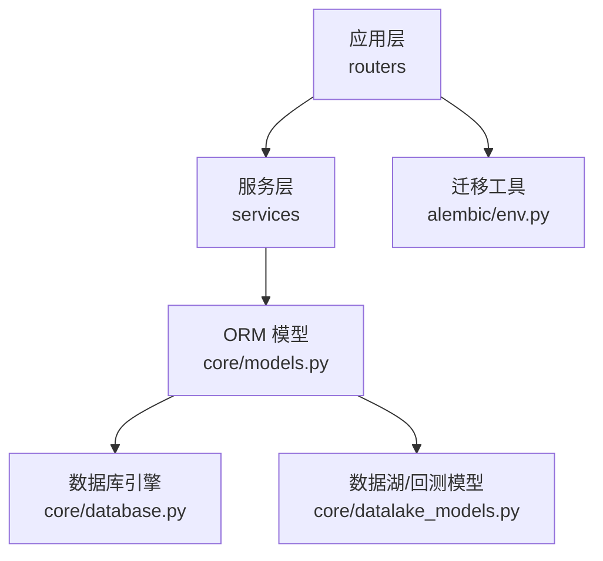
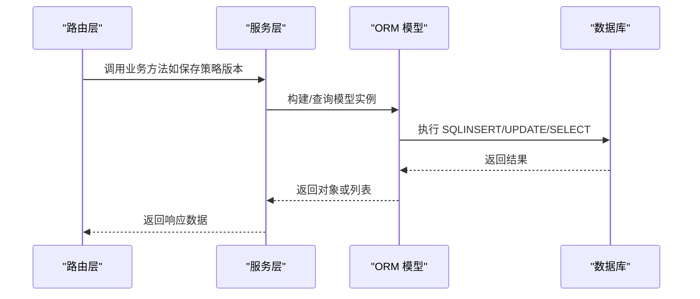
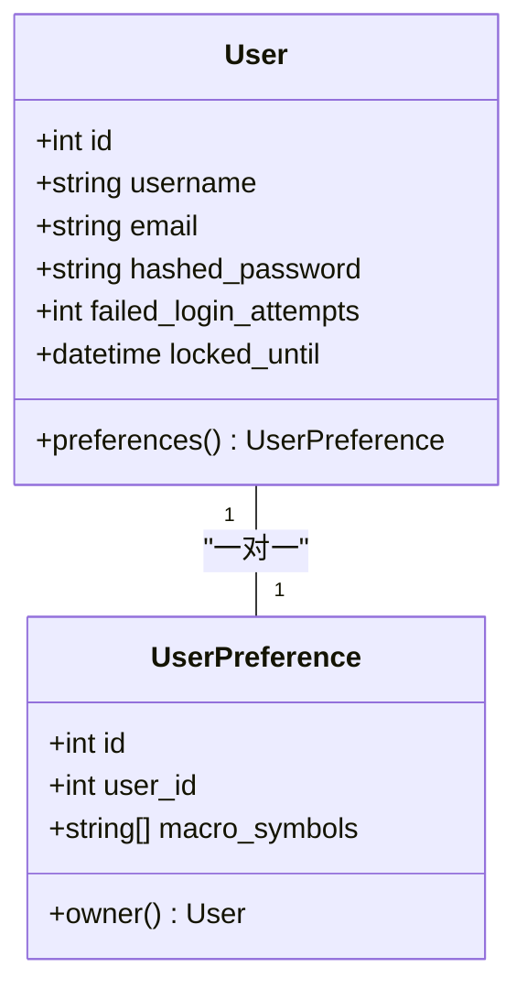
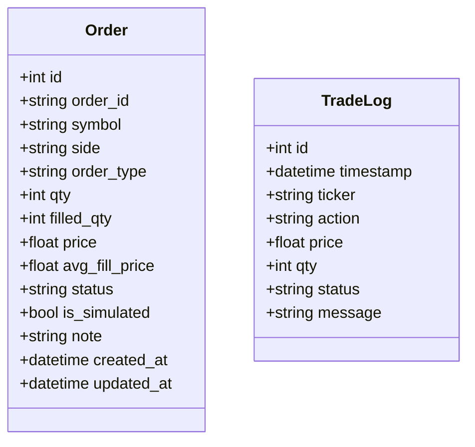
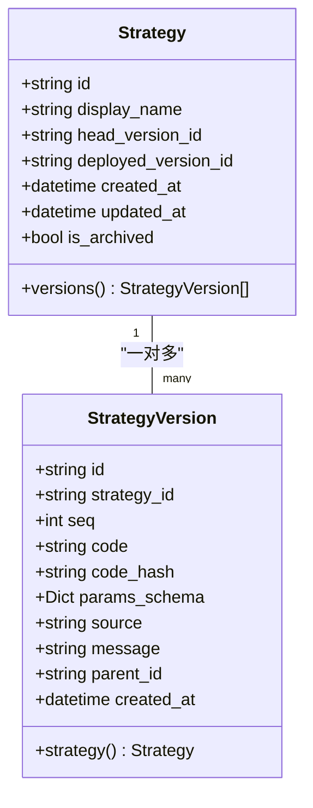
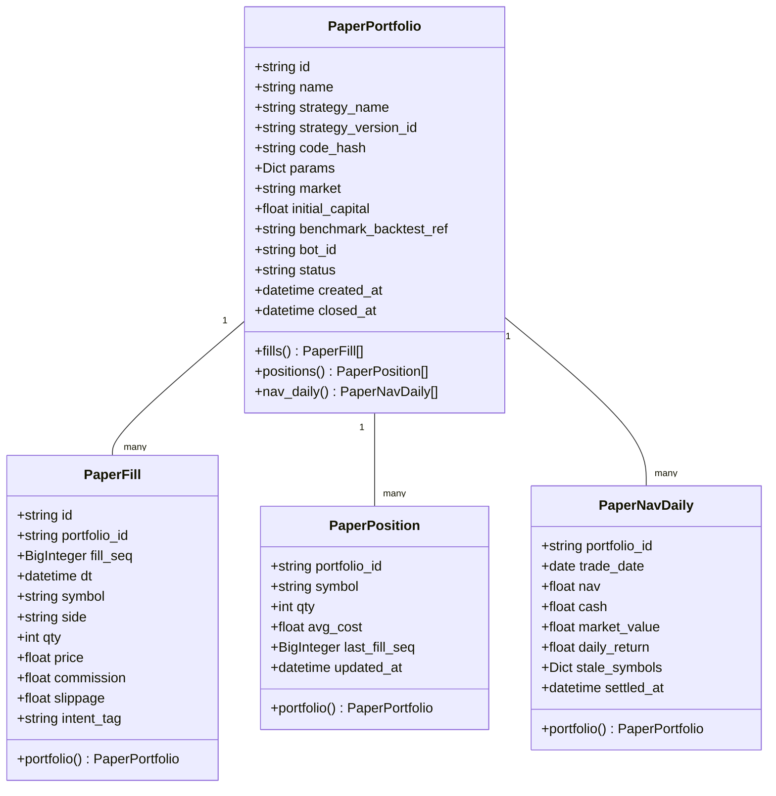
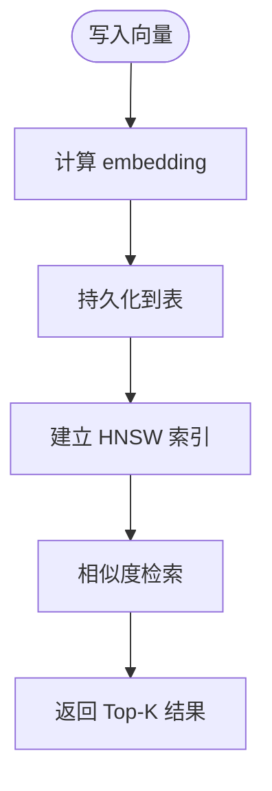
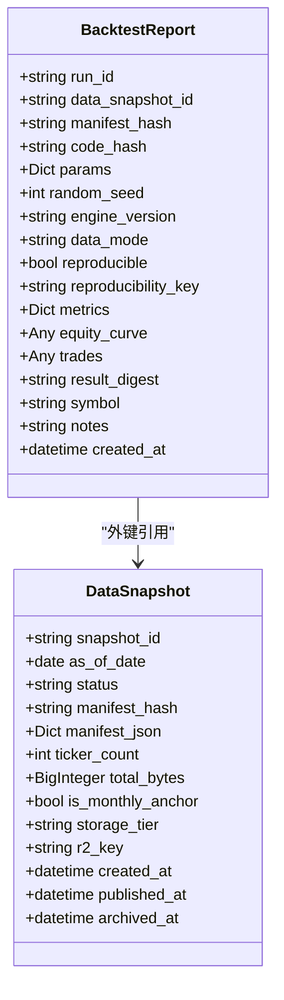
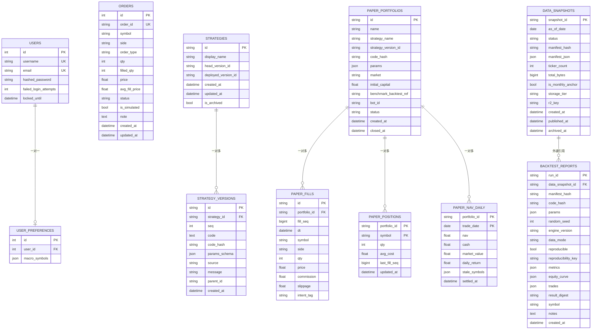

# ORM模型设计

<cite>
**本文引用的文件**
- [backend/core/models.py](file://backend/core/models.py)
- [backend/core/database.py](file://backend/core/database.py)
- [backend/core/datalake_models.py](file://backend/core/datalake_models.py)
- [backend/services/strategy_version_service.py](file://backend/services/strategy_version_service.py)
- [backend/routers/strategy.py](file://backend/routers/strategy.py)
- [backend/routers/trade.py](file://backend/routers/trade.py)
- [backend/alembic/env.py](file://backend/alembic/env.py)
</cite>

## 目录
1. [简介](#简介)
2. [项目结构](#项目结构)
3. [核心组件](#核心组件)
4. [架构总览](#架构总览)
5. [详细组件分析](#详细组件分析)
6. [依赖关系分析](#依赖关系分析)
7. [性能与索引优化](#性能与索引优化)
8. [查询最佳实践](#查询最佳实践)
9. [版本控制、软删除与审计字段](#版本控制软删除与审计字段)
10. [故障排查指南](#故障排查指南)
11. [结论](#结论)
12. [附录：数据表结构与外键关系图](#附录数据表结构与外键关系图)

## 简介
本文件系统性梳理 Quant Agent 后端的 SQLAlchemy ORM 模型设计与实现，覆盖用户、策略、订单、市场数据、纸面组合等核心业务实体；说明字段类型映射、关系配置（一对一、一对多、多对多）、继承机制、混合属性与计算字段的使用方式；提供数据库表结构图、外键关系说明、索引优化策略；并给出复杂关联查询与聚合查询的最佳实践。同时总结模型版本控制、软删除实现与审计字段设计，帮助新开发者快速上手并高效扩展。

## 项目结构
后端 ORM 相关代码主要分布在以下位置：
- 基础数据库连接与 Base 定义：backend/core/database.py
- 核心业务模型：backend/core/models.py
- 数据湖与回测报告模型：backend/core/datalake_models.py
- 策略版本服务（ORM 使用）：backend/services/strategy_version_service.py
- 路由层对模型的调用示例：backend/routers/strategy.py、backend/routers/trade.py
- Alembic 迁移环境：backend/alembic/env.py

图表来源
- [backend/routers/strategy.py:1-585](file://backend/routers/strategy.py#L1-L585)
- [backend/services/strategy_version_service.py:1-243](file://backend/services/strategy_version_service.py#L1-L243)
- [backend/core/models.py:1-495](file://backend/core/models.py#L1-L495)
- [backend/core/database.py:1-67](file://backend/core/database.py#L1-L67)
- [backend/core/datalake_models.py:1-82](file://backend/core/datalake_models.py#L1-L82)
- [backend/alembic/env.py:1-80](file://backend/alembic/env.py#L1-L80)

章节来源
- [backend/core/database.py:1-67](file://backend/core/database.py#L1-L67)
- [backend/core/models.py:1-495](file://backend/core/models.py#L1-L495)
- [backend/core/datalake_models.py:1-82](file://backend/core/datalake_models.py#L1-L82)
- [backend/alembic/env.py:1-80](file://backend/alembic/env.py#L1-L80)

## 核心组件
- 数据库连接与异步支持：通过环境变量配置数据库 URL，自动切换 SQLite/PostgreSQL/MySQL；提供同步 SessionLocal 与异步 AsyncSessionLocal，便于高并发场景。
- 核心业务模型：User、Order、Strategy、StrategyVersion、PaperPortfolio、PaperFill、PaperPosition、PaperNavDaily、AgentSession、ExpertTeamSession、ScreenerSubscription、SavedScreen、WebpageKnowledgeBase、ScreenerRule、IVSnapshot、SentimentRecord、PerformanceLog、AuditLog、ClientHeartbeat、FrontendLog、NavSnapshot、RefreshTokenBlacklist。
- 数据湖与回测模型：DataSnapshot、BacktestReport，用于不可变快照元数据与可复现性绑定。
- 策略版本管理：Strategy/StrategyVersion 配合 service 层实现幂等保存、版本序列号递增、head 指针更新与恢复。

章节来源
- [backend/core/database.py:1-67](file://backend/core/database.py#L1-L67)
- [backend/core/models.py:1-495](file://backend/core/models.py#L1-L495)
- [backend/core/datalake_models.py:1-82](file://backend/core/datalake_models.py#L1-L82)
- [backend/services/strategy_version_service.py:1-243](file://backend/services/strategy_version_service.py#L1-L243)

## 架构总览
ORM 层位于服务层之下，为上层 API 路由提供服务能力。Alembic 负责根据模型生成迁移脚本，确保数据库 schema 与代码一致。

图表来源
- [backend/routers/strategy.py:431-475](file://backend/routers/strategy.py#L431-L475)
- [backend/services/strategy_version_service.py:23-120](file://backend/services/strategy_version_service.py#L23-L120)
- [backend/core/models.py:351-393](file://backend/core/models.py#L351-L393)
- [backend/core/database.py:1-67](file://backend/core/database.py#L1-L67)

## 详细组件分析

### 用户与偏好（一对一关系）
- User：主键 id、唯一用户名与邮箱、密码哈希、登录失败计数与锁定时间。
- UserPreference：一对一关联到 User（user_id 唯一外键），存储 JSON 格式的指标符号列表。
- 关系：User.preferences 与 UserPreference.owner 双向映射，uselist=False 表示一对一。

图表来源
- [backend/core/models.py:37-75](file://backend/core/models.py#L37-L75)

章节来源
- [backend/core/models.py:37-75](file://backend/core/models.py#L37-L75)

### 订单与交易日志（独立事件表）
- Order：记录模拟与实盘订单，包含 symbol、side、order_type、qty、filled_qty、price、avg_fill_price、status、is_simulated、note 及时间戳。
- TradeLog：交易日志，记录 ticker、action、price、qty、status、message 与时间戳。

图表来源
- [backend/core/models.py:53-64](file://backend/core/models.py#L53-L64)
- [backend/core/models.py:269-289](file://backend/core/models.py#L269-L289)

章节来源
- [backend/core/models.py:53-64](file://backend/core/models.py#L53-L64)
- [backend/core/models.py:269-289](file://backend/core/models.py#L269-L289)

### 策略与策略版本（一对多关系）
- Strategy：策略主表，包含 display_name、head_version_id、deployed_version_id、is_archived 等。
- StrategyVersion：每个版本一条记录，包含 code、code_hash、params_schema、source、message、parent_id、created_at。
- 关系：Strategy.versions 与 StrategyVersion.strategy 双向映射，级联删除。

图表来源
- [backend/core/models.py:351-393](file://backend/core/models.py#L351-L393)

章节来源
- [backend/core/models.py:351-393](file://backend/core/models.py#L351-L393)
- [backend/services/strategy_version_service.py:23-120](file://backend/services/strategy_version_service.py#L23-L120)

### 纸面组合系统（一对多与投影）
- PaperPortfolio：组合主档，包含 name、strategy_name、strategy_version_id、code_hash、params、market、initial_capital、benchmark_backtest_ref、bot_id、status、created_at、closed_at。
- PaperFill：成交流水（只增），portfolio_id 外键，fill_seq 单调序号，symbol、side、qty、price、commission、slippage、intent_tag。
- PaperPosition：持仓现状（投影），portfolio_id + symbol 复合主键，qty、avg_cost、last_fill_seq、updated_at。
- PaperNavDaily：日终净值（不可变），portfolio_id + trade_date 复合主键，nav、cash、market_value、daily_return、stale_symbols、settled_at。
- 关系：Portfolio 与 Fill/Position/NavDaily 为一对多，级联删除。

图表来源
- [backend/core/models.py:401-478](file://backend/core/models.py#L401-L478)

章节来源
- [backend/core/models.py:401-478](file://backend/core/models.py#L401-L478)

### 向量检索与 HNSW 索引（WebpageKnowledgeBase、ScreenerRule）
- WebpageKnowledgeBase：网页知识条目，包含 url、content、timestamp、user_id、category、embedding_model_version、embedding（Vector）。
- ScreenerRule：选股规则，包含 desc_text、rule_text、rule_type、user_id、embedding（Vector）。
- 两者均定义 PostgreSQL HNSW 索引，使用余弦距离运算类，提升向量相似度检索性能。

图表来源
- [backend/core/models.py:199-256](file://backend/core/models.py#L199-L256)

章节来源
- [backend/core/models.py:199-256](file://backend/core/models.py#L199-L256)

### 数据湖与回测报告（不可变快照与可复现性）
- DataSnapshot：Parquet 数据湖日快照元数据，包含 snapshot_id、as_of_date、status、manifest_hash、manifest_json、ticker_count、total_bytes、is_monthly_anchor、storage_tier、r2_key、时间戳。
- BacktestReport：回测报告，包含 run_id、data_snapshot_id（外键）、manifest_hash、code_hash、params、random_seed、engine_version、data_mode、reproducible、reproducibility_key、metrics、equity_curve、trades、result_digest、symbol、notes、created_at。

图表来源
- [backend/core/datalake_models.py:31-82](file://backend/core/datalake_models.py#L31-L82)

章节来源
- [backend/core/datalake_models.py:31-82](file://backend/core/datalake_models.py#L31-L82)

### 会话与审计（AgentSession、ExpertTeamSession、AuditLog）
- AgentSession：大模型会话持久化，session_id 唯一，user_id 可选，messages JSON，创建/更新时间戳。
- ExpertTeamSession：专家团辩论会话，session_data JSON，创建/更新时间戳。
- AuditLog：操作审计日志，action、detail JSON、ip、trace_id、user_id、created_at。

章节来源
- [backend/core/models.py:106-137](file://backend/core/models.py#L106-L137)
- [backend/core/models.py:292-303](file://backend/core/models.py#L292-L303)

### 客户端心跳与性能监控（ClientHeartbeat、PerformanceLog）
- ClientHeartbeat：平台、app_version、device_id、fps、memory_mb、ws_latency_ms、Web Vitals（lcp_ms、cls、inp_ms、ttfb_ms）、created_at。
- PerformanceLog：慢请求与事件循环卡顿日志，log_type、duration_ms、endpoint、details、timestamp。

章节来源
- [backend/core/models.py:140-153](file://backend/core/models.py#L140-L153)
- [backend/core/models.py:306-328](file://backend/core/models.py#L306-L328)

### 其他辅助模型（IVSnapshot、SentimentRecord、NavSnapshot、RefreshTokenBlacklist、FrontendLog）
- IVSnapshot：个股历史隐含波动率快照，ticker、iv_value、recorded_at。
- SentimentRecord：市场情绪与宏观风向标历史记录，vix_value、pc_ratio、credit_spread、fear_greed_score、timestamp。
- NavSnapshot：净值快照，market、nav、cash、created_at。
- RefreshTokenBlacklist：刷新 Token 黑名单，jti、expires_at、created_at。
- FrontendLog：前端日志采集，level、message、context、user_agent、page_url、user_id、created_at。

章节来源
- [backend/core/models.py:77-104](file://backend/core/models.py#L77-L104)
- [backend/core/models.py:331-343](file://backend/core/models.py#L331-L343)
- [backend/core/models.py:259-267](file://backend/core/models.py#L259-L267)
- [backend/core/models.py:481-495](file://backend/core/models.py#L481-L495)

## 依赖关系分析
- 模型与数据库：所有模型继承自 database.Base，使用 mapped_column 与 relationship 定义字段与关系。
- 服务层与模型：strategy_version_service 直接操作 Strategy/StrategyVersion，实现幂等保存、版本序列号递增、head 指针更新与恢复。
- 路由层与服务层：routers/strategy.py 调用 service 层进行策略保存与版本管理；routers/trade.py 调用 app.trade_app 获取交易数据，并通过 get_db 注入 Session。

图表来源
- [backend/routers/strategy.py:431-475](file://backend/routers/strategy.py#L431-L475)
- [backend/services/strategy_version_service.py:23-120](file://backend/services/strategy_version_service.py#L23-L120)
- [backend/core/models.py:351-393](file://backend/core/models.py#L351-L393)
- [backend/core/database.py:1-67](file://backend/core/database.py#L1-L67)

章节来源
- [backend/routers/strategy.py:431-475](file://backend/routers/strategy.py#L431-L475)
- [backend/services/strategy_version_service.py:23-120](file://backend/services/strategy_version_service.py#L23-L120)
- [backend/core/models.py:351-393](file://backend/core/models.py#L351-L393)
- [backend/core/database.py:1-67](file://backend/core/database.py#L1-L67)

## 性能与索引优化
- 高频查询字段加索引：如 users.username/email、orders.symbol/status/order_id、paper_fills.portfolio_id/fill_seq、client_heartbeats.platform/created_at、performance_logs.timestamp/log_type、backtest_reports.created_at/reproducibility_key。
- 复合索引：paper_fills(portfolio_id, fill_seq) 唯一约束避免重复；paper_positions 与 paper_nav_daily 使用复合主键保证唯一性。
- 向量检索优化：WebpageKnowledgeBase 与 ScreenerRule 使用 PostgreSQL HNSW 索引，指定余弦距离运算类，提升相似度检索性能。
- 连接池与异步：PostgreSQL/MySQL 使用连接池配置（pool_size、max_overflow、pool_timeout、pool_recycle、pool_pre_ping），并提供异步引擎以支持高并发。

章节来源
- [backend/core/models.py:219-256](file://backend/core/models.py#L219-L256)
- [backend/core/models.py:325-328](file://backend/core/models.py#L325-L328)
- [backend/core/models.py:444-444](file://backend/core/models.py#L444-L444)
- [backend/core/models.py:469-478](file://backend/core/models.py#L469-L478)
- [backend/core/database.py:14-25](file://backend/core/database.py#L14-L25)
- [backend/core/database.py:44-61](file://backend/core/database.py#L44-L61)

## 查询最佳实践
- 复杂关联查询：
  - 获取某策略的所有版本并按 seq 倒序：使用 StrategyVersion 的 strategy_id 过滤与排序。
  - 获取组合的持仓与日终净值：通过 Portfolio 的 fills/positions/nav_daily 关系加载。
- 聚合查询：
  - 统计每日净值变化：对 PaperNavDaily 按 trade_date 分组计算 daily_return。
  - 统计订单状态分布：对 Orders 按 status 分组计数。
- 向量检索：
  - 使用 HNSW 索引进行相似度检索，返回 Top-K 结果。

示例路径（不展示代码内容）：
- 策略版本查询：[backend/services/strategy_version_service.py:123-156](file://backend/services/strategy_version_service.py#L123-L156)
- 组合净值查询：[backend/core/models.py:464-478](file://backend/core/models.py#L464-L478)
- 订单统计：[backend/core/models.py:269-289](file://backend/core/models.py#L269-L289)
- 向量检索：[backend/core/models.py:219-256](file://backend/core/models.py#L219-L256)

## 版本控制、软删除与审计字段
- 版本控制：
  - Strategy/StrategyVersion 实现策略版本管理，支持幂等保存（相同 code_hash 不重复创建）、seq 递增、head 指针更新、恢复旧版本。
  - 服务层 save_version 处理并发冲突（IntegrityError）并返回已存在版本。
- 软删除：
  - Strategy.is_archived 标记归档，未使用逻辑删除字段；可通过该字段实现软删除语义。
- 审计字段：
  - AuditLog 记录操作审计，包含 action、detail JSON、ip、trace_id、user_id、created_at。
  - 多数模型包含 created_at/updated_at 时间戳，便于追踪变更。

章节来源
- [backend/core/models.py:351-393](file://backend/core/models.py#L351-L393)
- [backend/services/strategy_version_service.py:23-120](file://backend/services/strategy_version_service.py#L23-L120)
- [backend/core/models.py:292-303](file://backend/core/models.py#L292-L303)

## 故障排查指南
- 数据库连接问题：检查 DATABASE_URL 环境变量是否正确；SQLite 使用 check_same_thread=False；PostgreSQL/MySQL 使用连接池参数。
- 迁移失败：确认 alembic/env.py 正确导入所有模型；检查 Base.metadata 是否包含最新模型。
- 并发冲突：策略版本保存时可能触发唯一约束（code_hash），服务层已处理 IntegrityError 并返回已存在版本。
- 向量检索性能：确保 PostgreSQL 启用 pgvector 与 HNSW 索引；检查 m 与 ef_construction 超参数设置。

章节来源
- [backend/core/database.py:7-25](file://backend/core/database.py#L7-L25)
- [backend/alembic/env.py:19-41](file://backend/alembic/env.py#L19-L41)
- [backend/services/strategy_version_service.py:92-113](file://backend/services/strategy_version_service.py#L92-L113)
- [backend/core/models.py:219-256](file://backend/core/models.py#L219-L256)

## 结论
Quant Agent 的 ORM 设计以清晰的关系建模为核心，结合索引优化与异步支持，满足高并发与可扩展需求。策略版本管理与纸面组合系统体现了领域驱动设计的思想，确保数据一致性与可追溯性。通过 HNSW 向量索引与审计字段，系统在检索性能与合规性方面具备良好基础。新开发者可基于此文档快速理解模型结构、关系与查询模式，并在实践中遵循最佳实践进行扩展与优化。

## 附录：数据表结构与外键关系图

图表来源
- [backend/core/models.py:37-75](file://backend/core/models.py#L37-L75)
- [backend/core/models.py:269-289](file://backend/core/models.py#L269-L289)
- [backend/core/models.py:351-393](file://backend/core/models.py#L351-L393)
- [backend/core/models.py:401-478](file://backend/core/models.py#L401-L478)
- [backend/core/datalake_models.py:31-82](file://backend/core/datalake_models.py#L31-L82)