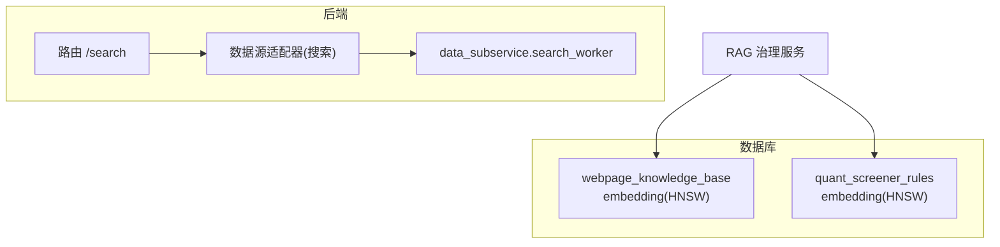
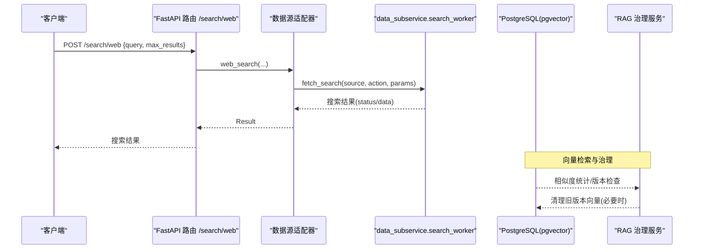
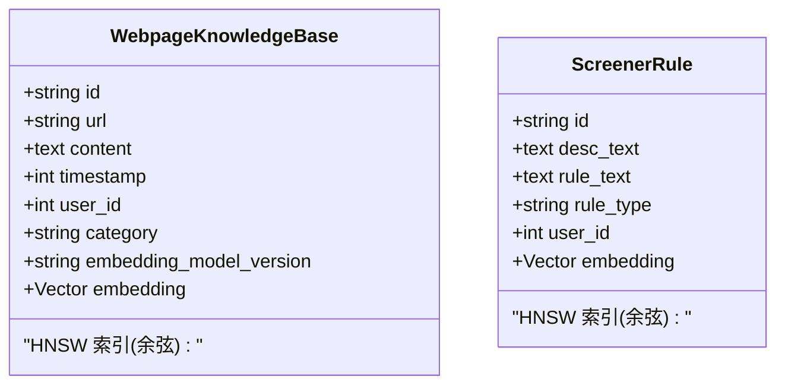
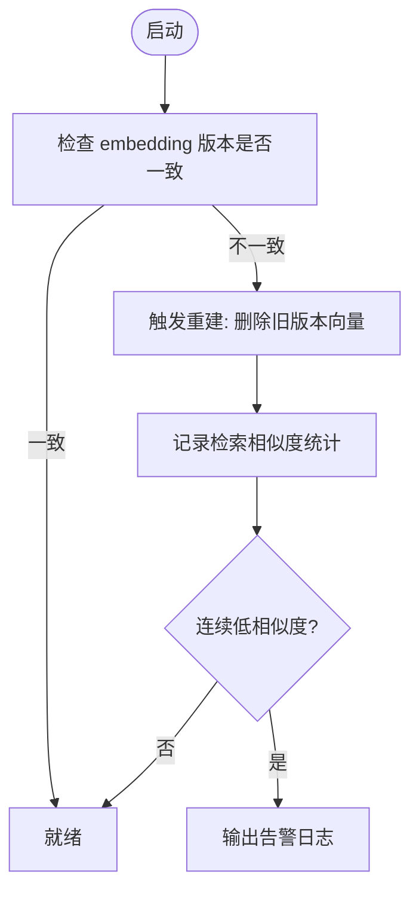
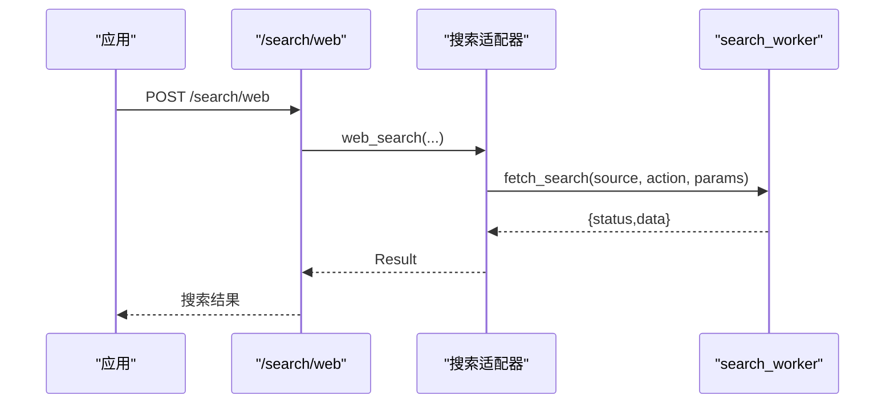
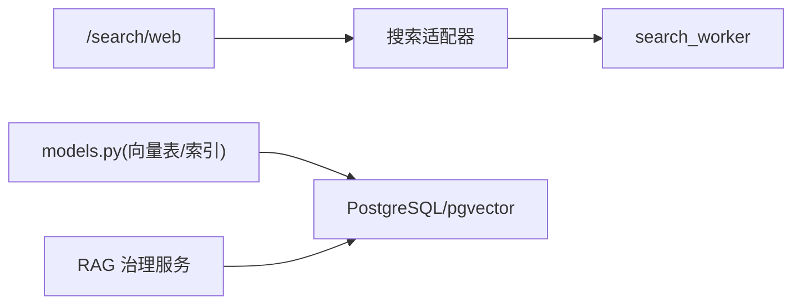

# 向量搜索与全文检索

<cite>
**本文引用的文件**
- [backend/core/models.py](file://backend/core/models.py)
- [backend/core/database.py](file://backend/core/database.py)
- [backend/app/rag/governance.py](file://backend/app/rag/governance.py)
- [backend/routers/search.py](file://backend/routers/search.py)
- [backend/services/datasource/adapters/search.py](file://backend/services/datasource/adapters/search.py)
- [data_subservice/search_worker.py](file://data_subservice/search_worker.py)
</cite>

## 目录
1. [简介](#简介)
2. [项目结构](#项目结构)
3. [核心组件](#核心组件)
4. [架构总览](#架构总览)
5. [详细组件分析](#详细组件分析)
6. [依赖关系分析](#依赖关系分析)
7. [性能考量](#性能考量)
8. [故障排查指南](#故障排查指南)
9. [结论](#结论)
10. [附录](#附录)

## 简介
本文件面向开发者，系统化说明 Quant Agent 在 PostgreSQL + pgvector 环境下的向量搜索与全文检索能力。内容涵盖：
- pgvector 扩展的安装与配置要点、向量数据类型与相似度计算方式
- 文本向量化流程（Embedding 模型选择、维度设置、批量处理优化）
- 全文检索能力（基于 pg_trgm 的模糊匹配、拼音搜索、同义词扩展思路）
- 向量索引类型选择与参数调优（IVFFlat、HNSW），以及性能基准方法
- 语义搜索、混合检索、结果重排序的具体查询示例
- 向量数据管理（索引重建、增量更新、内存优化）
- 集成指南与性能调优方案

## 项目结构
本项目将“向量存储与检索”的核心定义集中在数据库模型层，并通过 RAG 治理服务进行版本管理与质量监控；同时提供统一的网络搜索入口，经数据源适配器与子服务 worker 完成外部搜索聚合。

图表来源
- [backend/routers/search.py:1-30](file://backend/routers/search.py#L1-L30)
- [backend/services/datasource/adapters/search.py:1-148](file://backend/services/datasource/adapters/search.py#L1-L148)
- [data_subservice/search_worker.py:1-71](file://data_subservice/search_worker.py#L1-L71)
- [backend/core/models.py:199-256](file://backend/core/models.py#L199-L256)
- [backend/app/rag/governance.py:1-169](file://backend/app/rag/governance.py#L1-L169)

章节来源
- [backend/routers/search.py:1-30](file://backend/routers/search.py#L1-L30)
- [backend/services/datasource/adapters/search.py:1-148](file://backend/services/datasource/adapters/search.py#L1-L148)
- [data_subservice/search_worker.py:1-71](file://data_subservice/search_worker.py#L1-L71)
- [backend/core/models.py:199-256](file://backend/core/models.py#L199-L256)
- [backend/app/rag/governance.py:1-169](file://backend/app/rag/governance.py#L1-L169)

## 核心组件
- 向量模型与索引
  - 知识库表 webpage_knowledge_base 包含 embedding 列与 HNSW 索引，使用余弦距离算子。
  - 规则表 quant_screener_rules 同样具备 embedding 列与 HNSW 索引。
  - 向量维度由环境变量 EMBEDDING_DIM 控制，默认 1024。
- 数据库连接与驱动
  - 支持 SQLite（开发/测试）与 PostgreSQL（生产）。PostgreSQL 下通过 pgvector.sqlalchemy.Vector 类型使用原生向量能力。
- RAG 治理服务
  - 启动时检测 embedding 模型版本不一致，触发旧版本记录清理并提示重建。
  - 记录检索相似度统计，连续低相似度达到阈值时告警。
- 统一网络搜索入口
  - 路由 /search/web 接收请求，交由数据源适配器，最终由 data_subservice.search_worker 聚合 Tavily/Bocha/Jina 等外部搜索能力。

章节来源
- [backend/core/models.py:11-36](file://backend/core/models.py#L11-L36)
- [backend/core/models.py:199-256](file://backend/core/models.py#L199-L256)
- [backend/core/database.py:1-67](file://backend/core/database.py#L1-L67)
- [backend/app/rag/governance.py:1-169](file://backend/app/rag/governance.py#L1-L169)
- [backend/routers/search.py:1-30](file://backend/routers/search.py#L1-L30)
- [backend/services/datasource/adapters/search.py:1-148](file://backend/services/datasource/adapters/search.py#L1-L148)
- [data_subservice/search_worker.py:1-71](file://data_subservice/search_worker.py#L1-L71)

## 架构总览
下图展示从请求到向量检索与外部搜索聚合的整体流程，以及治理服务的监控闭环。

图表来源
- [backend/routers/search.py:11-29](file://backend/routers/search.py#L11-L29)
- [backend/services/datasource/adapters/search.py:83-108](file://backend/services/datasource/adapters/search.py#L83-L108)
- [data_subservice/search_worker.py:19-66](file://data_subservice/search_worker.py#L19-L66)
- [backend/core/models.py:199-256](file://backend/core/models.py#L199-L256)
- [backend/app/rag/governance.py:27-125](file://backend/app/rag/governance.py#L27-L125)

## 详细组件分析

### 向量数据模型与索引
- 向量类型
  - 优先使用 pgvector 的 Vector 类型；若未安装 pgvector，则回退为 SQLite 的 LargeBinary 兼容实现，便于本地开发。
- 向量维度
  - 通过环境变量 EMBEDDING_DIM 指定，默认 1024。所有 embedding 字段声明使用该维度。
- 索引策略
  - 两张关键表均创建 HNSW 索引，使用 vector_cosine_ops 余弦距离算子，超参 m=16、ef_construction=64，平衡召回率与内存占用。

图表来源
- [backend/core/models.py:199-256](file://backend/core/models.py#L199-L256)

章节来源
- [backend/core/models.py:11-36](file://backend/core/models.py#L11-L36)
- [backend/core/models.py:199-256](file://backend/core/models.py#L199-L256)

### 数据库连接与 pgvector 适配
- 同步/异步引擎
  - 根据 DATABASE_URL 自动选择 SQLite 或 PostgreSQL；PostgreSQL 使用 asyncpg 驱动。
- pgvector 类型
  - 尝试导入 pgvector.sqlalchemy.Vector；失败时降级为 TypeDecorator(LargeBinary)，确保跨环境可用。

章节来源
- [backend/core/database.py:1-67](file://backend/core/database.py#L1-L67)
- [backend/core/models.py:11-36](file://backend/core/models.py#L11-L36)

### RAG 治理与向量生命周期
- 版本一致性检查
  - 启动时比对数据库中记录的 embedding_model_version 与当前配置，发现不一致则返回旧版本号以触发重建。
- 重建策略
  - 删除旧版本向量记录，避免混用不同模型生成的向量；实际重新生成需调用 Embedding API 后写入。
- 检索质量监控
  - 记录每次检索最高相似度，连续低于阈值（默认 0.6）达到一定次数时发出告警。

图表来源
- [backend/app/rag/governance.py:27-125](file://backend/app/rag/governance.py#L27-L125)
- [backend/app/rag/governance.py:127-169](file://backend/app/rag/governance.py#L127-L169)

章节来源
- [backend/app/rag/governance.py:1-169](file://backend/app/rag/governance.py#L1-L169)

### 统一网络搜索入口与聚合
- 路由层
  - /search/web 接收 query、max_results、include_domains、exclude_domains 等参数。
- 适配器层
  - 将请求转发至 data_source_router.fetch_search，封装成功/失败结果。
- Worker 层
  - 统一代理外部搜索（Tavily/Bocha/Jina），并提供 search 聚合降级逻辑（Tavily -> Bocha）。

图表来源
- [backend/routers/search.py:11-29](file://backend/routers/search.py#L11-L29)
- [backend/services/datasource/adapters/search.py:83-108](file://backend/services/datasource/adapters/search.py#L83-L108)
- [data_subservice/search_worker.py:19-66](file://data_subservice/search_worker.py#L19-L66)

章节来源
- [backend/routers/search.py:1-30](file://backend/routers/search.py#L1-L30)
- [backend/services/datasource/adapters/search.py:1-148](file://backend/services/datasource/adapters/search.py#L1-L148)
- [data_subservice/search_worker.py:1-71](file://data_subservice/search_worker.py#L1-L71)

## 依赖关系分析
- 模块耦合
  - 路由层仅依赖 FastAPI 与搜索服务；搜索服务通过适配器解耦具体外部搜索供应商。
  - 数据持久化与向量索引定义集中于 models.py，治理服务通过 SQL 直接访问数据库。
- 外部依赖
  - pgvector（可选，用于高性能向量检索）；SQLite（开发/测试）。
  - 外部搜索 API（Tavily/Bocha/Jina）由 data_subservice 统一管理。

图表来源
- [backend/routers/search.py:11-29](file://backend/routers/search.py#L11-L29)
- [backend/services/datasource/adapters/search.py:83-108](file://backend/services/datasource/adapters/search.py#L83-L108)
- [data_subservice/search_worker.py:19-66](file://data_subservice/search_worker.py#L19-L66)
- [backend/core/models.py:199-256](file://backend/core/models.py#L199-L256)
- [backend/app/rag/governance.py:27-125](file://backend/app/rag/governance.py#L27-L125)

章节来源
- [backend/routers/search.py:1-30](file://backend/routers/search.py#L1-L30)
- [backend/services/datasource/adapters/search.py:1-148](file://backend/services/datasource/adapters/search.py#L1-L148)
- [data_subservice/search_worker.py:1-71](file://data_subservice/search_worker.py#L1-L71)
- [backend/core/models.py:199-256](file://backend/core/models.py#L199-L256)
- [backend/app/rag/governance.py:1-169](file://backend/app/rag/governance.py#L1-L169)

## 性能考量
- 向量索引选择
  - HNSW：适合高召回、低延迟场景，已启用余弦算子，m=16、ef_construction=64。可根据数据规模与 QPS 调整 m、ef_construction、ef_runtime。
  - IVFFlat：在大规模数据集且读多写少场景可考虑，需设定列表数与 probes。
- 相似度计算
  - 使用余弦距离算子，适用于归一化后的向量；注意 Embedding 输出是否需要 L2 归一化。
- 批量处理优化
  - 批量生成向量：按批次调用 Embedding API，减少握手与序列化开销。
  - 批量写入：使用事务与批量插入，降低 I/O 次数。
- 内存与连接池
  - 数据库连接池大小、溢出与超时可通过环境变量配置；异步引擎在高并发下更稳定。
- 基准测试建议
  - 构建不同规模数据集，对比 HNSW/IVFFlat 的召回率与延迟；记录 P95/P99 延迟与吞吐。
  - 对混合检索（向量+全文）进行端到端压测，评估重排序阶段成本。

[本节为通用性能指导，不直接分析具体文件]

## 故障排查指南
- pgvector 未安装
  - 现象：无法导入 pgvector.sqlalchemy.Vector，回退为 SQLite LargeBinary，导致无向量索引能力。
  - 处理：在生产环境安装 pgvector 扩展，并确保数据库版本兼容。
- 向量维度不一致
  - 现象：新向量维度与索引维度不匹配，导致索引失效或查询报错。
  - 处理：统一 EMBEDDING_DIM，重建索引与向量。
- 检索质量下降
  - 现象：RAG 治理服务连续低相似度告警。
  - 处理：检查 Embedding 模型版本、文本预处理、索引参数；必要时触发重建。
- 外部搜索不可用
  - 现象：search_worker 聚合降级失败，返回空结果。
  - 处理：检查 Tavily/Bocha/Jina 密钥与配额；确认 data_subservice 健康状态。

章节来源
- [backend/core/models.py:11-36](file://backend/core/models.py#L11-L36)
- [backend/app/rag/governance.py:127-169](file://backend/app/rag/governance.py#L127-L169)
- [data_subservice/search_worker.py:46-66](file://data_subservice/search_worker.py#L46-L66)

## 结论
本项目在 PostgreSQL + pgvector 基础上实现了稳定的向量检索能力，并通过 RAG 治理服务保障向量版本一致性与检索质量。结合统一网络搜索入口与聚合降级机制，形成完整的语义检索与全文检索体系。后续可按业务规模调优 HNSW/IVFFlat 参数，完善混合检索与重排序策略，持续提升召回与延迟表现。

[本节为总结性内容，不直接分析具体文件]

## 附录

### pgvector 安装与配置要点
- 安装扩展
  - 在 PostgreSQL 中启用 pgvector 扩展，确保版本与驱动兼容。
- 向量类型
  - 使用 pgvector.sqlalchemy.Vector 类型；若未安装，将回退为 SQLite LargeBinary。
- 相似度计算
  - 使用余弦距离算子 vector_cosine_ops；确保向量归一化以获得准确相似度。

章节来源
- [backend/core/models.py:11-36](file://backend/core/models.py#L11-L36)

### 文本向量化流程
- 模型选择
  - 依据业务语言与领域选择合适 Embedding 模型；记录 embedding_model_version 以便治理。
- 维度设置
  - 通过 EMBEDDING_DIM 统一维度；确保与索引维度一致。
- 批量优化
  - 分批调用 Embedding API；批量写入数据库；使用事务减少 I/O。

章节来源
- [backend/core/models.py:11-36](file://backend/core/models.py#L11-L36)
- [backend/app/rag/governance.py:27-125](file://backend/app/rag/governance.py#L27-L125)

### 全文检索能力（pg_trgm）
- 模糊匹配
  - 使用 pg_trgm 的 trigram 相似度进行近似字符串匹配，提升容错性。
- 拼音搜索
  - 引入拼音转换插件（如 pinyin），将中文转拼音后再进行 trigram 匹配。
- 同义词扩展
  - 维护同义词词典，在查询前扩展关键词，提高召回率。

[本节为概念性说明，不直接分析具体文件]

### 向量索引类型与参数调优
- HNSW
  - 已启用：m=16、ef_construction=64、余弦算子。
  - 调优方向：增大 m/ef_construction 提升召回，增加 ef_runtime 降低延迟。
- IVFFlat
  - 适用场景：大规模数据、读多写少；需设置列表数与 probes。
- 基准测试
  - 构建不同规模数据集，对比召回率与延迟；记录 P95/P99 指标。

章节来源
- [backend/core/models.py:219-231](file://backend/core/models.py#L219-L231)
- [backend/core/models.py:247-256](file://backend/core/models.py#L247-L256)

### 搜索查询示例
- 语义搜索
  - 使用向量相似性查询，按余弦相似度排序，取 Top-K。
- 混合检索
  - 先执行向量检索得到候选集，再结合全文检索（pg_trgm）过滤或打分，合并结果。
- 结果重排序
  - 对候选集进行二次打分（如关键词匹配度、时间衰减、类别权重），最终排序输出。

[本节为概念性说明，不直接分析具体文件]

### 向量数据管理
- 索引重建
  - 当模型版本变更或索引退化时，重建索引以提升性能。
- 增量更新
  - 新增/更新文档时，增量生成向量并写入；保持索引一致性。
- 内存优化
  - 调整数据库连接池与批大小；合理使用事务与批量操作。

章节来源
- [backend/app/rag/governance.py:76-125](file://backend/app/rag/governance.py#L76-L125)
- [backend/core/database.py:14-25](file://backend/core/database.py#L14-L25)

### 集成指南
- 接入步骤
  - 安装 pgvector 扩展；配置 DATABASE_URL 与 EMBEDDING_DIM。
  - 初始化数据库表与索引；验证向量类型与索引生效。
  - 接入 RAG 治理服务，监控版本一致性与检索质量。
  - 使用 /search/web 接口进行网络搜索聚合。
- 最佳实践
  - 统一向量维度与模型版本；定期基准测试与参数调优；建立异常告警与回滚策略。

章节来源
- [backend/core/models.py:199-256](file://backend/core/models.py#L199-L256)
- [backend/app/rag/governance.py:27-125](file://backend/app/rag/governance.py#L27-L125)
- [backend/routers/search.py:11-29](file://backend/routers/search.py#L11-L29)
- [data_subservice/search_worker.py:19-66](file://data_subservice/search_worker.py#L19-L66)
