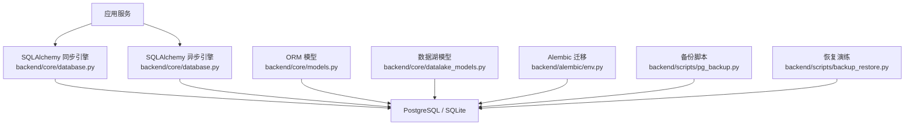
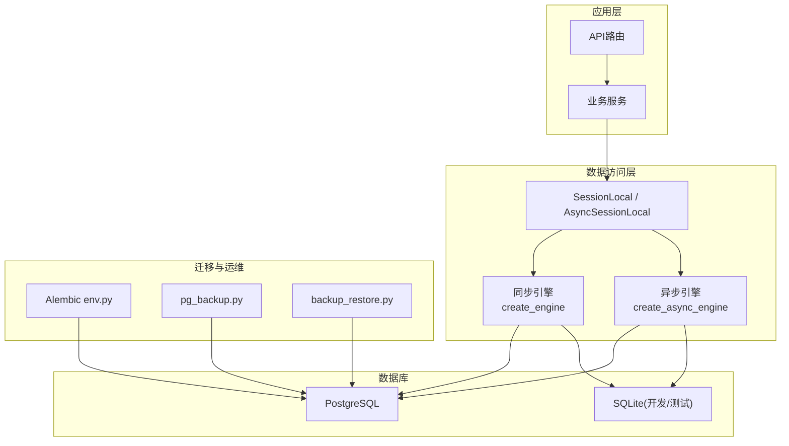
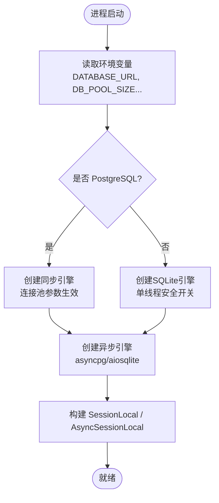
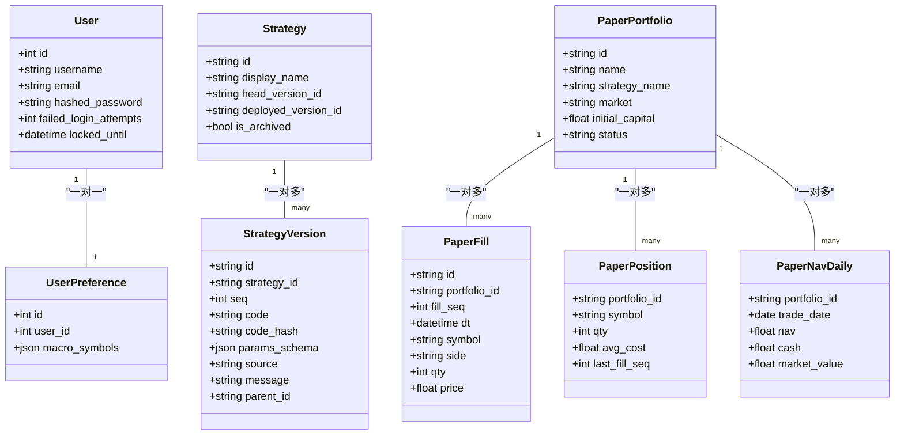
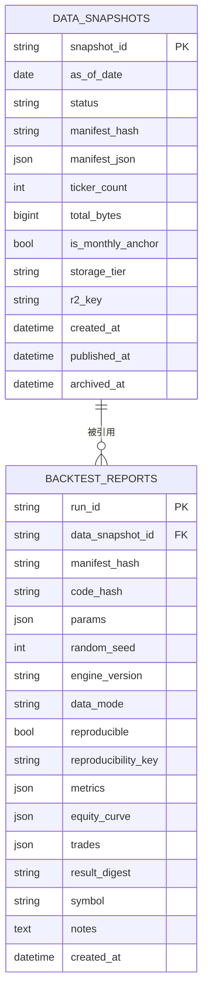
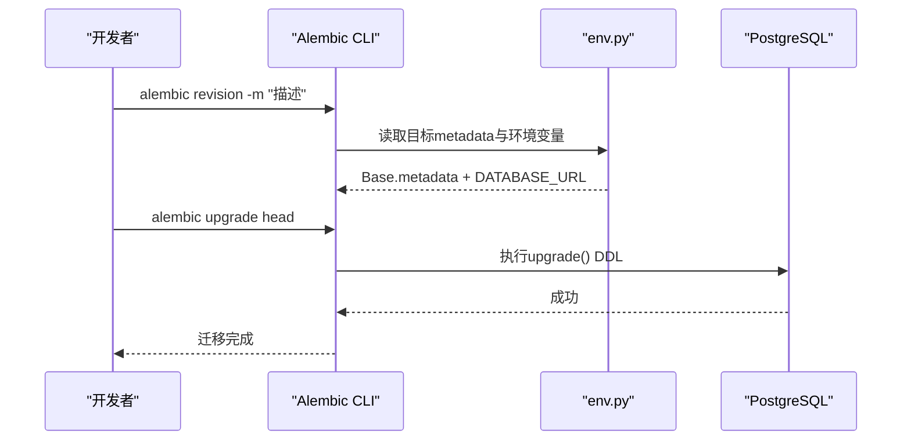
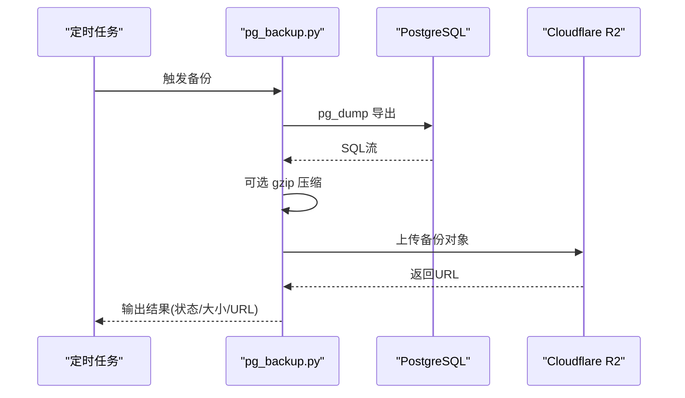
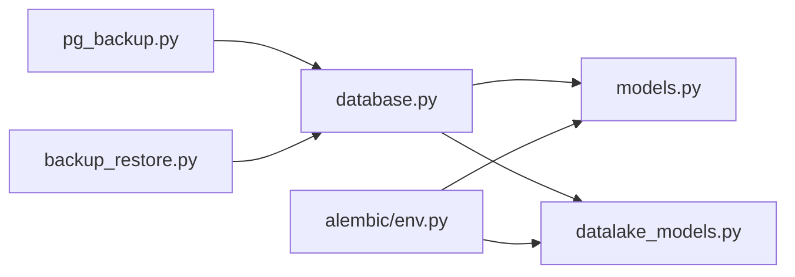

# 数据库设计与操作

<cite>
**本文引用的文件**
- [backend/core/database.py](file://backend/core/database.py)
- [backend/core/models.py](file://backend/core/models.py)
- [backend/core/datalake_models.py](file://backend/core/datalake_models.py)
- [backend/alembic/env.py](file://backend/alembic/env.py)
- [backend/alembic/script.py.mako](file://backend/alembic/script.py.mako)
- [backend/alembic/versions/ai04rag_add_rag_governance.py](file://backend/alembic/versions/ai04rag_add_rag_governance.py)
- [backend/alembic/versions/strat03a_add_strategy_version_tables.py](file://backend/alembic/versions/strat03a_add_strategy_version_tables.py)
- [backend/scripts/pg_backup.py](file://backend/scripts/pg_backup.py)
- [backend/scripts/backup_restore.py](file://backend/scripts/backup_restore.py)
- [backend/core/config.py](file://backend/core/config.py)
</cite>

## 目录
1. [简介](#简介)
2. [项目结构](#项目结构)
3. [核心组件](#核心组件)
4. [架构总览](#架构总览)
5. [详细组件分析](#详细组件分析)
6. [依赖关系分析](#依赖关系分析)
7. [性能与优化](#性能与优化)
8. [故障排查指南](#故障排查指南)
9. [结论](#结论)
10. [附录：常用操作示例](#附录：常用操作示例)

## 简介
本指南面向Quant Agent的数据库开发与运维，覆盖PostgreSQL架构、表结构设计、索引优化、SQLAlchemy ORM模型与关系映射、Alembic迁移管理、数据湖Parquet元数据存储、pgvector向量检索、备份恢复与连接池配置等主题。文档以仓库实际代码为依据，提供可操作的实践建议与可视化图示，帮助新开发者快速上手并高效维护系统。

## 项目结构
后端数据库相关能力主要分布在以下位置：
- 数据库引擎与会话：backend/core/database.py
- ORM模型定义（含向量字段）：backend/core/models.py
- 数据湖快照与回测报告模型：backend/core/datalake_models.py
- Alembic迁移环境及模板：backend/alembic/env.py、script.py.mako、versions/*
- 备份与恢复脚本：backend/scripts/pg_backup.py、backup_restore.py
- 全局配置校验（含DATABASE_URL强制校验）：backend/core/config.py

**图表来源**
- [backend/core/database.py:1-67](file://backend/core/database.py#L1-L67)
- [backend/core/models.py:1-495](file://backend/core/models.py#L1-L495)
- [backend/core/datalake_models.py:1-82](file://backend/core/datalake_models.py#L1-L82)
- [backend/alembic/env.py:1-80](file://backend/alembic/env.py#L1-L80)
- [backend/scripts/pg_backup.py:1-362](file://backend/scripts/pg_backup.py#L1-L362)
- [backend/scripts/backup_restore.py:1-355](file://backend/scripts/backup_restore.py#L1-L355)

**章节来源**
- [backend/core/database.py:1-67](file://backend/core/database.py#L1-L67)
- [backend/core/models.py:1-495](file://backend/core/models.py#L1-L495)
- [backend/core/datalake_models.py:1-82](file://backend/core/datalake_models.py#L1-L82)
- [backend/alembic/env.py:1-80](file://backend/alembic/env.py#L1-L80)
- [backend/scripts/pg_backup.py:1-362](file://backend/scripts/pg_backup.py#L1-L362)
- [backend/scripts/backup_restore.py:1-355](file://backend/scripts/backup_restore.py#L1-L355)
- [backend/core/config.py:1-134](file://backend/core/config.py#L1-L134)

## 核心组件
- 数据库连接与会话
  - 同步引擎：根据环境变量选择SQLite或PostgreSQL，配置连接池大小、溢出、超时、回收与健康检查。
  - 异步引擎：基于asyncpg/aiosqlite，复用相同池化参数，适用于高并发场景。
  - 会话工厂：提供同步get_db与异步get_async_db上下文管理器，确保资源释放。
- ORM模型与关系
  - 用户、订单、审计日志、策略版本、纸面组合等核心业务实体。
  - 向量字段：在PostgreSQL下使用pgvector类型；SQLite降级为二进制存储，便于开发测试。
  - 关系映射：一对多、一对一、级联删除等，支撑复杂业务查询。
- 数据湖元数据
  - 数据快照与回测报告持久化，绑定数据指纹与可复现性键，支持按日期与状态查询。
- 迁移管理
  - Alembic自动发现Base.metadata，从.env注入DATABASE_URL，支持离线/在线模式执行DDL。
- 备份与恢复
  - pg_dump导出、压缩、上传R2、清理过期本地备份；psql恢复流程与RTO验证。

**章节来源**
- [backend/core/database.py:1-67](file://backend/core/database.py#L1-L67)
- [backend/core/models.py:1-495](file://backend/core/models.py#L1-L495)
- [backend/core/datalake_models.py:1-82](file://backend/core/datalake_models.py#L1-L82)
- [backend/alembic/env.py:1-80](file://backend/alembic/env.py#L1-L80)
- [backend/scripts/pg_backup.py:1-362](file://backend/scripts/pg_backup.py#L1-L362)
- [backend/scripts/backup_restore.py:1-355](file://backend/scripts/backup_restore.py#L1-L355)

## 架构总览
下图展示应用层通过SQLAlchemy访问PostgreSQL/SQLite，ORM模型负责表结构与关系，Alembic负责版本演进，备份脚本保障数据安全。

**图表来源**
- [backend/core/database.py:1-67](file://backend/core/database.py#L1-L67)
- [backend/alembic/env.py:1-80](file://backend/alembic/env.py#L1-L80)
- [backend/scripts/pg_backup.py:1-362](file://backend/scripts/pg_backup.py#L1-L362)
- [backend/scripts/backup_restore.py:1-355](file://backend/scripts/backup_restore.py#L1-L355)

## 详细组件分析

### 数据库连接与连接池
- 同步引擎
  - 环境变量驱动：DATABASE_URL决定SQLite或PostgreSQL；PostgreSQL启用pool_size、max_overflow、pool_timeout、pool_recycle、pool_pre_ping。
  - 会话工厂：SessionLocal用于同步请求，get_db作为依赖注入上下文。
- 异步引擎
  - URL转换：将sqlite/postgresql前缀转换为aiosqlite/asyncpg；复用同步引擎的池化参数。
  - 异步会话：AsyncSessionLocal配合get_async_db，expire_on_commit=False避免重复加载。
- 配置校验
  - config.py强制要求DATABASE_URL非空且合法，防止带病启动。

**图表来源**
- [backend/core/database.py:1-67](file://backend/core/database.py#L1-L67)
- [backend/core/config.py:94-101](file://backend/core/config.py#L94-L101)

**章节来源**
- [backend/core/database.py:1-67](file://backend/core/database.py#L1-L67)
- [backend/core/config.py:1-134](file://backend/core/config.py#L1-L134)

### ORM模型与关系映射
- 核心实体
  - 用户、交易日志、选股订阅、保存的筛选条件、网页知识库、规则库、刷新令牌黑名单、订单、审计日志、客户端心跳、净值快照、策略与版本、纸面组合及其流水/持仓/日终净值、前端日志。
- 向量字段
  - 使用自定义Vector类型：PostgreSQL下为pgvector.sqlalchemy.Vector；SQLite降级为LargeBinary，便于跨环境兼容。
  - 建立HNSW向量索引，指定余弦距离运算类，提升相似度检索性能。
- 关系与约束
  - 一对一：User与UserPreference。
  - 一对多：Strategy与StrategyVersion、PaperPortfolio与Fills/Positions/NavDaily。
  - 唯一性与幂等：策略版本基于code_hash唯一索引，避免重复写入。
  - 时间戳与索引：广泛使用server_default=func.now()与索引优化查询。

**图表来源**
- [backend/core/models.py:37-124](file://backend/core/models.py#L37-L124)
- [backend/core/models.py:351-393](file://backend/core/models.py#L351-L393)
- [backend/core/models.py:401-478](file://backend/core/models.py#L401-L478)

**章节来源**
- [backend/core/models.py:1-495](file://backend/core/models.py#L1-L495)

### 数据湖Parquet元数据
- DataSnapshot
  - 记录每日快照的元数据：as_of_date、status、manifest_hash、manifest_json、ticker_count、total_bytes、storage_tier、r2_key、published_at、archived_at。
  - 索引：按status与published_at组合索引，加速发布态查询。
- BacktestReport
  - 绑定data_snapshot_id与manifest_hash，记录params、random_seed、engine_version、metrics、equity_curve、trades等，支持reproducibility_key定位可复现实验。
  - 索引：按reproducibility_key与created_at优化查询。

**图表来源**
- [backend/core/datalake_models.py:31-82](file://backend/core/datalake_models.py#L31-L82)

**章节来源**
- [backend/core/datalake_models.py:1-82](file://backend/core/datalake_models.py#L1-L82)

### Alembic迁移管理与版本控制
- 环境配置
  - env.py导入所有模型Base.metadata，从.env注入DATABASE_URL，支持offline/online两种运行模式。
  - script.py.mako提供标准迁移模板，包含upgrade/downgrade方法。
- 迁移示例
  - ai04rag_add_rag_governance.py：为webpage_knowledge_base增加category与embedding_model_version字段，并创建相应索引；downgrade对称删除。
  - strat03a_add_strategy_version_tables.py：创建strategies与strategy_versions表，建立唯一哈希索引与序列索引，保证幂等与顺序查询。

**图表来源**
- [backend/alembic/env.py:1-80](file://backend/alembic/env.py#L1-L80)
- [backend/alembic/script.py.mako:1-26](file://backend/alembic/script.py.mako#L1-L26)
- [backend/alembic/versions/ai04rag_add_rag_governance.py:1-55](file://backend/alembic/versions/ai04rag_add_rag_governance.py#L1-L55)
- [backend/alembic/versions/strat03a_add_strategy_version_tables.py:1-57](file://backend/alembic/versions/strat03a_add_strategy_version_tables.py#L1-L57)

**章节来源**
- [backend/alembic/env.py:1-80](file://backend/alembic/env.py#L1-L80)
- [backend/alembic/script.py.mako:1-26](file://backend/alembic/script.py.mako#L1-L26)
- [backend/alembic/versions/ai04rag_add_rag_governance.py:1-55](file://backend/alembic/versions/ai04rag_add_rag_governance.py#L1-L55)
- [backend/alembic/versions/strat03a_add_strategy_version_tables.py:1-57](file://backend/alembic/versions/strat03a_add_strategy_version_tables.py#L1-L57)

### 向量检索与全文搜索
- pgvector集成
  - models.py中定义Vector类型，PostgreSQL下使用pgvector原生类型；建立HNSW索引，指定余弦距离ops，提升相似度检索效率。
  - 适用场景：网页知识库与规则库的语义检索。
- 全文搜索
  - 当前仓库未直接实现pg_trgm扩展；如需文本模糊匹配，可在PostgreSQL启用pg_trgm并在相关列建立gin/trgm索引，结合%操作符进行相似度查询。
  - 建议在新增文本检索需求时，评估pg_trgm与向量检索的组合方案。

**章节来源**
- [backend/core/models.py:13-35](file://backend/core/models.py#L13-L35)
- [backend/core/models.py:199-256](file://backend/core/models.py#L199-L256)

### 备份与恢复
- 备份流程
  - pg_backup.py：解析DATABASE_URL，调用pg_dump导出，可选gzip压缩，上传至Cloudflare R2，清理本地过期备份。
  - 支持异步执行子进程以避免阻塞事件循环。
- 恢复流程
  - backup_restore.py：断开现有连接、重建数据库、导入SQL或解压后导入；统计耗时并校验RTO目标。
  - 同时提供Redis恢复与完整性验证功能。

**图表来源**
- [backend/scripts/pg_backup.py:49-140](file://backend/scripts/pg_backup.py#L49-L140)
- [backend/scripts/pg_backup.py:142-242](file://backend/scripts/pg_backup.py#L142-L242)
- [backend/scripts/pg_backup.py:244-321](file://backend/scripts/pg_backup.py#L244-L321)

**章节来源**
- [backend/scripts/pg_backup.py:1-362](file://backend/scripts/pg_backup.py#L1-L362)
- [backend/scripts/backup_restore.py:1-355](file://backend/scripts/backup_restore.py#L1-L355)

## 依赖关系分析
- 模块耦合
  - database.py为底层基础设施，被models.py与业务服务依赖。
  - models.py集中定义所有表结构，供Alembic与ORM查询使用。
  - datalake_models.py独立于业务模型，专注数据湖与回测报告。
  - alembic/env.py聚合Base.metadata并注入DATABASE_URL，驱动迁移。
  - 备份脚本与数据库强耦合，通过命令行工具与外部工具链交互。
- 外部依赖
  - pgvector（可选）：在PostgreSQL环境下启用向量类型与索引。
  - boto3（可选）：用于上传备份到R2。
  - 外部工具：pg_dump、psql、dropdb、createdb。

**图表来源**
- [backend/core/database.py:1-67](file://backend/core/database.py#L1-L67)
- [backend/core/models.py:1-495](file://backend/core/models.py#L1-L495)
- [backend/core/datalake_models.py:1-82](file://backend/core/datalake_models.py#L1-L82)
- [backend/alembic/env.py:1-80](file://backend/alembic/env.py#L1-L80)
- [backend/scripts/pg_backup.py:1-362](file://backend/scripts/pg_backup.py#L1-L362)
- [backend/scripts/backup_restore.py:1-355](file://backend/scripts/backup_restore.py#L1-L355)

**章节来源**
- [backend/core/database.py:1-67](file://backend/core/database.py#L1-L67)
- [backend/core/models.py:1-495](file://backend/core/models.py#L1-L495)
- [backend/core/datalake_models.py:1-82](file://backend/core/datalake_models.py#L1-L82)
- [backend/alembic/env.py:1-80](file://backend/alembic/env.py#L1-L80)
- [backend/scripts/pg_backup.py:1-362](file://backend/scripts/pg_backup.py#L1-L362)
- [backend/scripts/backup_restore.py:1-355](file://backend/scripts/backup_restore.py#L1-L355)

## 性能与优化
- 连接池调优
  - 根据并发量调整POOL_SIZE、MAX_OVERFLOW、POOL_TIMEOUT；启用pool_recycle与pool_pre_ping避免长连接失效。
- 索引设计
  - 主键与外键：合理设置主键与外键，利用自增或UUID提升写入性能。
  - 高频查询列：为ticker、symbol、market、created_at等建立索引；组合索引如idx_nav_snapshot_market_time。
  - 向量索引：HNSW索引参数m与ef_construction平衡召回率与内存占用。
- 查询优化
  - 避免SELECT *，仅选取必要字段；使用分页与过滤减少数据传输。
  - 对JSON字段进行适当拆分或使用GIN索引（PostgreSQL）。
  - 批量写入：使用bulk_insert_mappings或executemany减少往返开销。
- 事务与一致性
  - 短事务原则：尽量缩小事务范围，降低锁竞争。
  - 幂等写入：基于唯一约束（如code_hash）避免重复数据。
- 监控与可观测性
  - 慢请求与卡顿日志：performance_logs表记录慢请求与事件循环阻塞，辅助定位瓶颈。
  - 指标采集：结合Prometheus/Grafana监控数据库连接数、QPS、延迟。

[本节为通用指导，不直接分析具体文件]

## 故障排查指南
- 常见错误
  - 连接失败：检查DATABASE_URL格式与网络连通性；确认PostgreSQL服务状态与端口。
  - 迁移失败：核对env.py中的DATABASE_URL与Base.metadata导入；查看迁移脚本的upgrade/downgrade逻辑。
  - 备份失败：确认pg_dump/psql可用；检查R2配置与权限；查看日志中的stderr输出。
  - 恢复失败：确认目标数据库已清空或可覆盖；检查SQL语法与编码问题。
- 诊断步骤
  - 使用alembic current/heads检查迁移状态。
  - 通过pg_stat_activity观察活跃连接与锁等待。
  - 使用EXPLAIN ANALYZE分析慢查询计划。
  - 校验备份文件完整性（gzip头部校验），必要时重新生成。

**章节来源**
- [backend/alembic/env.py:1-80](file://backend/alembic/env.py#L1-L80)
- [backend/scripts/pg_backup.py:142-242](file://backend/scripts/pg_backup.py#L142-L242)
- [backend/scripts/backup_restore.py:44-159](file://backend/scripts/backup_restore.py#L44-L159)

## 结论
本项目采用SQLAlchemy+Alembic的标准化数据库方案，结合pgvector与HNSW索引满足AI检索需求，数据湖元数据保障回测可复现性，备份脚本提供可靠的灾备能力。通过合理的连接池配置、索引设计与事务管理，可在高并发场景下保持稳定的数据库性能。建议持续完善pg_trgm全文搜索能力，并结合监控与压测不断优化关键路径。

[本节为总结，不直接分析具体文件]

## 附录：常用操作示例
以下为常见数据库操作的思路与参考路径，具体实现请结合业务上下文与仓库代码：
- 创建与执行迁移
  - 生成迁移：参考alembic/env.py与script.py.mako模板。
  - 执行迁移：参考versions下的迁移脚本结构。
- 插入与更新
  - 使用ORM模型进行插入与更新，注意事务边界与异常处理。
- 复杂查询
  - 组合过滤与排序：利用索引列进行高效查询。
  - JSON字段查询：在PostgreSQL中使用JSONB操作符与GIN索引。
- 事务处理
  - 短事务、重试机制与幂等写入，确保数据一致性。
- 批量操作
  - 批量插入与更新，减少往返次数，提高吞吐。
- 向量检索
  - 使用pgvector的相似度函数与HNSW索引进行近似最近邻搜索。
- 备份与恢复
  - 定期执行pg_backup.py进行备份与上传；使用backup_restore.py进行恢复演练与RTO验证。

**章节来源**
- [backend/alembic/env.py:1-80](file://backend/alembic/env.py#L1-L80)
- [backend/alembic/versions/ai04rag_add_rag_governance.py:1-55](file://backend/alembic/versions/ai04rag_add_rag_governance.py#L1-L55)
- [backend/alembic/versions/strat03a_add_strategy_version_tables.py:1-57](file://backend/alembic/versions/strat03a_add_strategy_version_tables.py#L1-L57)
- [backend/scripts/pg_backup.py:1-362](file://backend/scripts/pg_backup.py#L1-L362)
- [backend/scripts/backup_restore.py:1-355](file://backend/scripts/backup_restore.py#L1-L355)
