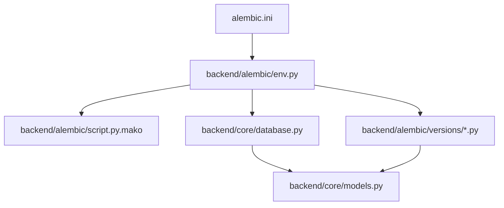
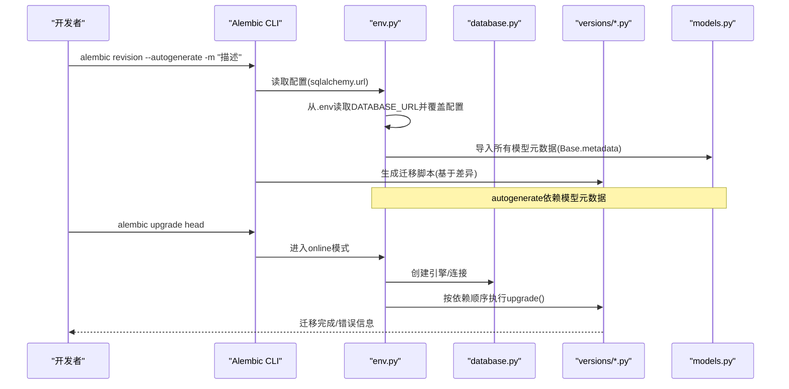
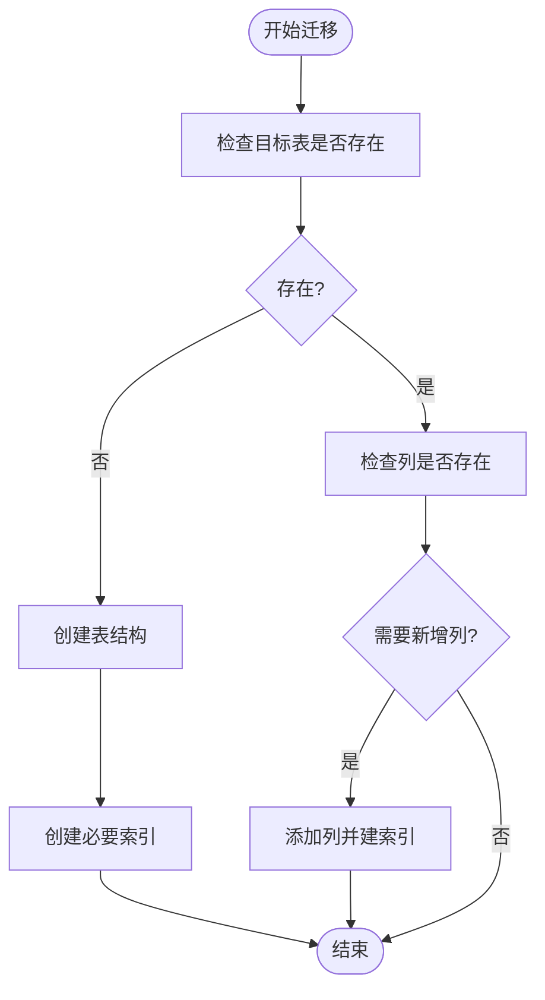
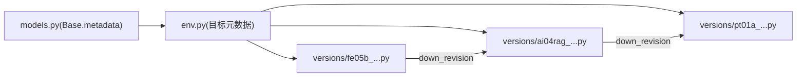

# 数据库迁移管理

<cite>
**本文引用的文件**
- [alembic.ini](file://alembic.ini)
- [backend/alembic/env.py](file://backend/alembic/env.py)
- [backend/alembic/script.py.mako](file://backend/alembic/script.py.mako)
- [backend/core/database.py](file://backend/core/database.py)
- [backend/core/models.py](file://backend/core/models.py)
- [backend/alembic/versions/ai04rag_add_rag_governance.py](file://backend/alembic/versions/ai04rag_add_rag_governance.py)
- [backend/alembic/versions/fe05b_add_frontend_logs_table.py](file://backend/alembic/versions/fe05b_add_frontend_logs_table.py)
- [backend/alembic/versions/pt01a_add_paper_portfolio_tables.py](file://backend/alembic/versions/pt01a_add_paper_portfolio_tables.py)
</cite>

## 目录
1. [简介](#简介)
2. [项目结构](#项目结构)
3. [核心组件](#核心组件)
4. [架构总览](#架构总览)
5. [详细组件分析](#详细组件分析)
6. [依赖关系分析](#依赖关系分析)
7. [性能与可维护性考量](#性能与可维护性考量)
8. [故障排查指南](#故障排查指南)
9. [结论](#结论)
10. [附录：常见迁移场景与最佳实践](#附录：常见迁移场景与最佳实践)

## 简介
本指南面向Quant Agent项目的数据库版本管理与迁移流程，聚焦Alembic工具在工程中的配置、使用与团队协作规范。内容涵盖迁移脚本生成、版本控制、依赖关系管理、数据变更与表结构修改、索引优化、回滚策略、环境隔离、生产部署流程、冲突解决、分支协作、监控与自动化测试等，帮助团队建立标准化、可审计、可回滚的数据库演进体系。

## 项目结构
后端采用Alembic进行数据库迁移，核心目录与文件如下：
- alembic.ini：Alembic全局配置（脚本目录、模板、日志级别等）
- backend/alembic/env.py：迁移运行环境配置（加载环境变量、导入模型元数据、在线/离线模式）
- backend/alembic/script.py.mako：迁移脚本模板（revision标识、upgrade/downgrade骨架）
- backend/alembic/versions/*：具体迁移脚本集合
- backend/core/database.py：SQLAlchemy引擎与连接池配置（同步/异步），以及Base定义
- backend/core/models.py：所有ORM模型定义（供autogenerate识别）

图表来源
- [alembic.ini:1-55](file://alembic.ini#L1-L55)
- [backend/alembic/env.py:1-80](file://backend/alembic/env.py#L1-L80)
- [backend/alembic/script.py.mako:1-26](file://backend/alembic/script.py.mako#L1-L26)
- [backend/core/database.py:1-67](file://backend/core/database.py#L1-L67)
- [backend/core/models.py:1-495](file://backend/core/models.py#L1-L495)

章节来源
- [alembic.ini:1-55](file://alembic.ini#L1-L55)
- [backend/alembic/env.py:1-80](file://backend/alembic/env.py#L1-L80)
- [backend/alembic/script.py.mako:1-26](file://backend/alembic/script.py.mako#L1-L26)
- [backend/core/database.py:1-67](file://backend/core/database.py#L1-L67)
- [backend/core/models.py:1-495](file://backend/core/models.py#L1-L495)

## 核心组件
- Alembic配置与运行环境
  - alembic.ini：指定脚本目录为backend/alembic，设置文件模板命名规则、时区UTC、日志级别等。
  - env.py：从.env读取DATABASE_URL并注入到Alembic配置；导入所有模型元数据以支持autogenerate；提供offline/online两种执行路径。
- 数据库连接与引擎
  - database.py：根据DATABASE_URL前缀选择SQLite或PostgreSQL/MySQL连接；配置连接池参数（DB_POOL_SIZE、DB_MAX_OVERFLOW、DB_POOL_TIMEOUT）；提供同步与异步Session工厂。
- ORM模型
  - models.py：集中定义所有表结构，作为Alembic autogenerate的“目标元数据”。

章节来源
- [alembic.ini:1-55](file://alembic.ini#L1-L55)
- [backend/alembic/env.py:1-80](file://backend/alembic/env.py#L1-L80)
- [backend/core/database.py:1-67](file://backend/core/database.py#L1-L67)
- [backend/core/models.py:1-495](file://backend/core/models.py#L1-L495)

## 架构总览
下图展示了从命令行触发迁移到实际执行DDL的调用链与环境变量注入过程。

图表来源
- [backend/alembic/env.py:37-79](file://backend/alembic/env.py#L37-L79)
- [backend/core/database.py:7-25](file://backend/core/database.py#L7-L25)
- [backend/alembic/script.py.mako:13-25](file://backend/alembic/script.py.mako#L13-L25)

## 详细组件分析

### Alembic环境与模板
- env.py关键点
  - 通过dotenv加载.env，动态设置sqlalchemy.url，确保不同环境使用不同数据库。
  - 导入models.py中定义的Base.metadata，使autogenerate能感知全部表结构。
  - 提供run_migrations_offline与run_migrations_online，分别用于仅生成SQL与实际执行DDL。
- script.py.mako模板
  - 自动生成revision、down_revision、branch_labels、depends_on字段，便于版本链管理。
  - 提供upgrade/downgrade函数骨架，便于编写幂等的迁移逻辑。

章节来源
- [backend/alembic/env.py:17-41](file://backend/alembic/env.py#L17-L41)
- [backend/alembic/env.py:44-79](file://backend/alembic/env.py#L44-L79)
- [backend/alembic/script.py.mako:1-26](file://backend/alembic/script.py.mako#L1-L26)

### 数据库连接与连接池
- 连接URL与环境变量
  - 优先读取DATABASE_URL，未配置则降级为本地SQLite。
  - 非SQLite时启用连接池参数：DB_POOL_SIZE、DB_MAX_OVERFLOW、DB_POOL_TIMEOUT，并开启pool_pre_ping保障连接健康。
- 同步与异步引擎
  - 提供同步engine与AsyncEngine，适配高并发异步场景。
  - SQLite特殊处理check_same_thread=False，避免多线程问题。

章节来源
- [backend/core/database.py:7-25](file://backend/core/database.py#L7-L25)
- [backend/core/database.py:43-61](file://backend/core/database.py#L43-L61)

### 迁移脚本示例与模式
- 添加新表与索引（前端日志表）
  - 使用op.create_table创建表，定义主键、外键、默认值、时间戳等。
  - 使用op.create_index创建常用查询列的索引，提升检索性能。
  - downgrade中按相反顺序删除索引与表，保证可回滚。
- 条件式增量字段与索引（RAG治理字段）
  - 通过inspector检查表与列是否存在，实现幂等迁移，兼容多环境（如SQLite）。
  - 新增字段后创建对应索引，并在downgrade中移除。
- 复杂业务表族（纸面组合系统）
  - 同时创建主表、流水表、投影表、日终净值表，并通过唯一索引约束保证数据一致性。
  - 使用外键关联与复合主键设计，体现SSOT（单一事实源）与不可变记录的设计思想。

图表来源
- [backend/alembic/versions/ai04rag_add_rag_governance.py:19-55](file://backend/alembic/versions/ai04rag_add_rag_governance.py#L19-L55)
- [backend/alembic/versions/fe05b_add_frontend_logs_table.py:22-52](file://backend/alembic/versions/fe05b_add_frontend_logs_table.py#L22-L52)
- [backend/alembic/versions/pt01a_add_paper_portfolio_tables.py:19-90](file://backend/alembic/versions/pt01a_add_paper_portfolio_tables.py#L19-L90)

章节来源
- [backend/alembic/versions/fe05b_add_frontend_logs_table.py:1-52](file://backend/alembic/versions/fe05b_add_frontend_logs_table.py#L1-L52)
- [backend/alembic/versions/ai04rag_add_rag_governance.py:1-55](file://backend/alembic/versions/ai04rag_add_rag_governance.py#L1-L55)
- [backend/alembic/versions/pt01a_add_paper_portfolio_tables.py:1-90](file://backend/alembic/versions/pt01a_add_paper_portfolio_tables.py#L1-L90)

## 依赖关系分析
- 版本链与分支
  - 每个迁移脚本包含revision与down_revision，形成线性版本链；必要时可通过branch_labels与depends_on表达分支与依赖。
- 模型与迁移的一致性
  - autogenerate依赖models.py中的Base.metadata；任何模型变更应通过生成迁移脚本固化，避免手工维护不一致。
- 环境隔离
  - DATABASE_URL由.env注入，不同环境（开发/测试/生产）使用不同数据库实例，避免相互影响。

图表来源
- [backend/core/models.py:1-495](file://backend/core/models.py#L1-L495)
- [backend/alembic/env.py:19-41](file://backend/alembic/env.py#L19-L41)
- [backend/alembic/versions/fe05b_add_frontend_logs_table.py:15-19](file://backend/alembic/versions/fe05b_add_frontend_logs_table.py#L15-L19)
- [backend/alembic/versions/ai04rag_add_rag_governance.py:12-16](file://backend/alembic/versions/ai04rag_add_rag_governance.py#L12-L16)
- [backend/alembic/versions/pt01a_add_paper_portfolio_tables.py:12-16](file://backend/alembic/versions/pt01a_add_paper_portfolio_tables.py#L12-L16)

章节来源
- [backend/alembic/versions/fe05b_add_frontend_logs_table.py:15-19](file://backend/alembic/versions/fe05b_add_frontend_logs_table.py#L15-L19)
- [backend/alembic/versions/ai04rag_add_rag_governance.py:12-16](file://backend/alembic/versions/ai04rag_add_rag_governance.py#L12-L16)
- [backend/alembic/versions/pt01a_add_paper_portfolio_tables.py:12-16](file://backend/alembic/versions/pt01a_add_paper_portfolio_tables.py#L12-L16)

## 性能与可维护性考量
- 连接池与超时
  - 非SQLite环境建议合理设置DB_POOL_SIZE、DB_MAX_OVERFLOW、DB_POOL_TIMEOUT，避免连接耗尽与阻塞。
  - 开启pool_pre_ping减少死连接风险。
- 索引策略
  - 对高频查询列建立索引（如timestamp、level、user_id等），但避免过度索引导致写入性能下降。
  - 向量检索场景可使用HNSW索引（见models.py中的向量索引定义），平衡召回率与内存占用。
- 幂等迁移
  - 使用inspector检查表/列存在性，确保迁移在不同环境重复执行不报错。
- 大表操作
  - 对大表增删列或重建索引时，考虑分时段执行或使用在线DDL工具，降低锁表时间。

[本节为通用指导，无需特定文件引用]

## 故障排查指南
- 常见问题定位
  - 无法连接数据库：检查.env中DATABASE_URL是否正确，确认网络与凭据。
  - autogenerate未检测到变更：确认已导入models.py中的Base.metadata，且模型定义已更新。
  - 迁移失败：查看alembic日志级别（alembic.ini中logger_alembic设为INFO），定位具体SQL错误。
- 回滚策略
  - 使用alembic downgrade回退到上一版本；对于破坏性变更，先在测试环境验证回滚脚本。
  - 对数据量大的表，谨慎执行drop/recreate索引或列，建议在低峰期执行并备份数据。
- 环境差异
  - SQLite与PG/MySQL行为差异：某些DDL不支持或语法不同，需在迁移中使用条件判断以保证跨库兼容。

章节来源
- [alembic.ini:22-55](file://alembic.ini#L22-L55)
- [backend/alembic/env.py:37-79](file://backend/alembic/env.py#L37-L79)

## 结论
本项目通过Alembic实现了标准化的数据库版本管理：以.env注入数据库连接、以models.py作为元数据来源、以versions下的迁移脚本固化变更。结合幂等迁移、索引优化、连接池调优与回滚策略，可在多环境中安全演进数据库结构。建议团队遵循本指南的流程与最佳实践，确保数据库变更的可追溯、可回滚与可测试。

[本节为总结性内容，无需特定文件引用]

## 附录：常见迁移场景与最佳实践

- 添加新表
  - 步骤：更新models.py -> alembic revision --autogenerate -m "描述" -> 审查生成的迁移脚本 -> 在测试环境执行upgrade -> 验证数据与索引 -> 提交代码。
  - 参考：frontend_logs表的创建与索引。
  - 章节来源
    - [backend/alembic/versions/fe05b_add_frontend_logs_table.py:22-52](file://backend/alembic/versions/fe05b_add_frontend_logs_table.py#L22-L52)

- 修改字段类型
  - 步骤：在models.py中调整字段类型 -> 生成迁移 -> 评估数据转换成本 -> 在测试环境验证 -> 生产低峰期执行。
  - 注意：大表类型变更需考虑锁表时间与数据一致性。

- 数据迁移
  - 步骤：在upgrade中编写数据清洗/迁移逻辑 -> 在downgrade中提供反向逻辑 -> 分批处理大数据集 -> 记录迁移进度与异常。
  - 建议：对关键数据迁移增加事务与重试机制，确保一致性。

- 索引优化
  - 步骤：识别慢查询 -> 在迁移中添加合适索引 -> 压测验证 -> 监控执行计划。
  - 参考：前端日志表的多列索引、RAG知识库的HNSW向量索引。
  - 章节来源
    - [backend/alembic/versions/fe05b_add_frontend_logs_table.py:40-43](file://backend/alembic/versions/fe05b_add_frontend_logs_table.py#L40-L43)
    - [backend/core/models.py:219-231](file://backend/core/models.py#L219-L231)

- 迁移回滚策略
  - 原则：每个upgrade必须有对应的downgrade；对破坏性变更先备份数据；在生产执行前在预发环境演练。
  - 命令：alembic downgrade -1 / alembic downgrade <rev>。

- 环境隔离
  - 通过.env区分DATABASE_URL；CI/CD中为不同环境注入不同数据库连接；禁止共享数据库实例。

- 生产环境部署流程
  - 步骤：合并迁移脚本到主干 -> CI自动运行单元测试与迁移脚本校验 -> 预发环境执行upgrade并验证 -> 生产窗口执行upgrade并监控 -> 回滚预案准备。

- 冲突解决与分支管理
  - 冲突：当多人并行修改模型时，可能出现版本链冲突。建议先rebase主干，再生成迁移，手动调整down_revision与分支标签。
  - 协作：迁移脚本必须经过Code Review；重大变更需附带数据迁移方案与回滚计划。

- 监控与自动化测试
  - 监控：记录迁移执行耗时、错误率；对关键表变更设置告警。
  - 测试：在测试数据库上执行完整迁移链路；对数据迁移编写断言用例；对索引变更执行EXPLAIN验证。

[本节为通用指导，无需特定文件引用]
