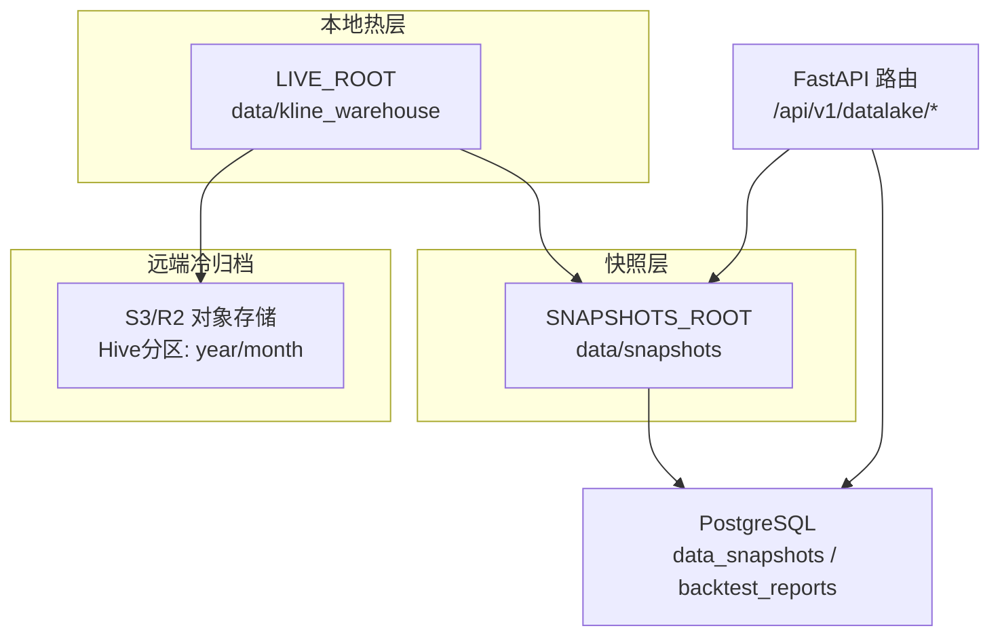
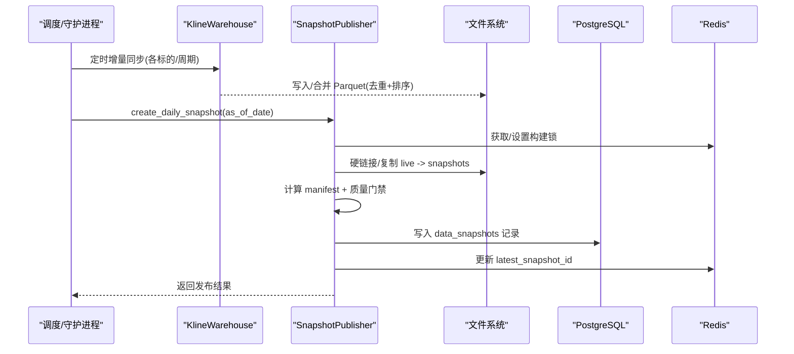
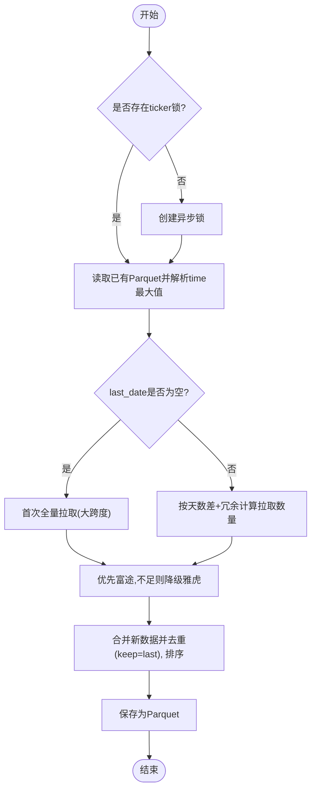
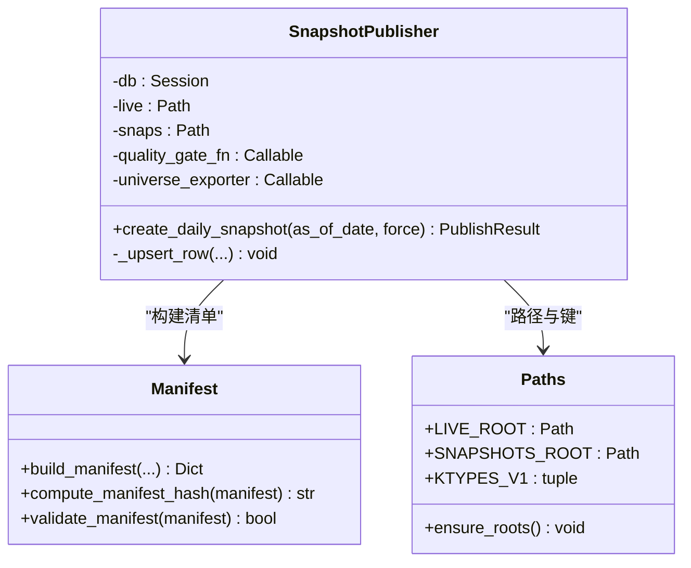
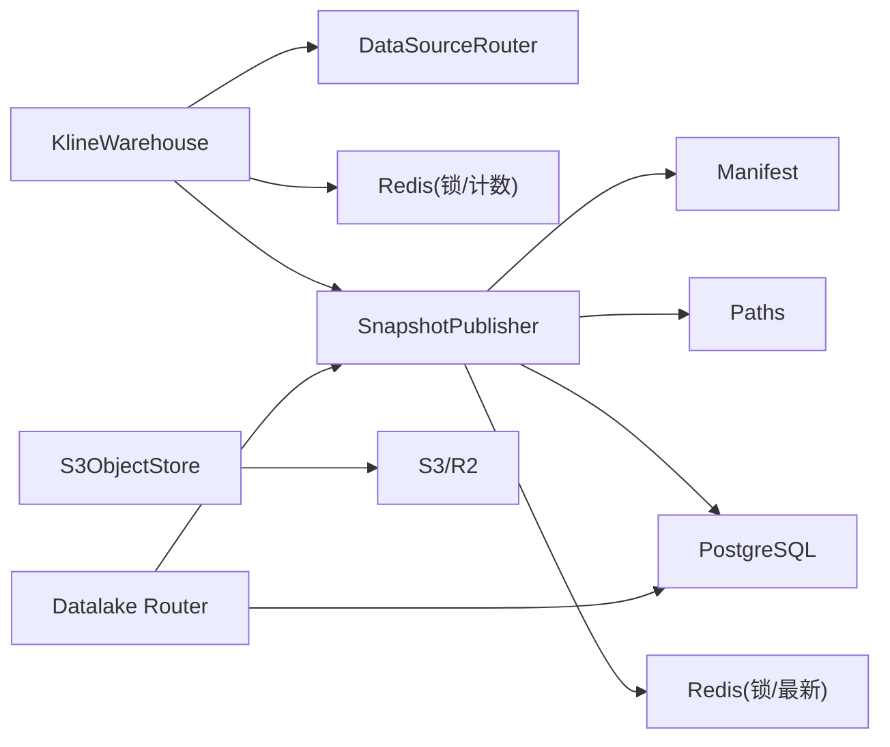

# 数据湖存储设计

<cite>
**本文引用的文件**
- [backend/services/datalake/kline_warehouse.py](file://backend/services/datalake/kline_warehouse.py)
- [backend/services/datalake/snapshot_publisher.py](file://backend/services/datalake/snapshot_publisher.py)
- [backend/core/datalake_models.py](file://backend/core/datalake_models.py)
- [backend/services/datalake/manifest.py](file://backend/services/datalake/manifest.py)
- [backend/services/datalake/paths.py](file://backend/services/datalake/paths.py)
- [backend/services/datalake/object_store.py](file://backend/services/datalake/object_store.py)
- [backend/routers/datalake.py](file://backend/routers/datalake.py)
</cite>

## 目录
1. [简介](#简介)
2. [项目结构](#项目结构)
3. [核心组件](#核心组件)
4. [架构总览](#架构总览)
5. [详细组件分析](#详细组件分析)
6. [依赖关系分析](#依赖关系分析)
7. [性能考量](#性能考量)
8. [故障排查指南](#故障排查指南)
9. [结论](#结论)
10. [附录](#附录)

## 简介
本文件面向数据工程师，系统化阐述 Quant Agent 的数据湖存储设计：以 Parquet 列式存储为核心的 K 线数据仓库、快照发布与版本化、对象存储冷归档、数据清单与元数据管理、并发与一致性控制、以及数据治理策略（质量检查、生命周期、归档清理）。文档同时提供目录结构、命名规范、路径规划与读写查询优化建议。

## 项目结构
数据湖相关代码集中在 backend/services/datalake 与 backend/core、backend/routers 中，配合 data 目录下的本地热层与快照目录。关键目录约定由 paths.py 统一维护，K 线数仓位于 data/kline_warehouse，快照位于 data/snapshots。

图表来源
- [backend/services/datalake/paths.py:10-13](file://backend/services/datalake/paths.py#L10-L13)
- [backend/routers/datalake.py:61-138](file://backend/routers/datalake.py#L61-L138)
- [backend/services/datalake/object_store.py:83-165](file://backend/services/datalake/object_store.py#L83-L165)

章节来源
- [backend/services/datalake/paths.py:1-43](file://backend/services/datalake/paths.py#L1-L43)
- [backend/routers/datalake.py:1-138](file://backend/routers/datalake.py#L1-L138)

## 核心组件
- K 线数仓（KlineWarehouse）：本地 Parquet 增量更新、按周期分目录、线程池非阻塞读取、守护进程定时同步与快照触发。
- 快照发布器（SnapshotPublisher）：从 live 层复制/硬链接到 snapshots，生成 manifest.json，写入数据库记录，Redis 并发锁与最新快照标记。
- 清单与校验（manifest）：确定性 JSON 序列化与哈希，保证不可变性与可验证性。
- 路径与命名（paths）：统一 LIVE/SNAPSHOTS 根路径、周期枚举、文件名与标的互转、Redis 键约定。
- 对象存储冷归档（S3ObjectStore）：基于 PyArrow S3FileSystem 的 Hive 分区直写/读回，仅归档超过一年的冷数据。
- ORM 模型（datalake_models）：data_snapshots 与 backtest_reports 表结构，支撑版本化与回测可复现性。
- 数据湖 API（routers/datalake）：列出/获取快照、重建快照、执行保留策略等 REST 接口。

章节来源
- [backend/services/datalake/kline_warehouse.py:16-258](file://backend/services/datalake/kline_warehouse.py#L16-L258)
- [backend/services/datalake/snapshot_publisher.py:91-302](file://backend/services/datalake/snapshot_publisher.py#L91-L302)
- [backend/services/datalake/manifest.py:16-78](file://backend/services/datalake/manifest.py#L16-L78)
- [backend/services/datalake/paths.py:1-43](file://backend/services/datalake/paths.py#L1-L43)
- [backend/services/datalake/object_store.py:32-177](file://backend/services/datalake/object_store.py#L32-L177)
- [backend/core/datalake_models.py:31-82](file://backend/core/datalake_models.py#L31-L82)
- [backend/routers/datalake.py:61-138](file://backend/routers/datalake.py#L61-L138)

## 架构总览
整体采用“热层 Parquet + 快照版本化 + 冷归档”的分层架构：
- 热层：按 K 线周期分目录存放标的 Parquet 文件，支持高吞吐增量追加与去重覆盖。
- 快照层：每日发布不可变快照，包含文件清单、质量门禁、侧车文件（如 universe），并持久化至数据库。
- 冷归档：将一年前的历史数据按 year/month 分区写入 S3/R2，降低本地存储成本。
- 并发与一致性：通过 Redis 分布式锁避免重复构建；manifest_hash 确保数据指纹一致；幂等重建。

图表来源
- [backend/services/datalake/kline_warehouse.py:175-248](file://backend/services/datalake/kline_warehouse.py#L175-L248)
- [backend/services/datalake/snapshot_publisher.py:119-250](file://backend/services/datalake/snapshot_publisher.py#L119-L250)
- [backend/core/datalake_models.py:31-50](file://backend/core/datalake_models.py#L31-L50)
- [backend/services/datalake/paths.py:15-18](file://backend/services/datalake/paths.py#L15-L18)

## 详细组件分析

### K 线数仓（KlineWarehouse）
- 存储格式与优势：使用 Parquet 列式存储，结合 pyarrow 引擎进行高效读取；按 time 排序后取尾 N 条，满足回测快速加载。
- 分区与命名：按 K 线周期（如 K_DAY、K_60M）分目录；标的名中的点/斜杠替换为下划线，扩展名为 .parquet。
- 增量更新：首次全量拉取，后续根据 last_date 计算天数差并带冗余窗口拉取；优先富途高质量前复权，不足时降级雅虎财经兜底。
- 并发控制：每个 ticker 持有 asyncio.Lock，避免同标的并发写入冲突。
- 守护任务：凌晨定时遍历监控标的与默认标的，按周期增量同步；成功后触发日快照发布与保留策略。

图表来源
- [backend/services/datalake/kline_warehouse.py:55-173](file://backend/services/datalake/kline_warehouse.py#L55-L173)

章节来源
- [backend/services/datalake/kline_warehouse.py:16-258](file://backend/services/datalake/kline_warehouse.py#L16-L258)

### 快照发布器（SnapshotPublisher）
- 幂等与并发：按日期生成 snapshot_id，若已 published 且未强制重建则跳过；使用 Redis 分布式锁防止重复构建。
- 文件复制：优先硬链接，失败回退 copy2；记录 copy_mode（hardlink/copy2/mixed）。
- 清单生成：收集文件元信息（路径、大小、时间范围、行数），构建 manifest.json 并计算 manifest_hash。
- 质量门禁：可注入自定义质量门控函数，默认放行；失败则记录 failed 状态。
- 只读保护：尽力而为对快照文件设置为只读权限。
- 元数据持久化：写入 data_snapshots，更新 Redis 最新快照键，发布指标上报。

图表来源
- [backend/services/datalake/snapshot_publisher.py:91-302](file://backend/services/datalake/snapshot_publisher.py#L91-L302)
- [backend/services/datalake/manifest.py:16-78](file://backend/services/datalake/manifest.py#L16-L78)
- [backend/services/datalake/paths.py:10-18](file://backend/services/datalake/paths.py#L10-L18)

章节来源
- [backend/services/datalake/snapshot_publisher.py:91-302](file://backend/services/datalake/snapshot_publisher.py#L91-L302)
- [backend/services/datalake/manifest.py:16-78](file://backend/services/datalake/manifest.py#L16-L78)
- [backend/services/datalake/paths.py:10-18](file://backend/services/datalake/paths.py#L10-L18)

### 清单与校验（Manifest）
- 确定性序列化：sort_keys 与紧凑分隔符，日期转为 ISO 字符串，保证跨平台一致。
- 指纹计算：排除 manifest_hash 字段后对主体 JSON 计算 sha256，作为数据指纹。
- 校验：支持兼容 “sha256:...” 前缀，缺失或错误则判定无效。

章节来源
- [backend/services/datalake/manifest.py:16-78](file://backend/services/datalake/manifest.py#L16-L78)

### 路径与命名（Paths）
- 根路径：LIVE_ROOT 指向 kline_warehouse，SNAPSHOTS_ROOT 指向 snapshots，可通过环境变量覆盖。
- 周期枚举：KTYPES_V1 = ("K_DAY", "K_60M")。
- 键约定：latest_snapshot_id、building、创建锁前缀、保留锁键。
- 命名转换：ticker_to_filename 与 filename_to_ticker 实现安全文件名与原始标的互转。

章节来源
- [backend/services/datalake/paths.py:1-43](file://backend/services/datalake/paths.py#L1-L43)

### 对象存储冷归档（S3ObjectStore）
- 配置：endpoint/bucket/credentials/region/prefix，未配置时优雅降级为空操作。
- 写入：过滤出超过一年的冷数据，添加 year/month 分区列，通过 PyArrow dataset 直写到 S3/R2。
- 读取：按 Hive 分区读取最近 N 天数据，返回 DataFrame。
- 适用场景：长期历史数据的低成本归档与回溯。

章节来源
- [backend/services/datalake/object_store.py:32-177](file://backend/services/datalake/object_store.py#L32-L177)

### 数据清单与版本化（ORM 模型）
- data_snapshots：记录快照 ID、as_of_date、status、manifest_hash、manifest_json、ticker_count、total_bytes、月度锚点、存储层级、R2 键、发布时间、归档时间。
- backtest_reports：绑定数据快照、代码哈希、参数、随机种子、引擎版本、可复现键、指标、权益曲线、交易明细等，用于回测可复现性。

章节来源
- [backend/core/datalake_models.py:31-82](file://backend/core/datalake_models.py#L31-L82)

### 数据湖 API（路由）
- GET /api/v1/datalake/snapshots：按状态/层级分页列出快照。
- GET /api/v1/datalake/snapshots/latest：获取最新 published 快照，附带年龄与陈旧告警。
- GET /api/v1/datalake/snapshots/{snapshot_id}：获取指定快照详情与清单。
- POST /api/v1/datalake/snapshots/rebuild：重建指定日期快照（支持强制）。
- POST /api/v1/datalake/snapshots/retention/run：执行保留策略。

章节来源
- [backend/routers/datalake.py:61-138](file://backend/routers/datalake.py#L61-L138)

## 依赖关系分析
- KlineWarehouse 依赖 DataSourceRouter（富途/雅虎）进行增量拉取，依赖 Redis 分布式锁进行守护任务协调，最终触发 SnapshotPublisher。
- SnapshotPublisher 依赖 manifest 工具生成清单，依赖 paths 确定路径与键，依赖数据库写入元数据，依赖 Redis 进行并发控制与最新快照标记。
- S3ObjectStore 独立于热层，仅在配置可用时生效，通过 PyArrow 直接对接 S3/R2。
- routers/datalake 暴露对外接口，组合 Publisher、Reader、Retention 能力。

图表来源
- [backend/services/datalake/kline_warehouse.py:86-149](file://backend/services/datalake/kline_warehouse.py#L86-L149)
- [backend/services/datalake/snapshot_publisher.py:119-250](file://backend/services/datalake/snapshot_publisher.py#L119-L250)
- [backend/services/datalake/object_store.py:83-165](file://backend/services/datalake/object_store.py#L83-L165)
- [backend/routers/datalake.py:61-138](file://backend/routers/datalake.py#L61-L138)

## 性能考量
- 读取优化
  - 使用 pyarrow 引擎读取 Parquet，列式扫描减少 I/O 与内存占用。
  - 在事件循环中使用线程池执行 IO 密集读取，避免阻塞主循环。
  - 按 time 排序后取尾 N 条，适合回测常用窗口。
- 写入优化
  - 增量合并时先 load 现有文件，再 concat 新数据，drop_duplicates(subset=["time"], keep="last") 保证最新复权覆盖旧值。
  - 快照阶段优先硬链接，失败回退 copy2，减少磁盘空间与 I/O。
- 缓存与并发
  - 使用 asyncio.Lock 保证同标的串行写入；Redis 分布式锁避免集群重复构建快照。
- 冷热分层
  - 热层 Parquet 用于低延迟读取；冷归档按 year/month 分区，降低热层容量压力。
- 压缩与列选择
  - 当前实现未显式配置压缩与列裁剪；可在 to_parquet 时启用 snappy/zstd 压缩与按需列读取以提升效率。

[本节为通用性能指导，不直接分析具体文件]

## 故障排查指南
- 快照构建被锁定
  - 现象：返回 building/lock_held。
  - 处理：检查 Redis 锁是否过期释放；必要时使用 rebuild 接口强制重建。
- 质量门禁失败
  - 现象：status=failed，manifest 中包含 quality_gate 信息。
  - 处理：检查脏数据率阈值与数据源健康；调整质量门控函数或修复上游数据。
- 富途配额不足或返回过短
  - 现象：日志提示富途返回条数不足，自动降级雅虎财经。
  - 处理：关注配额与网络状况；必要时调整拉取策略或增加重试。
- 快照文件只读失败
  - 现象：部分文件系统忽略 chmod。
  - 处理：视为尽力而为，不影响功能；如需强约束，考虑外部权限策略。
- 冷归档未生效
  - 现象：无远端数据。
  - 处理：确认对象存储配置齐全；检查时间过滤条件（仅归档超过一年数据）。

章节来源
- [backend/services/datalake/snapshot_publisher.py:119-250](file://backend/services/datalake/snapshot_publisher.py#L119-L250)
- [backend/services/datalake/kline_warehouse.py:86-149](file://backend/services/datalake/kline_warehouse.py#L86-L149)
- [backend/services/datalake/object_store.py:83-165](file://backend/services/datalake/object_store.py#L83-L165)

## 结论
Quant Agent 的数据湖以 Parquet 为核心，构建了“热层增量 + 快照版本化 + 冷归档”的高可用、可追溯、可扩展体系。通过清单指纹、质量门禁、分布式锁与幂等重建，保障数据一致性与可复现性；通过冷热分层与 Hive 分区，兼顾性能与成本。配合完善的 API 与 ORM 模型，为数据工程与回测研究提供了稳定底座。

[本节为总结性内容，不直接分析具体文件]

## 附录

### 数据湖目录结构与命名规范
- 热层路径：{LIVE_ROOT}/{K_TYPE}/{TICKER_SAFE}.parquet
  - TICKER_SAFE：将点/斜杠替换为下划线，例如 US.AAPL → US_AAPL.parquet
- 快照路径：{SNAPSHOTS_ROOT}/snap_YYYYMMDD/kline/{K_TYPE}/{TICKER_SAFE}.parquet
  - 同一快照内包含 manifest.json 与 sidecars/ 子目录
- 冷归档路径：{bucket}/{prefix}/{K_TYPE}/{TICKER_SAFE}/year=YYYY/month=MM/part-*.parquet

章节来源
- [backend/services/datalake/paths.py:10-13](file://backend/services/datalake/paths.py#L10-L13)
- [backend/services/datalake/paths.py:32-43](file://backend/services/datalake/paths.py#L32-L43)
- [backend/services/datalake/object_store.py:78-82](file://backend/services/datalake/object_store.py#L78-L82)

### 数据写入、读取、查询优化技巧
- 写入
  - 增量合并时使用 drop_duplicates(subset=["time"], keep="last") 保证最新复权覆盖。
  - 快照阶段优先硬链接，减少 I/O 与空间占用。
- 读取
  - 使用 pyarrow 引擎读取 Parquet，并按需列读取以减少开销。
  - 在事件循环中用线程池执行 IO，避免阻塞。
- 查询
  - 利用 Hive 分区（year/month）进行分区裁剪，提升冷数据查询效率。
  - 对热点查询可引入缓存层（如 Redis 缓存最近 N 条或聚合结果）。

章节来源
- [backend/services/datalake/kline_warehouse.py:151-173](file://backend/services/datalake/kline_warehouse.py#L151-L173)
- [backend/services/datalake/object_store.py:135-165](file://backend/services/datalake/object_store.py#L135-L165)

### 数据治理策略
- 数据质量检查
  - 质量门禁：可注入 quality_gate_fn，默认放行；失败时记录 failed 状态与诊断信息。
  - 脏数据率阈值：通过环境变量控制，便于不同环境灵活调整。
- 生命周期管理
  - 热层：持续增量更新，保持最新可用。
  - 快照：每日发布不可变快照，支持重建与查询。
  - 冷归档：仅归档超过一年的历史数据，降低存储成本。
- 归档清理
  - 保留策略：在守护进程中周期性执行（周日或月初），清理过期快照与冷数据。
  - 幂等与锁：通过 Redis 锁避免并发冲突。

章节来源
- [backend/services/datalake/snapshot_publisher.py:119-250](file://backend/services/datalake/snapshot_publisher.py#L119-L250)
- [backend/services/datalake/kline_warehouse.py:175-248](file://backend/services/datalake/kline_warehouse.py#L175-L248)
- [backend/services/datalake/object_store.py:83-165](file://backend/services/datalake/object_store.py#L83-L165)
