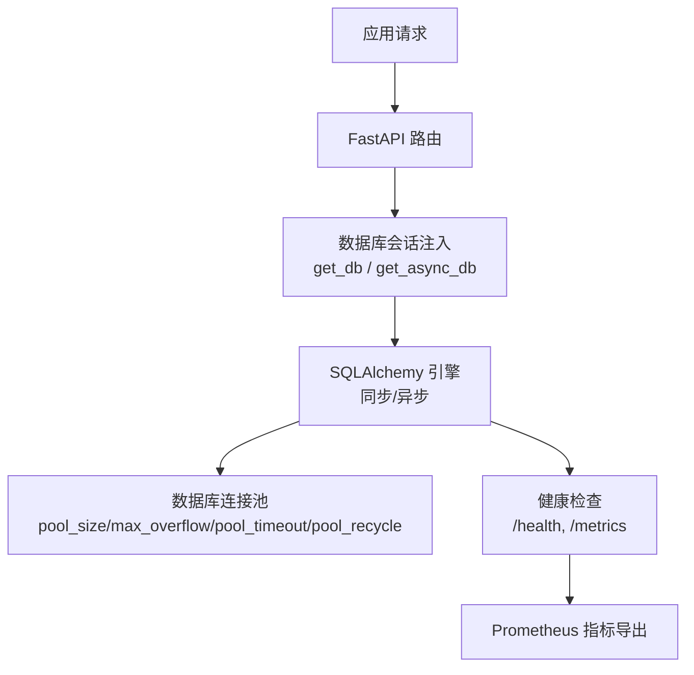
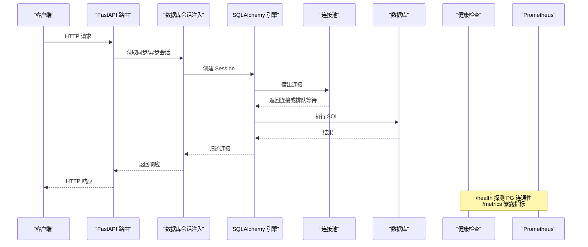
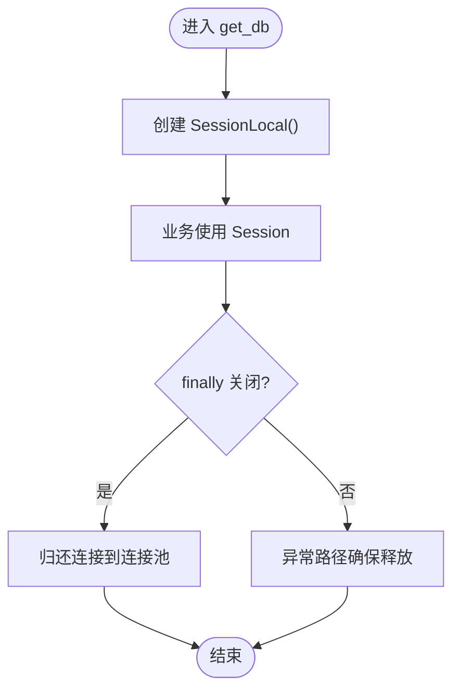
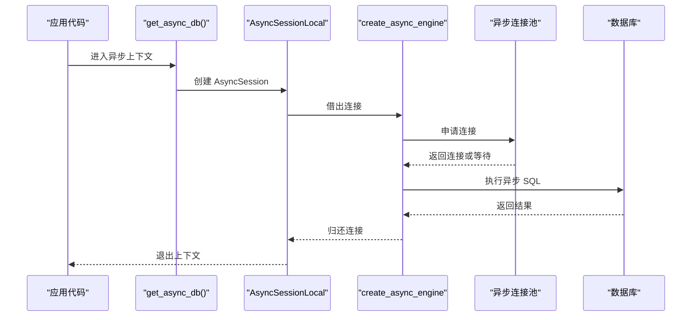
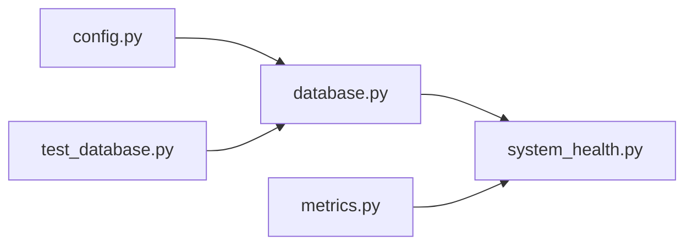

# 连接池与性能优化

<cite>
**本文引用的文件**
- [backend/core/database.py](file://backend/core/database.py)
- [backend/core/config.py](file://backend/core/config.py)
- [backend/core/metrics.py](file://backend/core/metrics.py)
- [backend/routers/system_health.py](file://backend/routers/system_health.py)
- [backend/tests/test_database.py](file://backend/tests/test_database.py)
</cite>

## 目录
1. [简介](#简介)
2. [项目结构](#项目结构)
3. [核心组件](#核心组件)
4. [架构总览](#架构总览)
5. [详细组件分析](#详细组件分析)
6. [依赖关系分析](#依赖关系分析)
7. [性能考量](#性能考量)
8. [故障排查指南](#故障排查指南)
9. [结论](#结论)
10. [附录](#附录)

## 简介
本指南面向运维与后端工程师，聚焦 Quant Agent 的数据库连接池配置、监控与调优。内容覆盖：
- SQLAlchemy 同步/异步连接池参数策略（pool_size、max_overflow、pool_timeout、pool_recycle）
- 同步与异步连接池的区别、适用场景与性能特征
- 连接池监控指标（活跃连接、等待队列、超时统计）
- 不同负载下的调优建议与最佳实践
- 连接泄漏检测、健康检查、故障恢复机制
- 微服务架构中的连接共享与隔离方案
- 面向运维的告警、容量规划与性能调优完整方案

## 项目结构
Quant Agent 在后端 core 层集中管理数据库引擎与会话工厂，并在系统健康路由中暴露健康检查与 Prometheus 指标采集点。关键路径：
- 数据库引擎与会话：backend/core/database.py
- 全局配置校验：backend/core/config.py
- 指标定义：backend/core/metrics.py
- 健康检查与指标暴露：backend/routers/system_health.py
- 单元测试验证连接池环境变量读取：backend/tests/test_database.py



图表来源
- [backend/core/database.py:1-67](file://backend/core/database.py#L1-L67)
- [backend/routers/system_health.py:51-56](file://backend/routers/system_health.py#L51-L56)

章节来源
- [backend/core/database.py:1-67](file://backend/core/database.py#L1-L67)
- [backend/routers/system_health.py:51-56](file://backend/routers/system_health.py#L51-L56)

## 核心组件
- 同步引擎与会话：基于 create_engine + sessionmaker，提供 get_db 生成器用于依赖注入。
- 异步引擎与会话：基于 create_async_engine + async_sessionmaker，提供 get_async_db 异步上下文管理器。
- 连接池参数：通过环境变量 DB_POOL_SIZE、DB_MAX_OVERFLOW、DB_POOL_TIMEOUT 控制；pool_recycle 固定为 1800；启用 pool_pre_ping。
- 健康检查：/health、/health/ready、/health/deep 探测 PG 连通性；/metrics 暴露 Prometheus 指标。
- 指标体系：metrics.py 定义了丰富的业务与基础设施指标，可用于扩展连接池观测。

章节来源
- [backend/core/database.py:14-25](file://backend/core/database.py#L14-L25)
- [backend/core/database.py:44-61](file://backend/core/database.py#L44-L61)
- [backend/routers/system_health.py:72-79](file://backend/routers/system_health.py#L72-L79)
- [backend/routers/system_health.py:51-56](file://backend/routers/system_health.py#L51-L56)
- [backend/core/metrics.py:1-16](file://backend/core/metrics.py#L1-L16)

## 架构总览
下图展示了从请求到数据库连接的完整链路，以及健康检查与指标采集点。



图表来源
- [backend/core/database.py:32-37](file://backend/core/database.py#L32-L37)
- [backend/core/database.py:64-67](file://backend/core/database.py#L64-L67)
- [backend/routers/system_health.py:72-79](file://backend/routers/system_health.py#L72-L79)
- [backend/routers/system_health.py:51-56](file://backend/routers/system_health.py#L51-L56)

## 详细组件分析

### 同步连接池配置与行为
- 参数来源：DB_POOL_SIZE、DB_MAX_OVERFLOW、DB_POOL_TIMEOUT；默认值分别为 20、40、10。
- 连接回收：pool_recycle=1800，定期回收连接避免长连接失效。
- 健康探测：pool_pre_ping=True，在每次借出前探测连接有效性。
- SQLite 分支：使用 connect_args={"check_same_thread": False}，无复杂连接池。



图表来源
- [backend/core/database.py:32-37](file://backend/core/database.py#L32-L37)
- [backend/core/database.py:14-25](file://backend/core/database.py#L14-L25)

章节来源
- [backend/core/database.py:14-25](file://backend/core/database.py#L14-L25)
- [backend/core/database.py:32-37](file://backend/core/database.py#L32-L37)
- [backend/tests/test_database.py:144-172](file://backend/tests/test_database.py#L144-L172)

### 异步连接池配置与行为
- URL 转换：将同步 URL 转换为异步驱动 URL（sqlite+aiosqlite、postgresql+asyncpg）。
- 复用同步池参数：pool_size、max_overflow、pool_timeout、pool_recycle、pool_pre_ping 与同步一致。
- 会话管理：AsyncSessionLocal + async with 自动归还连接，expire_on_commit=False 减少额外查询。



图表来源
- [backend/core/database.py:44-61](file://backend/core/database.py#L44-L61)

章节来源
- [backend/core/database.py:44-61](file://backend/core/database.py#L44-L61)

### 健康检查与指标暴露
- /health：进程存活探针，不依赖外部依赖。
- /health/ready：就绪探针，检查 Redis、Postgres、数据源可用性。
- /health/deep：全链路诊断，包含组件健康、事件循环延迟、线程池状态等。
- /metrics：Prometheus 指标导出，受 Basic Auth 保护。

```mermaid
sequenceDiagram
participant K8s as "K8s 探针"
participant Health as "/health, /health/ready, /health/deep"
participant PG as "PostgreSQL"
participant DS as "数据源注册表"
participant Prom as "Prometheus 指标"
K8s->>Health : GET /health/live
Health-->>K8s : 200 alive
K8s->>Health : GET /health/ready
Health->>PG : SELECT 1
PG-->>Health : OK
Health->>DS : health()
DS-->>Health : healthy/unhealthy
Health-->>K8s : 200 ready 或 503 not_ready
K8s->>Health : GET /metrics
Health-->>K8s : text/plain; version=0.0.4
```

图表来源
- [backend/routers/system_health.py:173-194](file://backend/routers/system_health.py#L173-L194)
- [backend/routers/system_health.py:197-246](file://backend/routers/system_health.py#L197-L246)
- [backend/routers/system_health.py:249-355](file://backend/routers/system_health.py#L249-L355)
- [backend/routers/system_health.py:51-56](file://backend/routers/system_health.py#L51-L56)

章节来源
- [backend/routers/system_health.py:51-56](file://backend/routers/system_health.py#L51-L56)
- [backend/routers/system_health.py:173-355](file://backend/routers/system_health.py#L173-L355)

### 连接池监控指标设计
当前 metrics.py 未直接暴露连接池指标，但可通过以下方式补齐：
- 活跃连接数：通过 SQLAlchemy 引擎的 pool.size() 与 pool.checkedout() 计算。
- 等待队列：通过 pool.checkin_timeouts() 或自定义计数器记录等待时间。
- 超时统计：通过 pool.timeout 触发异常的计数与直方图。
- 连接回收：通过 pool.checkedin() 与 pool.overflow() 观察溢出情况。

建议新增指标（示例命名）：
- quant_db_pool_active_connections（Gauge）
- quant_db_pool_waiting_requests（Gauge）
- quant_db_pool_timeout_total（Counter）
- quant_db_pool_recycled_total（Counter）
- quant_db_pool_overflow_total（Counter）

章节来源
- [backend/core/metrics.py:1-16](file://backend/core/metrics.py#L1-L16)

## 依赖关系分析
- database.py 依赖环境变量与 SQLAlchemy，提供同步/异步引擎与会话。
- system_health.py 依赖 database.py 的 async_engine 进行 PG 连通性探测，并暴露 /metrics。
- config.py 负责全局配置校验，确保 DATABASE_URL 等必填项存在。
- test_database.py 验证连接池环境变量读取与默认值。



图表来源
- [backend/core/database.py:1-67](file://backend/core/database.py#L1-L67)
- [backend/routers/system_health.py:1-56](file://backend/routers/system_health.py#L1-L56)
- [backend/core/config.py:20-101](file://backend/core/config.py#L20-L101)
- [backend/tests/test_database.py:141-172](file://backend/tests/test_database.py#L141-L172)

章节来源
- [backend/core/database.py:1-67](file://backend/core/database.py#L1-L67)
- [backend/routers/system_health.py:1-56](file://backend/routers/system_health.py#L1-L56)
- [backend/core/config.py:20-101](file://backend/core/config.py#L20-L101)
- [backend/tests/test_database.py:141-172](file://backend/tests/test_database.py#L141-L172)

## 性能考量
- 同步 vs 异步
  - 同步连接池适合 I/O 密集且并发可控的场景，易于调试与测试。
  - 异步连接池在高并发、低延迟场景下更具优势，尤其配合 asyncpg 可显著提升吞吐。
- 参数调优建议
  - pool_size：根据工作进程数与数据库最大连接数估算，通常设置为“每进程并发度”的 1~2 倍。
  - max_overflow：设置合理的峰值缓冲，避免突发流量导致大量等待；建议不超过 pool_size 的 2 倍。
  - pool_timeout：根据 P99 延迟目标设定，过小会导致频繁超时，过大则放大拥塞。
  - pool_recycle：保持 1800 秒以规避数据库侧连接失效；若数据库强制断开更短，需相应调整。
- 连接泄漏防护
  - 始终使用依赖注入的 get_db/get_async_db，确保 finally/上下文管理器正确归还连接。
  - 结合 pool_pre_ping 与 pool_recycle 降低僵尸连接风险。
- 缓存与降级
  - 热点查询优先走缓存（Redis/Parquet），降低数据库压力。
  - 对慢查询实施熔断与限流，避免雪崩。

[本节为通用指导，不直接分析具体文件]

## 故障排查指南
- 连接池耗尽
  - 现象：请求长时间等待或直接超时。
  - 排查：查看 /health/ready 与 /metrics；检查 pool_size、max_overflow、pool_timeout；确认是否存在连接泄漏。
- 连接失效
  - 现象：偶发连接错误。
  - 排查：确认 pool_pre_ping 与 pool_recycle 配置；检查数据库侧连接超时策略。
- 高延迟
  - 现象：P99/P999 延迟升高。
  - 排查：分析慢查询；评估是否需要增加连接池或引入缓存；检查事件循环延迟与线程池使用率。
- 健康检查失败
  - 现象：/health/ready 返回 503。
  - 排查：检查 Redis、Postgres、数据源健康；查看 /health/deep 的详细诊断信息。

章节来源
- [backend/routers/system_health.py:197-246](file://backend/routers/system_health.py#L197-L246)
- [backend/routers/system_health.py:249-355](file://backend/routers/system_health.py#L249-L355)

## 结论
Quant Agent 的连接池实现简洁而健壮，通过环境变量灵活配置，并内置健康检查与指标暴露能力。建议在以下方面持续优化：
- 补充连接池专属指标（活跃连接、等待队列、超时统计）以便精细化监控。
- 针对不同负载场景制定差异化配置策略，并结合压测验证。
- 在微服务架构中采用连接池隔离与共享策略，平衡资源利用率与稳定性。
- 建立完善的告警与容量规划流程，确保生产环境稳定运行。

[本节为总结性内容，不直接分析具体文件]

## 附录

### 连接池参数说明与推荐
- pool_size：基础连接数，建议按“每进程并发度 × 1~2”估算。
- max_overflow：临时溢出连接数，建议不超过 pool_size 的 2 倍。
- pool_timeout：借出连接的最大等待时间，建议根据 P99 目标设定。
- pool_recycle：连接生命周期，建议 1800 秒或匹配数据库侧超时策略。
- pool_pre_ping：开启以在借出前探测连接有效性。

章节来源
- [backend/core/database.py:14-25](file://backend/core/database.py#L14-L25)
- [backend/core/database.py:51-59](file://backend/core/database.py#L51-L59)
- [backend/tests/test_database.py:144-172](file://backend/tests/test_database.py#L144-L172)

### 微服务架构中的连接共享与隔离
- 共享策略
  - 同一服务内多进程共享连接池，减少数据库连接总数。
  - 跨服务间通过独立连接池隔离，避免相互影响。
- 隔离方案
  - 按业务域划分数据库实例或 Schema，限制连接池规模。
  - 使用读写分离与只读副本，分流写压力。
- 容量规划
  - 根据峰值 QPS、平均查询耗时、数据库最大连接数估算所需连接池大小。
  - 预留 20%~30% 余量应对突发流量。

[本节为通用指导，不直接分析具体文件]

### 运维监控告警与容量规划
- 监控指标
  - 活跃连接数、等待队列长度、超时次数、连接回收次数。
  - 事件循环延迟、线程池使用率、Redis 队列深度。
- 告警规则
  - 活跃连接接近上限时告警。
  - 等待队列持续增长或超时率上升时告警。
  - 连接回收频率异常时告警。
- 容量规划
  - 定期压测评估连接池容量与数据库承载能力。
  - 根据业务增长趋势调整连接池与数据库资源。

[本节为通用指导，不直接分析具体文件]