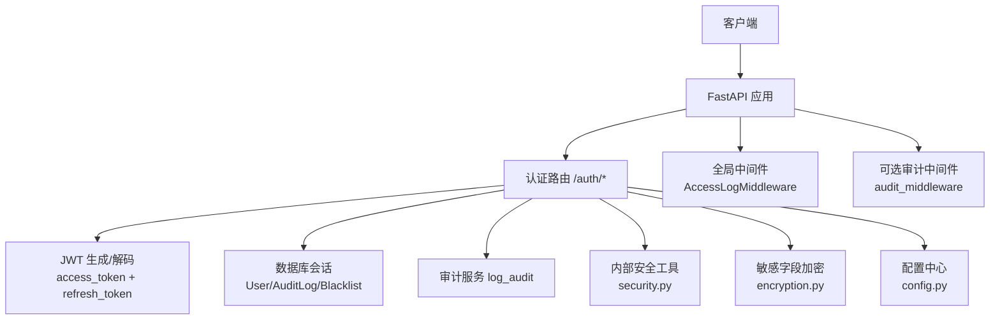
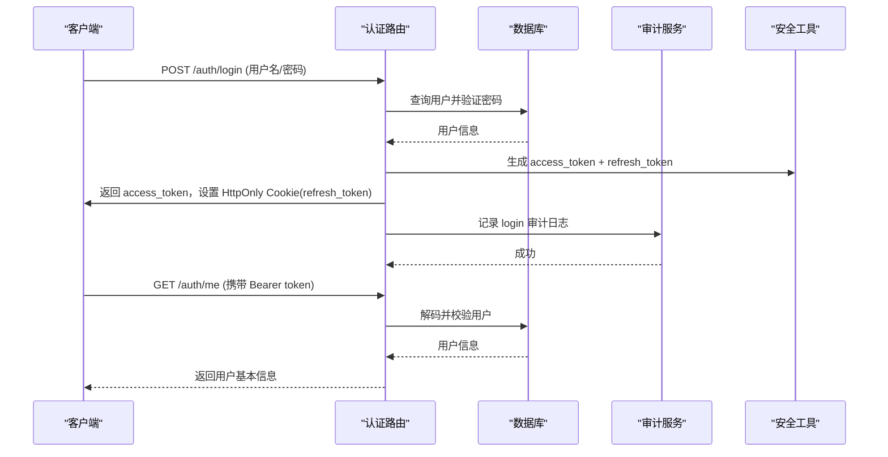
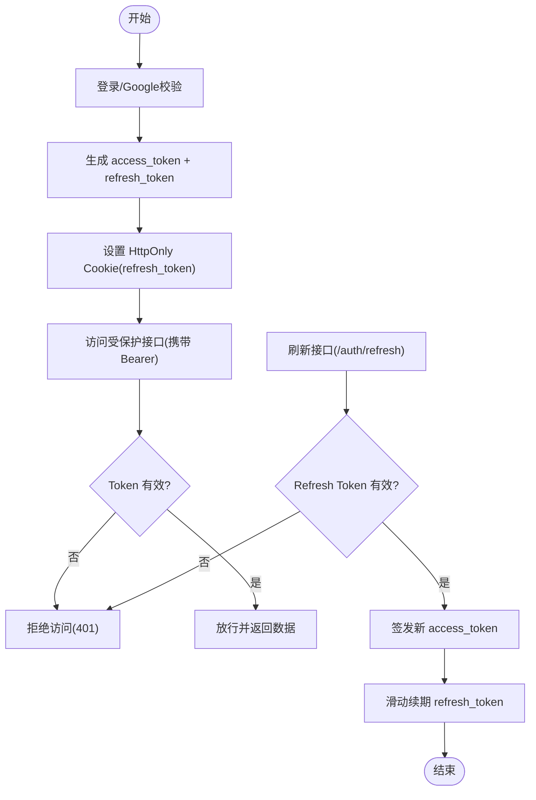
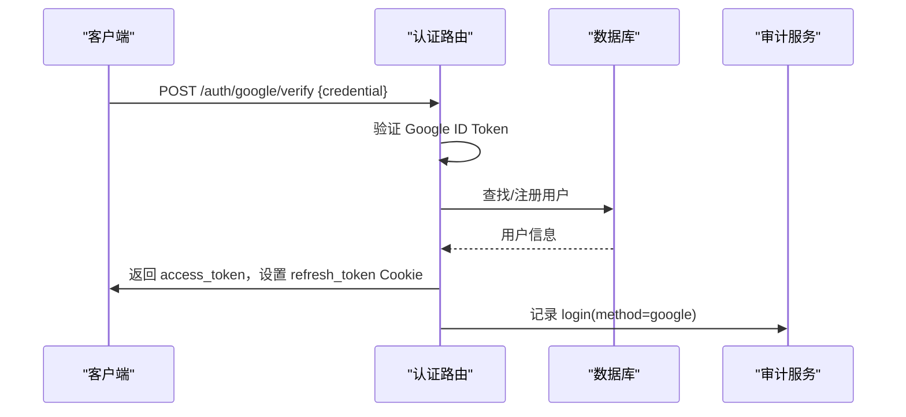
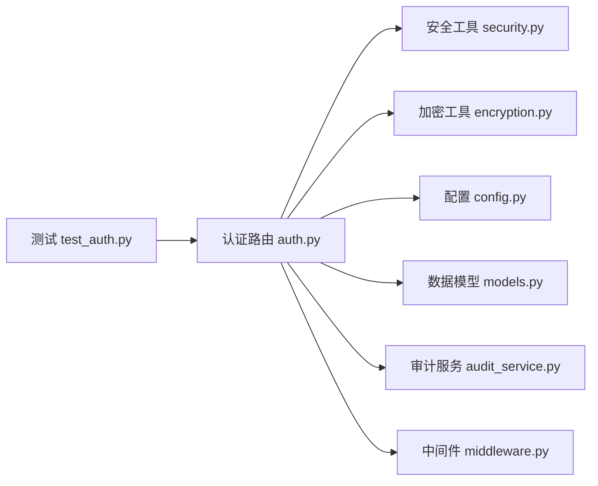

# 安全认证模块

<cite>
**本文引用的文件**
- [backend/routers/auth.py](file://backend/routers/auth.py)
- [backend/core/security.py](file://backend/core/security.py)
- [backend/core/encryption.py](file://backend/core/encryption.py)
- [backend/core/config.py](file://backend/core/config.py)
- [backend/core/models.py](file://backend/core/models.py)
- [backend/services/audit_service.py](file://backend/services/audit_service.py)
- [backend/middleware/audit_middleware.py](file://backend/middleware/audit_middleware.py)
- [backend/core/middleware.py](file://backend/core/middleware.py)
- [backend/tests/test_auth.py](file://backend/tests/test_auth.py)
</cite>

## 目录
1. [简介](#简介)
2. [项目结构](#项目结构)
3. [核心组件](#核心组件)
4. [架构总览](#架构总览)
5. [详细组件分析](#详细组件分析)
6. [依赖关系分析](#依赖关系分析)
7. [性能与安全考量](#性能与安全考量)
8. [故障排查指南](#故障排查指南)
9. [结论](#结论)
10. [附录：配置与集成规范](#附录：配置与集成规范)

## 简介
本技术文档聚焦 Quant Agent 的安全认证模块，系统性说明 JWT 令牌生命周期（生成、验证、刷新、撤销）、用户身份认证流程、权限控制模型、密码加密存储、会话管理、防重放攻击、CSRF 防护、API 访问控制与资源授权、多租户隔离、数据访问控制、审计日志记录与安全配置。目标是帮助安全开发者快速理解并正确集成认证能力，同时提供可操作的漏洞防护最佳实践。

## 项目结构
认证相关代码主要分布在以下位置：
- 路由层：认证入口与 Token 操作（登录、刷新、登出、Google OAuth 校验）
- 核心安全：密码哈希、内部通信 HMAC 签名、请求签名辅助
- 敏感数据加密：AES-256-GCM 透明加解密工具
- 配置中心：环境变量与关键安全参数集中管理
- 数据模型：用户、刷新令牌黑名单、审计日志等持久化实体
- 审计服务：统一审计日志写入与查询
- 中间件：全局访问日志与外部 API 监控；可选的审计中间件
- 测试：认证路由与 JWT 行为的单元测试

**图表来源**
- [backend/routers/auth.py:1-386](file://backend/routers/auth.py#L1-L386)
- [backend/core/security.py:1-160](file://backend/core/security.py#L1-L160)
- [backend/core/encryption.py:1-210](file://backend/core/encryption.py#L1-L210)
- [backend/core/config.py:1-134](file://backend/core/config.py#L1-L134)
- [backend/services/audit_service.py:1-112](file://backend/services/audit_service.py#L1-L112)
- [backend/middleware/audit_middleware.py:1-77](file://backend/middleware/audit_middleware.py#L1-L77)
- [backend/core/middleware.py:1-133](file://backend/core/middleware.py#L1-L133)

**章节来源**
- [backend/routers/auth.py:1-386](file://backend/routers/auth.py#L1-L386)
- [backend/core/security.py:1-160](file://backend/core/security.py#L1-L160)
- [backend/core/encryption.py:1-210](file://backend/core/encryption.py#L1-L210)
- [backend/core/config.py:1-134](file://backend/core/config.py#L1-L134)
- [backend/services/audit_service.py:1-112](file://backend/services/audit_service.py#L1-L112)
- [backend/middleware/audit_middleware.py:1-77](file://backend/middleware/audit_middleware.py#L1-L77)
- [backend/core/middleware.py:1-133](file://backend/core/middleware.py#L1-L133)

## 核心组件
- 认证路由与依赖
  - 登录、改密、Google OAuth 校验、获取当前用户、刷新与登出
  - 使用 OAuth2PasswordBearer 进行 Bearer Token 解析
  - 通过 Cookie 设置 HttpOnly 的 Refresh Token，生产环境启用 Secure 与 SameSite=None
- JWT 令牌管理
  - Access Token：短效（默认 15 分钟），用于接口鉴权
  - Refresh Token：长效（默认 30 天），滑动窗口续期
  - 支持可选认证 get_current_user_optional
- 密码安全
  - bcrypt 哈希与验证，可配置轮次
- 内部通信安全
  - HMAC-SHA256 签名生成与验证，带时间戳过期保护
  - FastAPI 依赖 verify_internal_request 用于内部服务调用
- 敏感数据加密
  - AES-256-GCM 透明加解密，支持主密钥管理与生成
- 审计与监控
  - 审计日志统一写入，包含 IP、trace_id、user_id、action、detail
  - 全局访问日志与 Prometheus 指标采集
  - 可选审计中间件对关键写操作自动审计

**章节来源**
- [backend/routers/auth.py:1-386](file://backend/routers/auth.py#L1-L386)
- [backend/core/security.py:1-160](file://backend/core/security.py#L1-L160)
- [backend/core/encryption.py:1-210](file://backend/core/encryption.py#L1-L210)
- [backend/services/audit_service.py:1-112](file://backend/services/audit_service.py#L1-L112)
- [backend/core/middleware.py:1-133](file://backend/core/middleware.py#L1-L133)

## 架构总览
下图展示从客户端到后端认证处理的完整链路，包括 JWT 签发、Cookie 设置、数据库交互与审计记录。

**图表来源**
- [backend/routers/auth.py:117-162](file://backend/routers/auth.py#L117-L162)
- [backend/routers/auth.py:103-109](file://backend/routers/auth.py#L103-L109)
- [backend/services/audit_service.py:43-80](file://backend/services/audit_service.py#L43-L80)

## 详细组件分析

### JWT 令牌生命周期
- 生成
  - 登录成功后生成 access_token（短效）与 refresh_token（长效），refresh_token 通过 HttpOnly Cookie 下发
  - Google OAuth 校验通过后同样签发系统内部 access_token 与 refresh_token
- 验证
  - 受保护接口通过 get_current_user 依赖解析 Bearer Token，解码后查询用户
  - 可选认证 get_current_user_optional 用于允许匿名或降级场景
- 刷新
  - /auth/refresh 读取 Cookie 中的 refresh_token，校验类型与 payload，签发新的 access_token，并滑动续期 refresh_token
- 撤销
  - 登出时删除 refresh_token Cookie
  - 数据库中存在 refresh_token_blacklist 表可用于扩展黑名单机制（当前实现未强制检查黑名单）

**图表来源**
- [backend/routers/auth.py:117-162](file://backend/routers/auth.py#L117-L162)
- [backend/routers/auth.py:305-346](file://backend/routers/auth.py#L305-L346)
- [backend/routers/auth.py:349-385](file://backend/routers/auth.py#L349-L385)

**章节来源**
- [backend/routers/auth.py:1-386](file://backend/routers/auth.py#L1-L386)

### 用户身份认证流程
- 账号密码登录
  - 校验用户名与密码，失败返回 401
  - 成功签发 Token 并记录审计日志
- Google OAuth 前端令牌验证
  - 使用 google.oauth2.id_token.verify_oauth2_token 验证前端 ID Token
  - 根据 email 查找或注册用户，签发系统内部 Token 并设置 Cookie
  - 记录审计日志
- 获取当前用户
  - 通过 Bearer Token 解析并加载用户对象
  - 可选认证用于非强制鉴权场景

**图表来源**
- [backend/routers/auth.py:204-299](file://backend/routers/auth.py#L204-L299)
- [backend/services/audit_service.py:43-80](file://backend/services/audit_service.py#L43-L80)

**章节来源**
- [backend/routers/auth.py:117-162](file://backend/routers/auth.py#L117-L162)
- [backend/routers/auth.py:204-299](file://backend/routers/auth.py#L204-L299)
- [backend/routers/auth.py:65-98](file://backend/routers/auth.py#L65-L98)

### 权限控制模型与角色权限分配
- 当前实现以用户为中心，基于 Bearer Token 进行基本鉴权
- 尚未在路由层实现细粒度 RBAC（角色-权限）或 ABAC（属性基）策略
- 建议扩展点：
  - 在 User 模型中增加 role/permissions 字段
  - 在依赖中注入权限检查逻辑，结合路由装饰器或中间件进行资源级授权
  - 使用自定义异常 PermissionDeniedError 统一处理权限不足

**章节来源**
- [backend/core/exceptions.py:72-75](file://backend/core/exceptions.py#L72-L75)
- [backend/core/models.py:37-51](file://backend/core/models.py#L37-L51)

### 密码加密存储与会话管理
- 密码加密
  - 使用 bcrypt 进行哈希存储，支持配置轮次
  - 提供 verify_password 进行比对
- 会话管理
  - 采用无状态 JWT 作为访问凭证
  - 使用 HttpOnly Cookie 存储 Refresh Token，生产环境启用 Secure 与 SameSite=None
  - 支持滑动窗口续期，提升用户体验的同时降低频繁登录风险

**章节来源**
- [backend/core/security.py:20-30](file://backend/core/security.py#L20-L30)
- [backend/routers/auth.py:28-41](file://backend/routers/auth.py#L28-L41)
- [backend/routers/auth.py:141-146](file://backend/routers/auth.py#L141-L146)
- [backend/routers/auth.py:333-344](file://backend/routers/auth.py#L333-L344)

### 防重放攻击与 CSRF 防护
- 防重放攻击
  - 内部服务间调用使用 HMAC-SHA256 签名，包含方法、路径与时间戳，具备过期时间保护
  - 提供 verify_internal_request 作为 FastAPI 依赖进行统一校验
- CSRF 防护
  - 当前未显式实现 CSRF Token 机制
  - 建议：对于跨站表单提交场景启用 CSRF 保护；纯 API 场景建议使用 Bearer Token 与同源策略配合

**章节来源**
- [backend/core/security.py:37-119](file://backend/core/security.py#L37-L119)
- [backend/core/security.py:121-159](file://backend/core/security.py#L121-L159)

### API 访问控制与资源授权
- 访问控制
  - 受保护接口通过 get_current_user 依赖进行 Bearer Token 校验
  - 可选认证 get_current_user_optional 用于部分公开接口
- 资源授权
  - 当前未实现资源级权限检查
  - 建议在业务路由中根据用户上下文进行资源归属校验（如 user_id 匹配）

**章节来源**
- [backend/routers/auth.py:65-98](file://backend/routers/auth.py#L65-L98)

### 多租户隔离与数据访问控制
- 多租户隔离
  - 数据模型中包含 user_id 字段用于区分不同用户的数据（如 WebpageKnowledgeBase、ScreenerRule 等）
- 数据访问控制
  - 建议在查询层强制附加 user_id 过滤条件，避免越权访问
  - 结合审计日志记录数据访问行为

**章节来源**
- [backend/core/models.py:199-231](file://backend/core/models.py#L199-L231)
- [backend/core/models.py:234-256](file://backend/core/models.py#L234-L256)

### 审计日志记录
- 审计服务
  - 统一 log_audit 函数记录 action、detail、IP、trace_id、user_id
  - 支持按 action 与 user_id 查询
- 中间件审计
  - 可选 audit_middleware 对关键写操作自动审计（需与实际路由路径对齐）
- 认证审计
  - 登录、改密、登出等操作均记录审计日志

**章节来源**
- [backend/services/audit_service.py:16-80](file://backend/services/audit_service.py#L16-L80)
- [backend/services/audit_service.py:83-112](file://backend/services/audit_service.py#L83-L112)
- [backend/middleware/audit_middleware.py:13-77](file://backend/middleware/audit_middleware.py#L13-L77)
- [backend/routers/auth.py:148-155](file://backend/routers/auth.py#L148-L155)
- [backend/routers/auth.py:183-190](file://backend/routers/auth.py#L183-L190)
- [backend/routers/auth.py:366-374](file://backend/routers/auth.py#L366-L374)

## 依赖关系分析

**图表来源**
- [backend/routers/auth.py:1-386](file://backend/routers/auth.py#L1-L386)
- [backend/core/security.py:1-160](file://backend/core/security.py#L1-L160)
- [backend/core/encryption.py:1-210](file://backend/core/encryption.py#L1-L210)
- [backend/core/config.py:1-134](file://backend/core/config.py#L1-L134)
- [backend/core/models.py:1-495](file://backend/core/models.py#L1-L495)
- [backend/services/audit_service.py:1-112](file://backend/services/audit_service.py#L1-L112)
- [backend/core/middleware.py:1-133](file://backend/core/middleware.py#L1-L133)
- [backend/tests/test_auth.py:1-179](file://backend/tests/test_auth.py#L1-L179)

**章节来源**
- [backend/routers/auth.py:1-386](file://backend/routers/auth.py#L1-L386)
- [backend/tests/test_auth.py:1-179](file://backend/tests/test_auth.py#L1-L179)

## 性能与安全考量
- 性能
  - JWT 解码与数据库查询为常见瓶颈，建议缓存热点用户信息与配置
  - 审计日志写入应异步化或批量写入以降低主流程延迟
  - 外部 API 监控已内置 Prometheus 指标，便于定位慢调用
- 安全
  - 生产环境必须配置强 SECRET_KEY 与 ENCRYPTION_MASTER_KEY
  - 使用 HttpOnly、Secure、SameSite=None 的 Cookie 防止 XSS 与 CSRF 泄露
  - 内部服务调用必须携带 HMAC 签名并校验时间戳
  - 建议引入 Refresh Token 黑名单以实现即时撤销
  - 对敏感字段采用 AES-256-GCM 加密存储

[本节为通用指导，不直接分析具体文件]

## 故障排查指南
- 登录失败
  - 检查用户名与密码是否正确，确认数据库中 hashed_password 是否由 bcrypt 生成
  - 查看审计日志确认登录尝试与失败原因
- Token 无效或过期
  - 确认 Bearer Token 是否携带且未篡改
  - 使用 /auth/refresh 刷新 Access Token，确保 Cookie 中的 Refresh Token 存在且有效
- Google OAuth 失败
  - 检查 GOOGLE_CLIENT_ID 配置与前端 ID Token 有效性
  - 查看后端终端堆栈与审计日志
- 内部服务调用被拒
  - 确认 X-Internal-Sig 头是否存在且未过期
  - 核对 INTERNAL_API_SECRET 配置一致

**章节来源**
- [backend/routers/auth.py:117-162](file://backend/routers/auth.py#L117-L162)
- [backend/routers/auth.py:305-346](file://backend/routers/auth.py#L305-L346)
- [backend/routers/auth.py:204-299](file://backend/routers/auth.py#L204-L299)
- [backend/core/security.py:121-159](file://backend/core/security.py#L121-L159)
- [backend/services/audit_service.py:43-80](file://backend/services/audit_service.py#L43-L80)

## 结论
Quant Agent 的安全认证模块提供了完整的 JWT 令牌生命周期管理、用户认证、密码安全、内部通信签名与审计日志能力。当前实现以用户为中心进行基础鉴权，尚未实现细粒度 RBAC/ABAC 与 Refresh Token 黑名单。建议在生产环境中强化密钥管理、启用更严格的 Cookie 策略、引入黑名单与权限模型，并结合审计与监控完善安全治理。

[本节为总结性内容，不直接分析具体文件]

## 附录：配置与集成规范
- 密钥管理
  - 配置 SECRET_KEY 与 ENCRYPTION_MASTER_KEY，生产环境建议使用 KMS/Vault
  - 配置 INTERNAL_API_SECRET 用于内部服务 HMAC 签名
- 证书与网络安全
  - 生产环境启用 HTTPS，确保 Cookie 的 Secure 标志生效
  - 合理配置 SameSite 与跨域策略，避免浏览器拦截跨站 Cookie
- 网络安全设置
  - 限制登录与刷新接口的频率，防止暴力破解
  - 对敏感接口启用访问日志与审计记录
- 认证集成规范
  - 客户端登录后保存 access_token 并在后续请求中携带 Bearer Token
  - 使用 /auth/refresh 刷新 access_token，保持登录态
  - 登出时调用 /auth/logout 清理 Cookie
- 漏洞防护最佳实践
  - 禁止明文存储密码与敏感数据
  - 对所有内部服务调用强制 HMAC 签名与时间戳校验
  - 对资源访问进行 user_id 归属校验，防止越权
  - 定期轮换密钥并审查审计日志

**章节来源**
- [backend/core/config.py:84-88](file://backend/core/config.py#L84-L88)
- [backend/routers/auth.py:28-41](file://backend/routers/auth.py#L28-L41)
- [backend/core/security.py:37-119](file://backend/core/security.py#L37-L119)
- [backend/services/audit_service.py:43-80](file://backend/services/audit_service.py#L43-L80)