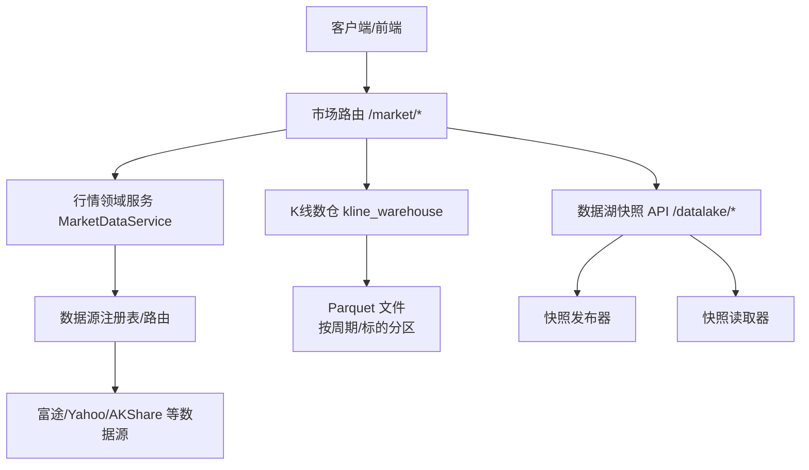
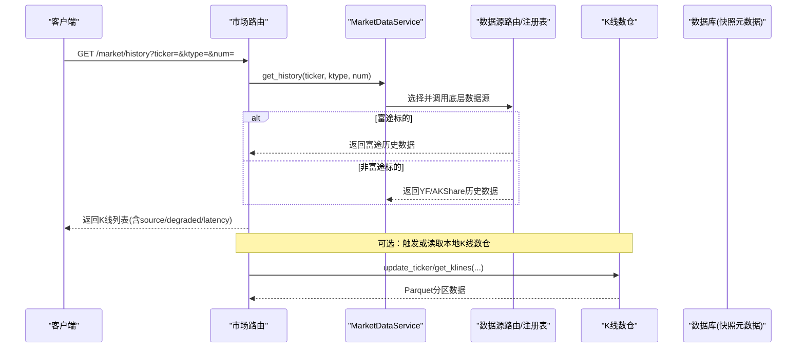
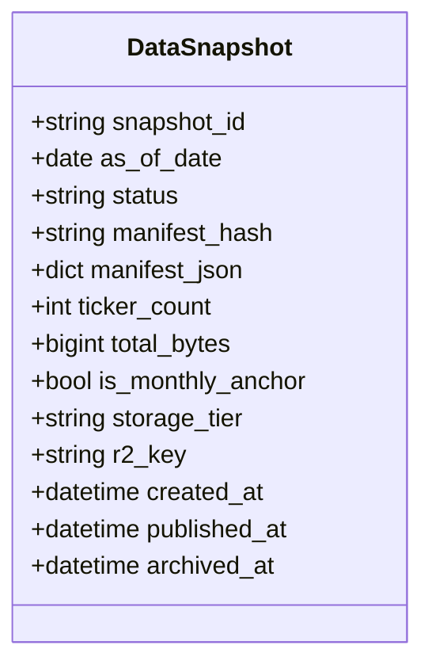
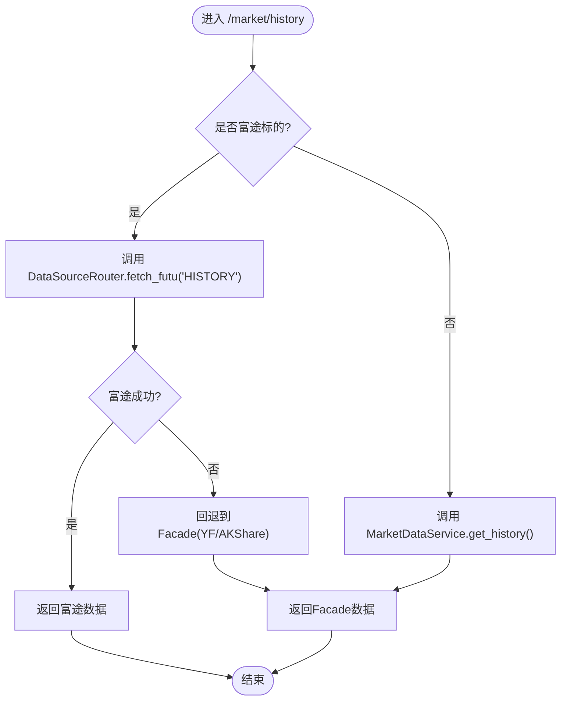
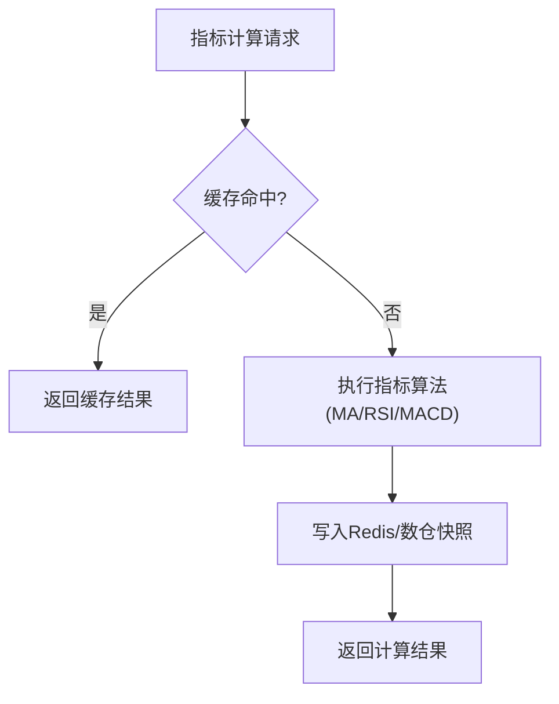
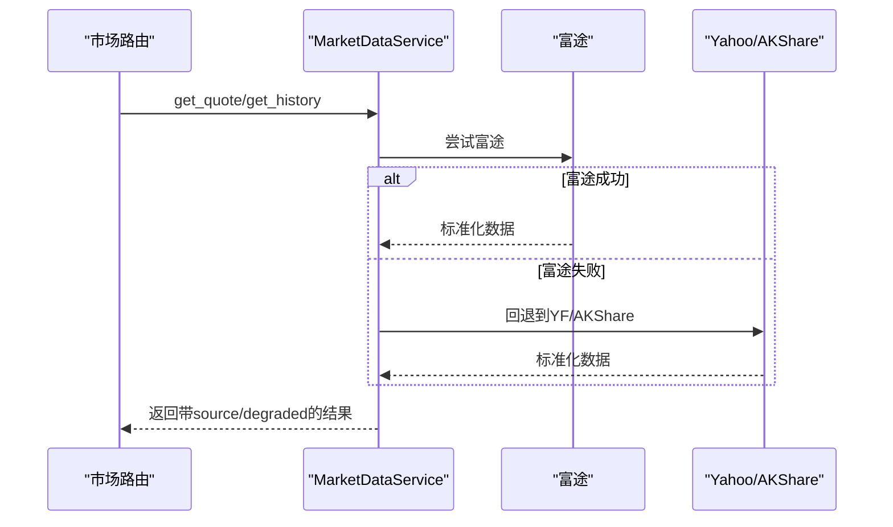
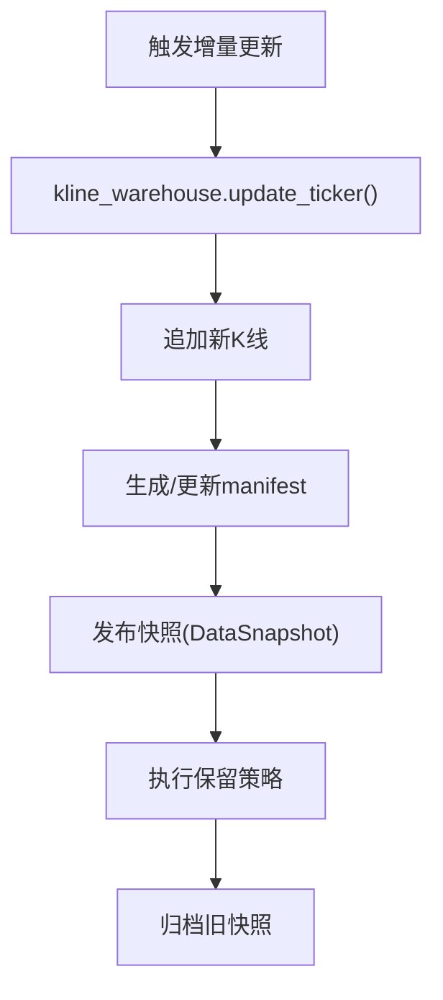
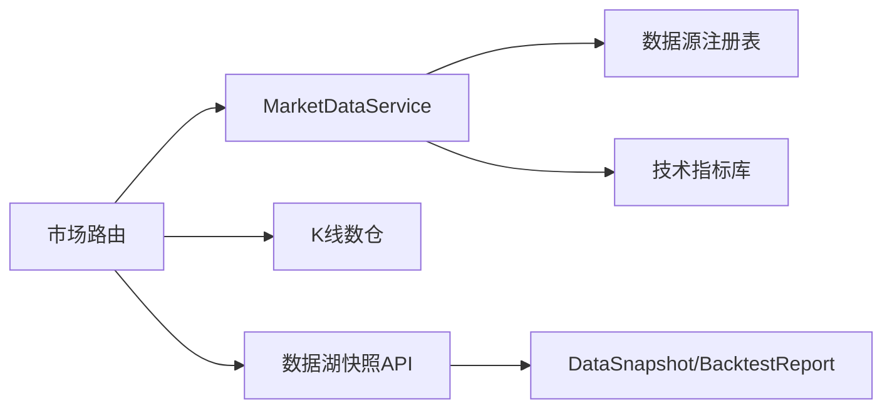

# 历史数据服务

<cite>
**本文引用的文件**
- [backend/routers/market.py](file://backend/routers/market.py)
- [backend/services/datasource/business/market.py](file://backend/services/datasource/business/market.py)
- [backend/app/market_data.py](file://backend/app/market_data.py)
- [backend/core/datalake_models.py](file://backend/core/datalake_models.py)
- [backend/routers/datalake.py](file://backend/routers/datalake.py)
- [backend/services/datalake/kline_warehouse.py](file://backend/services/datalake/kline_warehouse.py)
- [backend/utils/technical_indicators_pro.py](file://backend/utils/technical_indicators_pro.py)
</cite>

## 目录
1. [简介](#简介)
2. [项目结构](#项目结构)
3. [核心组件](#核心组件)
4. [架构总览](#架构总览)
5. [详细组件分析](#详细组件分析)
6. [依赖关系分析](#依赖关系分析)
7. [性能考虑](#性能考虑)
8. [故障排查指南](#故障排查指南)
9. [结论](#结论)
10. [附录](#附录)

## 简介
本技术文档面向量化研究者与工程师，系统性说明 Quant Agent 历史数据服务的整体设计与实现，重点覆盖：
- K线数据存储架构：Parquet 文件格式、分区策略、索引机制与快照版本化。
- 历史数据查询接口：时间范围、频率级别、字段选择与多源融合降级。
- 技术指标计算服务：移动平均线、RSI、MACD 等常用指标的算法与缓存策略。
- 多数据源整合：富途、Yahoo Finance、AKShare 等来源的格式转换与质量校验。
- 高级功能：增量更新、数据版本管理、历史回滚。
- 性能优化：预计算、并行查询、结果缓存与数仓加速。
- 使用指南与最佳实践：面向研究场景的数据获取与分析建议。

## 项目结构
后端历史数据相关能力主要分布在以下模块：
- 路由层：对外暴露 HTTP/WebSocket 接口，统一封装请求参数与响应信封。
- 业务适配层：行情领域服务（MarketDataService）负责 ticker 校验、ktype 归一、多源调度与派生指标。
- 数据仓库与快照：K线数仓与 Parquet 快照发布/读取/保留策略。
- 指标计算：技术指标库与工具函数。
- 模型与元数据：数据湖快照与回测报告 ORM。

**图表来源**
- [backend/routers/market.py:492-545](file://backend/routers/market.py#L492-L545)
- [backend/services/datasource/business/market.py:42-52](file://backend/services/datasource/business/market.py#L42-L52)
- [backend/routers/datalake.py:61-138](file://backend/routers/datalake.py#L61-L138)

**章节来源**
- [backend/routers/market.py:1-120](file://backend/routers/market.py#L1-L120)
- [backend/services/datasource/business/market.py:1-60](file://backend/services/datasource/business/market.py#L1-L60)
- [backend/routers/datalake.py:1-60](file://backend/routers/datalake.py#L1-L60)

## 核心组件
- 市场路由与市场数据网关：提供统一的历史与实时行情入口，支持富途直连与通用Facade降级。
- 行情领域服务：封装ticker校验、ktype归一、期权派生指标（ATM IV、IV分位、RV30d、Skew）。
- K线数仓：基于Parquet的本地/对象存储K线仓库，支持增量追加与全量降级拉取。
- 数据湖快照：以manifest为指纹的不可变快照，支持重建、保留策略与最新快照查询。
- 技术指标库：提供MA、RSI、MACD等指标计算与缓存策略。

**章节来源**
- [backend/app/market_data.py:7-15](file://backend/app/market_data.py#L7-L15)
- [backend/services/datasource/business/market.py:28-82](file://backend/services/datasource/business/market.py#L28-L82)
- [backend/services/datalake/kline_warehouse.py](file://backend/services/datalake/kline_warehouse.py)
- [backend/routers/datalake.py:61-138](file://backend/routers/datalake.py#L61-L138)
- [backend/utils/technical_indicators_pro.py](file://backend/utils/technical_indicators_pro.py)

## 架构总览
历史数据服务采用“路由→领域服务→数据源/数仓”的分层架构，结合快照版本化与缓存，确保高可用与可复现性。

**图表来源**
- [backend/routers/market.py:492-545](file://backend/routers/market.py#L492-L545)
- [backend/services/datasource/business/market.py:42-52](file://backend/services/datasource/business/market.py#L42-L52)

## 详细组件分析

### K线数据存储架构（Parquet、分区、索引）
- 存储格式：K线数据以Parquet列式存储，具备高效压缩与列裁剪能力，适合大规模历史数据查询。
- 分区策略：按频率级别（如K_DAY、K_60M）与标的维度进行目录分区，便于快速定位与增量更新。
- 索引机制：通过快照manifest记录每个快照的文件清单、哈希与统计信息；数据库维护快照状态、发布时间与归档时间，支持按日期与状态检索。
- 版本管理：DataSnapshot作为不可变快照元数据，包含manifest_hash、is_monthly_anchor、storage_tier、r2_key等字段，用于追踪与回滚。

**图表来源**
- [backend/core/datalake_models.py:31-50](file://backend/core/datalake_models.py#L31-L50)

**章节来源**
- [backend/core/datalake_models.py:31-82](file://backend/core/datalake_models.py#L31-L82)
- [backend/routers/datalake.py:61-138](file://backend/routers/datalake.py#L61-L138)

### 历史数据查询接口
- 接口路径：/market/history
- 参数：
  - ticker：标的代码
  - ktype：K线周期类型（DAY/WEEK/MONTH/MIN_*），内部归一化为K_DAY/K_WEEK/K_MON/K_MIN_*
  - num：向后取多少根K线
- 行为：
  - 富途标的优先走DataSourceRouter.fetch_futu("HISTORY")，失败则回退至Facade（YF/AKShare）。
  - 返回扁平payload，包含data（K线列表）、source（数据源标识）、degraded（是否降级）、latency_ms（延迟）。
- 时间范围与频率：
  - 通过num控制条数；若需精确时间范围，可在上层根据返回K线的timestamp过滤。
  - 频率级别由ktype决定，支持日、周、月、分钟级。

**图表来源**
- [backend/routers/market.py:492-545](file://backend/routers/market.py#L492-L545)
- [backend/services/datasource/business/market.py:42-52](file://backend/services/datasource/business/market.py#L42-L52)

**章节来源**
- [backend/routers/market.py:492-545](file://backend/routers/market.py#L492-L545)
- [backend/services/datasource/business/market.py:42-52](file://backend/services/datasource/business/market.py#L42-L52)

### 技术指标计算服务
- 指标范围：移动平均线（MA）、相对强弱指数（RSI）、平滑异同移动平均线（MACD）等常用指标。
- 算法实现：位于技术指标库中，提供向量化计算与边界处理；在Facade层对期权派生指标（ATM IV、IV分位、RV30d、Skew）进行组合计算。
- 缓存策略：
  - 进程内Redis缓存用于批量报价与宏观数据缓存（yf_macro_cache）。
  - 数仓Parquet快照作为离线预计算与回测基准，避免重复计算。
  - 指标结果可按ticker+period+window键入缓存，命中后直接返回。

**图表来源**
- [backend/routers/market.py:408-460](file://backend/routers/market.py#L408-L460)
- [backend/services/datasource/business/market.py:73-169](file://backend/services/datasource/business/market.py#L73-L169)
- [backend/utils/technical_indicators_pro.py](file://backend/utils/technical_indicators_pro.py)

**章节来源**
- [backend/services/datasource/business/market.py:73-169](file://backend/services/datasource/business/market.py#L73-L169)
- [backend/routers/market.py:408-460](file://backend/routers/market.py#L408-L460)
- [backend/utils/technical_indicators_pro.py](file://backend/utils/technical_indicators_pro.py)

### 多数据源整合与质量校验
- 数据源：富途（港美股/A股等）、Yahoo Finance、AKShare（东方财富）等。
- 格式转换：
  - 富途标的通过DataSourceRouter单独通道，返回标准K线/报价结构。
  - 非富途标的经Facade统一选源，合并不同源的字段差异（如close/Close、volume/Volume）。
- 质量校验：
  - ticker基础校验（非空、去除空白、禁止注入字符）。
  - ktype归一化处理（DAY/D/WEEK/W/MONTH/M/MIN_* → K_*）。
  - 降级信号：当部分数据源不可用时，返回degraded标志与错误消息，保证接口可用性。

**图表来源**
- [backend/routers/market.py:342-401](file://backend/routers/market.py#L342-L401)
- [backend/services/datasource/business/market.py:18-26](file://backend/services/datasource/business/market.py#L18-L26)
- [backend/services/datasource/business/market.py:195-225](file://backend/services/datasource/business/market.py#L195-L225)

**章节来源**
- [backend/routers/market.py:342-401](file://backend/routers/market.py#L342-L401)
- [backend/services/datasource/business/market.py:18-26](file://backend/services/datasource/business/market.py#L18-L26)
- [backend/services/datasource/business/market.py:195-225](file://backend/services/datasource/business/market.py#L195-L225)

### 增量数据更新、版本管理与回滚
- 增量更新：K线数仓支持update_ticker方法，自动执行增量追加或全量降级拉取，减少重复IO与网络开销。
- 版本管理：DataSnapshot以manifest_hash为数据指纹，记录as_of_date、status、published_at、archived_at等，支持按日期与状态查询。
- 历史回滚：通过快照ID定位特定时间点的数据集，结合对象存储（R2）与本地存储层级，实现快速切换与恢复。

**图表来源**
- [backend/routers/market.py:463-490](file://backend/routers/market.py#L463-L490)
- [backend/routers/datalake.py:112-138](file://backend/routers/datalake.py#L112-L138)
- [backend/core/datalake_models.py:31-50](file://backend/core/datalake_models.py#L31-L50)

**章节来源**
- [backend/routers/market.py:463-490](file://backend/routers/market.py#L463-L490)
- [backend/routers/datalake.py:112-138](file://backend/routers/datalake.py#L112-L138)
- [backend/core/datalake_models.py:31-50](file://backend/core/datalake_models.py#L31-L50)

## 依赖关系分析
- 路由层依赖领域服务与数据源路由，解耦具体数据源实现。
- 领域服务依赖Facade与注册表，屏蔽底层差异并提供派生指标。
- 数仓与快照模块依赖ORM模型与对象存储，确保数据一致性与可追溯性。
- 指标库被Facade与路由层复用，支持缓存与预计算。

**图表来源**
- [backend/routers/market.py:1-120](file://backend/routers/market.py#L1-L120)
- [backend/services/datasource/business/market.py:1-60](file://backend/services/datasource/business/market.py#L1-L60)
- [backend/core/datalake_models.py:31-82](file://backend/core/datalake_models.py#L31-L82)

**章节来源**
- [backend/routers/market.py:1-120](file://backend/routers/market.py#L1-L120)
- [backend/services/datasource/business/market.py:1-60](file://backend/services/datasource/business/market.py#L1-L60)
- [backend/core/datalake_models.py:31-82](file://backend/core/datalake_models.py#L31-L82)

## 性能考虑
- 预计算：通过K线数仓与快照manifest，将高频指标与聚合结果离线计算并持久化，降低在线查询压力。
- 并行查询：Facade层对期权链与历史K线并行获取，缩短端到端延迟。
- 结果缓存：Redis缓存批量报价与宏观数据，减少重复网络请求。
- 列式存储：Parquet支持列裁剪与谓词下推，提升大表扫描效率。
- 连接池与熔断：数据源路由与健康检查避免雪崩，保障系统稳定性。

[本节为通用性能指导，不直接分析具体文件]

## 故障排查指南
- 富途连接状态：通过/market/futu/status与/market/health/services查看富途OpenD连接与健康。
- 数据源健康：路由层汇总各数据源状态（富途、AKShare、Yahoo、外部API），便于快速定位问题。
- 快照状态：/datalake/snapshots与/datalake/snapshots/latest查询最新快照与构建状态，确认数据新鲜度。
- 常见错误：
  - ticker非法字符或为空：领域服务校验抛出异常。
  - ktype未识别：归一化失败时返回默认或报错。
  - 数据源超时或配额耗尽：回退机制触发，返回degraded标志与错误消息。

**章节来源**
- [backend/routers/market.py:228-327](file://backend/routers/market.py#L228-L327)
- [backend/routers/datalake.py:61-98](file://backend/routers/datalake.py#L61-L98)
- [backend/services/datasource/business/market.py:195-225](file://backend/services/datasource/business/market.py#L195-L225)

## 结论
Quant Agent 历史数据服务通过分层架构、Parquet数仓与快照版本化，实现了高可用、可扩展且可复现的历史数据能力。路由层提供统一接口，领域服务封装复杂逻辑，数据源路由与缓存机制保障性能与稳定性。对于量化研究者，建议优先使用数仓快照与预计算指标，结合Facade的多源融合与降级策略，获得稳定可靠的研究数据。

[本节为总结性内容，不直接分析具体文件]

## 附录
- 使用建议：
  - 优先使用/datalake/snapshots/latest获取最新快照，确保数据一致性。
  - 历史查询时合理设置num与ktype，避免过大请求影响性能。
  - 对高频指标启用缓存与预计算，减少重复计算。
- 最佳实践：
  - 使用ticker校验与ktype归一化，避免非法输入。
  - 监控数据源健康与延迟，及时切换备用源。
  - 定期执行快照保留策略，清理过期数据。

[本节为通用指导，不直接分析具体文件]