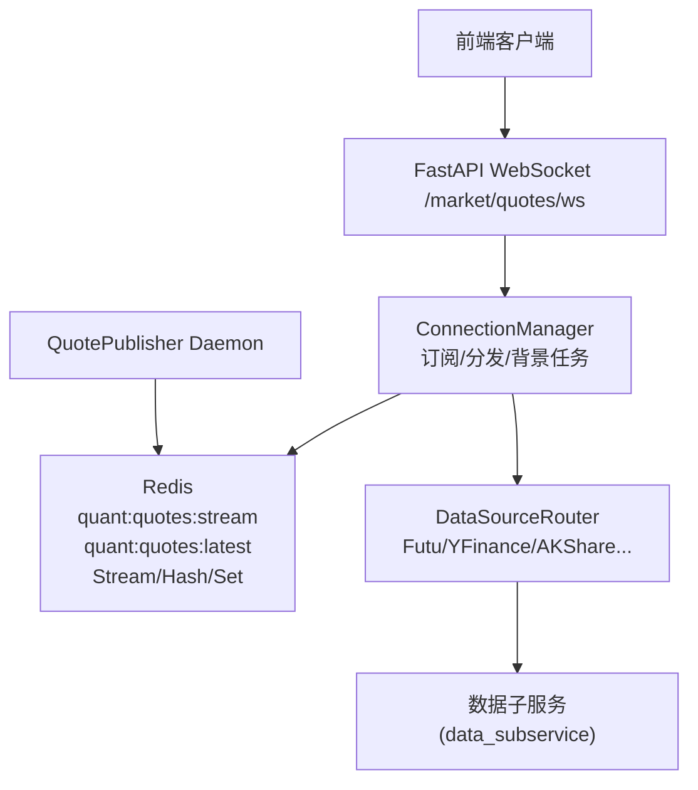
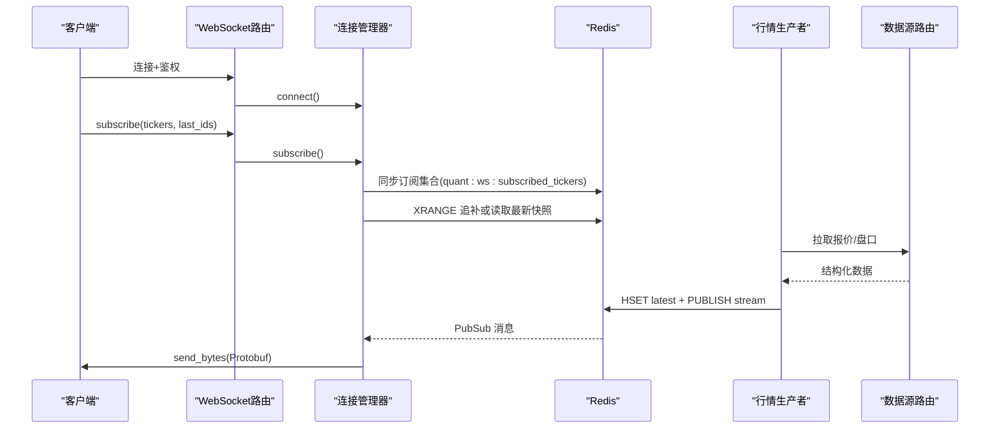
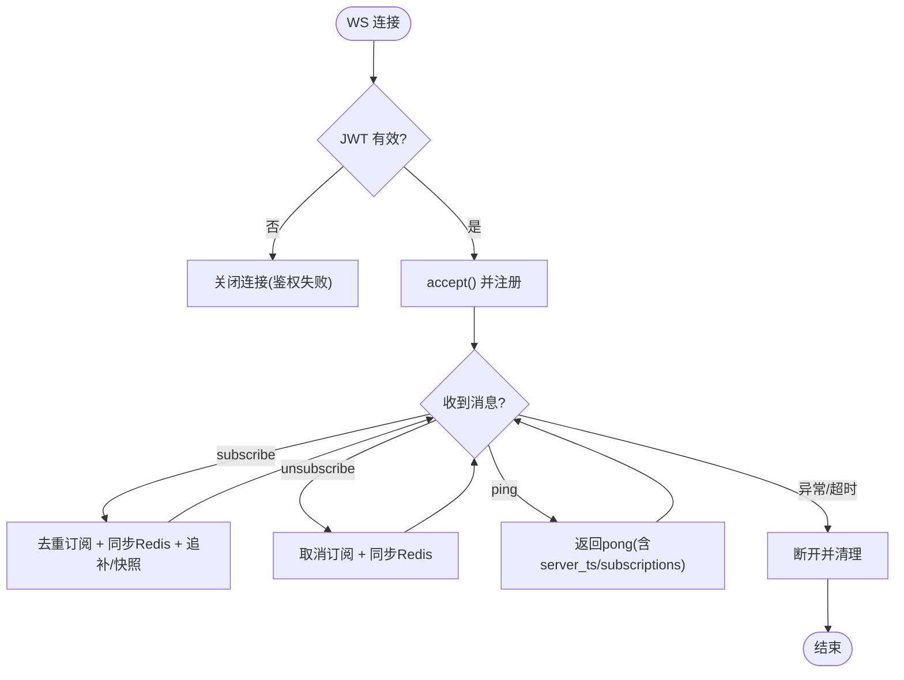
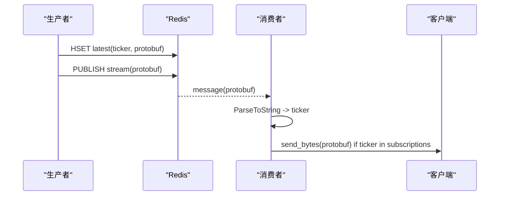
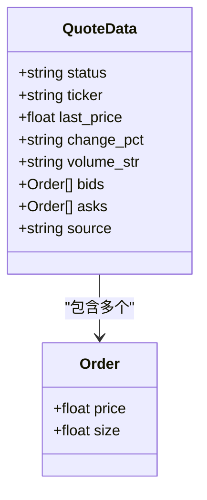
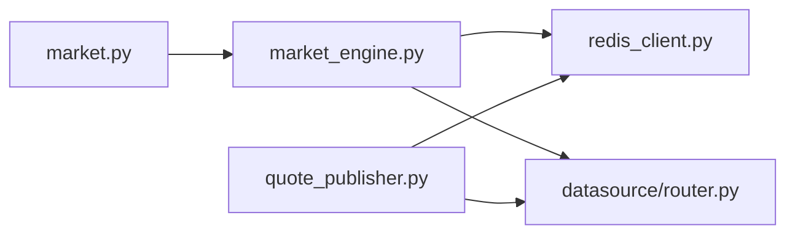

# 实时行情服务

<cite>
**本文引用的文件**
- [backend/main.py](file://backend/main.py)
- [backend/routers/market.py](file://backend/routers/market.py)
- [backend/services/market_engine.py](file://backend/services/market_engine.py)
- [backend/workers/quote_publisher.py](file://backend/workers/quote_publisher.py)
- [backend/core/redis_client.py](file://backend/core/redis_client.py)
- [shared/proto/market.proto](file://shared/proto/market.proto)
- [backend/core/proto/market_pb2.py](file://backend/core/proto/market_pb2.py)
- [backend/services/datasource/router.py](file://backend/services/datasource/router.py)
</cite>

## 目录
1. [简介](#简介)
2. [项目结构](#项目结构)
3. [核心组件](#核心组件)
4. [架构总览](#架构总览)
5. [详细组件分析](#详细组件分析)
6. [依赖关系分析](#依赖关系分析)
7. [性能考量与优化](#性能考量与优化)
8. [故障排查指南](#故障排查指南)
9. [结论](#结论)
10. [附录：接入规范与调试](#附录接入规范与调试)

## 简介
本技术文档面向 Quant Agent 的“实时行情服务”，聚焦以下目标：
- WebSocket 连接管理：连接建立、订阅管理、消息分发、断开处理。
- 行情数据流：接收、处理、推送（Protobuf 序列化、Redis Pub/Sub 广播、客户端过滤）。
- 数据结构与更新逻辑：盘口深度、最新价、成交量等字段及更新路径。
- 多数据源聚合与容错：富途与 Yahoo Finance 的聚合策略、故障转移与一致性。
- 高级功能：价格突破报警、资金流向监控、账户信息同步。
- 性能优化：批量处理、压缩传输、内存管理等最佳实践。
- 开发者接入规范与调试方法。

## 项目结构
后端以 FastAPI 作为网关，WebSocket 路由负责前端连接与订阅协议；市场引擎维护连接与后台任务；独立的生产者守护进程从数据源拉取并写入 Redis；Redis 承担消息总线与缓存；数据源通过统一路由器访问富途与 Yahoo 等子服务。

图表来源
- [backend/routers/market.py:73-226](file://backend/routers/market.py#L73-L226)
- [backend/services/market_engine.py:115-331](file://backend/services/market_engine.py#L115-L331)
- [backend/workers/quote_publisher.py:22-223](file://backend/workers/quote_publisher.py#L22-L223)
- [backend/services/datasource/router.py:1-200](file://backend/services/datasource/router.py#L1-L200)

章节来源
- [backend/main.py:125-222](file://backend/main.py#L125-L222)
- [backend/routers/market.py:73-226](file://backend/routers/market.py#L73-L226)

## 核心组件
- WebSocket 路由：鉴权、心跳、订阅/退订、回传底层订阅指令。
- 连接管理器：维护活跃连接、订阅集合、Redis Pub/Sub 监听、追补历史、指标与缓存刷新、报警与风控。
- 行情生产者：轮询数据源，组装 Protobuf，双写 Redis（最新快照 + 实时流）。
- Redis 基础设施：连接池、L1 本地缓存、异步批量写入器。
- 数据源路由：统一封装对富途、Yahoo、AKShare 等的远程调用与熔断限流。

章节来源
- [backend/routers/market.py:73-226](file://backend/routers/market.py#L73-L226)
- [backend/services/market_engine.py:115-605](file://backend/services/market_engine.py#L115-L605)
- [backend/workers/quote_publisher.py:22-223](file://backend/workers/quote_publisher.py#L22-L223)
- [backend/core/redis_client.py:1-252](file://backend/core/redis_client.py#L1-L252)
- [backend/services/datasource/router.py:1-200](file://backend/services/datasource/router.py#L1-L200)

## 架构总览
系统采用“生产者-消费者”解耦模式：
- 生产者（QuotePublisher）定时拉取富途/其他数据源，序列化为 Protobuf，写入 Redis Hash（最新快照）并发布到 Stream/PubSub（实时流）。
- 消费者（ConnectionManager）启动 Redis Pub/Sub 监听，解析 Protobuf，按订阅过滤后推送给对应 WebSocket。
- 前端通过 WebSocket 发送订阅/退订指令，服务端将订阅变更同步至 Redis Set，供生产者动态跟随。

图表来源
- [backend/routers/market.py:73-226](file://backend/routers/market.py#L73-L226)
- [backend/services/market_engine.py:191-244](file://backend/services/market_engine.py#L191-L244)
- [backend/services/market_engine.py:296-331](file://backend/services/market_engine.py#L296-L331)
- [backend/workers/quote_publisher.py:90-165](file://backend/workers/quote_publisher.py#L90-L165)
- [backend/services/datasource/router.py:1-200](file://backend/services/datasource/router.py#L1-L200)

## 详细组件分析

### WebSocket 连接管理与订阅协议
- 连接建立：路由端点校验 JWT，接受连接并注册到管理器。
- 心跳保活：ping/pong 响应携带服务器时间戳与订阅数，超时自动断开。
- 订阅管理：支持去重订阅，自动格式化 ticker，回传底层订阅指令（富途）。
- 断连处理：移除连接、清理订阅、触发订阅集同步。

图表来源
- [backend/routers/market.py:73-226](file://backend/routers/market.py#L73-L226)
- [backend/services/market_engine.py:174-251](file://backend/services/market_engine.py#L174-L251)

章节来源
- [backend/routers/market.py:73-226](file://backend/routers/market.py#L73-L226)
- [backend/services/market_engine.py:174-251](file://backend/services/market_engine.py#L174-L251)

### 行情数据接收、处理与推送
- 数据接收：生产者从数据源路由拉取富途/其他数据，兼容盘口与报价。
- 数据处理：构造 Protobuf QuoteData（包含 bids/asks），序列化二进制。
- 推送机制：双写 Redis——HSET quant:quotes:latest（最新快照）与 PUBLISH quant:quotes:stream（实时流）。
- 客户端过滤：消费者解析 Protobuf 获取 ticker，仅推送给订阅了该标的的连接。

图表来源
- [backend/workers/quote_publisher.py:133-165](file://backend/workers/quote_publisher.py#L133-L165)
- [backend/services/market_engine.py:296-331](file://backend/services/market_engine.py#L296-L331)

章节来源
- [backend/workers/quote_publisher.py:90-165](file://backend/workers/quote_publisher.py#L90-L165)
- [backend/services/market_engine.py:296-331](file://backend/services/market_engine.py#L296-L331)

### 数据结构与更新逻辑（Protobuf）
- Order：price、size，表示盘口一档。
- QuoteData：status、ticker、last_price、change_pct、volume_str、bids、asks、source。
- 更新路径：
  - 富途/其他数据源 → 生产者 → Protobuf → Redis（latest/stream）。
  - 主服务后台循环也可主动拉取富途快照并写入 Redis（兜底与补充）。

图表来源
- [shared/proto/market.proto:5-21](file://shared/proto/market.proto#L5-L21)
- [backend/core/proto/market_pb2.py:20-33](file://backend/core/proto/market_pb2.py#L20-L33)

章节来源
- [shared/proto/market.proto:5-21](file://shared/proto/market.proto#L5-L21)
- [backend/core/proto/market_pb2.py:20-33](file://backend/core/proto/market_pb2.py#L20-L33)

### 多数据源聚合策略与故障转移
- 富途优先：对于港美股/A股等，优先走 DataSourceRouter.fetch_futu（QUOTE/HISTORY/ORDER_BOOK 等）。
- 兜底策略：富途失败或不可用，回退到 YFinance/AKShare（经 Facade/Registry）。
- 熔断与限流：路由层内置动作级熔断、节点级兜底阈值、限流识别与退避。
- 一致性保证：通过 Redis 最新快照键与订阅集合，确保多节点/多连接一致可见。

章节来源
- [backend/services/datasource/router.py:1-200](file://backend/services/datasource/router.py#L1-L200)
- [backend/routers/market.py:342-401](file://backend/routers/market.py#L342-L401)
- [backend/services/market_engine.py:332-598](file://backend/services/market_engine.py#L332-L598)

### 高级功能实现原理
- 实时价格突破/跌破报警：
  - 写入 Redis 时检测用户配置的上/下限与涨跌幅阈值，触发通知服务。
  - 使用 Redis 删除一次性回调标记，防止震荡重复报警。
- 资金流向监控与宏观风控：
  - 后台定时拉取资金流，监控 SPY/QQQ/恒指等宽基指数主力净流出，达到阈值则分布式防抖锁报警。
- 账户信息同步：
  - 每 10 秒异步拉取富途账户信息，汇总总资产与浮动盈亏，用于断线报警上下文。

章节来源
- [backend/services/market_engine.py:39-101](file://backend/services/market_engine.py#L39-L101)
- [backend/services/market_engine.py:429-504](file://backend/services/market_engine.py#L429-L504)
- [backend/services/market_engine.py:549-563](file://backend/services/market_engine.py#L549-L563)

### 连接断开与追补机制
- 断开处理：移除连接、清理订阅、触发订阅集同步。
- 追补机制：
  - 基于 Redis Stream（逐笔成交/事件类数据）XRANGE 区间追补。
  - 批量超过阈值时组合为单一二进制帧并使用 zlib 压缩，降低带宽。
  - 无 last_id 时直接发送最新快照（HGET）。

章节来源
- [backend/services/market_engine.py:182-244](file://backend/services/market_engine.py#L182-L244)

## 依赖关系分析
- WebSocket 路由依赖连接管理器与数据源路由。
- 连接管理器依赖 Redis、数据源路由、通知服务、K线仓库。
- 生产者依赖数据源路由与 Redis。
- Redis 提供连接池、L1 缓存、批量写入队列。

图表来源
- [backend/routers/market.py:73-226](file://backend/routers/market.py#L73-L226)
- [backend/services/market_engine.py:115-605](file://backend/services/market_engine.py#L115-L605)
- [backend/workers/quote_publisher.py:22-223](file://backend/workers/quote_publisher.py#L22-L223)
- [backend/core/redis_client.py:1-252](file://backend/core/redis_client.py#L1-L252)
- [backend/services/datasource/router.py:1-200](file://backend/services/datasource/router.py#L1-L200)

章节来源
- [backend/routers/market.py:73-226](file://backend/routers/market.py#L73-L226)
- [backend/services/market_engine.py:115-605](file://backend/services/market_engine.py#L115-L605)
- [backend/workers/quote_publisher.py:22-223](file://backend/workers/quote_publisher.py#L22-L223)
- [backend/core/redis_client.py:1-252](file://backend/core/redis_client.py#L1-L252)
- [backend/services/datasource/router.py:1-200](file://backend/services/datasource/router.py#L1-L200)

## 性能考量与优化
- 批量处理：
  - 追补消息超阈值时打包为单一二进制帧，减少网络往返。
  - Redis 异步批量写入器使用 Pipeline 合并 set 操作，降低 RTT。
- 压缩传输：
  - 批量帧使用 zlib 压缩，显著降低带宽占用。
- 内存管理：
  - L1 本地缓存带容量上限与过期清理，避免冷门 Key 堆积。
  - 后台任务持有强引用防止 GC 回收导致协程静默停摆。
- 限流与退避：
  - 技术指标与资金流拉取设置节流水位与退避间隔，避免请求风暴。
  - 数据源路由内置动作级熔断与节点级兜底阈值，防止级联故障。

章节来源
- [backend/services/market_engine.py:222-234](file://backend/services/market_engine.py#L222-L234)
- [backend/core/redis_client.py:46-177](file://backend/core/redis_client.py#L46-L177)
- [backend/core/redis_client.py:184-252](file://backend/core/redis_client.py#L184-L252)
- [backend/services/market_engine.py:367-460](file://backend/services/market_engine.py#L367-L460)
- [backend/services/datasource/router.py:150-200](file://backend/services/datasource/router.py#L150-L200)

## 故障排查指南
- WebSocket 连接问题：
  - 检查 JWT 鉴权与心跳超时；确认订阅去重与格式化处理。
- 行情不更新：
  - 核对 Redis 最新快照键是否存在；确认 Pub/Sub 是否被消费；检查订阅集合是否包含目标 ticker。
- 数据源不可用：
  - 查看数据源路由健康状态与熔断计数；确认富途 OpenD 连接与子服务可用性。
- 报警误报/漏报：
  - 检查 Redis 一次性回调标记；确认阈值与涨跌幅解析逻辑。
- 性能瓶颈：
  - 观察批量写入队列深度与 L1 缓存命中率；调整批量大小与刷新间隔。

章节来源
- [backend/routers/market.py:73-226](file://backend/routers/market.py#L73-L226)
- [backend/services/market_engine.py:191-244](file://backend/services/market_engine.py#L191-L244)
- [backend/services/market_engine.py:296-331](file://backend/services/market_engine.py#L296-L331)
- [backend/services/datasource/router.py:150-200](file://backend/services/datasource/router.py#L150-L200)

## 结论
Quant Agent 实时行情服务通过 WebSocket 与 Redis 实现了高吞吐、低延迟的行情推送；借助 Protobuf 与批量压缩提升传输效率；通过数据源路由实现多源聚合与稳健容错；结合报警与风控增强业务价值。建议在生产环境持续监控连接数、消息速率、数据源健康度与内存使用，按需调优批量与缓存参数。

## 附录：接入规范与调试
- WebSocket 接入规范：
  - 连接地址：/market/quotes/ws，查询参数 token=JWT。
  - 消息协议：JSON 对象，action 支持 subscribe/unsubscribe/ping。
  - tickers 支持逗号分隔字符串或数组，服务端会统一格式化为富途前缀格式。
  - 可选 last_ids 用于逐笔成交追补。
- 调试方法：
  - 使用浏览器或 CLI 工具连接 WS，发送订阅消息并观察 pong 响应。
  - 在 Redis 中查看 quant:quotes:latest 与 quant:quotes:stream 的数据。
  - 检查数据源路由健康接口与熔断状态，定位外部依赖问题。
  - 关注日志中的订阅同步、追补、报警与断线告警。

章节来源
- [backend/routers/market.py:73-226](file://backend/routers/market.py#L73-L226)
- [backend/services/market_engine.py:191-244](file://backend/services/market_engine.py#L191-L244)
- [backend/services/market_engine.py:296-331](file://backend/services/market_engine.py#L296-L331)
