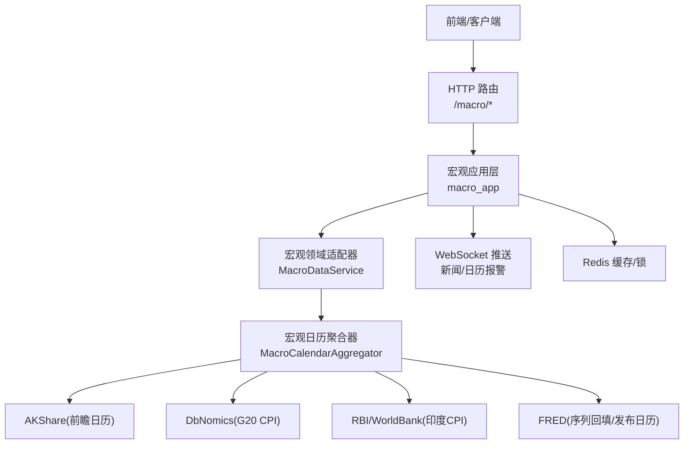
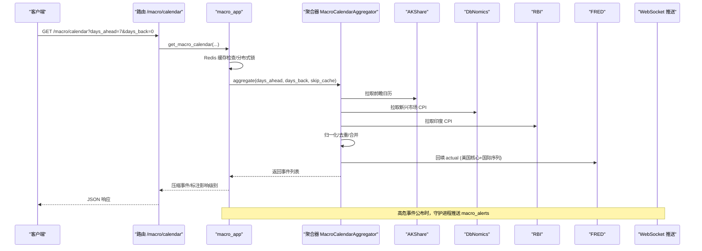
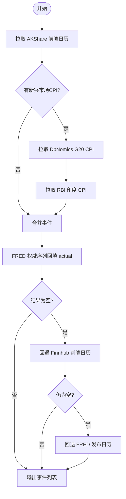
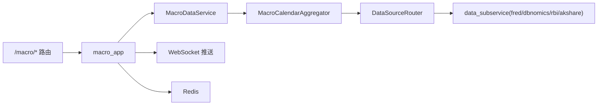

# 宏观经济数据分析

<cite>
**本文引用的文件**
- [backend/app/macro_app.py](file://backend/app/macro_app.py)
- [backend/routers/macro.py](file://backend/routers/macro.py)
- [backend/services/macro/macro_calendar_service.py](file://backend/services/macro/macro_calendar_service.py)
- [backend/services/macro/fred_service.py](file://backend/services/macro/fred_service.py)
- [backend/services/macro/dbnomics.py](file://backend/services/macro/dbnomics.py)
- [backend/services/macro/rbi.py](file://backend/services/macro/rbi.py)
- [backend/services/datasource/business/macro.py](file://backend/services/datasource/business/macro.py)
- [backend/workers/macro/alert_daemon.py](file://backend/workers/macro/alert_daemon.py)
- [backend/services/macro/sentiment_service.py](file://backend/services/macro/sentiment_service.py)
</cite>

## 目录
1. [简介](#简介)
2. [项目结构](#项目结构)
3. [核心组件](#核心组件)
4. [架构总览](#架构总览)
5. [详细组件分析](#详细组件分析)
6. [依赖关系分析](#依赖关系分析)
7. [性能与可用性](#性能与可用性)
8. [故障排查指南](#故障排查指南)
9. [结论](#结论)
10. [附录：指标与可视化](#附录：指标与可视化)

## 简介
本技术文档面向宏观分析师与机构投资者，系统化阐述 Quant Agent 的宏观经济数据分析服务。内容覆盖多源数据集成（美联储 FRED、国际数据库 DbNomics、中国人民银行 RBI 等）、关键宏观因子跟踪（利率走势、通胀预期、就业、GDP、货币供应量等）、宏观经济日历与预警、数据标准化与跨市场可比性设计、以及可视化与量化分析能力。通过统一的数据聚合层与缓存/降级策略，确保在高并发与外部源不稳定场景下的稳定可用。

## 项目结构
后端以 FastAPI 路由为边界，业务编排集中在应用层，宏观数据的多源采集与聚合下沉至 services 层，并通过 data_subservice 远程代理访问具体数据源。宏观日历、序列数据、情绪风向标、资金流向、FedWatch 面板等能力均在此框架内提供 HTTP/WebSocket 接口。

图表来源
- [backend/routers/macro.py:42-147](file://backend/routers/macro.py#L42-L147)
- [backend/app/macro_app.py:58-198](file://backend/app/macro_app.py#L58-L198)
- [backend/services/macro/macro_calendar_service.py:24-95](file://backend/services/macro/macro_calendar_service.py#L24-L95)

章节来源
- [backend/routers/macro.py:1-147](file://backend/routers/macro.py#L1-L147)
- [backend/app/macro_app.py:1-198](file://backend/app/macro_app.py#L1-L198)

## 核心组件
- 宏观日历聚合器：统一拉取并归一化多源事件，按国家/事件/日期去重合并，优先保留更完整记录；随后用 FRED 权威序列回填 actual；全空时回退到 Finnhub/FRED 发布日历。
- FRED 服务：提供宏观序列观测值获取与缓存；支持事件关键词到序列映射，用于实际值回填；提供发布日历拉取与回填。
- DbNomics/RBI 服务：免费新兴市场 CPI 补充，覆盖印度、巴西、墨西哥等盲区，作为 actual 回填或独立事件源。
- 宏观领域适配器：面向业务的统一入口，封装 get_macro_series、get_economic_calendar、FedWatch 面板等。
- 应用层 macro_app：对外暴露 HTTP/WebSocket 接口，负责缓存、并发控制、AI 前瞻推演、资金流看板等。
- 守护进程 alert_daemon：定时扫描高危事件，数据公布后即时通知并广播 WebSocket。

章节来源
- [backend/services/macro/macro_calendar_service.py:24-253](file://backend/services/macro/macro_calendar_service.py#L24-L253)
- [backend/services/macro/fred_service.py:12-330](file://backend/services/macro/fred_service.py#L12-L330)
- [backend/services/macro/dbnomics.py:29-147](file://backend/services/macro/dbnomics.py#L29-L147)
- [backend/services/macro/rbi.py:9-95](file://backend/services/macro/rbi.py#L9-L95)
- [backend/services/datasource/business/macro.py:20-164](file://backend/services/datasource/business/macro.py#L20-L164)
- [backend/app/macro_app.py:58-800](file://backend/app/macro_app.py#L58-L800)
- [backend/workers/macro/alert_daemon.py:23-131](file://backend/workers/macro/alert_daemon.py#L23-L131)

## 架构总览
系统采用“薄路由 + 厚业务 + 远端数据源”的分层架构：
- 路由层仅做参数校验与转发。
- 应用层负责缓存、并发锁、AI 增强、结果压缩与降级。
- 业务适配层提供语义化 API（如 FedWatch 面板）。
- 聚合层协调多源数据，进行归一化、合并、回填与兜底。
- 数据源通过 DataSourceRouter 远程调用 data_subservice，解耦直连。

图表来源
- [backend/routers/macro.py:42-68](file://backend/routers/macro.py#L42-L68)
- [backend/app/macro_app.py:58-198](file://backend/app/macro_app.py#L58-L198)
- [backend/services/macro/macro_calendar_service.py:43-95](file://backend/services/macro/macro_calendar_service.py#L43-L95)
- [backend/services/macro/fred_service.py:184-226](file://backend/services/macro/fred_service.py#L184-L226)
- [backend/workers/macro/alert_daemon.py:23-131](file://backend/workers/macro/alert_daemon.py#L23-L131)

## 详细组件分析

### 宏观日历多源聚合
- 主源 AKShare 提供中国及全球前瞻日历。
- 新兴市场 CPI 由 DbNomics（OECD G20）与 RBI（WorldBank 印度 CPI）补充，避免收费源依赖。
- 去重合并策略：按国家/事件/日期键，选择字段更完整的记录。
- FRED 回填：将事件文本与国家匹配到权威序列，取事件日期前最新观测值回填 actual。
- 兜底路径：若全空，回退到 Finnhub 或 FRED 发布日历。

图表来源
- [backend/services/macro/macro_calendar_service.py:43-95](file://backend/services/macro/macro_calendar_service.py#L43-L95)
- [backend/services/macro/dbnomics.py:44-130](file://backend/services/macro/dbnomics.py#L44-L130)
- [backend/services/macro/rbi.py:20-90](file://backend/services/macro/rbi.py#L20-L90)
- [backend/services/macro/fred_service.py:184-226](file://backend/services/macro/fred_service.py#L184-L226)

章节来源
- [backend/services/macro/macro_calendar_service.py:24-253](file://backend/services/macro/macro_calendar_service.py#L24-L253)

### FRED 宏观序列与回填
- 序列观测值：通过 data_source_router 远程获取，带 Redis 缓存与防击穿锁；对单点异常数据跳过缓存以防脏锁定。
- 事件回填：维护事件关键词到序列 ID 的映射（美国核心 CPI/PCE、非农、失业率、GDP、联邦基金利率、初请失业金等），按事件日期选取最新观测值回填。
- 发布日历：拉取未来数年的发布日期，过滤到时间窗内，并按需回填 actual。

章节来源
- [backend/services/macro/fred_service.py:28-128](file://backend/services/macro/fred_service.py#L28-L128)
- [backend/services/macro/fred_service.py:130-226](file://backend/services/macro/fred_service.py#L130-L226)
- [backend/services/macro/fred_service.py:228-325](file://backend/services/macro/fred_service.py#L228-L325)

### DbNomics 与 RBI 新兴市场 CPI
- DbNomics：拉取 OECD G20 CPI 年度同比，覆盖印度、巴西、墨西哥等，构造高影响事件用于回填或展示。
- RBI：WorldBank 开放 API 获取印度 CPI YoY，作为无 Key 兜底源，仅回填 India CPI 事件的 actual/previous，不伪造发布日。

章节来源
- [backend/services/macro/dbnomics.py:29-147](file://backend/services/macro/dbnomics.py#L29-L147)
- [backend/services/macro/rbi.py:9-95](file://backend/services/macro/rbi.py#L9-L95)

### 宏观领域适配器与 FedWatch 面板
- MacroDataService：统一对外提供 get_macro_series、get_economic_calendar、公司新闻等能力。
- FedWatch 面板：从 Futu 原始数据中识别会议日期列与利率区间概率列，计算下一会议隐含利率与政策斜率（hawkish/dovish/flat），失败时给出 note 而非崩溃。

章节来源
- [backend/services/datasource/business/macro.py:20-164](file://backend/services/datasource/business/macro.py#L20-L164)

### 应用层：缓存、AI 前瞻与资金流看板
- 宏观日历：Redis 缓存（含自然日失效键）、细粒度异步锁防击穿；对即将发生的高危事件进行 LLM 前瞻推演并缓存。
- 财报日历：类似缓存与 AI 前瞻逻辑，叠加中文名称映射。
- 资金流看板：并行抓取北向/南向/港股通/三市场板块/美股大单净流入，任一子任务失败降级为 None，绝不注入假数据。

章节来源
- [backend/app/macro_app.py:58-198](file://backend/app/macro_app.py#L58-L198)
- [backend/app/macro_app.py:201-390](file://backend/app/macro_app.py#L201-L390)
- [backend/app/macro_app.py:498-661](file://backend/app/macro_app.py#L498-L661)

### 宏观经济日历服务与实时推送
- 守护进程：每分钟轮询未来一天的高危事件，当 actual 出现时生成告警消息，调用通知服务并广播到 Redis channel，供 WebSocket 订阅。
- WebSocket：/macro/news/ws 与 /macro/calendar/ws 分别推送新闻快照与当日宏观事件，握手使用 JWT 鉴权。

章节来源
- [backend/workers/macro/alert_daemon.py:23-131](file://backend/workers/macro/alert_daemon.py#L23-L131)
- [backend/routers/macro.py:155-296](file://backend/routers/macro.py#L155-L296)

## 依赖关系分析
- 路由层依赖应用层函数，应用层依赖聚合器与 FRED/DbNomics/RBI 服务，所有数据源通过 DataSourceRouter 远程调用 data_subservice。
- 聚合器内部依赖 market_data 抽象，避免循环导入；FRED 回填依赖事件关键词映射。
- 守护进程依赖通知服务与 LLM 服务进行秒评与推送。

图表来源
- [backend/routers/macro.py:42-147](file://backend/routers/macro.py#L42-L147)
- [backend/services/datasource/business/macro.py:20-164](file://backend/services/datasource/business/macro.py#L20-L164)
- [backend/services/macro/macro_calendar_service.py:24-95](file://backend/services/macro/macro_calendar_service.py#L24-L95)

章节来源
- [backend/routers/macro.py:1-147](file://backend/routers/macro.py#L1-L147)
- [backend/services/datasource/business/macro.py:1-164](file://backend/services/datasource/business/macro.py#L1-L164)

## 性能与可用性
- 缓存策略：
  - 宏观日历：按“天”失效的 Redis key，TTL 约 2 小时并加随机抖动；LLM 前瞻推演按事件哈希缓存 3 天。
  - FRED 序列：按“天”失效，TTL 约 6 小时；单点异常数据跳过缓存。
  - DbNomics/RBI：7 天 TTL 缓存。
- 并发与防击穿：
  - 基于 asyncio.Lock 的细粒度锁池，双重检查锁（DCL）防止缓存击穿。
  - 资金流看板并行抓取子任务，失败降级为 None。
- 降级与容错：
  - 多源聚合失败时回退到 Finnhub/FRED 发布日历。
  - 全空时返回 warning 状态与明确提示，不注入假数据。
- 可观测性：
  - 日志与告警通道（macro_alerts）便于前端实时展示。

[本节为通用性能讨论，无需特定文件引用]

## 故障排查指南
- 宏观日历无数据：
  - 检查各数据源 API Key 与网络连通性；查看聚合器 sources_contributed 与 message。
  - 确认 Redis 缓存是否命中或过期；必要时 force_refresh。
- FRED 序列为空：
  - 确认 series_id 合法；检查 data_subservice 健康；观察是否因单点异常被跳过缓存。
- 新兴市场 CPI 缺失：
  - 检查 DbNomics 与 RBI 子服务状态；关注 India CPI 回填逻辑。
- 实时推送不生效：
  - 验证 WebSocket 握手 token；确认 Redis pubsub channel macro_alerts 正常。
- 资金流看板部分为空：
  - 检查北向/南向/港股通/板块/美股大单子任务状态；任一失败不影响整体返回。

章节来源
- [backend/app/macro_app.py:58-198](file://backend/app/macro_app.py#L58-L198)
- [backend/services/macro/fred_service.py:28-128](file://backend/services/macro/fred_service.py#L28-L128)
- [backend/services/macro/dbnomics.py:44-130](file://backend/services/macro/dbnomics.py#L44-L130)
- [backend/services/macro/rbi.py:20-90](file://backend/services/macro/rbi.py#L20-L90)
- [backend/routers/macro.py:155-296](file://backend/routers/macro.py#L155-L296)

## 结论
Quant Agent 的宏观经济数据分析服务通过多源聚合、权威回填、严格缓存与降级策略，提供了稳定、可扩展且低延迟的宏观数据能力。其宏观日历、序列数据、情绪风向标、资金流看板与 FedWatch 面板共同构成研究平台的核心。结合 WebSocket 实时推送与 LLM 前瞻推演，可为宏观分析师与机构投资者提供及时、可信的决策支持。

[本节为总结性内容，无需特定文件引用]

## 附录：指标与可视化
- 关键宏观因子跟踪：
  - 利率走势：联邦基金利率（FEDFUNDS）、隐含利率与政策斜率（FedWatch 面板）。
  - 通胀预期：核心 PCE、CPI（美国与国际序列），新兴市场 CPI（DbNomics/RBI）。
  - 就业数据：非农就业（PAYEMS）、初请失业金（ICSA）、失业率（UNRATE）。
  - GDP 增长：GDP 序列。
  - 货币供应量：可通过 FRED 序列扩展接入（如 M2 等）。
- 可视化建议：
  - 趋势图表：FRED 序列观测值折线（日期-数值），支持最近 N 点与强制刷新。
  - 相关性分析：宏观因子与资产价格（指数、汇率、商品）滚动相关矩阵。
  - 预测模型：基于历史序列的趋势外推与回归模型（需结合领域知识）。
  - 情绪风向标：P/C Ratio、VIX、信用利差的历史趋势。
- 数据来源与标准化：
  - 汇率调整：在跨市场比较时，使用一致汇率折算为基准货币。
  - 季节性因素：对月度/季度序列进行季节调整（如 X-13ARIMA-SEATS）。
  - 数据质量评估：缺失值比例、异常值检测、来源一致性校验。

[本节为概念性说明，无需特定文件引用]