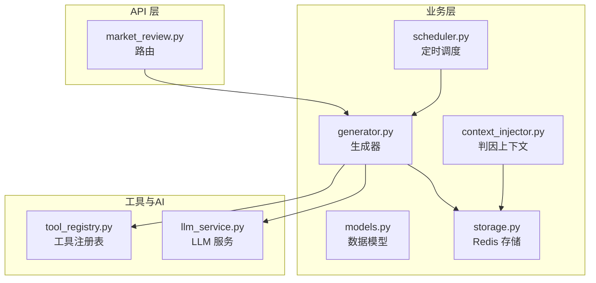
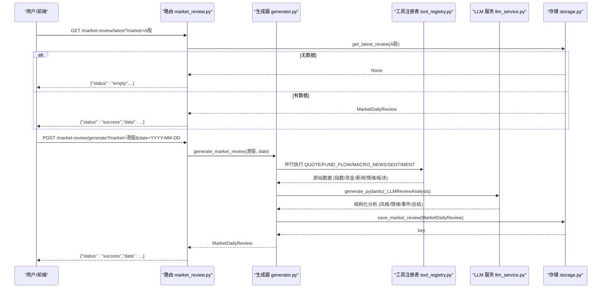
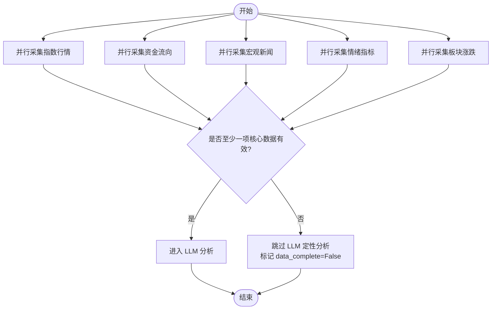
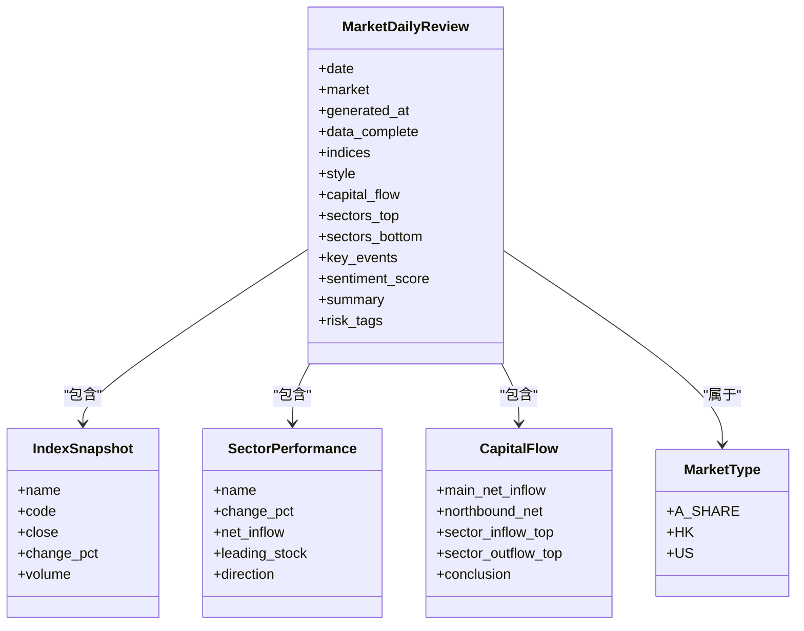
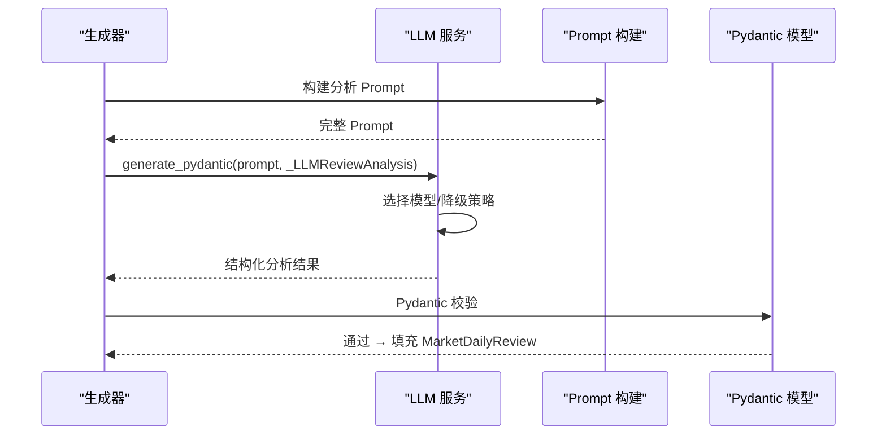
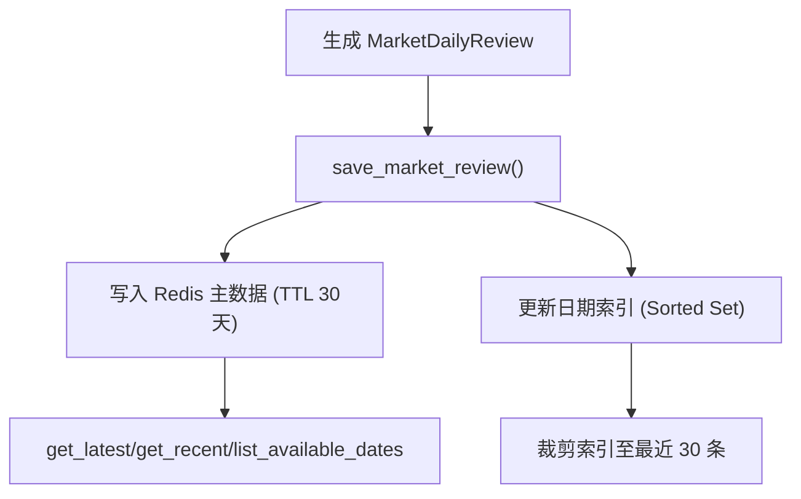
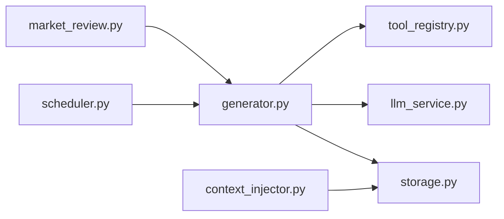

# 市场复盘生成引擎

<cite>
**本文引用的文件**
- [backend/routers/market_review.py](file://backend/routers/market_review.py)
- [backend/services/market_review/generator.py](file://backend/services/market_review/generator.py)
- [backend/services/market_review/models.py](file://backend/services/market_review/models.py)
- [backend/services/market_review/storage.py](file://backend/services/market_review/storage.py)
- [backend/services/market_review/scheduler.py](file://backend/services/market_review/scheduler.py)
- [backend/services/market_review/context_injector.py](file://backend/services/market_review/context_injector.py)
- [hermes_agent/tool_registry.py](file://hermes_agent/tool_registry.py)
- [backend/services/ai_narrator/llm_service.py](file://backend/services/ai_narrator/llm_service.py)
</cite>

## 目录
1. [简介](#简介)
2. [项目结构](#项目结构)
3. [核心组件](#核心组件)
4. [架构总览](#架构总览)
5. [详细组件分析](#详细组件分析)
6. [依赖关系分析](#依赖关系分析)
7. [性能与可靠性](#性能与可靠性)
8. [故障排查指南](#故障排查指南)
9. [结论](#结论)
10. [附录：API 与存储键约定](#附录api-与存储键约定)

## 简介
本技术文档面向投资分析师与工程团队，系统化说明 Quant Agent 的“每日市场复盘生成引擎”。该引擎在每日收盘后自动完成数据采集（指数行情、资金流向、板块涨跌、宏观新闻、情绪指标），通过 LLM 进行结构化分析（风格判定、情绪评分、关键事件提取），最终组装并持久化复盘报告。系统支持 A 股、港股、美股多市场，提供查询接口与定时触发机制，并在数据缺失时启用“零幻觉”保护，确保输出可靠。

## 项目结构
市场复盘功能位于后端服务层，围绕路由、生成器、模型、存储、调度与上下文注入展开：
- 路由层：对外暴露复盘查询与手动触发生成的 API
- 生成器：编排数据采集、LLM 分析与报告组装
- 模型：定义复盘数据结构与市场类型枚举
- 存储：基于 Redis 的复盘持久化与索引管理
- 调度：按各市场收盘时间定时触发复盘
- 上下文注入：为个股分析注入近三日复盘作为判因背景

**图示来源**
- [backend/routers/market_review.py:1-95](file://backend/routers/market_review.py#L1-L95)
- [backend/services/market_review/generator.py:1-476](file://backend/services/market_review/generator.py#L1-L476)
- [backend/services/market_review/models.py:1-143](file://backend/services/market_review/models.py#L1-L143)
- [backend/services/market_review/storage.py:1-134](file://backend/services/market_review/storage.py#L1-L134)
- [backend/services/market_review/scheduler.py:1-93](file://backend/services/market_review/scheduler.py#L1-L93)
- [backend/services/market_review/context_injector.py:1-229](file://backend/services/market_review/context_injector.py#L1-L229)
- [hermes_agent/tool_registry.py:1-261](file://hermes_agent/tool_registry.py#L1-L261)
- [backend/services/ai_narrator/llm_service.py:1-425](file://backend/services/ai_narrator/llm_service.py#L1-L425)

**章节来源**
- [backend/routers/market_review.py:1-95](file://backend/routers/market_review.py#L1-L95)
- [backend/services/market_review/generator.py:1-476](file://backend/services/market_review/generator.py#L1-L476)
- [backend/services/market_review/models.py:1-143](file://backend/services/market_review/models.py#L1-L143)
- [backend/services/market_review/storage.py:1-134](file://backend/services/market_review/storage.py#L1-L134)
- [backend/services/market_review/scheduler.py:1-93](file://backend/services/market_review/scheduler.py#L1-L93)
- [backend/services/market_review/context_injector.py:1-229](file://backend/services/market_review/context_injector.py#L1-L229)
- [hermes_agent/tool_registry.py:1-261](file://hermes_agent/tool_registry.py#L1-L261)
- [backend/services/ai_narrator/llm_service.py:1-425](file://backend/services/ai_narrator/llm_service.py#L1-L425)

## 核心组件
- 路由层：提供最新复盘、精确查询、最近 N 天、可用日期列表、手动触发生成等接口
- 生成器：并行采集指数、资金流、新闻、情绪、板块；构建 LLM Prompt；调用 LLM 结构化分析；组装 MarketDailyReview；持久化
- 模型：MarketType、MarketStyle、SentimentLevel、IndexSnapshot、SectorPerformance、CapitalFlow、MarketEvent、MarketDailyReview
- 存储：Redis 主数据与日期索引，TTL 30 天，支持清理脏数据
- 调度：按 UTC 时间在各市场收盘后触发复盘，防重复触发
- 上下文注入：从用户文本推断市场，拉取近三日复盘摘要，注入到个股分析流程

**章节来源**
- [backend/routers/market_review.py:1-95](file://backend/routers/market_review.py#L1-L95)
- [backend/services/market_review/generator.py:1-476](file://backend/services/market_review/generator.py#L1-L476)
- [backend/services/market_review/models.py:1-143](file://backend/services/market_review/models.py#L1-L143)
- [backend/services/market_review/storage.py:1-134](file://backend/services/market_review/storage.py#L1-L134)
- [backend/services/market_review/scheduler.py:1-93](file://backend/services/market_review/scheduler.py#L1-L93)
- [backend/services/market_review/context_injector.py:1-229](file://backend/services/market_review/context_injector.py#L1-L229)

## 架构总览
市场复盘生成引擎采用“采集→分析→组装→存储”的分阶段流水线，结合工具注册表与 LLM 服务实现可扩展的数据源接入与结构化分析。

**图示来源**
- [backend/routers/market_review.py:1-95](file://backend/routers/market_review.py#L1-L95)
- [backend/services/market_review/generator.py:1-476](file://backend/services/market_review/generator.py#L1-L476)
- [hermes_agent/tool_registry.py:1-261](file://hermes_agent/tool_registry.py#L1-L261)
- [backend/services/ai_narrator/llm_service.py:1-425](file://backend/services/ai_narrator/llm_service.py#L1-L425)
- [backend/services/market_review/storage.py:1-134](file://backend/services/market_review/storage.py#L1-L134)

## 详细组件分析

### 数据采集阶段
- 指数行情：按市场映射的核心指数集合，使用工具注册表以 QUOTE 动作并行获取，单任务超时控制
- 资金流向：以代表性 ETF 为主力资金方向代理，使用 FUND_FLOW 动作
- 宏观新闻：调用宏观新闻工具，限制条数避免过长 Prompt
- 情绪指标：调用情绪历史工具，用于 VIX/P-C Ratio 等客观指标
- 板块表现：以行业 ETF 作为板块代理，分别计算领涨与领跌前 5

**图示来源**
- [backend/services/market_review/generator.py:110-236](file://backend/services/market_review/generator.py#L110-L236)
- [backend/services/market_review/generator.py:346-384](file://backend/services/market_review/generator.py#L346-L384)

**章节来源**
- [backend/services/market_review/generator.py:110-236](file://backend/services/market_review/generator.py#L110-L236)
- [backend/services/market_review/generator.py:346-384](file://backend/services/market_review/generator.py#L346-L384)

### 多市场支持机制
- 核心指数映射：A 股（上证、深证成指、创业板指）、港股（恒生指数、恒生科技）、美股（道琼斯、纳斯达克综合、标普500）
- 板块 ETF 代理：A 股/港股/美股分别维护行业 ETF 列表，用以近似板块涨跌
- 资金流代理：A 股用沪深300ETF、港股用盈富基金、美股用 SPY
- 市场类型枚举：MarketType 统一表示 A 股/港股/美股

**图示来源**
- [backend/services/market_review/models.py:21-143](file://backend/services/market_review/models.py#L21-L143)
- [backend/services/market_review/generator.py:32-83](file://backend/services/market_review/generator.py#L32-L83)

**章节来源**
- [backend/services/market_review/generator.py:32-83](file://backend/services/market_review/generator.py#L32-L83)
- [backend/services/market_review/models.py:21-143](file://backend/services/market_review/models.py#L21-L143)

### LLM 结构化分析阶段
- Prompt 构建：将指数、板块、资金、情绪、新闻汇总为结构化输入
- 结构化输出：Pydantic 模型约束风格、情绪、事件、总结、展望、风险标签
- 降级与离线：LLM 服务支持分级路由与 Ollama 降级，离线 stub 模式可返回确定性最小合法 JSON
- 温度与稳定性：低温度保证输出稳定，便于下游解析

**图示来源**
- [backend/services/market_review/generator.py:239-321](file://backend/services/market_review/generator.py#L239-L321)
- [backend/services/ai_narrator/llm_service.py:284-348](file://backend/services/ai_narrator/llm_service.py#L284-L348)

**章节来源**
- [backend/services/market_review/generator.py:239-321](file://backend/services/market_review/generator.py#L239-L321)
- [backend/services/ai_narrator/llm_service.py:284-348](file://backend/services/ai_narrator/llm_service.py#L284-L348)

### 报告组装与持久化
- 组装：将采集数据与 LLM 分析结果合并为 MarketDailyReview，设置 data_complete 标志
- 存储：写入 Redis 主键（含 TTL 30 天），更新日期索引（Sorted Set），裁剪保留最近 30 条
- 查询：支持最新、精确日期、最近 N 天、可用日期列表
- 清理：提供清理脏数据复盘的工具，删除 data_complete=False 或核心数据全空的记录

**图示来源**
- [backend/services/market_review/generator.py:386-429](file://backend/services/market_review/generator.py#L386-L429)
- [backend/services/market_review/storage.py:24-89](file://backend/services/market_review/storage.py#L24-L89)
- [backend/services/market_review/storage.py:101-134](file://backend/services/market_review/storage.py#L101-L134)

**章节来源**
- [backend/services/market_review/generator.py:386-429](file://backend/services/market_review/generator.py#L386-L429)
- [backend/services/market_review/storage.py:24-89](file://backend/services/market_review/storage.py#L24-L89)
- [backend/services/market_review/storage.py:101-134](file://backend/services/market_review/storage.py#L101-L134)

### AI 驱动的市场风格判定、情绪评分与关键事件提取
- 市场风格：基于指数与板块表现，判定大盘价值/成长、小盘价值/成长、均衡轮动、防御避险、投机炒作
- 情绪评分：依据 VIX/P-C Ratio 等客观指标，给出 0-100 分数与等级（极度恐惧/恐惧/中性/贪婪/极度贪婪）
- 关键事件：从宏观新闻中提取 3-5 条重要事件，标注影响方向与受影响板块

**章节来源**
- [backend/services/market_review/generator.py:91-107](file://backend/services/market_review/generator.py#L91-L107)
- [backend/services/market_review/generator.py:239-295](file://backend/services/market_review/generator.py#L239-L295)
- [backend/services/market_review/models.py:29-49](file://backend/services/market_review/models.py#L29-L49)

### 数据完整性校验与“零幻觉”保护
- 红线规则：当核心客观数据（指数/板块/资金）全部缺失时，禁止 LLM 自由发挥生成风格与事件定性
- 标记与提示：data_complete=False，summary 明确提示数据缺失，不可作为个股判因依据
- 运维清理：提供 purge_incomplete_reviews 清理存量脏数据

**章节来源**
- [backend/services/market_review/generator.py:363-424](file://backend/services/market_review/generator.py#L363-L424)
- [backend/services/market_review/storage.py:101-134](file://backend/services/market_review/storage.py#L101-L134)

### 错误处理、超时控制与重试机制
- 采集超时：每个工具调用设置 30 秒超时，失败不影响整体流程
- 熔断与限流：工具注册表内置熔断器中间件与令牌桶限流，防止级联故障
- LLM 降级：主供应商连续失败阈值后自动切换本地 Ollama，探测可达性避免死路
- 调度防重：同一市场同一天只触发一次，失败时删除去重键允许重试

**章节来源**
- [backend/services/market_review/generator.py:86-137](file://backend/services/market_review/generator.py#L86-L137)
- [hermes_agent/tool_registry.py:17-40](file://hermes_agent/tool_registry.py#L17-L40)
- [hermes_agent/tool_registry.py:181-190](file://hermes_agent/tool_registry.py#L181-L190)
- [backend/services/ai_narrator/llm_service.py:121-161](file://backend/services/ai_narrator/llm_service.py#L121-L161)
- [backend/services/market_review/scheduler.py:32-84](file://backend/services/market_review/scheduler.py#L32-L84)

### 复盘报告的持久化存储方案与查询接口
- 存储键空间：quant:market_review:{market}:{date}（主数据，TTL 30 天）；quant:market_review:index:{market}（日期索引）
- 查询接口：
  - GET /market-review/latest?market=A股
  - GET /market-review/query?market=A股&date=YYYY-MM-DD
  - GET /market-review/recent?market=A股&days=3
  - GET /market-review/dates?market=A股&limit=30
  - POST /market-review/generate?market=A股&date=YYYY-MM-DD

**章节来源**
- [backend/services/market_review/storage.py:24-89](file://backend/services/market_review/storage.py#L24-L89)
- [backend/routers/market_review.py:23-95](file://backend/routers/market_review.py#L23-L95)

### 判因上下文注入（为个股分析提供复盘背景）
- 市场检测：从用户文本中识别 A 股/港股/美股标的
- 上下文构建：拉取近 3 日复盘，格式化指数、风格、资金、情绪、风险标签与总结
- 集成点：Hermes Agent chat_stream_async 在检测到个股标的时自动注入

**章节来源**
- [backend/services/market_review/context_injector.py:18-163](file://backend/services/market_review/context_injector.py#L18-L163)
- [backend/services/market_review/context_injector.py:165-229](file://backend/services/market_review/context_injector.py#L165-L229)

## 依赖关系分析
- 路由依赖生成器与存储
- 生成器依赖工具注册表与 LLM 服务
- 存储依赖 Redis 客户端
- 调度依赖生成器与 Redis 去重键
- 上下文注入依赖存储与模型

**图示来源**
- [backend/routers/market_review.py:1-95](file://backend/routers/market_review.py#L1-L95)
- [backend/services/market_review/generator.py:1-476](file://backend/services/market_review/generator.py#L1-L476)
- [hermes_agent/tool_registry.py:1-261](file://hermes_agent/tool_registry.py#L1-L261)
- [backend/services/ai_narrator/llm_service.py:1-425](file://backend/services/ai_narrator/llm_service.py#L1-L425)
- [backend/services/market_review/storage.py:1-134](file://backend/services/market_review/storage.py#L1-L134)
- [backend/services/market_review/scheduler.py:1-93](file://backend/services/market_review/scheduler.py#L1-L93)
- [backend/services/market_review/context_injector.py:1-229](file://backend/services/market_review/context_injector.py#L1-L229)

**章节来源**
- [backend/routers/market_review.py:1-95](file://backend/routers/market_review.py#L1-L95)
- [backend/services/market_review/generator.py:1-476](file://backend/services/market_review/generator.py#L1-L476)
- [hermes_agent/tool_registry.py:1-261](file://hermes_agent/tool_registry.py#L1-L261)
- [backend/services/ai_narrator/llm_service.py:1-425](file://backend/services/ai_narrator/llm_service.py#L1-L425)
- [backend/services/market_review/storage.py:1-134](file://backend/services/market_review/storage.py#L1-L134)
- [backend/services/market_review/scheduler.py:1-93](file://backend/services/market_review/scheduler.py#L1-L93)
- [backend/services/market_review/context_injector.py:1-229](file://backend/services/market_review/context_injector.py#L1-L229)

## 性能与可靠性
- 并发采集：指数、资金、新闻、情绪、板块并行采集，降低端到端延迟
- 超时控制：单工具采集 30 秒超时，避免阻塞
- 缓存与限流：工具结果缓存与令牌桶限流，减少外部依赖压力
- 熔断与降级：工具熔断器与 LLM 降级至本地 Ollama，提升鲁棒性
- 存储 TTL：复盘数据 30 天自动过期，索引裁剪保持轻量

[本节为通用指导，不直接分析具体文件]

## 故障排查指南
- 复盘为空：检查路由参数 market/date 是否正确；确认存储层是否有数据
- 生成失败：查看工具注册表执行日志与 LLM 服务健康状态；确认网络与鉴权配置
- 数据缺失：关注 data_complete 标志与 summary 中的警告信息；必要时运行清理脏数据脚本
- 调度未触发：检查环境变量 MRKT_SCHEDULE_ENABLED 与当前 UTC 时间匹配；确认 Redis 去重键状态

**章节来源**
- [backend/routers/market_review.py:26-95](file://backend/routers/market_review.py#L26-L95)
- [backend/services/market_review/storage.py:101-134](file://backend/services/market_review/storage.py#L101-L134)
- [backend/services/market_review/scheduler.py:36-84](file://backend/services/market_review/scheduler.py#L36-L84)
- [backend/services/ai_narrator/llm_service.py:163-189](file://backend/services/ai_narrator/llm_service.py#L163-L189)

## 结论
市场复盘生成引擎通过严谨的数据采集、LLM 结构化分析与“零幻觉”保护，为投资分析师提供自动化、可靠的每日市场复盘工具。其多市场支持、定时调度、持久化存储与查询接口，以及判因上下文注入能力，构成了完整的复盘生产与消费闭环。建议在生产环境中持续监控工具健康、LLM 可用性、Redis 容量与调度触发情况，以确保高质量输出。

[本节为总结性内容，不直接分析具体文件]

## 附录：API 与存储键约定
- API 端点
  - GET /market-review/latest?market=A股
  - GET /market-review/query?market=A股&date=YYYY-MM-DD
  - GET /market-review/recent?market=A股&days=3
  - GET /market-review/dates?market=A股&limit=30
  - POST /market-review/generate?market=A股&date=YYYY-MM-DD
- Redis 键空间
  - quant:market_review:{market}:{date}（主数据，TTL 30 天）
  - quant:market_review:index:{market}（日期索引，Sorted Set）

**章节来源**
- [backend/routers/market_review.py:23-95](file://backend/routers/market_review.py#L23-L95)
- [backend/services/market_review/storage.py:4-8](file://backend/services/market_review/storage.py#L4-L8)
- [backend/services/market_review/storage.py:24-89](file://backend/services/market_review/storage.py#L24-L89)