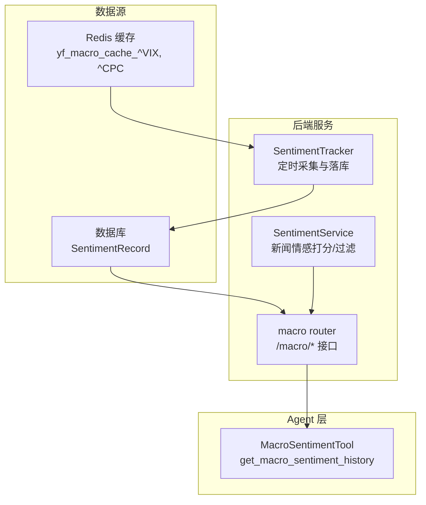
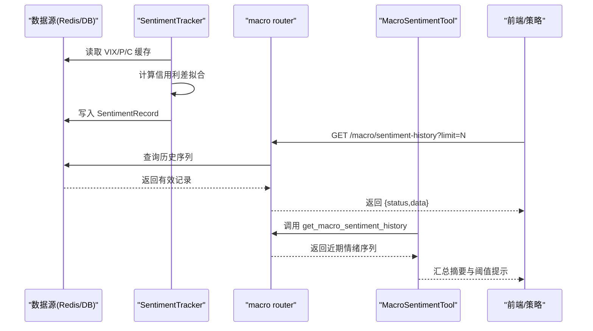
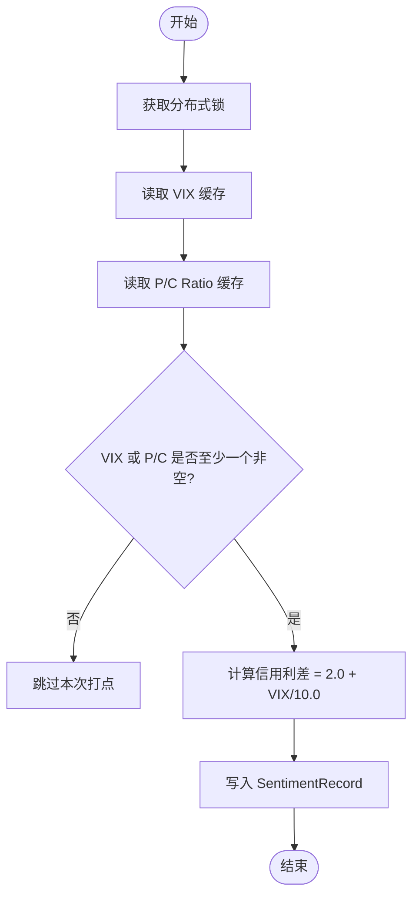
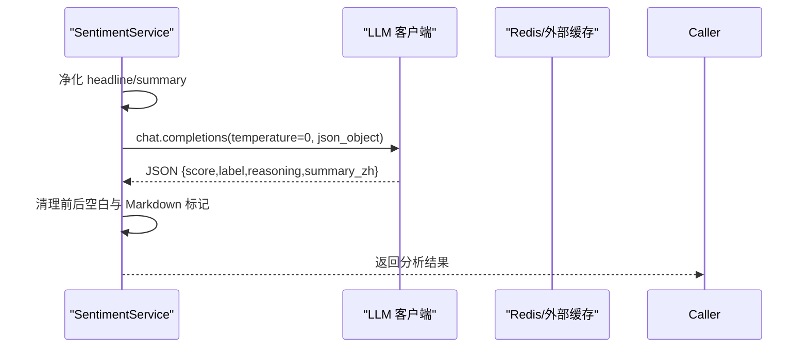
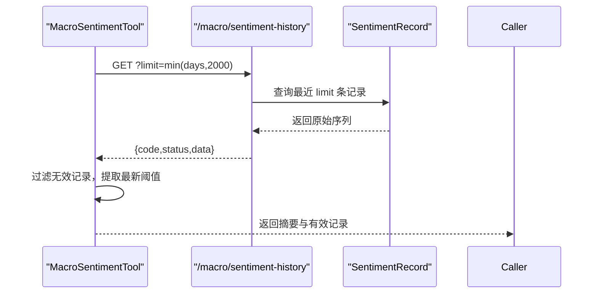
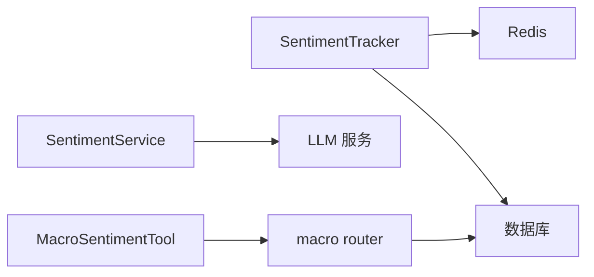

# 市场情绪分析

<cite>
**本文引用的文件**
- [backend/services/macro/sentiment_service.py](file://backend/services/macro/sentiment_service.py)
- [backend/services/macro/sentiment_tracker.py](file://backend/services/macro/sentiment_tracker.py)
- [backend/routers/macro.py](file://backend/routers/macro.py)
- [hermes_agent/tools/macro_sentiment_tool.py](file://hermes_agent/tools/macro_sentiment_tool.py)
- [prompts/tasks/sentiment_analysis.md](file://prompts/tasks/sentiment_analysis.md)
</cite>

## 目录
1. [简介](#简介)
2. [项目结构](#项目结构)
3. [核心组件](#核心组件)
4. [架构总览](#架构总览)
5. [详细组件分析](#详细组件分析)
6. [依赖关系分析](#依赖关系分析)
7. [性能考量](#性能考量)
8. [故障排查指南](#故障排查指南)
9. [结论](#结论)
10. [附录](#附录)

## 简介
本模块提供 Quant Agent 的市场情绪分析与监控能力，覆盖以下关键目标：
- 多源情绪指标采集与计算：CBOE 看跌/看涨期权比率（P/C Ratio）、VIX 恐慌指数、信用利差拟合、融资融券余额变化、北向资金流向等。
- 情绪指数标准化与综合评分：统一量纲、时间窗口选择、异常值处理机制。
- 数据采集、清洗与存储：支持历史回溯与实时监测。
- 趋势分析方法：短期波动识别、极端情绪预警、市场拐点判断。
- 可视化方案：情绪热力图、趋势图表、对比分析。
- 策略集成接口：为量化策略提供情绪因子输入。

## 项目结构
本模块由后端服务、HTTP 路由、Agent 工具与提示词模板组成，形成“采集—计算—存储—暴露—调用”的闭环：
- 采集与追踪：SentimentTracker 定时从 Redis 缓存读取 VIX/P/C 数据并持久化；同时通过宏观数据服务获取融资融券与北向资金等。
- 新闻情感分析：SentimentService 对新闻标题与摘要进行 LLM 打分与提纯。
- HTTP 暴露：macro router 提供 /macro/sentiment-history 等接口供前端或 Agent 调用。
- Agent 工具：MacroSentimentTool 封装历史情绪序列查询，便于智能体研判。
- 提示词规范：sentiment_analysis.md 定义新闻情感分析的 JSON 输出契约。

**图示来源**
- [backend/services/macro/sentiment_tracker.py:11-87](file://backend/services/macro/sentiment_tracker.py#L11-L87)
- [backend/services/macro/sentiment_service.py:27-86](file://backend/services/macro/sentiment_service.py#L27-L86)
- [backend/routers/macro.py:79-85](file://backend/routers/macro.py#L79-L85)
- [hermes_agent/tools/macro_sentiment_tool.py:32-58](file://hermes_agent/tools/macro_sentiment_tool.py#L32-L58)

**章节来源**
- [backend/services/macro/sentiment_tracker.py:11-107](file://backend/services/macro/sentiment_tracker.py#L11-L107)
- [backend/services/macro/sentiment_service.py:1-171](file://backend/services/macro/sentiment_service.py#L1-L171)
- [backend/routers/macro.py:79-147](file://backend/routers/macro.py#L79-L147)
- [hermes_agent/tools/macro_sentiment_tool.py:1-105](file://hermes_agent/tools/macro_sentiment_tool.py#L1-L105)
- [prompts/tasks/sentiment_analysis.md:1-25](file://prompts/tasks/sentiment_analysis.md#L1-L25)

## 核心组件
- SentimentTracker：每小时执行一次，从 Redis 读取 VIX 与 P/C Ratio，计算信用利差拟合值，写入数据库；具备分布式锁与数据完整性校验，避免空记录污染历史序列。
- SentimentService：对单条/批量新闻进行 LLM 情感打分与提纯，强制 JSON 输出，包含安全净化与错误兜底。
- macro router：对外暴露 /macro/sentiment-history、/macro/margin-trading、/macro/capital-flow-dashboard 等接口，聚合情绪与资金流数据。
- MacroSentimentTool：Agent 侧工具，调用后端 API 获取情绪历史序列，并进行有效性校验与阈值摘要。
- 提示词模板：定义新闻情感分析的输入输出格式，确保稳定解析。

**章节来源**
- [backend/services/macro/sentiment_tracker.py:11-107](file://backend/services/macro/sentiment_tracker.py#L11-L107)
- [backend/services/macro/sentiment_service.py:27-167](file://backend/services/macro/sentiment_service.py#L27-L167)
- [backend/routers/macro.py:79-147](file://backend/routers/macro.py#L79-L147)
- [hermes_agent/tools/macro_sentiment_tool.py:32-105](file://hermes_agent/tools/macro_sentiment_tool.py#L32-L105)
- [prompts/tasks/sentiment_analysis.md:1-25](file://prompts/tasks/sentiment_analysis.md#L1-L25)

## 架构总览
系统采用分层架构：数据源层（Redis/DB）→ 服务层（采集/计算/存储）→ 接口层（HTTP/WebSocket）→ 应用层（Agent/前端）。情绪指标以小时级打点入库，Agent 通过工具拉取最近 N 天序列进行分析；新闻情感分析可并发批处理，结果可接入策略或看板。

**图示来源**
- [backend/services/macro/sentiment_tracker.py:11-87](file://backend/services/macro/sentiment_tracker.py#L11-L87)
- [backend/routers/macro.py:79-85](file://backend/routers/macro.py#L79-L85)
- [hermes_agent/tools/macro_sentiment_tool.py:32-105](file://hermes_agent/tools/macro_sentiment_tool.py#L32-L105)

## 详细组件分析

### 情绪指标采集与计算（VIX、P/C Ratio、信用利差）
- 数据来源：
  - VIX：从 Redis 键 yf_macro_cache_^VIX 读取最新 close 值，兼容旧 MultiIndex 列名。
  - P/C Ratio：从 Redis 键 yf_macro_cache_^CPC 读取最新 close 值。
  - 信用利差：基于 VIX 拟合，公式为 2.0 + (VIX/10.0)。
- 数据完整性：若 VIX 与 P/C 均缺失，跳过本次打点，避免写入全 None 污染历史。
- 持久化：使用异步线程将记录写入数据库模型 SentimentRecord。

**图示来源**
- [backend/services/macro/sentiment_tracker.py:11-87](file://backend/services/macro/sentiment_tracker.py#L11-L87)

**章节来源**
- [backend/services/macro/sentiment_tracker.py:11-87](file://backend/services/macro/sentiment_tracker.py#L11-L87)

### 新闻情感分析（LLM 打分与提纯）
- 单条分析：对 headline 与 summary 进行安全净化后，调用轻量模型进行 JSON 结构化输出，字段包括 score、label、reasoning、summary_zh。
- 批量过滤：通过提示词让 LLM 区分重要公告与例行通知，返回 significant_indices 索引列表，仅保留高价值新闻。
- 并发处理：使用 asyncio.gather 并发请求，设置 return_exceptions=True 防止单条失败阻断整体流程。
- 错误处理：捕获异常并记录失败计数，返回默认中性结果。

**图示来源**
- [backend/services/macro/sentiment_service.py:27-86](file://backend/services/macro/sentiment_service.py#L27-L86)
- [prompts/tasks/sentiment_analysis.md:15-25](file://prompts/tasks/sentiment_analysis.md#L15-L25)

**章节来源**
- [backend/services/macro/sentiment_service.py:27-167](file://backend/services/macro/sentiment_service.py#L27-L167)
- [prompts/tasks/sentiment_analysis.md:1-25](file://prompts/tasks/sentiment_analysis.md#L1-L25)

### 情绪历史查询与阈值摘要（Agent 工具）
- 接口：GET /macro/sentiment-history，参数 limit 控制数据点数量。
- 工具：MacroSentimentTool 调用后端 API，提取最近 N 天有效记录，并生成阈值摘要（如 VIX<15 乐观、>25 恐慌；P/C<0.7 看涨、>1.0 看跌；Credit Spread<4.5% 安全、>4.5% 高危）。
- 数据完整性：若所有记录的核心字段均为 None，返回 data_available=false 并提示不可用，禁止空序列误导研判。

**图示来源**
- [backend/routers/macro.py:79-85](file://backend/routers/macro.py#L79-L85)
- [hermes_agent/tools/macro_sentiment_tool.py:32-105](file://hermes_agent/tools/macro_sentiment_tool.py#L32-L105)

**章节来源**
- [backend/routers/macro.py:79-85](file://backend/routers/macro.py#L79-L85)
- [hermes_agent/tools/macro_sentiment_tool.py:32-105](file://hermes_agent/tools/macro_sentiment_tool.py#L32-L105)

### 融资融券与北向资金（扩展情绪因子）
- 融资融券余额：通过 /macro/margin-trading 接口获取三市场余额数据，用于衡量杠杆交易热度与潜在抛压。
- 北向资金流向：通过 /macro/capital-flow-dashboard 聚合北向/南向及板块资金流，作为外资情绪与配置偏好的代理变量。
- 与情绪指标联动：可将融资融券变化率与北向净流入/流出叠加至情绪指数，增强多维信号。

**章节来源**
- [backend/routers/macro.py:144-147](file://backend/routers/macro.py#L144-L147)
- [backend/routers/macro.py:100-105](file://backend/routers/macro.py#L100-L105)

## 依赖关系分析
- 组件耦合：
  - SentimentTracker 依赖 Redis 缓存与数据库模型，解耦于上游数据源（yfinance 节点）。
  - SentimentService 依赖 LLM 服务与路由层，具备独立错误处理与降级策略。
  - macro router 作为薄边界，仅做参数映射与调用编排。
  - MacroSentimentTool 依赖后端 API，屏蔽网络与协议细节。
- 外部依赖：
  - Redis：缓存与分布式锁。
  - 数据库：持久化情绪历史。
  - LLM：新闻情感打分与提纯。
- 循环依赖：无直接循环依赖，各层职责清晰。

**图示来源**
- [backend/services/macro/sentiment_tracker.py:11-87](file://backend/services/macro/sentiment_tracker.py#L11-L87)
- [backend/services/macro/sentiment_service.py:27-86](file://backend/services/macro/sentiment_service.py#L27-L86)
- [backend/routers/macro.py:79-85](file://backend/routers/macro.py#L79-L85)
- [hermes_agent/tools/macro_sentiment_tool.py:32-58](file://hermes_agent/tools/macro_sentiment_tool.py#L32-L58)

**章节来源**
- [backend/services/macro/sentiment_tracker.py:11-107](file://backend/services/macro/sentiment_tracker.py#L11-L107)
- [backend/services/macro/sentiment_service.py:1-171](file://backend/services/macro/sentiment_service.py#L1-L171)
- [backend/routers/macro.py:79-147](file://backend/routers/macro.py#L79-L147)
- [hermes_agent/tools/macro_sentiment_tool.py:1-105](file://hermes_agent/tools/macro_sentiment_tool.py#L1-L105)

## 性能考量
- 并发与限流：新闻情感分析使用 asyncio.gather 并发请求，限制温度与响应格式以降低延迟与解析成本；失败不阻断整体流程。
- 缓存与去重：VIX/P/C 从 Redis 读取，减少上游压力；SentimentTracker 使用分布式锁避免重复写入。
- 数据库 IO：使用异步线程执行同步写库，避免阻塞网关。
- 数据完整性：空值保护与阈值摘要降低无效数据对下游的影响。

[本节提供通用指导，无需特定文件引用]

## 故障排查指南
- 数据缺失：
  - 现象：/macro/sentiment-history 返回空或全部字段为 None。
  - 排查：检查 Redis 键 yf_macro_cache_^VIX 与 yf_macro_cache_^CPC 是否存在且包含有效 close；确认 yfinance 节点是否正常。
  - 参考：SentimentTracker 在双源缺失时跳过打点。
- LLM 失败：
  - 现象：新闻情感分析返回 error 状态。
  - 排查：检查 LLM 客户端可用性、网络与配额；查看日志中的失败计数与错误信息。
  - 参考：SentimentService 的错误处理与降级返回中性结果。
- 锁竞争：
  - 现象：SentimentTracker 未获取到分布式锁，轮询重试。
  - 排查：确认 Redis 可用性与锁过期时间；检查多实例部署下的并发情况。
  - 参考：SentimentTracker 使用 set(nx=True, ex=1800) 实现锁。

**章节来源**
- [backend/services/macro/sentiment_tracker.py:18-21](file://backend/services/macro/sentiment_tracker.py#L18-L21)
- [backend/services/macro/sentiment_tracker.py:63-68](file://backend/services/macro/sentiment_tracker.py#L63-L68)
- [backend/services/macro/sentiment_service.py:77-86](file://backend/services/macro/sentiment_service.py#L77-L86)

## 结论
本模块构建了完整的市场情绪分析管线：从多源指标采集、LLM 新闻情感分析，到历史序列持久化与 Agent 工具暴露，形成了可回溯、可实时监测、可策略集成的情绪因子体系。通过分布式锁、数据完整性校验与并发优化，系统在稳定性与性能之间取得平衡。建议后续扩展北向资金与融资融券的变化率纳入综合评分，并结合可视化看板提升监控效率。

[本节总结性内容，无需特定文件引用]

## 附录

### 情绪指数标准化与综合评分算法（设计建议）
- 标准化方法：
  - Z-Score 标准化：对每个指标按滚动窗口计算均值与标准差，得到可比分数。
  - Min-Max 归一化：将指标映射到 [0,1] 区间，便于加权合成。
- 权重分配：
  - 动态权重：根据波动率或相关性调整权重，例如在高波动期提高 VIX 权重。
  - 固定权重：初始阶段可采用等权或经验权重（如 VIX 0.4、P/C 0.3、融资融券变化 0.15、北向资金 0.15）。
- 时间窗口选择：
  - 短期：5-10 日窗口捕捉短期波动。
  - 中期：20-60 日窗口反映趋势变化。
  - 长期：季度或年度窗口用于基准校准。
- 异常值处理：
  - 截尾法：剔除超过 3σ 的极端值。
  - 插补法：对缺失值使用前值填充或线性插值。
  - 回退机制：当数据源不可用时，降低该指标权重或暂时移除。

[本节为概念性设计，无需特定文件引用]

### 情绪趋势分析方法
- 短期波动识别：
  - 移动平均交叉：短期均线穿越长期均线触发信号。
  - 波动率突破：标准差或 ATR 突破阈值表明情绪剧烈变化。
- 极端情绪预警：
  - VIX > 25 或 P/C > 1.0 视为恐慌/过度看跌。
  - Credit Spread > 4.5% 视为高风险环境。
- 市场拐点判断：
  - 背离信号：价格与情绪指标出现背离时关注反转可能。
  - 收敛与发散：情绪指标收敛至均值后发散，可能预示趋势启动。

[本节为概念性分析，无需特定文件引用]

### 可视化展示方案
- 情绪热力图：按行业或资产类别展示情绪得分，颜色深浅表示强弱。
- 趋势图表：绘制 VIX、P/C、Credit Spread 的时间序列，叠加阈值线。
- 对比分析：将情绪指标与指数收益、成交量、北向资金净流入进行并列对比。

[本节为概念性方案，无需特定文件引用]

### 情绪分析与交易策略集成接口
- 数据接口：
  - GET /macro/sentiment-history?limit=N：获取情绪历史序列。
  - GET /macro/margin-trading：获取融资融券余额。
  - GET /macro/capital-flow-dashboard：获取北向资金与板块资金流。
- 策略输入：
  - 因子构造：将标准化后的情绪指标作为因子输入策略模型。
  - 信号生成：基于阈值与趋势规则生成多空信号。
  - 风控联动：在极端情绪下降低仓位或增加对冲。

**章节来源**
- [backend/routers/macro.py:79-147](file://backend/routers/macro.py#L79-L147)
- [hermes_agent/tools/macro_sentiment_tool.py:32-105](file://hermes_agent/tools/macro_sentiment_tool.py#L32-L105)
