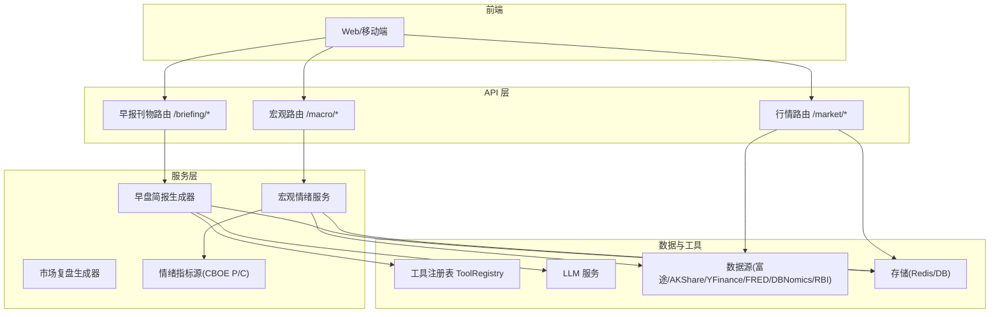
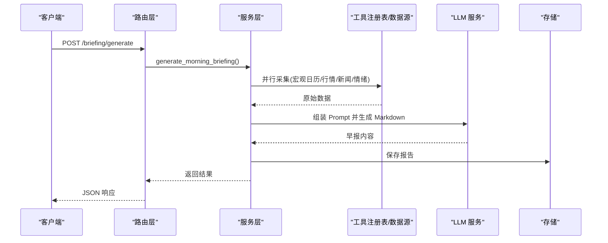
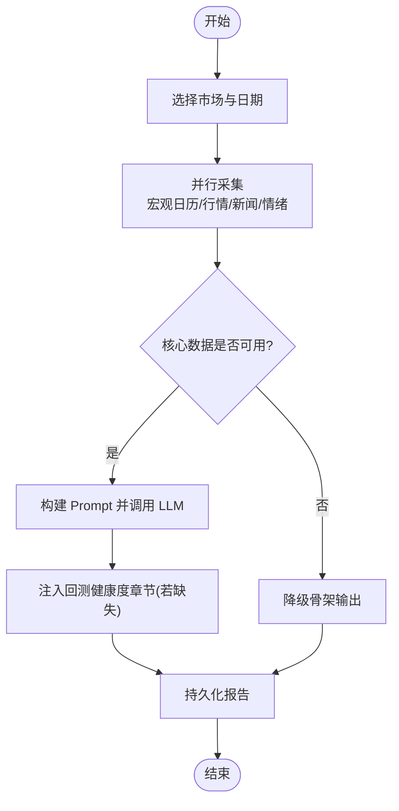
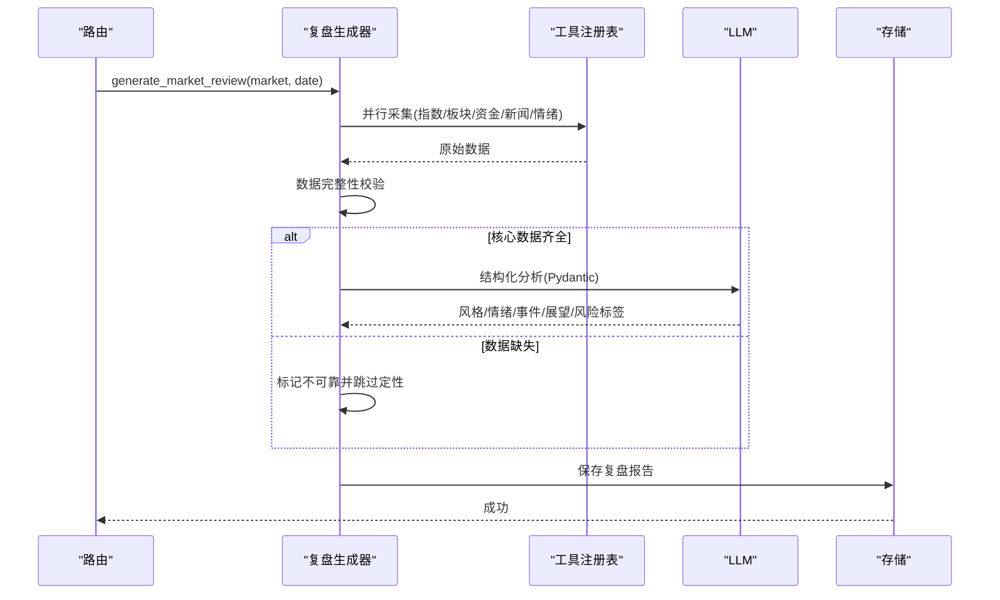
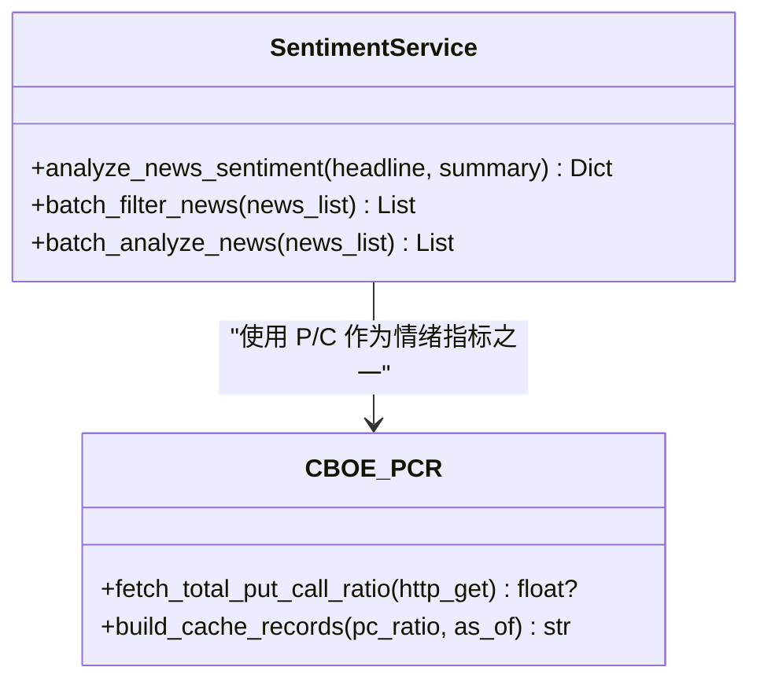
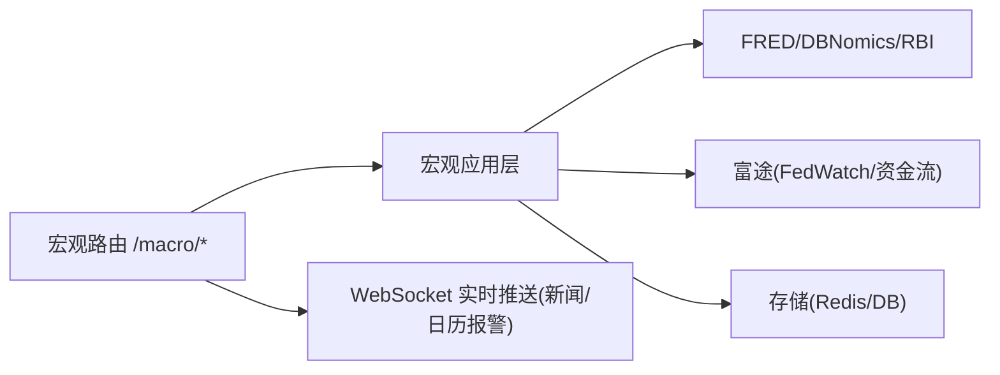
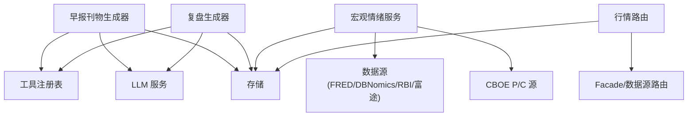

# 市场数据分析

<cite>
**本文引用的文件**
- [backend/services/morning_briefing/generator.py](file://backend/services/morning_briefing/generator.py)
- [backend/services/morning_briefing/__init__.py](file://backend/services/morning_briefing/__init__.py)
- [backend/routers/briefing.py](file://backend/routers/briefing.py)
- [backend/services/market_review/generator.py](file://backend/services/market_review/generator.py)
- [backend/services/macro/sentiment_service.py](file://backend/services/macro/sentiment_service.py)
- [backend/services/sentiment/sources/cboe_pc_ratio.py](file://backend/services/sentiment/sources/cboe_pc_ratio.py)
- [backend/routers/macro.py](file://backend/routers/macro.py)
- [backend/routers/market.py](file://backend/routers/market.py)
</cite>

## 目录
1. [简介](#简介)
2. [项目结构](#项目结构)
3. [核心组件](#核心组件)
4. [架构总览](#架构总览)
5. [详细组件分析](#详细组件分析)
6. [依赖关系分析](#依赖关系分析)
7. [性能考量](#性能考量)
8. [故障排查指南](#故障排查指南)
9. [结论](#结论)
10. [附录](#附录)

## 简介
本技术文档面向投资分析师与量化工程师，系统化说明 Quant Agent 市场数据分析服务的关键能力：市场分析报告生成引擎、晨间简报自动生成、市场情绪分析模块、宏观经济数据跟踪与解读、AI 驱动的市场洞察（大语言模型），以及可视化展示方案。文档聚焦后端实现与数据流，帮助读者理解从数据采集、指标计算、LLM 分析到报告产出的完整链路，并提供可操作的排障建议与性能优化方向。

## 项目结构
围绕“早报刊物”“市场复盘”“宏观/情绪”“行情接口”四大主线组织代码：
- 早报刊物：负责盘前早报的并行采集、LLM 组装与持久化，提供 API 触发与分享读取。
- 市场复盘：收盘后聚合指数、板块、资金流、新闻、情绪等数据，经 LLM 结构化分析并存储。
- 宏观与情绪：提供宏观日历、FRED 序列、FedWatch、新闻流、情绪历史（VIX/P/C/Credit Spread）等。
- 行情与可视化：统一行情接口、WebSocket 实时推送、期权链/IV/策略实验室、资金流向、热力图、订单簿等。

图表来源
- [backend/routers/briefing.py:1-47](file://backend/routers/briefing.py#L1-L47)
- [backend/routers/macro.py:1-296](file://backend/routers/macro.py#L1-L296)
- [backend/routers/market.py:1-800](file://backend/routers/market.py#L1-L800)
- [backend/services/morning_briefing/generator.py:1-351](file://backend/services/morning_briefing/generator.py#L1-L351)
- [backend/services/market_review/generator.py:1-476](file://backend/services/market_review/generator.py#L1-L476)
- [backend/services/macro/sentiment_service.py:1-171](file://backend/services/macro/sentiment_service.py#L1-L171)
- [backend/services/sentiment/sources/cboe_pc_ratio.py:1-120](file://backend/services/sentiment/sources/cboe_pc_ratio.py#L1-L120)

章节来源
- [backend/routers/briefing.py:1-47](file://backend/routers/briefing.py#L1-L47)
- [backend/routers/macro.py:1-296](file://backend/routers/macro.py#L1-L296)
- [backend/routers/market.py:1-800](file://backend/routers/market.py#L1-L800)
- [backend/services/morning_briefing/generator.py:1-351](file://backend/services/morning_briefing/generator.py#L1-L351)
- [backend/services/market_review/generator.py:1-476](file://backend/services/market_review/generator.py#L1-L476)
- [backend/services/macro/sentiment_service.py:1-171](file://backend/services/macro/sentiment_service.py#L1-L171)
- [backend/services/sentiment/sources/cboe_pc_ratio.py:1-120](file://backend/services/sentiment/sources/cboe_pc_ratio.py#L1-L120)

## 核心组件
- 早报刊物生成引擎：按市场维度选择监控标的，并行采集宏观日历、核心标的快照、宏观新闻、情绪序列，调用 LLM 生成 Markdown 早报，并持久化与分享。
- 市场复盘生成引擎：收盘后并行采集指数、板块（行业 ETF 代理）、资金流、新闻、情绪，执行“数据完整性红线”，仅在核心客观数据具备时进行 LLM 结构化分析，输出风格、情绪、事件影响、展望与风险标签。
- 宏观与情绪服务：提供宏观日历、FRED 序列、FedWatch、新闻流、情绪历史；情绪指标包含 CBOE Put/Call Ratio、VIX、信用利差等，并通过 LLM 对新闻做情感打分与提纯。
- 行情与可视化：统一行情接口与 WebSocket 实时推送；期权链、IV 汇总、策略损益实验室、资金流向、筹码分布、热力图、订单簿等，为前端图表与交互式仪表板提供数据支撑。

章节来源
- [backend/services/morning_briefing/generator.py:1-351](file://backend/services/morning_briefing/generator.py#L1-L351)
- [backend/services/market_review/generator.py:1-476](file://backend/services/market_review/generator.py#L1-L476)
- [backend/services/macro/sentiment_service.py:1-171](file://backend/services/macro/sentiment_service.py#L1-L171)
- [backend/services/sentiment/sources/cboe_pc_ratio.py:1-120](file://backend/services/sentiment/sources/cboe_pc_ratio.py#L1-L120)
- [backend/routers/market.py:1-800](file://backend/routers/market.py#L1-L800)

## 架构总览
系统采用“薄路由 + 厚服务”的分层设计：
- 路由层：FastAPI 路由仅做参数校验、鉴权、转发与响应封装。
- 服务层：编排多源数据采集、并发控制、降级与 LLM 分析。
- 数据层：通过工具注册表与数据源路由访问富途、AKShare、YFinance、FRED、DBNomics、RBI 等。
- 存储层：Redis/数据库用于缓存、消息通道与报告持久化。
- 可视化层：REST/WebSocket 接口供 Web/移动端渲染图表与仪表板。

图表来源
- [backend/routers/briefing.py:1-47](file://backend/routers/briefing.py#L1-L47)
- [backend/services/morning_briefing/generator.py:1-351](file://backend/services/morning_briefing/generator.py#L1-L351)

章节来源
- [backend/routers/briefing.py:1-47](file://backend/routers/briefing.py#L1-L47)
- [backend/services/morning_briefing/generator.py:1-351](file://backend/services/morning_briefing/generator.py#L1-L351)

## 详细组件分析

### 早报刊物生成引擎
- 功能要点
  - 市场维度标的清单：全球/美股/港股/A股，自动选择对应监控标的。
  - 并行采集：宏观日历（未来 7 天）、核心标的快照、宏观新闻、情绪序列。
  - LLM 组装：严格遵循模板生成 Markdown，包含宏观高危雷达、核心标的监控、回测健康度速览、主脑综合研判与交易建议。
  - 兜底机制：LLM 失败或数据缺失时，输出降级骨架，保证可用性。
  - 持久化与分享：生成带分享 ID 的报告，支持最新获取与分享链接落地页。

图表来源
- [backend/services/morning_briefing/generator.py:1-351](file://backend/services/morning_briefing/generator.py#L1-L351)

章节来源
- [backend/services/morning_briefing/generator.py:1-351](file://backend/services/morning_briefing/generator.py#L1-L351)
- [backend/routers/briefing.py:1-47](file://backend/routers/briefing.py#L1-L47)
- [backend/services/morning_briefing/__init__.py:1-26](file://backend/services/morning_briefing/__init__.py#L1-L26)

### 市场复盘生成引擎
- 功能要点
  - 并行采集：指数行情、板块涨跌（以行业 ETF 代理）、资金流向、宏观新闻、情绪指标。
  - 数据完整性红线：当核心客观数据（指数/板块/资金）全部缺失时，禁止 LLM 自由发挥，确保零幻觉。
  - LLM 结构化分析：输出市场风格、资金面结论、情绪评分与等级、事件影响总结、关键事件、总结与展望、风险标签。
  - 持久化：生成 MarketDailyReview 并存储，便于后续查询与面板展示。

图表来源
- [backend/services/market_review/generator.py:1-476](file://backend/services/market_review/generator.py#L1-L476)

章节来源
- [backend/services/market_review/generator.py:1-476](file://backend/services/market_review/generator.py#L1-L476)

### 市场情绪分析模块
- 恐慌贪婪指数与情绪风向标
  - 情绪历史：P/C Ratio（CBOE 官方每日统计）、VIX、信用利差等，提供时间序列趋势。
  - 新闻情感打分：对新闻标题与摘要进行 LLM 情感打分（利多/利空/中性），并批量过滤无价值公告。
- CBOE P/C Ratio 抓取
  - 直接抓取 CBOE 每日统计页面，解析 TOTAL PUT/CALL RATIO，写入与 VIX 对齐的 records 结构，避免假数据。

图表来源
- [backend/services/macro/sentiment_service.py:1-171](file://backend/services/macro/sentiment_service.py#L1-L171)
- [backend/services/sentiment/sources/cboe_pc_ratio.py:1-120](file://backend/services/sentiment/sources/cboe_pc_ratio.py#L1-L120)

章节来源
- [backend/services/macro/sentiment_service.py:1-171](file://backend/services/macro/sentiment_service.py#L1-L171)
- [backend/services/sentiment/sources/cboe_pc_ratio.py:1-120](file://backend/services/sentiment/sources/cboe_pc_ratio.py#L1-L120)

### 宏观经济数据分析
- 宏观日历与事件：支持过去与未来 N 天的宏观事件查询，Facade 聚合多源（FRED/DBNomics/RBI）。
- 经济序列与 FedWatch：FRED 时间序列拉取、FedWatch 隐含利率与政策斜率面板。
- 资金流向与板块：跨市场资金流向、北向/南向资金、板块资金流看板。
- 新闻流：宏观新闻分类与实时推送（WebSocket）。

图表来源
- [backend/routers/macro.py:1-296](file://backend/routers/macro.py#L1-L296)

章节来源
- [backend/routers/macro.py:1-296](file://backend/routers/macro.py#L1-L296)

### AI 驱动的市场洞察
- 早报刊物与复盘均基于 LLM 进行自然语言分析与总结，强调“数据完整性红线”与“零幻觉”。
- 新闻情感打分与批量提纯，剔除例行公告，保留重大事件。
- 结构化输出：Pydantic 模型约束 LLM 输出，确保下游可解析与稳定消费。

章节来源
- [backend/services/morning_briefing/generator.py:1-351](file://backend/services/morning_briefing/generator.py#L1-L351)
- [backend/services/market_review/generator.py:1-476](file://backend/services/market_review/generator.py#L1-L476)
- [backend/services/macro/sentiment_service.py:1-171](file://backend/services/macro/sentiment_service.py#L1-L171)

### 可视化展示方案
- 统一行情接口：/market/quote、/market/history、/market/option-chain、/market/option-iv-summary、/market/option-strategy-lab、/market/option-volatility、/market/fund-flow、/market/capital-distribution/{ticker}、/market/top-brokers/{ticker}、/market/capital-flow/{ticker}、/market/heat-map/{market}、/market/order-book、/market/snapshot。
- 实时推送：/market/quotes/ws 多标的 WebSocket 订阅，心跳保活与背压保护。
- 宏观看板：/macro/dashboard、/macro/assets、/macro/earnings、/macro/fed-watch、/macro/news、/macro/calendar、/macro/sentiment-history、/macro/capital-flow-dashboard、/macro/sector-fund-flow。
- 移动端适配：前端 Flutter 应用配合 REST/WebSocket 接口，渲染 K 线、热力图、资金流向、情绪指标等。

章节来源
- [backend/routers/market.py:1-800](file://backend/routers/market.py#L1-L800)
- [backend/routers/macro.py:1-296](file://backend/routers/macro.py#L1-L296)

## 依赖关系分析
- 早报刊物依赖：ToolRegistry（宏观日历、行情、新闻、情绪）、LLMService、存储（保存与分享）。
- 复盘引擎依赖：ToolRegistry（指数、板块 ETF、资金流、新闻、情绪）、LLMService（结构化分析）、存储。
- 宏观/情绪依赖：FRED/DBNomics/RBI/富途、CBOE P/C 抓取、LLM 新闻情感打分。
- 行情接口依赖：DataSourceRegistry/Facade、富途单独通道、Redis 缓存、K 线数仓。

图表来源
- [backend/services/morning_briefing/generator.py:1-351](file://backend/services/morning_briefing/generator.py#L1-L351)
- [backend/services/market_review/generator.py:1-476](file://backend/services/market_review/generator.py#L1-L476)
- [backend/services/macro/sentiment_service.py:1-171](file://backend/services/macro/sentiment_service.py#L1-L171)
- [backend/services/sentiment/sources/cboe_pc_ratio.py:1-120](file://backend/services/sentiment/sources/cboe_pc_ratio.py#L1-L120)
- [backend/routers/market.py:1-800](file://backend/routers/market.py#L1-L800)

章节来源
- [backend/services/morning_briefing/generator.py:1-351](file://backend/services/morning_briefing/generator.py#L1-L351)
- [backend/services/market_review/generator.py:1-476](file://backend/services/market_review/generator.py#L1-L476)
- [backend/services/macro/sentiment_service.py:1-171](file://backend/services/macro/sentiment_service.py#L1-L171)
- [backend/services/sentiment/sources/cboe_pc_ratio.py:1-120](file://backend/services/sentiment/sources/cboe_pc_ratio.py#L1-L120)
- [backend/routers/market.py:1-800](file://backend/routers/market.py#L1-L800)

## 性能考量
- 并发采集：早报刊物与复盘均采用 asyncio.gather 并行采集多源数据，降低端到端延迟。
- 超时与降级：单工具采集设置超时，异常捕获并降级，保证整体流程不中断。
- 缓存与回退：行情批量接口优先 Redis 缓存；富途失败回退至 Facade（AKShare/YFinance）。
- WebSocket 心跳与背压：连接鉴权、心跳超时断开、慢客户端丢弃最旧消息，保障稳定性。
- LLM 成本与稳定性：轻量任务使用轻量模型；温度设为 0 保证 JSON 输出稳定；必要时降级为骨架输出。

[本节为通用指导，无需特定文件引用]

## 故障排查指南
- 早报刊物生成失败
  - 现象：LLM 返回空或过短；部分数据源不可用。
  - 处理：检查 ToolRegistry 工具可用性；查看降级骨架是否输出；确认存储写入成功。
  - 参考路径
    - [backend/services/morning_briefing/generator.py:153-351](file://backend/services/morning_briefing/generator.py#L153-L351)
    - [backend/routers/briefing.py:18-47](file://backend/routers/briefing.py#L18-L47)

- 复盘报告缺少定性分析
  - 现象：风格/事件/展望为空或标注“数据缺失”。
  - 处理：确认指数/板块/资金流是否至少一项有效；检查 LLM 调用与 Pydantic 解析日志。
  - 参考路径
    - [backend/services/market_review/generator.py:325-430](file://backend/services/market_review/generator.py#L325-L430)

- 情绪指标异常
  - 现象：P/C Ratio 缺失或数值异常。
  - 处理：检查 CBOE 页面可达性与解析正则；确认写入 records 格式；核对读侧键名。
  - 参考路径
    - [backend/services/sentiment/sources/cboe_pc_ratio.py:50-120](file://backend/services/sentiment/sources/cboe_pc_ratio.py#L50-L120)

- 行情接口报错
  - 现象：富途通道失败或数据为空。
  - 处理：检查 DataSourceRouter 状态；确认富途节点健康；观察降级逻辑与错误码。
  - 参考路径
    - [backend/routers/market.py:342-545](file://backend/routers/market.py#L342-L545)

章节来源
- [backend/services/morning_briefing/generator.py:153-351](file://backend/services/morning_briefing/generator.py#L153-L351)
- [backend/routers/briefing.py:18-47](file://backend/routers/briefing.py#L18-L47)
- [backend/services/market_review/generator.py:325-430](file://backend/services/market_review/generator.py#L325-L430)
- [backend/services/sentiment/sources/cboe_pc_ratio.py:50-120](file://backend/services/sentiment/sources/cboe_pc_ratio.py#L50-L120)
- [backend/routers/market.py:342-545](file://backend/routers/market.py#L342-L545)

## 结论
Quant Agent 市场数据分析服务通过“并行采集 + 数据完整性红线 + LLM 结构化分析”的架构，实现了早报刊物与复盘报告的自动化生成，覆盖宏观、情绪、资金流与板块等多维因子；同时提供统一的行情与可视化接口，满足投资分析师的日常研究与自动化报告需求。系统在可靠性（降级与兜底）、性能（并发与缓存）与准确性（零幻觉与结构化输出）方面具备工程化实践，适合在生产环境持续演进。

[本节为总结性内容，无需特定文件引用]

## 附录
- 常用接口一览
  - 早报刊物：POST /briefing/generate、GET /briefing/latest、GET /briefing/share/{id}
  - 宏观数据：/macro/calendar、/macro/series、/macro/economic-calendar、/macro/fed-watch、/macro/sentiment-history、/macro/news、/macro/dashboard、/macro/assets、/macro/earnings、/macro/capital-flow-dashboard、/macro/sector-fund-flow
  - 行情与可视化：/market/quote、/market/history、/market/option-chain、/market/option-iv-summary、/market/option-strategy-lab、/market/option-volatility、/market/fund-flow、/market/capital-distribution/{ticker}、/market/top-brokers/{ticker}、/market/capital-flow/{ticker}、/market/heat-map/{market}、/market/order-book、/market/snapshot、/market/quotes/ws

章节来源
- [backend/routers/briefing.py:1-47](file://backend/routers/briefing.py#L1-L47)
- [backend/routers/macro.py:1-296](file://backend/routers/macro.py#L1-L296)
- [backend/routers/market.py:1-800](file://backend/routers/market.py#L1-L800)
